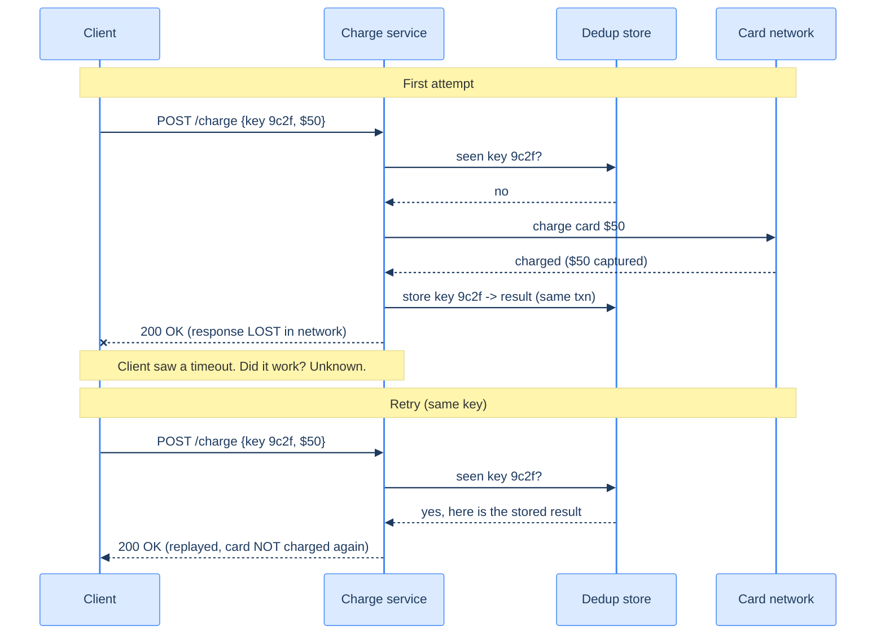
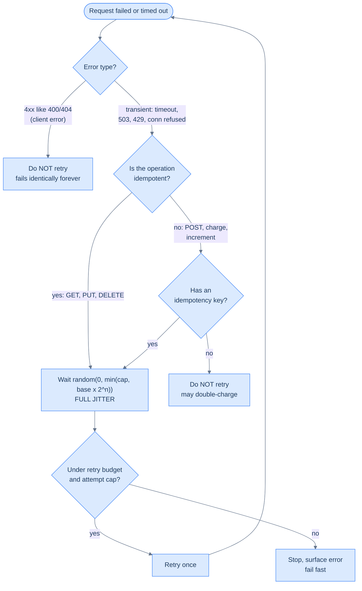

# 19. Idempotency, retries, and backoff

## TL;DR
> The network *will* drop your request, time out the response, or fail you halfway — that's [fallacy #1 of distributed systems](/cortex/system-design/foundations/what-system-design-means). The universal response is to **retry**. But a retry is a loaded gun pointed at two things: **correctness** (retrying a non-idempotent operation like "charge $50" can charge twice) and **availability** (a thousand clients retrying a struggling service in lockstep doubles its load and finishes the job the original blip started). The fix is two disciplines that always travel together: make every retryable operation **idempotent** (safe to repeat, usually via an idempotency key), and retry it with **exponential backoff and jitter** (wait longer each attempt, and randomise the wait so clients don't synchronise into a thundering herd). Get these wrong and you build a system that turns small problems into outages all by itself.

## 1. Motivation

Here is the most common shape of a self-inflicted outage, and it has a name. A service has a one-second hiccup — a garbage-collection pause, a brief lock, a slow disk. A thousand clients waiting on it all time out at the one-second mark. All thousand immediately retry. Now the service, which was just getting back on its feet, is hit with the *original* load **plus** a synchronized wall of a thousand retries. It falls over harder. Those retries time out too, triggering *more* retries. The service is now stuck down — not because the original trigger is still there (the GC pause ended long ago), but because the retries themselves became the load keeping it down.

This is a **metastable failure**: a stable-bad state that sustains itself even after the thing that caused it is gone. A 2021 paper by Nathan Bronson and colleagues, *Metastable Failures in Distributed Systems*, catalogued these across industry and found that **retry-induced load amplification** is one of the most common engines behind them. The cruel part, as they note: an overloaded server and a server with a transient blip send the client the *same signal* — a timeout — so the naïve client retries in exactly the situation where retrying is most harmful.

The good news is that the fixes are well understood and cheap. In 2015, Marc Brooker published *Exponential Backoff And Jitter* on the AWS Architecture Blog — still a load-bearing reference for how AWS builds resilient client libraries — showing that adding **randomness** (jitter) to retry timing dramatically reduces the congestion that retries create. Pair that with **idempotency** so a duplicate retry is harmless, and you've defused both barrels. This lesson is those two ideas.

## 2. Intuition (Analogy)

**Idempotency** is the difference between an **elevator call button** and a **toggle light switch**. Jab the elevator button five times in your impatience — it's still just *one* elevator coming. The operation "call the elevator" is *idempotent*: doing it many times has the same effect as doing it once. A toggle switch is the opposite — flip it twice and you're back where you started; the effect depends on *how many times* you did it. When the network might deliver your "press" zero, one, or two times, you desperately want elevator buttons, not toggles.

The reason you *need* the elevator button is the **ambiguous timeout**, and it has its own everyday shape. You mail a cheque, and weeks pass with no acknowledgement. Did it arrive and the receipt got lost, or did the envelope never make it? You genuinely cannot tell from your end — silence looks identical in both cases. Send a second cheque and you might pay twice; send nothing and you might never pay at all. The only safe move is to make the payment *recognisable* — write a cheque number on it so the recipient can say "I already cashed #1041, I'll shred this copy." That cheque number is an idempotency key, and the postal silence is exactly the timeout DDIA warns about: the network "may return without a result … you simply don't know what happened." You stop trying to read the silence and instead make a second copy harmless.

**Retries with backoff** are like **redialing a busy phone line**. If you get a busy signal, redialing instantly and forever just keeps the line busy. A reasonable human waits a bit, and waits *longer* each time (exponential backoff). And **jitter** is the crucial social grace: if the whole city got the same busy signal at 12:00:00 and everyone redials at *exactly* 12:00:01, you've recreated the jam. If everyone instead waits a *random* few seconds, the calls spread out and the line clears. Synchronized retries are a self-organized denial-of-service; jitter is what un-synchronizes them. (The clearest real-world version: a popular event's tickets go on sale at 10:00 sharp, the site buckles, and tens of thousands of fans all hit *refresh* at 10:00:05 — the refresh storm, not the original load, is what keeps it down.)

## 3. Formal definitions

**Idempotent operation:** one where applying it N ≥ 1 times has the same effect as applying it once. `set x = 5` is idempotent; `x = x + 1` is not. **Safe** is stronger still — no side effects at all (a pure read).

DDIA's canonical pair: "deleting a key in a key-value store is idempotent (deleting the value again has no further effect), whereas incrementing a counter is not idempotent (performing the increment again means the value is incremented twice)." The litmus test is whether the operation describes a *destination* (the row should end up with `name = "A"`; the key should end up gone) or a *delta* (add 1; append a line; charge $50). Destinations are naturally idempotent because the second application finds the work already done; deltas are not, because each application moves the state again. A few more, to build the reflex:

| Operation | Idempotent? | Why |
|---|---|---|
| `UPDATE users SET tier='gold' WHERE id=42` | yes | absolute write — twice = once |
| `INSERT INTO orders ...` (auto-id) | **no** | each call mints a new row |
| `INSERT ... ON CONFLICT DO NOTHING` (client-chosen id) | yes | the conflict swallows the duplicate |
| `balance = balance - 50` | **no** | a delta — double-debits |
| `DELETE FROM sessions WHERE id='abc'` | yes | already-gone is a no-op |
| `INCR counter` / append to a log | **no** | each call moves the state again |
| publish "send welcome email" | **no** (by itself) | two sends = two emails |

The pattern from the table: most *deltas* and *creates* can be **made** idempotent by adding identity. DDIA: "even if an operation is not naturally idempotent, it can often be made idempotent with a bit of extra metadata" — give the create a client-chosen id, tag the delta with the message offset that produced it, attach an idempotency key to the charge. The metadata lets the server recognise a repeat and skip it. That single move — from *natural* to *made* idempotent — is what the rest of this lesson is about.

HTTP bakes this into its method semantics ([RFC 9110](https://www.rfc-editor.org/rfc/rfc9110)):

| Method | Idempotent? | Safe? | Retry a timeout freely? |
|---|---|---|---|
| GET, HEAD | yes | yes | yes |
| PUT, DELETE | yes | no | yes (effect is the same) |
| OPTIONS | yes | yes | yes |
| **POST** | **no** | no | **no — may duplicate** |
| **PATCH** | **no** | no | **no** |

The headline consequence: **`POST` is not idempotent**, so a retried `POST` after a timeout can create a second order, second charge, second user. To retry it safely you must *make* it idempotent with an **idempotency key** — a unique id the client generates and attaches, so the server can recognise "I've already done this one" and return the original result instead of doing it again.

**Retry policy** has three knobs: *which errors* to retry (transient ones — timeouts, connection-refused, 503, 429 — never 400/404), *how many* attempts (a cap), and *how long to wait* between them. The wait strategy:

| Strategy | Wait before attempt n | Problem |
|---|---|---|
| Immediate / constant | 0, or fixed `d` | hammers a struggling server; synchronizes |
| Linear | `n · d` | better, still synchronizes |
| **Exponential** | `base · 2ⁿ` (capped) | backs off fast, but all clients still align |
| **Exponential + full jitter** | `random(0, min(cap, base · 2ⁿ))` | backs off *and* de-synchronizes — the recommended default |

Brooker's post compares jitter variants: **Full Jitter** (`random(0, cap_n)`), **Equal Jitter** (half fixed + half random), and **Decorrelated Jitter** (the next wait grows from the last random value). Full jitter is the simple, strong default.

## 4. Worked Example — a timeout that double-charges, and a retry storm

**Part 1 — correctness.** A client sends `POST /charge {order: 7782, amount: 5000}`. The server charges the card successfully, but the *response* is lost to a network blip — the client sees a **timeout**. Did the charge happen? The client cannot tell. The naïve retry sends the `POST` again; the server, with no memory of the first, **charges the card a second time.** A timeout is *ambiguous* — it never tells you whether the operation succeeded — and `POST` is not idempotent, so the retry is a coin flip on double-billing.

This ambiguity is not sloppy engineering you can fix with a better library; it is *fundamental* to networks. DDIA names it precisely: a network request "has another possible outcome [beyond return-or-throw]: it may return without a result, because of a timeout. In that case, you simply don't know what happened" — and crucially, "if you retry a failed network request, it could happen that the previous request actually got through, and only the response was lost. In that case, retrying will cause the action to be performed multiple times, unless you build a mechanism for deduplication (idempotence) into the protocol." Read that twice: **the duplicate is created by the very act of retrying, in exactly the case (success-but-lost-ack) where the retry was unnecessary.** You cannot distinguish "it failed, please retry" from "it succeeded, but you didn't hear me" — the two look identical from the client's chair. So you stop trying to tell them apart and instead make the retry *harmless*.

The fix is an idempotency key:

```
POST /charge
Idempotency-Key: 9c2f...   ← client-generated, stable across retries
{order: 7782, amount: 5000}
```

The server records the key with the result inside the *same transaction* as the charge. The retry presents the same key, the server sees "already processed `9c2f`," and returns the **original** response without charging again. Now the retry is safe — we've turned a toggle into an elevator button. (This is exactly Stripe's `Idempotency-Key` mechanism; we use it in [Capstone 49 — payments](/cortex/system-design/capstones/payment-system).)

Trace the two attempts side by side. On the first, the charge succeeds but the `200 OK` evaporates — the client is left holding a timeout it cannot interpret. On the retry, the *same* key turns the dedup store into the system's memory: it replays the stored result and the card is never touched again.



<p align="center"><strong>The retry is identical on the wire; the dedup store is what makes the second one harmless.</strong></p>

The single most important detail is the line `store key 9c2f -> result (same txn)`. DDIA's recipe for exactly-once processing is to record the operation's unique ID and apply its side effects "within the same transaction," so that "recording the message ID in the database makes the message processing idempotent." If you instead write the key in one transaction and perform the effect in another, you have re-opened the very window you were trying to close — which is precisely what Exercise 3 below dissects.

**Part 2 — availability.** The payment service has a one-second GC pause. 1,000 in-flight clients all time out at 1.0s and all retry. With a **fixed 1-second retry**, all 1,000 retries land in the same ~10ms window at t≈2s — a synchronized spike of 2× load onto a service that's still standing up. It buckles; those retries time out; at t≈3s another synchronized wall hits. **Metastable: the retries are now the load keeping it down**, and the original GC pause is ancient history.

With **exponential backoff + full jitter**, each client waits `random(0, min(cap, base·2ⁿ))`. The 1,000 retries spread across a widening window instead of arriving together; the service sees a gentle trickle it can absorb while it recovers, and the herd never re-forms. Add a **retry budget** (e.g. retries may be at most 10% of total requests) and the system *refuses* to amplify load past a safe ceiling even under sustained failure.

## 5. Build It

Full-jitter retry in Python — the `random()` is the entire difference between "helps" and "hurts":

```python
import random, time

def retry(fn, max_attempts=6, base=0.1, cap=20.0):
    for attempt in range(max_attempts):
        try:
            return fn()
        except Transient as e:           # ONLY retry transient errors (timeout, 503, 429)
            if attempt == max_attempts - 1:
                raise
            ceiling = min(cap, base * (2 ** attempt))   # exponential ceiling
            sleep = random.uniform(0, ceiling)          # ← FULL JITTER
            time.sleep(sleep)
        # a 4xx like 400/404 is NOT caught here — never retry a client error
```

Delete the `random.uniform` and sleep `ceiling` directly and you get plain exponential backoff: better than fixed delay, but every client still aligns to the same boundaries (1s, 2s, 4s…) and re-forms the herd. The jitter scatters them across the whole interval. Note the other two senior details baked in: only `Transient` exceptions are retried (a `400` is retried *zero* times — it'll fail identically forever), and there's a hard `max_attempts` cap so a truly-down dependency doesn't generate infinite load.

That `except Transient` line hides a decision the code makes silently on every failure. Spell it out and it becomes a checklist you can apply to any call site — *before* you reach for the retry loop, walk these gates in order:



<p align="center"><strong>Two gates decide whether you may retry at all (right error? safe to repeat?); two more decide whether you should keep going (jittered wait, within budget).</strong></p>

The flowchart encodes the whole lesson: a non-transient error never gets a retry, a non-idempotent operation without a key never gets a retry, and even a perfectly retryable call eventually hits the budget and *stops* rather than amplifying load forever. DDIA frames the idempotency gate cleanly — "deleting a key in a key-value store is idempotent … whereas incrementing a counter is not idempotent" — and notes that even a non-idempotent operation "can often be made idempotent with a bit of extra metadata," which is exactly what the idempotency-key branch buys you.

## 6. Trade-offs

| Strategy | Load amplification under failure | Recovery behaviour | Use |
|---|---|---|---|
| No retry | none | user sees every transient blip | when the caller can tolerate failures / will retry itself |
| Fixed delay | high — synchronized waves | herd re-forms each round | almost never |
| Exponential, no jitter | medium — aligned boundaries | herd thins but still pulses | better than fixed, still risky at scale |
| **Exponential + full jitter** | **low — spread out** | smooth drain, no herd | **the default for client retries** |
| + **retry budget / circuit breaker** | **bounded by design** | sheds load, fails fast | high-scale, fan-out, or critical paths |

The deeper trade-off is **latency vs load**. Aggressive retries (short waits, many attempts) hide more transient failures from users — lower perceived error rate — but amplify load most when things go wrong, exactly when you can least afford it. Conservative retries (longer waits, fewer attempts, a budget) protect the server at the cost of surfacing a few more errors to users. At small scale, lean toward hiding errors; at large scale or on a shared dependency, lean toward protecting the server — a retry storm hurts *everyone*, not just the unlucky request.

## 7. Edge cases and failure modes

- **Retrying a non-idempotent operation.** Retrying `POST /charge` after a timeout can double-bill. Either make it idempotent (idempotency key) or do not retry it — there is no safe middle. The timeout's ambiguity is the trap: success and failure look identical to the caller.
- **Retry amplification across layers.** The browser retries the gateway, the gateway retries the service, the service retries the database — each layer multiplies. Three layers each retrying 3× is **27× load** on the database from one user action. The rule: **retry at one layer only** (usually the lowest that can see a transient error), and give every layer a *retry budget* so the multiplication can't run away.
- **Metastable failure.** Retrying *into* an overloaded service sustains the overload after the trigger is gone (§1). The defence is to *stop retrying when the signal says overload*: a [circuit breaker](/cortex/system-design/distributed-patterns/circuit-breakers-and-bulkheads) that trips open and fails fast, plus load shedding at the server so it sheds rather than collapses.
- **Synchronized thundering herd on recovery.** When a downed dependency comes back, every client that's been backing off may retry at once and knock it straight back down. Full jitter spreads the recovery wave; without it, recovery itself is a herd.
- **Ignoring server backpressure.** A `429 Too Many Requests` or `503` often carries a `Retry-After` header telling you exactly how long to wait. Ignoring it and retrying on your own schedule fights the server's own recovery. Honour `Retry-After`.
- **Idempotency-key lifecycle.** Keys need a retention window (how long do you remember "already done"?), must be stored *atomically with the effect* (or a crash between them re-opens the double-do window — see [Lesson 17 §4](/cortex/system-design/distributed-patterns/message-queues-and-streams)), and must key on the *operation*, not the request bytes (a client retrying with a regenerated key defeats the whole mechanism).
- **Retrying slow vs failed.** A request that's merely *slow* shouldn't be retried as if it *failed* — you now have two in flight doing the same work (a "hedged request" only helps for idempotent reads, and even then doubles load). Set timeouts deliberately; a too-tight timeout turns healthy-but-slow into a retry storm.

## 8. Practice

> **Exercise 1 — Which can you retry blindly?**
> For each, say whether a retry-on-timeout is safe as-is, and if not, the minimum fix: (a) `GET /users/42`; (b) `PUT /users/42 {name:"A"}`; (c) `POST /transfers {from, to, amount}`; (d) `DELETE /sessions/abc`.
>
> <details>
> <summary>Solution</summary>
>
> (a) **Safe** — GET is idempotent and safe; retry freely. (b) **Safe** — PUT sets an absolute value, so applying it twice = once. (c) **Not safe** — POST creating a transfer can double-transfer on retry; minimum fix is an **idempotency key** (or model it as an idempotent PUT to a client-chosen transfer id). (d) **Safe** — DELETE is idempotent; deleting an already-deleted session is a no-op (return 204/404, not an error). The pattern: GET/PUT/DELETE retry freely; **POST needs an idempotency key** before you may retry it.
>
> </details>

> **Exercise 2 — Diagnose the retry storm.**
> A service normally handles 5,000 req/s. It has a 2-second blip. Clients use a fixed 2-second retry, 3 attempts. Sketch what the load looks like over the next 10 seconds, and change exactly one thing to fix it.
>
> <details>
> <summary>Solution</summary>
>
> At the blip, ~10,000 requests (2s × 5,000/s) time out together. With a *fixed* 2s retry they all retry at ≈t+2s as one ~10,000-request spike on top of the normal 5,000/s — a momentary 3×+ load that re-buries the recovering service, causing those to time out and re-spike at t+4s, then t+6s (3 attempts). The herd pulses every 2 seconds. **One change: replace the fixed delay with exponential backoff + full jitter.** The same ~10,000 retries now spread smoothly across a widening, randomized window instead of arriving in lockstep, so the service drains them while recovering. (A retry budget would also cap the amplification — but jitter is the single highest-leverage change.)
>
> </details>

> **Exercise 3 — Idempotency key placement.**
> A teammate stores the idempotency key in one table and performs the charge against the payment API separately: `record_key(k); charge_api(...)`. Describe the crash window that still double-charges, and fix it.
>
> <details>
> <summary>Solution</summary>
>
> Crash *after* `record_key(k)` but *before* `charge_api(...)` returns/commits: the key says "done," but the charge never happened — a retry sees the key and **skips a charge that was never made** (a *lost* charge). Or, if the order is `charge_api(); record_key()` and it crashes between them, the charge happened but the key wasn't recorded — the retry **charges again** (double charge). Either ordering has a hole because the two writes aren't atomic. Fix: make the dedup check, the charge, and the key-record **one atomic unit** — e.g. send the idempotency key *to* the payment API (Stripe does this) so the dedup lives on the same side as the side effect, or use a transactional outbox ([Lesson 20](/cortex/system-design/distributed-patterns/outbox-pattern-and-cdc)).
>
> </details>

## Your Turn

Before you move on, check your understanding with the coach — explain the idea, apply it, weigh the trade-offs, then defend your reasoning.

<div class="concept-coach"></div>

## In the Wild

- **Kleppmann, *Designing Data-Intensive Applications* (2nd ed.)** — the ground truth for this lesson. **Ch. 8 (Transactions)** gives the recipe used throughout: record the operation's unique ID in the database *in the same transaction* as its side effects, so "recording the message ID in the database makes the message processing idempotent" — and shows you reach exactly-once *without* distributed transactions, just local atomicity (the basis of §4's idempotency key and Exercise 3). **Ch. 9 (The Trouble with Distributed Systems)** is the source of the ambiguity: a timed-out request means "you simply don't know what happened," and "if you retry … the previous request actually got through, and only the response was lost," creating the duplicate the key exists to suppress.
- **[Marc Brooker — "Exponential Backoff And Jitter"](https://aws.amazon.com/blogs/architecture/exponential-backoff-and-jitter/)** (AWS Architecture Blog, 2015) — the canonical demonstration that jitter beats plain exponential backoff, with the Full/Equal/Decorrelated variants. Short and worth reading in full.
- **[Amazon Builders' Library — "Timeouts, retries, and backoff with jitter"](https://aws.amazon.com/builders-library/timeouts-retries-and-backoff-with-jitter/)** — AWS's production playbook: retry budgets, when *not* to retry, and how it composes with circuit breakers.
- **[Bronson et al. — "Metastable Failures in Distributed Systems"](https://sigops.org/s/conferences/hotos/2021/papers/hotos21-s11-bronson.pdf)** (HotOS 2021) — why retry amplification keeps systems down after the trigger is gone, and how to break the loop. The theory behind §1.
- **[Stripe — Idempotent requests](https://docs.stripe.com/api/idempotent_requests)** — the reference implementation of an `Idempotency-Key` header on a money API: how keys are scoped, stored, and expired.
- **[Google SRE Book — "Addressing Cascading Failures"](https://sre.google/sre-book/addressing-cascading-failures/)** — retries as a cause of cascades, with the load-amplification math and the mitigations (budgets, deadlines, shedding).

---

> **Next:** [20. The outbox pattern and CDC](/cortex/system-design/distributed-patterns/outbox-pattern-and-cdc) — idempotency keys and message buses both assume your database write and your message publish stay in sync. They don't, unless you make them: the outbox pattern and change-data-capture are how you atomically "save the row *and* emit the event" without a distributed transaction.
