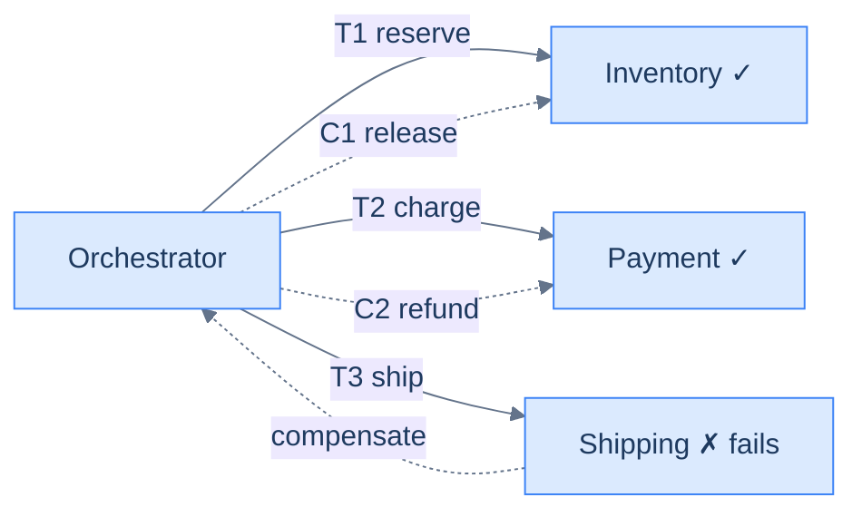

# 19. Sagas and distributed transactions

## TL;DR
> A single business action — "place an order" — often means touching several services: reserve inventory, charge the card, book a courier. Each owns its own database, so there is **no global transaction** to make all three commit or roll back together (and a distributed transaction / two-phase commit across them is too fragile to lean on — [Lesson 14](/cortex/system-design/building-blocks/consensus-paxos-and-raft)). A **saga** gets all-or-nothing *behaviour* instead: run the steps as a sequence of **local** transactions, and if step *k* fails, run **compensating transactions** to semantically undo steps *k−1 … 1*. Compensation is a real action with real cost (a *refund*, not a magic rewind), and a saga deliberately gives up **isolation** — other transactions can see the half-done middle. You coordinate it one of two ways: **orchestration** (a central conductor issues commands) or **choreography** (services react to each other's events). The idea is old — Garcia-Molina and Salem published *Sagas* in 1987 — and it's everywhere in microservices today.

## 1. Motivation

In **1987**, Hector Garcia-Molina and Kenneth Salem published a paper called *Sagas* at ACM SIGMOD. Their problem was databases, not microservices: a **long-lived transaction** (say, a batch job that runs for an hour) holds locks the whole time, blocking everyone else. Their fix was to chop the long transaction into a *sequence* of small transactions that each commit immediately — and, crucially, to attach to each one a **compensating transaction** that semantically undoes it. The database guarantees that either the whole sequence completes, or compensations run to clean up a partial execution. They called that sequence a **saga**.

The paper sat quietly for ~25 years until microservices made its problem everyone's problem. Consider booking a trip: you reserve a flight (airline's system), a hotel (hotel's system), and a rental car (a third company's system). There is no database on Earth that can wrap a transaction around all three — they're owned by different companies. So what happens when the flight and hotel succeed but the car booking fails? You can't "roll back." You have to **actively cancel** the flight and the hotel — compensations, possibly forfeiting a deposit. That's a saga, and it's why the pattern came roaring back: tools like Uber's **Cadence** and its successor **Temporal**, and AWS **Step Functions**, exist largely to run sagas reliably across services. This lesson is how to think in them.

## 2. Intuition (Analogy)

Planning a wedding is a saga. You book three vendors in sequence: the **venue**, the **caterer**, the **band**. Each booking is *committed the moment you sign* — you pay a deposit, it's real, the vendor has your slot. There is no escrow that holds all three bookings "pending" until you're sure of the whole plan; the world doesn't work that way.

Now the band cancels on you. There is no "undo" button that rewinds the venue and caterer to never-booked. Instead you must *do work to compensate*: call the caterer and cancel (and probably eat the deposit), call the venue and cancel (more deposit). The compensation is a **real action with real consequences** — money lost, slots freed — not a clean database rollback. And here's the uncomfortable part: between booking the venue and the band falling through, the venue was genuinely *unavailable* to other couples. The world saw your half-finished plan. A saga has no isolation; the in-between states are visible.

That's the whole model. Local commits you can't atomically undo, compensations that are themselves real operations, and a window where the partial state leaks.

## 3. Formal definitions

**Distributed transaction (2PC).** A coordinator asks every participant to *prepare* (promise they can commit), and if all say yes, tells them to *commit*. It gives true atomicity + isolation across systems — but it **blocks** on the slowest participant, holds locks the whole time, and doesn't survive coordinator failure cleanly (a participant can be left "in doubt" forever). For cross-service writes, the industry mostly avoids it.

**Saga.** A sequence of local transactions `T₁, T₂, … Tₙ`, each committing independently in its own service, with a matching **compensating transaction** `Cᵢ` for each `Tᵢ`. Two recovery directions:

- **Backward recovery** — if `Tₖ` fails, run `Cₖ₋₁, Cₖ₋₂, … C₁` to undo the work already done.
- **Forward recovery** — for steps that *must* eventually succeed, keep retrying `Tₖ` (with backoff, [Lesson 17](/cortex/system-design/distributed-patterns/idempotency-retries-backoff)) rather than unwinding.

A compensation is a **semantic undo**, not a rollback: the inverse of "charge $50" is "refund $50" (a new transaction that leaves an audit trail), not "pretend the charge never happened."

**ACID minus I.** A saga keeps Atomicity *of outcome* (all-or-nothing eventually), Consistency, and Durability — but **sacrifices Isolation**. Intermediate states are visible to other transactions, so you get "dirty reads" of the half-done saga (see §4 and §7).

**Two coordination styles:**

| | **Orchestration** | **Choreography** |
|---|---|---|
| Control | a central **orchestrator** issues commands and tracks state | none — each service reacts to **events** |
| Flow lives | in one place (the orchestrator) | spread across every service's event handlers |
| Pros | explicit, debuggable, easy to see the whole flow | decoupled, no central component, scales naturally |
| Cons | the orchestrator is a component to build + keep alive | flow is implicit — hard to follow, easy to create cycles |
| Good for | complex flows, many steps, branching | simple, few-step flows with stable participants |

## 4. Worked Example — an order saga that fails on the last step

Three services, three local transactions, in order:

1. **`T₁` Inventory** — reserve 1 unit of SKU-42. (`C₁`: release the reservation.)
2. **`T₂` Payment** — charge the customer $50. (`C₂`: refund $50.)
3. **`T₃` Shipping** — create a shipment. (`C₃`: cancel the shipment.)

**Happy path:** `T₁ → T₂ → T₃` all commit; the order is placed. **Failure path:** `T₁` and `T₂` succeed, but `T₃` fails — every courier is down. There is no global rollback. The orchestrator runs **backward recovery**: `C₂` refund the $50, then `C₁` release the inventory. The customer ends up charged nothing and the stock is back; the *behaviour* was all-or-nothing even though, for a few seconds, money had really moved.

**The isolation failure, made concrete.** Between `T₁` (reserve inventory) and the `T₃` failure, the inventory count was genuinely lower. Another customer's order, running concurrently, may have seen "only 0 left" and been refused — reacting to an intermediate saga state that was about to be undone. That's the lost-isolation tax: a saga's middle is *visible*, so a competing transaction can make decisions on data that's still in flight. (This is the same "what consistency does the reader see?" question from [Lesson 13](/cortex/system-design/building-blocks/consistency-models), now spanning services.)



<p align="center"><strong>Orchestrated order saga: forward to the failure, then compensate in reverse (C2 refund, C1 release).</strong></p>

## 5. Build It

An illustrative orchestrator — a saga is a list of `(do, undo)` steps; run forward, and on any failure, run the *undos* for the steps that completed, in reverse:

```python
def run_saga(steps):                 # steps = [(do, undo), ...]
    completed = []
    try:
        for do, undo in steps:
            do()                     # local transaction in some service
            completed.append(undo)   # remember how to undo it
    except StepFailed:
        for undo in reversed(completed):   # backward recovery
            run_with_retry(undo)     # compensations MUST be idempotent + retryable
        raise SagaAborted

run_saga([
    (reserve_inventory, release_inventory),
    (charge_payment,    refund_payment),
    (create_shipment,   cancel_shipment),
])
```

Two senior details hide in those eight lines. First, `run_with_retry` on the *compensations*: a compensation that fails leaves the system half-undone, which is worse than the original failure — so compensations get the full retry/backoff treatment and must be idempotent. Second, this toy loses all its state if the process crashes mid-saga — which is exactly why production reaches for a **durable workflow engine** (Temporal, AWS Step Functions): they persist the saga's state after every step so a crash resumes from where it left off rather than leaving an order stuck half-charged.

## 6. Trade-offs

**Orchestration vs choreography** is the first decision (table in §3). Orchestration centralises the flow — you can open one file and read the whole order lifecycle, which is gold for debugging — at the cost of building and operating the orchestrator. Choreography removes the central component and couples services only through events, but the flow becomes *emergent*: to answer "what happens after payment?" you must grep every service's event handlers, and it's easy to accidentally create event cycles. Rule of thumb: **few steps and stable → choreography; many steps, branching, or needs auditing → orchestration.**

**Saga vs distributed transaction (2PC):**

| | 2PC | Saga |
|---|---|---|
| Isolation | full (locks held) | **none** (intermediate states visible) |
| Availability | low — blocks on slowest, in-doubt on coordinator loss | high — each step commits locally |
| Latency | bounded by slowest participant + lock hold | sum of local steps, no global lock |
| Failure handling | automatic rollback | **manual** compensations you must write |
| Use when | few participants, short, isolation critical | services, long-running, availability critical |

And the most important trade: **build an orchestrator yourself vs use a durable-execution engine.** A hand-rolled orchestrator is fine for one simple saga; once you have many, or need the saga to survive crashes and run for hours/days, a managed engine (Temporal/Cadence's "durable execution," or Step Functions) pays for itself by handling state persistence, retries, and timeouts for you.

## 7. Edge cases and failure modes

- **Lost isolation / dirty reads.** Other transactions see the saga's half-done state (§4). Countermeasures: a **semantic lock** (mark the row `PENDING` so others know not to trust it), **commutative updates** (increments that don't conflict), or **re-reads** before acting. You can't get true isolation back — you manage its absence.
- **Compensations fail too.** `C₂` (refund) can fail just like `T₂` did. A failed compensation can't simply be dropped — it leaves money in limbo. Compensations must be **idempotent and retried hard**, and a compensation that *keeps* failing must page a human, not silently give up.
- **Some actions can't be compensated.** You can't un-send an email or un-launch a missile. Order the saga so **irreversible steps come last** (after everything reversible has succeeded), or model the irreversible thing as a **reservation** first (reserve seat → confirm) so the "reserve" is what you compensate. The step after which you can no longer abort is the *pivot* — past it, you can only go forward.
- **Choreography flow becomes unfollowable.** Event-driven sagas with many participants turn into a "pinball machine" where no one can say what the full flow is, and event cycles can form. When you can't draw the flow on a whiteboard, switch to orchestration.
- **Orchestrator state must be durable.** A crashed orchestrator that loses its place leaves sagas stranded (order charged, never shipped, never compensated). Persist saga state after every step — this is the entire reason durable-execution engines exist.
- **Every step and compensation must be idempotent.** Retries ([Lesson 17](/cortex/system-design/distributed-patterns/idempotency-retries-backoff)) and at-least-once events ([Lesson 15](/cortex/system-design/distributed-patterns/message-queues-and-streams)) mean a step can run twice; "charge" and "refund" must dedupe on a saga/step id or you'll double-charge or double-refund.
- **A saga is not a transaction.** There is no instant in which the operation is atomically all-or-nothing; there's a *window* of partial state. Design the product for that window ("your order is processing"), don't pretend it doesn't exist.

## 8. Practice

> **Exercise 1 — Write the compensations.**
> A hotel-booking saga: `T₁` charge deposit, `T₂` reserve room, `T₃` send confirmation email. Write each compensation, and identify which step is the *pivot* (the point of no return).
>
> <details>
> <summary>Solution</summary>
>
> `C₁` = refund deposit; `C₂` = release the room reservation; `C₃` = **none — you can't un-send an email.** Because the email is irreversible, it must be the **last** step, *after* the deposit and reservation have both succeeded — so the **pivot is just before `T₃`**. Up to that point a failure can be fully compensated (refund + release); once the confirmation email goes out, the saga must complete forward (you'd send a *correction* email, not "un-send"). General rule: put irreversible actions last and treat the moment before them as the pivot.
>
> </details>

> **Exercise 2 — Orchestration or choreography?**
> (a) A 3-step signup flow (create account → provision workspace → send welcome), stable for years. (b) A 9-step loan-origination workflow with branching (credit check → … → manual review → …), audited by regulators. Choose for each.
>
> <details>
> <summary>Solution</summary>
>
> (a) **Choreography** is fine — three stable steps, low complexity; each service reacts to the previous event with little coordination overhead, and you don't need a central component. (b) **Orchestration** — 9 steps, branching, *and* a regulatory audit requirement means you need the entire flow explicit, inspectable, and logged in one place; a central orchestrator (ideally a durable engine like Temporal/Step Functions) gives you the state machine, the audit trail, and crash-safe long-running execution. The deciding factors were **step count, branching, and the need to see/audit the whole flow** — all of which favour orchestration.
>
> </details>

> **Exercise 3 — The double-compensation bug.**
> An order saga fails at shipping. The orchestrator issues `C₂` (refund), but the refund response times out, so the orchestrator retries `C₂` — and the customer is refunded **twice**. What went wrong, and what's the fix?
>
> <details>
> <summary>Solution</summary>
>
> The compensation isn't **idempotent**. A timeout is ambiguous ([Lesson 17](/cortex/system-design/distributed-patterns/idempotency-retries-backoff)) — the first refund may have succeeded — so the retry issues a *second* refund. Fix: give each compensation a stable **idempotency key** (e.g. `saga_id + step + "compensate"`) so the payment service recognises the retry and returns the original refund instead of issuing a new one. The same discipline applies to the forward steps. The deeper lesson: compensations are *real transactions* subject to the exact same at-least-once/timeout hazards as the forward path, so they need the exact same idempotency protection — a saga that retries non-idempotent compensations just converts one bug into a refund leak.
>
> </details>

## In the Wild

- **[Garcia-Molina & Salem — "Sagas"](https://www.cs.cornell.edu/andru/cs711/2002fa/reading/sagas.pdf)** (ACM SIGMOD 1987) — the original paper: long-lived transactions, compensating transactions, and the all-or-compensate guarantee. Short, foundational, and still the clearest statement of the idea.
- **[Chris Richardson — Pattern: Saga](https://microservices.io/patterns/data/saga.html)** (microservices.io) — the modern microservices framing, with orchestration vs choreography, compensations, and the lack-of-isolation countermeasures spelled out.
- **[Caitie McCaffrey — "Applying the Saga Pattern"](https://www.youtube.com/watch?v=xDuwrtwYHu8)** (GOTO 2015) — the talk that re-popularised sagas for distributed systems, using the book-a-hotel/flight/car example and the failure/compensation cases.
- **[Temporal](https://temporal.io/)** (evolved from Uber's **Cadence**) — a durable-execution engine purpose-built to run sagas/workflows that survive crashes; read how "durable execution" persists workflow state so compensations never get lost.
- **[AWS Step Functions — saga pattern](https://docs.aws.amazon.com/prescriptive-guidance/latest/modernization-data-persistence/saga-pattern.html)** — the managed-orchestrator take: a state machine with explicit catch/compensate transitions. A good concrete contrast to a hand-rolled orchestrator.

---

> **Next:** [20. Rate limiting](/cortex/system-design/distributed-patterns/rate-limiting) — sagas, retries, and fan-out all generate bursts of traffic, and the way you protect a service from being overwhelmed (by clients, by retries, by a noisy neighbour) is rate limiting. We'll implement token bucket, leaky bucket, and sliding window, and see why the naïve "fixed window" counter lets through double the traffic you intended.
