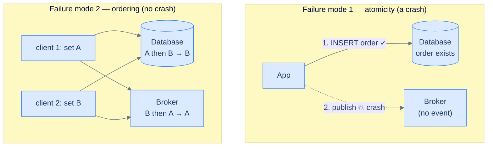
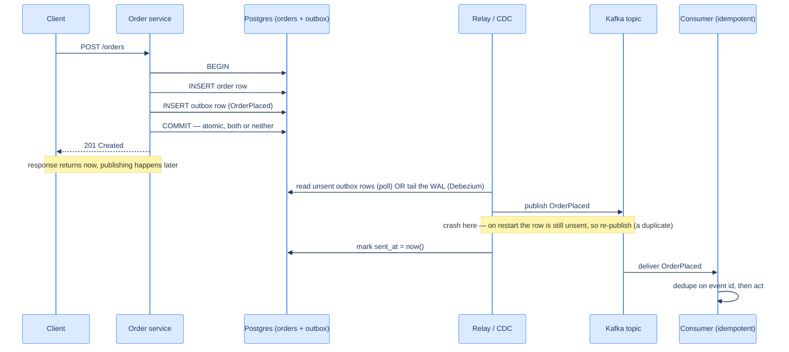
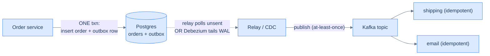

# 20. The outbox pattern and CDC

## TL;DR
> Almost every service eventually needs to do two things at once: **write to its database** and **publish an event** ("order placed," "user signed up"). The trap is that the database and the message bus are two separate systems with no shared transaction — so if you commit the row and then crash before publishing, you have an order nobody downstream ever hears about; publish first and then fail to commit, and you've announced an order that doesn't exist. This is the **dual-write problem**, and it produces *silent* inconsistency — the worst kind. The fix is to stop doing two writes: make the event a **consequence of the one database write**. Two ways to do that — the **transactional outbox** (write the event into an outbox table *in the same transaction* as the business data, then relay it) and **change-data-capture / CDC** (read the database's own write-ahead log and turn committed changes into events). Both deliver at-least-once, so your consumers still need to be idempotent ([Lesson 19](/cortex/system-design/distributed-patterns/idempotency-retries-backoff)).

## 1. Motivation

Picture the simplest possible order service. A request comes in; the handler does two things:

```
db.insert(order)          # 1. save it
kafka.publish(OrderPlaced) # 2. tell everyone
```

It works in every test. Then, in production, the process crashes in the half-second *between* line 1 and line 2 — a deploy, an OOM, a node reboot. The order is in the database. The `OrderPlaced` event never went out. Shipping never ships it, the confirmation email never sends, analytics never counts it. The customer's money is taken and the order vanishes into a void. Flip the two lines and it's just as bad the other way: you publish `OrderPlaced`, then the transaction rolls back, and now five downstream systems are reacting to an order that doesn't exist.

This is the **dual-write problem**: two independent systems (a database and a message bus) that you need to update atomically, but can't — because they don't share a transaction, and a distributed transaction across them (two-phase commit, [Lesson 14](/cortex/system-design/building-blocks/consensus-paxos-and-raft)) is fragile enough that most teams rightly refuse it. The failure is *silent*: nothing errors, the data just quietly drifts out of sync.

And the crash above is only *one* of the two ways dual writes betray you. There's a second, subtler one — **ordering** — that bites even when nothing crashes. Two requests arrive almost together: client 1 sets a value to `A`, client 2 sets it to `B`. Each writes the database first, then the bus. The database happens to apply `A` then `B`, so it ends on `B`. But the two bus publishes interleave the other way — `B`'s publish lands before `A`'s — so every downstream consumer ends on `A`. Now the source of truth says `B` and the search index, cache, and warehouse all say `A`, *permanently*, and no error was ever raised. DDIA draws this out as the core hazard: dual writes have *two* failure modes — a **fault-tolerance** problem (one write succeeds, the other fails on a crash) **and** a **concurrency** problem (concurrent writes get applied to the two systems in different orders). Two-phase commit only addresses the first; it does nothing for the second.



<p align="center"><strong>Two ways dual writes drift. Top: a crash between the two writes loses the event (an atomicity fault). Bottom: with no crash at all, concurrent writes reach the DB and the broker in different orders, so they disagree forever (a concurrency fault).</strong></p>

The industry settled on a better idea years ago: **don't do two writes.** Write once — to your database — and make the event a downstream *projection* of that single committed fact. The ordering problem then evaporates for the same reason it never troubles database *replicas*: a single-leader database already decides one definitive order for its writes, and its followers replay that exact order. CDC simply makes your derived systems (search index, cache, warehouse, other services) into *followers of that same leader* — they inherit the database's ordering instead of racing it. LinkedIn built **Databus** for exactly this (presented at ACM SOCC in 2012); Netflix built **DBLog** (2019) under its "Delta" platform; and the open-source **Debezium** turned the technique into a standard tool. This lesson is the two patterns underneath all of them.

## 2. Intuition (Analogy)

You're throwing a party. Two records must stay in sync: your **guest list** (a notebook) and the **invitations you've mailed**. The dual-write version is: scratch a name into the notebook, then walk to the mailbox and post their invite. If you get distracted between the two — the phone rings, you forget — the notebook and the mailed invites disagree, and weeks later you can't tell who actually got invited. There's no record of *which* step you skipped.

The **outbox** version: in the *same pen-stroke* as adding the guest to your notebook, you write a line in a "TO MAIL" column right next to their name. That single act is atomic — either both the name and the to-mail note are on the page, or neither is. Later, a postman walks the notebook, mails every un-mailed invite, and ticks the box. Crash anywhere and the truth is recoverable: the notebook *is* the source of truth, and the to-mail column says exactly what still needs sending.

The **CDC** version is slyer: you don't keep a to-mail column at all. Your notebook already has a **carbon copy** underneath every page (the database's write-ahead log — [Lesson 11](/cortex/system-design/building-blocks/replication)). You hire someone to read the carbon copies as they're made and mail an invitation for every new name that appears. You never changed how you write the notebook; the events fall out of the record you were already keeping.

## 3. Formal definitions

**The dual-write problem.** A single logical operation must update two systems (DB + bus). With no shared transaction it fails in two distinct ways: a **crash** between the two writes leaves one done and one not (an atomicity fault), *and* **concurrent** operations can reach the two systems in different orders, leaving them permanently inconsistent (a concurrency fault) — both undetectably, with no error raised. Two-phase commit *can* make the crash case atomic, but it blocks on the slowest participant, doesn't survive coordinator failure cleanly, and still leaves the ordering problem if more than one writer is involved — so it's avoided for DB-to-broker writes.

**Transactional outbox.** Add an `outbox` table to the *same database* as your business data. In one local transaction, write both the business row **and** a row describing the event. Because it's one transaction, they commit together or not at all — the dual write is gone. A separate **relay** (or "message relay" / "publisher" / "message dispatcher") reads unsent outbox rows and publishes them to the bus, marking them sent. Delivery is **at-least-once**: a crash after publish but before marking-sent re-publishes on restart. (Pedantically, writing the business row *and* the outbox row is itself two writes — but they go to *one system*, the database, in *one transaction*, so they're atomic. As DDIA puts it bluntly: this looks like a dual write, and it is — but it's a safe one, because both writes land in the same place under the same commit.)

**Change-data-capture (CDC).** Observe every change written to a database and extract it as a stream other systems can consume. The framing that makes CDC click: it **elects your database the leader and turns every derived system into a follower.** The leader already serialises its writes into one definitive order (its replication log); CDC ships that ordered log to the search index, cache, warehouse, or peer service, each of which replays it and converges to the same state. This is exactly leader–follower replication ([Lesson 11](/cortex/system-design/building-blocks/replication)) — only the followers run *different storage engines* than the leader. For decades a database's replication log was treated as a private internal detail with no public way to read it; CDC is the practice of promoting that log to a first-class change stream. Two flavours:

| | **Log-based CDC** | **Query-based CDC** |
|---|---|---|
| How | reads the WAL / binlog directly (Debezium) | polls tables on a schedule (`WHERE updated_at > ?`) |
| Latency | milliseconds | the poll interval |
| Load on source | minimal (log already exists) | grows with table size |
| Captures deletes? | **yes** (the log has them) | **no** — a deleted row just disappears |
| Captures intermediate states? | yes, every change | no — only the latest value per interval |

Log-based CDC is the strong default; Debezium's Postgres connector reads the **logical replication stream**, its MySQL connector reads the **binlog**. Debezium runs as a set of source connectors on **Kafka Connect** (the standard runtime for moving data in and out of Kafka): Connect supervises the connector, tracks how far down the log it has read (the *offset*), restarts it on failure, and resumes from the saved offset — so the same Connect machinery that loads data *into* Kafka also carries change events *out of* your databases (MySQL, Postgres, Oracle, SQL Server, MongoDB, and more). Like a message broker, CDC is **asynchronous**: the source database commits without waiting for any consumer, which is what keeps a slow downstream system from dragging on production writes — but it means all the usual *replication-lag* caveats apply (a derived system can be momentarily behind the source). And either way it's **at-least-once**, so consumers must be idempotent.

## 4. Worked Example — an order event that can't get lost

**The bug, both directions.** `db.insert(order); kafka.publish(OrderPlaced)` — crash between them → order exists, no event → shipping never hears about it (a *ghost order*). Reorder to `publish` first → crash before commit → event fired for an order that rolled back (a *phantom event*). There is no ordering of two separate writes that's safe; that's the whole point.

**The outbox fix.** One transaction, two inserts into the same database:

```sql
BEGIN;
  INSERT INTO orders (id, customer_id, amount_cents) VALUES (7782, 41, 5000);
  INSERT INTO outbox (id, aggregate, type, payload)
    VALUES (gen_random_uuid(), 'order', 'OrderPlaced',
            '{"order_id":7782,"customer_id":41,"amount_cents":5000}');
COMMIT;   -- both rows commit together, or neither does
```

The order and its event are now *atomically* linked — the database guarantees it. A relay then does the publishing, separately and asynchronously. Here is the whole dance over time — note that the single `COMMIT` is the only step that has to be atomic; everything to the right of it can crash and recover freely:



<p align="center"><strong>One atomic commit, then asynchronous fan-out. The crash window between "publish" and "mark sent" is exactly why delivery is at-least-once — and why the consumer must dedupe.</strong></p>

The relay loop itself is tiny:

```python
while True:
    rows = db.query("SELECT * FROM outbox WHERE sent_at IS NULL ORDER BY id LIMIT 100")
    for row in rows:
        kafka.publish(row.type, row.payload)          # at-least-once
        db.execute("UPDATE outbox SET sent_at = now() WHERE id = ?", row.id)
    sleep(0.2)
```

**The failure case, now survivable.** The relay publishes `OrderPlaced` to Kafka, then crashes *before* the `UPDATE` marks it sent. On restart, the row still has `sent_at IS NULL`, so the relay **publishes it again** — a duplicate. That's fine *because we designed for at-least-once*: the consumer dedupes on the event id (the idempotency discipline from [Lesson 19](/cortex/system-design/distributed-patterns/idempotency-retries-backoff)). The order is never lost and never phantom; at worst an event arrives twice, harmlessly.

**The CDC variant.** Skip the relay entirely. Point Debezium at the database; it tails the WAL and emits a Kafka event for every committed change. But this raises a contract problem the outbox quietly dodged. In a microservices world, a service owns its database privately — peers talk to it through its API, never its tables, so the team is free to rename a column tomorrow. Plain log-based CDC *breaks that boundary*: it streams the raw table schema, which means a `customer_email` → `email` rename, or a dropped column, silently breaks every consumer parsing the old shape. **CDC turns your internal database schema into a public API.** That's the deeper reason for the **outbox-event-router** hybrid: keep the outbox table, but point Debezium at *it* instead of at a hand-written relay. The outbox now serves double duty — it is both the atomic-write trick *and* a deliberate, stable *anti-corruption layer* between your churning internal model and the event contract the world depends on. You get clean *domain* events (not raw row dumps), millisecond latency, and no polling — at the price of maintaining the mapping from internal rows to outbox events.



<p align="center"><strong>The event is a consequence of the one committed write — via an outbox relay or via CDC tailing the WAL.</strong></p>

## 5. Build It

The whole pattern is the schema plus the atomic insert. The outbox table:

```sql
CREATE TABLE outbox (
    id          UUID PRIMARY KEY,
    aggregate   TEXT NOT NULL,         -- e.g. 'order'
    type        TEXT NOT NULL,         -- e.g. 'OrderPlaced'
    payload     JSONB NOT NULL,
    created_at  TIMESTAMPTZ DEFAULT now(),
    sent_at     TIMESTAMPTZ            -- NULL until the relay publishes it
);
CREATE INDEX outbox_unsent ON outbox (id) WHERE sent_at IS NULL;  -- relay scans only unsent
```

The load-bearing rule is in §4's `BEGIN … COMMIT`: the business insert and the outbox insert must be in **one transaction against one database**. Everything else (the relay, Debezium, the topic) is downstream and can crash and recover freely, because the database already holds the truth. The partial index keeps the relay's "find unsent" query cheap even as the table grows.

## 6. Bootstrapping and rebuilding a derived system

The patterns above keep a derived system in sync *going forward*. But two related questions show up the moment you run them for real: how does a brand-new consumer catch up on data that was written *before* it existed, and how do you rebuild a derived system from scratch when it gets corrupted or you change its shape?

**The initial snapshot.** A change stream only contains *recent* changes — the WAL is truncated, the outbox is pruned. So when you first attach Debezium to a database with a million existing orders, tailing the log isn't enough: it would miss every row that wasn't touched lately. The connector must first take a **consistent snapshot** of the current table contents, then switch to tailing the log *from the exact offset the snapshot corresponds to* — so no change is dropped or double-applied at the seam. This is the identical problem as adding a fresh replica to a leader ([Lesson 11](/cortex/system-design/building-blocks/replication)): copy a consistent point-in-time image, remember the log position, then stream forward from there. On a large table the snapshot is heavy and has its own failure modes (it can be interrupted, or hold locks); Debezium's *incremental snapshot* (using Netflix's DBLog watermarking technique) chunks the snapshot and interleaves it with live changes so it never has to stop the world.

**Log compaction — rebuild without re-snapshotting.** Taking a fresh snapshot every time you spin up a new derived system is painful. **Log compaction** is the elegant alternative, and Kafka supports it natively. The idea: in a topic keyed by primary key, the broker periodically scans for records with the same key and throws away all but the *most recent* value for each key. A delete becomes a **tombstone** — a record with a null value — which marks the key for removal during compaction. The brilliant consequence: a compacted topic is guaranteed to hold the latest value for *every* key (plus maybe some older ones), so its size tracks the *current database contents*, not the total number of writes ever made. To rebuild a search index, you just point a new consumer at offset 0 of the compacted topic and replay it start to finish — you reconstruct the whole dataset straight from the log, no separate snapshot of the source database required. The log has quietly become durable storage, not just a transient pipe.

**CDC vs event sourcing — same shape, different altitude.** Both store changes as an append-only log, but at different levels of abstraction, and the difference decides whether compaction even works:

| | **CDC** | **Event sourcing** |
|---|---|---|
| Where the log comes from | extracted *low-level* from the DB's replication log | written *deliberately* by application logic |
| What an event means | "row with PK 42 now holds *this whole new value*" | "customer *redeemed a coupon*" — the intent of an action |
| The database is used | mutably — you update and delete rows freely | append-only — events are immutable, never overwritten |
| Adoption cost | bolt onto an existing DB; the app needn't even know | a ground-up design choice for the whole application |
| Log compaction | **works** — latest event per key fully determines current state | **doesn't** — later events don't replace earlier ones, so you need the *full* history to rebuild |

Because a CDC update event carries the entire new version of a record, the newest event per key is all you need — older ones are safely compacted away. Event-sourcing events carry *intent* ("seat reserved," "coupon applied"), and you must replay all of them in order to derive current state, so they can't be compacted the same way; event-sourced systems instead periodically save *snapshots* of derived state purely as a read/recovery optimisation, while keeping every raw event. The outbox sits closer to event sourcing in spirit — you choose what `OrderPlaced` *means* — while being a CDC-friendly table you can stream. (Event sourcing is its own large topic; here it's the useful contrast that explains *why* CDC and compaction fit together.)

## 7. Trade-offs

| Approach | Latency | App changes | Captures | Operational cost | Watch out for |
|---|---|---|---|---|---|
| **Outbox + polling relay** | poll interval (e.g. 200 ms) | small (write outbox row) | clean domain events | a relay process | polling load; relay as bottleneck |
| **Log-based CDC** (Debezium) | ~milliseconds | none | every row change incl. deletes | Kafka Connect + Debezium | couples to DB log; raw row events |
| **Outbox + CDC router** | ~milliseconds | small (outbox row) | clean domain events | Debezium + outbox table | best of both, most moving parts |
| **Query-based CDC** | poll interval | none | latest value only, **no deletes** | a poller | misses deletes & intermediate states |
| **Dual write (don't)** | — | — | — | — | silent inconsistency |

The real choice is **outbox vs log-based CDC**. The outbox is *simple* and keeps event design in the application's hands (you choose exactly what `OrderPlaced` contains), at the cost of running a relay and writing each event twice (once to the outbox, once to the bus) — extra write load the database has to absorb. Log-based CDC is *zero-app-change* and millisecond-fresh and catches everything — but it emits *raw table-row changes*, which leaks your schema into your event contract and couples consumers to your column names, and it adds real operational weight (Kafka Connect, Debezium, connector tuning). The outbox-event-router hybrid is the common senior answer: clean domain events *and* CDC's low latency. A useful rule of thumb: reach for the **outbox** when *you own the service and want to publish deliberate domain events*; reach for **log-based CDC** when you must *mirror databases you don't (or can't) modify* — legacy systems, third-party schemas, or dozens of services at once feeding a warehouse.

## 8. Edge cases and failure modes

- **At-least-once means duplicates.** Both outbox relays and CDC re-publish on crash-before-ack. Consumers must dedupe on the event id — the same idempotency discipline as [Lesson 19](/cortex/system-design/distributed-patterns/idempotency-retries-backoff). There is no exactly-once here for free.
- **Ordering.** Downstream often needs events in the order they were committed. The outbox preserves it by relaying in id/sequence order; CDC preserves per-table commit order, but across a Kafka topic you only keep order *within a partition* — so partition by the aggregate id ([Lesson 18 §7](/cortex/system-design/distributed-patterns/pubsub-and-fanout)).
- **Outbox table growth.** Sent rows pile up forever unless you prune them — a periodic `DELETE WHERE sent_at < now() - interval`, or partition the table by day and drop old partitions. Forget this and the outbox becomes your biggest table.
- **The relay is a single point of failure / bottleneck.** One relay is simple but caps throughput and is a SPOF; multiple relays must coordinate (e.g. `SELECT … FOR UPDATE SKIP LOCKED`) or they'll double-publish. This operational drag is a big reason teams move to CDC.
- **CDC schema evolution.** With log-based CDC, a `ALTER TABLE` changes your event shape — a column rename can silently break every consumer parsing the old shape, because (as in §4) CDC has made your physical schema a public API. Treat the event as a versioned contract behind a **schema registry** ([Lesson 18 §7](/cortex/system-design/distributed-patterns/pubsub-and-fanout)) or a *data contract*; this is *worse* with raw-row CDC than with an outbox you control.
- **The initial snapshot is its own project.** Attaching CDC to a populated database means snapshot-then-tail (§6), and on a large, busy table that snapshot is the riskiest step — slow, lock-prone, and interruptible. Budget for it; prefer a connector with incremental snapshots.
- **Compaction needs a key and clean tombstones.** Log compaction (§6) only works if every event carries a primary key and deletes emit a tombstone; if your event design omits either, you can't rebuild a derived system from the compacted topic and you're back to re-snapshotting.
- **Raw-row events leak the schema.** Plain log-based CDC emits "row in table `orders` changed," not "an order was placed." Consumers end up depending on your physical schema. The outbox (or outbox-router) is how you emit *intentional domain events* instead of database internals.

## 9. Practice

> **Exercise 1 — Spot the dual write.**
> A signup handler does: `users.insert(u); email_service.send_welcome(u); analytics.track("signup")`. Identify every dual-write hazard and rewrite it so a crash can't leave the system inconsistent.
>
> <details>
> <summary>Solution</summary>
>
> There are **two** dual writes: the DB insert paired with the email send, and with the analytics call — each is a separate system with no shared transaction, so a crash after the insert drops the welcome email and/or the analytics event (or, if reordered, sends a welcome email for a signup that rolled back). Rewrite with an **outbox**: in one transaction, `INSERT user` + `INSERT outbox(UserSignedUp)`. The email service and analytics become **consumers** of the `UserSignedUp` event (published by the relay/CDC), each idempotent. Now the single source of truth is the committed user row, and both side effects are guaranteed-eventual consequences of it rather than racy inline calls.
>
> </details>

> **Exercise 2 — Outbox or CDC?**
> For each, pick outbox-with-relay or log-based CDC and say why: (a) a small team adding events to one Postgres service, wanting full control over event shape; (b) a data platform that must mirror *every* change (including deletes) from 40 legacy databases into a warehouse, with no app changes allowed.
>
> <details>
> <summary>Solution</summary>
>
> (a) **Outbox.** One service, a team that wants clean domain events and minimal new infrastructure — add an outbox table and a small relay; no Kafka Connect/Debezium to operate. (b) **Log-based CDC (Debezium).** "No app changes" across 40 legacy databases rules out the outbox (which requires writing outbox rows in app code), and "every change including deletes" is exactly what reading the WAL/binlog gives you that query-based polling can't. The operational cost of running Debezium is justified by the scale and the no-touch constraint.
>
> </details>

> **Exercise 3 — The duplicate that slipped through.**
> Your outbox relay publishes, then marks `sent_at`. Downstream, the email consumer isn't idempotent. A relay redeploy causes a few rows to be published twice. What does the user experience, and where do you fix it — relay or consumer?
>
> <details>
> <summary>Solution</summary>
>
> The user gets **duplicate welcome emails** (and any other doubled side effect). You **cannot** fix this reliably in the relay — at-least-once is inherent to "publish, then record sent," because the crash window between those two steps always exists, so the relay *will* occasionally double-publish. The fix belongs in the **consumer**: make it idempotent — dedupe on the event id (e.g. an `already_processed(event_id)` check, or an upsert keyed by event id). This is the [Lesson 19](/cortex/system-design/distributed-patterns/idempotency-retries-backoff) lesson restated: at-least-once delivery + idempotent consumers is the contract; trying to make delivery exactly-once instead is chasing a guarantee the wire can't give you.
>
> </details>

> **Exercise 4 — Rebuild the search index.**
> Your product-search index is corrupted and must be rebuilt from the CDC topic of the `products` table — but the topic only retains 7 days, and the catalogue has products untouched for years. (a) Why does plain replay fail here? (b) How does turning the topic into a **log-compacted** topic fix it, and what two things must every CDC event carry for compaction to work? (c) Would this same trick rebuild an *event-sourced* order ledger? Why or why not?
>
> <details>
> <summary>Solution</summary>
>
> (a) A 7-day retention window holds only *recent* changes; products not edited in years have no event left in the topic, so replaying from offset 0 would silently miss them — you'd rebuild an index full of holes. (b) With **log compaction**, the broker keeps the *latest* event per key forever (size tracks current catalogue, not total edits), so replaying the compacted topic from offset 0 reconstructs every current product — no snapshot of the source DB needed. It works only if each event carries a **primary key** (so "latest per key" is well-defined) and a **tombstone** for deletes (so removed products don't linger). (c) **No.** An event-sourced ledger stores *intents* ("payment captured," "refund issued") that don't overwrite each other — later events depend on earlier ones, so you need the *full* history to derive the balance. Compaction would throw away events you still need. Event-sourced systems rebuild from full replay (optionally accelerated by periodic state snapshots), not from a compacted "latest per key" log — that's the §6 CDC-vs-event-sourcing distinction in action.
>
> </details>

## Your Turn

Before you move on, check your understanding with the coach — explain the idea, apply it, weigh the trade-offs, then defend your reasoning.

<div class="concept-coach"></div>

## In the Wild

- **[Chris Richardson — Pattern: Transactional outbox](https://microservices.io/patterns/data/transactional-outbox.html)** (microservices.io) — the canonical write-up of the pattern, the dual-write problem it solves, and the relay variants. The reference definition.
- **[Debezium documentation](https://debezium.io/documentation/)** and **[Five advantages of log-based CDC](https://debezium.io/blog/2018/07/19/advantages-of-log-based-change-data-capture/)** — how a real CDC platform reads the WAL/binlog and streams change events to Kafka, and why log-based beats query-based. Also see the Debezium **outbox event router** for the hybrid.
- **[LinkedIn — Databus](https://engineering.linkedin.com/data-replication/open-sourcing-databus-linkedins-low-latency-change-data-capture-system)** (ACM SOCC 2012) — one of the first production CDC pipelines, and the source of the "the log is the single source of truth" framing this lesson rests on.
- **[Netflix — DBLog: A Generic Change-Data-Capture Framework](https://netflixtechblog.com/dblog-a-generic-change-data-capture-framework-69351fb9099b)** (2019) — a modern CDC design (used in Netflix's "Delta"), including how it handles the initial-snapshot-then-tail-the-log problem.
- **[Martin Kleppmann — *Designing Data-Intensive Applications*, ch. 11](https://dataintensive.net/)** — change-data-capture and event sourcing framed as "the database inside-out": treating the log of changes as the primary artifact. The conceptual backbone.

---

> **Next:** [21. Sagas and distributed transactions](/cortex/system-design/distributed-patterns/sagas-and-distributed-transactions) — the outbox reliably emits one service's events, but a business operation often spans *several* services ("reserve inventory, charge card, book courier") with no global transaction to tie them together. Sagas are how you get all-or-nothing *behaviour* across services using exactly the reliable-event machinery from these last few lessons.
