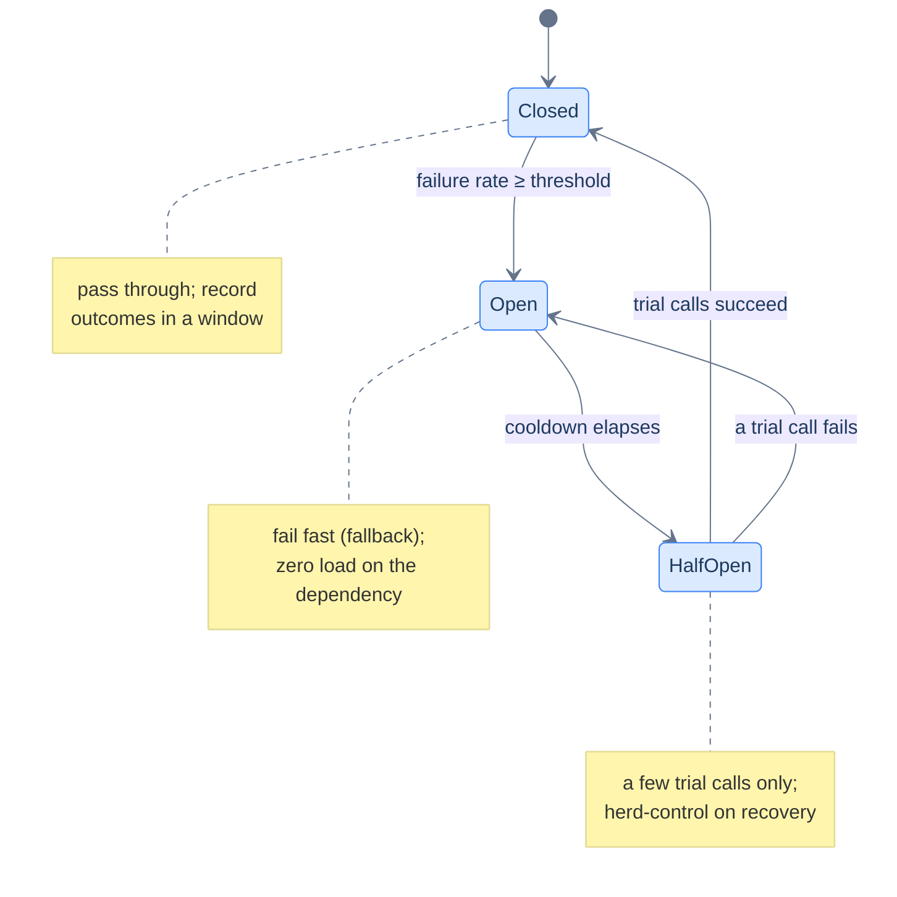

# 21. Circuit breakers and bulkheads

## TL;DR
> When a service you call goes bad, the naïve thing — keep calling it and keep waiting — is exactly what turns *its* problem into *your* outage. Every request that blocks for two seconds on a dying dependency is a worker thread you can't use for anything else, and once your pool is full the **whole** service stops responding, even endpoints that never touched the sick dependency. A **circuit breaker** is a state machine (Closed → Open → Half-Open) that watches the failure rate and, once it crosses a threshold, *trips*: subsequent calls **fail fast** with a fallback in microseconds instead of hanging for the timeout. After a cooldown it goes **half-open** and lets a *trickle* of trial calls through to test the water — the firewall against the "thundering herd on recovery," where slamming all your backed-up traffic at a just-recovering service knocks it straight back down. A **bulkhead** is the structural complement: give each dependency its own bounded pool of threads/connections, so a failure can flood *one compartment* but not the whole hull. Both patterns come from Michael Nygard's *Release It!* (2007); the modern JVM implementation is Resilience4j.

## 1. Motivation

On **20 September 2015**, between roughly **2:13 and 7:10 AM PDT**, Amazon DynamoDB in the US-East-1 region fell over, and it took a chunk of the internet — and other AWS services — with it. The trigger was a storage subsystem that depended on an internal **metadata service**. A new feature (Global Secondary Indexes) had quietly increased the size of the membership requests storage servers sent to that metadata service. When those requests started taking longer than the allotted time, the storage servers **timed out and took themselves offline** — and then *retried*. Thousands of servers retrying a service that was already struggling added more load, which caused more timeouts, which caused more retries. The system had wandered into a **retry storm**: a self-reinforcing cascade where the act of trying to recover was the thing preventing recovery.

How did AWS break the loop? According to their post-event summary, engineers **paused requests to the metadata service** to relieve the load, brought up additional capacity, and only then let traffic back in. In other words: a human, at 5 AM, became the circuit breaker by hand — cutting off the calls so the dependency could breathe. That is precisely the job this lesson automates. A retry storm is what happens when callers have no way to notice "the thing I'm calling is down, I should stop hammering it." The cure is a pattern that *notices* and *stops on its own*, and a second pattern that limits how much damage the hammering can do in the first place. Rate limiting ([Lesson 20](/cortex/system-design/distributed-patterns/rate-limiting)) protected you from *callers*; this lesson protects you from the things *you* call.

## 2. Intuition (Analogy)

The names are not metaphors someone reached for — they're borrowed wholesale from the physical objects that solve the identical problem.

**Circuit breaker — the fuse box in your house.** Electrical wiring has a failure mode: if too much current flows (a short circuit, an overloaded outlet), the wires heat up and can start a fire. So every house has circuit breakers. When current crosses a safe threshold, the breaker **trips**: it physically opens the circuit, and *no* current flows until the fault is fixed and someone resets it. It fails into the *safe* state. A software circuit breaker does the same to remote calls: when failures cross a threshold, it opens, and calls stop flowing to the troubled dependency. The one upgrade over your fuse box is that software breakers **reset themselves** — after a cooldown they cautiously test whether the fault is gone.

**Bulkhead — watertight compartments in a ship's hull.** Ships are divided into sealed compartments so that a hole in the hull floods only *one* of them; the ship stays afloat. The cautionary tale is the **Titanic**, whose bulkheads only reached up to E or D deck — not high enough. When the bow dipped, water rose above the tops of the forward bulkheads and **spilled over into the next compartment**, then the next, in what historians describe as a *cascading chain reaction*. The isolation was real but **incomplete**, and incomplete isolation is how a contained problem becomes a total loss. In software, a bulkhead is a bounded pool of resources dedicated to one dependency: the sick dependency can fill *its* compartment, but it can't take threads away from the rest of your service.

Hold both pictures: the breaker *stops you from knocking on a door no one is answering*; the bulkhead *makes sure that even while you're knocking, you haven't tied up the whole building.*

## 3. Formal definitions

A **circuit breaker** is a proxy around a remote call, implemented as a finite state machine with three states:

| State | Behaviour | How you leave it |
|---|---|---|
| **Closed** | Calls pass straight through; outcomes (success / failure / slow) are recorded in a sliding window. | Failure rate crosses the threshold → **Open**. |
| **Open** | Calls are **rejected immediately** — they "fail fast" with an exception or a fallback. No load reaches the dependency. | A cooldown timer (`waitDurationInOpenState`) elapses → **Half-Open**. |
| **Half-Open** | A *limited* number of trial calls are allowed through to probe whether the dependency has recovered. | Trials succeed → **Closed**. Any trial fails → back to **Open**. |



<p align="center"><strong>The three states. The only subtle transition is Half-Open: a small budget of probes decides whether to fully reopen or retreat to Open.</strong></p>

The trip condition isn't "one failure." Real breakers judge a **rate over a window**. Resilience4j, the de-facto JVM library, defaults to a count-based **sliding window of 100 calls**, trips when the **failure rate ≥ 50%**, requires a **minimum of 100 calls** before it will trip at all (so a brief blip on low traffic can't open it), waits **60 seconds** in the Open state, then permits **10 trial calls** in Half-Open. Crucially it also tracks **slow calls** — by default a call slower than a configured duration counts toward a separate `slowCallRateThreshold` — because a dependency that returns *successfully* but takes five seconds is the one that actually exhausts your threads.

A **bulkhead** isolates the *resources* a call consumes. The two common forms: a **thread-pool bulkhead** (each dependency gets its own fixed thread pool; calls run there, so blocking is confined to that pool) and a **semaphore bulkhead** (a counter caps the number of concurrent calls to a dependency; the N+1th is rejected immediately). Either way the invariant is the same: **dependency X can consume at most its allotment of concurrency, and not one unit more.**

## 4. Worked Example — a slow fraud check sinks checkout

A checkout service runs a worker pool of **200 threads**. Each `/checkout` request makes a synchronous call to a separate **fraud-check** service that normally responds in **40 ms**. Steady traffic is **300 requests/second**. Life is good: at 40 ms per call, the average request occupies a thread for a blink, and 200 threads are plenty.

**The incident.** Fraud-check's database degrades and its responses slow to the **2-second** client timeout. Now do the arithmetic that sinks you. By **Little's Law**, the number of requests in flight is `L = λ × W` = `300/s × 2s` = **600 concurrent requests**. You have **200 threads**. The pool saturates in well under a second; every thread is parked waiting on fraud-check; and now requests for `/cart`, `/catalog`, `/order-history` — endpoints that *never call fraud-check* — can't get a thread either. A slow dependency you call on *one* path has taken down your *entire* service. That is the cascade, and notice the cruel detail: a fraud-check that was **down** (instant connection refused) would have hurt far less than one that is **slow**. Slowness is the dangerous failure mode.

**With a circuit breaker.** The breaker watches outcomes. As timeouts pile up and the failure (and slow-call) rate crosses 50% of the window, it trips **Open**. Now every `/checkout` call to fraud-check returns *immediately* with a fallback — route the payment to an asynchronous manual-review queue, or auto-approve low-value transactions — in **microseconds** instead of blocking a thread for two seconds. Threads are freed as fast as they're taken; the pool never saturates; `/cart` and `/catalog` keep serving. You've degraded one feature instead of losing the store.

**The failure case — the thundering herd on recovery.** Suppose you implement the breaker *without* a half-open state: it just flips straight back to Closed when the 30-second cooldown ends. Fraud-check has been recovering but is still fragile. The instant the breaker closes, **all 300 req/s** (plus any retry backlog that accumulated) slam fraud-check at once. It buckles immediately, the breaker trips again, waits 30s, closes, gets stampeded again — an **oscillation** that never lets the dependency stabilise. This is the recovery-time twin of the AWS retry storm from §1. The **half-open** state is the fix: when the cooldown ends, it admits only **10 trial calls**. If they succeed, *then* it closes and reopens the floodgates; if even one fails, back to Open for another cooldown. You test the water with a cup, not a firehose.

**Why you still need the bulkhead.** The breaker is *reactive* — it needs a windowful of failures before it trips, and in those first couple of seconds threads are already piling up. The **bulkhead** is the *structural* guarantee that the pile-up is bounded: give the fraud-check client its **own pool of 20 threads** (or a semaphore of 20). When fraud-check hangs, at most **20** threads can ever be blocked on it; the 21st call is rejected instantly, and the other **180** threads keep serving everything else — no Little's-Law math required, because the blast radius is capped by construction. Breaker + bulkhead together: the bulkhead caps how much damage the slow dependency can do *while* the breaker decides to stop calling it at all.

## 5. Build It

Circuit breakers live overwhelmingly in the JVM world (this is where Hystrix and Resilience4j were born), so here's Java. First, the **state machine from scratch** — not for production, but so the half-open transition stops being magic:

```java
import java.util.function.Supplier;

enum State { CLOSED, OPEN, HALF_OPEN }

class CircuitBreaker {
    private State state = State.CLOSED;
    private int consecutiveFailures = 0;
    private long openedAtNanos = 0;
    private int trialsLeft = 0;
    private final int threshold;        // failures in a row before tripping
    private final long cooldownNanos;   // how long OPEN lasts before probing
    private final int halfOpenTrials;   // probes allowed in HALF_OPEN

    CircuitBreaker(int threshold, long cooldownMs, int halfOpenTrials) {
        this.threshold = threshold;
        this.cooldownNanos = cooldownMs * 1_000_000L;
        this.halfOpenTrials = halfOpenTrials;
    }

    synchronized <T> T call(Supplier<T> action, Supplier<T> fallback) {
        if (state == State.OPEN) {
            if (System.nanoTime() - openedAtNanos >= cooldownNanos) {
                state = State.HALF_OPEN;      // cooldown elapsed: start probing
                trialsLeft = halfOpenTrials;
            } else {
                return fallback.get();        // fail fast — don't touch the sick service
            }
        }
        if (state == State.HALF_OPEN && trialsLeft <= 0) {
            return fallback.get();            // probe budget spent; keep traffic out
        }
        try {
            T result = action.get();          // the real downstream call
            onSuccess();
            return result;
        } catch (Exception e) {
            onFailure();
            return fallback.get();
        }
    }

    private void onSuccess() {
        consecutiveFailures = 0;
        if (state == State.HALF_OPEN && --trialsLeft <= 0)
            state = State.CLOSED;             // probes all passed: reopen the floodgates
    }

    private void onFailure() {
        if (state == State.HALF_OPEN) { trip(); return; }   // one bad probe re-opens
        if (++consecutiveFailures >= threshold) trip();
    }

    private void trip() {
        state = State.OPEN;
        openedAtNanos = System.nanoTime();
    }
}
```

Two notes. I track *consecutive* failures here for brevity; production breakers track a **rate over a sliding window** (cleaner under mixed traffic). And I use `System.nanoTime()` — a monotonic clock — not wall-clock time, so an NTP adjustment can't make the cooldown comparison misbehave (the same discipline as the rate limiter in [Lesson 20](/cortex/system-design/distributed-patterns/rate-limiting)).

In production you **don't hand-roll this** — you declare it. Resilience4j turns the whole thing into config:

```java
CircuitBreakerConfig config = CircuitBreakerConfig.custom()
    .slidingWindowType(SlidingWindowType.COUNT_BASED)
    .slidingWindowSize(100)                            // judge over the last 100 calls
    .minimumNumberOfCalls(20)                          // ...but don't trip on a tiny sample
    .failureRateThreshold(50)                          // trip if ≥ 50% fail
    .slowCallDurationThreshold(Duration.ofSeconds(1))  // a 1s+ call counts as "slow"
    .slowCallRateThreshold(50)                         // ...and trips if ≥ 50% are slow
    .waitDurationInOpenState(Duration.ofSeconds(30))   // stay OPEN 30s, then probe
    .permittedNumberOfCallsInHalfOpenState(10)         // only 10 trial calls
    .build();

CircuitBreaker breaker = CircuitBreaker.of("fraud-check", config);
Supplier<Decision> guarded =
    CircuitBreaker.decorateSupplier(breaker, () -> fraudClient.check(payment));
Decision d = Try.ofSupplier(guarded)
    .recover(ex -> Decision.MANUAL_REVIEW)   // the fallback when open or failing
    .get();
```

The point of the snippet is the **`slowCall*` settings** — they're what stops a slow-but-"successful" dependency from quietly eating your threads, the exact failure of §4.

## 6. Trade-offs

| Choice | Cost | Benefit |
|---|---|---|
| **No breaker** | a slow dependency hangs threads → full cascade | nothing to build or tune |
| **Circuit breaker** | reactive (needs a windowful to trip); you must design a fallback | fail fast in µs instead of blocking for the timeout; lets the dependency recover |
| **Tight threshold** (e.g. trip at 20%) | trips on transient blips → false opens, needless lost availability | reacts fast to a real outage |
| **Loose threshold** (e.g. 80%) | absorbs more damage before acting | far fewer false trips |
| **Short cooldown** | risks re-herding a still-fragile dependency | recovers quickly once it's genuinely back |
| **Long cooldown** | slow to notice the dependency is healthy again | gives it real room to breathe |
| **Bulkhead** (per-dependency pool) | reserved threads sit idle when that dependency is quiet; more pools to size | structural blast-radius cap; one sick dependency cannot starve the rest |
| **Shared pool** (no bulkhead) | one dependency can consume every thread | simplest; full utilisation when all is healthy |

The breaker's two dials are in tension: **threshold** (how much failure you tolerate before tripping) and **cooldown** (how long you wait before probing). Tight-and-short reacts fast but flaps and re-herds; loose-and-long is stable but sluggish. There's no universal setting — it depends on how flaky the dependency is and how expensive a false trip is. The bulkhead's dial is **pool size**: it trades a little wasted capacity (idle reserved threads) for a hard ceiling on how much one dependency can hurt you. The deep point: a **breaker is reactive, a bulkhead is structural** — you want both, because the bulkhead bounds the damage during the seconds before the breaker reacts.

## 7. Edge cases and failure modes

- **The fallback that also fails (or is slow).** A breaker is only as good as its fallback path. If your fallback calls *another* remote service — or the same overloaded database — you've just relocated the hang. Fallbacks must be **local and fast**: a cached value, a sensible default, "queue it for later," or a clean error. A fallback with a network call in it is a trap.
- **Flapping on a tiny sample.** Trip on "1 failure out of the last 2 calls" and a single transient timeout opens the breaker, costing you availability you never needed to lose. This is why real breakers enforce a **minimum number of calls** before they'll trip (Resilience4j's `minimumNumberOfCalls`): the failure *rate* has to be statistically real, not a coin flip on two requests.
- **Slow calls that look like successes.** A breaker that only counts exceptions and 5xx responses will happily keep feeding a dependency that returns `200 OK` after five seconds — and that is *exactly* the dependency that exhausts your thread pool. You must count **slow calls** as breaker-trip signals (the `slowCall*` knobs in §5), or the breaker watches your service drown while reporting all-green.
- **Per-instance breakers don't share state.** Like rate limiters, each service instance typically holds its *own* breaker. Instance A may have tripped while instance B is still calling the dependency, so an "open" breaker fleet-wide still sends the dependency *partial* load, not zero. Usually fine (each instance protects itself), but don't expect a breaker to instantly drop a struggling dependency's traffic to absolute zero.
- **The breaker hides the real problem.** A tripped breaker serving fast fallbacks looks *great* on a request dashboard — low latency, lots of 200s — while a critical dependency is on fire. **Alert on breaker state transitions**, not just on request error rates. An open breaker on a core dependency is a page, not a shrug.
- **Bulkhead sizing is a guess that ages.** Too small and you throttle a perfectly healthy dependency under normal load (a self-inflicted limit); too big and it doesn't actually contain anything. And traffic drifts — a pool sized last quarter may be wrong now. Watch bulkhead **rejection metrics** the way you'd watch any saturation signal.
- **Retries stacked on top of a breaker.** If a client retries (Lesson 17) *and* a breaker sits underneath, make the retry policy respect the open circuit — don't retry into an open breaker, or you rebuild the retry storm one layer up. Breaker, retry, and timeout are a *set*; tune them together.

## 8. Practice

> **Exercise 1 — Size the bulkhead with Little's Law.**
> A service receives **500 req/s**. Each call to dependency *X* normally takes 50 ms, but during an incident it takes the full **3-second** timeout. The shared worker pool is **300 threads**. (a) Roughly how long after *X* starts timing out until the pool is exhausted? (b) What does a dedicated **30-thread bulkhead** for *X* change?
>
> <details>
> <summary>Solution</summary>
>
> **(a) Under a second.** With requests arriving at 500/s and each *X*-bound request now holding a thread for 3 s, in-flight count climbs at ~500/s; you reach 300 occupied threads in about `300 / 500 ≈ 0.6 s`. After that, *every* endpoint — even those that never call *X* — can't get a thread, so the whole service times out. (Little's Law says you'd need `L = 500 × 3 = 1500` threads to keep up; you have 300, so saturation is inevitable and fast.) **(b)** With a 30-thread bulkhead, **at most 30** threads can ever block on *X*; the 31st *X*-call is rejected immediately (fail fast), and the remaining **270** threads keep serving everything else. *X* degrades; the service survives. The bulkhead converted a total outage into a single-feature degradation — *without* the breaker even being involved yet.
>
> </details>

> **Exercise 2 — Tune the breaker.**
> You're on Resilience4j defaults (window 100, failure threshold 50%, **slow-call threshold 60 s**, wait 60 s, half-open 10). A dependency has occasional **2-second** blips that self-heal in ~5 s (you do *not* want to trip for these), and separately, real outages lasting *minutes* (you *do* want to trip). Which knobs do you change, and why?
>
> <details>
> <summary>Solution</summary>
>
> The headline bug is the **slow-call threshold**: at its 60 s default, your 2-second responses don't register as "slow" *at all*, so a dependency crawling at 2 s — bad enough to wreck your thread pool — never trips the breaker. You'd lower `slowCallDurationThreshold` to something like **1 s** so genuine slowness counts. But that alone would trip on the harmless 2-second *blips*, so you lean on the **window + minimum-calls**: keep the window large enough (e.g. 100) that a brief 5-second blip is a small fraction of recent calls and stays under the 50% rate. For the real multi-minute outages, the **60 s wait** is reasonable; you might add an escalating/exponential wait so repeated trips back off further. Keep the **half-open 10** as your herd guard. Lesson: defaults are a starting point, and the slow-call threshold is the one people forget to set.
>
> </details>

> **Exercise 3 — Spot the cascade.**
> A teammate reports: *"Our recommendations widget calls a model-scoring service. When scoring got slow last week, our **whole homepage** went down — not just the recommendations."* No code shown. Name the **two** patterns that would have kept this to a widget-sized problem, and say exactly what each does here.
>
> <details>
> <summary>Solution</summary>
>
> **(1) Bulkhead.** Give the scoring client its own bounded thread/connection pool. A slow scoring service can then only exhaust *that* pool; the homepage's other calls (content, layout, auth) keep their own threads and render fine. The reason the *whole* page died is that all shared worker threads ended up blocked on scoring — a missing bulkhead. **(2) Circuit breaker.** Once scoring's failure/slow rate crosses the threshold, trip and serve the recommendations widget a **fallback** (cached or empty recommendations) in microseconds, so no thread ever waits on the scoring timeout. The bulkhead caps the blast radius structurally; the breaker stops the bleeding and lets scoring recover. Bonus points for rendering a graceful *"recommendations unavailable"* placeholder rather than failing the component — degrade the feature, never the page.
>
> </details>

## Your Turn

Before you move on, check your understanding with the coach — explain the idea, apply it, weigh the trade-offs, then defend your reasoning.

<div class="concept-coach"></div>

## In the Wild

- **[Martin Fowler — "CircuitBreaker"](https://martinfowler.com/bliki/CircuitBreaker.html)** (6 March 2014) — the canonical explainer, with the Closed/Open/Half-Open state machine and runnable sample code, written in dialogue with Nygard. If you read one external thing on this lesson, read this.
- **[Michael Nygard — *Release It!*](https://pragprog.com/titles/mnee2/release-it-second-edition/)** (2007; 2nd ed. 2018) — the origin of *both* patterns as named "stability patterns," and the source of the fuse-box and ship-bulkhead metaphors. The book that taught the industry that stability is a design property, not an afterthought.
- **[Netflix — Hystrix](https://github.com/Netflix/Hystrix)** — the library that popularised breaker + bulkhead (it isolated every dependency behind its own thread pool) across a giant microservice fleet. Note the README's banner: Hystrix has been in **maintenance mode since 19 November 2018**, with Netflix steering new work toward adaptive concurrency limits and Resilience4j — itself a lesson in how the *automatic* successor to fixed thresholds is evolving.
- **[Resilience4j — CircuitBreaker docs](https://resilience4j.readme.io/docs/circuitbreaker)** — the modern JVM implementation Netflix and Spring Cloud now recommend, and the source of every default number in §3 and §5 (50% failure rate, window of 100, 60 s open, 10 half-open trials) plus the slow-call detection from §7.
- **[AWS — Post-Event Summaries](https://aws.amazon.com/premiumsupport/technology/pes/)** — including the September 2015 DynamoDB disruption from §1: a metadata-service retry storm that engineers had to throttle by hand. A real-world cascade where the missing ingredient was exactly the automatic backpressure this lesson installs.

---

> **Next:** [22. LSM-trees vs B-trees](/cortex/system-design/storage-and-search/lsm-trees-vs-btrees) — we leave distributed *patterns* and crack open the storage engine itself. Why does one database write to an append-only log and sort later, while another updates pages in place? That single choice — log-structured merge tree vs B-tree — decides whether your database is fast at writes or fast at reads, and it's the fork behind Cassandra-vs-Postgres, RocksDB-vs-InnoDB, and almost every "which database?" argument you'll ever have.
