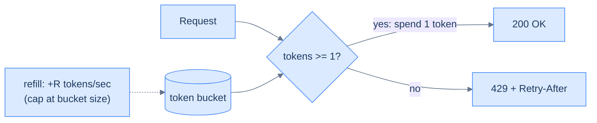
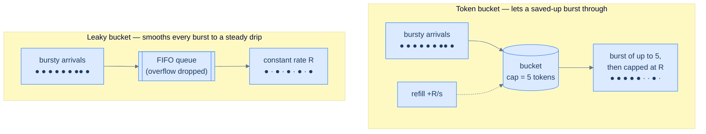
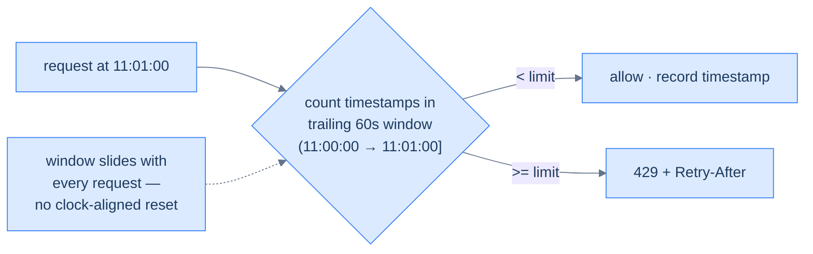

# 22. Rate limiting

## TL;DR
> A rate limiter caps how many requests a client may make in a window of time, so that one runaway script, one retry loop, or one abusive user can't consume the capacity everyone else depends on. The four algorithms you must know: the **fixed-window counter** (simplest — and it leaks **2× your limit** at the window boundary), the **sliding window** (log or counter — accurate, fixes the boundary), the **token bucket** (refills tokens at a steady rate, allows controlled *bursts* up to a capacity — the industry default, used by Stripe), and the **leaky bucket** (drains a queue at a constant rate — smooths bursts into a steady stream). The senior moves: pick the algorithm by *how you want bursts handled*, limit on the *right key* (per-user, not per-shared-IP), do it **atomically** if it's distributed, and when you reject, return `429` with a `Retry-After` the client actually honours ([Lesson 19](/cortex/system-design/distributed-patterns/idempotency-retries-backoff)).

## 1. Motivation

In 2017, Stripe published *Scaling your API with rate limiters*, describing the limiters that sit in front of their payments API. The core one is a **token bucket per user, stored in Redis**: every user has a bucket, every request removes a token, and when the bucket is empty the request is rejected. They run several limiters at once (one for request rate, one for concurrent requests, and more) because the failure they're guarding against is mundane and constant: a single customer's buggy integration goes into a tight loop and, without a limiter, that one client would consume capacity that thousands of *other* businesses' payments depend on. A rate limiter converts "one client takes down the API for everyone" into "one client gets throttled and everyone else is fine."

It's not just abuse. GitHub caps authenticated REST API access at **5,000 requests per hour per user**; exceed it and you get a `403` or `429` with `x-ratelimit-remaining: 0` and an `x-ratelimit-reset` telling you when you may resume. Every serious API does some version of this. Rate limiting is the seatbelt of a shared service — boring, mandatory, and the thing that keeps one person's mistake from becoming everyone's outage. (This very site runs a Redis-backed limiter in front of its `/api/run` code-execution endpoint, for exactly this reason.) This lesson is the four algorithms and how not to get them subtly wrong.

## 2. Intuition (Analogy)

**Token bucket** is an **arcade token machine**. A machine drips one token into a tray every second, and the tray holds at most ten. To play a game you take a token; if the tray's empty, you wait. If you've been away a while, the tray has filled up to ten, so you can play a quick *burst* of ten games back-to-back — but then you're back to the one-per-second drip. Token bucket allows short bursts (up to the tray size) on top of a steady long-run rate. That "save up and spend" behaviour is usually what you *want* for an API: a client that's been quiet can do a quick flurry, but no one can sustain more than the drip rate.

**Leaky bucket** is a **funnel**. Pour water (requests) in at any rate you like; it drains out the bottom at a *constant* trickle. Pour too fast and the funnel overflows — that water is lost (rejected). The output is perfectly smooth regardless of how bursty the input was. Leaky bucket *shapes* traffic to a fixed rate; it forbids bursts entirely.

**Fixed window** is a **turnstile with a counter that resets every minute on the clock**. Simple — but if a crowd rushes through at 11:00:59 and another crowd at 11:01:00, the counter reset between them let *twice* a minute's worth through in two seconds. The clock boundary is the bug.

**Sliding window** fixes that by making the window *follow you* instead of resetting on the wall clock. Picture a bouncer who, instead of resetting a tally on the hour, always looks back at exactly the **last 60 seconds** from *right now*. There is no privileged boundary to rush, because the boundary moves with every request — at 11:01:00 the bouncer still counts everyone who came in since 11:00:00, so the trick that beat the turnstile does nothing here.

## 3. Formal definitions

A rate limit is "at most **R** requests per window **T**" (e.g. 100 req/min). The algorithms differ in how they track that:

| Algorithm | How it works | Bursts | Memory | Accuracy |
|---|---|---|---|---|
| **Fixed window** | a counter per fixed clock window; reset at the boundary | **up to 2× R at the boundary** | O(1) per key | poor |
| **Sliding window log** | store a timestamp per request; count those within the last T | exact, no boundary bug | **O(R) per key** | exact |
| **Sliding window counter** | weighted blend of current + previous window counts | smoothed, no 2× | O(1) per key | good approximation |
| **Token bucket** | tokens refill at rate R; each request spends one; capacity = burst | **controlled** (up to capacity) | O(1) per key | good |
| **Leaky bucket** | queue drains at constant rate R; overflow rejected | **none** (smoothed) | O(queue) | exact rate |

**The sliding-window counter, concretely.** It avoids storing every timestamp by *estimating* the trailing-window rate from two cheap counters. Say the limit is 10/min, the previous minute saw 8 requests, the current minute (so far) 3, and a new request lands 25% of the way into the current minute. The trailing 60-second window still overlaps 75% of the previous minute, so the estimate is `current + previous × overlap = 3 + 8 × 0.75 = 9`. That's under 10, so allow — but one more request tips it over. It's an *approximation* (it assumes the previous window's requests were spread evenly), but a famously good one: Cloudflare reported that across ~400 million requests, only about **0.003%** were wrongly allowed or wrongly blocked by this method — for two `O(1)` counters instead of an `O(R)` log, that's a bargain.

**The response contract.** When a request is denied, the HTTP convention is **`429 Too Many Requests`** with a **`Retry-After`** header (seconds, or an HTTP date) telling the client when to come back. Most APIs also send a trio of informational headers *on every response* so a well-behaved client can pace itself before it ever hits the wall:

| Header | Meaning |
|---|---|
| `X-RateLimit-Limit` | the ceiling for this window (e.g. `5000`) |
| `X-RateLimit-Remaining` | calls left before throttling (e.g. `4998`) |
| `X-RateLimit-Reset` | when the window resets (epoch seconds or a date) |

GitHub sends exactly these on its REST API; on a `429`/`403` it adds `Retry-After`, and its documented contract is *don't retry until the reset.* Stripe returns `429` and recommends exponential backoff. The point of the headers is to turn "guess and get punished" into "read your budget and stay under it." Limits are applied on a **key**: per-user, per-API-key, per-IP, per-endpoint, or a global cap — often several at once (per-user *and* a global ceiling).

## 4. Worked Example — the fixed-window counter leaks double

Limit: **100 requests per minute**, fixed window aligned to the clock. A client does this:

- At **11:00:59**, it fires 100 requests. They fall in the window `[11:00:00, 11:01:00)`; the counter goes 0 → 100; all allowed.
- One second later at **11:01:00**, a *new* window `[11:01:00, 11:02:00)` begins, so the counter **resets to 0**. The client fires 100 more; all allowed.

In the **~1 second** straddling 11:01:00, the client got **200 requests** through — twice the rate you thought you were enforcing. A downstream service sized for "100/min per client" just took a 200-in-a-second spike. Across many clients aligning to the minute boundary (and they *will* align — cron jobs, top-of-minute polling), this is a systematic 2× burst, exactly when you least expect it. **That's the failure case**, and it's why fixed-window is a teaching example more than a production choice.

**The fix, two ways.** A **token bucket** with capacity 100 and refill 100/min bounds the burst to the bucket size *regardless of the clock* — the second batch finds the bucket nearly empty (it only refilled ~1.7 tokens in that second) and is rejected. A **sliding-window counter** estimates the rate over the *trailing* 60 seconds by weighting the previous window: at 11:01:00 it still counts ~`(59/60)` of the previous window's 100, so the budget for the new second is ~2, not 100. Either removes the boundary doubling; token bucket is the more common default because "allow a reasonable burst, cap the sustained rate" matches what APIs actually want.



<p align="center"><strong>Token bucket: a steady refill, a capacity that bounds bursts, and a 429 with Retry-After when empty.</strong></p>

The single most useful distinction between the two bucket algorithms is **what they do to a burst**. Token bucket *permits* a burst up to the bucket's capacity (a quiet client can spend its saved-up tokens in a flurry), then clamps the sustained rate to the refill. Leaky bucket *absorbs* the burst into a FIFO queue and releases it as a perfectly even drip — the output rate is constant no matter how spiky the input. Same long-run rate `R`; opposite burst behaviour:



<p align="center"><strong>Same average rate, opposite burst handling: token bucket releases a flurry then throttles; leaky bucket flattens everything to a constant drip.</strong></p>

Real systems pick by which they need. **Stripe** and **Amazon** front their APIs with token buckets — a customer who's been idle deserves a quick flurry, and the bucket caps abuse without punishing normal spiky usage. **Shopify** uses leaky buckets, because a steady, predictable outflow is easier to reason about downstream. The sliding window, meanwhile, is the natural fit when the rule is a plain "N per minute" with no opinion about bursts at all — Cloudflare's edge rate limiter is a famous large-scale sliding-window counter.

## 5. Build It

Token bucket in Python. The trick is **lazy refill** — you don't run a timer adding tokens; you compute how many *would* have dripped in since the last check:

```python
import time

class TokenBucket:
    def __init__(self, rate, capacity):
        self.rate = rate            # tokens added per second
        self.capacity = capacity    # max tokens (the burst size)
        self.tokens = capacity
        self.last = time.monotonic()

    def allow(self):
        now = time.monotonic()
        # refill for the time elapsed, capped at capacity
        self.tokens = min(self.capacity, self.tokens + (now - self.last) * self.rate)
        self.last = now
        if self.tokens >= 1:
            self.tokens -= 1
            return True             # 200 OK
        return False                # 429 Too Many Requests

bucket = TokenBucket(rate=100/60, capacity=100)  # 100/min sustained, burst 100
```

Two senior notes. (1) **Distributed limiting needs atomicity.** With many API servers, each holding its own `TokenBucket`, ten servers each allowing 100/min means a real global limit of *1000*/min. To enforce one global limit you keep the state in **Redis**, shared by every server. For a simple fixed-window counter that's two commands — `INCR` the per-window key and `EXPIRE` it so it self-cleans when the window ends. But the read-check-write sequence races: two servers both read "1 token left," both decide "allowed," both decrement, and you've admitted two requests on one token (this is the §7 race condition). The cure is to make check-and-decrement **atomic**. A Redis **Lua script** runs server-side as one indivisible step, so no other request can interleave:

```lua
-- KEYS[1] = bucket key   ARGV = rate, capacity, now
local tokens = tonumber(redis.call('HGET', KEYS[1], 'tokens') or ARGV[2])
local last   = tonumber(redis.call('HGET', KEYS[1], 'ts')     or ARGV[3])
tokens = math.min(ARGV[2], tokens + (ARGV[3] - last) * ARGV[1])  -- lazy refill
local allowed = tokens >= 1
if allowed then tokens = tokens - 1 end
redis.call('HSET', KEYS[1], 'tokens', tokens, 'ts', ARGV[3])
return allowed and 1 or 0
```

The other classic trick is a Redis **sorted set** for a sliding-window *log*: store each request's timestamp as a score, `ZREMRANGEBYSCORE` to drop entries older than the window, then `ZCARD` to count what's left — accurate, at `O(R)` memory per key. (2) Use `time.monotonic()`, not wall-clock, so an NTP adjustment can't make `now - last` negative and hand out free tokens.

The sliding window is worth picturing on its own. Unlike fixed window, its window has no clock-aligned reset — it's a 60-second frame that moves forward with *every* request, so the boundary doubling of §4 simply can't happen:



<p align="center"><strong>Sliding window: the 60-second frame moves with each request, so there is no boundary to game.</strong></p>

## 6. Trade-offs

| Choice | Cost | Benefit |
|---|---|---|
| Fixed window | 2× boundary burst | trivially simple, O(1) |
| Sliding window log | O(R) memory per key | exact, no boundary bug |
| Sliding window counter | slight approximation | O(1), smooth, cheap |
| **Token bucket** | track tokens + timestamp | controlled bursts; the API default |
| Leaky bucket | adds queueing latency | perfectly smooth output |
| **Local** (in-process) | per-node, so N nodes = N× the limit | zero latency, no dependency |
| **Distributed** (Redis) | a network hop + a dependency per request | one accurate *global* limit |

The first decision is **how you want bursts handled**: forbid them (leaky bucket — good for protecting a fragile downstream that can't absorb spikes), allow controlled ones (token bucket — good for APIs where a quiet client deserves a quick flurry), or just count (sliding window — good for plain "N per minute" quotas). The second is **local vs distributed**: a local limiter is free and fast but only limits *per node*, so behind a load balancer your real limit is `nodes × limit` — fine if that's acceptable, a footgun if you promised a hard global number. A distributed (Redis) limiter gives one true global limit at the cost of a round-trip per request and a shared dependency you must keep alive.

## 7. Edge cases and failure modes

- **The fixed-window boundary burst.** As in §4: up to 2× the limit straddling the reset, made worse because clients synchronise to the clock (cron, top-of-minute polling). Use a sliding window or token bucket if the 2× matters.
- **Distributed read-modify-write races.** Two API servers both read "1 token left," both allow, both decrement — you admitted two requests on one token. Distributed limiters must check-and-decrement **atomically** (Redis `INCR`/Lua), or they systematically over-admit under concurrency.
- **Per-node limits silently multiply.** A "100/min" limiter running locally on 10 servers behind a load balancer enforces *1000*/min globally. Teams promise a hard per-user number, deploy it per-node, and are baffled when the downstream sees 10×. Either centralise the limiter or divide the limit by node count (and re-divide on autoscale — fragile).
- **Limiting on the wrong key.** Per-IP limiting buckets an entire office or mobile carrier behind one NAT into a single limit (one user exhausts everyone's quota); behind a CDN/load balancer you must read `X-Forwarded-For`, or you limit the *proxy's* IP and effectively rate-limit the whole world together. Prefer per-user/per-API-key keys.
- **Clients that don't honour `Retry-After`.** A client that gets a `429` and immediately retries turns rate limiting into a tight rejection loop that wastes both sides' CPU — a mini retry storm ([Lesson 19](/cortex/system-design/distributed-patterns/idempotency-retries-backoff)). Always send `Retry-After`; well-behaved clients back off, and you can escalate (longer bans) for those that don't.
- **The limiter is in the hot path — and can fail.** Every request now pays a Redis round-trip, and if Redis is down you must choose: **fail open** (allow everything — risks overload) or **fail closed** (reject everything — turns a cache outage into a full outage). Usually fail *open* with a local fallback limiter, so a limiter outage degrades protection rather than availability.
- **Cost/abuse asymmetry.** Not all requests cost the same — a `/search` is far heavier than a `/health`. A flat request-count limit lets a client hammer the expensive endpoint within budget. Weight the limit by cost (spend more tokens for heavier endpoints) when the spread is large.

## 8. Practice

> **Exercise 1 — Compute the burst.**
> An API uses a fixed-window limiter of 600 requests/hour. A client wants the maximum possible requests in the shortest possible time without ever being rejected. How many requests can it make, and over what span?
>
> <details>
> <summary>Solution</summary>
>
> **1,200 requests in just over an instant around the hour boundary.** The client fires 600 in the final moment of window N (counter 0→600, all allowed), then 600 more in the first moment of window N+1 (counter resets to 0, all allowed). So the fixed window's "600/hour" actually permits **2× = 1,200** across the boundary — the canonical boundary-burst bug. A token bucket (capacity 600, refill 600/hr) or sliding-window counter would cap the second batch, since the budget doesn't reset on a clock edge.
>
> </details>

> **Exercise 2 — Pick the algorithm.**
> Choose for each: (a) an API where a quiet client should be allowed an occasional quick burst, but no one may sustain more than 10 req/s; (b) protecting a fragile legacy mainframe that corrupts data if it ever receives more than exactly 5 req/s; (c) a simple "1,000 calls/day" billing quota.
>
> <details>
> <summary>Solution</summary>
>
> (a) **Token bucket** (rate 10/s, capacity e.g. 50) — it allows the saved-up burst while capping the sustained rate at the refill rate. (b) **Leaky bucket** — the mainframe needs a *perfectly smooth* ≤5 req/s with no bursts ever, which is exactly what a constant-drain queue enforces (token bucket would let a burst through and corrupt it). (c) **Fixed or sliding window counter** — a daily quota is a plain count; the boundary-burst issue is irrelevant at day granularity, so the simplest counter is fine. The deciding question each time is *how should bursts be treated* — allowed, forbidden, or irrelevant.
>
> </details>

> **Exercise 3 — The 10× surprise.**
> You implement a per-user token bucket of 100 req/min as a local in-process limiter, and deploy to an autoscaling fleet that ranges from 4 to 20 instances behind a round-robin load balancer. A customer complains they're being limited *too late* — they can do far more than 100/min. What's happening, and what are your two options?
>
> <details>
> <summary>Solution</summary>
>
> The limiter is **local to each instance**, and the load balancer spreads the user's requests across all of them, so the effective global limit is `instances × 100` — between **400 and 2,000 req/min** depending on how many instances are up, and it *changes as the fleet autoscales*. Option 1: **centralise** the limiter in Redis so all instances share one bucket per user (one true global 100/min, at the cost of a Redis round-trip per request). Option 2: **keep it local but divide** — each instance limits to `100 / current_instance_count`, which requires every instance to know the live fleet size and re-divide on every scale event (fragile, and bursty during scaling). For a hard per-user guarantee, Option 1 is the right answer; the local approach only works when "roughly N per node" is good enough.
>
> </details>

## Your Turn

Before you move on, check your understanding with the coach — explain the idea, apply it, weigh the trade-offs, then defend your reasoning.

<div class="concept-coach"></div>

## In the Wild

- **[Stripe — "Scaling your API with rate limiters"](https://stripe.com/blog/rate-limiters)** (2017) — the canonical production write-up: per-user token buckets in Redis, plus the *concurrency* limiter and load-shedder they run alongside it. The clearest "why and how" from a company where throttling protects real money.
- **[GitHub — REST API rate limits](https://docs.github.com/en/rest/using-the-rest-api/rate-limits-for-the-rest-api)** — a real, public limit (5,000 req/hr authenticated) with the exact headers (`x-ratelimit-remaining`, `x-ratelimit-reset`, `Retry-After`) and the "don't retry until reset" contract. Read it as the client's side of §7.
- **[Cloudflare — How we built rate limiting](https://blog.cloudflare.com/counting-things-a-lot-of-different-things/)** — rate limiting at edge scale (sliding windows over enormous request volumes); a good look at the distributed-counting problem.
- **[Token bucket (traffic shaping)](https://en.wikipedia.org/wiki/Token_bucket)** and **[leaky bucket](https://en.wikipedia.org/wiki/Leaky_bucket)** — the algorithms' networking origins; useful for seeing that "allow bursts" vs "smooth output" is a decades-old distinction, not an API-era invention.
- **[Figma — rate limiting in a distributed system](https://www.figma.com/blog/an-alternative-approach-to-rate-limiting/)** — a practical engineering account of the distributed-atomicity problem (§7) and a Redis-Lua sliding-window approach.

> **A note on sources.** The canonical treatment of these algorithms is Alex Xu's *System Design Interview, Volume 1*, Chapter 4 ("Design a Rate Limiter") — the source for the four-algorithm taxonomy, the Redis `INCR`/`EXPIRE` + Lua mechanics, and the response headers above. *Designing Data-Intensive Applications* does **not** cover rate limiting directly; its only adjacent idea is **backpressure** (a slow consumer signalling a fast producer to slow down) — a cousin of leaky-bucket shaping, but aimed at internal flow control rather than per-client API quotas.

---

> **Next:** [23. Circuit breakers and bulkheads](/cortex/system-design/distributed-patterns/circuit-breakers-and-bulkheads) — rate limiting protects you from *callers*; circuit breakers protect you from the things *you* call. When a dependency goes bad, a circuit breaker stops you from hammering it (and from piling up threads waiting on it), and bulkheads keep one sick dependency from sinking the whole ship.
