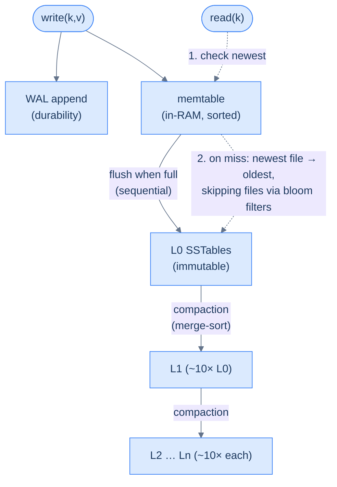

# 22. LSM-trees vs B-trees

## TL;DR
> Underneath every database is a storage engine, and almost all of them pick one of two shapes. A **B-tree** keeps data sorted in fixed-size **pages** and **updates them in place** — to change one row it reads the page, modifies it, and writes the whole page back. Reads are a single, predictable tree-walk; writes are *random* I/O and rewrite a whole page (often 16 KB) to change a few bytes. An **LSM-tree** (Log-Structured Merge-tree) never updates in place: every write is **appended** to an in-memory **memtable** (backed by a write-ahead log), and when that fills it's flushed to disk as an **immutable sorted file (SSTable)**. Background **compaction** merges those files; deletes are **tombstones**. Writes become fast *sequential* appends, so LSM crushes write-heavy workloads — but a read may have to check several SSTables (bloom filters help), and compaction is a permanent background tax. The mental model is three **amplifications** — read, write, and space — and you can't minimize all three at once. B-tree → reads, range scans, OLTP (Postgres, InnoDB). LSM → writes, ingest, time-series, logs (Cassandra, RocksDB, LevelDB, ScyllaDB).

## 1. Motivation

In **2017**, Discord published *How Discord Stores Billions of Messages*. They'd started on MongoDB, outgrew it, and moved their message history to **Cassandra** — a database built on an **LSM-tree** — precisely because their workload was a firehose of *writes*: every message anyone sends, forever, append-only. Cassandra's log-structured engine ate those writes happily.

But the same blog (and its 2023 sequel, *How Discord Stores Trillions of Messages*) is also a catalogue of LSM's *operational* reality, and that's why it's the perfect way into this lesson. Because Cassandra never overwrites in place, a **delete is itself a write** — a marker called a **tombstone** — and reading a range full of un-purged tombstones got painfully slow. Worse, the background **compaction** that merges and tidies the on-disk files kept *falling behind* as message volume exploded. Discord engineers resorted to a manual ritual they nicknamed the **"gossip dance"**: pull a node out of rotation so it could compact in peace, let it catch up, slot it back in, repeat. The very thing that made writes cheap — defer the sorting, do it in big background passes — became the thing that paged them at night. (They eventually migrated to **ScyllaDB**, a C++ reimplementation of the same LSM ideas, to escape the JVM garbage-collection pauses that made the compaction tax even worse.)

That tension — *writes are cheap, but you pay later in reads, compaction, and space* — is the entire trade-off of this lesson, and its mirror image is the B-tree, which pays up front (random writes) to keep reads simple forever. Your database already chose one. By the end of this lesson you'll know which, and why.

## 2. Intuition (Analogy)

Imagine two people who both have to file incoming paperwork into a cabinet and retrieve documents on demand.

**Priya is a B-tree.** The instant a document arrives, she walks to the filing cabinet, finds its exact alphabetical slot, makes room, and slides it in. Her cabinet is *always* perfectly sorted, so retrieval is trivial: walk straight to the slot. But every single arrival interrupts her with a trip to the cabinet — and if a drawer is full, she has to **split** it across two drawers and shuffle things around. Her filing (writing) is constant, scattered work; her lookups (reading) are effortless.

**Leo is an LSM-tree.** When a document arrives, he just drops it in an **in-tray** on his desk, in arrival order. Instant — no walking, no sorting. When the in-tray gets tall, he does one big **batch pass**: sorts the whole stack and merges it into the cabinet in a single sequential sweep. His filing (writing) is dirt cheap. The catch is retrieval: to find a document he must check the **in-tray** (newest stuff, unsorted) *and* the cabinet — and because he files in batches, the cabinet has accumulated several sorted "bundles" he has to look across. And he always owes a **big merge** later — if documents pour in faster than he can do batch passes, the in-trays and bundles pile up and *everything* slows down.

To delete, Leo doesn't dig the document out of the cabinet (that would mean a lookup — expensive). He drops a sticky note saying *"this one's void"* on the in-tray. The real removal happens during the next big merge. That sticky note is a **tombstone**, and if Leo gets thousands of them before a merge, his lookups have to wade through all of them. Priya, Leo, tombstones, the in-tray, the merge — that's the whole lesson. Now the formal version.

## 3. Formal definitions

A **B-tree** (in practice a **B+tree**) is a balanced, n-ary search tree invented by Rudolf Bayer and Edward McCreight at Boeing in 1970. Each node is a fixed-size **page** (e.g. InnoDB's default 16 KB, Postgres's 8 KB) holding many sorted keys; leaves hold the data (or pointers to it) and are linked together for range scans. A lookup walks root → internal → leaf, typically **3–4 page reads** for huge tables (and the upper levels stay cached). A write finds the target leaf and **modifies the page in place**, writing the whole page back; if the page overflows it **splits**. Crucially: updates are *random* I/O, and to change a few bytes you rewrite a whole page.

An **LSM-tree** (O'Neil, Cheng, Gawlick & O'Neil, 1996) inverts this. Its moving parts:

| Component | Role |
|---|---|
| **WAL** (write-ahead log) | every write is appended here first, for durability/crash recovery |
| **Memtable** | an in-memory *sorted, mutable* buffer that absorbs writes (fast) |
| **SSTable** | when the memtable fills, it's flushed to disk as an *immutable, sorted* file ("Sorted String Table") |
| **Compaction** | a background job that merge-sorts SSTables together, discarding overwritten values and expired tombstones |
| **Tombstone** | a delete is a *write* of a "this key is gone" marker, resolved at compaction |
| **Bloom filter** | a tiny probabilistic index per SSTable that answers "this key is *definitely not* here" so reads can skip files (see [Lesson 23](/cortex/system-design/storage-and-search-probabilistic-data-structures)) |

(The memtable/SSTable vocabulary comes straight from Google's 2006 **Bigtable** paper, which is where most of today's LSM engines trace their lineage.)



<p align="center"><strong>Writes flow down (cheap sequential appends, then background compaction); reads check the memtable first, then SSTables newest-to-oldest, using bloom filters to skip files that can't hold the key.</strong></p>

The reason all of this exists is captured by three **amplification** metrics — the single most useful lens for storage engines:

- **Write amplification** — bytes actually written to disk ÷ bytes of logical data. (B-tree: rewrite a whole page per row change. LSM: compaction rewrites each byte once per level it descends.)
- **Read amplification** — pages/files read ÷ what the query logically needs. (B-tree: ~tree height. LSM: memtable + possibly several SSTables, minus what bloom filters let you skip.)
- **Space amplification** — bytes on disk ÷ bytes of live data. (B-tree: page fragmentation and half-full pages. LSM: stale overwritten values and tombstones lingering until compaction.)

The hard truth: **you cannot minimize all three at once.** Improve one and you pay in another. B-trees and LSM-trees are just two different bets about *which* amplification to spend.

## 4. Worked Example — one key's life in each engine

Follow a single update — set `user:42:balance = 100` — through both engines, then break each.

**In a B-tree (say InnoDB, 16 KB pages):** the engine walks the tree to the leaf page holding `user:42` (a few page reads, mostly cached), edits the 100-ish bytes of that row in the page buffer, appends a small record to the redo log (WAL), and eventually flushes the **entire 16 KB page** back to disk. To durably change ~100 bytes, it wrote 16,384 — a write amplification of roughly **160×** for that page, before counting the WAL and InnoDB's double-write buffer. A *read* of `user:42:balance` is one clean tree-walk to that leaf. Reads: cheap and predictable. Writes: random and heavy.

**In an LSM-tree (say RocksDB/Cassandra):** the engine appends `user:42:balance=100` to the WAL and inserts it into the in-memory **memtable**. Done — purely sequential, no random seek, microseconds. Later the memtable flushes to an L0 **SSTable** (one big sequential write), and over time compaction merges it down into L1, L2, … Each level is conventionally ~10× the size of the one above, so a byte may be rewritten **once per level** on its way down — that's LSM's write amplification, but it's *sequential and amortized*, not random. A *read* checks the memtable first, then SSTables newest-to-oldest, using each file's **bloom filter** to skip the ones that can't contain `user:42`. Writes: cheap. Reads: more work, softened by bloom filters.

**Now the failure cases — one per engine, both real.**

- **LSM, the tombstone trap (Discord's pain from §1).** Suppose a chat channel deletes thousands of old messages. Each delete is a **tombstone** write — fast. But now a query like "give me the last 50 messages in this channel" has to scan *backwards through thousands of tombstones* that haven't been compacted away yet, reading and discarding them one by one. If compaction has fallen behind, this range read can slow to a crawl or time out outright. The deletes were cheap; the *reads after* the deletes were the bill. This is the canonical LSM gotcha, and it's why Cassandra has tombstone-scan warnings and a default tombstone grace period (10 days) baked in.

- **B-tree, the random-write wall.** Now imagine ingesting **a million sensor readings per second**, keyed by sensor ID. In a B-tree, each insert lands in a *different, scattered* leaf page (random keys → random pages), so you're doing a million random read-modify-write page operations per second, each rewriting a full page. On flash this burns through I/O budget and write endurance; on spinning disk it's hopeless. *This is the exact wall Facebook hit with InnoDB* — and the reason the next section's numbers exist.

## 5. Build It

The clearest way to feel an LSM-tree is to build the world's smallest one. This toy keeps the memtable as a dict, "flushes" it to an in-memory list standing in for an on-disk SSTable, and reads newest-to-oldest. It's illustrative — a real engine adds a WAL, bloom filters, binary search within each SSTable, and background compaction — but the *shape* is exactly right:

```python
class LSM:
    TOMBSTONE = object()                  # a sentinel meaning "deleted"

    def __init__(self, flush_threshold=4):
        self.memtable = {}                # key -> value (newest writes, in RAM)
        self.sstables = []                # immutable sorted files; newest is last
        self.flush_threshold = flush_threshold

    def put(self, key, value):
        self.memtable[key] = value        # the fast path: an in-memory write
        if len(self.memtable) >= self.flush_threshold:
            self._flush()

    def delete(self, key):
        self.memtable[key] = LSM.TOMBSTONE   # a delete is just a write

    def _flush(self):
        sstable = sorted(self.memtable.items())   # freeze + sort: one sequential write
        self.sstables.append(sstable)
        self.memtable = {}

    def get(self, key):
        if key in self.memtable:                  # 1. newest data lives in RAM
            return self._unwrap(self.memtable[key])
        for sstable in reversed(self.sstables):   # 2. then newest file to oldest
            for k, v in sstable:                  #    (a real LSM binary-searches +
                if k == key:                      #     skips files via bloom filters)
                    return self._unwrap(v)
        return None                               # found nowhere → key doesn't exist

    @staticmethod
    def _unwrap(v):
        return None if v is LSM.TOMBSTONE else v
```

Trace it: `put("a", 1)`, `put("b", 2)`, then two more puts trigger a flush — now `a,b` live in an SSTable. `put("a", 9)` lands in the *fresh* memtable. A `get("a")` checks the memtable **first** and returns `9` — the stale `a=1` in the old SSTable is shadowed, never seen, and will be discarded at compaction. `delete("b")` writes a tombstone; `get("b")` finds it in the memtable and returns `None`, even though `b=2` still physically sits in the SSTable. That "newest layer wins, old data lingers until compaction" behaviour *is* the LSM-tree — and it's exactly why space amplification and the tombstone trap exist. Notice the read loop visibly does more work the more SSTables you've accumulated: that's read amplification, made visceral.

## 6. Trade-offs

The cleanest real-world scorecard is **Facebook's 2017 migration** of its main MySQL user database (UDB) from **InnoDB (B-tree)** to **MyRocks (RocksDB, LSM)**. Their reported results: instance size shrank by **62.3%** — roughly *half the storage* — with **fewer I/O operations** and lower CPU, letting them cut the UDB server fleet by more than half. The whole motivation was InnoDB's space and write amplification on flash. That single migration is the trade-off made concrete:

| Dimension | B-tree (InnoDB) | LSM-tree (RocksDB) |
|---|---|---|
| **Writes** | in-place, **random** I/O; rewrite a full page per change | **sequential** appends; very high throughput |
| **Reads (point)** | one predictable tree-walk | memtable + N SSTables, minus bloom-filter skips |
| **Range scans** | excellent (leaves are linked & sorted) | good, but must merge across SSTables |
| **Write amplification** | a whole page (e.g. 16 KB) per row + WAL | per-level rewrites in compaction (amortized) |
| **Space amplification** | fragmentation, half-full pages | stale versions + tombstones until compaction |
| **Compression** | per-page, modest | whole immutable sorted files → excellent (a big part of the 62%) |
| **Background work** | minor (occasional vacuum/merge) | **continuous compaction** (CPU + I/O tax) |
| **Best at** | read-heavy OLTP, range queries | write-heavy ingest, time-series, logs |
| **In the wild** | Postgres, MySQL/InnoDB, SQLite | Cassandra, RocksDB, LevelDB, ScyllaDB, HBase |

The decision rule is almost embarrassingly simple: **is your workload write-bound or read-bound?** A firehose of inserts (events, metrics, messages, logs) wants LSM's sequential writes and compression. A workload of point reads and range scans over rows that get updated in place — classic OLTP — wants a B-tree's predictable single-seek reads. And the deep version of the rule is the amplification triangle from §3: LSM trades *worse read & space amplification at any instant* for *dramatically better write amplification*; the B-tree takes the opposite bet. Pick the amplification you can afford to spend.

## 7. Edge cases and failure modes

- **Tombstone build-up (LSM).** Deletes are writes, and until compaction purges them, range reads must scan *over* every tombstone in the range. A delete-heavy workload (queues, TTL data, "clear this user's history") can make reads pathologically slow — the Discord failure of §1 and §4. Watch tombstone counts; tune the grace period and compaction.
- **Compaction can't keep up (LSM).** If the write rate outruns compaction, SSTable count climbs, read amplification rises, and you hit a latency cliff (and "too many open files"). Compaction is not free background magic — you must provision I/O and CPU headroom for it, or do the "gossip dance" by hand.
- **Write amplification surprises *both* ways.** People assume "LSM = low write amplification, B-tree = high." Reality: a B-tree writing tiny rows into 16 KB pages can hit ~100×, while leveled-compaction LSM can *also* rack up 10–30× rewriting data across levels. Don't assume — **measure bytes-written**. The winner depends on row size, key distribution, and compaction style (tiered vs leveled is itself a read/write/space-amplification knob).
- **Space *grows* before it shrinks (LSM).** A burst of overwrites or deletes transiently *increases* disk usage — the old data is still there until compaction reclaims it. Run an LSM store too close to a full disk and a delete storm can ironically push you over the edge. Provision headroom.
- **The B-tree random-write ceiling.** On any storage, random writes are slower than sequential; on flash they also consume write-endurance. A B-tree under a high-cardinality insert firehose hits this wall — the original reason write-heavy systems reached for LSM (§4, §6).
- **Read-heavy + LSM = paying for nothing.** If your workload is 95% point reads of rarely-changing data, LSM's compaction tax and multi-SSTable reads buy you write performance you don't need. The structure only pays off when writes actually dominate — using the trendy engine for a read-heavy workload is a common mis-pick.

## 8. Practice

> **Exercise 1 — Trace the toy LSM.**
> Using the `LSM` from §5 with `flush_threshold=2`, run: `put("x",1)`, `put("y",2)` *(flush)*, `put("x",5)`, `delete("y")`. What does each of `get("x")`, `get("y")`, `get("z")` return, and what is physically still on disk?
>
> <details>
> <summary>Solution</summary>
>
> After `put("x",1); put("y",2)` the memtable hits the threshold of 2 and **flushes**, producing SSTable #0 = `[("x",1),("y",2)]`. Then `put("x",5)` and `delete("y")` go into the *fresh* memtable, which now holds `{"x":5, "y":TOMBSTONE}`. Results: **`get("x")` → 5** (memtable wins over the stale `x=1` in SSTable #0); **`get("y")` → None** (the memtable tombstone shadows the live `y=2` still sitting in SSTable #0); **`get("z")` → None** (nowhere). Physically on disk, SSTable #0 *still contains* `x=1` and `y=2` — both dead, both invisible, both reclaimed only at the next compaction. That gap between "logically gone" and "physically gone" **is** space amplification, and the un-purged `y` tombstone is the read-amplification tax in miniature.
>
> </details>

> **Exercise 2 — Pick the engine.**
> For each, choose B-tree or LSM and say why: (a) an IoT platform ingesting 2M sensor readings/second, mostly written, occasionally range-queried by time; (b) a banking ledger with frequent point reads and in-place updates of account balances, plus range reports; (c) an application log/event store that's append-only and compresses well.
>
> <details>
> <summary>Solution</summary>
>
> **(a) LSM.** A 2M-writes/s firehose of (mostly) unique keys is the textbook LSM case — sequential appends absorb it, and time-ordered SSTables make the occasional time-range scan reasonable; a B-tree would die on random-write I/O. **(b) B-tree.** Frequent point reads and *in-place updates* of the same rows, plus range reports, is classic OLTP: you want predictable single-seek reads and cheap in-place mutation, exactly the B-tree's bet (this is why Postgres/InnoDB run the world's ledgers). **(c) LSM.** Append-only + "compresses well" is LSM's sweet spot — sequential writes and big immutable sorted files compress beautifully (a major slice of Facebook's 62% space win). The deciding question every time: *is it write-bound or read-bound?*
>
> </details>

> **Exercise 3 — Do the write-amplification arithmetic.**
> A B-tree uses 16 KB pages. You update a single 80-byte row. (a) Ignoring the WAL, what's the write amplification for that one update? (b) Why does Facebook's InnoDB→MyRocks result (≈half the space, fewer writes) follow almost directly from this number — and what does the LSM pay *instead*?
>
> <details>
> <summary>Solution</summary>
>
> **(a)** To durably change 80 bytes the B-tree rewrites the whole 16 KB page: `16384 / 80 ≈ 205×` write amplification (and that's *before* the redo log and InnoDB's double-write buffer, which push it higher). **(b)** When most updates touch a few bytes but cost a full page write, you're spending enormous write bandwidth and flash endurance on overhead — and half-full / fragmented pages waste space too. An LSM avoids the per-page rewrite by **batching writes sequentially** and storing data in **compressed immutable files**, which is why MyRocks both wrote less and used ~62% less space. What does LSM pay instead? **Read and space amplification at any given instant** (multiple SSTables to check, stale data until compaction) plus the **continuous compaction tax**. Same data, opposite corner of the amplification triangle.
>
> </details>

## In the Wild

- **[Martin Kleppmann — *Designing Data-Intensive Applications*, Ch. 3 "Storage and Retrieval"](https://dataintensive.net/)** — the definitive side-by-side of LSM-trees and B-trees, including the read/write/space amplification framing this lesson is built around. If you read one thing after this, read this chapter.
- **[Facebook Engineering — "Migrating a database from InnoDB to MyRocks"](https://engineering.fb.com/2017/09/25/core-infra/migrating-a-database-from-innodb-to-myrocks/)** (25 Sep 2017) — the quantified head-to-head behind §6: swapping a B-tree engine for an LSM engine under the *same* MySQL cut storage by ~62% and the server fleet by more than half.
- **[Discord — "How Discord Stores Trillions of Messages"](https://discord.com/blog/how-discord-stores-trillions-of-messages)** (2023, and the 2017 "Billions" original) — LSM at scale as *lived experience*: tombstones, compaction backlog, the "gossip dance," and the eventual move from Cassandra to ScyllaDB.
- **[O'Neil, Cheng, Gawlick & O'Neil — "The Log-Structured Merge-Tree (LSM-Tree)"](https://www.cs.umb.edu/~poneil/lsmtree.pdf)** (Acta Informatica, 1996) — the original paper; surprisingly readable, and the source of "defer and batch writes, then cascade them down in merge-sort passes."
- **[RocksDB wiki](https://github.com/facebook/rocksdb/wiki)** — Facebook's production LSM engine (a 2012 fork of Google's LevelDB) and the foundation under MyRocks, ScyllaDB-likes, and countless others. The compaction docs (leveled vs tiered) show the amplification knobs being turned for real.

---

> **Next:** [23. Probabilistic data structures](/cortex/system-design/storage-and-search-probabilistic-data-structures) — we kept saying "a bloom filter lets an LSM-tree skip SSTables that can't contain your key." That bloom filter is a **probabilistic data structure**: it trades a sliver of accuracy (it can say "maybe" but never a false "no") for a thousand-fold cut in memory. Next we meet the family — bloom filters, HyperLogLog, count-min sketch — and the beautiful idea that *being approximately right in a kilobyte beats being exactly right in a gigabyte.*
