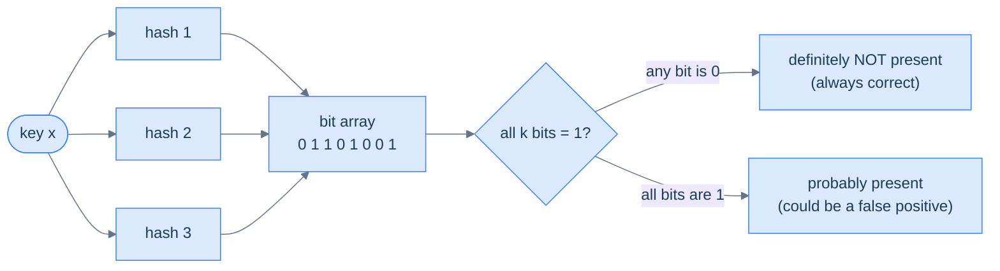

# 23. Probabilistic data structures

## TL;DR
> Sometimes the *exact* answer is too expensive to keep. Counting a billion distinct users exactly means storing a billion IDs; tracking which of a hundred million URLs you've cached means storing a hundred million URLs. Probabilistic data structures answer the same questions in a tiny, **fixed** amount of memory by accepting a small, **one-sided** error. The big three: a **Bloom filter** answers *"is x in the set?"* in ~1.2 bytes per element with **false positives but never false negatives** (a "no" is always true); **HyperLogLog** answers *"how many distinct things have I seen?"* — Redis does it in **12 KB with 0.81% error**, whether the true count is a thousand or a billion; and a **Count-Min Sketch** answers *"how many times has x appeared?"* with a counter grid that **only ever overestimates**. The thread through all three: *being approximately right in a kilobyte beats being exactly right in a gigabyte* — as long as you know which direction the error can go and design so that direction is harmless.

## 1. Motivation

In **April 2014**, Redis 2.8.9 shipped a strange new pair of commands — `PFADD` and `PFCOUNT` — and its creator Salvatore Sanfilippo (**antirez**) wrote a blog post titled *Redis new data structure: the HyperLogLog*. The pitch sounded impossible: give it a stream of items and it will tell you **how many distinct ones** there were, using a constant **12 KB of memory** and a **standard error of 0.81%** — and it doesn't matter whether you fed it ten items or ten billion. Twelve kilobytes. Always.

To feel why that's astonishing, picture the obvious way to count unique visitors to a busy site: keep a `Set` of every visitor ID you've seen, and the answer is its size. Correct — and ruinous. A billion unique 64-bit IDs is **8 GB** just for the raw values, and a real hash set's pointers and load factor push that to *tens* of gigabytes, per counter, per day. Want "unique visitors" sliced by country, by hour, by campaign? Multiply. The exact answer doesn't fit, and it certainly doesn't fit in the RAM cache where you need the count to be instant.

HyperLogLog throws away the one thing you don't actually need — the identities of the visitors — and keeps just enough statistical residue to *estimate the count*. The error is real but bounded and tiny, and the memory is flat regardless of scale. That bargain — **a sliver of accuracy for orders of magnitude less space** — is the entire family this lesson is about. We met one member already: [lesson 22](/cortex/system-design/storage-and-search/lsm-trees-vs-btrees)'s claim that "a bloom filter lets an LSM-tree skip SSTables that can't contain your key." Time to open the toolbox.

## 2. Intuition (Analogy)

The unifying idea is a **sketch, not a photograph.** A photograph records every pixel so you can answer any question about a scene later; a police sketch records *just enough* to answer one question — *"is this the person?"* — in a fraction of the space. Each structure here is a sketch tuned to exactly one question, and it's useless for the others.

The most beautiful of the three intuitions is HyperLogLog's, and it's pure coin-flipping. Suppose I flip a fair coin repeatedly and only tell you the **longest run of heads** I ever saw in a row. If I say "the best I got was 3 heads in a row," you'd guess I didn't flip many times. If I say "I once got **20** heads in a row," you'd correctly suspect I flipped *millions* of times — because a run of 20 heads has probability 1-in-2²⁰, so you need on the order of a million attempts to expect one. HyperLogLog hashes every item to a random-looking bit string and tracks the **longest run of leading zeros** it has ever seen. A long run of zeros is the fingerprint of *many distinct items* having passed through, the same way a 20-head streak is the fingerprint of many flips. It keeps not one but thousands of these "longest-run" counters (one per bucket) and combines them, which is what turns a wild single guess into a 0.81% estimate.

The other two are just as physical. A **Bloom filter** is a long row of light switches, all off. To record an item, you hash it a few ways and flip *those* switches on. To check an item, you look at its switches: if **any** is still off, that item was *definitely* never recorded (you'd have flipped it on); if they're **all** on, it was *probably* recorded — though someone else's hashes might have flipped those same switches, which is the false positive. A **Count-Min Sketch** is a few rows of tally-mark columns; each item, when it arrives, adds a tally to one hashed column **per row**. Because collisions only ever *add* extra tallies, the **smallest** of an item's columns is always its closest-to-true count. Switches, coin-flip streaks, tally columns — hold those three pictures.

## 3. Formal definitions

All three replace an exact structure (set, distinct-set, frequency map) with a sketch that has **bounded, one-sided error** and **sub-linear (often fixed) space**.

| Structure | Answers | Error mode | Typical space |
|---|---|---|---|
| **Bloom filter** | "Is *x* in the set?" (membership) | **false positives only** — never a false negative | ~9.6 bits (~1.2 bytes) per element at 1% FP |
| **HyperLogLog** | "How many *distinct*?" (cardinality) | symmetric ±error, std. err = 1.04/√m | fixed (Redis: 12 KB) |
| **Count-Min Sketch** | "How many times has *x* appeared?" (frequency) | **overestimates only** — never undercounts | fixed grid (depth × width counters) |

**Bloom filter** (Burton H. Bloom, *Space/time trade-offs in hash coding with allowable errors*, CACM 1970). A bit array of **m** bits and **k** independent hash functions. *Insert*: hash the item k ways, set those k bits to 1. *Query*: hash k ways; if **all** k bits are 1, answer "probably present"; if **any** is 0, answer "definitely not present." It can never miss a member (you only ever set bits, never clear them), so a "no" is always correct — but unrelated items can collectively set all of some item's bits, yielding a **false positive**. The false-positive rate is `(1 − e^(−kn/m))^k`, minimized by choosing `k = (m/n)·ln 2`; at the optimum you need about `9.6` bits per element for a **1% FP rate** — and that's *independent of how big the items are*, which is the whole trick. Standard Bloom filters don't support deletion.

**HyperLogLog** (Flajolet, Fusy, Gandouet & Meunier, 2007; the Redis implementation is antirez's, 2014). Hash each item to 64 bits; use the first **p** bits to pick one of `m = 2^p` **registers**, and record in that register the **position of the leftmost 1-bit** (i.e. the run of leading zeros + 1) of the remaining bits. Each register thus holds "the longest zero-run I've seen route to me." The cardinality estimate combines all m registers via a **harmonic mean** (which tames the outliers). The standard error is **1.04/√m**; Redis uses `m = 16,384` registers of 6 bits each → `1.04/√16384 ≈ 0.81%`, packed into **12 KB**.

**Count-Min Sketch** (Cormode & Muthukrishnan, 2005). A grid of counters, **depth d** rows × **width w** columns, with d independent hash functions. *Add x*: in each row, hash x to a column and increment that counter. *Estimate x*: take the **minimum** of x's d counters. Since each counter is `true_count + collisions ≥ true_count`, every counter is an upper bound and the minimum is the **tightest** one — so the sketch **never undercounts**, only overcounts. Error scales as `ε = e/w` (wider → tighter) with confidence `1 − δ = 1 − e^(−d)` (deeper → more reliable).

## 4. Worked Example — one analytics pipeline, three sketches

A news site is being hammered by a breaking story. Three questions, all needed live on a dashboard, all answered from the request stream:

**Q1: "How many unique visitors today?"** — cardinality → **HyperLogLog.** Say the true answer is **50,000,000** distinct visitor IDs. The exact `Set` would cost ~400 MB *just for the raw 8-byte IDs* (realistically 1–2 GB with overhead). The HLL costs **12 KB** and reports, say, 50.2M — within its **0.81%** standard error, i.e. roughly **±405,000**. For a dashboard that says "≈50M visitors," that error is invisible and the memory saving is ~100,000×.

**Q2: "Have we already cached this URL at the edge?"** — membership → **Bloom filter** (exactly the CDN case from the lesson stub). With **100 million** URLs at the 1% setting, the filter is `100M × 1.2 bytes ≈ 120 MB` — versus *gigabytes* to store the URLs themselves (URLs are long; the filter's size doesn't care). On a request, we check the filter: a **"no"** is always true, so we *know* it's a first-time URL and can apply our "don't cache one-hit-wonders" rule with certainty. A **"yes"** is right 99% of the time and, 1% of the time, a false positive.

**Q3: "What are the top 10 trending search terms this minute?"** — frequency → **Count-Min Sketch** feeding a small top-K heap. Each search term increments its d cells; the heap keeps the current heaviest. The sketch is a few hundred KB regardless of how many *millions* of distinct queries fly by.

**The failure case — a false positive in the wrong place.** Q2's Bloom filter is *safe* because its false positive is harmless: occasionally we think we've seen a URL we haven't, so we cache something we'd probably have cached anyway. Now suppose a junior engineer reuses the same Bloom filter for a different question: *"has this user already used their one free trial? If yes, deny them."* A 1% false positive now means **1 in 100 brand-new users is wrongly told 'you've already used your trial'** — the filter's "yes" is only *probably* true, but the code treated it as certain, and real customers get turned away. The bug isn't in the Bloom filter; it's in pointing its **false-positive direction at an action that must not fire wrongly**. A Bloom filter is safe only when a false "yes" triggers something cheap and recoverable — a confirmatory exact lookup (this is exactly how Chrome's Safe Browsing uses one: a Bloom "maybe-malicious" hit triggers a precise server check, never an outright block). Same structure, same 1% — benign in Q2, a customer-harming defect when the error points the wrong way.



<p align="center"><strong>A Bloom filter query: the "no" path is always true; only the "yes" path can be wrong. Design so a wrong "yes" is cheap.</strong></p>

## 5. Build It

A Bloom filter is tiny to build and wires the §3 math right in — it sizes its own bit array and hash count from your target capacity and false-positive rate:

```python
import math, hashlib

class BloomFilter:
    def __init__(self, n, fp_rate=0.01):
        # size the bit array (m) and hash count (k) from capacity n + target FP rate
        self.m = math.ceil(-n * math.log(fp_rate) / (math.log(2) ** 2))   # bits
        self.k = max(1, round((self.m / n) * math.log(2)))                # optimal hashes
        self.bits = bytearray((self.m + 7) // 8)

    def _indices(self, item):
        # double hashing: derive k bit positions from two base hashes
        h = hashlib.sha256(item.encode()).digest()
        h1 = int.from_bytes(h[:8], "big")
        h2 = int.from_bytes(h[8:16], "big") | 1
        for i in range(self.k):
            yield (h1 + i * h2) % self.m

    def add(self, item):
        for idx in self._indices(item):
            self.bits[idx // 8] |= 1 << (idx % 8)          # set the bit

    def __contains__(self, item):
        return all(self.bits[idx // 8] >> (idx % 8) & 1    # all k bits set?
                   for idx in self._indices(item))

bf = BloomFilter(n=1_000_000)        # m ≈ 9.6M bits ≈ 1.2 MB, k ≈ 7
bf.add("https://example.com/a")
print("https://example.com/a" in bf)  # True  (definitely added)
print("https://example.com/z" in bf)  # almost always False; ~1% of the time a false "True"
```

That `in` check is the whole structure: a `False` is *guaranteed* correct (some bit was 0), a `True` is right ~99% of the time. The Count-Min Sketch is just as small, and shows off why **min** is the magic word:

```python
class CountMinSketch:
    def __init__(self, width=2048, depth=5):
        self.w, self.d = width, depth
        self.grid = [[0] * width for _ in range(depth)]

    def _cols(self, item):
        h = hashlib.sha256(item.encode()).digest()
        return [int.from_bytes(h[r*4:(r+1)*4], "big") % self.w for r in range(self.d)]

    def add(self, item, count=1):
        for r, c in enumerate(self._cols(item)):
            self.grid[r][c] += count

    def estimate(self, item):
        return min(self.grid[r][c]                  # min ⇒ the tightest upper bound,
                   for r, c in enumerate(self._cols(item)))   # because collisions only ADD
```

Because every collision *adds* to a counter, each of an item's `d` cells is an over-count; the **smallest** has suffered the fewest collisions and is closest to the truth. Taking the min is what makes the sketch one-sided (over-, never under-count). HyperLogLog's register-and-harmonic-mean estimator is messier to show in a few lines, but its core is one update: `register[bucket] = max(register[bucket], leading_zeros(hash) + 1)`.

## 6. Trade-offs

The trade is always the same shape — **exactness and enumeration, for fixed tiny space and a bounded one-sided error**:

| Question | Exact way | Exact space @ 50M items | Sketch | Sketch space | Error |
|---|---|---|---|---|---|
| Membership | hash set of keys | ~GBs (stores full keys) | Bloom filter | ~60 MB (1.2 B/item) | FP only, **no FN** |
| Cardinality | hash set, take size | ~GBs | HyperLogLog | **12 KB** (flat) | ±0.81% |
| Frequency / top-K | hash map of counts | ~GBs | Count-Min Sketch | KBs–low MBs | **overcount only** |

What you give up is concrete: you usually **can't enumerate** the elements back out, you **can't delete** from a plain Bloom filter, and every answer carries an error bar. What you gain is just as concrete: the structure **fits in CPU cache**, every operation is **O(k)** or **O(d)** (a handful of hashes), and the size **doesn't grow with the data** (HLL) or grows far slower than the exact form (Bloom/CMS). The decision rule has two clauses, and you need *both*: use a sketch when **(1)** the exact structure won't fit where you need it (RAM, cache, every browser, every edge node), **and (2)** a **bounded, one-sided error in a known direction is acceptable** for the question you're asking. If either clause fails — the exact data fits fine, or a wrong answer is catastrophic — keep the exact structure.

## 7. Edge cases and failure modes

- **Bloom: never point the false positive at a harmful action.** A false "yes" must trigger something cheap and recoverable (a confirmatory exact lookup, a redundant cache write) — *never* an irreversible deny/drop/skip, or you'll silently harm the ~1% (the §4 free-trial bug).
- **Bloom: no deletes, and saturation is terminal.** You can't clear a bit (another element may rely on it), so plain Bloom filters only get *dirtier*. Insert far past the capacity `n` you sized for and the FP rate climbs toward 100% — every query says "maybe." Size for real cardinality; use a **counting Bloom filter** or **cuckoo filter** if you genuinely need deletion.
- **HyperLogLog answers cardinality and *nothing else*.** You cannot ask it "is x a member?" or list what it saw. **Unions** are clean (merge registers by max); **intersections** via inclusion–exclusion compound the error and often produce garbage. Reaching for set operations HLL doesn't support is a classic misuse.
- **Count-Min: a light item can be falsely flagged as heavy.** A rare key that collides with a frequent one inherits an inflated count, so CMS can *over*-report a small item as a heavy hitter (but, being one-sided, it will **never miss a true heavy hitter**). Too-narrow a width makes collisions — and this error — worse.
- **Hash quality and adversarial input.** All three assume good, independent hashing. A weak or unseeded hash collapses the guarantees; worse, an attacker who can choose inputs can deliberately collide them to spike a Bloom filter's false positives or a CMS's counts. Use well-distributed, **seeded/keyed** hashes when inputs are untrusted.
- **Forgetting the error bar.** A dashboard reading "1,000,000 unique users" from an HLL should display "≈", and alerts shouldn't fire on a 0.8% wobble that is *just the standard error*. Treating an estimate as an exact number is a human failure mode that causes real false alarms.

## 8. Practice

> **Exercise 1 — Size a Bloom filter.**
> You expect **10 million** URLs and want a **1% false-positive rate**. Roughly how many bits total, how many bytes, how many bits per element, and how many hash functions `k`? Why doesn't the URL *length* matter?
>
> <details>
> <summary>Solution</summary>
>
> Using `m = −n·ln(p)/(ln 2)²`: `m = −10⁷ × ln(0.01) / 0.4805 ≈ 10⁷ × 4.605 / 0.4805 ≈ 9.59 × 10⁷ bits`, i.e. about **96 Mbit ≈ 12 MB**, which is **~9.6 bits per element**. The optimal hash count `k = (m/n)·ln 2 ≈ 9.59 × 0.693 ≈ 6.6 → 7` hashes. URL *length is irrelevant* because the filter only ever stores **bits flipped by hashes** of each URL, not the URL itself — a 30-character URL and a 300-character one each cost the same ~9.6 bits. Storing the 10M URLs *exactly* would be hundreds of MB to GBs; the filter is 12 MB flat. That length-independence is the property that makes Bloom filters viable at CDN/browser scale.
>
> </details>

> **Exercise 2 — Pick the structure (and spot the trap).**
> Choose one for each: (a) "How many distinct IPs hit us this hour?"; (b) "Has this user ID already claimed the signup bonus?" — and a wrongly-denied new user is unacceptable; (c) "Which 10 endpoints are called most this minute?"
>
> <details>
> <summary>Solution</summary>
>
> **(a) HyperLogLog** — pure cardinality, flat tiny space, ±~1% is fine for an hourly figure. **(b) Trap!** A Bloom filter's only error is a false **"yes"**, which here means *"you already claimed it → denied"* for a brand-new user — exactly the unacceptable outcome. Either use an **exact set/DB lookup**, or use the Bloom filter *only as a fast negative* ("no" → definitely new, proceed) and **confirm every "yes" against the exact store** before denying. **(c) Count-Min Sketch + a min-heap** of the top-K. CMS never *under*counts, so a genuine heavy hitter is never missed; the worst case is occasionally over-ranking a colliding light item, which a slightly wider sketch fixes. The lesson: match the structure's *error direction* to what's safe.
>
> </details>

> **Exercise 3 — Why min, not average or max?**
> In a Count-Min Sketch you estimate an item's frequency as the **minimum** of its `d` counters. Prove to yourself why min is the right reduction, and what that implies about the sketch's error direction.
>
> <details>
> <summary>Solution</summary>
>
> Each time the item appears, **all `d` of its counters are incremented** — so absent any collisions every counter equals the true count. Collisions happen when *other* items hash into the same cell, and they only ever **add** to a counter. Therefore every one of the item's `d` counters equals `true_count + (collisions in that cell) ≥ true_count` — each is an **upper bound**. The counter that happened to suffer the **fewest** collisions is the **smallest**, hence the **tightest** upper bound, so the **minimum** is the best estimate available. Averaging would drag in the noisy high-collision cells; the maximum is the worst possible estimate. Because every counter is ≥ the truth, the min is too — which is the formal reason a Count-Min Sketch can **only overestimate, never underestimate**. That one-sidedness is exactly what makes it safe for "is this above a threshold?" heavy-hitter questions.
>
> </details>

## Your Turn

Before you move on, check your understanding with the coach — explain the idea, apply it, weigh the trade-offs, then defend your reasoning.

<div class="concept-coach"></div>

## In the Wild

- **[antirez — "Redis new data structure: the HyperLogLog"](https://antirez.com/news/75)** (2014) — the §1 motivation, from the person who shipped it: 12 KB, 0.81% error, no practical cardinality limit, and a clear walk through the leading-zeros intuition.
- **[Burton H. Bloom — "Space/time trade-offs in hash coding with allowable errors"](https://dl.acm.org/doi/10.1145/362686.362692)** (CACM, 1970) — the origin of the entire idea: accept a tunable error rate to shrink a hash-based membership test. Fifty-plus years old and still everywhere.
- **[Cormode & Muthukrishnan — "An Improved Data Stream Summary: The Count-Min Sketch and its Applications"](http://dimacs.rutgers.edu/~graham/pubs/papers/cm-full.pdf)** (2005) — the CMS paper; the min-of-rows estimator, the error/confidence bounds, and the heavy-hitters application.
- **[Apache Cassandra — Bloom filters](https://cassandra.apache.org/doc/latest/cassandra/managing/operating/bloom_filters.html)** — the lesson-22 callback made operational: a Bloom filter on every SSTable lets a read skip files that can't hold the key, eliminating ~99% of pointless disk seeks at a 1% FP setting. The single most common production Bloom filter you'll touch.
- **[Flajolet, Fusy, Gandouet & Meunier — "HyperLogLog"](https://algo.inria.fr/flajolet/Publications/FlFuGaMe07.pdf)** (2007) — the algorithm itself: stochastic averaging across registers and the harmonic mean that yields the `1.04/√m` error. The math behind the magic in §1.

---

> **Next:** [24. Time-series databases](/cortex/system-design/storage-and-search/time-series-databases) — sketches shine on *firehoses*, and one firehose is so universal it earned its own database shape: metrics and events stamped with time, arriving append-only, queried by range, and mostly never updated. Next we'll see why time-series databases (Prometheus, InfluxDB, TimescaleDB) lay data out **by time**, downsample the old stuff to keep it cheap, and lean on the very LSM-tree and sketch ideas we just built.
