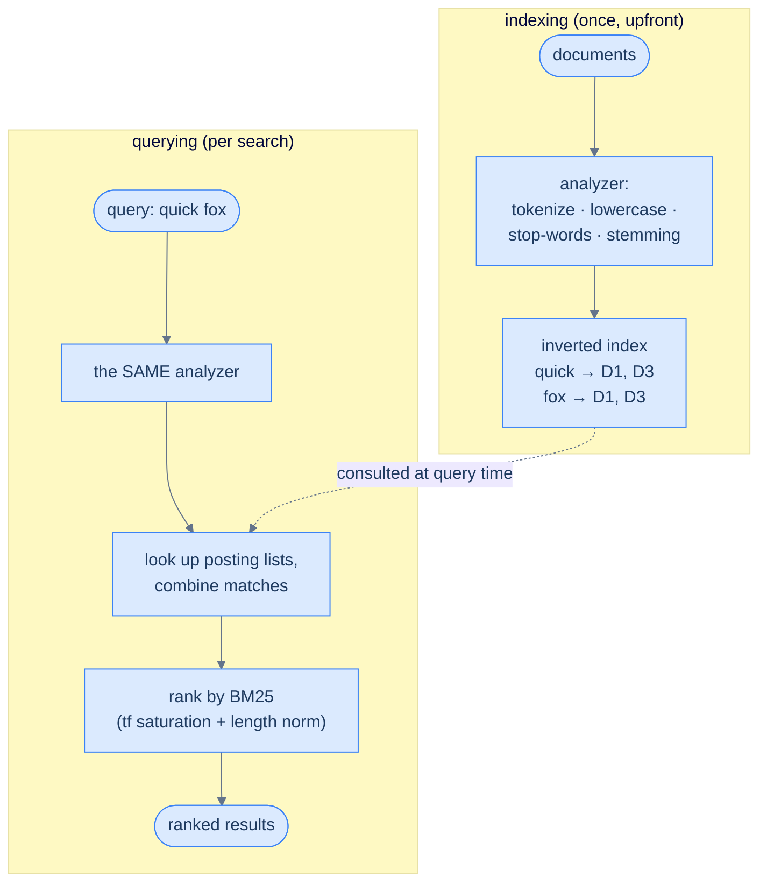

# 25. Search systems

## TL;DR
> Search is not "scan every document for the word" — at any real scale that's hopeless. Instead you build an **inverted index**: a map from each *term* to the list of documents that contain it (its **posting list**), so a query becomes a fast lookup, not a scan. Before indexing, text runs through an **analyzer** (tokenize → lowercase → drop stop-words → stem), and the query runs through the *same* analyzer so "Running" matches "run." Matching docs are then **ranked** by relevance. The old scheme, **TF-IDF**, rewards terms that are frequent in a document but rare across the corpus — but it's fooled by keyword-stuffing and biased toward long documents. **BM25** fixes both with two knobs: **term-frequency saturation** (`k1`, default 1.2 — the 10th occurrence of a word barely beats the 2nd) and **document-length normalization** (`b`, default 0.75). BM25 is the default in **Lucene**, **Solr**, **Elasticsearch**, and **OpenSearch** — and it's why a stuffed spam page doesn't automatically top your results.

## 1. Motivation

In **February 2023**, GitHub published *The technology behind GitHub's new code search* — the story of why they threw out general-purpose search engines and built their own, a Rust engine called **Blackbird**. For years they'd tried to power code search with Solr and then Elasticsearch, and it never really worked. As GitHub engineer Timothy Clem put it: *"from Solr to Elasticsearch, we haven't had a lot of luck using general text search products to power code search. The user experience is poor. It's very, very expensive to host and it's slow to index."* Back when GitHub had **8 million** repositories, indexing all of them on Elasticsearch took *months*; today they have over **200 million**.

The deep reason is a beautiful lesson in matching the index to the question. Ordinary full-text search tokenizes text into *words* and indexes those — perfect for "find blog posts about quokkas," useless for code, where you need to find the **substring** `def get_user` *inside* `def get_user_by_id`. Substring search needs a different structure — an **ngram (trigram) index** — and even that, GitHub found, "aren't selective enough" at their scale: common trigrams match too many files, producing false positives and slow queries, so they engineered Blackbird around the problem.

So the takeaway isn't "Elasticsearch is bad" — it's the opposite of the naïve instinct. The instinct says *"to find a word, look through the documents."* The reality is that every serious search system **inverts** that: it does the looking-through *once*, ahead of time, and builds an index so that queries are instant lookups. *Which* index (word-level inverted index vs. trigram) depends on the query shape. This lesson builds the foundational one — the tokenized **inverted index** that powers Lucene, Elasticsearch, and OpenSearch — and the ranking math that decides which hits come first.

## 2. Intuition (Analogy)

Open any thick textbook to the **index at the back**. You want every page that discusses *mitochondria*. You do **not** start at page 1 and read all 800 pages looking for the word — that's a full scan, and it's insane for a reference book. Instead you flip to the index, find the single entry **"mitochondria → 142, 287, 511,"** and jump straight to those pages. That back-of-book index *is* an inverted index, and it already contains every idea in this lesson:

- It's organised by **term**, not by page. The forward direction (page → its words) is the book itself; the index is the **inversion** (word → its pages). That inversion is the entire trick.
- Each term points to a **list of locations** — its posting list. "Mitochondria" appears once in the index even though it's on many pages.
- It **ignores filler words.** There's no index entry for "the" or "and" — they're on every page, so listing them would be useless. (Stop words.)
- It **normalises forms.** The entry "running" might fold into "run," so a page that says "running" still shows up. (Stemming.)
- Building it was **upfront work** — someone (or some software) read the whole book once to construct it. But every *lookup* afterward is effort­less.

The cost model is the whole point: pay once to build the index, then answer unlimited queries in time proportional to the *number of matching pages*, not the size of the book. A search engine is a textbook index for millions of documents, rebuilt automatically as documents change — plus one thing a book index lacks: a way to **rank** the hits so the best page is first.

## 3. Formal definitions

A **forward index** maps each document to its terms (`D1 → {quick, brown, fox}`). An **inverted index** maps each term to the documents containing it — its **posting list** — usually with extra payload like the term frequency and the positions (for phrase queries):

```
quick → [D1 (tf=1), D3 (tf=3)]
brown → [D1 (tf=1), D2 (tf=1)]
fox   → [D1 (tf=1), D3 (tf=2)]
```

Building it requires an **analyzer** — a pipeline that turns raw text into index terms:

| Stage | Example: "The Quick, Running Foxes!" |
|---|---|
| **Tokenize** | `["The", "Quick", "Running", "Foxes"]` |
| **Lowercase** | `["the", "quick", "running", "foxes"]` |
| **Stop-word removal** | `["quick", "running", "foxes"]` |
| **Stemming / lemmatization** | `["quick", "run", "fox"]` |

The golden rule: the **query is analyzed by the same pipeline** as the documents, so a search for "Foxes" becomes the term `fox` and matches. Mismatch the two analyzers and you get baffling zero-result queries.

Once you have the matching documents, you **rank** them by relevance:

| Scheme | Formula (per term, summed) | What it captures | Weakness |
|---|---|---|---|
| **TF-IDF** | `tf(t,d) × log(N / df(t))` | frequent-in-doc, rare-in-corpus terms score high | rewards keyword-stuffing; biased toward long docs |
| **BM25** | `idf · tf·(k1+1) / (tf + k1·(1 − b + b·dl/avgdl))` | same idea **+ saturation + length-normalization** | a few knobs to tune |

**TF-IDF** multiplies **term frequency** (how often the term appears in this doc) by **inverse document frequency** `log(N/df)` (rare terms across the corpus are more informative — "quokka" tells you more than "the"). **BM25** ("Best Matching 25," from the Okapi work of Robertson and Spärck Jones) keeps idf but adds two corrections via parameters: **`k1`** controls **term-frequency saturation** — extra occurrences give *diminishing* returns, so the 10th "quick" barely beats the 2nd — and **`b`** controls **document-length normalization** — a long document doesn't get to win just by containing more words. The defaults are **`k1 = 1.2`** and **`b = 0.75`**, and BM25 is the default similarity in Lucene, Solr, Elasticsearch, and OpenSearch. (Elasticsearch switched its default from TF-IDF to BM25 in **version 5.0, in 2016**, citing exactly TF-IDF's weakness on length and saturation.)



<p align="center"><strong>Index once, query many. The same analyzer processes both documents and queries; BM25 ranks the matches so the best result is first.</strong></p>

## 4. Worked Example — ranking, and the spam doc that breaks TF-IDF

A tiny corpus of three documents (already analyzed: lowercased, stop-words dropped):

- **D1:** `quick brown fox`
- **D2:** `lazy brown dog sleeps`
- **D3:** `quick quick quick fox fox runs` ← a keyword-stuffed page

The inverted index:

```
quick → D1(1), D3(3)        brown → D1(1), D2(1)
fox   → D1(1), D3(2)        lazy → D2(1)   dog → D2(1)   sleeps → D2(1)   runs → D3(1)
```

Now rank for the query **`quick fox`**. With `N = 3` documents, both query terms appear in 2 docs, so `idf = log(3/2) ≈ 0.405` for each. Plain **TF-IDF** scores:

- **D3** = `tf(quick)·idf + tf(fox)·idf` = `3·0.405 + 2·0.405` = **2.027**
- **D1** = `1·0.405 + 1·0.405` = **0.811**
- D2 = 0 (contains neither term)

**TF-IDF ranks D3 first** — by a wide margin. But look at D3: `quick quick quick fox fox runs`. It's gibberish that simply *repeats* the query terms. The natural, useful answer is **D1** ("quick brown fox"), and TF-IDF buried it. **This is the failure case**, and it's not hypothetical — it's precisely why Elasticsearch abandoned TF-IDF as its default.

**BM25 fixes it with saturation.** Ignore length for a moment and apply BM25's term-frequency term `tf·(k1+1)/(tf + k1)` with `k1 = 1.2`:

- the 1st occurrence (D1's "quick"): `1·2.2/(1+1.2) = 1.00`
- the 3rd occurrence (D3's "quick"): `3·2.2/(3+1.2) = 1.57`

So D3's three "quick"s count as **1.57**, not 3 — the extra repetitions are *saturating* toward the ceiling of `k1+1 = 2.2` and adding almost nothing. The 3:1 advantage raw TF-IDF gave D3 collapses to ~1.57:1, and once you add **length normalization** (`b = 0.75`, which docks D3 for its padding), D1 the concise natural answer competes with or beats the spam. Two parameters, two real-world pathologies (stuffing and length bias) defanged. That's the whole reason BM25 won.

## 5. Build It

A working inverted index with TF-IDF ranking is about 25 lines of Python — and it reproduces the §4 result, spam doc and all:

```python
import math, re
from collections import defaultdict

def analyze(text):
    return re.findall(r"[a-z0-9]+", text.lower())     # toy analyzer: lowercase + split

class SearchEngine:
    def __init__(self):
        self.index = defaultdict(dict)   # term -> {doc_id: term_frequency}  (the inverted index)
        self.doc_count = 0

    def add(self, doc_id, text):
        self.doc_count += 1
        for tok in analyze(text):
            self.index[tok][doc_id] = self.index[tok].get(doc_id, 0) + 1

    def search(self, query):
        scores = defaultdict(float)
        for term in analyze(query):                   # SAME analyzer as indexing
            postings = self.index.get(term, {})
            if not postings:
                continue
            idf = math.log(self.doc_count / len(postings))   # rare terms weigh more
            for doc_id, tf in postings.items():
                scores[doc_id] += tf * idf            # classic TF-IDF
        return sorted(scores.items(), key=lambda kv: kv[1], reverse=True)

engine = SearchEngine()
engine.add("D1", "the quick brown fox")
engine.add("D2", "the lazy brown dog sleeps")
engine.add("D3", "quick quick quick fox fox runs")   # keyword-stuffed
for doc_id, score in engine.search("quick fox"):
    print(doc_id, round(score, 3))
# D3 2.027   D1 0.811   <- raw TF-IDF ranks the keyword-stuffed D3 first
```

That `self.index` *is* the inverted index — term → `{doc: tf}` — and `search` does exactly what the textbook-index analogy promised: it looks up only the posting lists for the query terms and scores just those docs, never touching D2 or scanning any text. To upgrade it to **BM25**, you change one line: replace `tf` in the score with the saturating, length-normalized term `tf*(k1+1)/(tf + k1*(1 - b + b*dl/avgdl))` (tracking each doc's length `dl` and the average `avgdl`). That single substitution is what demotes the spam doc D3 — the mechanism from §4, in code. Real engines like Lucene add the hard parts this toy skips: compressed posting lists, positions for phrase queries, and **immutable segments** that are merged over time — the very same SSTable-and-compaction design you met in the [LSM-tree lesson](/cortex/system-design/storage-and-search/lsm-trees-vs-btrees).

## 6. Trade-offs

| Dimension | Full scan (`grep`) | Inverted index |
|---|---|---|
| **Query time** | O(total corpus size) | O(matching documents) |
| **Index build** | none | upfront: analyze + index every doc |
| **Extra storage** | none | posting lists (often 20–100% of the text size) |
| **Updates** | trivial (nothing to maintain) | re-analyze + merge segments |
| **Substring / regex** | yes (`grep` shines) | **no** — only whole indexed tokens (need an ngram index) |
| **Ranking** | none | TF-IDF / BM25 relevance |

The first trade is **scan vs. index**: a scan needs zero preparation and handles arbitrary patterns (substrings, regex), which is why `grep` and code search lean on it (or on a trigram index); an inverted index pays upfront and can *only* match the tokens it indexed, but then answers ranked term queries over millions of documents in milliseconds. The second trade is **the ranking function**: TF-IDF is simpler and fine for small or trusted corpora, but BM25's saturation and length-normalization are nearly free and far more robust — there's little reason to choose TF-IDF today, which is why every major engine defaulted away from it. The third is **freshness vs. throughput**: immutable segments make indexing fast and search near-real-time, but you pay an ongoing **merge** cost (the LSM tax from lesson 22). Pick the index to match the *query shape*: tokens → inverted index; substrings → trigram; not-text-at-all → the wrong tool entirely (see the practice).

## 7. Edge cases and failure modes

- **Analyzer mismatch (index vs. query).** If documents are stemmed at index time but the query isn't (or uses a different analyzer), "running" won't find `run` and you get **zero results with no error** — the single most common, most baffling search bug. Index-time and query-time analysis must match.
- **Keyword stuffing and TF spam.** Naïve term-frequency rewards repetition (the §4 D3). BM25's `k1` saturation blunts it, but a determined spammer still games pure text signals — at web scale you need quality signals *beyond* the index (links, behaviour, freshness). Relevance is an arms race, not a solved equation.
- **The "to be or not to be" problem.** Aggressively dropping stop-words breaks queries that *are* stop-words — the band "The The," the phrase "to be or not to be," the language "C." Modern engines keep stop-words and let BM25's idf naturally down-weight them, rather than deleting information you might need.
- **Substring/regex needs a different index.** An inverted index keys on whole tokens; it cannot find `user` inside `getUserName` or evaluate a regex. That requires an **ngram/trigram** index — GitHub's exact reason for Blackbird. Reaching for a tokenized engine to do substring/code search is a category error.
- **Near-real-time lag.** A freshly indexed document isn't searchable until a **refresh** rolls it into a segment (Elasticsearch refreshes about once a second by default). Index a doc then immediately search for it in a test and it's "missing" — that's the refresh interval, not a bug. Force a refresh in tests; never force it per-write in production.
- **Relevance ≠ correctness.** BM25 returns a *ranked* list, not a verified answer. Tuning relevance (synonyms, field boosts, `k1`/`b`) is endless and domain-specific; treating the top hit as ground truth — or the score as an absolute — will burn you.

## 8. Practice

> **Exercise 1 — Build the index and spot the spam.**
> Corpus: **D1** = "cheap flights to paris", **D2** = "paris travel guide and tips", **D3** = "cheap cheap cheap cheap flights flights". Write the posting lists for `cheap` and `flights`, then rank the query **`cheap flights`** by raw TF-IDF. Which doc wins, why is that wrong, and what does BM25 do about it?
>
> <details>
> <summary>Solution</summary>
>
> Posting lists: `cheap → D1(1), D3(4)` and `flights → D1(1), D3(2)`. Both terms appear in 2 of `N=3` docs, so `idf = log(3/2) ≈ 0.405` each. TF-IDF: **D3** = `4·0.405 + 2·0.405 = 2.43`; **D1** = `1·0.405 + 1·0.405 = 0.81`; D2 = 0. **D3 wins** — but D3 ("cheap cheap cheap cheap flights flights") is pure keyword-stuffing, while **D1** ("cheap flights to paris") is the genuinely useful result. BM25's **`k1` saturation** makes D3's 4 "cheap"s count like `4·2.2/(4+1.2) ≈ 1.69` instead of 4, and its **`b` length-normalization** further docks the padding, so D1 climbs back to the top. This is the §4 mechanism on a new corpus — and the reason real engines rank with BM25, not raw term frequency.
>
> </details>

> **Exercise 2 — What do BM25's two knobs fix?**
> Name the specific problem each of BM25's parameters (`k1`, `b`) solves, with a concrete example, and why TF-IDF suffers without them.
>
> <details>
> <summary>Solution</summary>
>
> **`k1` — term-frequency saturation.** Without it, score grows *linearly* with term count, so repeating a word 50 times scores 50×, and keyword-stuffing wins (a product page with "cheap cheap cheap…" dominating real results). `k1` makes extra occurrences give diminishing returns — the 10th "cheap" adds almost nothing over the 2nd — so repetition stops paying. **`b` — document-length normalization.** Without it, a long document scores higher simply because it contains *more words* and thus more chances to match; a sprawling 5,000-word page beats a focused 100-word answer. `b` penalizes length so the concise, on-topic doc isn't drowned by a verbose one. TF-IDF has **neither** correction, so it is simultaneously spam-biased (no saturation) and length-biased (no normalization) — exactly the two failings Elasticsearch cited when it switched to BM25.
>
> </details>

> **Exercise 3 — Pick the index.**
> Choose the right structure and justify: (a) full-text search over 10 million blog posts with ranked relevance; (b) "find every file containing the substring `TODO(alice)`" across a 200M-repo code host; (c) "how many *distinct* users ran a search today?"
>
> <details>
> <summary>Solution</summary>
>
> **(a) Inverted index** (Lucene / Elasticsearch / OpenSearch) with **BM25** ranking — the canonical full-text case: tokenized terms, ranked relevance, millions of docs. **(b) A trigram / ngram index**, not a standard inverted index — you're matching a **substring** inside identifiers (`TODO(alice)` may sit inside larger tokens), which whole-token indexing can't do. This is exactly GitHub's Blackbird problem from §1. **(c) Neither — it's not a search problem at all.** "How many distinct users" is a **cardinality** question → **HyperLogLog** from [lesson 23](/cortex/system-design/storage-and-search/probabilistic-data-structures), in 12 KB. The meta-lesson of this whole part: match the data structure to the *shape of the question*, and don't force one tool to do another's job.
>
> </details>

## In the Wild

- **[GitHub — "The technology behind GitHub's new code search"](https://github.blog/engineering/architecture-optimization/the-technology-behind-githubs-new-code-search/)** (Feb 2023) — the §1 motivation: why general-purpose engines (Solr, Elasticsearch) couldn't power code search at 200M repos, why code needs a trigram index, and how they built Blackbird in Rust. A rare, candid "we outgrew the standard tool" story.
- **[Apache Lucene](https://lucene.apache.org/)** — the Java library (Doug Cutting, 1999) under Elasticsearch, Solr, and OpenSearch. Its inverted index + **immutable, merged segments** are the SSTable/LSM design (lesson 22) applied to search; reading its docs demystifies all three engines at once.
- **[Elastic — "Practical BM25"](https://www.elastic.co/blog/practical-bm25-part-2-the-bm25-algorithm-and-its-variables)** (Parts 1–3) — the clearest practical walk-through of the BM25 formula, what `k1` and `b` actually do, and how to pick them. The §3–§4 math, explained by the people who ship it.
- **[OpenSearch](https://opensearch.org/)** — the Apache-2.0 fork AWS created from **Elasticsearch 7.10.2 in April 2021**, after Elastic relicensed to SSPL / Elastic License v2. A live case study in open-source licensing, forking, and why "what license is my search engine?" became a boardroom question.
- **[Manning, Raghavan & Schütze — *Introduction to Information Retrieval*](https://nlp.stanford.edu/IR-book/)** (Stanford, free online) — the canonical textbook for inverted indexes, analysis, TF-IDF, and BM25. When you want the rigorous version of everything above, this is the source.

---

> **Next:** [26. Object storage](/cortex/system-design/storage-and-search/object-storage) — we've indexed text, sketched streams, and sorted keys, but where do the *bytes* actually live — the images, videos, backups, and data-lake files measured in petabytes? Not on a database's disk. They live in **object storage** (S3 and its kin): a flat keyspace of immutable blobs with eleven-nines durability, the quiet foundation under nearly every system in this book. Next, the last lesson of the storage chapter: how S3 stores a near-infinite number of objects and almost never loses one.
