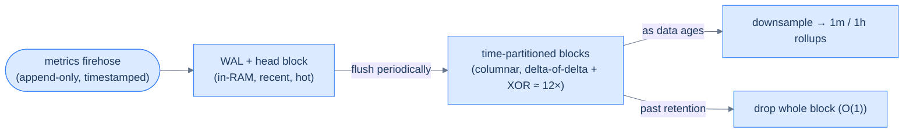
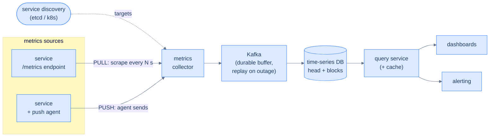
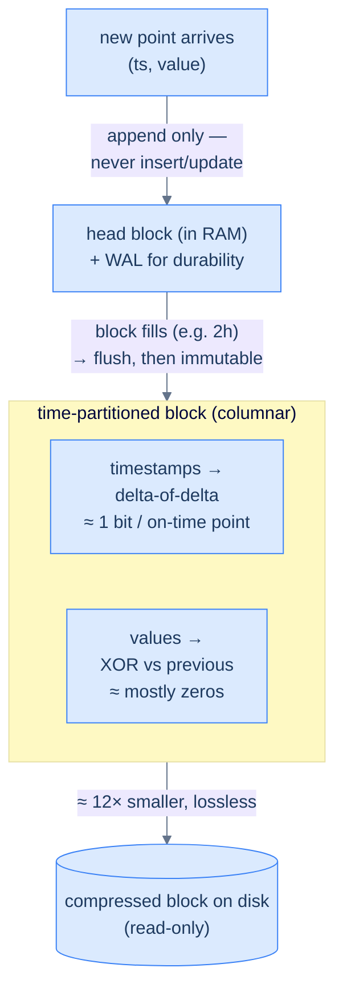

# 26. Time-series databases

## TL;DR
> A time-series database (TSDB) is specialised for one data shape: a **value stamped with a timestamp**, arriving **append-only**, **never updated**, and **queried by time range**. Because that shape is so regular, a TSDB can do things a general-purpose database can't: store data in **time-partitioned chunks** (so expiring last month is dropping a few files, not a giant `DELETE`), compress brutally hard with **delta-of-delta timestamps and XOR'd values** (Facebook's Gorilla hit **~12×, losslessly**), keep **recent data hot and old data cheap-or-gone** via downsampling and retention, and ingest a **firehose** (1M+ points/sec) that would melt a B-tree. The data model is `metric{labels} → (timestamp, value)`, where each unique **label set is one time series**. The number-one way to kill a TSDB is the **cardinality bomb**: attach a high-cardinality label (a user ID, a request ID, a URL) and the series count multiplies into the millions, the head block eats all your RAM, and the process OOMs. Examples: Prometheus, InfluxDB, TimescaleDB.

## 1. Motivation

In the autumn of **2015**, Facebook engineers published *Gorilla: A Fast, Scalable, In-Memory Time Series Database* at VLDB. The problem Gorilla solved is the problem every large system eventually has: their monitoring data — the CPU, memory, latency, and error counters streaming off every server — had grown into a firehose their existing store couldn't query fast enough. When something broke at 3 AM, engineers needed to scan *recent* metrics across millions of series in milliseconds, and the general-purpose backing store simply wasn't built for that access pattern.

Gorilla's insight was that monitoring data is almost *boringly* regular, and you can exploit that regularity ruthlessly. Timestamps arrive at a near-constant cadence (scrape every 10 seconds, forever). Values barely change point-to-point (a server at 40% CPU is at ~40% CPU a moment later). So Gorilla compressed timestamps with **delta-of-delta** encoding and float values with **XOR** encoding, and achieved an average of **~12× compression with no loss of resolution** — enough to hold a day-plus of metrics *in RAM*, where queries are instant. A single machine could compress over **1.5 million data points per second**. (Facebook later open-sourced these ideas as Beringei, and they now underpin much of the TSDB world.)

That is the whole reason this category exists. A normal relational database *can* store `(timestamp, value)` rows — but at a sustained firehose of writes its B-tree index thrashes on random writes (the wall from [lesson 24](/cortex/system-design/storage-and-search/lsm-trees-vs-btrees)), its tables grow without bound, and deleting last month means a massive `DELETE` that generates more work than the inserts did. A TSDB rearranges *everything* around the assumption "time-stamped, append-only, query-by-range" — and that one assumption changes the storage engine top to bottom.

## 2. Intuition (Analogy)

A TSDB is a **security camera system (a DVR).** Think about how it actually works, and you've understood the whole category:

- It **records continuously**, appending frames in time order. It never goes back and edits yesterday's footage — the past is immutable. (Append-only, no updates.)
- You **query it by time and place**: "show me the loading dock, 2 to 3 PM yesterday." You never ask "find me all frames where pixel (400,300) is blue" — that's not how you interrogate footage. (Query by time range + a few dimensions, not arbitrary joins.)
- It keeps **recent footage at full resolution** and ready to play, while **older footage gets thinned** — maybe full frame-rate for a week, then 1 frame/second for a month. (Recent data hot; old data downsampled.)
- It **auto-deletes after N days** to reclaim the disk, and deletion is wholesale — it drops whole days, it doesn't tediously erase frame-by-frame. (Retention by dropping whole time chunks.)
- And it stores efficiently because **frame-to-frame, almost nothing changes** — so it records mostly the *differences* between frames, not full frames. (Delta compression, because consecutive values are nearly identical.)

Continuous append, immutable past, query-by-time, recent-hot/old-thinned, auto-expiry, and delta compression. Swap "frames" for "data points" and a DVR *is* a time-series database. The rest of this lesson is just making each of those six instincts precise.

## 3. Formal definitions

The **data model**: a measurement is `metric_name{label1=v1, label2=v2, ...} → (timestamp, value)`. The metric name plus its exact set of label key-values is called a **label set**, and **each unique label set is one time series**. So `cpu_usage{host="web1", core="0", mode="user"}` and `cpu_usage{host="web1", core="1", mode="user"}` are *two different series*. The **cardinality** of a metric is the number of distinct series it produces — which, crucially, is the **product of its labels' cardinalities**. Remember that; it's where TSDBs live and die.

What makes a TSDB different from a general store is a stack of time-shaped optimisations:

| Technique | What it does | Why it matters |
|---|---|---|
| **Time-partitioned storage** (chunks / blocks / shards) | data is split into files by time window (Prometheus: **2-hour blocks**; TimescaleDB: time **chunks**) | a query for "last hour" touches one tiny chunk; expiring old data **drops whole files** instead of row-by-row `DELETE` |
| **Columnar + delta-of-delta + XOR compression** | store timestamps as the *change in the gap*, values XOR'd against the previous | regular streams compress ~**10–12×** (Gorilla) because the deltas are mostly zero |
| **Append-only head + WAL** | recent points buffer in an in-memory **head block**, protected by a write-ahead log | absorbs the write firehose sequentially; durable across restarts (the LSM idea from lesson 22) |
| **Downsampling / rollups** | aggregate raw points into coarser series (1s → 1m → 1h) as they age | long-range dashboards read cheap summaries, not billions of raw points |
| **Retention policies** | auto-drop raw data past a horizon (Prometheus default: **15 days**) | bounds storage; old detail is gone unless you shipped rollups elsewhere |

The storage engines themselves are mostly LSM-tree relatives. **InfluxDB**'s engine, the **TSM tree** ("Time-Structured Merge tree"), is explicitly LSM-like: a WAL plus read-only, sorted, columnar **TSM files** that play the role of SSTables. **TimescaleDB** takes the opposite tack — it's a **PostgreSQL extension** that keeps full SQL and ACID but adds **hypertables**, which transparently partition one logical table into many time-based **chunks** under the hood (and a `drop_chunks` to expire old data instantly). **Prometheus** is a pull-based monitoring TSDB that scrapes targets, buffers in a head block + WAL, and flushes 2-hour blocks. Three designs, one shared assumption about the data's shape.



<p align="center"><strong>The TSDB lifecycle: a firehose lands in a hot in-memory head, flushes to compressed time-partitioned blocks, then is downsampled as it ages and dropped wholesale at the retention horizon.</strong></p>

> **A note on DDIA.** *Designing Data-Intensive Applications* doesn't treat time-series databases as their own category — but its chapter on **column-oriented storage** is the foundation underneath everything here. DDIA explicitly names **InfluxDB IOx** and **TimescaleDB** as columnar engines, and describes the exact tricks a TSDB leans on: breaking a table into **blocks by timestamp range**, **column compression** (a column of similar values compresses far better than a row of mixed types), **run-length encoding** (a sorted column of repeated values collapses to "this value, ×10,000"), and a **log-structured write path** that buffers writes in memory and merges them into immutable column files on disk in batches. Read those pages as the *general* mechanism; this lesson is the *time-shaped specialisation* of it. The TSDB-specific parts — Gorilla compression, downsampling, cardinality, the metrics pipeline — come from established practice and Facebook's Gorilla paper, not DDIA.

## 4. Getting data in — the ingestion pipeline, push vs. pull

Before a single point can be compressed or queried, it has to *arrive*, and at a firehose rate that's a design problem of its own. There are two ways metrics get from a source into the collector, and the distinction is one of the most-asked questions in this whole topic.

**Pull (scraping).** The monitoring system reaches out on a schedule and *pulls* metrics from each target. Every monitored service exposes a tiny HTTP endpoint — by convention `/metrics` — that prints its current counters in a plain text format, and the collector hits that endpoint every *N* seconds (a "scrape"). **Prometheus** is the canonical puller. The collector needs to know *who* to scrape, so it leans on **service discovery** (etcd, Consul, ZooKeeper, the Kubernetes API): targets register themselves, and the collector is told whenever the fleet changes, so a freshly-booted pod gets scraped within seconds without anyone editing a config file.

**Push.** The arrow reverses: each source runs a small **agent** that *pushes* its metrics to the collector on its own schedule. **AWS CloudWatch** and **Graphite** are push systems; **InfluxDB** is typically fed this way too (its Telegraf agent pushes). The collector sits behind a load balancer and auto-scales with the incoming volume.

Neither wins outright — they fail differently, which is exactly why interviewers like the question:

| | Pull (Prometheus) | Push (CloudWatch, Graphite) |
|---|---|---|
| **"Is the target up?"** | A failed scrape *is* a health signal — silence means down | Silence is ambiguous: dead target, or just a network blip? |
| **Short-lived jobs** | A 5-second batch job may finish before it's ever scraped (needs a *push gateway* to bridge) | Natural fit — the job pushes before it exits |
| **Firewalls / network** | Collector must reach every target — awkward across data centres and NAT | Source only needs *outbound* access — friendlier to locked-down networks |
| **Knowing the target list** | Requires service discovery to track who exists | Sources announce themselves by showing up |
| **Ad-hoc debugging** | Curl the `/metrics` endpoint from your laptop anytime | No standing endpoint to poke |

Whichever direction the data flows, a large pipeline puts a **durable queue (Kafka) between the collector and the TSDB**. Without it, a TSDB hiccup means dropped metrics — and you lose observability exactly when something is going wrong. Kafka absorbs the firehose, decouples collection from storage, and lets you replay if the database falls behind; partitioning by metric name (then by labels) is how the pipeline scales horizontally. The trade-off is operational weight, and there's a respected counter-argument: Facebook's **Gorilla** deliberately *skips* the queue, engineering the ingest path itself to stay available for writes through partial failures — arguably as reliable as a Kafka buffer, with one fewer system to run.

The pipeline also raises a quiet but important question: **where do you aggregate?** You can roll counters up in the **agent** (cheap, but only trivial math), in the **stream-processing layer** before storage (Flink/Spark cut the write volume hard, but you lose the raw points and must handle late arrivals), or at **query time** (no precision lost, but every query re-scans raw data). Most systems do a little of each — and that choice is the same trade-off downsampling makes later, just earlier in the pipeline.



<p align="center"><strong>The metrics pipeline: sources expose (pull) or send (push) metrics to a collector, which buffers through Kafka so a TSDB outage never loses data; a query service fronts dashboards and alerting. Service discovery keeps the pull target list current.</strong></p>

## 5. Worked Example — a fleet's CPU metrics (and the bomb that kills it)

You monitor **10,000 servers**. Each emits `cpu_usage{host, core, mode}` every **10 seconds**, with 32 cores and 4 modes (user/system/idle/iowait) per host. Count the load:

- **Series:** `10,000 hosts × 32 cores × 4 modes = 1,280,000` distinct time series.
- **Ingest:** each series emits every 10 s → `1,280,000 / 10 = 128,000` points/second.
- **Raw bytes:** at 16 bytes/point (an 8-byte timestamp + 8-byte float) that's ~2 MB/s ≈ **177 GB/day**.

A TSDB handles this calmly. Points append to the in-memory head (sequential, not random), flush every couple of hours into **columnar time blocks**, and compress ~12× via delta-of-delta + XOR — because a 10-second cadence makes timestamp deltas constant and a steady CPU makes value deltas tiny. That 177 GB/day raw becomes **~15 GB/day** on disk; over the 15-day retention, ~220 GB instead of 2.6 TB. Expiring day 16 is *dropping a block*, not a `DELETE` over a billion rows. Long-range dashboards read downsampled 1-minute rollups, not raw 10-second points.

Now contrast a **plain RDBMS** with one big `metrics(ts, host, core, mode, value)` table and a B-tree index. At 128,000 inserts/second, each insert is a near-random write into the index — the random-write wall from lesson 22 — and the index grows without bound. You *can* survive with aggressive native partitioning (which is essentially reinventing the TSDB), but out of the box the index thrashes, vacuum falls behind, and the nightly "delete data older than 15 days" is a monster. A general store falls over at this rate where a TSDB shrugs.

**Why the hot/cold split pays off so well.** Facebook measured something striking in the Gorilla paper: **at least 85% of all queries hit data from the past ~26 hours.** Monitoring is overwhelmingly about *now* — "is the site healthy this minute?", "what changed since the deploy an hour ago?" — and almost never about a raw 10-second reading from three months back. A TSDB exploits that age curve directly with a **tiered lifecycle**: keep the most recent window at **full resolution** (raw 10-second points, often in RAM where queries are instant), then **downsample** as data ages into progressively coarser rollups, and finally **drop or archive** past the horizon. A concrete policy for our fleet might read:

| Age | Resolution | Where it lives | Why |
|---|---|---|---|
| 0–7 days | raw, 10 s | hot blocks (recent on SSD/RAM) | the 85%: live debugging, recent alerts |
| 7–30 days | downsampled to 1 min | warm | week-over-week trends, no raw needed |
| 30 days–1 yr | downsampled to 1 hr | cold / object storage | capacity planning, audits |
| > 1 yr | dropped (or kept as 1 hr rollups) | — / cheap cold storage | detail is gone; bounds cost |

Downsampling is what turns "a year of 10-second data" (impossibly large) into "a year of 1-hour rollups" (trivial). A rollup just aggregates a window of raw points into one summary point — `avg`, `max`, `min`, `count`, percentiles. **Cold storage** (cheap object storage like S3) holds the rarely-touched old rollups at a fraction of the cost of hot disk. The catch, covered in §8, is that downsampling is *lossy by design*: choose the aggregations carefully, because once the raw points expire, whatever you didn't roll up is gone forever.

**The failure case — the cardinality bomb.** A well-meaning engineer wants per-user insight and adds a **`user_id` label** to a request-count metric. Each label *multiplies* cardinality, and `user_id` is enormous. With a base of a few thousand series and **1,000,000 users**, the series count explodes into the **millions**. Here's the kill mechanism, with grounded numbers: each active series in the head block costs roughly **3–4 KB of RAM** (the series descriptor + index entries), so **1,000,000 series ≈ 4–6 GB** of head RAM *before any queries run*. Push past that and Prometheus doesn't degrade gracefully — **it OOMs and is killed**; dashboards time out, alert evaluation lags, and you've turned an observability tool into an outage. The fix is a rule of thumb worth memorising: *if a label could have more than ~10,000 distinct values in production (user IDs, request IDs, email addresses, full URLs), it does not belong in a metric label* — it belongs in a **trace or a log**, where high cardinality is the whole point. High-cardinality dimensions are the single most common way teams destroy their own monitoring.

## 6. Build It

You don't need a TSDB to *feel* why they compress so well — you need to see **delta-of-delta** encoding, the Gorilla timestamp trick. Instead of storing each timestamp, store the *change in the gap* between consecutive timestamps:

```python
def delta_of_delta(timestamps):
    """Gorilla-style timestamp compression: store the change in the interval."""
    out, prev_ts, prev_delta = [], None, 0
    for ts in timestamps:
        if prev_ts is None:
            out.append(("full", ts))               # first point: store in full
        else:
            delta = ts - prev_ts                   # the gap since the previous point
            out.append(("dod", delta - prev_delta))  # the CHANGE in that gap
            prev_delta = delta
        prev_ts = ts
    return out

# A metric scraped every 10s — almost perfectly regular, with one 11s hiccup:
ts = [1000, 1010, 1020, 1030, 1041, 1051]
for entry in delta_of_delta(ts):
    print(entry)
# ('full', 1000)
# ('dod', 0)   ('dod', 0)   ('dod', 0)     <- on-time points cost ~1 bit each
# ('dod', 1)   ('dod', -1)                 <- the single hiccup, then back to normal
```

Look at the output: for a perfectly regular cadence, every delta-of-delta is **`0`** — and a run of zeros bit-packs to about **one bit per point**. The single 11-second hiccup is the *only* thing that costs real bits (a `+1`, then a `-1` as the cadence returns). That's the entire reason a TSDB hits ~12×: monitoring data is so regular that you're really only storing the *surprises*. The same idea powers value compression — Gorilla **XORs** each float against the previous one, and since consecutive readings share most of their bits, the XOR is mostly zeros, which again compress to almost nothing. Regularity is the fuel; delta-of-delta and XOR are the engine. (A real engine adds the bit-packing, block framing, and indexing this toy skips — but the *why* is right here.)

Step back and see how this fits the **write model** as a whole. Two structural choices make the compression possible. First, writes are **append-only**: a new point is added to the *end* of the current series, never inserted into the middle, so the encoder always has "the previous point" sitting right there to diff against. Second, the stream is **partitioned by time** into self-contained blocks (Prometheus's 2-hour blocks, TimescaleDB's chunks), and *within* a block the data is laid out **by column** — all timestamps together, all values together — exactly the columnar layout DDIA describes, which is what lets delta-of-delta run down one tight stream of timestamps and XOR down another of floats. A row store interleaves the two and ruins both. The diagram below traces a single series through that path:



<p align="center"><strong>The append-only, time-partitioned write model. Points append to an in-RAM head (logged to a WAL); when a time block fills it's flushed and frozen, with timestamps and values stored in separate columns so delta-of-delta and XOR can each compress a clean, regular stream — the structural reason ~12× is achievable losslessly.</strong></p>

A subtle pay-off of freezing each block: because a flushed block is **immutable and read-only**, it never has to be re-compressed or re-indexed, and expiring it later is just deleting a file. Immutability is what makes both the compression *and* the O(1) retention drop possible — the same log-structured idea from [lesson 24](/cortex/system-design/storage-and-search/lsm-trees-vs-btrees), specialised to time.

## 7. Trade-offs

| Dimension | General-purpose RDBMS | Time-series database |
|---|---|---|
| **Write firehose** | random B-tree writes; struggles past ~10s of K inserts/s | append-only/sequential; **1M+ points/s** |
| **Compression** | row-based, modest | columnar + delta-of-delta + XOR → **~10–12×** |
| **Expiring old data** | `DELETE` + vacuum (heavier than the inserts) | **drop a whole time chunk** (≈ O(1)) |
| **Recent vs. old** | uniform treatment | time-partitioned: recent hot, old downsampled/dropped |
| **Downsampling** | hand-rolled | built-in rollups + retention policies |
| **Updates / joins / transactions** | full SQL, ACID | limited; append + range-scan is the happy path |
| **Cost of misuse** | — | **cardinality bomb** → OOM |

The decision rule is clean. If your data is **time-stamped, append-only, queried by time range, write-heavy, and rarely (never) updated** — metrics, sensor readings, financial ticks, event streams — reach for a TSDB and enjoy the compression and effortless expiry. If you need **updates in place, joins across entities, multi-row transactions, or arbitrary relational queries** — orders, accounts, inventory — a TSDB will fight you, and a relational database is right. And note the **hybrid**: TimescaleDB gives you the TSDB superpowers (chunking, compression, `drop_chunks`) *inside* PostgreSQL, so you keep SQL and joins — a sensible default when your time-series lives alongside relational data and you'd rather not run two systems.

## 8. Edge cases and failure modes

- **The cardinality bomb (the cardinal sin).** A high-cardinality label (`user_id`, `request_id`, URL, email) multiplies series into the millions; at ~3–4 KB head RAM each, you OOM the database. Keep labels low-cardinality and bounded; push per-entity identifiers into traces/logs. This is §5's failure, and it's worth repeating because everyone does it once.
- **Downsampling silently eats your peaks.** If you roll 10-second points up to 1-hour **averages**, a 2-second spike to 100% CPU averages away to nothing — and that spike was the incident. Roll up `max`, `min`, and percentiles, not just the mean, or your historical view will hide exactly what you'll want to investigate.
- **Out-of-order and late-arriving points.** TSDBs assume mostly time-ordered appends. A delayed batch carrying old timestamps can be rejected or expensive to absorb (Prometheus historically refused out-of-order samples; newer versions and other TSDBs allow it at a cost). Know your engine's policy and buffer/align accordingly.
- **Clock skew across the fleet.** Points are usually stamped at the *source*, so unsynchronised clocks smear data into the wrong time buckets and make correlation lie. Keep NTP tight, or stamp at ingest if true event-time isn't critical (a real trade-off — ingest-stamping loses the original event time).
- **Retention vs. "wait, where's last quarter?"** A short default retention (Prometheus's 15 days) means old raw data is simply *gone*. Long-range dashboards, capacity planning, and audits need **downsampled rollups shipped to long-term storage** (remote-write to a durable backend or object storage) *before* you need them — not discovered missing afterward.
- **Counter resets fool naïve math.** Monotonic counters (e.g. total requests served) reset to 0 when a process restarts; subtracting raw counter values across a reset yields a nonsensical negative. Use the TSDB's reset-aware functions (PromQL `rate()`/`increase()`), never a hand-rolled difference of raw counters.

## 9. Practice

> **Exercise 1 — Cardinality arithmetic (and the bomb).**
> A metric `http_requests_total{service, method, status, region}` has 20 services × 5 methods × 15 status codes × 6 regions, scraped every 15 s. (a) How many series, and points/second? (b) An engineer adds a `customer_id` label with 50,000 active customers. New series count, and roughly how much head RAM at ~3.5 KB/series? What should they have done?
>
> <details>
> <summary>Solution</summary>
>
> **(a)** Series = `20 × 5 × 15 × 6 = 9,000`; points/second = `9,000 / 15 = 600`/s. Tiny — a TSDB wouldn't notice. **(b)** Adding `customer_id` multiplies by 50,000: `9,000 × 50,000 = 450,000,000` series. At ~3.5 KB each, head RAM ≈ `450M × 3.5 KB ≈ 1.5 TB` — the process OOMs the instant cardinality climbs anywhere near that, and PromQL queries die long before. One label turned a 9,000-series metric into an impossible one. **What to do instead:** drop `customer_id` from the metric entirely and capture per-customer detail in **traces or logs**, where high cardinality is expected; if you need per-customer *aggregates*, pre-aggregate into a small bounded set (e.g. a `customer_tier` label with 3 values, not 50,000 IDs).
>
> </details>

> **Exercise 2 — Why delta-of-delta beats plain delta.**
> For timestamps from a steady 10-second scrape, explain why storing the **delta-of-delta** compresses better than storing the **delta**, and what a single *missed* scrape (one 20-second gap) looks like in the encoded stream.
>
> <details>
> <summary>Solution</summary>
>
> A plain **delta** of a regular 10 s cadence is the constant value `10`, repeated for every point — compressible, but it's still a real number stored over and over. The **delta-of-delta** is the *change* in that gap, which is **`0`** for every on-time point, and a long run of zeros bit-packs to roughly **one bit each** (a "same as before" flag). So a perfectly regular series costs almost nothing. A single **missed scrape** (a 20 s gap) appears as one `dod = +10` (the gap jumped from 10 to 20) immediately followed by `dod = −10` (the gap returned to 10) — two small nonzero values in an ocean of zeros. The principle: you only pay bits for **irregularities**, and monitoring data is overwhelmingly regular, which is exactly why ~12× is achievable.
>
> </details>

> **Exercise 3 — Pick the store.**
> Choose TSDB, RDBMS, or both, and justify: (a) an IoT platform — 100,000 devices, one reading/second, dashboards over the last 24 h plus a year of history; (b) an e-commerce orders table where rows get updated (status changes, refunds) and joined to customers; (c) application performance monitoring with per-endpoint latency percentiles *and* the ability to drill into individual slow requests.
>
> <details>
> <summary>Solution</summary>
>
> **(a) TSDB**, plus rollups shipped to long-term/object storage for the year (raw 1 Hz data for a full year would be huge; downsample as it ages). 100k points/s is a classic TSDB firehose and a B-tree's nightmare. **(b) RDBMS** — in-place **updates**, **joins**, and **transactions** are the antithesis of the append-only TSDB model; orders are relational data, full stop. **(c) Both, split by cardinality:** put the latency **metrics** in a TSDB with a *low-cardinality* `endpoint` label (per-endpoint percentiles), but capture **individual slow requests** in a **tracing system** keyed by request ID — never put `request_id` in a metric label (that's the cardinality bomb). The general lesson: match the store to the data's *shape*, and watch label cardinality like a hawk.
>
> </details>

## Your Turn

Before you move on, check your understanding with the coach — explain the idea, apply it, weigh the trade-offs, then defend your reasoning.

<div class="concept-coach"></div>

## In the Wild

- **[Pelkonen et al. — "Gorilla: A Fast, Scalable, In-Memory Time Series Database"](https://www.vldb.org/pvldb/vol8/p1816-teller.pdf)** (Facebook, VLDB 2015) — the §1 motivation and the source of delta-of-delta + XOR compression hitting ~12× losslessly. Open-sourced as Beringei; the compression ideas are now everywhere.
- **[Prometheus — Storage docs](https://prometheus.io/docs/prometheus/latest/storage/)** — how a real TSDB lays out data: 2-hour blocks, the in-memory head + WAL, the 15-day default retention, and the "each label set is a series" model that drives cardinality.
- **[InfluxDB — Storage engine (the TSM tree)](https://docs.influxdata.com/influxdb/v2/reference/internals/storage-engine/)** — the lesson-22 callback made concrete: a WAL plus read-only, sorted, columnar TSM files that are SSTables by another name. Proof that TSDB engines are LSM-trees in time's clothing.
- **[TimescaleDB — Hypertables & chunks](https://docs.timescale.com/use-timescale/latest/hypertables/)** — the hybrid: a PostgreSQL extension that keeps SQL/ACID/joins while partitioning into time chunks and offering `drop_chunks` for O(1) expiry. The pragmatic choice when time-series lives next to relational data.
- **[Cloudflare — "How Cloudflare runs Prometheus at scale"](https://blog.cloudflare.com/how-cloudflare-runs-prometheus-at-scale/)** — the operational reality of cardinality, retention, and federation when you're scraping a planet's worth of metrics. The best "what actually goes wrong" companion to §7.

---

> **Next:** [27. Search systems](/cortex/system-design/storage-and-search/search-systems) — we've stored data by *key* (LSM/B-tree), *sketched* it (probabilistic), and laid it out by *time* (this lesson). But how do you answer "find every document that mentions *quokka*"? That needs a different structure entirely — the **inverted index** — plus tokenization, ranking (TF-IDF, BM25), and the engines built on it (Lucene, Elasticsearch, OpenSearch). Next we build search from the index up.
