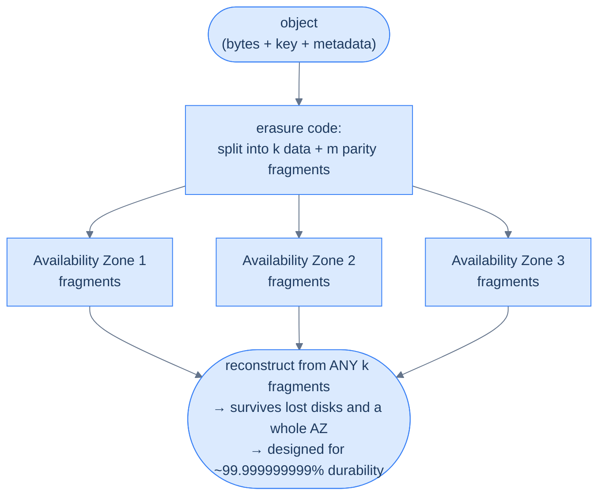
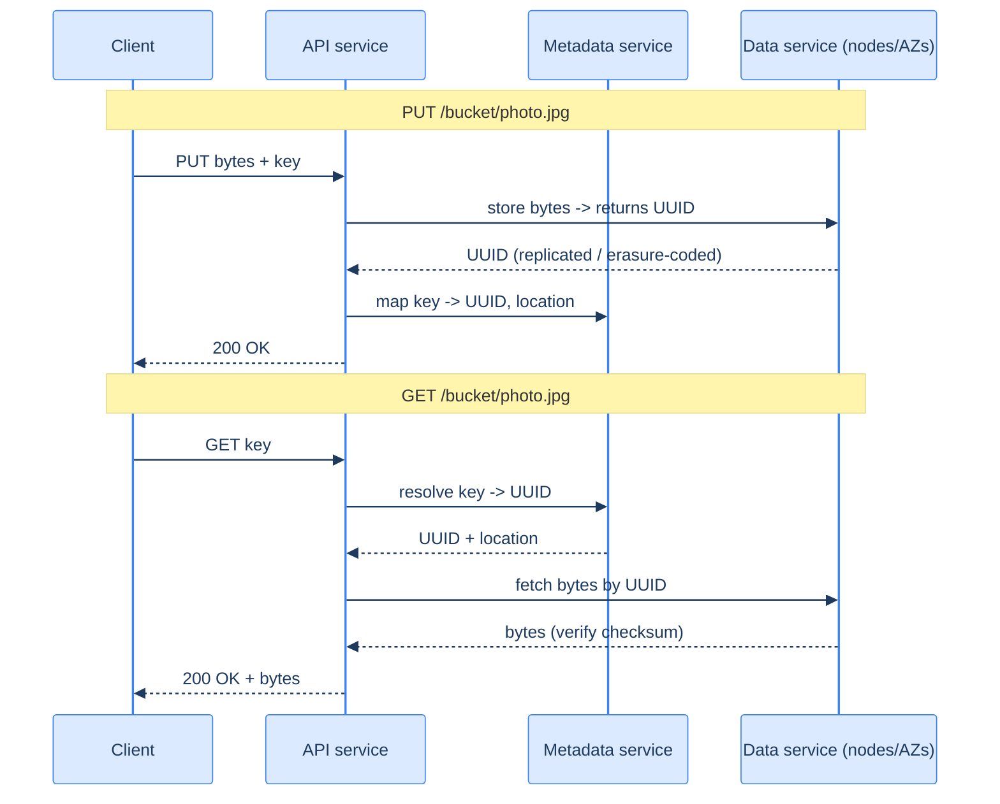

# 28. Object storage

## TL;DR
> Databases, caches, and search indexes are for *structured* data you query. But where do the raw **bytes** live — the photos, videos, backups, logs, and data-lake parquet files measured in petabytes? In **object storage**: a flat keyspace of **immutable blobs**, accessed by key over an HTTP API, with no directories, no in-place edits, and effectively unlimited scale. Amazon S3 (launched **14 March 2006**) is the archetype, and its headline property is **durability**: it's *designed* for **eleven nines — 99.999999999%** — meaning if you stored 10 million objects you'd expect to lose one roughly every **10,000 years**. It earns that with **erasure coding** across **at least three Availability Zones** plus relentless failure monitoring and repair — not by keeping three full copies. The two ideas that trip everyone up: **durability ≠ availability** (S3 can be *unreachable* without ever *losing* data — see the 2017 outage), and S3 only became **strongly read-after-write consistent in December 2020** (before that, a read right after a write might not see it).

## 1. Motivation

On **28 February 2017**, a large slice of the internet went dark for the better part of four hours. Slack, Trello, Quora, Medium, and thousands of other sites broke — and so did parts of AWS itself. The cause, per Amazon's own postmortem, was almost absurdly small: an engineer was debugging the S3 billing system in the **US-EAST-1** region and ran a command to remove a few servers, but **one input was mistyped**, and a far larger set of servers was removed than intended. Among them were servers running S3's **index subsystem** — which "manages the metadata and location information of all S3 objects in the region," and is required to serve *every* GET, LIST, PUT, and DELETE — and its **placement subsystem**, which allocates new storage and depends on the index subsystem. Both had to be fully restarted, and at S3's scale that took hours.

Two details make this the perfect doorway into object storage. First, the **blast radius**: so many systems are built on S3 that when it sneezed, the web caught a cold — including Amazon's own Service Health Dashboard, which ran on S3, so AWS had to post updates *via Twitter* because it couldn't get into its own status page. Object storage is the quiet foundation under nearly everything in this book. Second, and more subtly: **no data was lost.** This was an **availability** failure — S3 temporarily couldn't *find and serve* objects because the index was down — not a **durability** failure. The bytes were safe the entire time. That distinction, *durability versus availability*, is the heart of how object storage thinks, and we'll return to it throughout. This lesson is about the system that almost never loses your data, and why "almost never" is a number you can actually compute.

## 2. Intuition (Analogy)

Object storage is a **giant automated warehouse where you store sealed boxes by barcode** — picture an Amazon fulfilment centre, but for your data.

- You bring a **sealed box** (an object) and a **barcode label** (the key). You hand it over; the warehouse stores it and promises to return *exactly that box* when you present the barcode. (PUT and GET by key.)
- You **don't get to know or care where it's shelved** — not the aisle, not the building, not how many copies exist. The barcode is the only address you need. There's no "folder structure" you navigate; it's one enormous flat space indexed by label. (Flat keyspace — the `/` in `photos/2024/cat.jpg` is just part of the barcode, not a real directory.)
- You **can't open a stored box and edit its contents.** To change something, you bring a brand-new sealed box and replace the old one under the same barcode. (Objects are immutable — you overwrite the whole thing, you don't patch it.)
- The warehouse is run by **paranoid operators** who quietly keep your box's contents reconstructable across **several different buildings in different neighbourhoods**, so even if one building burns down, your stuff is fine. They constantly inspect for damage and re-copy anything at risk. (Redundancy across Availability Zones → durability.)
- And here's the subtle part: the warehouse can be **temporarily closed** — a power cut at the front desk, nobody to fetch boxes — *without ever losing a single box*. Closed-but-safe (an availability blip) is completely different from burned-down (a durability loss). (The 2017 outage in one sentence.)

Barcode not aisle, sealed not editable, copies in many buildings, closed-but-safe. Hold that warehouse in your head and you've understood S3.

## 3. Formal definitions

**Object storage** stores data as **objects** — `(key, value, metadata)` — in a flat container called a **bucket**, accessed over an HTTP API (PUT/GET/DELETE/LIST). It's one of three storage shapes, and the differences matter:

| | **Block storage** (EBS, disks) | **File storage** (NFS, EFS) | **Object storage** (S3) |
|---|---|---|---|
| Model | raw fixed-size blocks | hierarchical files + directories (POSIX) | flat keyspace of immutable blobs + metadata |
| Access | attached to one host | shared mount | HTTP API, from anywhere |
| Edit in place | yes | yes | **no** — replace the whole object |
| Latency | microseconds | milliseconds | tens of milliseconds (it's an HTTP call) |
| Scale | one volume (TBs) | large | effectively unlimited (S3: **trillions** of objects, up to 5 TB each) |
| Best for | a database's or OS's disk | shared application files | media, backups, data lakes, static assets |

The defining property is **durability**, and it is *not* the same as availability:

- **Durability** = the probability your data still *exists*. S3 is designed for **99.999999999% (eleven nines)** annual durability. Concretely: per object, the expected annual loss probability is about `10⁻¹¹`, so across **10,000,000 objects** you'd expect to lose **one object every ~10,000 years**.
- **Availability** = the probability you can *access* it right now. S3 Standard targets a far more modest **99.99% (four nines)**. The 2017 outage spent down *availability*; durability was never in question.

How do you reach eleven nines? Not by storing three full copies (that's only ~one-failure tolerance at 3× cost). S3 uses **erasure coding** — as S3 engineer Andy Warfield described at USENIX FAST '23, an object is split into **k data fragments + m parity fragments**, spread across **at least three Availability Zones**; you can reconstruct the whole object from **any k** of the fragments, so you survive losing up to **m** of them — at an overhead of only `(k+m)/k`, far less than full replication. On top of that, fleets of background processes **continuously checksum and re-replicate** at-risk data, because at this scale disks are *always* dying. Two more essentials: objects are **immutable** (you replace, never patch; **versioning** can keep old versions), and a single upload is capped, so large objects use **multipart upload** (split into parts, upload in parallel with per-part retries, then assemble — up to 5 TB).

S3 is the archetype, but the shape is an industry standard, and recognising it is half the battle in an interview: **Google Cloud Storage** and **Azure Blob Storage** are the other hyperscaler offerings; **MinIO** is the popular S3-API-compatible store you can self-host (it speaks the exact same PUT/GET verbs); and **Ceph** — via its RADOS Gateway — backs much of the private-cloud and OpenStack world. They differ in the details, but all share the flat-keyspace, immutable-blob, HTTP-API model. One structural idea unites their internals and is worth holding onto: **data and metadata are stored separately.** The bytes of `photos/cat.jpg` live in a **data store**; the mapping from that *name* to *where the bytes physically are* lives in a separate **metadata store**. It's the same trick as a **UNIX inode**: the filename and the file's data aren't stored together — the directory entry points at an inode, and the inode's block pointers point at the data on disk. Object storage just stretches that across a network: the metadata store maps `name → object UUID`, and a separate data layer maps `UUID → physical location`. The payoff is that the two halves can be **scaled and optimised independently** — the data store handles huge immutable blobs and erasure coding; the metadata store handles small, frequently-queried, *mutable* records (and is what makes `LIST` and versioning possible). It's also exactly the layer that failed in 2017: the index subsystem *is* this metadata store, which is why losing it broke every GET while the bytes themselves sat untouched.



<p align="center"><strong>Durability via erasure coding: an object becomes k+m fragments spread across ≥3 AZs; any k rebuild it, so losing disks — even a whole AZ — doesn't lose the object.</strong></p>

## 3.5 How a PUT and a GET actually flow

The data/metadata split from §3 isn't an implementation footnote — it *is* the architecture, and seeing requests move through it makes the whole system click. A stateless **API service** sits behind a load balancer and orchestrates three collaborators: an **IAM service** (who are you, what may you do), the **metadata service** (the `name → UUID → location` map), and a **data service** — a fleet of storage nodes spread across AZs, fronted by a routing/placement layer that decides which nodes hold a given object and tracks their health via heartbeats.

```d2
direction: right
client: Client / SDK
lb: Load balancer
api: API service (stateless) { shape: hexagon }
iam: IAM — authN / authZ { shape: hexagon }
meta: Metadata service\n(name -> UUID -> location) {
  shape: cylinder
  style.stroke: "#3b82f6"
}
place: Placement service\n(virtual cluster map, Raft) { shape: hexagon }
dr: Data routing service { shape: hexagon }
n1: Storage node — AZ 1 { shape: cylinder }
n2: Storage node — AZ 2 { shape: cylinder }
n3: Storage node — AZ 3 { shape: cylinder }

client -> lb: "PUT /bucket/key   ·   GET /bucket/key"
lb -> api
api -> iam: "check permission"
api -> meta: "PUT: write name->UUID  ·  GET: resolve name->UUID"
api -> dr: "store / fetch bytes by UUID"
dr -> place: "which nodes?"
dr -> n1: "fragments / replicas"
dr -> n2
dr -> n3
place -> n1: "heartbeats"
place -> n2
place -> n3
```

<p align="center"><strong>Object-storage architecture: the API service splits every request across an IAM check, the metadata service (name→UUID), and the data service (UUID→bytes across AZs). Metadata and data scale independently.</strong></p>

The order of operations differs between writes and reads, and the difference is the point:

- **PUT** writes the *bytes first*, then the *name*. The API service streams the payload to the data service, which persists it (replicated or erasure-coded across nodes) and hands back a freshly-minted **UUID**. *Only then* does the API service record `name → UUID` in the metadata store. Writing data-before-metadata means a crash mid-PUT leaves orphaned bytes (which a garbage collector later reclaims) rather than a dangling name that points at nothing.
- **GET** is the reverse, and needs an extra hop: the data store is keyed by UUID, not by name, so the API service must **first ask the metadata service to resolve `name → UUID`**, then fetch the bytes by UUID and verify their checksum before returning them. That metadata lookup on the read path is precisely what the 2017 outage knocked out — the bytes were fine, but nothing could translate a name into a location.



<p align="center"><strong>PUT writes bytes→UUID→name; GET resolves name→UUID→bytes. The name-to-UUID lookup on every read is the metadata service's job — and its single point of failure.</strong></p>

## 4. Worked Example — what "eleven nines" buys, and what it doesn't

Let's make the durability number real, then break it in the way people actually break it.

**The math.** "Eleven nines" means each object has roughly a `10⁻¹¹` chance of being lost in a year. Suppose you store **10 million** objects. Expected losses per year = `10,000,000 × 10⁻¹¹ = 10⁻⁴` objects — i.e. you'd expect to lose **one object about every 10,000 years**. That's the canonical way AWS frames it, and it comes directly from the erasure-coding + multi-AZ + continuous-repair design in §3: to actually lose an object, you'd need to *simultaneously* lose more than `m` fragments across three independent Availability Zones faster than the repair fleet can rebuild them — vanishingly unlikely.

**How erasure coding survives a failure (concretely).** Take the simplest possible erasure code: **one parity fragment** that is the XOR of the data fragments. Say an object is split into three data fragments `d0, d1, d2`, and you store a fourth fragment `p = d0 ⊕ d1 ⊕ d2`. Now a disk dies and `d1` is gone. You recover it from the survivors: `d0 ⊕ d2 ⊕ p = d0 ⊕ d2 ⊕ (d0 ⊕ d1 ⊕ d2) = d1` — everything else cancels. You rebuilt the lost fragment while storing only **1.33×** the data, not 2× for a mirror. Real systems use Reed-Solomon codes that generalise this to `m` parity fragments tolerating any `m` losses; the principle is identical. (§5 runs exactly this.)

**The failure case — durability protects against disks, not against *you*.** Here's where teams lose data despite eleven nines. An engineer runs `aws s3 rm s3://prod-bucket/ --recursive` against the wrong bucket, or a deploy script overwrites a critical object with an empty file. S3 does its job **flawlessly**: it durably, faithfully, and irreversibly applies your delete or overwrite across all three Availability Zones. The eleven nines guard against *hardware* failure — dying disks, bit-rot, a lost AZ — and they do nothing about a **valid API call that you didn't mean to make**. The bytes are gone, durably. The guardrails for *this* failure are different and orthogonal: **versioning** (so an overwrite/delete keeps the prior version), **MFA-delete**, restrictive bucket policies, and real backups. The single most important mental correction about object storage: *durability is a statement about physics, not about your intentions* — and a fat-fingered `rm` sails right past it.

## 5. Build It

You can't run a multi-AZ storage fleet in a snippet, but you *can* run the idea that gives object storage its durability — **erasure coding** — in its simplest form: a single XOR parity fragment that lets you lose any one fragment and rebuild it.

```python
def xor_all(blocks):
    """XOR a list of equal-length byte blocks together."""
    out = bytearray(len(blocks[0]))
    for b in blocks:
        for i, byte in enumerate(b):
            out[i] ^= byte
    return bytes(out)

data = [b"AAAA", b"BBBB", b"CCCC"]      # 3 data fragments of one object
parity = xor_all(data)                  # 1 parity fragment = XOR of all the data
fragments = data + [parity]             # store 4 fragments across 4 disks / AZs

# A disk dies: fragment data[1] (b"BBBB") is lost. Rebuild it from the survivors.
survivors = [fragments[0], fragments[2], fragments[3]]   # d0, d2, parity
recovered = xor_all(survivors)          # XOR of the rest reconstructs the lost block
assert recovered == data[1]
print(recovered)                        # b'BBBB'  — recovered with only 1.33x storage
```

Why it works: `parity = d0 ⊕ d1 ⊕ d2`, so XOR-ing the survivors gives `d0 ⊕ d2 ⊕ (d0 ⊕ d1 ⊕ d2) = d1` — the two copies of `d0` cancel, the two copies of `d2` cancel, and the lost `d1` falls out. You stored 4 fragments to protect 3, a **1.33×** overhead, and you can lose *any one* of the four and still rebuild it. Compare that to a full mirror (2× storage to survive one loss). Real erasure codes (Reed-Solomon) extend this to `m` parity fragments — tolerate any `m` simultaneous losses at `(k+m)/k` overhead — and that's the lever S3 pulls to hit eleven nines cheaply: lots of failure tolerance, little wasted space. The "continuous repair" of §3 is just: notice a fragment is missing, run this reconstruction, write a fresh fragment, *before* enough others fail to matter.

## 6. Trade-offs

The first trade is **which storage shape** — and it's dictated by your access pattern, not by preference:

| Need | Use |
|---|---|
| Low-latency random in-place writes (a database's disk, an OS volume) | **Block** (EBS) |
| A shared POSIX filesystem mounted by many hosts, with directories and edits | **File** (NFS/EFS) |
| Large, mostly-immutable blobs over the network, extreme durability, unbounded scale | **Object** (S3) |

Object storage's bargain is concrete: you **give up** in-place edits, low-latency random I/O, a real directory tree, cheap renames, and append — and you **get** effectively infinite scale, eleven-nines durability, a simple HTTP API reachable from anywhere, and a very low storage price. The second trade lives *inside* object storage — **storage classes** that swap retrieval latency for cost:

| Class | Cost | Retrieval | For |
|---|---|---|---|
| **Standard** | $$$ | instant | hot data, served constantly |
| **Infrequent Access** | $$ | instant, per-GB retrieval fee | warm backups, older logs |
| **Glacier / Deep Archive** | $ (cheapest) | minutes to hours | cold archives, compliance |

**Lifecycle policies** move objects down this ladder as they age (hot → IA → Glacier), so the petabytes you'll probably never read again cost almost nothing — a big part of *why object storage is cheap*. The deciding question: how *fast* do you need it back, and how *often* will you read it? Match that to the class; automate the transitions; and never put a database's working set in Glacier.

The third trade is the one *inside the data store* — **3× replication vs erasure coding** — and it's the storage equivalent of the same RAID idea (DDIA notes object stores reach durability "by keeping several copies… or using an erasure coding scheme such as Reed-Solomon," over a commodity network rather than a special controller). Both buy durability; they pay for it differently:

| | **3× replication** | **Erasure coding (e.g. 8+4)** |
|---|---|---|
| Durability | ~6 nines | ~11 nines |
| Storage overhead | **200%** (3 copies) | **~50%** (4 parity for 8 data) |
| Write cost | just copy bytes to N nodes | must **compute parity** first → higher write latency |
| Healthy read | serve from **one** node | must read from **k** nodes and recombine |
| Degraded read | unaffected — read another replica | slower — **reconstruct** the missing fragment first |

The tension is read-path simplicity and latency (replication) versus storage cost and durability (erasure coding). The rule of thumb: **replication for latency-sensitive, frequently-read data; erasure coding to drive down the cost of cold, write-once bytes** — which is exactly object storage's bread and butter, so the big stores lean on erasure coding for the bulk of capacity. (Xu's design walks both but builds out replication for simplicity, because erasure coding "greatly complicates the data node design.")

## 7. Edge cases and failure modes

- **Durability ≠ protection from yourself.** Eleven nines is about disks dying, not about `aws s3 rm`, a bad deploy overwriting an object, or ransomware. A valid delete/overwrite is durably, irreversibly applied. Enable **versioning**, MFA-delete, restrictive policies, and backups — these, not durability, are what save you from mistakes (the §4 failure).
- **Durability ≠ availability.** S3 can be *unreachable* without losing data (the 2017 index-subsystem outage). If your request path hard-depends on S3 being up *synchronously*, an S3 availability blip becomes *your* outage. Add retries, cache hot objects, and consider multi-region for the truly critical path.
- **It is not a filesystem.** The namespace is flat; "folders" are key prefixes. `LIST` is paginated and can be slow and costly on huge buckets, there's **no cheap rename** (it's copy-then-delete), and **no in-place append/edit**. Code that treats a bucket like POSIX hits slow, expensive surprises.
- **Consistency — fixed in 2020, but not everywhere.** Real S3 has been **strongly read-after-write consistent since December 2020** (a GET after a PUT sees the latest). But before then it was *eventually* consistent — and many **S3-compatible** stores and cross-region replication setups still are. Don't assume a freshly written object is immediately visible to a `LIST` unless you've confirmed your specific store is strongly consistent.
- **Cost shape: cheap to store, metered to touch.** Storage is cheap, but you pay **per request** (GET/PUT/LIST), per **retrieval** (Glacier), and — the one that surprises people — for **egress** (data transferred *out*). Millions of tiny GETs, or serving large files directly to users, can cost far more than the storage itself. Prefer fewer/larger objects and put a CDN in front to cut egress.
- **Large objects need multipart.** A single PUT is capped (5 GB); objects up to 5 TB require **multipart upload**. Forget it for big files and uploads fail or can't be retried part-by-part. Conversely, *millions of tiny objects* waste per-request overhead and per-object metadata — neither extreme is free.

## 8. Practice

> **Exercise 1 — Durability arithmetic (and its blind spot).**
> S3 advertises **99.999999999%** (eleven nines) durability. (a) If you store **1,000,000** objects, roughly how often would you expect to lose one to hardware failure? (b) You enable no versioning and a script overwrites 500 important objects with empty files. How many do the eleven nines save?
>
> <details>
> <summary>Solution</summary>
>
> **(a)** Eleven nines → per-object annual loss probability ≈ `10⁻¹¹`. For `10⁶` objects: `10⁶ × 10⁻¹¹ = 10⁻⁵` objects/year → about **one object every 100,000 years**. (Same math as AWS's "10 million objects → one loss per 10,000 years.") **(b) Zero.** The overwrite is a *valid* API operation; S3 durably and faithfully replaces all 500 objects across every AZ — the eleven nines apply to *media failure*, not to your commands. Durability models physics (dying disks, bit-rot, a lost AZ), and against those the redundancy + erasure coding + repair fleet make loss astronomically unlikely. Against a fat-fingered overwrite, the only defenses are **versioning** (keep the prior version), MFA-delete, and backups. Durability and "protection from operator error" are completely different axes.
>
> </details>

> **Exercise 2 — XOR parity by hand.**
> Three 4-bit data fragments: `d0 = 1010`, `d1 = 1100`, `d2 = 0110`. (a) Compute the parity fragment `p = d0 ⊕ d1 ⊕ d2`. (b) Fragment `d1` is lost — reconstruct it from `d0`, `d2`, and `p`. (c) What's the storage overhead, and what does Reed-Solomon add?
>
> <details>
> <summary>Solution</summary>
>
> **(a)** `p = 1010 ⊕ 1100 ⊕ 0110`. Step by step: `1010 ⊕ 1100 = 0110`; then `0110 ⊕ 0110 = 0000`. So **`p = 0000`**. **(b)** Recover `d1 = d0 ⊕ d2 ⊕ p = 1010 ⊕ 0110 ⊕ 0000 = 1100` ✓ — exactly the lost fragment. **(c)** Overhead is `4/3 ≈ 1.33×` (four fragments protecting three) and it tolerates **one** loss. **Reed-Solomon** generalises this to `m` parity fragments, tolerating **any `m`** simultaneous losses at `(k+m)/k` overhead — the tunable knob that lets S3 buy eleven nines without paying for full replication.
>
> </details>

> **Exercise 3 — Pick the storage shape.**
> Choose block, file, or object, and justify: (a) the primary disk for a PostgreSQL database; (b) 50 PB of user-uploaded video, written once and watched occasionally, that must never be lost; (c) a shared home directory mounted read-write by 100 Linux build machines.
>
> <details>
> <summary>Solution</summary>
>
> **(a) Block storage** (EBS) — a database needs **low-latency random in-place writes** and its own filesystem; object storage's "replace the whole object, tens-of-ms latency, no in-place edit" makes it impossible as a DB disk. **(b) Object storage** (S3, with lifecycle rules tiering cold videos to Glacier) — large **immutable** blobs, network access, **extreme durability**, and **unbounded scale** are the exact object-storage sweet spot, and 50 PB on block/file would be absurd. **(c) File storage** (NFS/EFS) — you need a **shared POSIX mount** with directories, in-place edits, and concurrent read-write access, none of which object storage provides. The meta-lesson of this whole storage chapter holds one last time: **match the structure to the shape of the access pattern.**
>
> </details>

## Your Turn

Before you move on, check your understanding with the coach — explain the idea, apply it, weigh the trade-offs, then defend your reasoning.

<div class="concept-coach"></div>

## In the Wild

- **[AWS — "Summary of the Amazon S3 Service Disruption in the US-EAST-1 Region"](https://aws.amazon.com/message/41926/)** (28 Feb 2017) — the §1 postmortem, in AWS's own words: the mistyped command, the index and placement subsystems, and the cascade across the internet. The canonical "availability ≠ durability" case study.
- **[Andy Warfield — "Building and Operating a Pretty Big Storage System (called S3)"](https://www.allthingsdistributed.com/2023/07/building-and-operating-a-pretty-big-storage-system.html)** (USENIX FAST '23, written up July 2023) — a senior S3 engineer on erasure coding, continuous durability repair at trillion-object scale, and the heat/load management of a real planet-sized store. The best deep read after this lesson.
- **[AWS — "Amazon S3 Update: Strong Read-After-Write Consistency"](https://aws.amazon.com/blogs/aws/amazon-s3-update-strong-read-after-write-consistency/)** (Dec 2020) — the announcement that closed the eventual-consistency footgun from §7, with a clear explanation of the old model and why it mattered for data pipelines.
- **[Werner Vogels — "Happy 15th Birthday, Amazon S3"](https://www.allthingsdistributed.com/2021/03/happy-15th-birthday-amazon-s3.html)** (2021) — context from the AWS CTO on S3's 2006 origins and how the first AWS service became foundational internet infrastructure.
- **[Amazon S3 — official product & FAQ pages](https://aws.amazon.com/s3/)** — the source for the eleven-nines durability design, multi-AZ storage, storage classes (Standard / IA / Glacier), and the API surface (PUT/GET/LIST, multipart, versioning) referenced throughout.

---

> **Next:** that closes the **Storage & Search** chapter. We've now covered how bytes are *stored and retrieved* end to end — sorted by key ([B-trees and LSM-trees](/cortex/system-design/storage-and-search/lsm-trees-vs-btrees)), sketched probabilistically ([Bloom/HyperLogLog/Count-Min](/cortex/system-design/storage-and-search/probabilistic-data-structures)), laid out by time ([TSDBs](/cortex/system-design/storage-and-search/time-series-databases)), inverted for [full-text search](/cortex/system-design/storage-and-search/search-systems), and finally parked as durable blobs in object storage. The next chapter shifts from *storing* data to *structuring the application* around it — how services are organised, how requests flow through them, and how the whole thing is operated in production. You now have the full storage toolbox; next we start assembling it into systems.
