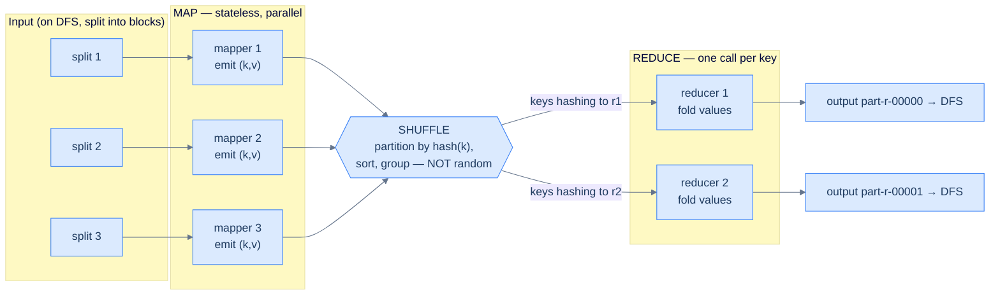

# 29. Batch processing

## TL;DR
> Online systems answer one request as fast as they can; **batch** systems take a big, **read-only, bounded** input and crunch out a whole new output, optimized for **throughput, not latency**. The output is **derived** — never an in-place mutation — so if your code was buggy you fix it and re-run, and the wrong output simply disappears (DDIA calls this *human fault tolerance*). The mental seed is a **Unix pipe**: `cat … | awk | sort | uniq -c | sort -rn | head` is a tiny batch job, and **`sort` is the secret hero** because it groups equal keys so the next stage just walks the stream. Scale that to a cluster and you get **MapReduce**: *map* extracts `(key, value)` from each record, the framework **shuffles** (a *distributed sort*, not randomness) so all values for a key land on one reducer, and *reduce* folds them. The shuffle also gives you joins for free — bring both sides to the same reducer keyed on the join column (**sort-merge join**), or if one side is small, ship it to every node (**broadcast hash join**). MapReduce writes every intermediate stage to a distributed filesystem (HDFS/S3); **dataflow engines** (Spark, Flink, Tez) model the whole job as one DAG, keep intermediates in memory, **pipeline** instead of **materialize**, and run far faster. The killers are all about the shuffle: **skew/hot keys**, **stragglers**, the **small-files problem**, and the sheer cost of moving petabytes across the network. Batch output feeds the rest of the stack — **search indexes** (cf. [27 Search systems](/cortex/system-design/storage-and-search/search-systems)), **batch-built KV stores** bulk-loaded as immutable [LSM SSTables](/cortex/system-design/storage-and-search/lsm-trees-vs-btrees), and **ML models**. Its mirror image — the same ideas on an *unbounded* input — is [stream processing](/cortex/system-design/storage-and-search/stream-processing).

## 1. Motivation

For its first decade, **Google's** entire business rested on a batch job. The web crawl was a few billion pages sitting in a distributed filesystem (GFS); the **search index** that answered every query was *derived* from that crawl by a pipeline of huge offline computations — parse every page, extract every word, invert the structure into "word → list of pages," compute **PageRank** by iterating over the link graph until it converged. None of this happened when you typed a query. It happened *beforehand*, in bulk, on thousands of commodity machines, and the result — the index — was shipped out to the servers that did answer queries in milliseconds.

The trouble was that writing each of these pipelines by hand was agony. Every engineer who wanted to process the crawl had to re-solve the same distributed-systems problems from scratch: how to split the input across machines, how to recover when (not if) a machine died mid-job, how to move intermediate results around. In **2004**, Jeffrey Dean and Sanjay Ghemawat published **MapReduce**, whose whole pitch was: *you write two little functions, `map` and `reduce`, and we handle the parallelism, the data movement, and the fault tolerance.* It was not a clever algorithm — DeWitt and Stonebraker famously called it "a major step backwards" because parallel databases had done joins and aggregations for decades — but it was a clever *packaging*, and it let ordinary engineers process petabytes. It seeded an entire ecosystem (Hadoop, Hive, Pig) and the whole "big data" movement.

Here's the twist that makes the story worth telling: **MapReduce is now dead at Google.** They retired the last internal copy in 2019. It was *too slow* — every stage of a multi-step pipeline had to write its full output to disk and wait before the next stage could read it. Its successors — **Spark, Flink, Tez** — kept the good ideas (map, reduce, shuffle, immutable inputs, re-runnability) and threw out the costly part (forced disk hand-offs between every stage). That arc — *from "we made it possible" to "we made it fast"* — is exactly the shape of this lesson. By the end you'll know what a batch job is, why the **shuffle** is the operation everything hinges on, how distributed joins fall out of it, and why dataflow engines beat plain MapReduce.

## 2. Intuition (Analogy)

Picture a giant warehouse that has just received **ten thousand unsorted boxes** of customer order slips, and your job is to answer: *for every product, how many were ordered?* You have a hundred temp workers and one rule — no single person can hold all ten thousand boxes.

The naive plan is to give one clerk a running tally and feed them every slip. That's the **single-machine, in-memory** approach: a hash map of `product → count`. It's perfect right up until the tally won't fit in one head (one machine's RAM) — and with millions of distinct products, it won't.

So you run it like a **sorting hall** instead, in three moves:

1. **Map.** Hand each of the hundred workers a stack of boxes. Each worker rips through their slips and, for every slip, shouts out a sticky note: *"PRODUCT-X: 1."* They keep **no running totals** — they're dumb and fast and entirely independent, which is the whole point: if one worker faints, you just hand their boxes to someone else and lose nothing.

2. **Shuffle.** Now the magic. You set up **alphabetized pigeonholes** along the wall — A–C here, D–F there — and every sticky note gets filed into the pigeonhole for its product. Crucially, *all notes for "PRODUCT-X" end up in the same pigeonhole no matter which worker wrote them.* This regrouping-by-key is the **shuffle**, and notice it is **not random** (the unfortunate name): it's a giant **distributed sort** that brings like to like.

3. **Reduce.** Assign one worker per pigeonhole. Because every "PRODUCT-X" note is now sitting together, that worker just walks the pile counting — *"X: 1, 1, 1… that's 412"* — and writes one final line. They never need to remember more than the current product. Different pigeonholes are handled by different workers, fully in parallel.

That's MapReduce, and three details map straight onto the real failure modes. If one product is a **mega-seller** — half the slips say "PRODUCT-X" — that one pigeonhole overflows and its poor worker grinds for hours while everyone else is done. That's a **hot key / skew**. If one worker is just slow (bad back, jammed stapler), the *whole job* waits on them to finish — a **straggler**. And if instead of ten thousand fat boxes you'd received ten *million* envelopes with one slip each, you'd spend all day opening envelopes — the **small-files problem**. Hold those three; §6 is about exactly them. Now the precise version.

## 3. Formal definitions

A **batch processing job** takes a **bounded, immutable** input (it has an end, and the job does not change it), processes it, and writes a **brand-new derived output** every run. Contrast it with the **online** systems most of this book covers (a request comes in, you answer it fast) and with **stream** processing ([Lesson 30](/cortex/system-design/storage-and-search/stream-processing)), where the input is *unbounded* and the job never finishes. The headline metric flips: online systems chase **latency** (response time, tail percentiles); batch systems chase **throughput** (records or terabytes per unit time, often via jobs that run for minutes to days).

The immutability is not an accident — it's the source of batch processing's superpowers:

| Property of batch jobs | Why it matters |
|---|---|
| Input is **read-only** | Many independent jobs can read the same files; nothing corrupts the source |
| Output **regenerated from scratch** | Buggy code? Fix it, re-run, the bad output vanishes — *human fault tolerance*. (A read/write DB has no undo for code that wrote bad rows.) |
| **No side effects** during the job | A failed task can be retried on another machine with the *same* input and no harm |
| **All-or-nothing** output | If the job succeeds, the result is exactly-once even if tasks were retried; if it fails, no partial output is published |

Underneath, a distributed batch framework is basically a **distributed operating system** — it has the same three parts as the single machine running your Unix pipe:

| Single machine (Unix) | Distributed framework | Job |
|---|---|---|
| Filesystem (ext4/XFS) | **Distributed filesystem / object store** (HDFS, S3) | Store the huge input/output, split into blocks across many nodes |
| OS scheduler (CPU time) | **Job orchestrator** (YARN, Kubernetes) | Decide which task runs on which node; restart failed tasks |
| Pipes between processes | **Shuffle** (network data exchange) | Move intermediate `(key, value)` data so the right records meet |

The **distributed filesystem** (DFS) is worth a beat. Files are chopped into **blocks** (HDFS defaults to **128 MB** — vastly larger than ext4's 4 KB, so there's less metadata to track over a petabyte) and each block is **replicated** across several machines (or protected by erasure codes like Reed–Solomon for less storage overhead). Replication buys two things: it survives disk death, and it lets the scheduler practice **data locality** — run a task on a machine that already holds a copy of its input block, so the data needn't cross the network at all. Modern jobs increasingly read from **object stores** (S3, GCS) instead, which trade locality (storage and compute are separate) for elastic, independent scaling — usually a fine trade on fast datacenter networks.

### MapReduce, precisely

A MapReduce job is **four steps**, of which you write only two:

| Step | Who writes it | What happens |
|---|---|---|
| 1. **Input split → records** | framework | Read input files, break into records (e.g. one log line per record) |
| 2. **Map** | **you** | For each record, emit zero or more `(key, value)` pairs. *Stateless* — each record handled independently, so mappers run massively in parallel |
| 3. **Shuffle** (sort + group) | framework | A **distributed sort**: route every pair to a reducer by `hash(key) % R`, sorting along the way, so all values for a key are adjacent on one reducer |
| 4. **Reduce** | **you** | Called once per key with an *iterator* over all its values; emit output records |

Step 3 is the one nobody writes and everybody pays for. Each mapper writes one local file **per reducer**, hashing each key to pick the file (the same idea as [hash sharding](/cortex/system-design/building-blocks/sharding-and-partitioning)) and sorting within it. Each reducer then **pulls** its file from every mapper and **merge-sorts** the sorted streams together (cheap, sequential — the *exact* mergesort-on-disk trick behind [LSM-tree compaction](/cortex/system-design/storage-and-search/lsm-trees-vs-btrees)). Now equal keys are consecutive even though they came from different mappers, and the reducer can fold them holding only one key's state at a time. The number of map tasks follows the input splits; the number of reduce tasks `R` you choose.



<p align="center"><strong>The MapReduce dataflow. Mappers are independent and retryable; the shuffle is a distributed sort that guarantees all values for a key reach the same reducer; reducers fold each key's values into output. Every box that dies is simply re-run — that's the fault-tolerance story.</strong></p>

### Distributed joins fall out of the shuffle

You rarely have just one dataset. Suppose you have a **log of activity events** (who viewed what URL) and a **table of user profiles** (user → date of birth), both too big for one machine, and you want "view events enriched with the viewer's age." That's a **join**. There are three classic strategies, and which one wins depends on the sizes:

| Join strategy | How it works | Use when | Cost |
|---|---|---|---|
| **Sort-merge (reduce-side)** | Both sides emit records keyed by the join column (user ID). The shuffle brings each user's profile *and* all their events to the same reducer; a *secondary sort* makes the profile arrive first. Reducer joins by walking the merged stream. | Both sides are large | Full shuffle of **both** datasets (expensive, but general) |
| **Broadcast hash (map-side)** | One side is small enough to fit in memory. Load *all* of it into a hash table and **copy that table to every mapper**; each mapper streams the big side and looks up matches locally. | One side small (a dimension table) | **No shuffle** — only the big side is read; the small side is broadcast |
| **Partitioned hash (map-side)** | Both inputs are *already* sharded the same way (same key, same number of partitions). Mapper `i` only needs partition `i` of each side — join locally, partition by partition. | Both sides co-partitioned on the join key | **No shuffle** — the expensive sort was paid earlier |

The lesson is general: **a join is just "make the matching records meet on one machine."** The shuffle is the brute-force way to make them meet; broadcasting a small table, or pre-arranging the data so matches are already co-located, are the optimizations that *avoid* the shuffle. (Real query engines — Hive, Spark SQL, Trino — have **cost-based optimizers** that estimate input sizes and *pick* the strategy, and even reorder joins to shrink intermediate state, so you usually write `JOIN` and let them choose.)

### Dataflow engines vs MapReduce

MapReduce's fatal flaw: it **materializes** every intermediate dataset to the DFS. A five-stage pipeline writes its output to HDFS, replicated three ways, then the next stage reads it all back — five times. And operators must alternate strictly map→reduce, forcing an expensive sort between *every* pair even when you don't need sorting.

**Dataflow engines** (Spark, Flink, Tez) fix this by modeling the **entire job as one DAG** of operators (map, filter, join, group-by, …) rather than a chain of independent map/reduce subjobs. That unlocks:

- **Pipelining over materialization.** An operator can start as soon as its input is ready and **stream** results to the next operator (in memory, or spilling to local disk only if needed) — no forced, replicated DFS write between stages.
- **Sort only where needed.** Sorting happens only for operators that actually require it, not by default between every stage.
- **Operator fusion.** Several stages that don't change the partitioning (map, filter) collapse into one task, cutting data copies.
- **Locality & reuse.** The scheduler sees the whole graph, so it can co-locate producer and consumer and reuse worker processes (no fresh JVM per task).

The cost is fault tolerance. MapReduce's DFS-materialized intermediates *are* its recovery checkpoints — re-run one failed task and read its inputs back from disk. Dataflow engines keep intermediates in volatile memory, so they need another recovery story: **Spark** records the **lineage** of each dataset (the deterministic recipe — the RDD transformations — used to compute it) and *recomputes* lost partitions from their ancestors; **Flink** periodically **checkpoints** operator state. Recompute needs determinism — a `map` that calls `rand()` or reads the clock will recompute to a *different* value and silently corrupt your output, which is why these engines lean on the same side-effect-free discipline as the rest of batch processing.

## 4. Worked example — word count, then a join

**Part A: the canonical word count.** Count how often each word appears across a pile of documents. The mapper turns text into `(word, 1)` pairs; the shuffle gathers all the `1`s for each word; the reducer sums them.

```python
# --- map: called once per input record (here, one line of text) ---
def map(line):
    for word in line.split():
        emit(word.lower(), 1)          # one (key, value) per occurrence; stateless

# --- the framework now SHUFFLES: groups all values by key ---
#   "the"  -> [1, 1, 1, 1, 1, 1, ...]   (gathered from EVERY mapper)
#   "cat"  -> [1, 1]
#   "graph"-> [1, 1, 1]

# --- reduce: called once per key, with an iterator over its values ---
def reduce(word, counts):
    emit(word, sum(counts))            # fold; only one key's state in memory
```

Trace it on two lines, *"the cat sat"* and *"the cat ran"*, split across two mappers. Mapper 1 emits `(the,1) (cat,1) (sat,1)`; mapper 2 emits `(the,1) (cat,1) (ran,1)`. The shuffle regroups by key — **across both mappers** — into `the→[1,1]`, `cat→[1,1]`, `sat→[1]`, `ran→[1]`. Four reducer calls produce `(the,2) (cat,2) (sat,1) (ran,1)`. Notice the mappers never coordinated and never counted — *all* the gathering is the shuffle's job. That single fact is why this scales to a trillion documents: the only thing that grows is how much data crosses the wall in step 2.

This is the literal big-brother of the Unix pipeline `cat *.txt | tr ' ' '\n' | sort | uniq -c`: `tr` is the mapper (split into words), `sort` is the shuffle (bring equal words together), and `uniq -c` is the reducer (count adjacent equals). MapReduce *is* that pipe, sharded across ten thousand machines.

**Part B: a sort-merge join, step by step.** Now enrich activity events with the viewer's age. Two mappers, two inputs, **one** shared key — the user ID:

1. **Map the profiles.** For each user row, emit `(user_id, ("profile", date_of_birth))`.
2. **Map the events.** For each view event, emit `(user_id, ("event", url, timestamp))`.
3. **Shuffle.** Both kinds of record for `user_id = 42` land on the *same* reducer. Arrange the secondary sort so the `"profile"` record sorts **before** the `"event"` records.
4. **Reduce** (per user): the first value is the profile → stash `date_of_birth` in a local variable. Then iterate the events, and for each emit `(url, age_at_view)`. One user's worth of state in memory at a time; **zero network calls** to any database.

Why not just have the event mapper call the user database directly, one lookup per event? Because a batch job processes millions of records per second per task, and hammering a production DB with millions of random point queries would (a) be orders of magnitude slower than streaming from disk, and (b) likely take the production database down. The join brings the data *to* the computation instead of reaching *out* to a live service — a recurring batch principle.

## 5. Trade-offs

The decision is rarely "MapReduce vs Spark vs a database" in the abstract — it's *which tool fits this dataset and access pattern*. Here's the scorecard:

| Dimension | **MapReduce** (Hadoop) | **Dataflow engine** (Spark/Flink) | **MPP database / warehouse** (BigQuery, Snowflake) |
|---|---|---|---|
| **Programming model** | Two low-level functions; joins by hand | Rich operators (join, group-by) + SQL + DataFrames | SQL (declarative) |
| **Intermediate data** | **Materialized** to DFS every stage (slow, but durable) | **Pipelined** in memory; spill to local disk | In-memory / engine-managed shuffle |
| **Speed** | Slowest (forced disk hand-offs) | Much faster (often 10×+) | Fast on relational queries; vectorized columnar |
| **Flexibility** | Arbitrary code, any data format | Arbitrary code + SQL; images/text/graph ML | Mostly relational; awkward for non-tabular / iterative ML |
| **Fault tolerance** | Built-in via materialization (very robust) | Lineage recompute (Spark) / checkpoint (Flink) | Engine-internal |
| **Best at** | Legacy / extreme-scale resilient jobs | General ETL, ML prep, iterative graph algos | Interactive analytics over structured data |
| **Cost** | Cheap compute, heavy I/O | Efficient; good for big custom jobs | Convenient but often pricier per job |

The practical rules of thumb:

- **Is it expressible in SQL over tabular data, and do humans want to query it interactively?** Reach for a **warehouse / MPP engine**. The whole industry has converged on SQL as the lingua franca, and warehouses now borrow the same shuffle and columnar tricks as batch frameworks.
- **Is it custom logic, non-tabular data (images, text, embeddings), or iterative (PageRank, graph traversal, ML training loops)?** Reach for a **dataflow engine** — Spark/Flink, or purpose-built ML schedulers like Ray, Kubeflow, Flyte.
- **Do you specifically need bulletproof fault tolerance at extreme scale and don't mind slowness, or are you maintaining legacy Hadoop?** That's the shrinking niche where raw **MapReduce** still appears. For green-field work it's essentially never the answer — its successors do the same job faster.

The deeper axis underneath the whole table is **materialization vs pipelining**: do you write each intermediate result down (durable, re-readable, recovery-friendly, but slow and I/O-heavy) or stream it straight into the next operator (fast, light, but you need lineage or checkpoints to recover)? MapReduce sits at the pure-materialization corner; dataflow engines slide toward pipelining. Same data, different bet about where to spend I/O — exactly the kind of trade-off triangle you met with [storage engines](/cortex/system-design/storage-and-search/lsm-trees-vs-btrees).

## 6. Edge cases and failure modes

1. **Skew / hot keys.** The shuffle assumes keys spread roughly evenly across reducers. When one key is enormous — a celebrity user, a `NULL` join key, the word "the" — *all* its records pile onto one reducer, which then runs for hours while the rest of the cluster idles. This is the single most common reason a batch job "hangs at 99%." Fixes: detect hot keys and **salt** them (append a random suffix `key#0…key#n` to split the work across `n` reducers, then combine), use a **broadcast join** to avoid shuffling the skewed side at all, or let the engine's **skew-join** optimization split the heavy partition. Hashing keys does *not* fix skew — a hash spreads *distinct* keys evenly, but every copy of one hot key still hashes to the same place.

2. **Stragglers.** A job finishes only when its *slowest* task finishes, so one sick machine (failing disk, noisy neighbor, thermal throttle) can hold up thousands of healthy ones. The classic mitigation is **speculative execution**: when a task runs far slower than its peers, the scheduler launches a duplicate copy elsewhere and takes whichever finishes first. (Speculative execution is *safe only because* tasks are side-effect-free and deterministic — run a task twice and you must get the same answer; if a task wrote to an external service, the duplicate would double-write.)

3. **The small-files problem.** Frameworks love a few big files (one map task per ~128 MB block). Feed them **millions of tiny files** instead and you drown: the DFS metadata service (HDFS NameNode) chokes tracking them all, and you spawn millions of near-empty map tasks whose *startup* cost dwarfs their work. Fixes: **compact** small files into large ones (combine inputs, use columnar formats like Parquet that pack many records per file), or use combined input formats that bundle many small files into one task.

4. **Shuffle is the bottleneck.** The shuffle moves data **all-to-all** across the network — every mapper potentially feeds every reducer. For petabyte inputs this is often the dominant cost of the whole job (network bandwidth, plus disk to spill the sorted runs). This is *why* dataflow engines work so hard to avoid it: prune columns and rows early, push filters down, fuse map/filter operators so no shuffle is needed, and prefer broadcast/partitioned joins over sort-merge when sizes allow. A surprising amount of batch tuning is just "shuffle less."

5. **Writing output to a live database, one row at a time.** Tempting and wrong. A batch task writing millions of rows directly into a production DB will (a) be cripplingly slow (a network round-trip per record), (b) overwhelm the DB and hurt live traffic, and (c) break the all-or-nothing guarantee — a retried task double-writes, and a half-failed job leaves the DB half-updated and visible. **Better:** have the job **build the dataset as immutable files** and then bulk-load or atomically swap (e.g. build [LSM SSTables](/cortex/system-design/storage-and-search/lsm-trees-vs-btrees) offline and import them into RocksDB/Pinot/TiDB), or push the output through **[Kafka](/cortex/system-design/storage-and-search/stream-processing)** so downstream systems ingest at their own pace behind a buffer.

6. **One byte changes → reprocess everything.** Batch inputs are immutable *and* whole: change a single source record and the only honest way to update the output is to re-run the job over the entire input. For slowly-changing huge datasets that's a lot of wasted recompute on a fixed schedule — and it's precisely the limitation that motivates **[stream processing](/cortex/system-design/storage-and-search/stream-processing)**, which processes each change incrementally as it arrives.

## 7. Practice

> **Exercise 1 — What does the shuffle actually guarantee?**
> A junior engineer says: "The shuffle randomly redistributes records across reducers to balance load." Two things are wrong with that sentence. What are they, and what does the shuffle *really* guarantee?
>
> <details>
> <summary>Solution</summary>
>
> **Wrong #1: "randomly."** The shuffle is a **distributed sort**, the opposite of random — the misleading name is acknowledged in the literature. It deterministically routes each `(key, value)` pair by `hash(key)`, so identical keys always end up together. **Wrong #2: "to balance load."** It does *not* balance load; it groups by key. If keys are skewed, the shuffle actively *creates* imbalance (one fat reducer) — which is the hot-key problem of §6. **What it really guarantees:** *all values for a given key are delivered, grouped and sorted, to exactly one reducer*, so the reducer can fold them holding only that key's state. That single guarantee is what makes group-by, aggregation, and sort-merge joins possible at scale.
>
> </details>

> **Exercise 2 — Pick the join strategy.**
> For each, choose **sort-merge**, **broadcast hash**, or **partitioned hash**, and justify it: (a) joining a 50 TB clickstream against a 200 MB country-code lookup table; (b) joining a 40 TB `orders` dataset against a 35 TB `shipments` dataset, neither pre-sharded; (c) joining `orders` and `shipments` when both are *already* stored sharded into 1,000 partitions by `order_id`.
>
> <details>
> <summary>Solution</summary>
>
> **(a) Broadcast hash.** The lookup table is tiny (200 MB fits in RAM), so load it into a hash table, copy it to every mapper, and stream the 50 TB clickstream past it doing local lookups — **no shuffle of the 50 TB**. Sort-merge here would needlessly shuffle 50 TB. **(b) Sort-merge (reduce-side).** Both sides are huge and *not* co-partitioned, so neither can be broadcast and there's no pre-existing alignment to exploit. Shuffle both, keyed on the join column, and merge per key on the reducers — the general (if expensive) workhorse. **(c) Partitioned hash (map-side).** They're already sharded the same way (same key, same 1,000 partitions), so partition *i* of `orders` only matches partition *i* of `shipments` — join partition-by-partition locally with **no shuffle at all**. The expensive sort was effectively paid when the data was laid out. The meta-lesson: *the cheapest join is the one whose shuffle you avoid.*
>
> </details>

> **Exercise 3 — Why is MapReduce slower than Spark, and what's the catch in fixing it?**
> Explain in terms of **materialization vs pipelining** why a 5-stage MapReduce pipeline is slower than the same pipeline on Spark. Then name the new problem Spark takes on by being faster, and how it solves it.
>
> <details>
> <summary>Solution</summary>
>
> **Why slower:** MapReduce **materializes** every stage's full output to the distributed filesystem — replicated (e.g. 3×) and written to disk — and the next stage can't start until the previous one has completely finished and been written. Over five stages that's five rounds of bulk, replicated DFS writes *and* reads, plus a forced sort between every map and reduce even when unneeded. Spark **pipelines**: it models the whole job as one DAG, streams intermediate results between operators in memory (spilling to *local* disk only when necessary, never replicated to the DFS), starts downstream operators as soon as input is ready, fuses map/filter stages, and sorts only where required. That removes the dominant I/O cost. **The catch:** MapReduce's disk-materialized intermediates *doubled as* recovery checkpoints — to recover, just re-read them. Spark's intermediates live in volatile memory, so a lost partition has nothing to re-read. Spark solves this with **lineage**: it records the deterministic recipe (the chain of RDD transformations) that produced each dataset and **recomputes** lost partitions from their ancestors. The price of that trick is a hard requirement that operators be **deterministic and side-effect-free** — otherwise a recompute yields a different answer. (Flink takes the alternative route: periodic **checkpoints** of operator state.)
>
> </details>

## Your Turn

Before you move on, check your understanding with the coach — explain the idea, apply it, weigh the trade-offs, then defend your reasoning.

<div class="concept-coach"></div>

## 8. In the Wild

- **[Martin Kleppmann — *Designing Data-Intensive Applications*, Ch. 11 "Batch Processing"](https://dataintensive.net/)** — the source this lesson paraphrases. The definitive treatment of the Unix philosophy, MapReduce, the shuffle, distributed joins (sort-merge, broadcast hash, partitioned hash), and the materialization-vs-pipelining axis. Read it next.
- **[Dean & Ghemawat — "MapReduce: Simplified Data Processing on Large Clusters"](https://research.google/pubs/pub62/)** (OSDI 2004) — the paper that started it all. Short, readable, and the source of the "you write `map` and `reduce`, we handle the rest" idea — plus speculative execution for stragglers and re-execution for fault tolerance.
- **[Zaharia et al. — "Resilient Distributed Datasets"](https://www.usenix.org/system/files/conference/nsdi12/nsdi12-final138.pdf)** (NSDI 2012) — the Spark RDD paper. This is where **lineage-based recovery** and in-memory pipelining are introduced — exactly the leap from MapReduce's materialize-everything model to dataflow engines.
- **[Jeffrey Dean & Luiz Barroso — "The Tail at Scale"](https://research.google/pubs/pub40801/)** (CACM 2013) — why **stragglers** are inevitable at scale and the systematic techniques (including speculative/hedged requests) to tame them. The single best companion read for §6's straggler discussion.
- **[Apache Spark — "RDD Programming Guide"](https://spark.apache.org/docs/latest/rdd-programming-guide.html)** — the production reality behind the theory: transformations vs actions, narrow vs wide (shuffle) dependencies, and broadcast variables. Maps the vocabulary of this lesson onto code you can run.

---

> **Next:** [30. Stream processing](/cortex/system-design/storage-and-search/stream-processing) — batch processing assumes the input is **bounded**: it has an end, so the job can finish and produce a clean, all-or-nothing output. But most data is born as an **endless stream** — clicks, payments, sensor readings, never stopping. What if you stopped waiting for the day's data to "complete" and instead processed every event seconds after it happened? That single change — *unbounded* input, a job that never ends — reshapes everything: windows instead of whole datasets, event-time vs processing-time, and the same joins and aggregations rebuilt to run forever. We're about to meet [63 Cortex's data-intensive backbone](/cortex/system-design/capstones/cortex-data-intensive)'s other half.
