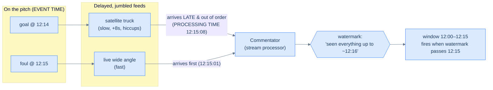
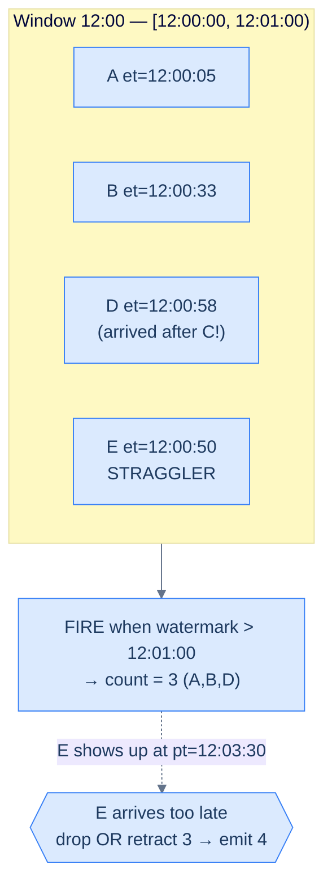

# 30. Stream processing

## TL;DR
> A batch job (Lesson 29) runs over a **bounded** input — a file that has stopped growing — and finishes. A **stream processor** runs forever over an **unbounded** input, producing answers continuously, seconds after events arrive. The one idea that makes streaming hard is that every event has **two timestamps**: the **event time** (when it actually happened, stamped at the source) and the **processing time** (when your processor saw it). Network delays, queueing, restarts, and offline mobile devices smear these apart, so events arrive **late** and **out of order**. To aggregate "events per minute" you must group by *event* time, which means deciding *when a minute is finished* even though a straggler might still show up — that decision is a **watermark**: a moving "I believe I've now seen everything up to time *t*" marker. You aggregate over **windows** (tumbling, hopping, sliding, session), fire each window when the watermark passes its end, and handle stragglers by *dropping* them or *retracting and re-emitting*. Joining streams adds a time dimension — **stream–stream** (buffer both sides in a window), **stream–table** (enrich from a CDC-fed local copy), **table–table** (maintain a materialized view) — and all three are **time-dependent**: join with the state *as of the event*, not as of now. Because a stream never ends you can't "rerun the failed task and discard its output" like batch does; **exactly-once** (really *effectively*-once) comes from **microbatching/checkpoints** plus **idempotent writes** or an **atomic commit** of state-change + output + offset. When you need a clean slate, you **reprocess** the retained log from the beginning. Tools: Kafka Streams, Apache Flink, Spark Streaming; the canonical theory is Google's Dataflow/MillWheel.

## 1. Motivation

A stolen credit card is most valuable to a thief in the **first few minutes**. The window between "card details leaked" and "cardholder notices" is when fraud rings drain it — small test charges, then a burst of big ones across timezones. So the entire economics of card fraud comes down to a latency race: can the issuer's models flag the anomalous pattern and decline the next swipe *before* the next swipe happens?

Now imagine you tried to fight that fraud with a **batch job** ([Lesson 29](/cortex/system-design/storage-and-search/batch-processing)'s hammer). Every night at 02:00 you run a giant job over the day's transactions, score each one, and flag the suspicious cards. It's a beautiful, fault-tolerant, reproducible pipeline — and it is **completely useless** for this problem, because by 02:00 the card has been empty for nine hours. The pain here isn't correctness; it's **freshness**. Batch answers questions about data that has *stopped arriving*. Fraud is a question about data that is *still arriving, right now, forever*.

That is the niche of **stream processing**: take an **unbounded** input — transactions, clicks, sensor readings, log lines, page views — and produce answers **continuously**, seconds after each event lands, with no "end of input" to wait for. Fraud detection is the classic example (DDIA opens Chapter 12 with exactly this list: fraud, algorithmic trading, factory-machine monitoring, intrusion detection), but the shape is everywhere: a rideshare app pricing surge from live demand, a CDN deciding in real time that a region is under attack, a "trending now" sidebar, a billing meter that must close the hour accurately.

It sounds like "batch, but smaller and faster," and people who think that get burned. The moment you try to compute something as innocent as **"transactions per minute,"** a problem appears that batch never had to face squarely: a transaction that *happened* at 12:00:59 might not *reach you* until 12:01:03, after you've already closed and reported the 12:00 minute. Was that minute's count wrong? Do you fix it? How long do you wait before declaring a minute "done" when an event could always still be in flight? This lesson is, fundamentally, about that one question — **time you can't trust** — and the machinery (event time, windows, watermarks, time-dependent joins, exactly-once) built to survive it. The plumbing of *delivering* the events — brokers, partitions, consumer groups, offsets — is the job of [Lesson 17 (Message queues and streams)](/cortex/system-design/distributed-patterns/message-queues-and-streams); here we assume the events are arriving and ask what it takes to *compute over them correctly*.

## 2. Intuition (Analogy)

Picture a **live sports commentator** calling a football match for radio. The match is the unbounded stream; the commentator is your stream processor; "goals in the last 15 minutes" is a windowed aggregation.

Here's the catch that makes streaming hard, dramatized. The commentator doesn't see the pitch directly — they watch a **bank of TV feeds**, and the feeds have **different delays**. The wide-angle camera is live, but the slow-motion replay feed runs eight seconds behind, and one feed comes from a satellite truck that hiccups under load. So events reach the commentator **out of order**: they might call the *replay* of a tackle right as the *live* feed shows the resulting free kick. The moment a thing *happened on the pitch* (**event time**) is not the moment the commentator *saw it on a screen* (**processing time**). A good commentator narrates by event time — "and that foul, moments ago, leads to *this* free kick" — reconstructing the true order from delayed, jumbled feeds. A bad one just reads the screens in the order pixels arrive and produces nonsense.

Now: "goals in the last 15 minutes." When the clock hits the 30th minute, can the commentator *finalize* the count for minutes 0–15? Almost — but the satellite truck might *still* be about to deliver a goal from minute 14 that got stuck in the buffer. So the commentator waits a beat past each boundary — *"I'm now confident I've seen everything up to about minute 16"* — before announcing the tally. That confidence line, sweeping forward and lagging slightly behind real action, is a **watermark**. Set it too **tight** (announce instantly at the boundary) and you'll miss the buffered goal and have to issue an embarrassing correction. Set it too **loose** (wait five extra minutes to be safe) and your "live" commentary is hopelessly behind. And the rare goal that arrives *after* you've already announced the tally is a **straggler** — you either quietly ignore it or interrupt with *"correction: that's actually 3 goals in that span, not 2."*

That's the whole lesson in one booth: two clocks (event vs processing time), a confidence line that decides when a window is done (watermark), and late arrivals you must drop or correct (stragglers). Here it is as a picture:

<strong>Two clocks, one confidence line. Events are stamped with when they happened (event time) but arrive late and out of order (processing time). The watermark is the processor's moving belief about how far event time has progressed; a window fires when the watermark passes its end.</strong>

## 3. Formal definitions

**Event vs processing time.** Every record carries (or should carry) an **event-time** timestamp: the instant the thing happened, ideally stamped at the source. The **processing time** is the wall-clock instant your operator handled it. They diverge because of queueing, broker contention, network faults, a **consumer restart** that replays a backlog, or **reprocessing** old data after a bug fix. The classic trap: measure "requests per second" by *processing* time, redeploy your job so it pauses for 60 s, and when it resumes and drains the backlog you'll see a giant fake **spike** — the requests were steady; only your *observation* of them bunched up. Correct stream analytics groups by **event** time. (DDIA's analogy is the *Star Wars* release order: episode number is event time, the year you watched it is processing time — they're famously out of order, and your brain re-sorts them.)

A subtle wrinkle: **whose clock?** A mobile app used offline buffers events for hours, then uploads them — to the server they look like extreme stragglers, and the device's own clock may be wrong (or deliberately faked). The DDIA remedy is to log **three** timestamps — event time per device clock, send time per device clock, receive time per server clock — and use `(receive − send)` to estimate and correct the device's clock skew.

**Windows** chop an infinite stream into finite buckets you can aggregate over:

| Window type | Length | Overlap | An event belongs to | Typical use |
|---|---|---|---|---|
| **Tumbling** | fixed | none | exactly **one** window | "count per 1-minute bucket"; rounding the timestamp down to the minute *is* the window |
| **Hopping** | fixed | yes (hop < length) | **several** windows | smoothed rolling metric, e.g. a 5-min window every 1 min |
| **Sliding** | fixed | continuous | any events within *length* of **each other** | "5-min sliding": 10:03:39 and 10:08:12 share a window (≤5 min apart) though fixed buckets wouldn't group them |
| **Session** | **variable** | n/a | one user's burst of activity | sessionization: events for a user, window ends after an inactivity gap (e.g. 30 min idle) |

Tumbling and hopping use **fixed wall boundaries**; sliding is defined by *relative* distance between events; session windows have **no fixed length** at all — they grow with activity and close on a gap.

**Watermarks** answer "when is a window done?" A watermark is a monotonically advancing claim: *"I believe I have now observed all events with event time ≤ t."* When the watermark passes a window's end, you **fire** (emit) that window's result. One concrete way to produce it (DDIA): a producer injects a special marker meaning *"no more messages earlier than t will follow,"* and consumers trigger windows on it — but with **many** producers, each has its own minimum timestamp, so the consumer must track the watermark **per producer** and take the *minimum*, which makes adding/removing producers fiddly. A watermark is fundamentally a **heuristic about lateness**, not a guarantee.

**Stragglers / late events** are records that arrive *after* the watermark has already closed their window. Two options (DDIA): **(1) ignore** them — fine if they're a tiny fraction; track a dropped-events counter and alert if it climbs — or **(2) publish a correction**: re-open the window, recompute, and emit an updated value, possibly **retracting** the earlier output downstream.

**Stream joins** come in three flavors, distinguished by what's on each side:

| Join | Left × Right | State maintained | Window |
|---|---|---|---|
| **Stream–stream** (window join) | two event streams | recent events of *both* streams, indexed by join key | finite, e.g. "within 1 hour" |
| **Stream–table** (enrichment) | event stream × a table | a **local copy of the table**, kept fresh via [CDC](/cortex/system-design/distributed-patterns/outbox-pattern-and-cdc) | table side: conceptually **infinite** (newest version wins); stream side: often none |
| **Table–table** (materialized view) | two changelog streams | **both** tables' current state | both infinite |

All three share a shape: build state from one input, query it when records arrive on the other. And all three are **time-dependent**: if the joined state changes over time (a user edits their profile; a tax rate changes), you must decide *which version* to join with. The right answer is usually "the version **as of the event's time**," not "the current version" — otherwise reprocessing yesterday's sales would apply *today's* tax rate. If event ordering across streams is undetermined, the join is **non-deterministic** (rerunning gives different results). Data warehouses call this the **slowly changing dimension** problem and fix it by giving each version a unique ID that the fact record pins to (at the cost of never being able to log-compact that table).

**Fault tolerance & exactly-once.** Batch gets fault tolerance for free: a failed task is retried on another machine and its partial output discarded, because input is immutable and output is only made visible on success — so the result is *as if every record were processed exactly once*. Streams can't "wait until finished," because they never finish. The streaming toolkit:

| Mechanism | Idea | Limitation |
|---|---|---|
| **Microbatching** | slice the stream into ~1 s blocks, run each as a tiny batch job (Spark Streaming) | implicitly a tumbling window by *processing* time; smaller = more overhead, larger = more latency |
| **Checkpointing** | periodically snapshot operator state to durable storage; on crash, restart from the last snapshot and discard output since then (Flink, triggered by **barriers** in the stream) | only covers state *inside* the framework |
| **Idempotent writes** | make the external write safe to repeat — e.g. tag each write with the source **offset** so a replay is a no-op | requires deterministic replay, same order, no concurrent writer (may need fencing) |
| **Atomic commit** | commit state change + downstream messages + consumer-offset advance **together**, all-or-nothing (Kafka transactions, Google Dataflow, VoltDB) | internal-only (not heterogeneous XA); amortized by batching several events per transaction |

The honest name is **effectively-once**: records *are* reprocessed on failure, but the visible effect is as if each were processed once. The catch is **side effects that escape the framework** — once you've sent the email, charged the card, or written to an external system, a checkpoint can't un-send it. That's why idempotence or atomic commit (which bundle the *output* and the *offset* into one all-or-nothing step) are required, not optional, for true exactly-once.

**State recovery & reprocessing.** Windowed aggregations and join tables are *state* that must survive a crash. Options: keep it remote and replicated (slow per-message), or keep it **local and replicate periodically** (Flink snapshots to a DFS; Kafka Streams ships state changes to a compacted Kafka topic). Sometimes you don't replicate at all — short-window state can be **rebuilt by replaying** the recent input, and a CDC-maintained table can be rebuilt from its compacted changelog. And because a log-based broker **retains** events, you can **reprocess** from the start at any time — to fix a bug, add a feature, or build a brand-new derived view — by spinning up a fresh consumer that reads the log from offset zero.

## 4. Worked example — a windowed count with a late event

We want **transactions per minute**, event-time, 1-minute **tumbling** windows. Watch the **12:00 window** ([12:00:00, 12:01:00)) survive a straggler.

Events arrive in *processing-time* order (left), but each carries an *event-time* stamp (right):

| # | Arrives (processing time) | Event time | Belongs to window |
|---|---|---|---|
| A | 12:00:10 | **12:00:05** | 12:00 |
| B | 12:00:40 | **12:00:33** | 12:00 |
| C | 12:01:02 | **12:01:01** | 12:01 |
| D | 12:01:05 | **12:00:58** | **12:00** ← out of order |
| E | 12:03:30 | **12:00:50** | **12:00** ← straggler |

Step through it with a watermark heuristic of **"event time = (max event time seen) − 30 s"** (we assume lateness rarely exceeds 30 s):

1. **A** arrives → 12:00 window state `count = 1`. Max event time 12:00:05, watermark ≈ 11:59:35.
2. **B** arrives → 12:00 window `count = 2`. Watermark advances to ≈ 12:00:03. Still **< 12:01:00**, so the 12:00 window stays open.
3. **C** arrives (event time 12:01:01) → opens the **12:01** window (`count = 1`). Max event time is now 12:01:01, so the **watermark jumps to ≈ 12:00:31** — *still below* 12:01:00, so we **don't fire 12:00 yet**. Good instinct: don't close a minute the instant its boundary passes in *event* time; leave slack for laggards.
4. **D** arrives at processing time 12:01:05 but its event time is **12:00:58** — it belongs to the *already-past* 12:00 window, which is **still open** because the watermark hasn't crossed 12:01:00. So D lands correctly: 12:00 window `count = 3`. *This is exactly why event-time windowing plus a lagging watermark beats naive processing-time bucketing — D would have been mis-filed into the 12:01 minute otherwise.*
5. Time passes; a later event (say at event time 12:01:40) pushes the watermark **past 12:01:00**. **The 12:00 window fires: `count = 3`.** Its state can now be dropped.
6. **E** arrives at processing time 12:03:30 with event time **12:00:50** — a true **straggler**, landing *after* the 12:00 window already fired with 3. The watermark was **too tight** for E. Now you choose:
   - **Drop it.** Report stays `3`; increment a `late_dropped` counter. Simple, slightly wrong.
   - **Correct it.** Re-open 12:00, recompute `count = 4`, emit a **retraction** of the old `3` and a new `4` so downstream consumers fix their totals.

The lesson in miniature: **D was saved by watermark slack; E fell off the end of it.** Every streaming system lives on this knife edge — how much slack (latency) you trade for how few corrections.

<strong>A, B, and the out-of-order D all land inside the 12:00 window because the watermark lagged behind real time; the window fires count = 3. The straggler E arrives after firing — beyond the watermark's slack — forcing the drop-vs-correct decision.</strong>

## 5. Trade-offs

| Dimension | Batch (Lesson 29) | Stream processing |
|---|---|---|
| **Input** | bounded (a file that stopped growing) | **unbounded** (never ends) |
| **Latency** | minutes to hours (next run) | **seconds** (continuous) |
| **Time model** | reasons about time too, but you rarely notice | event vs processing time is **front and center** |
| **Completeness** | sees the whole input before emitting | must emit on a **watermark guess**; stragglers possible |
| **Fault tolerance** | easy: retry task, discard partial output | hard: stream never "finishes" → checkpoints + idempotence/atomic commit |
| **State** | recomputed from scratch each run | **long-lived**, must be checkpointed/replicated/rebuilt |
| **Reprocessing** | natural — just rerun the job | replay the retained log from offset 0 |
| **Determinism** | high (immutable input) | joins can be **non-deterministic** if cross-stream order varies |
| **Best at** | large historical aggregates, training data, reports | fraud, monitoring, live metrics, real-time enrichment |

The headline trade-off lives entirely inside the watermark: **latency vs completeness.** A tighter watermark (fire windows sooner) gives fresher answers but more stragglers and corrections; a looser one (wait longer) gives more-complete answers but staler output. There is no setting that is both perfectly fresh and perfectly complete — you choose where on that line your application sits, exactly as the LSM/B-tree amplification triangle (Lesson 24) forces you to pick which cost to pay. Streaming and batch are not rivals, either: the durable, replayable log means you can do **both** over the same events — a fast streaming view for *now*, a batch view for *correct and complete later* — which is the whole point of stream/batch unification (Beam, Flink, Spark). And the *output* of a windowed aggregation — counts and percentiles bucketed by minute — is itself a time-stamped series, which is exactly what a [time-series database (Lesson 26)](/cortex/system-design/storage-and-search/time-series-databases) is built to store and roll up.

## 6. Edge cases and failure modes

1. **Out-of-order events (handled) vs stragglers (the real problem).** Out-of-order arrivals *within* the watermark's slack are fine — event-time windowing files them correctly (that was D in §4). A **straggler** is one that arrives *after* its window fired. You must pick a policy up front — **drop** (and meter it) or **retract-and-correct** — because the default of silently dropping makes your "complete" aggregates quietly wrong, and nobody notices until an auditor does.
2. **Watermark too tight.** Fire the instant the boundary passes and every laggard becomes a straggler: constant corrections, churning downstream consumers, or (if you also drop) systematically undercounting the *most recent* windows — the ones dashboards stare at. Symptom: counts that "creep up" a few minutes after first appearing.
3. **Watermark too loose.** Wait 10 minutes "to be safe" and your real-time fraud detector now reacts in 10 minutes — i.e. it isn't real-time. You've quietly turned streaming back into slow batch. Symptom: correct numbers, useless freshness.
4. **The multi-producer watermark trap.** With many producers each emitting their own "no events before t" markers, the consumer's watermark is the **minimum** across producers — so **one stalled or idle producer freezes the watermark**, and *no* windows fire system-wide even though every other producer is current. A dead partition can wedge the whole pipeline. (DDIA flags exactly this when producers are added/removed.)
5. **Untrusted event-time clocks.** Source-stamped event time is only as good as the source's clock. A wrong mobile-device clock (accidental or fraudulent) lands events in the wrong window — or arbitrarily far in the future, which can **advance the watermark past everything** and prematurely fire/expire real windows. Mitigation: the three-timestamp skew correction; sanity-bound event times against server receive time.
6. **Exactly-once pitfall #1 — escaped side effects.** Checkpointing/microbatching give exactly-once *only inside the framework*. The moment you send an email, charge a card, or POST to a third party, a post-crash replay does it **again**. Make external effects **idempotent** (tag with the source offset / a dedup key) or commit them **atomically** with the offset advance — never assume the framework's "exactly-once" badge covers your `sendEmail()`.
7. **Exactly-once pitfall #2 — broken idempotence assumptions.** Idempotent recovery silently requires *deterministic* replay in the *same order* with *no concurrent writer*. Violate any one — a non-deterministic function (`now()`, a random shard), reordering, or a zombie node that's presumed dead but still writing — and you get duplicates or corruption. A failover without **fencing** is the classic way a "dead" node double-applies.
8. **Time-dependent join non-determinism.** Join activity events against a profile/tax-rate table and the answer depends on whether the event was processed before or after the table change. Joining with *current* state instead of *as-of-event* state means **reprocessing history produces different (wrong) results**. Fix with versioned dimensions (a version ID pinned at event time) or by denormalizing the needed value into the event itself.
9. **State that outgrows the box.** Sliding windows and stream–stream joins must **buffer** events until the window closes; large windows or high throughput can blow up memory/disk. Long join windows ("match a click to a search up to *days* later") quietly retain enormous state. Provision for it, or bound the window.

## 7. Practice

> **Exercise 1 — Spot the processing-time bug.**
> A team measures "logins per minute" by bucketing each login by the **wall-clock time the stream processor handled it**. The dashboard is smooth for weeks. Then, during a deploy, the consumer is down for ~3 minutes and replays the backlog on restart. What does the dashboard show, why, and what's the one-line fix?
>
> 

> 
Solution

>
> The dashboard shows a **massive fake spike** right after the restart: three minutes of buffered logins all get *processed* in a few seconds, so by **processing time** they pile into one or two buckets — even though the **true login rate was flat** the whole time. It's a textbook processing-vs-event-time confusion (DDIA's redeploy-backlog example). The fix: **bucket by the login's event-time timestamp, not the handling time.** Then the replayed events file back into the minutes they actually belong to, the spike disappears, and the line stays flat — which is the truth. (Bonus: this is also why you should alert on *event-time* lag, not just throughput.)
>
> 

> **Exercise 2 — Tune the watermark.**
> You run 1-minute tumbling windows over IoT readings. Most arrive within 2 s; about 0.5% are delayed 1–5 minutes by flaky cellular links; a rare few arrive *hours* late (devices that were offline). (a) Where would you set the watermark and why? (b) What policy for the 0.5%? (c) What about the hours-late ones — should the watermark wait for them?
>
> 

> 
Solution

>
> **(a)** Set the watermark slack to cover the *common* lateness, not the worst case — e.g. fire a window a few seconds (say 5–10 s) after its boundary in event time. Sizing it for the 5-minute tail would add 5 minutes of latency to *every* window to accommodate 0.5% of data — the loose-watermark mistake (§6.3). **(b)** Don't drop the 0.5%; **emit a correction/retraction** when they land, so totals self-heal a few minutes later. This is the latency-vs-completeness trade made explicit: fast-but-provisional first, accurate-but-delayed second. **(c)** **No** — never make the watermark wait hours for offline stragglers; that would freeze every window. Handle the rare hours-late ones out of band: route them to a **separate late-data path** (or a periodic batch reprocess that recomputes affected windows). The watermark tracks the *typical* frontier; pathological lateness gets its own pipeline. This split — fast streaming view + slower complete batch view over the same retained log — is the standard answer (§5).
>
> 

> **Exercise 3 — Pick the join.**
> For each, name the join type (stream–stream / stream–table / table–table) and the key time concern: (a) compute search **click-through rate** by matching `search` events to `click` events sharing a session ID; (b) **enrich** each purchase event with the buyer's current loyalty tier from a `users` table; (c) maintain each user's **home-timeline cache** from `posts` and `follows`.
>
> 

> 
Solution

>
> **(a) Stream–stream (window join).** Two event streams joined on session ID; you must buffer both sides in a **window** (a click can lag a search by seconds — or days if the user returns to the tab), and emit "clicked" on a match or "not clicked" when the search expires unmatched. Time concern: choosing a window long enough to catch real clicks without retaining state forever. **(b) Stream–table (enrichment).** A purchase *stream* joined against a `users` *table* held as a **local, CDC-fed copy** (a remote lookup per event would hammer the DB). Time concern: **time-dependence** — join with the tier **as of the purchase**, not today's tier, or reprocessing rewrites history (§6.8). **(c) Table–table (materialized view).** Two changelog streams (`posts`, `follows`) maintained so the timeline is a single lookup; a new post fans out to all current followers, a new follow pulls in recent posts — DDIA's "product rule" (u·v)′ = u′v + uv′. Time concern: ordering of follow/unfollow vs post events must be respected or the cache drifts.
>
> 

## Your Turn

Before you move on, check your understanding with the coach — explain the idea, apply it, weigh the trade-offs, then defend your reasoning.

## 8. In the Wild

- **[Martin Kleppmann — *Designing Data-Intensive Applications*, 2nd ed., Ch. 12 "Stream Processing"](https://dataintensive.net/)** — the source this lesson paraphrases: event vs processing time, window types, watermarks/stragglers, the three joins and their time-dependence, and the microbatching/checkpoint/idempotence path to exactly-once. Read it right after this.
- **[Akidau et al. — "MillWheel" (VLDB 2013)](https://research.google/pubs/pub41378/)** and **[the Dataflow Model (VLDB 2015)](https://research.google/pubs/pub43864/)** — Google's foundational papers. MillWheel formalizes **low-watermarks** for tracking event-time completeness; Dataflow gives the *what / where / when / how* framework (windowing, watermarks, triggers, accumulation) that every modern engine now copies.
- **[Tyler Akidau — "Streaming 101" and "Streaming 102"](https://www.oreilly.com/radar/the-world-beyond-batch-streaming-101/)** — the clearest prose introduction to event time, watermarks, windows, and triggers; the gentle on-ramp to the Dataflow paper.
- **[Apache Flink — Event Time & Watermarks docs](https://nightlies.apache.org/flink/flink-docs-stable/docs/concepts/time/)** — the reference implementation of checkpoint-based exactly-once (barriers, snapshots) and the richest event-time/watermark/allowed-lateness controls in production.
- **[Kafka Streams — Time & Windowing concepts](https://kafka.apache.org/documentation/streams/core-concepts)** — how stream–table/table–table joins, log-compacted state stores, and Kafka transactions deliver exactly-once over a partitioned log; pairs directly with [Lesson 17](/cortex/system-design/distributed-patterns/message-queues-and-streams) and [Lesson 20 (Outbox & CDC)](/cortex/system-design/distributed-patterns/outbox-pattern-and-cdc).

---

> **Next:** [31. OLAP and data warehousing](/cortex/system-design/storage-and-search/olap-and-data-warehousing) — streaming and batch both *produce* derived data; now we ask where the big analytical questions get *answered*. We'll meet the column-oriented, star-schema world built for scanning billions of rows — and see how the slowly-changing-dimension problem from this lesson's joins becomes a first-class warehouse design decision.
