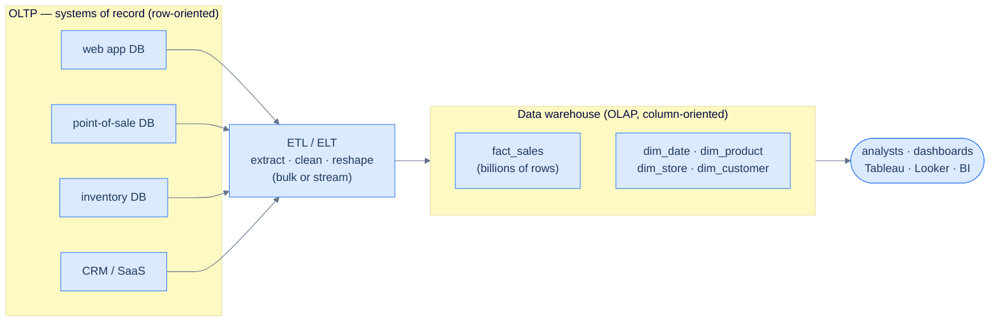

# 31. OLAP and data warehousing

## TL;DR
> Your production database ([Lesson 09](/cortex/system-design/building-blocks/relational-databases)) is an **OLTP** system: it does **online transaction processing** — tiny **point queries** and updates of individual rows, latency-critical, keeping the *current* state. Analytics is the opposite shape: **OLAP** (**online analytical processing**) scans a *huge* number of rows and computes **aggregates** (sum, count, avg) over the *history* of events, but reads only a few columns at a time. Running OLAP on the OLTP box is the classic mistake — one report locks tables and pages the on-call. The fix is two-part. **Architecturally**, you extract data out of the operational systems and **ETL** (extract–transform–load) it into a separate **data warehouse**, modeled as a **star schema**: a giant central **fact table** of events, surrounded by small **dimension tables** (the who/what/where/when). **Physically**, the warehouse stores data by **column, not by row** — so a query reads only the 3 columns it needs, not the 100 it doesn't. Columns of similar values **compress** brilliantly (bitmap + run-length encoding), often 10× or more. Sort order, vectorized execution, and precomputed **materialized views / data cubes** finish the job. Writes are **bulk loads** done LSM-style ([Lesson 24](/cortex/system-design/storage-and-search/lsm-trees-vs-btrees)), because rewriting a compressed column per-row is hopeless. The modern shape: cloud warehouses (Snowflake, BigQuery) and the **lakehouse** that decouples a query engine from columnar files (Parquet) on object storage.

## 1. Motivation

It usually starts with a perfectly reasonable request. A VP wants a dashboard: revenue by region by week, for the last two years, refreshed every morning. An engineer writes the obvious query against the production Postgres — a few joins, a `GROUP BY`, a `SUM`. It works on the staging data. It ships.

Then it runs against production, where the orders table has 400 million rows. The query plan decides to scan the whole table. For ninety seconds it holds the row-oriented pages it touches in the buffer pool, evicting the *hot* pages that real customer requests need. Checkout latency triples. The connection pool saturates because that one query is holding a connection while it grinds. Page goes out. The on-call kills the query, the dashboard 500s, and everyone learns the lesson the industry learned in the **late 1980s**: the database that records a sale and the database that *analyzes* all the sales want to be different machines.

The two workloads are genuinely opposed. The checkout path does **point queries** — "fetch order 8,401,224 by its key," "decrement inventory for SKU 55 by one" — thousands of tiny reads and writes per second, each touching a single row, all latency-critical. The dashboard does the reverse: *one* query, enormously complex, scanning hundreds of millions of rows but caring about only three of their hundred columns, and nobody minds if it takes ten seconds. Pointing both at one engine means each makes the other slower: the analytics scan trashes the OLTP cache, and the OLTP write traffic keeps the analytics scan from ever seeing a quiet moment.

So companies stopped trying. They began extracting a **read-only copy** of the data out of every operational system — the website's database, the point-of-sale checkouts, the inventory tracker, the CRM — cleaning it, reshaping it, and loading it into one separate database whose entire job is to be queried to death by analysts without anyone noticing. That database is the **data warehouse**, and once you have a box dedicated *only* to big scanning reads, you can store the data in a shape that would be insane for OLTP but is perfect for analytics. This chapter is about that split — why it exists, and the two ideas (the **star schema** and the **column store**) that make the warehouse fast.

## 2. Intuition (Analogy)

Picture a supermarket's back office with two very different filing systems.

The **operational system (OLTP)** is the **cash register**. Every checkout writes one receipt — a complete record of *one* transaction: timestamp, items, prices, the cashier, the payment method, the loyalty card. Receipts are filed in a box in arrival order. This is fantastic for the question the register actually asks: "pull up *this one* receipt" (a refund, a dispute). One reach into the box, one whole receipt in hand. Storing each receipt's fields together — **row-oriented** — is exactly right when you want *all* of one receipt at once.

Now the **analyst** walks in with a different question: *"What was our total banana revenue, by day of week, last year?"* To answer it from the box of receipts, she must pull **every receipt for the whole year**, and on each one read past the cashier, the payment method, the loyalty card — all the fields she doesn't care about — just to find the two she does: the date and the banana line. Millions of receipts, each handled in full, to extract two numbers per receipt. That is OLAP on a row store, and it is agony.

So she builds a **second filing system** for her own questions. Instead of one folder per receipt, she keeps **one long ledger column per field**: a column of all the dates, a column of all the products, a column of all the quantities, a column of all the prices — each in the same row order, so position 23 in every column belongs to the same original sale. Now her banana question reads *only the product column and the quantity column*, never touching the cashier or payment columns at all. This is **column-oriented storage**, and the speedup is the whole game.

It gets better. Her product column is just "banana, banana, milk, banana, eggs, banana…" — a few thousand distinct products repeated across billions of rows. That repetition **compresses** absurdly well: she can write "banana appears in rows 1, 2, 4, …" as a compact bitmap, or "the date 2024-06-01 repeats 90,000 times in a row" as a single run. The column store isn't just reading less — it's reading *dramatically less compressed data*. The cash register, the per-field ledgers, the repetition that compresses: that's the whole chapter. Now the formal version.



<p align="center"><strong>The split: many small row-oriented OLTP databases (one per operational system, each a source of truth) feed a single column-oriented warehouse via ETL. Analysts hammer the warehouse without ever touching production.</strong></p>

## 3. Formal definitions

**OLTP vs OLAP.** These are two *access patterns*, and almost every design choice flows from which one you're serving:

| Property | OLTP (operational) | OLAP (analytical) |
|---|---|---|
| **Read pattern** | point queries — fetch a few rows by key | aggregate (sum/count/avg) over millions of rows |
| **Write pattern** | create/update/delete individual records | bulk import (ETL) or an event stream |
| **Queries** | fixed, baked into the application | arbitrary, ad-hoc exploration |
| **Query volume** | many small queries/sec | few queries, each enormous |
| **Data represents** | latest state, *now* | history of events over time |
| **Typical size** | GB → TB | TB → PB |
| **Wants** | low-latency reads & writes | high-throughput scans |
| **Example engines** | Postgres, MySQL, MongoDB | Snowflake, BigQuery, ClickHouse, DuckDB |

The **data warehouse** is the separate database that holds a read-only copy of data from all the OLTP systems, reshaped for analysis. Getting data in is **ETL** — *extract* from the sources, *transform* into the warehouse's schema (clean, dedupe, conform types), *load* it in. Swap the last two and you get **ELT** (load raw, transform inside the warehouse — increasingly the default, because warehouse compute is cheap and elastic). A **data lake** loosens this further: dump the *raw* files (Parquet, JSON, images, logs) into object storage with no enforced schema, and let each consumer transform on read — the "sushi principle," raw data is better. **HTAP** (hybrid transactional/analytical processing) tries to do both in one system, but under the hood it's usually still an OLTP engine bolted to an OLAP one behind a shared interface.

**Star schema (dimensional modeling).** Warehouses are usually relational, modeled in a specific shape. At the center sits the **fact table**: one row per *event* — a sale, a click, a page view. Facts are captured at the finest grain (one row per item sold, not per basket) for maximum analytical flexibility, so the fact table grows to billions or trillions of rows. Its columns are either **measures** (numeric attributes you aggregate: `quantity`, `net_price`, `cost`) or **foreign keys** into **dimension tables** — the small, descriptive tables answering *who, what, where, when, why*: `dim_product`, `dim_store`, `dim_date`, `dim_customer`. Drawn out, the fact table is the hub and the dimensions radiate like the points of a **star** — hence the name. A **snowflake schema** normalizes the dimensions further (a `dim_product` that references a separate `dim_brand` and `dim_category`), trading analyst-friendliness for less redundancy; star is usually preferred because it's simpler to query. Push denormalization all the way and you get **one big table (OBT)** — fold every dimension's columns into the fact table itself, precomputing the joins. Denormalization is safe here precisely because warehouse data is an immutable historical log; the update anomalies that make denormalization dangerous in OLTP ([Lesson 09](/cortex/system-design/building-blocks/relational-databases)) don't apply when nothing ever gets updated in place.

```d2
direction: right

fact: fact_sales (billions of rows) {
  shape: rectangle
  style.fill: "#dbeafe"
  style.stroke: "#3b82f6"
  measures: |md
    **measures**
    quantity
    net_price
    cost
  |
  keys: |md
    **foreign keys →**
    date_key
    product_sk
    store_sk
    customer_sk
  |
}

dim_date: dim_date {
  style.fill: "#fef9c3"
  style.stroke: "#3b82f6"
  cols: |md
    date_key
    weekday
    is_holiday
    quarter
  |
}
dim_product: dim_product {
  style.fill: "#fef9c3"
  style.stroke: "#3b82f6"
  cols: |md
    product_sk
    name · brand
    category
    package_size
  |
}
dim_store: dim_store {
  style.fill: "#fef9c3"
  style.stroke: "#3b82f6"
  cols: |md
    store_sk
    city · region
    has_bakery
    sqft
  |
}
dim_customer: dim_customer {
  style.fill: "#fef9c3"
  style.stroke: "#3b82f6"
  cols: |md
    customer_sk
    segment
    loyalty_tier
  |
}

fact -> dim_date: date_key
fact -> dim_product: product_sk
fact -> dim_store: store_sk
fact -> dim_customer: customer_sk
```

<p align="center"><strong>A star schema: a huge central fact table of events (measures + foreign keys) ringed by small descriptive dimension tables. Every analytical query joins the fact table to a few dimensions and aggregates a measure.</strong></p>

**Row vs column layout.** This is the physical decision underneath OLAP. In **row-oriented** storage (every OLTP database, and documents), all values of one row sit *contiguously* on disk: `[r1: date,product,qty,price,store,…][r2: …]`. Read one row, get everything; scan for two columns, drag the other 98 off disk anyway. In **column-oriented (columnar)** storage you store all values of *one column* together: `[all dates][all products][all quantities]…`, every column in the *same row order* so the *k*-th entry of each column reconstitutes row *k*. A query that needs 3 of 100 columns reads 3 columns' worth of bytes and ignores the rest entirely. In practice the table is split into **blocks** of millions of rows, columnar *within* each block, often partitioned by a time range so a date-bounded query skips whole blocks. (Do not confuse this with **wide-column / column-family** stores like Cassandra or HBase — despite the name, those are *row*-oriented; they keep a row's values together.)

## 4. Worked example

Take the canonical warehouse query against the grocery star schema — *"are people more likely to buy fresh fruit or candy depending on the day of the week, in 2024?"*:

```sql
SELECT
  dim_date.weekday,
  dim_product.category,
  SUM(fact_sales.quantity) AS units_sold
FROM fact_sales
  JOIN dim_date    ON fact_sales.date_key   = dim_date.date_key
  JOIN dim_product ON fact_sales.product_sk = dim_product.product_sk
WHERE dim_date.year = 2024
  AND dim_product.category IN ('Fresh fruit', 'Candy')
GROUP BY dim_date.weekday, dim_product.category;
```

`fact_sales` has, say, **100 columns** and **50 billion rows**. But notice what this query actually touches in the fact table: `date_key`, `product_sk`, and `quantity` — **three columns**. The dimensions do the filtering and labeling; the fact table just supplies those three.

**Why a column store scans 3 columns, not 100.** On a **row store**, even with indexes on `date_key` and `product_sk`, the engine must pull each matching *row* — all 100 attributes, ~400 bytes — off disk and into memory, then discard 97 of them. For a year of sales that's terabytes of bytes read to use a few percent of them. On a **column store**, the engine opens exactly three files: the `date_key` column, the `product_sk` column, the `quantity` column. If each value is ~4 bytes, that's `3 × 4 × 50e9 = 600 GB` of *relevant* data versus reading the full `100 × 4 × 50e9 = 20 TB` table — a **~33×** reduction in bytes read **before any compression**. The "read only the columns you need" property is the single biggest reason OLAP went columnar.

**A compression illustration.** Now compress. The `product_sk` column is a few hundred thousand distinct values smeared across 50 billion rows — perfect for **bitmap encoding**. For each distinct product, store a bitmap with one bit per row, set where that product appears:

```text
product_sk column (one block of 9 rows):   69 69 69 68 69 69 31 31 31

bitmap product_sk = 69:  1 1 1 0 1 1 0 0 0
bitmap product_sk = 68:  0 0 0 1 0 0 0 0 0
bitmap product_sk = 31:  0 0 0 0 0 0 1 1 1
```

These bitmaps are mostly zeros (**sparse**), so **run-length encode** them — store the *runs* instead of the bits. The `product_sk = 31` bitmap becomes "six 0s, then three 1s." A column with billions of rows but few distinct values can collapse to *kilobytes*. And the filter `WHERE product_sk IN (31, 68, 69)` becomes a **bitwise OR** of three bitmaps — blazing fast, and `product_sk = 30 AND store_sk = 3` is a bitwise AND across two columns' bitmaps (legal precisely because both columns share row order). This is why analytical engines run **vectorized**: feed a whole column-batch to an equality operator, get a bitmap back, AND/OR the bitmaps, all in tight SIMD loops operating directly on compressed data.

**Sort order makes it sharper still.** The order of rows in a column store is free to choose — so pick a **sort key** matching your queries. Sort the table by `date_key` first: now a date-bounded query (`year = 2024`) scans a contiguous run of blocks and skips the rest, *and* the sorted `date_key` column is one enormous run of repeats that run-length-encodes to almost nothing. Add `product_sk` as the second sort key and all sales of one product on one day cluster together. The catch: only the **first** sort key compresses spectacularly; the second is more jumbled, the third nearly random — so you get one, maybe two, great sort columns, not all of them. (This sorted, compressed, column-by-column layout is exactly what the **C-Store / Vertica** lineage pioneered.)

Putting it together: the row store reads ~20 TB; the column store reads 3 columns, run-length-compressed, partition-pruned to 2024 — plausibly *single-digit GB* off disk, then crunched with bitmap operations. That gap is why the dashboard from §1 finishes in seconds on the warehouse and pages the on-call on production.

## 5. Trade-offs

| Dimension | OLTP / row store | OLAP / column store |
|---|---|---|
| **Optimized for** | point reads & writes of whole rows | aggregate scans over few columns |
| **Disk read for a 3-of-100-column scan** | all 100 columns (whole rows) | exactly 3 columns |
| **Compression** | modest (mixed types per row) | excellent (similar values per column → bitmap/RLE, 10×+) |
| **Single-row write/update** | cheap, in place | expensive — rewrite compressed columns |
| **Bulk load** | not its strength | the native path (LSM-style batches) |
| **Schema** | normalized (3NF) for write integrity | denormalized star/snowflake/OBT for read speed |
| **Latency target** | milliseconds | seconds–minutes (interactive analytics: sub-second) |
| **Data held** | current state | full event history |
| **In the wild** | Postgres, MySQL/InnoDB, MongoDB | Snowflake, BigQuery, Redshift, ClickHouse, DuckDB, Druid |

The decision rule mirrors [Lesson 24](/cortex/system-design/storage-and-search/lsm-trees-vs-btrees)'s: **is the workload point-access or scan-aggregate?** Point reads/writes of individual entities → row store, OLTP, normalized. Big aggregations over a few columns of an event history → column store, OLAP, star schema. And the deep version: a column store buys *enormous* read efficiency on analytical scans by paying with *brutal* single-row write cost — which is exactly why you never write to it one row at a time, and why the architecture (§1) keeps a fast row-oriented OLTP system upstream and ships data into the warehouse in bulk. Two engines, two shapes, one pipeline between them.

## 6. Edge cases and failure modes

1. **The write cost of column stores.** A single-row `INSERT` into the middle of a sorted, compressed columnar table is a disaster — it forces a rewrite of every compressed column from the insertion point onward. So column stores never do that. They write **LSM-style** ([Lesson 24](/cortex/system-design/storage-and-search/lsm-trees-vs-btrees)): new rows land in a small **row-oriented in-memory buffer**, and when enough accumulate they're sorted, column-encoded, compressed, and merged into new immutable files in one bulk pass. Queries read *both* the on-disk columns and the in-memory buffer and combine them, so an analyst sees fresh inserts immediately — the engine hides the seam. This is why warehouses love **bulk loads** and hate trickle writes.

2. **Real-time vs batch loads.** Classic warehouses ETL in nightly batches — high throughput, but the data is hours stale, which is fine for "last quarter's revenue" and useless for "block this fraudulent transaction *now*." **Real-time / product-analytics** engines (Druid, Pinot, ClickHouse) ingest from a stream ([Lesson 29](/cortex/system-design/storage-and-search/batch-processing)) and optimize for low-latency queries embedded in user-facing products (the "users who viewed this also viewed" widget, live dashboards). The trade is throughput-per-query for freshness-and-latency; the failure mode is reaching for a batch warehouse when the product needs sub-second answers on seconds-old data, or vice versa.

3. **The lakehouse.** The monolithic warehouse has fractured into composable layers, each swappable: a **storage format** (columnar files — **Parquet**, ORC — in object storage), a **table format** on top (Iceberg, Delta Lake) that makes immutable files behave like a mutable table with inserts, deletes, transactions, and **time travel**; a **data catalog** (which tables exist); and a **query engine** (Trino, Spark, DataFusion) that's decoupled from storage so compute scales independently. This **lakehouse** marries the cheap, open, any-format storage of a data lake with the schema and SQL of a warehouse. The win is elasticity and no lock-in; the risk is operational sprawl — you now assemble and version four components that Snowflake hands you as one.

4. **High-cardinality columns.** Columnar compression assumes *few distinct values per column* — that's what makes bitmaps and run-length encoding sing. A column like `user_id`, `session_uuid`, or `event_timestamp_ns` with *billions* of distinct values breaks the assumption: bitmaps degenerate (one bitmap per value, each nearly empty), and the column compresses poorly and bloats both storage and scan cost. Worse, it likely isn't your sort key, so it appears in near-random order with no runs to exploit. Mitigations: dictionary-encode if cardinality is high-but-bounded, reduce precision where you can (truncate timestamps to the second), keep high-cardinality fields *out* of the sort prefix, and lean on per-block min/max metadata for pruning rather than on compression. The general trap: assuming "columnar = always tiny" when a single high-cardinality column can dominate your footprint.

## 7. Practice

> **Exercise 1 — Bytes read, row vs column.**
> A `fact_events` table has **80 columns**, **20 billion rows**, and every value is ~4 bytes (≈320 bytes/row). A query needs `SUM(amount) GROUP BY country` — two columns: `amount` and `country`. (a) Roughly how many bytes does a *row store* read to scan the table? (b) How many does a *column store* read (ignore compression)? (c) Now `country` has 200 distinct values and the table is sorted by `country` — what happens to its on-disk size?
>
> <details>
> <summary>Solution</summary>
>
> **(a)** A row store reads whole rows: `320 bytes × 20e9 ≈ 6.4 TB`. **(b)** A column store reads only `amount` and `country`: `2 × 4 bytes × 20e9 = 160 GB` — a **40×** reduction, just from skipping 78 columns, before any compression. **(c)** With only 200 distinct values *and the table sorted by `country`*, the `country` column is 200 long runs of identical values; **run-length encoding** collapses it to ~200 (value, count) pairs — kilobytes, regardless of the 20 billion rows. The combination — read fewer columns, and the ones you read compress hugely — is the entire OLAP performance story.
>
> </details>

> **Exercise 2 — Build the star schema.**
> You run a ride-hailing app. Analysts ask: revenue by city by month; average trip distance by driver rating; surge-pricing's effect on cancellations. Sketch a star schema: name the fact table, its grain, two measures, and four dimension tables. Why is one fact row per *trip* (not per *driver* or per *city*) the right grain?
>
> <details>
> <summary>Solution</summary>
>
> **Fact table:** `fact_trips`, **grain = one row per completed (or attempted) trip**. **Measures:** `fare_amount`, `distance_km`, `duration_s`, `surge_multiplier` (any aggregatable numerics). **Dimensions:** `dim_date` (month, weekday, holiday), `dim_city` (city, region, market), `dim_driver` (rating bucket, tenure, vehicle class), `dim_rider` (segment, signup cohort) — plus the cancellation flag as a measure/degenerate dimension. **Why per-trip grain:** the finest grain is the most flexible — you can *roll up* trips to city, driver, month, or rating after the fact, but you can never *drill down* if you pre-aggregated to "revenue per city." Capture facts at the event level and let queries aggregate; that's the whole point of dimensional modeling.
>
> </details>

> **Exercise 3 — Why not just HTAP everything?**
> A teammate argues: "Column stores read less and compress better — let's just put *everything*, including checkout, on ClickHouse and delete Postgres." Give two concrete reasons this fails for the OLTP workload, and name the conditions under which a single HTAP system *is* reasonable.
>
> <details>
> <summary>Solution</summary>
>
> **Reason 1 — single-row writes are brutal.** Checkout does thousands of tiny point writes/sec (one order, one inventory decrement). A column store must rewrite/merge compressed columns to absorb writes (LSM-style batching), so per-row, low-latency, individually-acknowledged writes — the OLTP bread and butter — are exactly its weakness. **Reason 2 — point reads waste the layout.** "Fetch order 8401224 with all its fields" must gather one value from *every* column file and stitch the row back together — the column layout's strength (skip columns) becomes pure overhead when you want the *whole* row. (Transactional isolation/locking on smeared-across-columns rows is harder too.) **When HTAP is reasonable:** when the *same* application genuinely needs both low-latency point access *and* large scans over fresh data — e.g. fraud detection that updates an account and scans its recent history in one flow — and the data volume is modest enough that one tuned system beats the operational cost of two. Even then, most HTAP engines are an OLTP store and an OLAP store behind one façade — so the distinction in this chapter still governs how it behaves.
>
> </details>

## Your Turn

Before you move on, check your understanding with the coach — explain the idea, apply it, weigh the trade-offs, then defend your reasoning.

<div class="concept-coach"></div>

## In the Wild

- **[Martin Kleppmann & Chris Riccomini — *Designing Data-Intensive Applications*, 2nd ed., Ch. 1 & 4](https://dataintensive.net/)** — the source this lesson paraphrases: OLTP vs OLAP and the warehouse/lake split (Ch. 1), then star schemas, column-oriented storage, compression, and data cubes (Ch. 4). The grocery star schema and the fruit-vs-candy query come straight from here.
- **[Stonebraker, Abadi, et al. — "C-Store: A Column-Oriented DBMS"](https://www.vldb.org/archives/website/2005/program/paper/thu/p553-stonebraker.pdf)** (VLDB 2005) — the research system that made the modern column-store case (sort orders, aggressive compression, read-optimized projections); commercialized as **Vertica**, whose "C-Store 7 Years Later" retrospective (VLDB 2012) reports what survived contact with production.
- **[Melnik et al. — "Dremel: Interactive Analysis of Web-Scale Datasets"](https://research.google/pubs/pub36632/)** (VLDB 2010) — Google's columnar, massively-parallel query engine and the record-shredding scheme that lets *nested* data live in columns; the lineage behind **BigQuery** and **Parquet**.
- **[The Snowflake Elastic Data Warehouse](https://www.cs.utexas.edu/~rossbach/cs378h/papers/Snowflake.pdf)** (SIGMOD 2016) — the paper that defined the cloud warehouse: separate storage (object store) from compute (elastic clusters), the model every cloud warehouse now copies.
- **[ClickHouse docs](https://clickhouse.com/docs)** and **[DuckDB docs](https://duckdb.org/docs/)** — two ends of the modern columnar spectrum: ClickHouse for real-time analytics at scale, DuckDB for an embedded "SQLite for analytics" you can `pip install` and point at a Parquet file. Both are the fastest way to *feel* columnar speed firsthand.
- **[Apache Parquet](https://parquet.apache.org/docs/) & [Apache Iceberg](https://iceberg.apache.org/docs/latest/)** — the open columnar file format and the table format on top of it that together make the **lakehouse**: columnar files on object storage that behave like a transactional, time-travelling warehouse table.

---

> **Next:** [32. Monoliths, microservices, and modular monoliths](/cortex/system-design/application-architecture/monoliths-microservices-modular-monoliths) — we've spent six chapters deep in the storage layer, choosing how bytes hit the disk. Now we zoom all the way out to the shape of the *application* that sits on top: do you build one deployable unit or fifty? That choice — monolith, microservices, or the modular monolith in between — decides how teams ship, how services fail, and whether "just add a column" is a five-minute change or a five-team migration.
