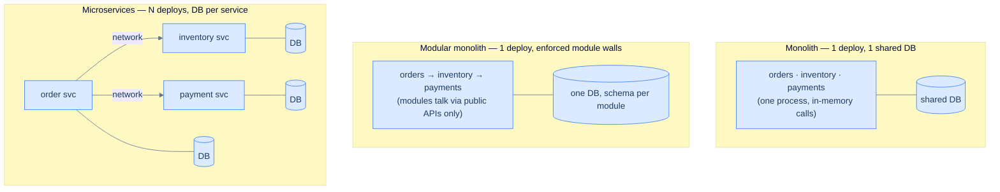

# 27. Monoliths, microservices, and modular monoliths

## TL;DR
> A **monolith** is one deployable unit — simple to build, test, deploy, and reason about, with in-process calls and one ACID database — that can grow into a tangled mess as the team and codebase scale. **Microservices** split the system into many independently-deployable services, each owning its data, which buys **independent scaling, team autonomy, and fault isolation** — but the bill is steep: every in-process call that crosses a service boundary becomes a **network call** that can fail, every multi-service write becomes a **distributed transaction** (a saga), and you pay an **N× operational tax** (N pipelines, N dashboards, N on-call rotations). The trap is the **distributed monolith** — services that share a database or deploy in lockstep, so you get all the costs and none of the benefits. The pragmatic default is the **modular monolith**: one deployable unit with *enforced* internal module boundaries (Shopify, Basecamp), giving you a monolith's operational simplicity *and* clean seams you can later extract into services — but only when a module has a *proven* need. Microservices solve an organizational/scale problem, not an elegance problem.

## 1. Motivation

In **March 2023**, an engineering team at **Amazon Prime Video** published a post that the internet could hardly believe came from Amazon — the company most associated with microservices. Their **audio/video quality monitoring service** (it watches thousands of live streams for freezes, corruption, and sync problems) had been built the "modern" way: a fleet of distributed serverless components orchestrated by **AWS Step Functions**, passing video frames through **S3** as intermediate storage. It didn't scale and it wasn't cheap. The orchestration did *multiple state transitions per second of every stream* and slammed into Step Functions account limits, and the constant S3 round-trips for frames were expensive. So they did the heretical thing: they **collapsed it back into a monolith** — all the components running inside a single Amazon ECS task, passing frames *in memory* instead of through S3 — and **cut costs by about 90%**.

The honest footnote, which most hot takes dropped: this was a decision for **one service**, not a repudiation of microservices across Prime Video. And that nuance *is* the lesson. The architecture wasn't "wrong" because it was microservices; it was wrong because the team had paid the microservices premium — network hops, orchestration, intermediate storage — for a workload whose pieces were chatty, tightly-coupled, and better off sharing memory. Two years earlier, **Segment** had told a similar story in *Goodbye Microservices*: they'd grown to roughly **250 microservices and ~16,000 containers**, and the operational overhead rose *linearly with every new integration* until it crushed the team, so they consolidated back to a monolith to get their lives back.

The instinct this lesson fights is "microservices = grown-up, monolith = amateur." The truth is that **all three architectures are right somewhere**, and choosing well means being honest about a trade-off that's mostly *organizational*, not technical.

## 2. Intuition (Analogy)

Think about three ways to house a growing family.

- **A monolith is a studio apartment.** Everything is in one open room: kitchen, bed, desk, all an arm's reach away. For one or two people it's *wonderful* — nothing to coordinate, you see everything at once, moving things around is trivial. But as the family grows it gets crowded and chaotic: there's no privacy, a mess in the kitchen is a mess in the bedroom, and a kitchen fire threatens the whole place. Everyone shares one space, so everyone steps on each other.
- **Microservices are a neighbourhood of separate houses.** Each family gets its own house with its own kitchen and its own lock. They can renovate independently, and a fire in one house doesn't burn down the others (**fault isolation**). But now the families talk through the *street* — mail, phone, deliveries (the **network**) — which is slower and sometimes the line is down. Hosting a dinner that spans twelve houses is a logistics project, and figuring out "whose house has the problem?" means walking the whole block (**distributed debugging**). You need roads, utilities, and a postal service for *each* house (the **operational tax**).
- **A modular monolith is one house with well-built rooms.** You all live under one roof and walk through one front door (**one deployment**), but there are real walls and doors: the kitchen doesn't reach into the bedroom's closet — it asks through the doorway (**a module's public interface**, never its internals). It has a monolith's togetherness *and* clean separation. And here's the payoff: if the teenagers eventually need their own space, you can convert a room into a separate house relatively easily — because **the wall was already there**.

Studio apartment, neighbourhood of houses, one house with real rooms. The walls — module boundaries — are the whole game.

## 3. Formal definitions

The two axes that actually matter are **how many deployable units** and **how enforced the internal boundaries are**:

| | **Monolith** | **Modular monolith** | **Microservices** |
|---|---|---|---|
| Deployable units | one | one | many (one per service) |
| Internal boundaries | often entangled | **enforced** module walls + public APIs | network + separate processes |
| Data | one shared database | one DB, schema/ownership per module | **database per service** |
| Cross-component call | function call (nanoseconds) | function call across a module API | **network call** (ms + can fail) |
| Multi-component write | one ACID transaction | one ACID transaction | **distributed (saga)** |
| Scaling | the whole app together | the whole app together | **per service** |
| Operational cost | 1× (one pipeline, one on-call) | 1× | **N×** |
| Fault isolation | weak (one crash → all down) | weak | **strong** (a service can fail alone) |

Two ideas govern the choice. **Conway's Law** (Melvin Conway, 1967): *"organizations which design systems are constrained to produce designs which are copies of the communication structures of these organizations."* Microservices are, in effect, your **org chart turned into architecture** — which is why they pay off when you have many teams that need to ship independently, and hurt when you don't. And the **distributed monolith** anti-pattern: microservices that share a database or must be deployed together. They've added the network and the N× ops cost but kept the coupling, so they get *all* the costs and *none* of the independence — the worst quadrant on the table.



<p align="center"><strong>Same three components, three architectures. The monolith and modular monolith share a deploy and a database; microservices trade in-memory calls for the network and one DB for many.</strong></p>

## 4. Worked Example — "place an order," three ways

A request to **place an order** must reserve inventory, take payment, and create a shipment. Watch what that one flow costs under each architecture.

**Monolith / modular monolith.** It's a single function that wraps three steps in **one database transaction**. The calls are in-process (nanoseconds), and if payment fails, the whole transaction **rolls back atomically** — inventory is un-reserved for free, because it was never committed. The flow's availability is essentially the app's availability: there's no network in the middle to fail. Simple, fast, correct.

**Microservices.** Now `order-service` calls `inventory-service`, `payment-service`, and `shipping-service` — three **network hops**. There is no shared transaction (each service owns its own database), so you must hand-build the atomicity: if payment succeeds but shipping fails, you have to **compensate** by refunding and releasing inventory — a **saga** ([Lesson 19](/cortex/system-design/distributed-patterns/sagas-and-distributed-transactions)) — and because a call can time out *after* the other side succeeded, every operation must be **idempotent** ([Lesson 17](/cortex/system-design/distributed-patterns/idempotency-retries-backoff)). Quantify the hidden cost with availability math: if each service is **99.9%** available and the flow needs all of them synchronously, the flow's availability is `0.999³ ≈ 99.7%` — and a realistic checkout touching **six** services at 99.9% is `0.999⁶ ≈ 99.4%`, roughly **52 hours of downtime a year** created purely by chaining services. Synchronous depth multiplies failure (mitigate with circuit breakers — [Lesson 21](/cortex/system-design/distributed-patterns/circuit-breakers-and-bulkheads) — async calls, and caching).

**The failure case — the distributed monolith.** A team splits the monolith into six services but, to "move fast," lets them all share the **one original database** and keeps the APIs so tightly coupled that releasing one requires releasing all six together. Now: a schema change means coordinating six deploys; any one service being down breaks the whole checkout flow (no fault isolation — they all read the same tables); and they've *added* network latency and six pipelines on top. They have every microservices cost and zero microservices benefit. This is the most common way teams ruin themselves with microservices — splitting along the wrong seams, before the domain boundaries are understood, while still sharing state. The fix is usually to **merge back to a modular monolith** and extract a service only when one genuinely needs to scale or ship on its own.

## 5. Build It

You don't need a cluster to feel the core trade-off — you need to see what happens to *one call* when it crosses a service boundary. Here's "place an order" as a monolith, then as microservices:

```python
# MONOLITH: one in-process function, one ACID transaction. No network, no partial failure.
def place_order(cart):
    with db.transaction():              # all-or-nothing across all three steps
        reserve_inventory(cart)         # plain function calls: nanoseconds, can't "time out"
        charge = take_payment(cart)     # if this raises, the whole transaction rolls back...
        create_shipment(cart, charge)   # ...and the inventory reservation vanishes for free
    return "ok"

# MICROSERVICES: the same flow across the network. Every line gains failure modes.
async def place_order(cart):
    await inventory_svc.reserve(cart)            # network hop — must be idempotent (retries!)
    try:
        charge = await payment_svc.charge(cart)  # may succeed on THEIR side yet time out on ours
    except Timeout:
        await inventory_svc.release(cart)        # manual compensation — you are writing a saga
        raise
    try:
        await shipping_svc.create(cart, charge)
    except Exception:
        await payment_svc.refund(charge)         # payment already happened → compensate again
        await inventory_svc.release(cart)
        raise
    return "ok"
```

The second version isn't "more advanced" — it's the *same logic* drowning in the consequences of one architectural choice. A single ACID transaction became a hand-rolled saga with timeouts, idempotency requirements, and compensation on every failure path. That code is the microservices premium made concrete, and it's why a **modular monolith** keeps `place_order` looking like the *first* version while still enforcing that `reserve_inventory` lives behind the inventory module's public API (so the day you truly must extract `inventory-service`, the seam already exists). Tools make the walls real: Shopify's **Packwerk** enforces module boundaries across its 2.8-million-line Ruby monolith, failing the build if one component reaches into another's internals.

## 6. Trade-offs

| Dimension | Monolith | Modular monolith | Microservices |
|---|---|---|---|
| Time-to-first-feature | fastest | fast | slowest (platform setup first) |
| Cross-component latency | ~0 (in-process) | ~0 (in-process) | network ms per hop |
| Transactions | ACID, trivial | ACID, trivial | sagas, eventual consistency |
| Independent deploy/scale | no | no | **yes** |
| Team autonomy | low | medium | **high** |
| Fault isolation | weak | weak | **strong** |
| Flow availability (N comps, 99.9% each) | ~99.9% | ~99.9% | `0.999^N` (erodes per hop) |
| Operational cost | 1× | 1× | **N×** |
| Cost to move a boundary | trivial (move code) | trivial (move code) | hard (renegotiate a network contract) |

The decision rule, distilled from Martin Fowler's **"MonolithFirst"** (2015): **start with a monolith, organize it into modules, and extract a microservice only when a specific module has a proven, concrete need** — it must scale on a wildly different profile, or a dedicated team must ship it independently — *and* you have the operational maturity (CI/CD, observability, on-call) to absorb the N× tax. Fowler's **"microservice premium"** is real: managing a fleet of services is a fixed cost that only pays off for sufficiently complex systems, which is why "almost all the successful microservice stories started with a monolith that got too big and was broken up," while greenfield-microservices projects so often stall. The modular monolith is the sweet spot because it **defers the irreversible decision**: you get clean boundaries now, cheaply, and buy the *option* to extract later without committing to the cost today.

## 7. Edge cases and failure modes

- **The distributed monolith.** Services that share a database or deploy in lockstep have the network + N× ops cost with none of the independence (§4). Symptom: "we can't deploy service A without also deploying B and C." Cure: re-merge to a modular monolith; only re-extract on a proven need.
- **Premature decomposition.** Splitting before the domain is understood means you draw the seams in the wrong place — and moving a boundary later is now a cross-team *network-contract* renegotiation instead of a code move. Get the boundaries right in a modular monolith first, where they're cheap to change.
- **Availability erodes with synchronous depth.** A flow that synchronously needs N services at availability `a` is only `a^N` available; deep call chains quietly destroy your uptime. Mitigate by minimizing synchronous hops, going async where possible, caching, and adding circuit breakers ([Lesson 21](/cortex/system-design/distributed-patterns/circuit-breakers-and-bulkheads)).
- **Every cross-service write is now a saga.** Atomicity across services means compensations + idempotency ([Lessons 17](/cortex/system-design/distributed-patterns/idempotency-retries-backoff) & [19](/cortex/system-design/distributed-patterns/sagas-and-distributed-transactions)). A domain rich in multi-entity transactions (banking, inventory) pays this tax on nearly every operation — a strong signal to keep those entities in one service or one monolith.
- **The operational multiplier crushes small teams.** N services = N pipelines, N dashboards, N alert configs, N on-call rotations. Without a mature internal platform (a "paved road"), the ops cost swamps feature work — Segment's exact reason for reversing course.
- **Database-per-service vs. shared data.** Clean until two services need the same data — then you face duplication, cross-service sync, and eventual consistency, and you discover that **cross-service joins don't exist** (you do N calls or denormalize). Choosing service boundaries is really choosing *data* boundaries.
- **Conway's Law bites both ways.** If you impose microservices on a small, tightly-coupled team, the architecture and the org fight each other; if you have many independent teams forced into one monolith, they contend over every deploy. Align the architecture with the org you actually have.

## 8. Practice

> **Exercise 1 — Availability arithmetic.**
> A checkout request synchronously calls **6** services, each **99.95%** available. (a) What's the checkout's availability and roughly how much downtime per year? (b) You make 3 of those calls **asynchronous** (they no longer block or fail the checkout response). What's the new availability?
>
> <details>
> <summary>Solution</summary>
>
> **(a)** All six must succeed synchronously, so availability ≈ `0.9995⁶ ≈ 0.99700` = **99.70%**. A year is ~8,760 hours, so downtime ≈ `0.30% × 8,760 ≈ 26 hours/year` — created purely by chaining services that are each individually quite reliable. **(b)** With only 3 calls on the synchronous critical path, availability ≈ `0.9995³ ≈ 0.99850` = **99.85%** (~13 hours/year) — *halving* the downtime by removing blocking hops, without making any single service more reliable. The lesson: **synchronous depth is the enemy of availability.** A monolith doing the same work in-process has no such multiplication — its flow availability is just the app's availability.
>
> </details>

> **Exercise 2 — Diagnose the architecture.**
> A team runs 12 "microservices" that all read and write **one shared Postgres database**, and a release requires deploying all 12 together because their APIs are tightly coupled. Which microservices *benefits* do they actually have, which *costs* do they pay, and what single change helps most?
>
> <details>
> <summary>Solution</summary>
>
> **Benefits: essentially none.** The shared database means no independent data ownership; lockstep deploys mean no independent deployment; shared tables mean a bad write or a down service can break everyone, so no fault isolation. **Costs: all of them** — inter-service network latency, 12× operational overhead (pipelines, dashboards, on-call), and distributed debugging. This is a textbook **distributed monolith**. The highest-leverage change is usually to **merge them back into one modular monolith**: recover the single deploy, single database transaction, and single on-call, while keeping (or introducing) enforced module boundaries. Then re-extract a service *only* when one has a genuine independent-scaling or team-ownership need. Splitting the shared database first, *without* fixing the coupling, just adds consistency pain on top of the existing mess.
>
> </details>

> **Exercise 3 — Pick the architecture.**
> Justify a choice for each: (a) a 4-person startup building an e-commerce MVP; (b) a 500-engineer company whose **search** subsystem needs ~50× the compute of everything else and has its own dedicated team; (c) a team that wants clean internal boundaries today but cannot staff multiple on-call rotations.
>
> <details>
> <summary>Solution</summary>
>
> **(a) (Modular) monolith.** At MVP stage the domain boundaries aren't even known yet, and a 4-person team can't afford the microservices operational tax — exactly the Prime Video and Segment cautionary tales. Ship a monolith; keep it modular so you're not painted into a corner. **(b) Microservices — at minimum, extract search.** A subsystem with a *50× different scaling profile* and a *dedicated team* is the textbook **justified** extraction: independent scaling saves real money and team autonomy speeds delivery, and at 500 engineers you have the platform maturity to pay the tax. This is "a monolith that got too big, broken up where it matters." **(c) Modular monolith.** It delivers the clean, enforced boundaries they want with **one** deploy and **one** on-call rotation, and preserves the option to extract a service later — when a concrete need *and* the operational capacity both arrive.
>
> </details>

## In the Wild

- **[Prime Video — "Scaling up the audio/video monitoring service and reducing costs by 90%"](https://www.primevideotech.com/video-streaming/scaling-up-the-prime-video-audio-video-monitoring-service-and-reducing-costs-by-90)** (March 2023) — the §1 motivation, straight from the team: why *one* chatty, tightly-coupled service was cheaper as a monolith. Read it for the nuance the hot-takes dropped (it was one service, not a verdict on microservices).
- **[Segment — "Goodbye Microservices"](https://www.twilio.com/en-us/blog/developers/best-practices/goodbye-microservices)** (2018) — the operational-overhead story: ~250 services / ~16k containers, overhead rising linearly per integration, and the deliberate retreat to a monolith to get the team's velocity back.
- **[Shopify — "Deconstructing the Monolith" / "Under Deconstruction"](https://shopify.engineering/shopify-monolith)** — the canonical **modular monolith** at scale (2.8M lines of Ruby, ~37 components) and **Packwerk**, the tool that enforces the module walls. Proof the pattern works at enormous size.
- **[DHH — "The Majestic Monolith"](https://signalvnoise.com/svn3/the-majestic-monolith/)** (Basecamp, 2016) — the manifesto for small, focused teams: microservices' operational overhead is "pure waste" until you have the org that needs it.
- **[Martin Fowler — "MonolithFirst"](https://martinfowler.com/bliki/MonolithFirst.html)** (2015) — the default strategy and the "MicroservicePremium": start monolithic, modularize, and extract services only when complexity justifies the fixed cost of running a fleet.

---

> **Next:** [28. API design](/cortex/system-design/application-architecture/api-design) — the moment you split anything into modules or services, they have to *talk*, and the contract between them is where systems live or die. Next we design that contract properly: REST vs gRPC vs GraphQL, versioning without breaking clients, pagination, idempotency keys, and the small decisions (status codes, error shapes, nullability) that quietly determine whether other teams can build on your API without cursing your name.
