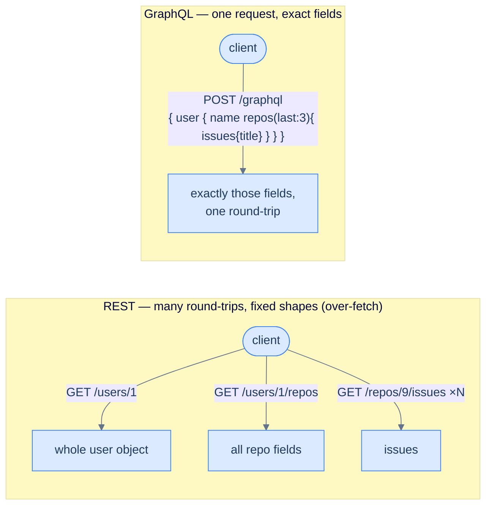

# 28. API design — REST, gRPC, GraphQL

## TL;DR
> An API is a **contract**, and the moment another team or company builds on it, that contract is load-bearing — breaking it breaks them. The three dominant styles suit different *clients*: **REST** (resources + HTTP verbs) is the universal default — cacheable, browser-native, easy to consume, but it **over-fetches** (returns fixed shapes) and forces **multiple round-trips**; **gRPC** (HTTP/2 + Protocol Buffers, contract-first) is fast, typed, and streaming-capable — ideal **service-to-service**, awkward from a browser; **GraphQL** (one endpoint, client picks the exact fields) kills over-/under-fetching for **diverse clients** (mobile/web/TV), at the cost of harder caching and the N+1 trap. Layered on top, four cross-cutting decisions matter more than the style: **versioning** (evolve additively; date-pin like Stripe when you must break), **pagination** (cursor/keyset, not offset), **idempotency** (idempotency keys so a retried POST doesn't double-charge), and **error contracts** (correct status codes + a consistent envelope, RFC 9457). Pick the style by asking *who calls this and what does their screen need* — not by fashion.

## 1. Motivation

In **September 2016**, GitHub did something unusual: it launched a brand-new API, **GraphQL API v4**, *alongside* its mature REST API v3 rather than replacing it. The reason was a pain its integrators felt every day. With REST, building a screen like "show me a user and their last three repositories and each repo's open issues" meant a cascade of requests — `GET /users/X`, then `GET /users/X/repos`, then `GET /repos/Y/issues` for *each* repo — and every response came back in a fixed shape stuffed with fields the client didn't want. GitHub described the two diseases precisely: **over-fetching** (REST "returns more data than you requested, in a pre-determined structure") and **multiple round-trips** (a screen needs many calls). Their fix, GraphQL, let a client send **one** query naming exactly the fields it wanted, nested as deeply as the screen — "a single complex GraphQL call could be the equivalent of thousands of REST requests."

But notice what GitHub did *not* do: they didn't delete REST. REST is still better for a huge class of consumers. That's the real lesson, and the reason the stub for this chapter says **"REST or gRPC" is the wrong question.** There's no universally best API style — there's a best style *for a given client*. A browser hitting a public CRUD endpoint wants cacheable REST. Thirty backend services talking to each other want typed, fast gRPC. A mobile app assembling a rich screen over a slow cellular link wants GraphQL's tailored single request. So the right first question is always **"who calls this, and what does their screen or service actually need?"** And once you've picked a style, a second set of decisions — versioning, pagination, idempotency, error shapes — quietly determines whether anyone can *build* on your API without cursing your name. Stripe is the patron saint here: it has kept old API integrations working for over a decade by treating the contract as sacred. This lesson is both halves.

## 2. Intuition (Analogy)

Think about three ways a kitchen takes your order.

- **REST is a printed menu of numbered dishes.** Each dish is a *resource* you order by its number (`GET /dishes/5`), and the kitchen sends back the **whole plate** — even if you only wanted the fries, you get the garnish, the sauce, the sprig of parsley (over-fetching). To assemble a full meal you place several separate orders (multiple round-trips). It's simple, universally understood, and the kitchen can pre-make popular dishes (HTTP caching).
- **GraphQL is a build-your-own bowl.** You hand over **one** order slip listing *exactly* the ingredients you want — "rice, double chicken, no beans, extra salsa" — and get back precisely that, in one trip. No parsley you'll scrape off, no second trip to the counter. The catch: the kitchen has to be clever about not running to the pantry fifty separate times to fill one complicated bowl (the **N+1** problem).
- **gRPC is two regular kitchens with a private hotline.** Two restaurants that work together constantly don't read each other a menu — they've agreed in advance on a **terse shorthand** (the `.proto` contract) and shout compact codes down a dedicated line (binary Protocol Buffers over HTTP/2). It's blisteringly fast and unambiguous, but a random walk-in customer (a browser) can't use the hotline, and both kitchens must agree on the shorthand *before* they can talk.

Two more touches complete the picture. **Versioning** is the menu having a printed *date*: a regular's "the usual" keeps meaning the same dish even after the menu is revised, because their order is pinned to the menu-version from when they started. And an **idempotency key** is writing a ticket number on your order, so that if you nervously call back to repeat it, the kitchen sees the same number and makes **one** meal, not two — no double charge.

## 3. Formal definitions

The three styles, compared on the axes that decide between them:

| | **REST** | **gRPC** | **GraphQL** |
|---|---|---|---|
| Transport | HTTP/1.1 or 2 | **HTTP/2** | HTTP (usually POST to one endpoint) |
| Payload | JSON (text) | **Protocol Buffers** (binary) | JSON |
| Schema/contract | optional (OpenAPI) | **mandatory `.proto`**, codegen | mandatory typed schema |
| Fetching | fixed resource shapes | fixed RPC methods | **client picks exact fields** |
| Over/under-fetch | yes / yes | minimal | **solved** |
| Caching | **easy** (HTTP caching) | manual | hard (one endpoint, POST) |
| Streaming | awkward | **native** (bidirectional) | subscriptions |
| Browser-native | **yes** | no (needs grpc-web) | yes |
| Sweet spot | public/CRUD/web APIs | **internal service-to-service** | diverse clients, rich reads |

REST (from Roy Fielding's 2000 dissertation) models everything as **resources** addressed by URL and manipulated with HTTP verbs (`GET` safe, `PUT`/`DELETE` idempotent, `POST` not). **gRPC** (Google, open-sourced 2015) is contract-first RPC: you write a `.proto`, generate typed client/server stubs, and get HTTP/2 multiplexing and streaming. **GraphQL** (Facebook, in production 2012, open-sourced 2015) exposes a typed graph through one endpoint where the client's query *is* the response shape.

Four cross-cutting decisions sit on top of whichever style you pick:

| Concern | Bad default | Good practice |
|---|---|---|
| **Versioning** | rename/remove fields in place → break clients | evolve **additively**; when you must break, **date-pin** (Stripe: account pinned on first call; `Stripe-Version` to override) |
| **Pagination** | `?offset=N&limit=20` (drifts on insert; deep offsets are O(N)) | **cursor/keyset** (`?after=<id>`) — stable + O(log n) |
| **Idempotency** | `POST` retried after a timeout → duplicate | **idempotency keys** (store first result, replay on retry — [Lesson 17](/cortex/system-design/distributed-patterns-idempotency-retries-backoff)) |
| **Errors** | `200 OK` with an error body; a different shape per endpoint | correct **status codes** + one envelope (**RFC 9457** Problem Details: `type`, `title`, `status`, `detail`, `instance`) |

## 4. Worked Example — paginating and creating orders without footguns

Design two endpoints for a store: **list a user's orders** and **create an order**. Both have a classic trap.

**Listing — and why offset pagination drifts.** The naïve design is `GET /orders?offset=20&limit=20`. Picture the user scrolling their order history while new orders arrive. At time *t* they fetch page 1 (`offset=0`): orders #100–81. Before they fetch page 2 (`offset=20`), **two new orders (#101, #102) are inserted at the top.** Now `offset=20` skips the 20 newest — which are now #102–83 — and returns #82–63... but #81 and #82 *already appeared or were meant to*, and some rows are silently shown twice or skipped entirely. This is **page drift**, and it's not rare — any actively-written list hits it. There's a second problem: `OFFSET 1000000 LIMIT 20` forces the database to scan and *discard* a million rows to reach the page, an O(offset) cost that crawls at depth. **The fix is cursor (keyset) pagination:** instead of "skip 20 by position," you say "give me the 20 *after this id*" — `WHERE id < :last_seen_id ORDER BY id DESC LIMIT 20`. The cursor is a stable value, not a position, so inserts at the top don't shift it, and the query rides the index in O(log n) regardless of depth.

**Creating — and why a retry double-charges.** `POST /orders` charges a card. On a flaky mobile network, the request succeeds on the server but the *response* is lost; the client times out and retries; now there are **two orders and two charges** ([Lesson 17](/cortex/system-design/distributed-patterns-idempotency-retries-backoff)'s exact hazard). **The failure case made concrete:** without protection, "tap Pay, network hiccup, tap Pay again" bills the customer twice and you eat a chargeback. The fix is an **idempotency key**: the client generates one unique key per *intent* (one per "Pay" tap, reused across that tap's retries) and sends it in the `Idempotency-Key` header. The server, on first sight of a key, does the work and stores `(key → response)`; on any later request with the same key it **replays the stored response and does nothing new**. Stripe does exactly this — saving the status and body of the first request per key (even errors) and returning them on retries — and recommends it for *all* POSTs. One intent, one charge, no matter how many times the network makes the client retry.



<p align="center"><strong>The GitHub v4 problem in one picture: REST needs several round-trips and returns fixed, over-stuffed shapes; GraphQL fetches exactly the requested fields in a single request.</strong></p>

## 5. Build It

The two footguns from §4, defused in Python. First, **cursor pagination** — stable under inserts and fast at any depth:

```python
def list_orders(user_id, after_id=None, limit=20):
    # OFFSET pagination would be: ORDER BY id DESC OFFSET n LIMIT 20
    #   -> scans n rows (slow when deep) AND drifts when new rows are inserted at the top.
    where, params = "user_id = %s", [user_id]
    if after_id is not None:
        where += " AND id < %s"               # keyset: continue strictly AFTER the last id seen
        params.append(after_id)
    rows = db.query(
        f"SELECT id, total FROM orders WHERE {where} ORDER BY id DESC LIMIT %s",
        params + [limit + 1])                  # fetch one extra to detect a next page
    has_more = len(rows) > limit
    rows = rows[:limit]
    next_cursor = rows[-1]["id"] if has_more else None
    return {"orders": rows, "next_cursor": next_cursor}   # client sends next_cursor back as ?after=
```

Then, an **idempotency key** that makes a retried `POST` safe:

```python
def create_order(user_id, body, idempotency_key):
    cached = db.get_idempotent_result(idempotency_key)   # seen this key before?
    if cached is not None:
        return cached                                    # replay the SAME response; do NO new work
    order = charge_and_insert_order(user_id, body)       # the side-effecting work — happens once
    db.save_idempotent_result(idempotency_key, order)    # remember it for any retries of this intent
    return order
```

The cursor version never shows a row twice no matter how many orders are inserted while the user scrolls, and the `LIMIT n+1` trick tells you whether to emit a `next_cursor` without a second `COUNT(*)`. The idempotency handler turns the inherently-unsafe `POST` into something a client can retry blindly — the entire safety property is "look up the key *before* doing the work, store the result *after*." Note the key must be tied to the **intent** (one "Pay" tap), not regenerated per HTTP attempt, or retries get fresh keys and you're back to double-charging.

## 6. Trade-offs

| Dimension | REST | gRPC | GraphQL |
|---|---|---|---|
| Latency / payload | JSON text, more bytes | **binary, compact, fast** | JSON; one request replaces many |
| Round-trips for rich screens | many | many (unless batched) | **one** |
| Caching | **trivial** (CDN, HTTP cache) | manual | hard (POST to one URL) |
| Tooling / discoverability | huge (curl, browsers, OpenAPI) | codegen, strong typing | introspection, typed schema |
| Streaming | poor | **native bidirectional** | subscriptions |
| Server complexity | low | medium (proto + codegen) | **high** (resolvers, N+1, query limits) |
| Best client | browsers, public/3rd-party | internal services | mobile/web/TV with varied needs |

The decision is about the **caller**, not the technology's coolness. Public, cacheable, third-party-consumable, CRUD-shaped → **REST** (and pair it with the cross-cutting hygiene below). Chatty internal traffic between many services where latency and type-safety dominate and you control both ends → **gRPC**. A handful of *different* front-ends each needing a different slice of a rich data graph, over links where round-trips hurt → **GraphQL**. And it's not exclusive: GitHub runs REST **and** GraphQL; many shops use gRPC internally with a REST/GraphQL edge for browsers. Whatever you pick, the *cross-cutting* choices — additive versioning, cursor pagination, idempotency keys, and a consistent RFC-9457 error envelope — affect your consumers more than the style does, and they're cheap to get right at the start and expensive to retrofit.

## 7. Edge cases and failure modes

- **Breaking changes break clients silently.** Removing or renaming a field, narrowing a type, or making an optional field required will break consumers you can't see. Evolve **additively**; when a true break is unavoidable, **version** (date-pin like Stripe, or `/v2`) and run old and new in parallel with a deprecation timeline. Never mutate a published field in place.
- **Offset pagination: drift + deep-offset cost.** Inserts during paging cause duplicates and skips, and `OFFSET 1e6` scans a million rows. Use cursor/keyset pagination for any list that's large or actively written (§4).
- **Non-idempotent POST + retries = duplicates.** A lost response makes the client retry and double-create / double-charge. Require **idempotency keys** on unsafe mutating endpoints; tie the key to the intent, store-first-replay-later (Lesson 17).
- **Wrong status codes & inconsistent error shapes.** Returning `200` with `{"error": ...}`, or a different error JSON per endpoint, forces clients into brittle parsing and breaks retry/alerting logic. Use the right HTTP status (4xx client, 5xx server) and **one** envelope (RFC 9457: `type`/`title`/`status`/`detail`/`instance`).
- **GraphQL N+1 and unbounded queries.** A nested query can explode into thousands of resolver DB calls, and a deliberately deep query can DoS you. Mitigate with **batching/dataloaders**, **query depth/complexity limits**, and persisted queries. Don't expose GraphQL publicly without query-cost controls.
- **Chatty, too-fine-grained REST (under-fetching).** Endpoints so granular that a single screen needs ten calls murder mobile latency. Offer **expansion/aggregate** endpoints (`?expand=orders.items`) or GraphQL; design endpoints around the client's actual screens, not just the data model.
- **Over-sharing in responses.** Returning internal fields, full objects, or PII by default leaks data and ossifies your schema (clients depend on fields you wish you'd hidden). Return the **minimum**; apply field-level authorization; add fields later (additive) rather than walking them back.

## 8. Practice

> **Exercise 1 — The drifting feed.**
> A "recent activity" feed uses `GET /activity?offset=N&limit=20`. Users report seeing some items twice and missing others while scrolling, and deep pages load slowly. Explain both problems and the single fix.
>
> <details>
> <summary>Solution</summary>
>
> **Drift:** offset paginates by *position*. New items inserted at the top between requests shift every existing row down by however many were added, so page 2 (`offset=20`) re-shows rows that moved into the 20–40 window (duplicates) and skips ones that crossed the boundary. **Slowness:** `OFFSET 1000000` makes the database scan and discard a million rows to *reach* the page — O(offset) work that grows with depth. **The fix is cursor/keyset pagination:** return a stable `next_cursor` (e.g. the last item's id/timestamp) and continue with `WHERE id < :cursor ORDER BY id DESC LIMIT 20`. Because the cursor is a *value*, not a position, inserts don't shift it (no drift), and the query uses the index to jump straight to the page (O(log n), not O(offset)). One change fixes both bugs.
>
> </details>

> **Exercise 2 — One charge, not two.**
> A mobile client `POST`s to `/payments`; on flaky networks it times out and the user taps "Pay" again, double-charging. Without changing the user's tapping, guarantee exactly one charge — and name the one mistake that silently re-breaks it.
>
> <details>
> <summary>Solution</summary>
>
> Use **idempotency keys**. The client generates a unique key **per intent** — one per "Pay" tap — and sends it in the `Idempotency-Key` header, *reusing the same key* on every retry of that tap. The server looks up the key **before** doing work: first time, it charges and stores `(key → response)`; every subsequent request with that key **replays the stored response and charges nothing** (Stripe stores even the original error and replays that too). The inherently-unsafe `POST` becomes safe to retry blindly. **The one mistake that re-breaks it:** generating a *new* key on each HTTP attempt (e.g. per request instead of per tap) — then retries carry fresh keys, the server sees them as new intents, and you're double-charging again. Tie the key to the user's intent, not to the transport attempt.
>
> </details>

> **Exercise 3 — Pick the style.**
> Justify REST, gRPC, or GraphQL for each: (a) a public developer API for a payments company; (b) internal calls among 30 high-throughput backend services you fully control; (c) one backend feeding a mobile app, a web app, and a smart-TV app that each need different slices of the same data, over links where round-trips are costly.
>
> <details>
> <summary>Solution</summary>
>
> **(a) REST** (+ webhooks for async events). It's publicly consumable from any language, cacheable, trivially documented (OpenAPI), and third parties already know it — pair it with **date-based versioning** and **idempotency keys** (Stripe's exact model) so you never break an integration. **(b) gRPC.** Typed `.proto` contracts with codegen, compact binary Protocol Buffers over HTTP/2, native streaming, and low latency are ideal when you control both ends and the traffic is heavy and chatty — the textbook internal service-to-service choice. **(c) GraphQL.** Three different front-ends each fetching exactly the fields their screen needs, in **one** round-trip, is precisely the over-/under-fetching problem GraphQL solves (and GitHub's 2016 reason) — accept the server-side cost (resolvers, dataloaders for N+1, query-complexity limits). The deciding question every time: *who calls this, and what does their screen or service actually need?*
>
> </details>

## In the Wild

- **[GitHub — "The GitHub GraphQL API"](https://github.blog/2016-09-14-the-github-graphql-api/)** (Sept 2016) — the §1 motivation: why GitHub added GraphQL v4 alongside REST v3, framed exactly as over-fetching + too many round-trips. Note they *kept* REST — the clearest "pick by client, not by fashion" lesson.
- **[Stripe — "APIs as infrastructure: future-proofing Stripe with versioning"](https://stripe.com/blog/api-versioning)** — how date-based versioning + per-account pinning let Stripe keep decade-old integrations working. The gold standard for treating a contract as sacred.
- **[Stripe — "Designing robust and predictable APIs with idempotency"](https://stripe.com/blog/idempotency)** — idempotency keys done right: store-first/replay-later, keys per intent, even errors replayed. The production reference for §4–§5 and [Lesson 17](/cortex/system-design/distributed-patterns-idempotency-retries-backoff).
- **[gRPC — official docs](https://grpc.io/docs/what-is-grpc/introduction/)** — HTTP/2, Protocol Buffers, contract-first codegen, and streaming: why it's the default for internal service-to-service traffic.
- **[RFC 9457 — Problem Details for HTTP APIs](https://www.rfc-editor.org/rfc/rfc9457)** (2023, obsoletes RFC 7807) — the standard machine-readable error envelope (`type`, `title`, `status`, `detail`, `instance`). Adopt it instead of inventing a new error shape per endpoint.

---

> **Next:** [29. Service discovery and service mesh](/cortex/system-design/application-architecture-service-discovery-and-mesh) — an API defines *what* a service says; but when that service has fifty ephemeral instances that scale up, crash, and move, *where* do you send the request? Next we cover **service discovery** (how a caller finds a healthy instance among a churning fleet) and the **service mesh** (the sidecar layer that handles retries, timeouts, mTLS, and observability so all thirty services don't each reimplement them — and the cost of that magic).
