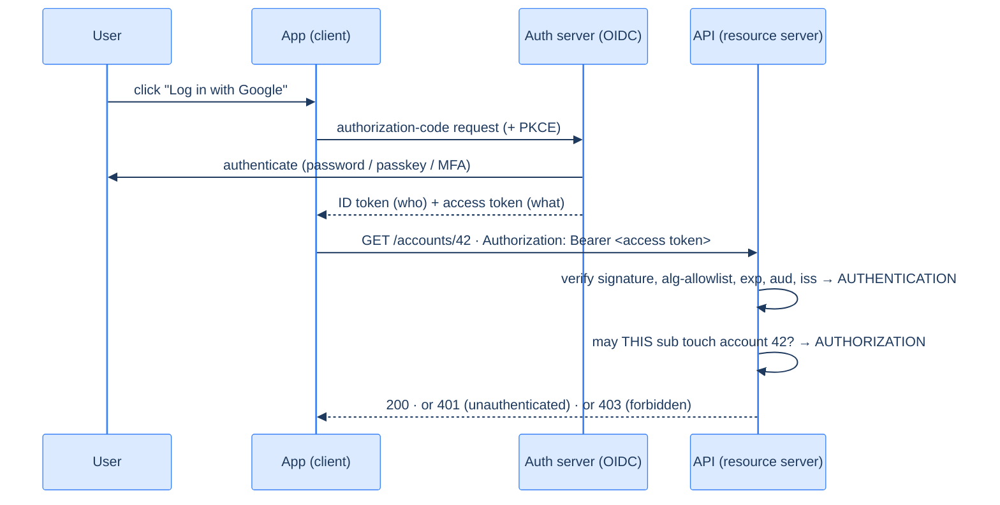

# 30. Authentication and authorization

## TL;DR
> Two different questions, constantly confused. **Authentication (authn)** = *who are you?* — proven with passwords (hashed with a slow KDF like bcrypt/argon2), then carried by a **session** (server-side, easy to revoke) or a **JWT** (stateless, hard to revoke). **Authorization (authz)** = *what may you do?* — decided by **RBAC** (roles), **ABAC** (attribute policies), or **ReBAC** (relationship graphs, à la Google Zanzibar). **OAuth 2.0** is a *delegated-authorization* framework (it is **not** authentication); **OpenID Connect (OIDC)** is the authentication layer built on top, and its **ID token is a signed JWT** that says who the user is. The token's journey: log in → the auth server issues tokens → the client sends the access token as a `Bearer` → the API **verifies** it (signature, *algorithm allowlist*, `exp`, `aud`, `iss`) then **authorizes** the specific action on the specific object. The two classic ways this becomes a breach: trusting an unverified token (the **`alg:none`** forgery) and authenticating a user but never checking they may touch *this* object (**broken access control** — OWASP's #1 risk).

## 1. Motivation

In **2015**, security researcher **Tim McLean** reviewed a pile of popular **JSON Web Token (JWT)** libraries and found a vulnerability that should make you wince: many of them could be tricked into accepting a **forged token**. The cleanest version is the **`alg:none` attack.** A JWT names, *in its own header*, the algorithm used to sign it — and the spec includes a `"none"` algorithm (for tokens whose integrity was already verified elsewhere). Several libraries, on seeing `{"alg":"none"}`, happily treated the token as having a *valid, verified signature* — so an attacker could write `{"sub":"admin","role":"admin"}`, set `alg` to `none`, attach **no signature at all**, and the server would believe it. A sibling bug, **RS256/HS256 confusion**, was just as nasty: a server expecting an RSA-signed token (verified with a *public* key) could be sent an HMAC-signed token, and the library would use the **public key as the HMAC secret** — and since public keys are, well, public, the attacker could forge a token the server accepted. The root cause is subtle and worth memorizing: *the `alg` field lives in the part of the token you haven't validated yet*, so letting the token tell you how to verify it is letting the attacker pick the lock's mechanism.

That's the **authentication** half going wrong. The **authorization** half is, if anything, worse in practice: in the **OWASP Top 10 (2021)**, **Broken Access Control climbed to #1** — the single most serious and most common web-application risk, up from 5th in 2017, found in some form in **94% of tested applications**. Broken access control is the bug where the system correctly figures out *who you are* and then forgets to check *whether you're allowed to do the thing you just asked for* — so you change `account/123` to `account/124` in the URL and read a stranger's data.

Both failures share one root misunderstanding: treating "who are you?" and "what may you do?" as one step instead of two. This lesson keeps them firmly apart, walks a token from login to a protected call, and shows exactly where each bug sneaks in.

## 2. Intuition (Analogy)

Picture a big music festival with a **wristband system**.

- At the gate, security checks your **passport** against your ticket: *are you really the person this ticket was sold to?* That's **authentication** — proving identity. It's done **once**, carefully, at the entrance.
- Having verified you, they snap on a **wristband** encoding your access level: general admission, VIP, or backstage. That wristband is a **token**. From now on you **don't show your passport again** at every tent — the bouncer at the VIP lounge just glances at your wristband. *What the wristband permits* is **authorization**.
- The wristband is **tamper-evident**: if you draw an extra stripe to fake VIP, the special ink/hologram gives it away (a **cryptographic signature** — a forged wristband is detected). It **expires** at the end of the night (**token expiry**). And here's the catch that haunts stateless tokens: if someone **steals your wristband**, it works until it expires — the lounge bouncer has no list of "revoked wristbands" to check (the **JWT revocation problem**); a venue that wants instant revocation keeps a **guest list at every door** instead (server-side **sessions**).
- "**Log in with Google**" is the festival saying: *we trust Google's gate to check passports.* Google verifies you and hands you a signed wristband vouching for your identity (an **OIDC ID token**), so the festival never sees your password.

The whole mental model: **passport at the gate = authentication; what the wristband lets you into = authorization; the signed, expiring wristband = the token.** Confusing "they have a wristband" with "they're allowed backstage" is precisely the breach in §1.

## 3. Formal definitions

**Authentication** establishes *identity*; **authorization** decides *permitted actions*. They are sequential and distinct: you authenticate first (who), then authorize each action (what). Conflating them is the source of both §1 failures.

**Carrying identity after login** — two models:

| | **Server-side session** | **JWT (stateless token)** |
|---|---|---|
| Where state lives | on the server (session store) | in the token itself (signed claims) |
| Per-request cost | a session lookup | verify a signature (no lookup) |
| Revocation | **instant** (delete the session) | **hard** — valid until `exp` |
| Scales across services | needs shared session store | self-contained, no shared store |
| Best when | instant revoke matters | stateless, multi-service, high-scale |

**OAuth 2.0** (RFC 6749, October 2012) is a **delegated authorization** framework: it lets a *client* app obtain **limited access** to a resource on a user's behalf without handling the password. Its roles: **resource owner** (the user), **client** (the app), **authorization server** (issues tokens), **resource server** (the API). Critically, the spec says authenticating the user *to the client* is **out of scope** — **OAuth is not authentication.** **OpenID Connect (OIDC)** (2014) adds exactly that missing layer on top of OAuth: an **ID token** — a *signed JWT* carrying verified identity claims (`sub`, `email`, …) — so OAuth answers "what may this app access?" and OIDC answers "who is this user?"

A **JWT** is `base64(header).base64(payload).signature`, with claims like `iss` (issuer), `sub` (subject/user), `aud` (audience), and `exp` (expiry). To trust one you must **verify the signature with the issuer's key, allowlist the algorithm, and check `exp`/`aud`/`iss`** — skipping any of these is how §1 happens.

**Authorization models:**

| Model | Decides by | Good for |
|---|---|---|
| **RBAC** (role-based) | user → roles → permissions | a small, fixed set of roles (viewer/editor/admin) |
| **ABAC** (attribute-based) | policies over attributes (user, resource, context) | fine-grained, conditional rules ("EU staff, business hours") |
| **ReBAC** (relationship-based) | a graph of relationships (Google **Zanzibar**, 2019) | sharing/inheritance ("can view because shared, folders inherit") |
| **Scopes** (OAuth) | coarse grants on a token (`read:orders`) | limiting what a *delegated app* can do |



<p align="center"><strong>The token's journey. The API does two separate checks: authentication (is this token genuine?) then authorization (may this user do this?). 401 ≠ 403.</strong></p>

## 4. Worked Example — the token's journey, and two ways it breaks

A user clicks **"Log in with Google"** and then the app calls `GET /accounts/42`.

**The happy path.** The app runs an OIDC **authorization-code flow with PKCE**: it redirects to Google, Google authenticates the user (password + passkey/MFA) and returns an **ID token** (who the user is) and an **access token** (what the app may do). The app then calls the API with `Authorization: Bearer <access token>`. The API does **two distinct things**: first **authentication** — verify the JWT's signature against the issuer's public key, confirm the algorithm is one it expects, and check `exp`, `aud`, and `iss` — and only then **authorization** — confirm that *this* user (`sub`) is allowed to read account `42`. Two checks, two questions, in order.

**Failure case 1 — the forged token (authentication).** The API "validates" the token by merely *decoding* it (`verify_signature=False`) or by trusting the token's self-declared `alg`. An attacker sends `{"sub":"victim","role":"admin"}` with `alg:none` and no signature — the §1 attack — and the API believes it, handing over admin. The damage isn't a leaked password; it's that **any identity can be forged**. The fix is non-negotiable: verify the signature with the issuer's key, **allowlist the algorithm** (so `none` and HS256-confusion are rejected), and validate `exp`/`aud`/`iss`. *A token's contents mean nothing until the signature verifies.*

**Failure case 2 — the missing object check (authorization).** Now the API does authn *correctly* — it truly knows the caller is user `99`. But the handler for `GET /accounts/{id}` just loads and returns the account, **without checking that account `42` belongs to user `99`**. So user `99` changes the URL to `/accounts/43`, `/accounts/44`, … and reads every other customer's data. This is **Insecure Direct Object Reference**, the textbook form of **Broken Access Control — OWASP's #1 risk**. Authentication worked perfectly and the system was *still* breached, because **knowing who you are is not the same as checking what you may touch.** The fix: every object access is authorized against the authenticated principal — ownership or role — server-side, every time. These two failures are the same lesson from opposite sides: never skip the authn check, and never *stop* at the authn check.

## 5. Build It

Here is the authentication-vs-authorization split in Python — the wrong way, the right way, and the object check that defeats §4's IDOR:

```python
import jwt  # PyJWT

ISSUER_PUBLIC_KEY = load_jwks_key()   # the auth server's public key (fetched/rotated via JWKS)

# WRONG — decodes without verifying; trusts whatever the token claims. This is the alg:none breach.
def whoami_unsafe(token):
    claims = jwt.decode(token, options={"verify_signature": False})   # 🚨 forgeable
    return claims["sub"]              # attacker sets sub/role to anything they like

# RIGHT — verify signature with the issuer's key, ALLOWLIST the algorithm, check exp/aud/iss.
def authenticate(token):
    return jwt.decode(
        token, ISSUER_PUBLIC_KEY,
        algorithms=["RS256"],                       # allowlist — never trust the token's own "alg"
        audience="https://api.example.com",         # this token must be meant for US
        issuer="https://accounts.example.com",      # ...and minted by who we trust
        options={"require": ["exp", "iss", "aud", "sub"]},
    )   # raises on bad signature / alg:none / HS256-confusion / expired / wrong audience

# AUTHORIZATION is a SEPARATE step. Knowing who you are ≠ being allowed to touch THIS object.
def get_account(claims, account_id):
    account = db.load_account(account_id)
    is_owner = account.owner_id == claims["sub"]
    is_admin = "admin" in claims.get("roles", [])
    if not (is_owner or is_admin):
        raise Forbidden(403)          # the IDOR fix — check this principal may access THIS object
    return account
```

The single most important line is `algorithms=["RS256"]`: it makes the *server* decide the algorithm, not the attacker-controlled header, which kills both `alg:none` and the RS256→HS256 confusion in one stroke (this is now codified as JWT best practice in RFC 8725). The `audience`/`issuer` checks stop a token minted for *another* service from being replayed at yours. And `get_account` is the whole authorization lesson in five lines: it runs *after* `authenticate`, and it asks the *second* question — may **this** principal touch **this** object — which §4's breach skipped entirely. Authn and authz are different functions for a reason.

## 6. Trade-offs

| Decision | Option A | Option B | Choose by |
|---|---|---|---|
| Carry identity | server-side **session** (revocable, lookup/req) | **JWT** (stateless, hard to revoke) | need instant revoke → session; multi-service/scale → JWT |
| JWT lifetime | long-lived (fewer logins) | **short access + refresh token** | short access tokens limit a stolen token's blast radius |
| Authz model | **RBAC** (simple, coarse) | ABAC/ReBAC (fine-grained, complex) | few fixed roles → RBAC; sharing/inheritance → ReBAC |
| Token storage (browser) | `localStorage` (XSS-exposed) | **HttpOnly+Secure+SameSite cookie** | cookies resist XSS theft; add CSRF defense |
| Password proof | password + MFA | **passkeys / WebAuthn** (phishing-resistant) | passkeys remove the phishable shared secret |

The big one is **session vs JWT**, and it's a genuine trade, not a fashion: a **JWT** needs no per-request database lookup and travels self-contained across many services — perfect for a large, stateless, multi-service backend — but you **cannot instantly revoke** it; a compromised token is valid until it expires. A **server-side session** costs a lookup per request but can be **killed instantly** by deleting it. The common compromise is **short-lived access tokens** (minutes) plus a **refresh token**: the access token's short life bounds the damage of theft, while the refresh token (revocable, stored server-side) avoids making the user log in constantly. For authorization, **start with RBAC** — most apps have a handful of roles and RBAC is dead simple — and reach for **ReBAC** (Zanzibar-style) only when permissions are genuinely relationship-shaped (sharing, folder inheritance), because that machinery is real complexity. Across all of it: **least privilege** — narrow scopes, minimal roles, short lifetimes.

## 7. Edge cases and failure modes

- **Confusing authn with authz (OWASP #1).** Authenticating a user but not authorizing the specific action/object is **Broken Access Control** — the most common serious web vuln. Check "may *this* principal do *this* to *this* object," server-side, on **every** request, including object IDs in URLs (the IDOR in §4).
- **Trusting the token's algorithm / skipping verification.** `alg:none`, RS256→HS256 confusion, or `verify_signature=False` all yield forged tokens (§1). **Allowlist algorithms**, verify with the correct key, and check `exp`/`aud`/`iss`. The `aud` check matters: a token minted for service X must not be accepted by service Y.
- **JWT revocation is genuinely hard.** A stateless JWT lives until `exp`; you can't easily kill a stolen one. Use **short access-token lifetimes + refresh tokens**, keep a **denylist** for emergencies, or use server-side sessions where instant revoke is a hard requirement (e.g. "log out everywhere").
- **Insecure token storage (XSS/CSRF).** A JWT in `localStorage` is stolen by any XSS; a cookie without `SameSite` is open to CSRF. Prefer **HttpOnly + Secure + SameSite** cookies for session tokens, add CSRF protection, and **never log tokens** (they're bearer credentials — whoever holds one *is* you).
- **Weak password storage / no rate limiting.** Plaintext or fast hashes (MD5/SHA-1) are cracked instantly on breach. Use a **slow, salted KDF** (bcrypt/scrypt/argon2), rate-limit and lock out login attempts ([Lesson 20](/cortex/system-design/distributed-patterns-rate-limiting)), and offer MFA/passkeys.
- **Using OAuth as authentication.** A bare OAuth **access token** says nothing about *who* the user is (or whether a user was even present) — using it as proof of identity invites confused-deputy and token-substitution attacks. For "who is this user," use **OIDC's ID token**, validated as a JWT, not a raw access token.

## 8. Practice

> **Exercise 1 — 401 vs 403, authn vs authz.**
> (a) A request arrives with an expired token. (b) A request arrives with a valid token, but the user lacks permission for `/admin/users` — yet the endpoint returns the data anyway. For each, give the *correct* status code and say which concept (authentication or authorization) is involved. What is bug (b) called, and why is it dangerous even though authentication worked?
>
> <details>
> <summary>Solution</summary>
>
> **(a)** Expired/invalid/missing credentials → **401 Unauthorized** — a historical misnomer that actually means *unauthenticated* ("we don't know/trust who you are"). This is an **authentication** outcome. **(b)** A valid token but insufficient permission *should* return **403 Forbidden** — authenticated, but **not authorized**. The fact that it returned the data instead is **Broken Access Control** (specifically a missing authorization check), **OWASP's #1 risk**. It's dangerous *precisely because* authentication worked perfectly: the system correctly identified the user and then failed to ask the second question — *may this user access `/admin/users`?* Authn (401) and authz (403) are different gates; passing the first never implies passing the second.
>
> </details>

> **Exercise 2 — Why is this JWT check exploitable?**
> A service does: `claims = jwt.decode(token, options={"verify_signature": False})` then `if claims["role"] == "admin": grant()`. Name the vulnerability class, describe a forged token, and give the one-line fix.
>
> <details>
> <summary>Solution</summary>
>
> The code **decodes without verifying the signature**, so it trusts attacker-controlled data. An attacker base64-encodes a header `{"alg":"none"}` and a payload `{"role":"admin"}`, attaches an empty signature, and the server grants admin — the **`alg:none` / unsigned-token forgery** (Tim McLean, 2015); the related **RS256→HS256 confusion** abuses a server that trusts the token's `alg`. **Fix:** verify properly — `jwt.decode(token, ISSUER_PUBLIC_KEY, algorithms=["RS256"], audience=..., issuer=...)` — which verifies the signature with the issuer's key, **allowlists the algorithm** (rejecting `none` and HMAC-confusion), and validates `exp`/`aud`/`iss`. The principle: **a token's claims are meaningless until its signature verifies**, and the server — not the token — must choose the algorithm (now codified in RFC 8725).
>
> </details>

> **Exercise 3 — Pick the authorization model + revocation strategy.**
> (a) an internal tool with three fixed roles (viewer/editor/admin); (b) a Google-Docs-style app where users share specific documents with specific people and folders inherit permissions; (c) a requirement to **instantly** revoke a compromised user across all services ("log out everywhere, now").
>
> <details>
> <summary>Solution</summary>
>
> **(a) RBAC.** Three fixed roles mapping to permissions is exactly role-based access control — simple, auditable, sufficient; don't over-engineer it. **(b) ReBAC** (relationship-based, à la Google **Zanzibar**, 2019). "X can view doc Y *because* it was shared with them, and folders *inherit*" is a relationship graph, which RBAC/ABAC express awkwardly; Zanzibar-derived systems (SpiceDB, OpenFGA) are purpose-built for sharing + inheritance at scale. **(c) Server-side sessions, or short-TTL tokens + a revocation list.** A long-lived **stateless JWT can't be instantly revoked** (it's valid until `exp`), so for an instant kill-switch use server-side sessions (delete them) or short access tokens + a denylist + refresh-token revocation. Match the model to the *shape* of the permissions, and the token strategy to your revocation needs.
>
> </details>

## In the Wild

- **[OWASP — A01:2021 Broken Access Control](https://owasp.org/Top10/2021/A01_2021-Broken_Access_Control/)** — the data behind §1: authorization failures are the #1 web risk (up from 5th in 2017), found in 94% of tested apps. The canonical catalogue of how authz breaks (IDOR, missing function-level checks) and how to prevent it.
- **[Auth0 — "Critical vulnerabilities in JSON Web Token libraries"](https://auth0.com/blog/critical-vulnerabilities-in-json-web-token-libraries/)** (Tim McLean, 2015) — the `alg:none` and RS256/HS256-confusion attacks, with the root cause (the algorithm lives in the unvalidated header) and the allowlist fix.
- **[RFC 6749 — The OAuth 2.0 Authorization Framework](https://www.rfc-editor.org/rfc/rfc6749)** (2012) — the delegation framework itself, and the line everyone forgets: authenticating the user *to the client* is explicitly **out of scope**. OAuth ≠ authentication.
- **[OpenID Connect Core](https://openid.net/specs/openid-connect-core-1_0.html)** (2014) — the authentication layer on OAuth: the ID token (a signed JWT) that actually answers "who is this user?", plus the flows ("Log in with Google") you'll implement.
- **[Google — Zanzibar: Google's Consistent, Global Authorization System](https://research.google/pubs/pub48190/)** (USENIX ATC 2019) — ReBAC at planetary scale (10M+ checks/sec over trillions of relation tuples) and the model behind SpiceDB and OpenFGA. Read it when RBAC stops fitting.

---

> **Next:** [31. Multi-tenancy](/cortex/system-design/application-architecture-multi-tenancy) — authorization decides what *a user* may do; multi-tenancy is the harder, structural version of the same worry: when many *organizations* share one system, how do you guarantee Tenant A can never see Tenant B's data — by accident or by attack? Next we cover the isolation models (shared schema with a tenant ID, schema-per-tenant, database-per-tenant), the noisy-neighbour problem, and the single forgotten `WHERE tenant_id = ?` that becomes a catastrophic cross-tenant leak.
