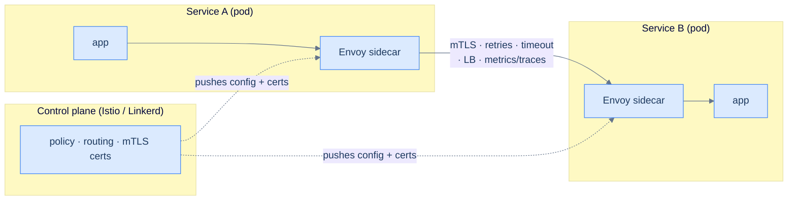

# 34. Service discovery and service mesh

## TL;DR
> In a dynamic fleet, a service's instances are **ephemeral** — they scale up, crash, and get rescheduled to new IPs constantly — so callers can't hardcode addresses. **Service discovery** solves *where*: a registry maps a stable **name** to the current set of **healthy** instances, and either the client looks them up (**client-side**, e.g. Netflix Eureka) or a load balancer does (**server-side**, e.g. a Kubernetes Service via CoreDNS + kube-proxy, with readiness probes gating who gets traffic). A **service mesh** goes further: it puts a **sidecar proxy** (Envoy) next to every service and moves all the cross-cutting networking — **mTLS, retries, timeouts, circuit breaking, load balancing, traffic shifting, and uniform observability** — out of your code and into that proxy, configured centrally by a **control plane** (Istio, Linkerd). The price is real: every call traverses two extra proxies (~**1–5 ms/hop**) and each sidecar reserves CPU/RAM **per pod**. So a mesh is *overkill for a few services* and *earns its keep* for a large polyglot fleet that needs uniform security and observability — which is exactly why Lyft built Envoy.

## 1. Motivation

By **2016**, Lyft had a problem that every company hitting microservice scale eventually hits. Their fleet was **polyglot** — services in PHP, Python, with Go and Java on the way, and Node on the front-end — and every one of those languages had its *own*, *different*, *inconsistent* libraries for the boring-but-critical parts of talking over a network: finding instances, retrying, timing out, load-balancing, and emitting metrics. When something went wrong in that web of services, it was nearly impossible to see *where*, because every service reported (or didn't report) differently. As Lyft engineer **Matt Klein** put it, "the majority of operational problems that arise when moving to a distributed architecture are ultimately grounded in two areas: **networking and observability**."

Their answer, open-sourced on **14 September 2016**, was **Envoy**: a high-performance proxy written in C++ that runs as a **sidecar** — a separate process deployed right next to each service — and handles *all* of that networking, identically, regardless of what language the service is written in. By mid-2016 Envoy was carrying *all* of Lyft's edge and service-to-service traffic, a mesh of **over a hundred services moving millions of requests per second**, and suddenly the network was **observable** and **consistent**: one place to configure retries, one uniform set of metrics, one source of truth for who's talking to whom. The next year, **Google, IBM, and Lyft launched Istio (24 May 2017)**, using Envoy as its data plane, and the pattern got a name that Buoyant had coined for its Linkerd project in 2016: the **service mesh**.

The instinct this lesson tempers is "microservices → obviously I need a service mesh." The truth, echoing the stub: a mesh is **overkill most of the time** and **earns its keep a few specific times**. But *service discovery* — the more fundamental problem of finding a healthy instance in a churning fleet — you need the moment you have more than one instance. Let's separate them.

## 2. Intuition (Analogy)

Picture a large office where people change desks and phone extensions constantly.

**Service discovery is the company phone directory.** You know you need to reach "Sales," but you don't know today's extension for whoever's on the Sales desk — people move, go home sick, get hired. So instead of memorizing a number (a hardcoded IP), you look up the *name* in a directory that's kept current: it lists who's reachable right now and quietly drops anyone whose line is dead (a failed **health check**). Either you (the caller) consult the directory yourself and dial — **client-side discovery** — or you dial a central switchboard that looks it up and connects you — **server-side discovery**.

**A service mesh is giving every employee a personal assistant who handles all their calls.** The employee just says "get me Sales"; the **assistant (the sidecar proxy)** consults the directory, dials a healthy person, redials if the line's busy (**retries with a timeout**), refuses to keep calling someone who's clearly drowning (**circuit breaking**), insists on an encrypted line (**mTLS**), and logs every call for the manager (**observability**). Crucially, *every* employee gets the *same* assistant with the *same* rules — the PHP employee and the Go employee both get identical, competent call-handling, because the skill lives in the assistant, not the employee. An **office manager (the control plane)** briefs all the assistants on the current policy ("encrypt everything, retry twice, route 5% of calls to the new hire"). The cost is obvious once you see it: you're now **paying for an assistant for every single employee** (a proxy per pod — CPU, memory) and every call takes **a beat longer** because it goes through two assistants (the latency tax). Whether that's worth it depends entirely on how many employees you have and how badly you need uniform, secure, observable calls.

## 3. Formal definitions

**Service discovery** is the mechanism by which a caller finds a healthy network address for a named service whose instances change over time. Its pieces:

| Concept | Role |
|---|---|
| **Service registry** | the source of truth mapping `name → {healthy instance addresses}` (Consul, etcd, Eureka, or the Kubernetes API) |
| **Registration** | how instances get into the registry (self-registration + heartbeats, or the platform registering them) |
| **Health checking** | removing dead/unready instances so callers don't route to a black hole |
| **Client-side discovery** | the *client* queries the registry and picks an instance itself (Netflix **Eureka** + a client library) — no extra hop, but every language needs the library |
| **Server-side discovery** | the client hits a stable endpoint (a load balancer / virtual IP) that does the lookup (a **Kubernetes Service**, AWS ELB) — language-agnostic, one extra hop |

In **Kubernetes** (the dominant case), discovery is server-side and built in: every `ClusterIP` **Service** gets a DNS name resolved by **CoreDNS** to a stable virtual IP; **kube-proxy** programs iptables/IPVS rules that route that virtual IP to a healthy backend pod from the Service's **Endpoints** list; and **readiness probes** decide membership in that list — a pod that fails readiness is pulled from Endpoints and stops receiving traffic until it recovers. Callers just use the name `orders`; the churn of pods underneath is invisible.

A **service mesh** is a dedicated infrastructure layer for service-to-service communication, split into two planes:

| Plane | What it is | Examples |
|---|---|---|
| **Data plane** | the **sidecar proxies** (one per service instance) that intercept every inbound/outbound call | Envoy, linkerd2-proxy |
| **Control plane** | the brain that configures all proxies — policy, routing rules, identity/certs | Istio, Linkerd, Consul Connect |

The mesh moves cross-cutting concerns out of application code into the proxy: **mutual TLS** (encrypted, authenticated service identity), **retries + timeouts**, **circuit breaking** ([Lesson 23](/cortex/system-design/distributed-patterns/circuit-breakers-and-bulkheads)), **load balancing**, **traffic shifting** (canary/blue-green), and **uniform observability** (the same golden-signal metrics + distributed traces for every service, for free). The newest twist is **sidecarless ("ambient") mesh** (Istio, 2022), which moves proxying off the per-pod path to cut the resource tax — savings that "can exceed 90%" in some cases.



<p align="center"><strong>Data plane vs control plane: A's call to B goes app → sidecar → (mesh features) → sidecar → app; the control plane configures every sidecar centrally, no app-code changes.</strong></p>

## 4. Worked Example — finding `orders`, and the retry storm that kills it

A `web` service calls `orders`, which calls `payments`. Each runs **50 ephemeral pods** that autoscale and get rescheduled constantly.

**Discovery.** `web` never hardcodes an IP. It calls the name `orders`, which CoreDNS resolves to the `orders` Service's ClusterIP; kube-proxy routes that to one of the *currently healthy* `orders` pods (readiness-gated). When an `orders` pod crashes or a deploy rolls, readiness probes pull it from the Endpoints list within seconds and traffic flows only to live pods — no code change, no caller awareness. That's the baseline you get from a plain Kubernetes Service, *no mesh required*.

**Adding a mesh.** Now you want every hop encrypted, retried-on-blip, circuit-broken, and traced — uniformly, across all three services, without editing their code. The mesh's sidecars do it: `web`'s Envoy mTLS-dials a healthy `orders` sidecar, retries a failed attempt within a deadline, ejects an `orders` pod that keeps throwing 5xx ([Lesson 23](/cortex/system-design/distributed-patterns/circuit-breakers-and-bulkheads)), and emits identical metrics for every call. Your application code still just says "call `orders`."

**The failure case — retry amplification.** Here's how the mesh meant to *add* resilience can *cause* an outage. Suppose every sidecar is configured to retry **2 extra times** (3 attempts) on failure. Now `payments` gets slow. `orders`'s sidecar retries it 3×; but `web`'s sidecar is *also* retrying its call to `orders` 3×; so a single user request becomes **3 × 3 = 9** calls to `payments`, and across a deeper chain it's `attempts^depth` — a 3-attempt policy over 3 hops is **3³ = 27×** load slammed onto the already-struggling service ([Lesson 19](/cortex/system-design/distributed-patterns/idempotency-retries-backoff)'s retry storm, *multiplied by depth*). The thing designed to handle a blip turns a small wobble into a self-inflicted DDoS that takes `payments` fully down, and the cascade climbs. The fixes are all mesh features you must *deliberately* turn on: **retry budgets** (cap retries to e.g. ≤10–20% of traffic so they can't multiply unboundedly), **deadline/timeout propagation** (don't retry a request that's already out of time), and **circuit breaking / outlier detection** (eject the failing pod so callers fail fast instead of hammering it). A mesh hands you powerful knobs; turned blindly, they're a footgun.

Two more realities. **Latency tax:** each hop now traverses two extra proxies at roughly **1–5 ms each**, so a 3-service chain adds several ms of pure proxy overhead. **The control plane must fail static:** if it goes down, good meshes keep routing on each sidecar's last-known-good config rather than going dark — verify yours does, and treat control-plane config pushes like deploys.

## 5. Build It

For discovery and mesh, the real artifact is **declarative config**, not code. First, a Kubernetes Service — server-side discovery over a churning set of pods:

```yaml
# DISCOVERY: a stable name + virtual IP over an ever-changing set of pods.
apiVersion: v1
kind: Service
metadata: { name: orders }
spec:
  selector: { app: orders }          # tracks the live pods labelled app=orders...
  ports: [{ port: 80, targetPort: 8080 }]
# Callers use the DNS name "orders" (orders.<ns>.svc.cluster.local); CoreDNS resolves it to the
# ClusterIP, kube-proxy load-balances to a READY pod, and readiness probes evict unhealthy pods
# from the Endpoints list. No hardcoded IPs, no caller changes when pods come and go.
```

Then the mesh policy that the §4 story needs — retries, a timeout, and circuit breaking, as config rather than code in every service (Istio shown; note the retry caps that prevent the storm):

```yaml
# MESH: resilience as policy. The sidecars enforce this; your app code is untouched.
apiVersion: networking.istio.io/v1
kind: VirtualService
metadata: { name: orders }
spec:
  hosts: [orders]
  http:
    - timeout: 2s                    # hard deadline for the whole call
      retries:
        attempts: 2                  # at most 2 retries (3 total) — and pair with a retry BUDGET
        perTryTimeout: 800ms
        retryOn: 5xx,reset,connect-failure
      route: [{ destination: { host: orders } }]
---
apiVersion: networking.istio.io/v1
kind: DestinationRule
metadata: { name: orders }
spec:
  host: orders
  trafficPolicy:
    outlierDetection:                # CIRCUIT BREAKING: eject a pod that keeps failing...
      consecutive5xxErrors: 5        # ...after 5 consecutive 5xx,
      interval: 10s
      baseEjectionTime: 30s          # ...for 30s, so callers fail fast instead of retrying into it
```

The Service gives you discovery for free; the `VirtualService`/`DestinationRule` give you retries, timeouts, and circuit breaking *declaratively* — change the retry policy for all of `orders`'s callers in one place, no redeploy, no per-language library. But notice §4's lesson sitting right there: `attempts: 2` at every hop is exactly what multiplies into a storm, which is why real configs also set a retry budget and lean on the `outlierDetection` circuit breaker to stop the bleeding.

## 6. Trade-offs

| Dimension | Library per service (no mesh) | Service mesh (sidecars) |
|---|---|---|
| Cross-cutting logic (retries, mTLS, LB) | reimplemented per language/service | written once, in the proxy |
| Polyglot fleets | each language needs its own library | language-agnostic |
| Change a retry/timeout policy | redeploy every service | edit control-plane config |
| Latency added | none | **~1–5 ms per hop** (2 proxies) |
| Resource cost | none | a sidecar per pod (~0.2 vCPU, ~60 MB at 1k rps in Istio 1.24) |
| Observability | DIY, inconsistent | uniform golden signals + traces, free |
| mTLS / zero-trust | DIY, often skipped | automatic, cluster-wide |
| Operational complexity | low | **high** (run a control plane, debug sidecars) |

The decision rule matches the stub: **a mesh is overkill most of the time.** With a handful of services in one or two languages, plain **service discovery** (a Kubernetes Service + CoreDNS) plus a decent resilience library (or sensible client timeouts/retries) gives you 90% of the value at near-zero cost; a control plane and a proxy-per-pod are pure overhead. The mesh **earns its keep** when you have a **large, polyglot fleet** where the cross-cutting needs are themselves the hard problem: you must have **mTLS everywhere** (compliance/zero-trust), **uniform tracing across dozens of services** to debug at all, and **fine-grained traffic shifting** for safe canaries — reimplementing all that consistently across five languages is exactly the tax Lyft refused to keep paying. And the cost is now negotiable: **ambient/sidecarless** modes cut the per-pod overhead substantially. Rule of thumb: start with discovery, add a resilience library, and adopt a mesh only when "every service reimplementing secure, observable networking" has become your actual bottleneck.

## 7. Edge cases and failure modes

- **Retry amplification (the storm).** Per-hop retries multiply as `attempts^depth` — a 3-attempt policy over 3 hops is 27× load on a struggling leaf, turning a blip into a cascade (Lessons [19](/cortex/system-design/distributed-patterns/idempotency-retries-backoff) & [23](/cortex/system-design/distributed-patterns/circuit-breakers-and-bulkheads)). Always pair retries with **retry budgets**, **deadline propagation**, and **circuit breaking**; never enable blind retries at every layer.
- **Stale registry / slow eviction.** If health checks are too lax or the registry is slow to drop a dead instance, callers keep routing into a black hole. Tune health-check intervals; use **readiness** (gates traffic) distinctly from **liveness** (restarts the pod) — confusing them either sheds healthy traffic or keeps sending to dead pods.
- **The control plane as a risk.** A control-plane outage or a bad config push can misroute the whole mesh. Good meshes **fail static** (sidecars keep last-known-good config and keep serving); confirm yours does, and gate config changes like code deploys.
- **The sidecar tax at scale.** Two extra proxy hops (~1–5 ms) and a CPU/RAM reservation **per pod** add up across thousands of pods — and mis-sized sidecar resource requests cause OOM-kills (too low) or massive over-provisioning (too high). Right-size them, or adopt ambient mode to move proxying off the per-pod path.
- **mTLS / certificate rotation.** The mesh issues short-lived identities; if rotation breaks or clocks skew badly, services can't authenticate each other and calls **fail closed** — a mesh-wide outage from an expired cert. Identity is now critical infrastructure; monitor cert health.
- **The mesh hides the network — until it doesn't.** Developers stop thinking about the network because the sidecar "handles it," then a cross-service timeout or a routing rule surprises them. A mesh **adds** moving parts to debug (now you trace through two proxies); it doesn't remove the network, it abstracts it.

## 8. Practice

> **Exercise 1 — Retry amplification math.**
> A mesh retries each call up to 2 extra times (3 attempts total) on failure. A user request flows `web → orders → payments → ledger` (3 inter-service hops). If `ledger` starts failing, how many times does it get hit per user request in the worst case, and which mesh features prevent the resulting storm?
>
> <details>
> <summary>Solution</summary>
>
> Each hop independently multiplies attempts: `3 × 3 × 3 = 3³ = 27` calls to `ledger` per single user request, worst case (the deepest service sees `attempts^depth`). A struggling service suddenly absorbing **27×** its real load collapses — and the failures propagate back up as *more* retries. Three features stop it: **retry budgets** (cap total retries to a small fraction of traffic, e.g. ≤10–20%, so they can't multiply without bound), **deadline propagation** (a request already past its overall timeout isn't retried at deeper layers), and **circuit breaking / outlier detection** ([Lesson 23](/cortex/system-design/distributed-patterns/circuit-breakers-and-bulkheads): eject the failing `ledger` so callers fail fast instead of retrying into a fire). Blind per-hop retries are [Lesson 19](/cortex/system-design/distributed-patterns/idempotency-retries-backoff)'s retry storm, amplified by depth — the mesh gives you the rope; budgets and breakers keep you from hanging yourself.
>
> </details>

> **Exercise 2 — Client-side vs server-side, and what Kubernetes does.**
> Contrast client-side and server-side service discovery (one advantage and one cost each). Which does a vanilla Kubernetes `Service` use, and which components resolve the name and route the request?
>
> <details>
> <summary>Solution</summary>
>
> **Client-side** (e.g. Netflix **Eureka** + a client library like Ribbon): the caller queries the registry, caches the instance list, and picks/load-balances itself. *Advantage:* no extra network hop, and the client can do smart load balancing. *Cost:* every language/framework must implement the discovery + LB logic (a burden in polyglot shops). **Server-side** (a Kubernetes Service, AWS ELB): the caller hits a stable endpoint that does the lookup and routing. *Advantage:* dumb, language-agnostic clients. *Cost:* one extra hop through the load balancer. A vanilla **Kubernetes `Service` is server-side**: **CoreDNS** resolves the Service name to its stable **ClusterIP**, and **kube-proxy** (iptables/IPVS) routes that ClusterIP to a healthy backend pod from the **Endpoints** list, which **readiness probes** keep current. The caller just uses the name; the pod churn underneath is invisible.
>
> </details>

> **Exercise 3 — Do you need a mesh?**
> Decide for each: (a) 3 services, one language, one team; (b) 80 services across Go/Java/Python/Node needing cluster-wide mTLS, per-service canary traffic shifting, and uniform tracing; (c) you need discovery but cannot afford a CPU/RAM proxy on every pod.
>
> <details>
> <summary>Solution</summary>
>
> **(a) No mesh.** Three services in one language are well served by a Kubernetes Service for discovery plus a resilience library (or just sensible client timeouts/retries). A control plane + sidecars are pure overhead here — the classic "overkill most of the time." **(b) Yes, a mesh.** Eighty *polyglot* services needing uniform **mTLS**, **canary traffic shifting**, and **consistent tracing** is the textbook case where the mesh earns its keep: reimplementing all of that identically across four languages is exactly the tax Lyft built Envoy to avoid, and at this scale the per-pod cost is justified. **(c) Discovery without a full mesh** — use Kubernetes Services + CoreDNS (or Consul) for discovery, and if you later want mesh features, adopt an **ambient/sidecarless** mode that moves proxying off the per-pod path (savings can exceed 90%). The mesh is a scale-and-polyglot play, not a default.
>
> </details>

## Your Turn

Before you move on, check your understanding with the coach — explain the idea, apply it, weigh the trade-offs, then defend your reasoning.

<div class="concept-coach"></div>

## In the Wild

- **[Matt Klein / Lyft — announcing Envoy](https://eng.lyft.com/envoy-7-months-later-41986c2fd443)** (2016) — the §1 origin story: a polyglot fleet drowning in inconsistent per-language networking, and the out-of-process sidecar that made the network uniform and observable. The "why service meshes exist" primary source.
- **[Istio — Introducing Istio](https://istio.io/v0.1/blog/istio-service-mesh-for-microservices)** (Google/IBM/Lyft, May 2017) — the control-plane + Envoy-data-plane architecture that turned the sidecar pattern into a product, "without requiring any changes to application code."
- **[Kubernetes — Service & DNS](https://kubernetes.io/docs/concepts/services-networking/service/)** — server-side discovery built into the platform: ClusterIP, CoreDNS resolution, kube-proxy routing, and readiness-gated Endpoints. The discovery you should reach for *before* a mesh.
- **[Istio — Introducing Ambient Mesh](https://istio.io/latest/blog/2022/introducing-ambient-mesh/)** (2022) — the sidecarless data plane built to slash the per-pod resource tax (the §6 cost), while keeping mTLS, telemetry, and traffic management.
- **[Linkerd / Buoyant](https://linkerd.io/)** — the project that coined the term "service mesh" (2016) and the lightweight, Rust-micro-proxy alternative to Istio; a good contrast on the simplicity-vs-features axis.

---

> **Next:** [35. Authentication and authorization](/cortex/system-design/application-architecture/authn-authz) — the mesh can encrypt and verify that service A is *really* service A (mTLS), but that's machine identity. What about **users**? Next we separate **authentication** (who are you — passwords, OAuth, OIDC, JWTs, sessions) from **authorization** (what may you do — RBAC, ABAC, scopes), and walk the token's journey from login to a protected API call, including the mistakes that turn an auth system into a breach.
