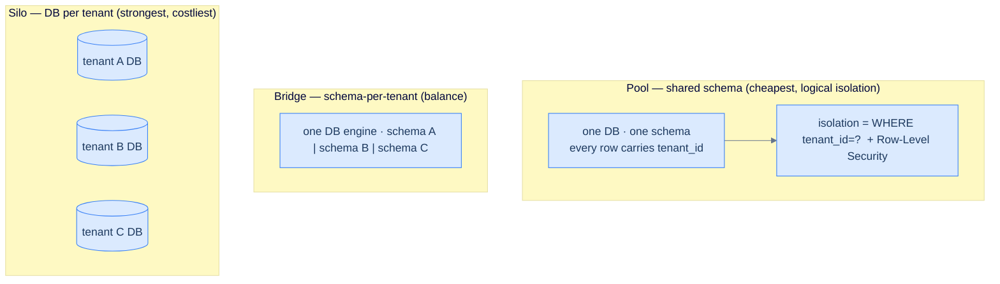
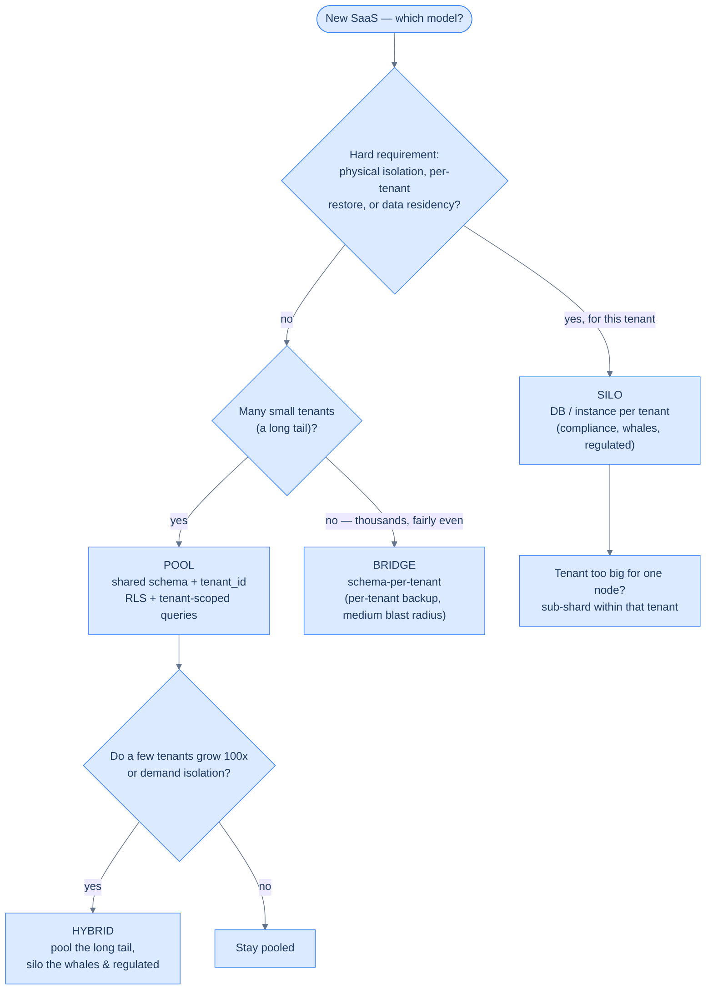
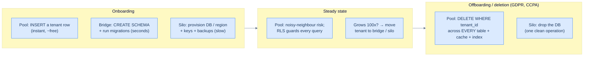

# 36. Multi-tenancy

## TL;DR
> Multi-tenancy is one system serving many **tenants** (customer organizations) at once, and its defining requirement is **isolation**: Tenant A must *never* see Tenant B's data — not by a bug, not by an attack. There's a spectrum of how you isolate: **pool** (shared everything, a `tenant_id` column on every row — cheapest and densest, but isolation is purely *logical* and one forgotten filter leaks everyone), **silo** (a database or instance per tenant — strongest isolation, highest cost, doesn't scale to a million tenants), and **bridge** (a mix, e.g. schema-per-tenant or siloing only your biggest tenants). The two failure modes that define the field: the **missing `WHERE tenant_id = ?`** (and its cousin, a **cache key without the tenant** — exactly what leaked 34,000 Steam users' data in 2015) cause **cross-tenant leaks**; and the **noisy neighbour**, where one tenant's load degrades everyone in a pool. Defenses: enforce the tenant filter in the *database* (Postgres **Row-Level Security**), scope *every* subsystem (cache, logs, jobs, search) by tenant, and rate-limit/quota per tenant. "Just put a `tenant_id` on every row" is the easy start that bites you in year three.

## 1. Motivation

On **Christmas Day, 2015**, Steam users who logged in to buy a game saw something horrifying: *someone else's account page.* Between **11:50 and 13:20 PST**, around **34,000 users'** store pages — showing billing addresses, purchase history, the last two digits of a credit card, the last four of a phone number, and email addresses — were served to *the wrong people*. Nobody was "hacked." As Valve explained in its postmortem, a configuration change (deployed to cope with a denial-of-service attack) **"incorrectly cached web traffic for authenticated users"** — the caching layer stored a page generated *for* one logged-in user and then handed that cached page *to* the next user who asked. The cache key didn't account for **who the page belonged to**.

That is the entire subject of this lesson, in miniature. Steam is "multi-user," but a multi-tenant SaaS is the same problem with higher stakes: many *organizations* sharing one system, where leaking Tenant A's invoices to Tenant B isn't an embarrassing Christmas — it's a contract-ending, regulator-attracting catastrophe. And the leak almost never comes from a dramatic exploit. It comes from exactly the Steam failure: a piece of the system that forgot to ask *"whose data is this?"* — a cache keyed without the tenant, a query missing its `WHERE tenant_id = ?`, a background job that processed "all records" across the tenant boundary.

The instinct this lesson sharpens is the stub's warning: *"just put a `tenant_id` on every row"* feels like the whole answer, and it's a fine **start** — but it makes correct isolation depend on every developer, in every query, in every subsystem, forever remembering one clause. That's a bet you will eventually lose. The job is to make isolation **structural**, not a discipline you hope holds.

## 2. Intuition (Analogy)

The word is literal: tenants share a building. How you divide it is the whole design.

- **Pool (shared schema) is a co-living house.** Everyone shares one big space, and your belongings are just *labelled with your name* (a `tenant_id` on every row). It's cheap and dense — one roof, one kitchen, one bill. But isolation is only as good as the labels: if a housemate grabs an **unlabelled box** (a query that forgot its tenant filter), they walk off with your things. And one **loud roommate throwing a party** (a heavy tenant) keeps everyone else awake — the *noisy neighbour*.
- **Silo (database per tenant) is everyone having their own house.** Total isolation — your walls, your locks, your plumbing. Nobody can wander into your kitchen, and if your house floods (a bad migration, a restore) it doesn't touch anyone else's. But you can't build and maintain a **million houses**: every house needs its own upkeep (backups, migrations, monitoring ×N).
- **Bridge (schema-per-tenant, or siloing your big tenants) is an apartment building with private units.** Separate, locked units (schemas) under one shared roof and plumbing (one database engine) — a middle ground; or you keep most people in the co-living house and give your **one giant, demanding tenant their own house** so their parties don't wake the others.

And the **security guard who checks the label on every box for you** — so even if a housemate *forgets* to check, the guard won't hand them someone else's belongings — is **Row-Level Security**: the database itself enforces the tenant filter, turning "everyone must remember" into "the system won't let you forget." Co-living, private houses, apartments with a guard — that's the design space.

## 3. Formal definitions

**Multi-tenancy** is a single system instance serving many **tenants** (isolated customer organizations) such that each tenant experiences the system as if it were theirs alone — with guaranteed **data isolation** and acceptable **performance isolation**. The canonical example is an **email-marketing service**: each business that signs up is a tenant, and one business's newsletter sign-ups and delivery data are completely separate from another's — many *users* may log in under one tenant, but the *datasets* never mix. Note the distinction multi-tenancy adds over plain multi-user: a tenant is an **organization**, not a person, so the boundary you must defend is the *company* boundary, and a leak crosses a contract.

The models sit on an isolation-vs-cost spectrum (AWS's pool/silo/bridge terminology):

| Model | How | Isolation | Cost / density | Blast radius of a bug | Scales to | Per-tenant ops (backup, residency) |
|---|---|---|---|---|---|---|
| **Pool** (shared schema) | one DB, one schema, **`tenant_id` on every row** | logical only | cheapest, densest | **all tenants** | millions | hard (one shared dataset) |
| **Bridge** (schema-per-tenant) | one DB, a schema per tenant | medium | medium | one schema | thousands | medium |
| **Silo** (DB/instance per tenant) | separate DB/instance per tenant | strongest | most expensive | one tenant | hundreds–low thousands | easy (per-tenant DB) |

In the **pool** model, isolation is *logical*: there is nothing physical stopping a query from reading another tenant's rows — only the `WHERE tenant_id = ?` you remembered to write. That's why the pool model needs **defense in depth**, and the best tool is **database-enforced isolation** via **Row-Level Security (RLS)** — a Postgres feature since **9.5 (2016)** where you declare a policy and the database *automatically* filters every `SELECT`/`UPDATE`/`DELETE` by tenant, so a forgotten filter in app code **cannot** return another tenant's data.

**These aren't just textbook categories — they map onto real products.** Salesforce is the archetypal **pool** at extreme scale: millions of organizations share the same physical tables, every row stamped with an `OrgID`, and the platform's whole job is keeping those orgs invisible to each other — pooled multi-tenancy is *why* it can run so many customers so cheaply. Slack and Shopify lean toward **per-tenant sharding** (the bridge/silo end): a Slack workspace or a Shopify store is routed to a specific shard, so one merchant's traffic and data live together and apart from the next — this is exactly the "give each tenant a shard, or group small tenants into one shard" pattern. And at the far silo extreme, when each tenant is small and never needs cross-tenant queries, you can hand each one its *own embedded database* — Bluesky famously runs a **separate SQLite database per user**, the ultimate physical isolation, viable precisely because the per-tenant data is tiny and self-contained. Per-tenant sharding also unlocks operational wins that the pool can't easily match:

- **Resource isolation** — one tenant's expensive operation is less likely to slow others when they're on different shards (the noisy-neighbour defense, structurally).
- **Permission isolation** — a bug in your access-control logic is far less likely to expose Tenant B's data if it physically lives in a different database.
- **Per-tenant backup and restore** — back up each shard separately and you can roll *one* tenant back from a backup (after they fat-finger a delete) without touching anyone else.
- **Regulatory compliance** — GDPR and CCPA grant a right to access and to *deletion*; if a tenant's data is its own shard, "export everything" and "delete everything" become one clean operation instead of a risky cross-table sweep.
- **Data residency** — a region-aware database can pin a tenant's shard to a specific jurisdiction ("our data never leaves the EU").
- **Gradual schema rollout** — schema migrations can go out one tenant at a time, so you catch problems on a few tenants before they hit everyone (though doing it transactionally across the fleet is the hard part).

A close cousin is the **cell-based architecture**, which applies the same idea *above* the database: a set of tenants gets a self-contained "cell" — its own services *and* its own storage — and cells run largely independently. The payoff is **fault isolation**: a bad deploy, a poison-pill request, or an overload stays trapped in one cell, so a blast that would have taken down everyone instead degrades only that cell's tenants. (Major clouds run their control planes this way for exactly this blast-radius reason.)

Two cross-cutting concerns define the field:

| Concern | What it is | Mitigation |
|---|---|---|
| **Cross-tenant leak** | Tenant A sees Tenant B's data (missing `tenant_id` filter, or a **tenant-blind cache key** — the Steam bug) | RLS, tenant-scoped query layer, tenant in *every* cache key, isolation tests |
| **Noisy neighbour** | one tenant's load degrades others in a shared pool | per-tenant **rate limits/quotas** ([Lesson 22](/cortex/system-design/distributed-patterns/rate-limiting)), query timeouts, silo the heavy tenant |



<p align="center"><strong>The isolation spectrum: pool shares everything and isolates by a column + RLS; bridge separates schemas; silo gives each tenant its own database. Isolation rises and density falls left to right.</strong></p>

## 4. Worked Example — one missing clause, and one greedy tenant

A SaaS invoicing app runs the **pool** model: one Postgres database, every table has a `tenant_id`, and the app is supposed to scope every query.

**The leak.** A developer adds `GET /invoices/:id` and writes the obvious query:

```
SELECT * FROM invoices WHERE id = :id;     -- looks fine... and it's a catastrophe
```

It works perfectly in testing (their test tenant owns invoice `42`). In production, Tenant A authenticates, requests `/invoices/43`, `/invoices/44`, … and reads **every other tenant's invoices** — amounts, customer names, line items. This is a **cross-tenant leak**: the query authenticated *who* (the user is logged in) but never scoped *which tenant's data* — the exact gap behind the Steam incident, and an [IDOR](/cortex/system-design/application-architecture/authn-authz) that crosses the tenant boundary, which is the worst-case version. **The fix is layered, not "remember the filter":** (1) a **tenant-scoped query layer** so it's impossible to query `invoices` without `tenant_id = current_tenant`; (2) **Row-Level Security** in Postgres as defense in depth, so even a raw `SELECT * FROM invoices` returns only the session tenant's rows; (3) **isolation tests** that assert Tenant A gets `404`/empty for Tenant B's IDs. Any one of these would have caught it; the pool model demands all three because the cost of a miss is *every customer's data*.

**The noisy neighbour.** Now Tenant "MegaCorp" runs a giant unindexed report at 9am that table-scans `invoices` and saturates the shared database's CPU and connection pool. Suddenly **all 2,000 tenants** see p99 latency jump from ~50 ms to ~2 s — MegaCorp's load is everyone's outage, because in the pool model they share the same hardware. **The failure case is that "isolation" was only about *data*, not *performance*.** Fixes: per-tenant **rate limits and query quotas** ([Lesson 22](/cortex/system-design/distributed-patterns/rate-limiting)) so no tenant can monopolize; **statement timeouts** so a runaway report is killed; a **read replica** for reporting; and ultimately, **silo MegaCorp** onto its own instance (the bridge model) so its parties can't wake the neighbours.

This is the stub's "bites you in year three": the pool model is wonderful at year one (one DB, one migration, infinite density) and accumulates risk as you add queries, subsystems, a giant tenant, and a customer who demands their data live in the EU — each one straining the "just a `tenant_id`" foundation.

## 5. Build It

The real artifact for tenant isolation is **SQL** — specifically, making the database enforce what you'd otherwise hope every query remembers. Here's the fragile app-layer filter, then Postgres **Row-Level Security** as the belt-and-suspenders:

```sql
-- Pool model: every row carries tenant_id, and every query is SUPPOSED to filter it.
SELECT * FROM invoices WHERE tenant_id = :tenant AND id = :id;   -- forget clause 1 → LEAK

-- DEFENSE IN DEPTH: let the DATABASE enforce tenant isolation, so a forgotten WHERE can't leak.
ALTER TABLE invoices ENABLE ROW LEVEL SECURITY;

CREATE POLICY tenant_isolation ON invoices
  USING (tenant_id = current_setting('app.tenant_id')::uuid);   -- visible rows = this tenant's only

-- The app sets the tenant once per request/connection, from the authenticated session (NOT user input):
SET app.tenant_id = 'a1b2c3d4-...';      -- now even a naive "SELECT * FROM invoices" returns
                                          -- ONLY this tenant's rows — INSERT/UPDATE/DELETE too.
```

With RLS enabled, the database refuses to return rows that don't match the policy, so the §4 leak — `SELECT * FROM invoices WHERE id = :id` — silently returns *only the current tenant's* invoice (or nothing), even though the developer forgot the tenant clause. The crucial detail is that `app.tenant_id` is set **from the trusted session**, never from a request parameter (or the attacker just sets it themselves). RLS converts "every developer must remember the filter forever" into "the database won't let them forget" — and the same discipline must extend beyond SQL: **every cache key includes the tenant** (`cache.get(f"settings:{tenant_id}")`, the missing piece in the Steam bug), and every background job, search index, log line, and export is tenant-scoped. One un-scoped subsystem is one leak.

## 6. Trade-offs

| Dimension | Pool (shared schema) | Bridge (schema-per-tenant) | Silo (DB per tenant) |
|---|---|---|---|
| Cost / density | **best** (one DB for all) | medium | **worst** (N databases) |
| Isolation strength | logical only (needs RLS) | schema-level | **physical** |
| Blast radius of a leak bug | **all tenants** | one schema | one tenant |
| Noisy-neighbour risk | **high** (shared resources) | medium | **none** (dedicated) |
| Max tenants (practical) | **millions** | thousands | hundreds–low thousands |
| Migrations | **one** migration | N schemas | N databases (orchestrate) |
| Per-tenant backup / restore / residency | hard | medium | **easy** |
| Onboard a new tenant | insert rows (instant) | create schema | provision a DB (slow) |

The honest decision rule, echoing AWS's guidance: **start in the pool** and **migrate specific tenants to bridge/silo as their needs demand it.** Pool is right by default because density and operational simplicity (one database, one migration, instant onboarding) dominate when you have many small tenants — but you must pay for the safety it doesn't give you for free: RLS, tenant-scoped queries, and tenant-in-every-cache-key. Move to **silo** for the tenants who *require* physical isolation — compliance, data residency ("our data never leaves the EU / never shares hardware"), independent backup/restore, or a noisy-neighbour profile so large they distort the pool. That hybrid — **bridge** — is where most mature SaaS ends up: a big shared pool for the long tail of tenants, and dedicated silos for the whales and the regulated. Choosing isn't "pick one forever"; it's "pool first, silo deliberately."



<p align="center"><strong>The decision rule as a flowchart: silo only where a hard requirement forces it, pool the long tail, and let specific tenants graduate to bridge/silo as they grow — "pool first, silo deliberately."</strong></p>

**The model you pick also decides how a tenant's whole *lifecycle* feels** — and it's lopsided. *Onboarding* in the pool is an `INSERT` of one tenant row: instant and nearly free, which is exactly why a freemium product can sign up half a million tenants. In the bridge it's `CREATE SCHEMA` plus running the migrations (seconds); in the silo it's provisioning a database, a region, backups, and keys (minutes, often a workflow). *Offboarding* is the mirror image, and it's where the pool's bill comes due: when a tenant churns or invokes a GDPR/CCPA right-to-deletion, the pool must `DELETE ... WHERE tenant_id = ?` across *every* table — and across the cache, the search index, object storage, and backups too, or you've kept data you swore you erased. In the silo, deletion is one operation: drop the database. The same asymmetry recurs for **per-tenant encryption keys**: a common compliance ask is that each tenant's data be encrypted with its *own* key (often customer-managed, via a KMS) — natural in a silo (one DB, one key) and a strong way to make "crypto-shredding" a tenant trivial (destroy the key, the data is unrecoverable), but awkward in a pool where one table mixes every tenant's rows under, at best, per-row envelope encryption.



<p align="center"><strong>A tenant's lifecycle across the spectrum: the pool makes onboarding trivial but offboarding (and per-tenant deletion) a multi-system sweep; the silo inverts it — slow to provision, but one clean drop to delete.</strong></p>

## 7. Edge cases and failure modes

- **The forgotten `WHERE tenant_id` (the catastrophe).** The single most damaging SaaS bug — one un-scoped query leaks every customer's data (§4). Never rely on developers remembering it: enforce in the DB with **RLS**, force queries through a **tenant-scoped layer**, and write **isolation tests** that prove Tenant A can't read Tenant B.
- **Tenant-blind cache keys.** A response cached without the tenant in the key serves one tenant's data to another — the exact **Steam 2015** failure. *Every* cache key (and CDN cache rule, and memoization) must include the tenant; authenticated, tenant-specific responses are easy to cache wrong.
- **Un-scoped subsystems beyond the database.** Isolation must cover **logs, metrics, search indexes, background jobs, file paths, exports, and analytics** — not just the primary DB. A "process all invoices" job or a shared Elasticsearch index without a tenant filter is a leak as surely as a bad SQL query.
- **Noisy neighbour.** In a pool, one tenant's heavy load degrades all others (§4). Defend with per-tenant **rate limits/quotas** ([Lesson 22](/cortex/system-design/distributed-patterns/rate-limiting)), **statement timeouts**, connection caps, and isolating heavy tenants; "data isolation" without "performance isolation" is half a solution.
- **The whale tenant (skew).** One tenant 100–1000× the size of the rest breaks pool assumptions: a giant `tenant_id` partition, outsized load, backups dominated by one tenant. Detect hot/large tenants and **silo or sub-shard** them before they destabilize everyone.
- **Migrations and per-tenant operations at scale.** Pool = one migration but no per-tenant restore (you can't roll back *one* tenant from a shared table easily); silo = clean per-tenant restore but **N migrations** to orchestrate, where one failing midway leaves an inconsistent fleet. Your tenancy model quietly decides how hard backups, restores, and schema changes are forever. (The upside of the silo's many migrations: you can roll a schema change out **one tenant at a time** and catch problems before they reach everyone — doing it *transactionally* across the fleet is the catch.)
- **Cross-tenant features fight the isolation.** The moment the product needs to query *across* tenants — a marketplace, a benchmark ("how do you compare to your peers?"), an admin analytics dashboard — sharded/siloed designs hurt: the data you want is scattered across many shards or databases, and the join you'd write trivially in a pool becomes a fan-out-and-merge. Design these read paths deliberately (a separate analytics store, an event pipeline) rather than reaching across the tenant boundary in your hot path.
- **Moving tenants between shards (rebalancing).** Grouping many small tenants into one shard saves overhead, but tenants grow — and then you must *move* a tenant from a crowded shard to a roomier one (or out to its own silo) without downtime or losing writes. This online tenant-migration machinery is a real cost of per-tenant sharding; build it before you need it, not during the incident.
- **Offboarding and the right to be forgotten.** Deleting a tenant is a first-class operation, not an afterthought. In a pool, "delete this tenant" must reach *every* place its data lives — primary tables, caches, search indexes, object storage, logs, **and backups** — or you've retained data you legally swore to erase. **Per-tenant encryption keys** turn this into **crypto-shredding**: destroy the tenant's key and its data is unrecoverable everywhere at once, even in old backups — far cleaner than chasing rows across systems.

## 8. Practice

> **Exercise 1 — Spot and fix the leak.**
> In a pool-model SaaS, an endpoint runs `db.query("SELECT * FROM documents WHERE id = ?", doc_id)`. Name the bug, its worst-case impact, and two independent layers of defense.
>
> <details>
> <summary>Solution</summary>
>
> **The bug:** the query is missing tenant scoping — there's no `AND tenant_id = :current_tenant`. **Worst-case impact:** any authenticated tenant can read *every other tenant's* documents by guessing/enumerating IDs — a **cross-tenant data leak** (an [IDOR](/cortex/system-design/application-architecture/authn-authz) across the tenant boundary), i.e. a total breach of all customers' data. **Two independent defenses:** (1) **App layer** — route all access through a **tenant-scoped query layer / repository** that injects `tenant_id = current_tenant` automatically, so it's impossible to query `documents` without it. (2) **Database layer** — enable Postgres **Row-Level Security** with `CREATE POLICY ... USING (tenant_id = current_setting('app.tenant_id'))`, so even the buggy query returns only the session tenant's rows. Add **isolation tests** asserting Tenant A receives nothing for Tenant B's IDs. Defense in depth, because a single miss exposes everyone.
>
> </details>

> **Exercise 2 — Pick the isolation model.**
> Justify pool, bridge, or silo: (a) a freemium product with 500,000 tiny tenants; (b) 20 enterprise tenants, each requiring fully isolated, independently-restorable data with regional residency rules; (c) a ~2,000-tenant SaaS where one tenant is 100× larger than the rest.
>
> <details>
> <summary>Solution</summary>
>
> **(a) Pool.** 500,000 separate databases is operationally impossible; density and one-migration simplicity are mandatory at that count. Invest the savings in RLS + tenant-scoped queries + cache-key discipline + isolation tests. **(b) Silo.** Twenty databases are perfectly operable, and "fully isolated, independently restorable, regional residency" maps directly to a dedicated DB/instance per tenant (per-tenant backup/restore and region placement are trivial in silo, painful in pool). **(c) Bridge (hybrid).** Keep the ~1,999 normal tenants in a shared pool, but **silo the one 100× tenant** onto dedicated resources so it can't noisy-neighbour everyone and its data/sharding can be managed independently. The model follows tenant count, isolation/compliance requirements, and skew — and "pool first, silo deliberately" is the through-line.
>
> </details>

> **Exercise 3 — Diagnose the noisy neighbour.**
> In a pooled database, tenant Z starts running expensive unindexed reports; p99 latency for all 2,000 tenants jumps from 50 ms to 2 s. Explain the mechanism and give three mitigations.
>
> <details>
> <summary>Solution</summary>
>
> **Mechanism:** Z's heavy queries consume **shared resources** — CPU, disk I/O, the connection pool, buffer cache — so every other tenant's queries queue behind Z's; in the pool model there's no resource partition between tenants, so one tenant's load is everyone's latency. This is the **noisy-neighbour problem**. **Three mitigations:** (1) **per-tenant rate limits / query quotas** ([Lesson 22](/cortex/system-design/distributed-patterns/rate-limiting)) so Z can't monopolize request or query budget; (2) **statement timeouts + resource caps** (e.g. Postgres `statement_timeout`, `work_mem` limits, or a dedicated **read replica** for reporting) so a runaway report is contained or killed; (3) **silo the heavy tenant** — move Z to its own instance (bridge model) so its load physically cannot touch the others. Strategically: monitor for hot tenants and isolate them *before* they cause the incident. Note that none of these are about *data* isolation — performance isolation is a separate axis the pool model doesn't give you for free.
>
> </details>

## Your Turn

Before you move on, check your understanding with the coach — explain the idea, apply it, weigh the trade-offs, then defend your reasoning.

<div class="concept-coach"></div>

## In the Wild

- **[Valve — "Update on Christmas Issues"](https://store.steampowered.com/oldnews/19852)** (Dec 2015) — the §1 postmortem: a caching config that "incorrectly cached web traffic for authenticated users" served ~34,000 users' account pages to strangers. The canonical tenant-blind-cache-key failure, at famous scale.
- **[AWS — SaaS Tenant Isolation Strategies](https://docs.aws.amazon.com/whitepapers/latest/saas-tenant-isolation-strategies/saas-tenant-isolation-strategies.html)** — the pool / bridge / silo taxonomy in depth, with the "start pooled, silo as needed" guidance and the isolation-enforcement patterns behind §3 and §6.
- **[PostgreSQL — Row Security Policies](https://www.postgresql.org/docs/current/ddl-rowsecurity.html)** — the official RLS docs (a feature since 9.5): `CREATE POLICY`, how every statement is auto-filtered, and the `current_setting` pattern from §5 that makes tenant isolation database-enforced.
- **[OWASP — Multi-Tenant Security Cheat Sheet](https://cheatsheetseries.owasp.org/cheatsheets/Multi_Tenant_Security_Cheat_Sheet.html)** — the practitioner's checklist of how tenant isolation breaks (missing filters, shared caches, un-scoped jobs) and how to defend each layer.
- **[AWS Database Blog — "Multi-tenant data isolation with PostgreSQL Row Level Security"](https://aws.amazon.com/blogs/database/multi-tenant-data-isolation-with-postgresql-row-level-security/)** — a concrete, end-to-end RLS implementation for SaaS, including setting the tenant from the session and the pitfalls of getting it wrong.
- **[AWS — Reducing the Scope of Impact with Cell-Based Architecture](https://docs.aws.amazon.com/wellarchitected/latest/reducing-scope-of-impact-with-cell-based-architecture/reducing-scope-of-impact-with-cell-based-architecture.html)** — the §3 cell idea in depth: partition tenants into self-contained cells (services *and* storage) so a fault stays trapped in one cell instead of taking out the whole fleet.
- **[Bluesky — single-tenant SQLite](https://news.ycombinator.com/item?id=38468787)** — the silo taken to its limit: a separate SQLite database *per user*, viable because each tenant's data is small and never needs cross-tenant joins — the extreme end of "a shard per tenant."

---

> **Next:** [37. Observability](/cortex/system-design/production-operations/observability) — that closes **Application Architecture**; now we turn to running these systems in production. When a multi-tenant, microservice, mesh-connected system misbehaves at 3 a.m., how do you even *see* what's wrong? Next we cover the three pillars — **metrics, logs, and traces** — the difference between monitoring (known questions) and observability (asking new ones), and why a distributed request that touches a dozen services is invisible without a trace tying it together.
