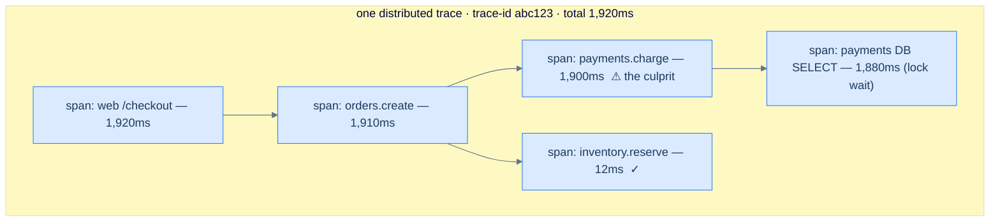

# 32. Observability — logs, metrics, traces

## TL;DR
> When a distributed system misbehaves at 3 a.m., you can only fix what you can *see*. Observability rests on **three pillars**: **metrics** (cheap numeric time-series — answer *"is something wrong, and what's the trend?"*, the basis of dashboards and alerts), **logs** (detailed per-event records — *"what exactly happened?"*), and **traces** (the path of *one* request across every service it touched — *"where did it break?"*). A request that fans across a dozen services is invisible without a **trace** that stitches its **spans** together via a propagated **trace ID** — the problem Google's **Dapper** (2010) was built to solve. **Monitoring** answers questions you anticipated (known-unknowns); **observability** is the ability to ask *new* questions of rich, high-cardinality data without shipping new code (unknown-unknowns). Alert on the **four golden signals** (latency, traffic, errors, saturation) and on **SLOs** (with an **error budget** = 1 − SLO), not on every internal blip. **OpenTelemetry** is the vendor-neutral standard for emitting all three. The trap: high-cardinality detail (user IDs, request IDs) belongs in **traces**, never as **metric labels** (the cardinality bomb).

## 1. Motivation

By **2010**, a single Google search wasn't served by one machine — it fanned out into a deep tree of **RPC calls across thousands of servers**, each doing a slice of the work. So when a search came back slow, the engineers faced a maddening question: *which* of those thousands of calls was the slow one? A dashboard showing "search latency p99 is up" told them *that* something was wrong but not *where*, and grepping the logs of thousands of machines for one request was hopeless — the log lines weren't even linked to each other. Their answer was **Dapper**, described in the 2010 paper *Dapper, a Large-Scale Distributed Systems Tracing Infrastructure*. The idea: tag each incoming request with a single **trace ID**, propagate that ID through every downstream RPC, and record a **span** (a timed unit of work) at each hop. Now you could reassemble the entire request as a tree and *see* the one span that took 1.9 seconds. Dapper was deliberately cheap — about **200 nanoseconds to create a span**, with the collection daemon using **under 0.3% of a CPU** — and it sampled whole traces rather than fragments, so what it kept was coherent. Its descendants are everywhere: Zipkin, Jaeger, and today's OpenTelemetry.

That story is the whole reason this lesson exists, and it's why the stub insists *"we have logs" does not equal "we have observability."* Logs are necessary but, alone, they can't follow a request across service boundaries or answer a question you didn't anticipate. As systems became microservices ([Lesson 27](/cortex/system-design/application-architecture-monoliths-microservices-modular-monoliths)) behind meshes ([Lesson 29](/cortex/system-design/application-architecture-service-discovery-and-mesh)), the gap between "we collect data" and "we can actually diagnose a novel failure" became the difference between a five-minute fix and a five-hour outage. This lesson is the three pillars, how they compose, the standard (OpenTelemetry) for emitting them, and the SRE discipline (golden signals, SLOs, error budgets) for deciding what's worth waking a human over.

## 2. Intuition (Analogy)

Think of your system as a patient and yourself as the doctor.

- **Metrics are the vital signs** — heart rate, temperature, blood pressure. Cheap to take continuously, perfect for *"is something wrong?"* and for trends and alarms ("BP spiking!"). But a high temperature doesn't tell you *why* you're sick.
- **Logs are the chart notes** — the detailed, timestamped record of discrete events: "2:14 p.m., patient reported dizziness, administered 5mg." Rich detail about *what happened*, but voluminous, and reading every note to reconstruct one episode is slow.
- **Traces are a contrast-dye scan that follows one complaint through the whole body.** You inject dye and watch it travel — heart, lungs, liver — and see *exactly where* it gets stuck. A trace follows **one request** through every service (organ) and shows you which one (the 1.9-second span) is the blockage. This is the pillar you simply cannot improvise after the fact in a distributed system.

And the deeper distinction: a **routine checkup** measures the things you already know to measure — that's **monitoring** (you decided in advance what to chart). **Observability** is being able to investigate a *novel, never-before-seen symptom* by slicing rich data any way you need — an MRI you can re-angle on the spot — *without* having pre-decided to measure exactly that. The term is borrowed from control theory: a system is "observable" if you can infer its internal state from its external outputs. The four **golden signals** (latency, traffic, errors, saturation) are the standard vitals every patient gets; an **SLO with an error budget** is the agreement that the patient may be unwell a small, defined fraction of the time — and you spend that budget deliberately.

## 3. Formal definitions

The **three pillars**, each answering a different question:

| Pillar | What it is | Cost | Cardinality | Answers |
|---|---|---|---|---|
| **Metrics** | numeric time-series (counters, gauges, histograms) | **cheap** (aggregated) | must stay **low** | "is something wrong? what's the trend?" — dashboards, alerts |
| **Logs** | discrete timestamped events (ideally structured) | **expensive** at volume | high (per event) | "what *exactly* happened in this event?" |
| **Traces** | one request's path across services, as a tree of **spans** | medium (usually **sampled**) | high (per request) | "*where* in the distributed call did it go wrong?" |

A **trace** is one request's journey, identified by a single **trace ID**; each **span** is a timed unit of work (one operation on one service) with a parent, so spans form a tree. The trace ID is **propagated** between services in a standard header (W3C Trace Context's `traceparent`), which is what links `web`'s span to `payments`'s span in the *same* trace — break that propagation and the trace shatters.

**Monitoring vs. observability:** monitoring watches **known-unknowns** — failure modes you anticipated, with predefined dashboards and alerts. **Observability** is the ability to answer **unknown-unknowns** — to ask a question you never pre-built a chart for — which requires **high-cardinality, high-dimensionality** data (per-request attributes) you can slice arbitrarily. "We have logs" is monitoring-grade; being able to ask *"show me p99 latency for tenant X, on app version Y, hitting endpoint Z, only for requests that also called the new pricing service"* — without deploying new code — is observability.

The SRE discipline for **what to measure and alert on**:

| Term | Meaning | Example |
|---|---|---|
| **Four golden signals** | latency, traffic, errors, saturation | "if you measure only four things, measure these" |
| **SLI** | a measured indicator | % of requests served < 300 ms |
| **SLO** | the internal target for an SLI | 99.9% of requests < 300 ms over 30 days |
| **SLA** | the *contractual* promise (with penalties) | "99.9% or we refund you" |
| **Error budget** | `1 − SLO` — allowed failure | 0.1% ≈ **43 min / 30 days** to "spend" |

(Two common metric frames: **RED** — Rate, Errors, Duration — for request services; **USE** — Utilization, Saturation, Errors — for resources.)



<p align="center"><strong>A trace is a tree of spans under one trace ID. The waterfall makes the culprit obvious: 1,880 ms of the 1,920 ms is a database lock wait inside payments — invisible to a latency metric, which only says "checkout is slow."</strong></p>

## 4. Worked Example — a slow checkout, and what each pillar tells you

Checkout starts feeling slow. Watch the three pillars do their distinct jobs.

**Metrics raise the alarm.** A dashboard of the **golden signals** shows checkout **latency** p99 jumped from 200 ms to ~2 s while **traffic** and **errors** are normal. This is exactly what metrics are for: cheap, aggregated, always-on, and *alertable* — but the dashboard only tells you checkout *as a whole* is slow. It cannot tell you which of the eight services in the request path is responsible.

**Traces localize it.** You open a **trace** for one slow checkout (the §3 diagram). The span tree shows `web` → `orders` → `payments`, and the `payments.charge` span is **1,900 ms** of the 1,920 ms total — and *its* child span, a database `SELECT`, is **1,880 ms** stuck on a lock wait. In seconds, the trace has pointed at the exact culprit: a slow query in payments. This is the Dapper payoff — *where*, answered instantly, across service boundaries.

**Logs give the gory detail.** Now you read the **logs** for that payments DB span (filtered by the trace ID) and see the exact query, the row it blocked on, and the long-running transaction holding the lock. Metrics said *something's wrong*; traces said *where*; logs said *exactly what*. Three pillars, three questions.

**Failure case 1 — the broken trace.** Suppose the `orders` service doesn't **propagate the trace context** (it doesn't forward the `traceparent` header on its call to `payments`). Now `payments` starts a *brand-new* trace, the `web→orders` trace ends at `orders`, and `payments` spans appear in a disconnected fragment. Your beautiful waterfall shatters into pieces that can't be joined, and you're back to grepping — *the single most common reason "we have tracing" still can't follow a request.* Fix: propagate context on **every** hop, including across async/queue boundaries, ideally via OpenTelemetry auto-instrumentation end to end.

**Failure case 2 — the cardinality bomb (a pillar mismatch).** A well-meaning engineer wants per-user latency detail and adds `user_id` as a **label on the latency metric**. Each label value is a new time-series, so a million users becomes a million series, and the metrics backend **OOMs** — the exact failure from [Lesson 24](/cortex/system-design/storage-and-search-time-series-databases). The detail they wanted was legitimate; they put it in the **wrong pillar**. High-cardinality, per-request attributes belong on **spans and logs** (which are built for it), while **metric labels must stay low-cardinality and bounded**. Knowing *which pillar* a piece of data belongs in is half of observability.

## 5. Build It

The real artifact is **instrumentation**. Here's OpenTelemetry in Python — a span for a request (high-cardinality detail goes here) plus a low-cardinality latency metric:

```python
from opentelemetry import trace, metrics

tracer = trace.get_tracer("checkout")
meter = metrics.get_meter("checkout")
latency = meter.create_histogram("checkout.latency", unit="ms")

def checkout(req):
    # A SPAN traces THIS request; the trace-id auto-propagates downstream (W3C `traceparent`
    # header), so payments/inventory spans join the SAME trace — the §4 waterfall.
    with tracer.start_as_current_span("checkout") as span:
        span.set_attribute("tenant.id", req.tenant)    # high-cardinality detail belongs on the
        span.set_attribute("user.id", req.user)         # TRACE (built for it) — never a metric label
        start = now_ms()
        result = do_checkout(req)                        # calls payments/inventory -> child spans
        latency.record(now_ms() - start,
                       {"route": "/checkout", "status": result.status})  # metric labels: BOUNDED only
        return result
```

Then an **SLI** as a PromQL query — the fraction of requests meeting the latency target, which you compare against your SLO to track the error budget:

```promql
# SLI: fraction of checkouts served under 300ms over 30 days (target SLO = 99.9%).
sum(rate(checkout_latency_ms_bucket{le="300"}[30d]))
  /
sum(rate(checkout_latency_ms_count[30d]))
# Below 0.999 → the error budget (1 - 0.999 = 0.1% ≈ 43 min / 30 days) is spent.
```

The instrumentation embodies the §4 lesson: the **span** carries `tenant.id` and `user.id` (where high cardinality is welcome and lets you ask new questions later), while the **metric** carries only `route` and `status` (a handful of bounded values, safe to aggregate). OpenTelemetry matters here because it's **vendor-neutral**: you instrument once against the OTel API and can send the data to any backend (Prometheus, Jaeger, a SaaS) without re-instrumenting — which is exactly why the industry consolidated on it in 2019 (merging OpenTracing and OpenCensus). The PromQL turns a golden signal into a concrete SLI you can alert on and budget against.

## 6. Trade-offs

| Decision | Cheaper / simpler | Richer / costlier | Choose by |
|---|---|---|---|
| Which pillar to add detail to | **metrics** (aggregate) | logs / **traces** (per-event) | "is it wrong?" → metrics; "where/what?" → traces/logs |
| Trace sampling | sample 1% (cheap) | trace 100% (complete, costly) | sample, but **keep all errors/slow traces** (tail-based) |
| Log volume | sample / INFO+ | log everything / DEBUG | structured logs, sampled; full detail only where needed |
| Alert on | **symptoms** (SLO/golden signals) | every internal cause | symptoms page humans; causes inform debugging |
| Tooling | **OpenTelemetry** + one backend | per-pillar vendor stacks | OTel avoids lock-in; instrument once |

The core trade is **cost vs. resolution**, and the three pillars sit at different points: **metrics** are so cheap you keep them always-on for every service (they're your alerting backbone), **logs** get expensive fast (logging every request at full detail can cost more than running the app), and **traces** are usually **sampled** because recording every request's full tree is too much data — Dapper itself sampled. The senior moves: **alert on metrics** (specifically SLO burn and the golden signals), **drill into traces** to localize, **read logs** for the final detail; **sample traces but keep the interesting ones** (errors, slow requests) via tail-based sampling so you don't discard the 1% you most need; and **alert on symptoms, not causes** — page a human when users are hurt (SLO at risk), not for every CPU spike, or you train them to ignore the pager. And emit it all through **OpenTelemetry** so switching or adding a backend doesn't mean re-instrumenting everything.

## 7. Edge cases and failure modes

- **Broken trace-context propagation.** A service that doesn't forward `traceparent` orphans every downstream span and shatters the trace (§4) — the most common reason tracing "doesn't work." Propagate context on every hop *including across queues/async boundaries*; lean on OTel auto-instrumentation end to end.
- **Cardinality bomb in metrics.** High-cardinality labels (`user_id`, `request_id`, URLs) multiply time-series and OOM the metrics backend ([Lesson 24](/cortex/system-design/storage-and-search-time-series-databases)). Keep metric labels bounded; put per-request detail on **traces/logs**, which are designed for it.
- **Alert fatigue from cause-based alerts.** Paging on every internal blip (a CPU spike, one slow node) buries the real alerts and trains people to ignore the pager. Alert on **user-facing symptoms** that threaten an **SLO**; everything else is a dashboard, not a page.
- **Sampling blind spots.** Head-based sampling at 1% can throw away the rare error trace you most need. Use **tail-based sampling** (decide after the request: keep all errors and slow traces), or sample errors at a higher rate.
- **Logging cost and secrets.** Verbose logging in prod (left-on DEBUG, full request bodies) explodes ingest bills and buries signal — and logging tokens/PII is a breach ([Lesson 30](/cortex/system-design/application-architecture-authn-authz)). Structure logs, sample them, set levels deliberately, and never log credentials.
- **No correlation ID / clock skew.** Without a propagated request/trace ID you can't tie a tenant's events together; without synchronized clocks you can't even order cross-service events correctly. Propagate IDs everywhere and keep NTP tight (the clock-skew theme from [Lesson 24](/cortex/system-design/storage-and-search-time-series-databases)).
- **Mistaking dashboards for observability.** Pre-built dashboards only answer questions you already anticipated. If a novel failure can't be investigated without shipping new instrumentation, you have **monitoring**, not observability — invest in high-cardinality, sliceable telemetry.

## 8. Practice

> **Exercise 1 — Which pillar?**
> For each, name the pillar that answers it best and why: (a) "is our error rate above the SLO *right now*?"; (b) "for this one customer's failed checkout at 14:32, *where* in our 8 services did it break?"; (c) "what was the exact exception and stack trace when payments threw?"
>
> <details>
> <summary>Solution</summary>
>
> **(a) Metrics** — an aggregate error *rate* over time, cheap and always-on, and the basis of the SLO alert; it's the "errors" golden signal. **(b) Traces** — follow that single request's span tree across all 8 services to find the failing/slow span; this cross-service localization is exactly why distributed tracing (Dapper) exists, and metrics/logs alone can't do it. **(c) Logs** — the detailed, per-event record carrying the exception and stack trace (filter logs by the trace ID from (b) to jump straight to them). The pillars are complementary: **metrics say *something's wrong*, traces say *where*, logs say *exactly what*** — and you typically use them in that order.
>
> </details>

> **Exercise 2 — Error-budget math.**
> Your checkout availability SLO is **99.95%** over 30 days. (a) What is the monthly error budget in minutes? (b) A bad deploy causes **20 minutes** of full downtime — how much budget remains, and what does SRE practice say to do?
>
> <details>
> <summary>Solution</summary>
>
> **(a)** Error budget = `1 − 0.9995 = 0.05%` of 30 days. 30 days ≈ `43,200` minutes, so the budget ≈ `0.0005 × 43,200 ≈ 21.6` minutes/month. **(b)** The 20-minute outage spends almost all of it, leaving **~1.6 minutes** for the rest of the window. With the budget nearly exhausted, standard SRE practice is to **freeze risky releases and prioritize reliability work** until the budget recovers next window. That's the whole point of an error budget: it's an objective, pre-agreed signal that arbitrates the eternal "ship features vs. stabilize" argument — when there's budget, ship; when it's gone, stabilize.
>
> </details>

> **Exercise 3 — Two broken-telemetry bugs.**
> A team reports: their traces show `web` and `orders` spans but `payments` spans are *never in the same trace*; and separately, their Prometheus just OOM'd right after someone "added more detail." Diagnose both.
>
> <details>
> <summary>Solution</summary>
>
> **Broken trace:** `orders` (or its client to `payments`) isn't **propagating the trace context** — it doesn't forward the W3C `traceparent` header — so `payments` begins a *new* trace instead of attaching a child span to the existing one. The trace fragments and payments appears "missing." Fix: propagate context on every call (and across async/queue hops); end-to-end OTel auto-instrumentation usually handles this. **The OOM:** someone added a **high-cardinality label** (almost certainly `user_id` or `request_id`) to a metric, so the number of time-series exploded into the millions and exhausted Prometheus's memory — the **cardinality bomb** from [Lesson 24](/cortex/system-design/storage-and-search-time-series-databases). Fix: remove the unbounded label; put that per-request detail on **traces/logs**. The two bugs are the two classic pillar misuses: **traces need propagation; metrics need bounded cardinality.**
>
> </details>

## In the Wild

- **[Google — "Dapper, a Large-Scale Distributed Systems Tracing Infrastructure"](https://research.google/pubs/pub36356/)** (2010) — the origin of distributed tracing: trace IDs, spans, sampling whole traces, and ~200ns/<0.3%-CPU overhead. Every tracing system since (Zipkin, Jaeger, OpenTelemetry) descends from it.
- **[Google SRE Book — Monitoring Distributed Systems](https://sre.google/sre-book/monitoring-distributed-systems/)** — the four golden signals (latency, traffic, errors, saturation) and the philosophy of alerting on symptoms; pair it with the SRE chapters on SLOs and error budgets.
- **[OpenTelemetry](https://opentelemetry.io/)** — the CNCF vendor-neutral standard (2019 merger of OpenTracing + OpenCensus) for emitting metrics, logs, and traces. Instrument once, send anywhere; the §5 code and the de facto industry baseline.
- **[Honeycomb — Observability vs. monitoring](https://www.honeycomb.io/blog/observability-101-terminology-and-concepts)** — the clearest articulation of the monitoring (known-unknowns) vs. observability (ask-new-questions, high-cardinality) distinction the stub demands.
- **[Peter Bourgon — "Metrics, tracing, and logging"](https://peter.bourgon.org/blog/2017/02/21/metrics-tracing-and-logging.html)** (2017) — a crisp, opinionated map of how the three pillars relate and where each belongs, including the cost/cardinality trade-offs in §6.

---

> **Next:** [33. Deployment strategies](/cortex/system-design/production-operations-deployment-strategies) — observability tells you when a release is going wrong; deployment strategy decides how *exposed* you are when it does. Next: blue-green, canary, and rolling deploys, feature flags, and the key insight that ties back to this lesson — a safe deploy is one you can **watch** (via these golden signals) and **roll back** before the error budget is gone.
