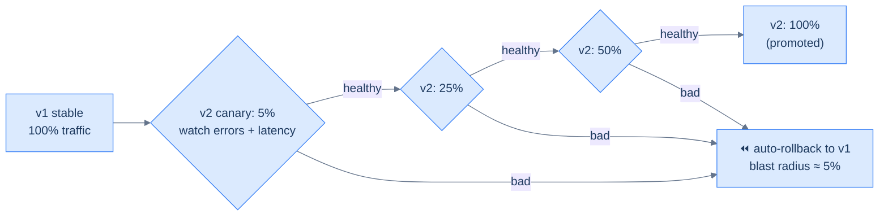

# 33. Deployment strategies

## TL;DR
> Shipping a new version is the single most common cause of outages, so deployment strategy is really *risk* strategy. The options trade blast radius and rollback speed against cost and complexity: **recreate** (stop old, start new — has downtime), **rolling** (replace instances gradually — Kubernetes' default, no downtime but mixed versions briefly), **blue-green** (two full environments, flip traffic atomically — instant rollback, needs 2× capacity), and **canary** (send a small % of traffic to the new version, watch its metrics, and ramp up *only if healthy* — smallest blast radius, but needs real observability). The deepest idea is **deploy ≠ release**: a **feature flag** lets you ship code "dark" and turn it on for a cohort — or kill it instantly — without redeploying. The non-negotiable across all of them is a **fast, tested rollback**; a deploy you can't undo is a gamble, and Knight Capital's 2012 inability to do exactly that cost **$440 million in 45 minutes**. Measure your delivery with the **DORA** four keys: deploy frequency, lead time, change failure rate, and time to restore.

## 1. Motivation

On **1 August 2012**, Knight Capital was one of the largest market-makers in U.S. equities. That morning it deployed new trading code to its servers — but the deployment process **missed one of eight servers**. On that one un-updated server, the new code reused a **flag that had been repurposed roughly eight years earlier**; flipping it on reactivated long-dead legacy logic called **"Power Peg."** When the market opened at 9:30 a.m., that single server began firing orders into the market with abandon. Over the next **~45 minutes**, Knight's system sent about **4 million unintended orders**, executing trades on roughly **397 million shares** across **140+ securities** and accumulating about **$7 billion** in unwanted positions. By the time they stopped it, the firm had a **~$440 million pre-tax loss** (confirmed in its SEC filing) — more than its entire market value. The 17-year-old company was effectively destroyed and acquired within days.

Every failure in that story is a deployment-strategy failure: a **manual, inconsistent deploy** that left one server on old code; a **repurposed flag** that meant different things in different versions; **no automated verification** that all servers matched; and, fatally, **no fast kill-switch or rollback** when the orders started flooding out. There was no canary to catch it on 1% of traffic, no blue-green switch to flip back, no feature flag to disable in one click. It is the most expensive illustration in computing of why *how* you ship matters as much as *what* you ship.

The instinct this lesson installs is that a release is the **riskiest routine thing you do** to a healthy system, and the entire job of a deployment strategy is to make that risk **small and reversible** — to expose a new version to as few users as possible until you've *watched* it behave ([Lesson 32](/cortex/system-design/production-operations-observability)), and to make undoing it a single, boring, tested action. "Move fast and break things" is fine; "move fast and *can't unbreak* things" is Knight Capital.

## 2. Intuition (Analogy)

The most important strategy is named after a real safety practice: the **canary in a coal mine.** Miners carried a caged canary underground because the bird, far more sensitive to toxic gas, would collapse *before* the gas reached levels dangerous to humans — giving the miners time to evacuate. The canary was a small, monitored sacrifice that warned of danger before it hit everyone. A **canary deployment** is exactly this: route a *small slice* of real traffic to the new version (the canary), watch its vital signs, and if they "collapse" (error rate spikes), pull back *before* the bad version reaches the rest of your users.

The other strategies fall out of the same picture, told as a restaurant rolling out a new recipe:

- **Recreate** is closing the restaurant, swapping the whole kitchen, and reopening — nobody's served during the swap (downtime), but it's dead simple.
- **Rolling** is changing the recipe one section of tables at a time — no closure, but for a while some diners get the old dish and some the new (mixed versions).
- **Blue-green** is building a *second, identical kitchen* next door, getting it fully ready, then flipping a switch so all diners are served from the new kitchen at once — and if the new kitchen is bad, you flip the switch *back* instantly (you just need two kitchens for a while).
- **Feature flag** is the new dish being *cooked and ready on the line* (deployed) but not *on the menu* (released) until the manager decides — and pullable instantly without touching the kitchen.

Canary, two kitchens, recipe-by-section, dish-on-the-line-but-off-the-menu — and over all of it, the one rule the Knight Capital kitchen lacked: **a way to instantly stop serving the new dish.**

## 3. Formal definitions

A crucial distinction first: **deploy ≠ release.** *Deploying* puts new code on servers; *releasing* exposes its behavior to users. **Feature flags** decouple them — you can deploy code that's switched off, then release it later (to a cohort, a percentage, or everyone) and **kill it instantly** by flipping the flag, with no redeploy.

The strategies, on the axes that decide between them:

| Strategy | Downtime | Extra capacity | Rollback | Blast radius of a bad release | Complexity |
|---|---|---|---|---|---|
| **Recreate** | **yes** | none | redeploy old | 100% | trivial |
| **Rolling** (k8s default) | none | small (surge pods) | roll back gradually | grows as it rolls | low |
| **Blue-green** | none | **2×** briefly | **instant** (switch back) | 100% at cutover | medium |
| **Canary** | none | small | fast (shift traffic back) | **small** (canary %) | **high** (needs analysis) |

**Rolling** is Kubernetes' default: it brings up new pods while scaling old ones down, keeping the total count steady — so there's no downtime, but old and new run **simultaneously** during the rollout. **Recreate** kills the old version before starting the new — no version overlap, but a gap of downtime. **Blue-green** keeps two full production environments and flips a router from blue (current) to green (new); rollback is flipping back. **Canary** sends a subset of traffic to the new version, verifies it, and ramps up — the only strategy that *limits how many users a bad release can hurt*.

**Progressive delivery** is canary + **automated analysis**: a controller (Argo Rollouts, Flagger) shifts traffic in steps, checks the new version's **golden signals** ([Lesson 32](/cortex/system-design/production-operations-observability)) against thresholds at each step, and **auto-promotes** if healthy or **auto-rolls-back** if not — no human staring at a dashboard at 2 a.m.

You measure the whole delivery system with the **DORA four keys**: **deployment frequency** and **lead time for changes** (velocity), **change failure rate** and **time to restore service** (stability). Elite teams keep change-failure-rate in the **0–15%** range and restore service in **under an hour** — and notice that two of the four metrics are about *recovering*, not preventing: fast rollback is a first-class goal.



<p align="center"><strong>A canary ramps traffic in steps, gated by automated analysis of the golden signals. A bad release is caught at 5% and rolled back — its blast radius is the canary slice, not everyone.</strong></p>

## 4. Worked Example — rolling out checkout v2 (and the math of blast radius)

You're shipping `checkout` v2 to a fleet handling **1,000 requests/second**, and v2 has a latent bug that errors on **20%** of the requests it serves. It takes about **10 minutes** to notice and act.

**Without a canary (deploy to 100%).** Every request hits v2. In 10 minutes that's `1,000 × 600 = 600,000` requests, and 20% fail → **120,000 failed requests** slammed onto real users before you roll back. That's a chunk of your error budget ([Lesson 32](/cortex/system-design/production-operations-observability)) gone in one deploy, and a lot of angry customers.

**With a canary (5%, automated analysis).** Only 5% of traffic reaches v2: `600,000 × 0.05 = 30,000` requests through the canary, 20% fail → **6,000 failed requests** — a **20× reduction** in user-facing damage. And it's better than that, because the canary's error rate (20%, far above the ~1% threshold) **trips the automated analysis within the first minute or two and rolls back automatically**, so you don't even spend the full 10 minutes. The canary converted "everyone is broken for 10 minutes" into "a small, monitored slice is broken for a minute or two." That is the entire value proposition, quantified.

**The failure case — a canary that can't see the problem (the Knight Capital shape).** Suppose the canary controller is configured to check only *"did the new pods start and pass their health check?"* — not the error rate or latency that actually matter. v2's pods start fine; the analysis passes; the canary auto-promotes to 100%; and *now* the 20%-error bug hits everyone — because the canary watched the wrong signal. Or: the bug lives behind a **feature flag that was flipped on globally** instead of only for the canary cohort, so the canary traffic looked healthy (the flagged path wasn't exercised there) while the flag silently broke everyone. Both are versions of Knight Capital's lesson: **a safety mechanism you didn't wire up correctly is no safety at all.** The fixes: have the canary analysis watch **SLO-relevant golden signals** (error rate, latency — not just "pods up"), scope feature flags to the **same cohort** as the canary, give the canary **enough traffic and time** to produce a statistically meaningful signal, and — always — keep an **automated, tested rollback** as the backstop.

## 5. Build It

Progressive delivery is declarative config. Here's an **Argo Rollouts** canary that shifts traffic in steps and gates each step on automated metric analysis:

```yaml
# CANARY with automated analysis: shift traffic in steps; promote only if the metrics pass, else roll back.
apiVersion: argoproj.io/v1alpha1
kind: Rollout
metadata: { name: checkout }
spec:
  strategy:
    canary:
      steps:
        - setWeight: 5             # 5% of traffic to v2 (the canary)
        - pause: { duration: 5m }  # ...let it bake
        - analysis:                # check v2's error rate vs threshold (the golden signals)
            templates: [{ templateName: canary-error-rate }]
        - setWeight: 25
        - pause: { duration: 5m }
        - setWeight: 50
        - pause: { duration: 10m }
        # 100% is reached ONLY if every analysis passed; any failure => automatic rollback to v1
```

The `analysis` step references a check like "the canary's 5xx rate must stay below 1%, measured on the canary pods only" (a Prometheus query over `version="canary"`); if it fails, Argo abandons the rollout and shifts traffic back to v1 automatically — no human required. Separately, a **feature flag** decouples deploy from release and gives you the instant kill-switch Knight Capital lacked:

```python
# A feature FLAG separates DEPLOY (code is live, switched off) from RELEASE (users see it).
def checkout(req):
    if flags.enabled("new-pricing", user=req.user):   # on for, say, the 5% canary cohort — no redeploy
        return new_pricing_path(req)
    return old_pricing_path(req)                        # flip the flag OFF to kill it instantly
```

Two ideas worth internalizing. First, the canary config encodes *patience*: traffic only advances past each `pause`+`analysis` gate if the metrics hold, so a bad version is caught at 5% (the §4 math). Second, the flag and the canary should be **scoped to the same cohort** — release the flag to exactly the traffic the canary serves — or you reproduce the §4 failure where the canary is blind to the flagged path. In practice mature teams combine them: **deploy via canary** (limit infra-level blast radius) and **release via flags** (limit feature-level blast radius, with an instant off switch).

## 6. Trade-offs

The strategies are a spectrum from "simple but risky" to "complex but safe":

| Need | Reach for | Cost |
|---|---|---|
| Downtime is acceptable; keep it trivial | **Recreate** | a maintenance window |
| No downtime, sensible default | **Rolling** (k8s default) | mixed versions during rollout |
| Instant all-or-nothing switch + rollback | **Blue-green** | 2× capacity during cutover |
| Minimum blast radius, you have observability | **Canary** (+ automated analysis) | real complexity + a metrics stack |
| Decouple release from deploy; per-cohort + kill switch | **Feature flags** | flag lifecycle/debt to manage |

The honest guidance: **rolling** is the right default for most stateless services (no downtime, built into Kubernetes, low complexity), **canary** is the gold standard when the cost of a bad release is high *and* you have the observability to run the analysis (without good metrics, a canary is just a slow rollout that still breaks everyone), **blue-green** shines when you need an atomic switch and instant rollback and can afford the doubled capacity, and **recreate** is fine when a brief downtime window is genuinely acceptable — don't build canary machinery you don't need. **Feature flags** are nearly always worth it because "deploy ≠ release" is such a powerful lever (ship dark, release gradually, kill instantly), as long as you treat flags as **temporary** and clean them up. And the rule that overrides all of the above: **every deploy must have a fast, tested rollback**, because two of the four DORA stability metrics — change failure rate and time to restore — are about *when*, not *if*, a release goes wrong.

## 7. Edge cases and failure modes

- **Incomplete or inconsistent deploys (Knight Capital).** One instance left on old code, or a flag meaning different things in different versions, yields undefined behavior. **Automate** deploys (no manual per-server steps), **verify all instances match**, and never repurpose old flag names. This single failure ended a company.
- **No fast rollback / irreversible deploy.** A deploy you can't undo is a bet. Always have a **tested** rollback (and rehearse it) — it's the biggest lever on time-to-restore, a DORA stability metric.
- **A backward-incompatible DB migration breaks rollback.** Blue-green and canary assume you can switch *back*, but a schema change the old code can't read makes that impossible. Use **expand-contract (parallel-change)** migrations — add new columns, deploy code that handles both, backfill, cut over, and only then remove the old — so the schema never gets ahead of code you might roll back to. Decouple schema changes from feature deploys.
- **Canary watching the wrong signal (or too little traffic).** A canary that checks only "pods started" misses elevated errors/latency (§4); a canary with too little traffic has no statistical signal. Gate on **SLO-relevant golden signals** with enough volume and bake time to be meaningful.
- **Mixed-version incompatibility.** Rolling/canary run old and new at once; if v2 changes an API, queue message, or DB contract that v1 can't handle (or vice-versa), the mixed state breaks. Make changes **backward- and forward-compatible across one version** (the same discipline as API versioning, [Lesson 28](/cortex/system-design/application-architecture-api-design)).
- **Feature-flag debt.** Flags left on forever, or used as long-lived config, multiply untested code-path combinations and become a Knight-Capital-style reuse hazard. Set expiry on flags, remove them once a release is permanent, and audit long-lived ones.

## 8. Practice

> **Exercise 1 — Blast-radius math.**
> A bad release errors on **20%** of requests it serves; the system does **2,000 req/s**, and it takes **15 minutes** to detect and roll back. (a) Full deploy to 100% — how many failed requests hit users? (b) A **10%** canary instead — how many, and what *else* helps beyond the smaller fraction?
>
> <details>
> <summary>Solution</summary>
>
> **(a)** All traffic hits the bad version: `2,000 × 900s = 1,800,000` requests, 20% fail → **360,000 failed requests** to real users (and a big bite out of the error budget). **(b)** Only 10% reaches the canary: `1,800,000 × 0.10 = 180,000` requests, 20% fail → **36,000 failed** — a **10× reduction**. But the bigger win is *time*: a 20% error rate on the canary is wildly above any sane threshold, so **automated analysis trips and rolls back within a minute or two**, not 15 minutes — cutting the damage far below even the 36,000. Canary shrinks the blast radius on *both* axes: fraction of users **and** duration of exposure. A full deploy has neither safeguard.
>
> </details>

> **Exercise 2 — Why can't they roll back?**
> A team uses blue-green. v2's deploy included a migration renaming column `amount` → `amount_cents`. v2 turns out buggy, so they switch traffic back to blue (v1) — and v1 immediately starts erroring. Explain, and give the fix.
>
> <details>
> <summary>Solution</summary>
>
> v1's code still queries the column `amount`, which **no longer exists** — the migration was **not backward-compatible**, so "flip back to blue" can't save them: the *database* moved forward even though the *code* went back, and rolling back the app doesn't roll back a schema change. The fix is the **expand-contract (parallel-change)** pattern: **(1) Expand** — add `amount_cents` *alongside* `amount`, and deploy code that reads/writes both. **(2) Backfill** `amount_cents` from `amount`. **(3) Cut over** reads to `amount_cents`. **(4) Contract** — only after the old code is fully gone and you'd never roll back to it, drop `amount`. Every intermediate step is backward-compatible, so the schema never gets ahead of code you might revert to. The meta-lesson: **decouple schema migrations from feature deploys**, because a deploy you can't roll back isn't a deploy, it's a dare.
>
> </details>

> **Exercise 3 — Pick the strategy.**
> Justify a choice for each: (a) a stateless web API where you want minimum risk and you have strong observability; (b) a legacy internal app where a brief 3 a.m. downtime is fine and simplicity matters most; (c) a change you want to roll out to users *gradually by cohort* and be able to disable instantly without redeploying.
>
> <details>
> <summary>Solution</summary>
>
> **(a) Canary** (progressive delivery). With good observability you can run automated analysis on the golden signals and get the smallest possible blast radius — the right call when minimizing release risk is the priority and you have the metrics to do it safely. **(b) Recreate** (or simple rolling). If a short 3 a.m. window is acceptable, the operational simplicity of recreate wins; don't pay for canary/blue-green machinery a low-stakes internal app doesn't need. **(c) Feature flags.** They directly implement "deploy ≠ release": ship the code (off), enable it for a cohort or a rising percentage, and **flip it off instantly** as a kill switch — all with no rebuild or redeploy. (In practice you'd often *also* canary the deploy and gate the feature behind a flag — infra blast-radius control plus feature blast-radius control.) Match the strategy to the stakes and the tooling you actually have.
>
> </details>

## In the Wild

- **[Knight Capital — SEC Form 8-K](https://www.sec.gov/Archives/edgar/data/0001060749/000119312512336167/d392288d8k.htm)** (Aug 2012) — the primary filing confirming the ~$440M pre-tax loss. The §1 catastrophe: a missed server, a repurposed flag, and no rollback. Read it as the strongest possible argument for everything in this lesson.
- **[Argo Rollouts](https://argo-rollouts.readthedocs.io/en/stable/concepts/)** — the Kubernetes progressive-delivery controller behind §5: canary and blue-green with traffic shifting and automated, metric-gated analysis (auto-promote / auto-rollback).
- **[Martin Fowler — BlueGreenDeployment](https://martinfowler.com/bliki/BlueGreenDeployment.html)** (and the companion CanaryRelease / FeatureToggle / ParallelChange entries) — the canonical, technology-agnostic definitions and the expand-contract migration pattern from §7.
- **[Google SRE Workbook — Canarying Releases](https://sre.google/workbook/canarying-releases/)** — how to actually run a canary: choosing the metric, the population, the duration, and the automated decision to promote or roll back.
- **[DORA — the Four Keys](https://dora.dev/guides/dora-metrics-four-keys/)** — deployment frequency, lead time, change failure rate, and time to restore: the evidence-based way to measure whether your deployment strategy is actually making you faster *and* safer.

---

> **Next:** [34. Capacity planning and autoscaling](/cortex/system-design/production-operations-capacity-planning-and-autoscaling) — a safe deploy gets new code out; capacity planning makes sure there are enough machines to run it when traffic triples at 9 a.m. Next: how to size a fleet from first principles (back to Little's Law), horizontal vs vertical scaling, autoscaling on the right signal, and why naïve autoscaling can amplify an outage instead of absorbing it.
