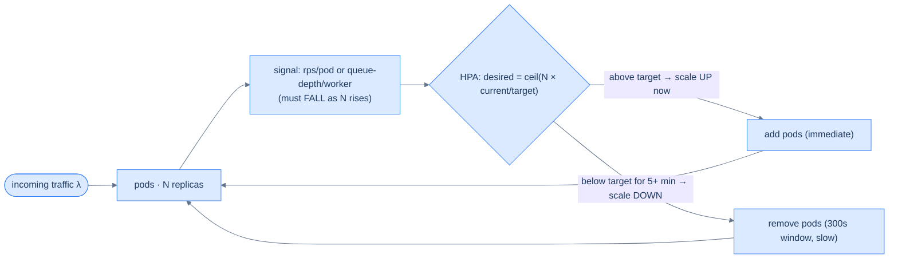

# 34. Capacity planning and autoscaling

## TL;DR
> Capacity planning answers "how many machines?" and autoscaling makes that number follow demand. You size from first principles with **Little's Law** (`L = λ·W`: concurrent requests = arrival rate × time-in-system), then divide by what one instance can handle — but you must leave **headroom**, because a system run near 100% utilization doesn't go fast, it **jams** (queue length `ρ/(1−ρ)` explodes as utilization `ρ → 1`). **Horizontal** scaling (more instances) beats **vertical** (a bigger instance) for elasticity and fault tolerance, provided you're stateless. **Autoscaling** (Kubernetes **HPA**, **KEDA**, **VPA**) adjusts capacity automatically — but only if you scale on the **right signal**: a metric that *falls as you add capacity* (requests-per-pod, queue depth per worker), **not** raw request count, and **not CPU** for I/O-bound work. The traps that turn autoscaling from a shock-absorber into an outage-amplifier: scaling into a downstream that can't scale (more pods just hammer the database harder), **cold-start lag** (new capacity arrives too late for a sharp spike), and **flapping** — so the rule is **scale up fast, scale down slow**. Pokémon GO's launch ran **~50× over its traffic estimate**; elasticity, not a perfect forecast, is what saved it.

## 1. Motivation

When Niantic and Google Cloud prepared to launch **Pokémon GO in July 2016**, they did the responsible thing: they estimated the traffic. They sized for **1× their target player load**, and provisioned a **worst-case of roughly 5×** that target as a safety buffer — a sensible, even generous, margin. Then the game came out and became the fastest-growing mobile phenomenon in history. Real traffic surged to about **50× the original target** — **ten times** the worst-case they'd planned for. By any normal standard their capacity plan was *wrong by an order of magnitude*. And yet the game (mostly) stayed up, because Google's site-reliability engineers could **elastically provision tens of thousands of cores** on GKE on Niantic's behalf, growing the cluster far past anything the plan had imagined — it became the largest Kubernetes deployment Google had run.

Two lessons live in that story, and they're the two halves of this chapter. First, **your capacity estimate will be wrong** — sometimes by 10×, and usually right when it matters most (a launch, a viral moment, a Black Friday). Second, the thing that saves you is not a better point estimate; it's **elasticity plus headroom plus graceful degradation** — the ability to *grow* capacity faster than demand and to bend rather than break in the gap. Capacity planning gets you a sane starting size and the math to reason about it; autoscaling turns that static number into a function of live demand.

But — and this is the part teams learn the hard way — **autoscaling is not magic, and done naïvely it can make an outage worse**: scale on the wrong signal and it sits idle while requests pile up; scale into a database that can't grow and you've just pointed more load at the real bottleneck. This lesson is how to size a fleet you can defend with arithmetic, and autoscale it so it absorbs shocks instead of amplifying them.

## 2. Intuition (Analogy)

Run a **call center.** Calls (requests) arrive; agents (servers) handle them; how many agents do you need?

- **Capacity from Little's Law.** If **60 calls arrive per minute** and each call takes an agent **3 minutes**, then at any instant you have `60 × 3 = 180` calls *in progress* — so you need on the order of **180 agents** to keep up. That's `L = λ·W` in human form: concurrent work = arrival rate × handling time.
- **Why you can't staff to exactly 100%.** Picture a **highway at 100% capacity** — every lane bumper-to-bumper. It doesn't carry the most cars; it **jams**, throughput collapses, and travel time explodes. A call center staffed so every agent is *always* on a call has no slack for a burst, so callers queue, hold times spiral, and the whole thing degrades. You staff for ~70% so a hiccup doesn't cascade. (Mathematically the queue grows like `ρ/(1−ρ)` — gentle at 50%, brutal as you approach 100%.)
- **Horizontal vs vertical.** You can hire **more agents** (scale horizontally) or train one **superhuman agent** who talks faster (scale vertically) — but there's a ceiling on how fast one human can talk, and if that one super-agent is sick, you're done (a single point of failure). More agents scales further and survives a loss.
- **Autoscaling is a staffing agency.** It sends more agents when the hold queue grows and sends them home when it shrinks. But agents take **20 minutes to arrive** (**cold start**): if you wait until you're already drowning to call the agency, you're underwater for 20 minutes. And if you send agents home the *instant* the rush dips, the next wave hits before they're out the door (**flapping**) — so you call eagerly and dismiss reluctantly. Worst of all, if you staff based on "how hot the break room is" (**CPU**) when the real bottleneck is the **single credit-card terminal** every agent must share (a **downstream dependency**), adding agents doesn't help — it just crowds the terminal and makes things *worse*.

Agents, Little's Law, the jammed highway, the slow-to-arrive staffing agency, the shared terminal — that's the whole lesson in one building.

## 3. Formal definitions

**Capacity planning** sizes a fleet to meet expected demand. The workhorse is **Little's Law** (John Little, 1961): in any stable system, `L = λ · W`, where **L** is the average number of items in the system, **λ** the arrival rate, and **W** the average time each spends inside. For a service: concurrent in-flight requests = requests/sec × seconds/request. Divide that by what one instance can hold concurrently, leave headroom, and you have a fleet size.

**Headroom is not optional.** Treat each instance like a queue: at utilization `ρ`, the expected number waiting/being-served grows like `ρ/(1−ρ)` — `1` at 50%, `4` at 80%, `9` at 90%, `→ ∞` as `ρ → 1`. Latency tracks that curve, so running "hot" trades a few saved machines for a cliff: one small spike at 95% utilization tips you into runaway queuing. Hence target ~**60–70%** utilization and keep **N+1 / N+2** redundancy so losing an instance (or a whole zone) doesn't push survivors over the edge.

| Scaling | What | Pros | Cons |
|---|---|---|---|
| **Vertical** (scale up) | a bigger instance | simple; no app changes | a hard ceiling; a single point of failure; coarse |
| **Horizontal** (scale out) | more instances | ~unbounded; fault-tolerant; elastic | requires statelessness/sharding; more orchestration |

**Autoscaling** adjusts capacity automatically. **Kubernetes HPA** (Horizontal Pod Autoscaler) computes `desiredReplicas = ceil(currentReplicas × currentMetric / targetMetric)` — e.g. 2 pods at 80% CPU with a 50% target → `ceil(2 × 80/50) = 4`. Its defaults encode the "up fast, down slow" rule: **scale-up is immediate** (no stabilization window; may add 100% of pods every 15s), while **scale-down waits a 300-second stabilization window** and takes the *highest* recommendation over that window — and a default **10% tolerance** ignores tiny deviations. Related tools: **KEDA** (event-driven — scale on queue length, Kafka lag, etc., including scale-to-zero), **VPA** (vertical — right-sizes pod CPU/memory requests), and the **Cluster Autoscaler / Karpenter** (adds/removes *nodes*).

The single most important autoscaling decision is **the signal**: it must be a metric that **falls as you add capacity** so the loop can stabilize — **CPU% per pod**, **requests-per-second per pod**, or **queue depth per worker**. Scaling on *raw request count* (which doesn't drop when you add pods) can never settle, and **CPU is a poor proxy for I/O-bound or async work** (pods blocked on a slow dependency show *low* CPU while requests queue).



<p align="center"><strong>The autoscaling control loop. It only stabilizes if the signal falls as replicas rise — and it deliberately scales up fast but down slow (300s window) to avoid flapping.</strong></p>

## 4. Worked Example — sizing a checkout fleet, then autoscaling it

Checkout peaks at **λ = 5,000 requests/second**, each request takes **W = 200 ms** end-to-end, and one pod can safely hold **50 concurrent** requests (its thread/connection budget).

**Static sizing (Little's Law + headroom).** In-flight requests `L = λ·W = 5,000 × 0.2 = 1,000` concurrent. If you naïvely packed pods to 100%, you'd need `ceil(1000/50) = 20` pods — and you'd be sitting at the top of the `ρ/(1−ρ)` cliff, one blip from collapse. So target **70%** utilization: each pod usably handles `50 × 0.7 = 35`, giving `ceil(1000/35) = 29` pods, plus **N+1** for a failure → **30 pods**. That's a number you can defend in a review: it comes from the arrival rate, the latency, the per-pod concurrency, and an explicit headroom choice — not a guess.

**Dynamic (autoscaling).** You set an HPA targeting ~100 rps/pod (a signal that falls as pods rise), `minReplicas: 30` (your computed floor), `maxReplicas: 100`. At 9 a.m. traffic triples to 15,000 rps; the HPA computes `ceil(30 × 150/100) = 45`… then keeps climbing as the signal stays high, adding pods immediately, until rps/pod settles near target. When traffic falls at 10 a.m., it waits out the 300-second window before scaling in, so a brief dip doesn't yank capacity away.

**Failure case 1 — the wrong signal amplifies the outage.** Suppose checkout is **I/O-bound**: most of its 200 ms is spent *waiting* on the payments database. The HPA is configured on **CPU at 60%**. The DB slows down; requests queue; latency soars — but because the pods are *blocked waiting*, not computing, **CPU stays at 30%**, so the HPA sees "well under target" and **adds no pods**. Worse, an engineer manually scales to 100 pods to "add capacity" — and each new pod opens more DB connections, so now **100 pods hammer the already-saturated database**, driving it fully over the edge ([Lessons 21](/cortex/system-design/distributed-patterns/circuit-breakers-and-bulkheads) & [29](/cortex/system-design/application-architecture/service-discovery-and-mesh)'s amplification, via autoscaling). The autoscaler became an outage amplifier. **Fix:** scale on the *bottleneck* signal (queue depth, rps/pod, or latency — [Lesson 32](/cortex/system-design/production-operations/observability)), **cap `maxReplicas`** so app scaling can't DDoS the DB, and relieve the *actual* bottleneck (a read replica, a connection pooler, or load-shedding via [Lesson 20](/cortex/system-design/distributed-patterns/rate-limiting)).

**Failure case 2 — cold-start lag.** A flash sale spikes traffic instantly, but new pods take **90 seconds** to boot and warm up. Reactive autoscaling reacts *after* the spike, so for ~90 s you're serving 15,000 rps on a fleet sized for 5,000 — dropping on the order of `(15,000 − 5,000) × 90 ≈ 900,000` requests before capacity arrives. **Fix:** **predictive/scheduled** scaling for *known* spikes (pre-scale before the 9 a.m. rush or the sale), keep pre-warmed headroom, shorten startup, and **shed load gracefully** while the fleet grows rather than collapsing.

## 5. Build It

Two artifacts: the sizing math, and an HPA that scales on the right signal with the right dynamics. First, Little's Law as a capacity calculator (the essence of any capacity spreadsheet):

```python
import math

def fleet_size(rps, latency_s, concurrency_per_pod, target_util=0.70, redundancy=1):
    in_flight = rps * latency_s                          # L = λ·W : concurrent requests in the system
    usable_per_pod = concurrency_per_pod * target_util   # leave headroom — queues explode near 100%
    pods = math.ceil(in_flight / usable_per_pod)
    return pods + redundancy                             # +N for instance/zone failures (N+1)

print(fleet_size(5000, 0.2, 50))   # in_flight=1000, usable=35/pod -> ceil(1000/35)=29, +1 = 30 pods
```

Then the HPA — note it scales on **requests-per-pod** (a signal that falls as pods grow), caps `maxReplicas` to protect the database, and is asymmetric (up fast, down slow):

```yaml
apiVersion: autoscaling/v2
kind: HorizontalPodAutoscaler
metadata: { name: checkout }
spec:
  scaleTargetRef: { apiVersion: apps/v1, kind: Deployment, name: checkout }
  minReplicas: 30                # the Little's-Law floor from above (headroom baked in)
  maxReplicas: 100               # ceiling: stop app scale-up from overwhelming the DB
  metrics:
    - type: Pods                 # a PER-POD signal that FALLS as replicas rise -> the loop can stabilize
      pods:
        metric: { name: http_requests_per_second }
        target: { type: AverageValue, averageValue: "100" }   # ~100 rps/pod
  behavior:
    scaleUp:                     # react to spikes immediately
      stabilizationWindowSeconds: 0
      policies: [{ type: Percent, value: 100, periodSeconds: 15 }]   # may double every 15s
    scaleDown:                   # retreat slowly to avoid flapping
      stabilizationWindowSeconds: 300                                # wait 5 min before scaling in
      policies: [{ type: Percent, value: 10, periodSeconds: 60 }]    # at most -10% per minute
```

The Python turns demand into a defensible instance count; the YAML turns that count into something that *tracks* demand. The two non-obvious lines are `maxReplicas: 100` (the §4 lesson — a cap so a runaway scale-up can't become a self-inflicted DB DDoS) and the asymmetric `behavior` block: `scaleUp` with a zero stabilization window (absorb spikes now) and `scaleDown` with the 300-second window (don't thrash). Choosing `http_requests_per_second` over CPU is the whole "right signal" point — for an I/O-bound service, CPU would have left this autoscaler asleep through the §4 incident.

## 6. Trade-offs

| Decision | Cheaper / simpler | Safer / more elastic | Choose by |
|---|---|---|---|
| Scale direction | **vertical** (bigger box) | **horizontal** (more boxes) | ceiling + fault tolerance → horizontal; quick win → vertical |
| Scaling mode | **reactive** (HPA on a metric) | **predictive** (scheduled/forecast) | known spikes → predictive; general load → reactive; usually **both** |
| Signal | **CPU** (built-in) | **custom** (rps/pod, queue depth) | I/O-bound or async → custom; compute-bound → CPU is fine |
| Utilization target | **high** (~90%, fewer machines) | **moderate** (~60–70%, headroom) | latency-sensitive → moderate; batch → can run hotter |
| Provisioning | **autoscale** (match demand, cheap) | **overprovision** (fixed headroom) | spiky → autoscale; cold-start-sensitive spikes → pre-warmed headroom |

The core tension is **cost vs. risk**: every machine you don't run saves money, and every machine you *do* run is insurance against a spike or a failure. Autoscaling is what lets you have both — match capacity to demand most of the time, and grow when needed — but it has limits the cost-conscious forget: it can't beat **cold-start lag** (so keep headroom or pre-scale for known spikes), it can't fix a **non-scalable bottleneck** (so cap it and scale the real constraint), and it's only as good as its **signal**. Prefer **horizontal** scaling for anything that must survive a node loss; combine **reactive** autoscaling (for the unknown) with **predictive/scheduled** scaling (for the known 9 a.m. rush and the Friday sale); target **~70% utilization** so the `ρ/(1−ρ)` curve stays gentle; and remember Pokémon GO — **plan, but don't bet the launch on the plan**; bet it on elasticity and graceful degradation.

## 7. Edge cases and failure modes

- **Scaling on the wrong signal.** CPU is the default but wrong for I/O-bound/async work — pods blocked on a slow dependency show low CPU while requests queue, so the autoscaler stays asleep (§4). Scale on a metric that **falls as capacity rises**: rps-per-pod, queue depth per worker, or concurrency. Raw request count never stabilizes.
- **Autoscaling into a non-scalable dependency.** Adding app pods when the bottleneck is the database (connection limit, slow query) just points more load at the real constraint and **amplifies** the outage ([Lessons 21](/cortex/system-design/distributed-patterns/circuit-breakers-and-bulkheads)/[29](/cortex/system-design/application-architecture/service-discovery-and-mesh)). Cap `maxReplicas`, scale or protect the dependency (pooler, replica), and shed load.
- **Cold-start lag.** New instances take seconds-to-minutes to be ready, so reactive scaling lags a sharp spike and you drop traffic in the gap (§4). Use **predictive/scheduled** scaling for known spikes, keep pre-warmed headroom, speed up startup, and degrade gracefully meanwhile.
- **Flapping / thrashing.** Scaling in too eagerly triggers an immediate scale-out — wasteful churn. Honor "**scale up fast, down slow**" (HPA's 300s scale-down stabilization); scale-in mistakes hurt more than scale-out ones.
- **Running with no headroom.** Targeting ~100% utilization puts you on the steep part of the `ρ/(1−ρ)` curve, where one spike tips latency off a cliff. Target ~60–70% and keep N+1/N+2 so a lost node doesn't push survivors over.
- **Scale-to-zero's cold tax.** KEDA/serverless scale-to-zero saves money but the first request after idle pays the full cold start — great for bursty/background jobs, bad on a latency-critical path. Keep a warm minimum where latency matters.

## 8. Practice

> **Exercise 1 — Size the fleet.**
> A service peaks at **8,000 rps**; each request takes **250 ms**; one instance safely holds **40 concurrent** requests; you target **70%** utilization and want **N+2** redundancy. How many instances, and what does the headroom buy you?
>
> <details>
> <summary>Solution</summary>
>
> In-flight `L = λ·W = 8,000 × 0.25 = 2,000` concurrent requests. Usable per instance at 70% = `40 × 0.7 = 28`. Instances = `ceil(2000/28) = ceil(71.4) = 72`, plus **N+2** = **74 instances**. The headroom is the point: at 100% utilization you'd compute `ceil(2000/40) = 50` and feel clever about saving 24 boxes — but at `ρ = 1.0` the queue length `ρ/(1−ρ)` is unbounded, so the first traffic blip or GC pause sends latency off a cliff and you start dropping requests. The extra ~24 instances keep you at `ρ ≈ 0.7`, where the queue is short and stable, and the N+2 means losing two instances (or a zone) doesn't tip the survivors over. You're buying *stability*, not waste.
>
> </details>

> **Exercise 2 — HPA arithmetic.**
> You run **6 pods at 90% CPU** with a **60% target**. (a) How many pods does the HPA scale to? (b) Traffic then dips for 30 seconds — why doesn't it scale back down immediately?
>
> <details>
> <summary>Solution</summary>
>
> **(a)** `desiredReplicas = ceil(6 × 90/60) = ceil(9.0) = 9` pods, applied **immediately** (scale-up has no stabilization window; the default policy would even allow adding up to 100% of current pods per 15 s). **(b)** It won't scale down after a 30-second dip because of the default **300-second (5-minute) scale-down stabilization window**: the HPA takes the *highest* recommendation over the trailing 5 minutes, so a brief dip is ignored. This asymmetry — **up fast, down slow** — is deliberate: scaling in too eagerly causes flapping (scale down, immediately scale back up), and a scale-in mistake (too little capacity for the next wave) hurts more than briefly keeping a few extra pods. A default 10% tolerance also means it ignores metrics within 10% of target.
>
> </details>

> **Exercise 3 — Diagnose the autoscaling failure.**
> During an incident, checkout latency soars and requests pile up, but the HPA (CPU, 60% target) **adds no pods**. An engineer manually scales from 30 to 120 pods — and latency gets *worse*. Explain both halves.
>
> <details>
> <summary>Solution</summary>
>
> **Why the HPA stayed asleep:** checkout is **I/O-bound** — its pods spend the incident *blocked* waiting on a slow downstream (the payments DB), so **CPU stays low** (waiting isn't computing) even as requests queue. CPU is the wrong signal; the HPA sees "well under 60%" and does nothing. It should scale on **queue depth, rps-per-pod, or latency** instead. **Why manual scale-up made it worse:** the real bottleneck is the **database** (connection pool / a slow query), not app capacity. Going from 30 → 120 pods opened **4× the DB connections**, so the already-saturated database got hammered harder and tipped fully over — autoscaling/scale-up **amplified** the outage (the [Lesson 21](/cortex/system-design/distributed-patterns/circuit-breakers-and-bulkheads)/[29](/cortex/system-design/application-architecture/service-discovery-and-mesh) pattern). The fix is *not* more app pods: relieve the actual bottleneck (fix the query, add a read replica or connection pooler), **cap `maxReplicas`** so scale-up can't DDoS your own database, and shed load ([Lesson 20](/cortex/system-design/distributed-patterns/rate-limiting)) while you recover. More capacity only helps when capacity is the constraint.
>
> </details>

## In the Wild

- **[Google Cloud — "Bringing Pokémon GO to life on Google Cloud"](https://cloud.google.com/blog/products/containers-kubernetes/bringing-pokemon-go-to-life-on-google-cloud)** — the §1 motivation: a launch that ran ~50× over its target (10× the planned worst case) and survived on elastic provisioning of tens of thousands of cores. The case for elasticity over the perfect forecast.
- **[Kubernetes — Horizontal Pod Autoscaling](https://kubernetes.io/docs/concepts/workloads/autoscaling/horizontal-pod-autoscale/)** — the algorithm (`desiredReplicas = ceil(...)`), the defaults (CPU, 10% tolerance), and the up-fast/down-slow `behavior` (immediate scale-up, 300s scale-down stabilization) from §3 and §5.
- **[KEDA — Kubernetes Event-Driven Autoscaling](https://keda.sh/)** — scaling on the *right* signal: queue length, Kafka lag, and external metrics, including scale-to-zero. The tool for the I/O-bound and event-driven workloads where CPU lies.
- **[Little, J.D.C. — "A Proof for the Queuing Formula: L = λW"](https://www.jstor.org/stable/167570)** (1961) — the law behind every capacity estimate in this lesson; small, general, and astonishingly useful.
- **[Google SRE — Addressing Cascading Failures](https://sre.google/sre-book/addressing-cascading-failures/)** — how overload and naïve scaling amplify outages, why headroom and load-shedding matter, and the discipline behind the §4 and §7 failure modes.

---

> **Next:** [35. Chaos engineering](/cortex/system-design/production-operations/chaos-engineering) — you've sized for headroom and autoscaled on the right signal, but does any of it actually hold when a zone dies at peak? The only way to know is to *break things on purpose*. Next: how Netflix's Chaos Monkey turned "hope it's resilient" into "prove it's resilient," running controlled experiments — kill an instance, inject latency, blackhole a dependency — in production, with a hypothesis and a blast-radius limit.
