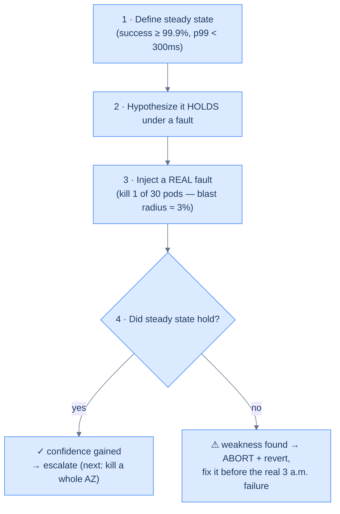

# 35. Failure injection and chaos engineering

## TL;DR
> Every resilience pattern in this book — retries, circuit breakers, redundancy, autoscaling — is a *hope* until you've verified it under real failure. **Chaos engineering** verifies it: you deliberately inject realistic faults (kill an instance, add latency, blackhole a dependency, lose a zone) and check whether the system holds. The method is a controlled experiment: define a **steady state** (a measurable signal of "healthy" — success rate, p99 latency, throughput), **hypothesize** it survives a specific fault, **inject** that fault, and **measure** the deviation. The five principles: build the hypothesis around steady state, vary **real-world** events, run in **production** (only real traffic and dependencies reveal true behavior), **automate** it to run continuously, and — above all — **minimize the blast radius** (start with one instance / 1% of traffic, with an abort condition). Netflix invented the discipline with **Chaos Monkey** (2011), which randomly kills production instances *during business hours*; the payoff arrived on **21 April 2011** when an AWS outage felled half the internet and Netflix kept streaming. Chaos *validates* resilience — it doesn't create it, so build the patterns first, then prove them.

## 1. Motivation

On **21 April 2011**, Amazon's US-East-1 region suffered a major outage: a cascade of **Elastic Block Store (EBS)** failures that took down a who's-who of the internet — Reddit, Quora, Foursquare, and dozens more services that depended on those volumes. It lasted for days for some. And yet **Netflix kept streaming**, with most users noticing nothing. That wasn't luck. Netflix had recently moved to AWS and made a deliberate bet: in the cloud, **individual failures are inevitable**, so rather than try to prevent them, they would design every service to *survive* them — avoid EBS as primary storage, spread redundantly across availability zones, and depend on services (S3, SimpleDB, Cassandra) that weren't in the blast path. Crucially, they didn't just *design* for failure and hope; they **caused failure constantly, on purpose,** with a tool called **Chaos Monkey**.

Chaos Monkey, born at Netflix in 2011, does something that sounds insane the first time you hear it: **during business hours, it randomly picks production instances and kills them.** The point is psychological as much as technical — if instances are *always* dying, engineers have no choice but to build services that tolerate it, and "resilience" stops being a slide in an architecture review and becomes a property you can't avoid testing. By the time the real AWS outage hit, Netflix's systems had already survived thousands of instance deaths, so a region-level event was just a bigger version of a Tuesday. The Simian Army grew from there — Chaos Gorilla to kill a whole availability zone, Latency Monkey to inject delays — and the broader practice became **chaos engineering**, codified in the *Principles of Chaos Engineering* (2017).

The instinct this lesson installs is uncomfortable but correct: **you do not know your system is resilient until you have broken it.** Every circuit breaker ([Lesson 21](/cortex/system-design/distributed-patterns/circuit-breakers-and-bulkheads)), every retry ([Lesson 17](/cortex/system-design/distributed-patterns/idempotency-retries-backoff)), every failover and autoscaler ([Lesson 34](/cortex/system-design/production-operations/capacity-planning-and-autoscaling)) is untested code on the most important path you have — the failure path — and the failure path, by definition, only runs when things are already going wrong. Chaos engineering runs it *on your schedule, with the blast radius you choose,* instead of at 3 a.m. at full scale.

## 2. Intuition (Analogy)

Chaos engineering is a **vaccine**, and the analogy is exact in a way "fire drill" isn't. A vaccine doesn't *simulate* a pathogen — it introduces a **real (attenuated) pathogen, in a small controlled dose, into a real body**, so the body either proves it can handle it or reveals (safely) that it can't. A fire drill is a *simulation* — there's no real fire — but chaos engineering injects **real faults** (it really kills the instance, really adds the latency) into the **real production system**, just in a **bounded dose**. That's a vaccine, not a drill: small, real, controlled exposure to the thing that could otherwise kill you.

The pieces map cleanly:

- The **steady state** is the patient's healthy vitals — the baseline you measure before and during.
- The **dose** is the **blast radius**: you inject the fault into *one* instance or *1%* of traffic, not the whole body, so even if the patient reacts badly the harm is contained.
- The **adverse reaction** is the **weakness you discover** — better to find it from a controlled dose with a doctor watching than from catching the full disease in the wild.
- The **abort condition** is the doctor with epinephrine standing by: if the reaction is severe, you stop immediately.
- And **running it in production** is the whole point — a vaccine tested only in a petri dish (staging) tells you far less than one given to a real body at real scale.

The related practice of a scheduled, all-hands chaos exercise — Amazon calls these **GameDays** — is the organized vaccination clinic: a planned day where the team deliberately injects bigger failures with everyone watching and ready to respond. Vaccine, dose, adverse reaction, abort, real body — hold that, and "deliberately break production" stops sounding reckless and starts sounding like medicine.

## 3. Formal definitions

**Chaos engineering** is the discipline of running controlled experiments on a system to build confidence in its ability to withstand turbulent conditions in production. The unit is the **experiment**, structured as:

1. **Define steady state** — a *measurable* output that signals healthy behavior (success rate ≥ 99.9%, p99 < 300 ms, orders/sec), expressed in user-facing signals, **not** internal implementation.
2. **Hypothesize** that steady state *continues* during a fault (control group vs. experimental group).
3. **Inject** a realistic, real-world fault into the experimental group.
4. **Measure** the deviation. A held hypothesis = confidence gained; a broken one = **a weakness found** (the goal).

The five **Principles of Chaos Engineering**:

| Principle | Why |
|---|---|
| Build a hypothesis around **steady state** | you can only tell if you broke something if you defined "healthy" first |
| Vary **real-world events** | inject the failures that actually happen (instance death, latency, zone loss), not contrived ones |
| Run in **production** | only real traffic, scale, config, and dependencies reveal true resilience |
| **Automate** to run continuously | resilience regresses as the system changes; re-verify it on every deploy |
| **Minimize blast radius** | start tiny (one instance, ~1% traffic), with an abort condition; expand only as confidence grows |

Common **fault types** (escalating in severity): terminate an **instance/pod**; inject **latency**; inject **errors** (5xx from a dependency); exhaust a **resource** (CPU, memory, disk, file descriptors); **blackhole** a dependency (deny all traffic to it); cut the **network** (partition); and lose a whole **availability zone or region**. The stub's progression captures the tooling ladder: the crudest fault injection is a literal `kill -9` on a process; the mature end is a declarative tool — **Chaos Mesh**, **LitmusChaos**, **Gremlin**, or **AWS Fault Injection Simulator** — that scopes and schedules experiments with built-in blast-radius controls.



<p align="center"><strong>The experiment loop. Crucially, "no" is not a failure of the experiment — it's the success: you found a latent weakness in a 3% blast radius instead of at full scale during a real outage.</strong></p>

## 4. Worked Example — does checkout survive a dead pod?

Checkout runs **30 pods**. You want to verify the claim everyone *assumes*: "losing one pod is a non-event."

**Steady state.** At normal traffic, checkout success rate is **≥ 99.9%** and p99 latency **< 300 ms** — measured continuously via the golden signals ([Lesson 32](/cortex/system-design/production-operations/observability)).

**Hypothesis.** *If we kill one of the 30 checkout pods, steady state holds:* Kubernetes reschedules a replacement, the load balancer routes around the dead pod via readiness checks, and the autoscaler keeps the fleet sized. Success rate and p99 should stay within steady state.

**Experiment.** Terminate exactly **one** pod — blast radius `1/30 ≈ 3.3%` — during business hours, with an abort condition: *halt and revert if success rate drops below 99% or p99 exceeds 1 s.* Watch the signals.

**Result A — the hypothesis holds.** Success rate is unchanged; p99 shows a brief, sub-second blip while traffic redistributes; a new pod is running within seconds. You've *verified* (not assumed) that single-pod loss is a non-event, and you can escalate: next experiment, kill a whole availability zone (Chaos-Gorilla-style) to test multi-AZ failover.

**The failure case — the hypothesis is refuted, and that's the win.** You kill the pod and the success rate *drops to 96% for 30 seconds* before recovering. The experiment just found a real bug — in a controlled 3% blast radius — and the likely culprits are exactly the things you'd never have noticed until a real failure: the **load balancer's health check interval is 30 s**, so it kept routing traffic to the dead pod's address for half a minute ([Lesson 29](/cortex/system-design/application-architecture/service-discovery-and-mesh)'s stale-eviction problem); or there was **no readiness gating**, so the replacement pod received traffic before it was warm; or the killed pod held a **singleton resource** (a leader lock, the only consumer of a queue) with no failover. Whatever it is, you found it *on your terms*: 3% of users saw errors for 30 seconds during a watched experiment, and you hit the abort, reverted, and filed a fix — instead of discovering it when a real instance died at 3 a.m. and took out a far larger slice with nobody watching. **A refuted hypothesis is the entire point**: it converts an unknown, latent, full-blast-radius production weakness into a known, bounded, fixable finding. That is the trade chaos engineering makes — pay a small, controlled cost now to avoid an uncontrolled catastrophe later.

## 5. Build It

The crude version is real: `kill -9 $(pgrep checkout)` on one box *is* fault injection. The mature version is declarative and scoped. Here's a **Chaos Mesh** experiment that kills exactly one checkout pod — note `mode: one`, the blast-radius control:

```yaml
# Chaos Mesh: kill ONE checkout pod. Blast radius is a single pod, not the deployment.
apiVersion: chaos-mesh.org/v1alpha1
kind: PodChaos
metadata: { name: kill-one-checkout }
spec:
  action: pod-kill
  mode: one                       # exactly ONE matching pod (blast-radius control)
  selector:
    namespaces: [prod]
    labelSelectors: { app: checkout }
  duration: "30s"
  # Hypothesis: killing 1 of 30 pods keeps checkout success-rate >= 99.9%. If a watched metric
  # breaches the abort threshold during the window, an operator (or automation) halts the run.
```

And the safety net that makes it an *experiment* rather than an *outage* — the steady-state guard that aborts the moment the hypothesis is refuted:

```python
def run_experiment(inject_fault, steady_state_ok, max_seconds=30):
    if not steady_state_ok():                     # don't start chaos on an already-sick system
        return "SKIP: not in steady state"
    fault = inject_fault()                         # kill a pod / add latency / blackhole a dependency
    try:
        for _ in range(max_seconds):
            if not steady_state_ok():              # hypothesis REFUTED -> a weakness, stop the blast
                return "ABORT: steady state broke — weakness found"
            sleep(1)
        return "PASS: steady state held — confidence gained"
    finally:
        fault.revert()                             # ALWAYS clean up — pass, fail, or exception
```

The two ideas that make this safe are visible in the code. `mode: one` (not `all`) is the **blast radius** — the experiment can hurt at most one pod's worth of traffic. And the guard's `if not steady_state_ok(): return "ABORT"` plus the `finally: fault.revert()` is the **abort condition + cleanup** — the experiment stops and undoes itself the instant it crosses the line, so a refuted hypothesis costs you seconds of degraded service on a sliver of traffic, not an outage. Everything else — picking the fault, defining `steady_state_ok` from your golden signals, scheduling it — is detail around those two guarantees. Start here, in staging, then move to production with the same controls and ramp the blast radius up only as each experiment passes.

## 6. Trade-offs

| Decision | Safer / lower-signal | Riskier / higher-signal | Choose by |
|---|---|---|---|
| Where | **staging** first | **production** (real traffic/scale) | staging to shake out basics; prod for true confidence |
| Blast radius | one instance / ~1% | a zone / large % | start tiny; expand only after safety controls prove out |
| Cadence | scheduled **GameDay** (humans watching) | **automated/continuous** (Chaos Monkey) | novel/large experiments → GameDay; regressions → automate |
| Fault severity | instance kill, latency | zone/region loss, partition | escalate as lower-severity experiments pass |

The headline trade is **realism vs. risk**, and the Principles resolve it: experiments are only fully trustworthy **in production** (staging has different scale, config, data, and dependencies, so passing there is necessary but not sufficient — the [Lesson 31](/cortex/system-design/application-architecture/multi-tenancy)-style "it worked at small scale" trap), but production chaos is only *responsible* with a **small blast radius and an abort condition**. So the playbook is: prove the mechanics in staging, then run in production starting at one instance / ~1% of traffic with automated halting, and **escalate severity only as confidence accrues** (kill a pod → kill many → kill a zone). Automate the small, repeatable experiments (instance kills) so resilience is **continuously regression-tested** as the system changes, and reserve **GameDays** for the big, novel scenarios where you want every expert in the room. The non-negotiables: never run chaos without **observability** to measure steady state ([Lesson 32](/cortex/system-design/production-operations/observability)), never run it without an **abort/revert**, and never run it on a system that has **no resilience to validate** — chaos proves the patterns work, it doesn't conjure them.

## 7. Edge cases and failure modes

- **No blast-radius control or abort condition.** Chaos without a scope limit and a halt metric isn't an experiment — it's a self-inflicted outage. Always scope (`mode: one`, a small % of traffic), define an abort threshold on a steady-state signal, and be able to revert instantly.
- **Chaos without observability.** If you can't *measure* steady state, you can't tell whether the experiment broke anything — you're injecting failure blind. Observability ([Lesson 32](/cortex/system-design/production-operations/observability)) is a hard prerequisite, not a nice-to-have.
- **Chaos before resilience.** Running experiments on a system with no redundancy, retries, or circuit breakers just confirms it breaks — painfully and in production. Build the resilience patterns ([Lessons 17](/cortex/system-design/distributed-patterns/idempotency-retries-backoff)/[21](/cortex/system-design/distributed-patterns/circuit-breakers-and-bulkheads)/[34](/cortex/system-design/production-operations/capacity-planning-and-autoscaling)) first; chaos *validates*, it doesn't create.
- **Trusting staging-only chaos.** Staging differs from production in scale, config, data, and dependencies, so a resilience property that holds there can fail at production scale — the reason the Principles insist on running in production (with controls). Staging chaos is a first gate, not proof.
- **Running unattended at the wrong time.** Chaos Monkey deliberately runs **during business hours** so engineers can respond. Unattended 3 a.m. chaos with no one watching is how an experiment quietly becomes an unmonitored outage.
- **Stale hypotheses (resilience regresses).** A system that survived single-pod loss last quarter may not now — a new singleton dependency, a removed replica, a changed timeout. **Automate** experiments to run continuously (on every deploy) so resilience is re-verified as the system evolves, the same way tests guard correctness.

## 8. Practice

> **Exercise 1 — Design the experiment.**
> You want to verify checkout survives losing its Redis cache. Write the **steady state**, **hypothesis**, **fault**, **blast-radius control**, and **abort condition** — and say what each *outcome* teaches you.
>
> <details>
> <summary>Solution</summary>
>
> **Steady state:** checkout success rate ≥ 99.9% and p99 < 300 ms at normal traffic. **Hypothesis:** if Redis becomes unavailable, checkout still meets steady state by falling back to the database (degraded but working — the "fail open" idea from [Lesson 20](/cortex/system-design/distributed-patterns/rate-limiting)). **Fault:** blackhole traffic to Redis (deny the connection) for the checkout path. **Blast radius:** scope to **one pod or ~1–5% of traffic**, in business hours, humans watching. **Abort condition:** halt and restore Redis access if success rate drops below 99% or p99 exceeds 1 s. **Outcomes:** if steady state **holds**, you've *proven* the cache is truly optional (real confidence, not a hopeful comment in the code). If it **breaks**, you've discovered — in a 5% blast radius — that the cache is a **hidden hard dependency** (e.g. the DB can't take the full load, or there's no fallback path), *before* a real Redis outage takes down 100% of checkout at 3 a.m. Either result is valuable; the broken one is more valuable.
>
> </details>

> **Exercise 2 — Why production, not just staging?**
> A team runs all chaos in staging, where it always passes — yet they keep having production outages from instance failures. Why does staging chaos give false confidence?
>
> <details>
> <summary>Solution</summary>
>
> Staging differs from production in the exact dimensions that govern resilience: **scale** (3 pods vs 300 — connection limits, thundering herds, and autoscaler behavior differ; a dependency that copes at staging load saturates at prod load), **configuration** (timeouts, replica counts, feature flags, health-check intervals may not match), **traffic** (synthetic and low-cardinality vs real, bursty, adversarial), **data** (tiny vs huge — different query plans, hot shards), and **dependencies** (stubs/mocks vs the real, sometimes-slow downstreams). A resilience property verified at staging's scale and config can fail at production's — which is exactly why the *Principles of Chaos Engineering* say to **run experiments in production** (with blast-radius controls and aborts). Staging chaos is a useful first gate to shake out obvious breakage; it is not proof of production resilience.
>
> </details>

> **Exercise 3 — Spot the reckless experiment.**
> A team, newly excited about chaos, schedules a job to kill **50% of all production pods every night at 3 a.m.**, with no abort condition and no stated hypothesis. List what's wrong and how to fix it.
>
> <details>
> <summary>Solution</summary>
>
> Four problems, each a violated principle. **(1) Blast radius far too large** — killing 50% of pods at once will almost certainly breach steady state; that's not an experiment, it's a nightly outage. Start at **one pod / a small %** and escalate only as experiments pass. **(2) No abort condition** — if it starts failing, nothing halts it; define a steady-state metric and an **automatic halt + revert**. **(3) 3 a.m., unattended** — Chaos Monkey runs in **business hours** precisely so engineers are present to respond; unattended chaos guarantees that a bad experiment becomes an unmonitored incident. **(4) No hypothesis / steady state** — even if it "passes," they've measured nothing and learned nothing. The fix is the Principles applied: a **hypothesis around a measurable steady state**, the **smallest blast radius** that yields signal, an **abort condition**, run **during business hours**, ramping severity up **only as confidence grows** — and, ideally, automated to run on every deploy so resilience is continuously re-verified.
>
> </details>

## Your Turn

Before you move on, check your understanding with the coach — explain the idea, apply it, weigh the trade-offs, then defend your reasoning.

<div class="concept-coach"></div>

## In the Wild

- **[Netflix — "Lessons Netflix Learned from the AWS Outage"](https://netflixtechblog.com/lessons-netflix-learned-from-the-aws-outage-deefe5fd0c04)** (April 2011) — the §1 motivation, first-hand: how designing for failure (and practicing it with Chaos Monkey) kept Netflix streaming through the EBS outage that toppled much of the internet.
- **[The Netflix Simian Army](https://netflixtechblog.com/the-netflix-simian-army-16e57fbab116)** (2011) — Chaos Monkey and its siblings (Chaos Gorilla kills a zone, Latency Monkey injects delay): the origin of deliberately, continuously breaking production to force resilience.
- **[Principles of Chaos Engineering](https://principlesofchaos.org/)** (2017) — the canonical five principles (steady-state hypothesis, real-world events, run in production, automate, minimize blast radius) that turn "break things" into a rigorous experiment.
- **[Chaos Mesh](https://chaos-mesh.org/)** (CNCF) — the declarative Kubernetes chaos platform behind §5: pod-kill, network latency/partition, and resource faults, scoped by selector and mode for blast-radius control. (See also **[AWS Fault Injection Service](https://aws.amazon.com/fis/)** and **[Gremlin](https://www.gremlin.com/)**.)
- **[Rosenthal & Jones — *Chaos Engineering*](https://www.oreilly.com/library/view/chaos-engineering/9781492043850/)** (O'Reilly) — the book-length treatment by the practitioners who formalized the field, including running experiments and GameDays at scale.

---

> **Next:** [36. Incident response and postmortems](/cortex/system-design/production-operations/incident-response-and-postmortems) — chaos engineering finds weaknesses on your schedule, but some failures will still surprise you in the wild. When they do, how you respond — and what you learn afterward — separates teams that improve from teams that repeat. Next, the final lesson of this chapter: incident command, severity levels, the blameless postmortem, and why "human error" is never a root cause.
