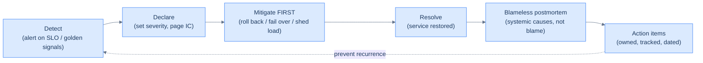

# 36. Incident response and postmortems

## TL;DR
> No matter how well you design, test, and chaos-engineer, production will still surprise you — so the skill that matters is *how you respond* and *what you learn*. **Incident response** borrows the **Incident Command System** from firefighters: a clear **Incident Commander** who coordinates and decides (and deliberately does *not* do the fixing), an **Operations lead** who actually mitigates, a **Communications lead** who updates stakeholders, and a scribe who records the timeline. Size the response with **severity levels** (SEV1 = critical/all-hands → SEV3 = minor), and the cardinal rule of the live incident is **mitigate before diagnose**: stop the bleeding (roll back, fail over, shed load) *first*, understand it later — that's what keeps MTTR (time to restore) low. Afterward, write a **blameless postmortem**: a factual timeline, a *systemic* root-cause analysis, and concrete **owned, tracked action items**. The principle that makes it work — from Sidney Dekker via John Allspaw's Just Culture — is that **"human error" is never a root cause; it's a symptom** of a system that allowed the error. GitLab's 2017 `rm -rf` disaster is the canonical proof: the real failures weren't the tired engineer, but the missing guardrail and the backups that had been silently broken for months.

## 1. Motivation

Late on **31 January 2017**, a GitLab engineer was wrestling with a database replication problem during a spam-cleanup. To fix a stuck replica, he needed to wipe a PostgreSQL data directory and re-sync it. He typed `rm -rf` on the directory — and, exhausted and working across two near-identical servers, ran it against the **primary** production database instead of the broken secondary. By the time he hit Ctrl-C, **~300 GB of live production data was gone, with about 4.5 GB left.** Then came the part that turned a bad night into a legend: GitLab discovered that **none of their five separate backup and replication mechanisms were actually working** — they were either misconfigured, silently failing, or never set up. The most recent usable snapshot was about six hours old, so **~6 hours of production data** — roughly 5,000 projects, 5,000 comments, and 700 new user accounts — was **permanently lost.** GitLab then did something almost unheard of: they **live-streamed the entire recovery** on YouTube and published a brutally honest, blameless postmortem.

Here's the thing the headlines got wrong. The story is *not* "an engineer fat-fingered `rm -rf`." That engineer did something any tired human at 11 p.m. could do, and treating *him* as the cause would teach GitLab nothing except to make people afraid. The real, fixable failures were **systemic**: a destructive command could be run directly against the primary with no guardrail, two critical servers were nearly indistinguishable at the prompt, and — the genuine catastrophe — **the backups had been failing silently for ages and nobody knew.** The `rm -rf` merely *revealed* a disaster that was already sitting there waiting.

That reframing is the whole subject of this final lesson. Incidents are inevitable; the work of [observability](/cortex/system-design/production-operations/observability), [safe deploys](/cortex/system-design/production-operations/deployment-strategies), and [chaos engineering](/cortex/system-design/production-operations/chaos-engineering) shrinks them but never eliminates them. So the question becomes: when the pager fires, do you have a *structured way to respond*, and afterward, do you *learn the systemic lesson* — or do you find someone to blame, fix nothing, and meet the same outage next quarter under a new name?

## 2. Intuition (Analogy)

A production incident is a **hospital emergency room**, and the whole discipline maps onto how a good ER runs a crisis.

- A critical patient arrives. One person — the **attending physician running the code** — calls the shots: who does what, what we try next, when we escalate. Crucially, the attending **doesn't personally do every procedure**; if they're elbow-deep in chest compressions they can't see the whole patient. That's the **Incident Commander**: coordinate and decide, don't tunnel-vision on fixing.
- **Nurses and specialists** do the hands-on work — intubate, push drugs, run the lines — directed by the attending. Those are the **Operations responders**.
- Someone **updates the family** in the waiting room so the clinicians aren't interrupted every thirty seconds. That's the **Communications lead**.
- The ER **triages by severity**: a heart attack jumps ahead of a sprained ankle. That's your **SEV1 vs SEV3** — size the response to the stakes.
- And the deepest parallel: a good ER **stabilizes before it diagnoses.** You restore the airway and stop the bleeding *first*; you figure out the underlying disease *after* the patient is stable. That's **mitigate before diagnose** — roll back, fail over, *then* investigate.

After a death, hospitals hold a **Morbidity & Mortality (M&M) conference** — a structured review of what went wrong, conducted (at its best) *without blame*, to improve the system. The M&M conference is, quite literally, the ancestor of the **blameless postmortem.** And it carries the same hard-won wisdom: if a patient died because a nurse grabbed the wrong vial, the fix that *saves the next patient* is not "fire the nurse" — it's "**why were two lethal, look-alike vials stored side by side with near-identical labels?**" The human reached for the wrong thing because the *system* made the wrong thing easy to reach. Fire the nurse and the look-alike vials are still there for the next one.

## 3. Formal definitions

An **incident** is an unplanned disruption or degradation of service; **incident response** is the structured process to *restore service* and then *learn*. Mature response borrows the **Incident Command System (ICS)** — created by firefighters in 1968 to manage wildfires — which Google adapted as IMAG. Its roles separate three jobs that, mashed together, produce chaos:

| Role | Does | Does *not* |
|---|---|---|
| **Incident Commander (IC)** | coordinates, decides, keeps everyone aligned, escalates | personally fix things (so they keep the big picture) |
| **Operations lead** | the hands-on mitigation and repair | run comms or make scope calls |
| **Communications lead** | status updates to stakeholders/customers/execs | dig in the logs |
| **Scribe / Planning** | records a factual, timestamped timeline; tracks follow-ups | (supports the above) |

The "**three Cs**" summarize the IC's job: **Command, Control, Communication.** Response is sized by **severity**:

| Severity | Meaning | Response |
|---|---|---|
| **SEV1** | critical — major outage, data loss, security breach | all-hands, dedicated IC, exec + customer comms |
| **SEV2** | significant — important feature down, major degradation | on-call + IC, status page |
| **SEV3** | minor — limited impact, workaround exists | normal on-call, lightweight |

Key metrics: **MTTD** (mean time to *detect*), **MTTA** (to *acknowledge*), and **MTTR** (to *restore/resolve* — the DORA "time to restore" from [Lesson 33](/cortex/system-design/production-operations/deployment-strategies)). The live-incident rule that minimizes MTTR is **mitigate before diagnose**: restore service first (roll back, fail over, shed load), understand the bug in the postmortem.

A **blameless postmortem** is the written retrospective: a factual timeline, the impact, a **systemic** root-cause analysis, and **owned, tracked action items**. Its founding principle, from **Sidney Dekker's** "New View" (popularized for engineers by **John Allspaw's** 2012 Etsy essay *"Blameless PostMortems and a Just Culture"*), is that **"human error" is not a cause — it is a *symptom* of deeper trouble in the system**, and therefore the *starting point* of an investigation, not its conclusion. A useful tool is **5 Whys** (ask "why?" until you reach a systemic factor), with one caveat: complex-system failures are almost always **multi-causal**, so capture *contributing factors* (plural), not a single mythical "root cause."



<p align="center"><strong>The incident lifecycle. Mitigate comes before diagnose; the postmortem and its action items feed back to prevent the next one. A postmortem without tracked action items is just a sad story.</strong></p>

## 4. Worked Example — a SEV1, start to postmortem

**14:02 UTC** — checkout v2 deploys; the canary auto-promotes to 100%. **14:05** — error rate crosses the 5% SLO alert ([Lesson 32](/cortex/system-design/production-operations/observability)). **14:06** — the on-call engineer is paged (**MTTD ≈ 1 min**). They glance at the golden-signals dashboard: checkout is throwing 5xx on ~22% of requests. **14:08** — they **declare a SEV1**, become (or hand off) **Incident Commander**, and open an incident channel. The IC now *coordinates* rather than dives into code: they direct the **Ops lead** to **roll back to v1 immediately** ([Lesson 33](/cortex/system-design/production-operations/deployment-strategies)) — *mitigate before diagnose* — and ask the **Comms lead** to post a status-page update. **14:11** rollback begins; **14:18** it completes, error rate returns to baseline, incident resolved (**MTTR ≈ 13 min**). Notice what the IC did *not* do: spend 40 minutes reading logs to understand the bug while users kept failing. They stopped the bleeding first.

**The next day — the blameless postmortem.** The team reconstructs a factual timeline and runs the root-cause analysis with 5 Whys: *Why did checkout error?* v2 had a null-pointer bug on a rare cart shape. *Why did v2 reach 100% of users?* The canary analysis only checked "are the pods healthy?", not the error rate. *Why?* The analysis template was added without an error-rate gate. *Why?* No one owned canary config and there was no review of it. The **contributing factors** (plural) are now clear and *systemic*: a missing canary error-gate, and a thin deploy-review process — not "the person who wrote v2." The action items are concrete and owned: add an error-rate gate to the canary; require review of rollout config; add a test that the gate actually triggers a rollback.

**The failure case — a blameful culture.** Run the same incident at a company that blames people, and the postmortem concludes: *"Root cause: Maria pushed a bad deploy. Maria has been reminded to be more careful."* Watch what that does. The *real* cause — the canary that didn't gate on errors — is never found, because the investigation stopped at a name; so the **same outage recurs next month** with a different engineer's name on it. Worse, Maria and everyone watching learn that **mistakes get you punished**, so the next person who notices something odd during a deploy stays quiet, and information that could have prevented the *next* incident goes underground. Blame feels like accountability but produces the opposite of safety. The blameless version — *"our system let an un-vetted deploy reach 100% and made it hard to catch"* — fixes the canary gate and prevents the entire *class* of incident. This is Dekker's principle made operational: **"Maria pushed a bad deploy" is a symptom; the absent guardrail is the cause** — exactly as GitLab's `rm -rf` was a symptom of missing guardrails and dead backups (§1).

## 5. Build It

The artifact every senior engineer should be able to produce from memory is a **postmortem template** — here it is, filled in for the §4 incident. Notice the shape: facts, systemic analysis, blameless language, and *owned, tracked* actions.

```markdown
# Postmortem: checkout SEV1 — v2 error spike        Status: final    Severity: SEV1

## Summary
A bad checkout deploy (v2) auto-promoted past a canary that didn't check error rate,
causing ~22% of checkouts to fail for 13 minutes until an on-call rollback. No data loss.

## Impact
- Window: 14:05–14:18 UTC (13 min).  Detected 14:06 (MTTD ~1 min), restored 14:18 (MTTR ~13 min).
- ~22% of checkouts failed; ~30,000 failed requests; ~0.4% of monthly error budget spent.

## Timeline (UTC — facts only, no blame)
- 14:02  checkout v2 deployed; canary auto-promoted to 100%
- 14:05  error rate crosses 5% SLO alert
- 14:06  on-call paged
- 14:08  SEV1 declared; IC assigned; incident channel opened
- 14:11  IC directs rollback to v1 (mitigate first); Comms posts status page
- 14:18  rollback complete; error rate normal; resolved

## Root-cause analysis (systemic — "human error" is a symptom, not a cause)
- Why did checkout error?     v2 had a null-pointer bug on a rare cart shape.
- Why did v2 hit 100%?        canary analysis checked "pods healthy", not error rate.
- Why?                        the analysis template shipped without an error-rate gate.
- Why?                        no owner/review for canary config; the gate was never tested.
  Contributing factors (plural): missing canary error-gate + thin deploy review.

## What went well / what went poorly
- Well: 1-min detection; mitigate-first rollback kept MTTR to 13 min.
- Poorly: the canary should have caught this at 5% traffic, not after full rollout.

## Action items (owned, tracked, dated — NOT "be more careful")
- [ ] Add an error-rate gate to canary analysis            @maria  2026-02-10  TICKET-123
- [ ] Require review of rollout/analysis config            @sam    2026-02-14  TICKET-124
- [ ] Add a test that the canary gate actually rolls back  @maria  2026-02-12  TICKET-125
```

Three things make this template *work* rather than gather dust. The **timeline is facts only** — timestamps and actions, no "Maria should have…" — because the moment blame enters, people stop volunteering the messy details you most need. The **root-cause section asks "why" past the human** until it lands on something in the *system* you can change (a missing gate, not a tired person). And the **action items are owned, dated, and ticketed** — a postmortem whose actions are vague ("be more careful") or unassigned is, as the saying goes, just an apology; the loop in the §3 diagram only closes if those tickets actually ship. Keep the whole thing short enough that people read it, and *publish it* — the most valuable postmortems (GitLab's, Cloudflare's) are public precisely because the lessons generalize.

## 6. Trade-offs

| Decision | One way | The other | Choose by |
|---|---|---|---|
| During the incident | **mitigate first** (rollback/failover) | diagnose first | almost always mitigate first — restore fast, learn later |
| Alert sensitivity | tight (low MTTD) | loose (less noise) | tight on **SLO-violating symptoms**; everything else is a dashboard |
| Process weight | full ICS (IC + leads) | one engineer | scale to severity: SEV1 full, SEV3 lightweight |
| Postmortem stance | **blameless** | "accountability" via blame | blameless — blame hides the real causes |
| Postmortem trigger | every SEV1/SEV2 | only "big" ones | low threshold; near-misses are free lessons |

The two most misunderstood trade-offs deserve a sharper word. First, **mitigate vs. diagnose**: it is genuinely tempting to "just understand it first," but every minute spent diagnosing while users fail is MTTR you can't get back — restore service (the rollback, the failover), *then* investigate from the safety of a stable system. (The one exception is when you're unsure a mitigation is *safe* — e.g. a possibly-irreversible migration from [Lesson 33](/cortex/system-design/production-operations/deployment-strategies) — where a moment's confirmation is warranted.) Second, **blameless ≠ unaccountable**, which is the objection every skeptic raises. Accountability in a Just Culture means people are accountable for *providing an honest account* and for *fixing the system* — not for being punished. Blame optimizes for *finding someone*; blamelessness optimizes for *finding the cause* — and only the second one prevents the next outage. Persistent *negligence or malice* is a separate HR matter; the overwhelming majority of incidents are competent people defeated by a system that made the error easy, and those you fix with engineering, not punishment.

## 7. Edge cases and failure modes

- **Blameful culture drives the truth underground.** Punish people for mistakes and they hide them — so the real causes never surface and incidents recur (§4). Blameless postmortems assume good intent and reasonable decisions given the information at the time; that's what gets you the messy details that actually matter.
- **"Human error" as the conclusion.** Stopping at "the operator ran the wrong command" (GitLab's `rm -rf`) explains nothing fixable. **Human error is the *start* of the investigation** (Dekker): ask what made the error possible or likely — no guardrail, look-alike servers, missing confirmation — and fix *that*.
- **Diagnosing while the system bleeds.** Treating an active SEV1 like a debugging session inflates MTTR and prolongs user pain. Mitigate first (roll back / fail over / shed load); the forensic deep-dive belongs in the postmortem.
- **No incident commander (everyone fixing at once).** Without a coordinator, responders duplicate work, make *conflicting* changes, and nobody owns the decision to escalate or roll back. The IC coordinates and explicitly does **not** fix — separation of command from hands-on work is what firefighters learned the hard way.
- **Action items that never ship.** A postmortem whose follow-ups are vague, unowned, or untracked guarantees the repeat. Make them concrete, assigned, dated, and ticketed — and protect time to actually do them (the GitLab lesson: the dead backups were a known-ish risk no one had prioritized fixing).
- **Untested backups / recovery (the silent killer).** GitLab's true catastrophe wasn't the delete — it was *five* backup mechanisms that didn't work. A backup you have never *restored from* is a hope, not a backup. Regularly **test restores** and recovery runbooks; chaos-engineer them ([Lesson 35](/cortex/system-design/production-operations/chaos-engineering)).
- **Alert fatigue / poor detection.** Too many alerts ([Lesson 32](/cortex/system-design/production-operations/observability)) get ignored, raising MTTD; too few leave you blind. Alert on user-facing SLO violations, page humans only for what needs a human, and review alert quality regularly.

## 8. Practice

> **Exercise 1 — Sequence the response.**
> Mid-SEV1, engineer A wants to dig through logs to find the bug before touching anything; engineer B wants to roll back the recent deploy immediately. Who's right, and what's the principle (and its one exception)?
>
> <details>
> <summary>Solution</summary>
>
> **B is right: roll back first.** The principle is **mitigate before diagnose** — during an active incident the priority is to *stop user harm*, and a rollback restores service immediately, whereas diagnosing-first leaves users failing for as long as the investigation takes (directly inflating MTTR / DORA time-to-restore). Restore steady state, *then* analyze the saved logs/traces at leisure in the postmortem. **The one exception:** if you're genuinely unsure a mitigation is *safe* — e.g. the deploy included a possibly-irreversible database migration ([Lesson 33](/cortex/system-design/production-operations/deployment-strategies)), so rolling back the code might break against the new schema — you may need a brief check before acting. But "I want to understand the bug" is *not* such a reason; understanding is the postmortem's job, not the incident's.
>
> </details>

> **Exercise 2 — Rewrite the root cause.**
> A draft postmortem states: *"Root cause: Alice ran `rm -rf` against the production database."* Explain why that's a poor root cause and rewrite it the blameless, systemic way (use the GitLab incident as your guide).
>
> <details>
> <summary>Solution</summary>
>
> It's poor for two reasons: it names a **person** (blameful — which teaches everyone to hide mistakes), and "ran the wrong command" is **human error, which is a *symptom*, not a cause** (Dekker) — it explains nothing you can fix. The investigation should ask *why the system let a single tired human irreversibly destroy production*: **Why** could a destructive command run against the **primary** with no guardrail/confirmation? **Why** were the primary and secondary servers near-indistinguishable at the prompt? **Why** was the loss unrecoverable — *because the backups had been failing silently and no one knew* (GitLab's real disaster). Rewritten: *"Contributing factors: (1) destructive operations could be executed against the primary with no safeguard or confirmation; (2) production and replica servers were easily confused at the CLI; (3) all five backup/replication mechanisms were broken or unconfigured, making recovery impossible."* Action items: add guardrails/confirmations to destructive ops, make prod servers visually distinct, enforce least privilege, and **monitor and regularly test backup restores**. Fix the system that made the error possible and unrecoverable — not the person who tripped the wire.
>
> </details>

> **Exercise 3 — Set severity and roles.**
> A payment failure takes checkout down for *all* users. Assign a severity and the incident-command roles, and state what each person does (and does *not* do).
>
> <details>
> <summary>Solution</summary>
>
> **Severity: SEV1** — a total outage of a critical, revenue-bearing path affecting all users: all-hands, dedicated IC, exec + customer communications. **Roles (Incident Command System):** **Incident Commander** — coordinates the response, decides what to try and when to escalate, keeps the whole picture; **does *not* personally fix** (so they don't tunnel-vision and lose situational awareness). **Operations lead** — the hands-on responder(s) who roll back / fail over / patch, directed by the IC. **Communications lead** — owns the status page and stakeholder/customer/exec updates, so responders aren't interrupted every minute. **Scribe** — keeps a factual, timestamped timeline for the postmortem. The point of the separation is that **coordinating, fixing, and communicating are three different jobs**; mashed into one overwhelmed person they collapse into chaos — which is exactly why firefighters invented the role split and Google SRE adopted it.
>
> </details>

## Your Turn

Before you move on, check your understanding with the coach — explain the idea, apply it, weigh the trade-offs, then defend your reasoning.

<div class="concept-coach"></div>

## In the Wild

- **[GitLab — "Postmortem of database outage of January 31"](https://about.gitlab.com/blog/postmortem-of-database-outage-of-january-31/)** (2017) — the §1 incident in extraordinary, blameless detail: the `rm -rf`, the five broken backups, the ~6 hours lost, and a public document that taught the whole industry how to write a postmortem. Read it in full.
- **[John Allspaw — "Blameless PostMortems and a Just Culture"](https://www.etsy.com/codeascraft/blameless-postmortems)** (Etsy, 2012) — the essay that operationalized Just Culture for engineering: why blame destroys safety and how to investigate the *situation*, not the person.
- **[Google SRE Book — Managing Incidents](https://sre.google/sre-book/managing-incidents/)** and **[Postmortem Culture](https://sre.google/sre-book/postmortem-culture/)** — the Incident Command System roles (IC / Ops / Comms), the three Cs, and the blameless-postmortem practice, from the team that scaled it.
- **[Sidney Dekker — *The Field Guide to Understanding 'Human Error'*](https://www.routledge.com/The-Field-Guide-to-Understanding-Human-Error/Dekker/p/book/9781472439055)** — the safety-science source: the "New View" that human error is a symptom of systemic trouble and the *start* of an investigation, not its conclusion.
- **[Cloudflare — "Details of the Cloudflare outage on July 2, 2019"](https://blog.cloudflare.com/details-of-the-cloudflare-outage-on-july-2-2019/)** — a model public postmortem of a global outage (a regex that pegged CPU everywhere): timeline, mitigation, systemic causes, and concrete fixes. A great companion read on how the best teams dissect failure openly.

---

> **Next:** that closes the **Production Operations** chapter — and with it, the foundations of this book. You can now observe a system ([32](/cortex/system-design/production-operations/observability)), ship to it safely ([33](/cortex/system-design/production-operations/deployment-strategies)), size and scale it ([34](/cortex/system-design/production-operations/capacity-planning-and-autoscaling)), prove its resilience ([35](/cortex/system-design/production-operations/chaos-engineering)), and respond-and-learn when it breaks anyway (this lesson). From here the book turns to **capstones** — end-to-end designs of real systems (a URL shortener, a news feed, a chat system, a payments platform, and more) that weave together everything from the data structures and distributed patterns through to the operational practices you just finished. The building blocks are in your hands; next we build.
