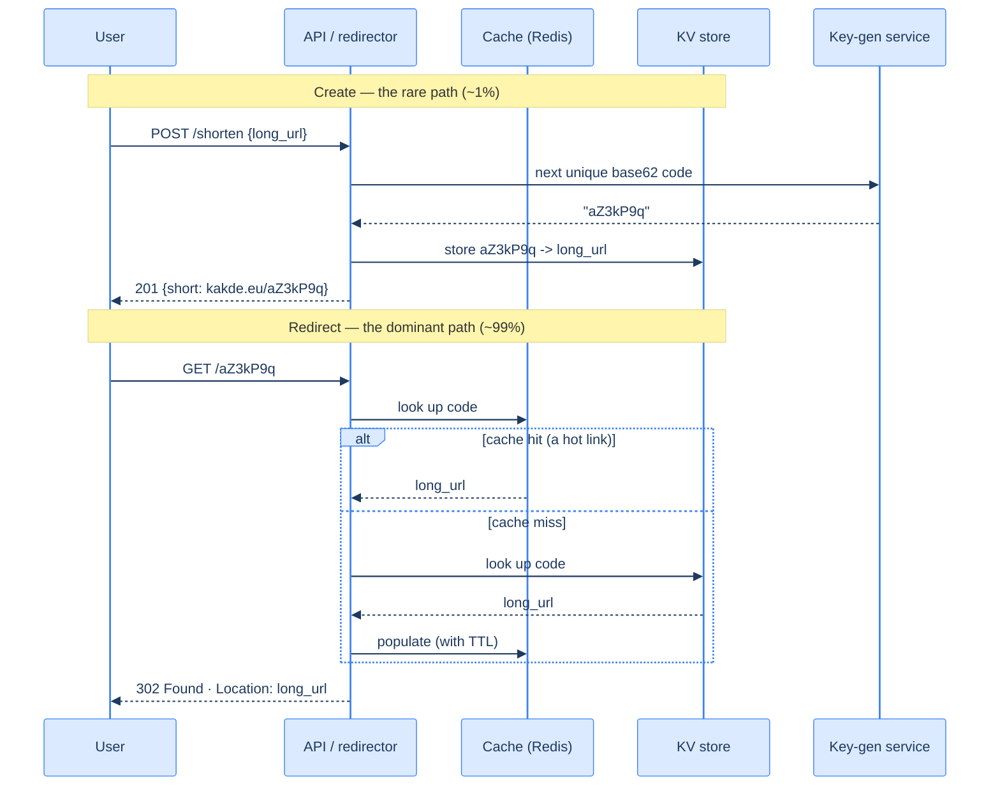

# 37. URL shortener (capstone)

## TL;DR
> A URL shortener maps a short code to a long URL and redirects — and it's the canonical first design because it's *deceptively* simple: a single key-value lookup hiding a pile of real decisions. It is **overwhelmingly read-heavy** (redirects vastly outnumber creates, ~100:1), so the whole architecture bends toward making the redirect a sub-millisecond, heavily-cached point lookup. The short code is **base62** (`[A-Za-z0-9]`); **7 characters gives 62⁷ ≈ 3.5 trillion** codes (6 would run out in months at scale). Generate codes without collisions via a **pre-generated key pool** or a **distributed counter**, not by hashing-and-praying. The hot path is `GET /{code}` → **read-through cache** → KV store → **`302` redirect** (302, not 301, so every click is countable and the destination stays changeable). At 100× the cache (the link popularity is Zipfian, so a small cache covers most reads), the **sharded KV store**, and the **ID generator** are the things that bend — and a CDN at the edge absorbs the redirect storm. This lesson is also the **capstone format** itself: requirements → estimation → API → data → architecture (Mermaid hot path + D2 topology + C4 container view) → bottlenecks → **100× stretch** → trade-offs → prototype.

## 1. Motivation

In **March 2018**, Google announced it was winding down **goo.gl**, its URL shortener — it stopped minting new links, and years later, in **2025**, began switching off the inactive ones. Think about what that means. A short link is an implicit *forever-promise*: somebody put `goo.gl/xY3z` in a printed flyer, a slide deck, a QR code, a research paper — places you can't go back and edit. The moment the shortener stops resolving that code, the destination vanishes from every one of those places at once. A URL shortener isn't a cute toy; it's a **durable, read-heavy redirection layer that the rest of the world has hard-coded references into**, and when it fails, it fails *everywhere link-rot can reach*.

That tension is exactly why the URL shortener is the canonical first capstone. On the surface it's a one-line idea — "store a short code, redirect to the long URL." Underneath, it forces every decision this book has built toward: it's read-heavy, so you reach for [caching](/cortex/system-design/building-blocks-caching); it must scale, so you reach for [sharding](/cortex/system-design/building-blocks-sharding-and-partitioning); it must never lose a mapping, so you think about durability; it must generate unique codes under concurrency, so you think about distributed ID generation; and it must survive a redirect storm, so you think about CDNs and the shape of real traffic. It's small enough to hold in your head and rich enough to exercise the whole toolkit.

This is also the **dry run for the capstone format.** Every capstone (37–46) follows the same arc: pin the **requirements**, do the **back-of-envelope estimation**, sketch the **API** and **data model**, draw the **architecture** (a Mermaid hot-path sequence, a D2 topology, and a C4 container view), find the **bottlenecks**, then answer the question that separates a design from a daydream — **"what breaks at 100×?"** — and close with **trade-offs** and an **illustrative prototype**. Let's build it.

## 2. Requirements and scope

Pin down *what we're building* before *how*, because the "how" is dictated by a couple of numbers and constraints.

**Functional:**
- **Shorten:** given a long URL, return a short code (`POST /shorten` → `kakde.eu/aZ3kP9q`).
- **Redirect:** given a short code, redirect to the original URL (`GET /{code}` → `302`).
- *Optional:* custom aliases, expiry/TTL, and per-link click analytics.

**Non-functional (these drive the design):**
- **Read-heavy:** redirects ≫ creates — assume **~100:1**. The redirect path must be fast and cheap; the create path can be heavier.
- **Low latency:** a redirect should add only a few milliseconds — it sits in front of someone else's page load.
- **High availability + durability:** a lost mapping is a dead link forever (§1). Availability matters more than strong consistency here — a brand-new code being readable a few hundred milliseconds late is fine (it's an [AP-leaning](/cortex/system-design/foundations-cap-and-pacelc) workload).
- **Short, hard-to-guess codes** that don't run out.

**Out of scope:** spam/abuse detection, the analytics pipeline itself (we'll note where it hooks in), and user accounts. Naming the boundary is part of the design.

## 3. Back-of-envelope estimation

Numbers first ([estimation](/cortex/system-design/foundations-back-of-envelope-estimation)) — they decide the code length, the storage tier, and the cache size. Assume **100 million new URLs/day** and the ~100:1 ratio → **10 billion redirects/day**.

| Quantity | Calculation | Result |
|---|---|---|
| Write rate | 100M ÷ 86,400 s | **~1,160 writes/s** |
| Read rate (avg) | 10B ÷ 86,400 s | **~116,000 reads/s** |
| Read rate (peak ~2×) | — | **~230,000 reads/s** |
| Codes over 5 years | 100M × 365 × 5 | **~182.5 billion** |
| Storage over 5 years | 182.5B × ~500 bytes/record | **~91 TB** |

Two of those numbers settle real decisions. **Code length:** base62 with **6 characters** gives `62⁶ ≈ 56.8 billion` codes — which we'd *exhaust in under two years* at this rate. **7 characters** gives `62⁷ ≈ 3.5 trillion` — enough for ~96 years. So **7 base62 characters** it is. **Storage:** ~91 TB over five years is comfortable for a [sharded KV store](/cortex/system-design/storage-and-search-lsm-trees-vs-btrees); it's not "big data," it's just steady growth. And the read rate (~116K/s, peaking ~230K/s) tells us the redirect path *cannot* hit the database every time — which is what makes the cache the centerpiece.

## 4. API

Two endpoints, designed with the discipline from [Lesson 28](/cortex/system-design/application-architecture-api-design):

```
POST /shorten           {"url": "https://example.com/very/long/path?q=1"}
  201 Created           {"code": "aZ3kP9q", "short": "https://kakde.eu/aZ3kP9q"}

GET /{code}             e.g. GET /aZ3kP9q
  302 Found             Location: https://example.com/very/long/path?q=1
  404 Not Found         (unknown or expired code)
```

`POST /shorten` should be **idempotent** ([Lesson 17](/cortex/system-design/distributed-patterns-idempotency-retries-backoff)): a client retry after a timeout must not mint a *second* code for the same intent — accept an `Idempotency-Key`, or (a common shortcut) return the existing code if the exact URL was already shortened by this user. And it should be **rate-limited** ([Lesson 20](/cortex/system-design/distributed-patterns-rate-limiting)) — creating links is a favorite of spammers. The redirect returns **`302`, not `301`** (the reasoning is in §7 and §9): a 302 keeps every click flowing through your server (so analytics and abuse-checks see it) and keeps the destination changeable, where a 301 is permanently browser-cached and goes invisible.

## 5. Short-code generation and data model

The data model is trivially a key-value pair — `short_code → {long_url, created_at, owner, expiry?}` — which is why a **KV store** (or a single-table NoSQL design, [Lesson 23 of the building blocks](/cortex/system-design/building-blocks-nosql-families)) is the natural fit: the redirect is a **point lookup by primary key**, the one access pattern KV engines are fastest at.

The interesting decision is **how to generate the code**. Four approaches, in roughly increasing robustness:

| Approach | How | Problem |
|---|---|---|
| **Hash the URL** (MD5 → base62, take 7 chars) | deterministic, no coordination | **collisions** (two URLs → same prefix) need detect-and-retry; same URL → same code (no per-user privacy) |
| **Auto-increment → base62** | a DB sequence, base62-encode it | codes are **sequential and guessable** (enumerate everyone's links); the sequence is a write bottleneck |
| **Random + check** | random 7-char code, retry on collision | at low fill it's fine; as the keyspace fills, retries climb |
| **Key-generation service (KGS)** | pre-generate a huge pool of unique random codes; hand them out | needs its own store + a "used" flag, but **no collisions, not guessable, no hot counter** — the production-grade answer |

A **KGS** (or a partitioned distributed counter à la Twitter's Snowflake, base62-encoded) is the robust choice: codes are unique *by construction* (no runtime collision checks on the hot create path) and unguessable. The KGS hands each app server a *block* of codes to dole out locally, so it's not a per-request bottleneck.

## 6. Architecture

The system is four moving parts: a **stateless API/redirector** tier behind a [load balancer](/cortex/system-design/building-blocks-load-balancing), a **read-through cache** (Redis) that absorbs the redirect storm, a **sharded KV store** that is the durable source of truth, and a **key-generation service**. Topology (D2):

```d2
direction: right
user: User / browser
lb: Load balancer
api: API / redirector (stateless)
cache: Cache — Redis (hot links) { shape: cylinder }
kv: KV store (code -> URL, sharded) { shape: cylinder }
kgs: Key-gen service { shape: hexagon }

user -> lb: "GET /{code}  ·  POST /shorten"
lb -> api
api -> cache: "read-through lookup"
api -> kv: "miss / create"
api -> kgs: "unique code (on create)"
cache -> kv: "populate on miss"
```

And the same system as a C4 container view (who-talks-to-whom, with responsibilities):

<iframe
  src="/c4/view/capstones_urlshortener_architecture"
  width="100%"
  height="420"
  style="border: 1px solid var(--border, #2b2b2b); border-radius: 8px;"
  loading="lazy"
  title="URL shortener — container view"
></iframe>

The cache is the star. Because the API tier is **stateless**, you scale it by adding boxes ([horizontal scaling](/cortex/system-design/production-operations-capacity-planning-and-autoscaling)); the KV store is sharded by code so it grows linearly; but the thing that makes ~230K redirects/second *affordable* is that you almost never touch the KV store, because link popularity is wildly skewed (§8).

## 7. The hot path

Two flows: the rare write (create) and the dominant read (redirect). The Mermaid sequence:



The redirect is the whole ballgame, and the key choice is **301 vs 302**. A **301 (permanent)** redirect gets **cached by the browser** — fast for the user, but repeat visits *never reach your server again*, so your click analytics go blind and you can never change the destination. A **302 (temporary)** is *not* cached, so **every click hits you** — which is exactly what a shortener wants: countable clicks, changeable destinations, and a chance to apply abuse/expiry checks. **Use 302.** (Modern SEO treats them equivalently, so the deciding factors are analytics and flexibility, not ranking.)

## 8. Bottlenecks and the 100× stretch

At the baseline (~230K reads/s peak) the design is comfortable. Now the capstone question: **what breaks at 100× — ~23 million redirects/second, ~10 billion new URLs/day?**

- **The cache becomes the system.** This is where the *shape* of traffic saves you: link popularity is **Zipfian** — a tiny fraction of links (a viral tweet, a campaign QR code) get the overwhelming majority of clicks. So a cache holding the hot set (tens of GB) can serve **>95% of reads** ([caching](/cortex/system-design/building-blocks-caching)), and the KV store only sees the cold long tail. At 100× you scale the cache into a **sharded Redis cluster** and push it outward.
- **Push redirects to the edge (CDN).** The single biggest 100× move: cache the `302` responses at a **CDN/edge** close to users. A redirect for a hot code is identical for everyone, so the edge can answer it in ~1 ms without your origin being involved at all — turning 23M/s at the origin into a trickle. (You trade some analytics granularity for survival; sample at the edge or accept eventual click counts.)
- **The KV store shards.** ~91 TB → ~9 PB at 100×; shard by code across many nodes ([sharding](/cortex/system-design/building-blocks-sharding-and-partitioning)). Because lookups are by primary key, sharding is clean — no cross-shard joins.
- **The ID generator must not become a hot spot.** A single counter at 10B creates/day (~115K/s) is a bottleneck and a single point of failure; use a **KGS handing out blocks** of codes to each app server, or a partitioned **Snowflake-style** generator, so code minting is local and coordination-free.
- **Go multi-region.** At global 100× scale you replicate read-only (codes are immutable once created, which makes this *easy* — no write-conflict problem) and route users to the nearest region; creates can funnel to a home region or use region-prefixed codes.

The throughline: the redirect is cacheable and immutable, so **the 100× answer is "cache harder and shard the cold tail,"** not "rewrite everything."

## 9. Trade-offs

| Decision | Option | Why |
|---|---|---|
| Code generation | **KGS / Snowflake** vs hash vs counter | KGS: unique by construction, unguessable, no hot counter — pick this; hashing invites collisions; a raw counter is guessable + a write bottleneck |
| Redirect status | **302** vs 301 | 302 keeps clicks countable and destinations changeable; 301 is browser-cached → invisible analytics, frozen destination |
| Datastore | **KV / single-table NoSQL** vs relational | the access pattern is a pure point lookup by key; a KV/LSM engine ([Lesson 22](/cortex/system-design/storage-and-search-lsm-trees-vs-btrees)) is the fastest fit |
| Consistency | **AP / read-through cache** vs strong | a new code readable a few hundred ms late is fine; availability of redirects matters far more ([CAP](/cortex/system-design/foundations-cap-and-pacelc)) |
| 100× redirects | **CDN/edge cache** vs scale origin | a hot redirect is identical for all users → answer it at the edge for ~1 ms and spare the origin entirely |

## 10. Build It

An illustrative prototype (not a production service): base62 encoding plus the shorten/redirect logic with a read-through cache. It makes the core decisions concrete — code generation, the cache-then-store lookup, and the 302.

```python
import string
ALPHABET = string.digits + string.ascii_letters       # base62: 0-9 a-z A-Z  (62 chars)

def to_base62(n: int) -> str:
    if n == 0: return ALPHABET[0]
    out = []
    while n:
        n, r = divmod(n, 62)
        out.append(ALPHABET[r])
    return "".join(reversed(out))                      # e.g. a Snowflake/counter id -> short code

class Shortener:
    def __init__(self, kv, cache, next_id):
        self.kv, self.cache, self.next_id = kv, cache, next_id   # KV store, Redis, KGS/counter

    def shorten(self, long_url: str) -> str:
        code = to_base62(self.next_id())               # unique by construction — no collision check
        self.kv.put(code, long_url)                    # durable source of truth
        return code

    def resolve(self, code: str) -> str | None:
        url = self.cache.get(code)                     # 1. read-through cache (serves the hot tail)
        if url is not None:
            return url
        url = self.kv.get(code)                        # 2. cold miss -> KV store
        if url is not None:
            self.cache.set(code, url, ttl=3600)        # 3. populate so the next hit is a cache hit
        return url                                     # caller returns 302 Location: url, or 404
```

The shape *is* the lesson: `shorten` mints a unique code (no runtime collision check, because the KGS/counter guarantees uniqueness) and writes through to the durable KV store; `resolve` checks the cache first and only falls through to the KV store on a miss, populating the cache on the way back. Wrap `resolve` in a handler that returns `302 Found` with `Location: url` (or `404`), put a CDN in front, and you have the skeleton of a system that survives §8's 100×.

## 11. Edge cases and failure modes

- **The dead-link forever-promise (§1).** Once a code is published you can never safely reuse it for a different URL — a stale QR code would send people somewhere wrong. Treat codes as **immutable and permanent**; expiry must *deactivate* (404), never *recycle* the code.
- **Cache stampede on a viral link.** A link goes viral and *isn't* cached yet; thousands of simultaneous misses hammer one KV shard. Mitigate with request coalescing / single-flight and a short negative-cache for 404s.
- **Open-redirect abuse.** Shorteners are beloved by phishers (the short code hides the destination). Validate/normalize URLs on create, check against malicious-URL lists, and rate-limit creation ([Lesson 20](/cortex/system-design/distributed-patterns-rate-limiting)).
- **Guessable codes leak data.** Sequential (counter-derived) codes let anyone enumerate every link ever made — a privacy hole. Use random/KGS codes if links shouldn't be discoverable.
- **Analytics vs. the CDN.** Edge-caching redirects (§8) means clicks no longer all reach your origin, so exact real-time counts get harder. Decide up front: sample at the edge, accept eventual counts, or keep a thin always-hit path for links that need precise analytics.

## 12. Practice

> **Exercise 1 — Pick the code length.**
> You expect **500 million** new links/day and want the scheme to last **10 years** without running out. How many base62 characters do you need, and why isn't 6 enough?
>
> <details>
> <summary>Solution</summary>
>
> Codes needed = `500M × 365 × 10 ≈ 1.83 × 10¹²` (~1.83 trillion). **6 base62 chars** give `62⁶ ≈ 56.8 billion` — short by *32×*, exhausted in roughly *4 months*. **7 chars** give `62⁷ ≈ 3.5 trillion`, which comfortably exceeds 1.83 trillion — so **7 characters**. (Note you don't want to run anywhere near 100% keyspace fill if you ever generate codes randomly, because collision-retry cost climbs as it fills; with a KGS that hands out distinct codes, you can use the space more densely.) The general method: `chars = ceil(log₆₂(total codes needed))`, then add headroom.
>
> </details>

> **Exercise 2 — Why 302, not 301?**
> A teammate argues for `301` redirects "because they're permanent and the browser caches them, so they're faster and cheaper for us." Why is that the wrong default for a shortener, and what's the one case where they'd have a point?
>
> <details>
> <summary>Solution</summary>
>
> A **301 is cached by the browser**, so after the first visit the user's browser jumps straight to the destination **without ever hitting your server again**. That kills the two things a shortener needs most: **click analytics** (repeat clicks become invisible) and **changeable destinations** (you can't update or disable a link, and you can't run abuse/expiry checks on each visit, because you never see the visit). So the default is **302** — every click flows through you. The teammate has a point in exactly one scenario: a link whose destination will *never* change and where you *don't* care about per-click analytics or revocation (and you want to shed the redirect load) — then a 301's browser caching genuinely saves you traffic. For a general-purpose shortener, that's rarely worth giving up control and visibility.
>
> </details>

> **Exercise 3 — Survive 100× reads.**
> Redirects jump from ~230K/s to ~23M/s. Your KV store can't take that. Without rewriting the data layer, what two changes absorb it, and what property of the workload makes them work so well?
>
> <details>
> <summary>Solution</summary>
>
> **(1) A read-through cache sized to the hot set, and (2) CDN/edge caching of the redirects themselves.** Both work *because link popularity is Zipfian* — a tiny fraction of codes receive the overwhelming majority of clicks, so a cache of only tens of GB serves **>95%** of reads, and the KV store sees just the cold long tail. Pushing it further: because a hot redirect is **identical for every user and immutable**, a **CDN/edge** can answer it in ~1 ms without your origin being touched at all, converting 23M/s at the origin into a trickle. No data-layer rewrite needed — you exploit the *shape* of the traffic (skewed + cacheable + immutable). The cost is analytics granularity (edge-served clicks bypass your origin), which you handle by sampling or accepting eventual counts.
>
> </details>

## In the Wild

- **[Google — "Google URL Shortener links will no longer be available"](https://developers.googleblog.com/en/google-url-shortener-links-will-no-longer-be-available/)** — the §1 motivation: goo.gl wound down (new links off in 2018, inactive links deactivated in 2025), a real lesson in the forever-promise and link-rot a shortener makes to the whole web.
- **[MDN — Redirections in HTTP](https://developer.mozilla.org/en-US/docs/Web/HTTP/Guides/Redirections)** — the authoritative reference for `301` (permanent, cacheable) vs `302` (temporary) behavior that drives the §7/§9 redirect-status decision.
- **[Twitter — "Announcing Snowflake"](https://blog.x.com/engineering/en_us/a/2010/announcing-snowflake)** (2010) — the distributed, coordination-free, roughly-sortable ID generator behind the §5/§8 code-generation-at-scale option; base62-encode a Snowflake id and you have a unique short code with no central counter.
- **[Designing Data-Intensive Applications](https://dataintensive.net/) / "System Design Interview" (Alex Xu, vol. 1, ch. 8)** — the canonical written walk-throughs of the URL-shortener design; good companions that frame the same estimation → code-gen → cache → scale arc.
- **[Cloudflare — How CDN caching works](https://developers.cloudflare.com/cache/concepts/default-cache-behavior/)** — the edge-caching model behind the §8 "answer the redirect at the edge" move that makes the 100× read load survivable.

---

> **Next:** [38. News feed](/cortex/system-design/capstones-news-feed) — the URL shortener was read-heavy but *simple*: one immutable key-value mapping. The news feed is the opposite — every user's home timeline is a *personalized, constantly-changing* merge of everyone they follow, and the central decision is **fan-out on write vs. fan-out on read** (precompute each follower's feed when you post, or assemble it when they open the app?). It's where caching, [pub/sub fan-out](/cortex/system-design/distributed-patterns-pubsub-and-fanout), and the "celebrity problem" collide.
