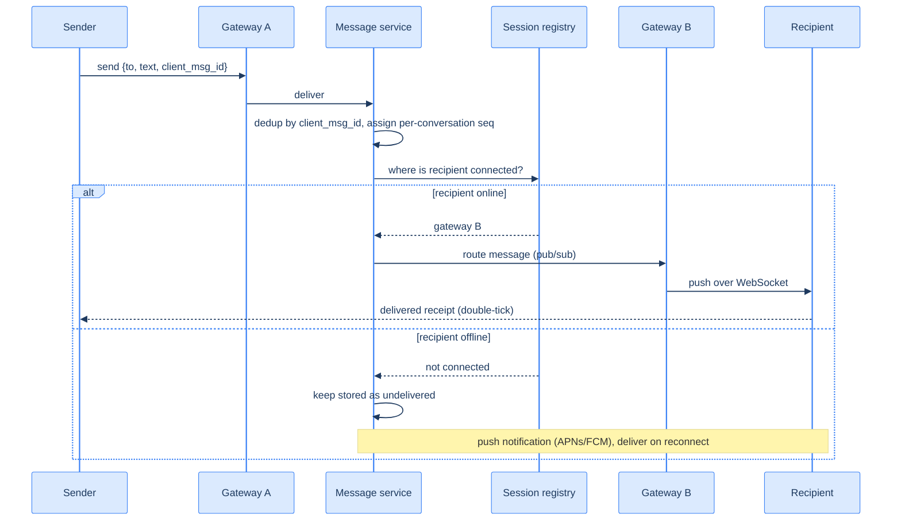

# 39. Chat system (capstone)

## TL;DR
> Real-time chat inverts the feed's trade-offs: instead of eventually-consistent, read-heavy, pull-when-you-open, a chat must deliver **in order**, **in real time** (a long-lived **WebSocket**, not a poll), and **without loss or duplication**, to a device that constantly disconnects. The defining problem is **connection management**: you hold hundreds of millions of persistent connections across a fleet of **gateway** servers (WhatsApp famously packed **~2 million connections per server** on Erlang), and to deliver a message you must find *which gateway holds the recipient right now* — a **session registry** (`user → gateway`, in Redis) plus an **inter-gateway pub/sub** to route the message there. **Ordering** comes from a **per-conversation sequence number**; **exactly-once** is approximated by **at-least-once delivery + client-message-id dedup**. Offline users get the message **stored and a push notification** (APNs/FCM), delivered on reconnect. The expensive surprise is **presence** ("online", "typing…", "last seen") — naïvely fanning out every status change to every contact is often the real scaling bottleneck. Messages persist in a write-heavy, time-ordered **wide-column store** keyed by `(conversation_id, message_id)`.

## 1. Motivation

When Facebook acquired WhatsApp in **February 2014** for $19 billion, the engineering details that emerged were almost unbelievable. WhatsApp was serving roughly **450 million users** and moving **tens of billions of messages a day**, and it did so with an engineering team of about **fifty people** — the infrastructure team was around *thirty-two*. Their secret was a maniacal focus on one number: **connections per server**. Running on **Erlang** — where each user's connection is a lightweight process costing about **300 bytes**, so you can spawn millions on one box — WhatsApp tuned their servers to hold roughly **2 million concurrent connections each**, at a time when most systems fell over at ten thousand.

That stat is the whole lesson in disguise. A chat system's hard problem is **not** "store a message and show it" — that part is easy. The hard problem is that chat is **connection-oriented**: every active user holds a **persistent, stateful, long-lived connection** waiting for messages to be *pushed* to them in real time, and you have hundreds of millions of those at once, each of which can vanish the instant the user walks into an elevator or switches from Wi-Fi to cellular. Holding those connections cheaply, knowing *which server* holds *which user*, routing a message across that fleet to the right one, and doing it all **in order and exactly once** even as connections flap — that is the system.

This capstone is the mirror image of the [news feed](/cortex/system-design/capstones/news-feed). The feed was read-heavy, eventually-consistent, and *pull* (you assemble it when the user opens the app). Chat is **push** (the server shoves messages down a held-open connection), **ordered**, **real-time**, and **durable**. Where the feed's enemy was the celebrity, chat's enemies are **the dropped connection**, **the duplicate**, and **the cost of presence**.

## 2. Requirements and scope

**Functional:**
- **1:1 and group messaging**, delivered in **real time** to online recipients.
- **Ordering:** messages in a conversation arrive in the order they were sent.
- **Delivery + read receipts** (sent → delivered → read — the "double tick").
- **Presence:** online/offline, "last seen", and "typing…".
- **Offline delivery:** a message to an offline user is stored and delivered on reconnect, with a **push notification**.
- **History:** scroll back through past messages.

**Non-functional (these drive the design):**
- **Real-time, low latency:** delivery in well under a second for online users → a **persistent push connection** (WebSocket), not polling.
- **Massive concurrent connections:** the system is sized by *connections held*, not just messages/sec.
- **Durable + no loss:** a lost message is unacceptable; a *duplicated* one is merely annoying — so we prefer **at-least-once + dedup** over risking loss.
- **In-order, effectively-once.**

**Out of scope:** end-to-end encryption (Signal protocol — a deep topic of its own), voice/video calls, and spam/abuse filtering.

## 3. Back-of-envelope estimation

Numbers ([estimation](/cortex/system-design/foundations/back-of-envelope-estimation)) — and for chat, the *connection* count matters as much as the message rate. Assume **500 million daily active users**, online concurrently, each sending **~40 messages/day**.

| Quantity | Calculation | Result |
|---|---|---|
| Messages/day | 500M × 40 | **20 billion/day (~231K/s avg)** |
| Peak messages/s | ~3× average | **~700K/s** |
| Concurrent connections | ≈ DAU online | **~500 million persistent WebSockets** |
| Gateway servers | 500M ÷ ~1M conns/server | **~500 (plus headroom → ~1,000)** |
| Storage/day | 20B × ~300 bytes | **~6 TB/day (~2.2 PB/year)** |

The line that defines the architecture is **concurrent connections**: ~500 million persistent connections is the load, and *connection density per server* (how WhatsApp-like you can get) directly sets your fleet size and cost. At a conservative 1M connections/gateway you need ~500 gateways; at WhatsApp's 2M you'd need half that. The **message store** is a ~2.2 PB/year, append-mostly, time-ordered workload — a textbook fit for an LSM-tree-backed [wide-column store](/cortex/system-design/storage-and-search/lsm-trees-vs-btrees) (Cassandra/ScyllaDB), keyed by conversation. And ~700K messages/s peak means message routing must be cheap and horizontal.

## 4. API

Chat is mostly a **bidirectional WebSocket** protocol, with a little REST for history:

```
WebSocket  wss://chat.example.com/connect        (authenticated; held open)
  → send:     {"type":"msg","to":"u99","text":"hi","client_msg_id":"c-7f3a"}
  ← receive:  {"type":"msg","from":"u42","conv":"c1","seq":1042,"text":"hi"}
  ← receipt:  {"type":"receipt","conv":"c1","seq":1042,"state":"delivered"}
  → presence: {"type":"typing","conv":"c1"}        (heartbeats keep presence alive)

GET /conversations/{id}/messages?before={seq}      (history, cursor/keyset paginated)
```

The `client_msg_id` is the key field: the client generates it once per message and **reuses it on retries**, so the server can **dedup** ([idempotency](/cortex/system-design/distributed-patterns/idempotency-retries-backoff)) — a retry over a flaky network never creates a second message. The server assigns the authoritative **`seq`** (a per-conversation sequence number) that defines ordering.

## 5. Data model and the central decision

Three stores, each shaped to its access pattern:
- **Message store:** `(conversation_id, seq) → {sender, text, client_msg_id, ts, …}`, where `seq` is a **monotonic per-conversation sequence**. This gives both **ordering** (sort by seq) and **history** (range scan); it's write-heavy and append-mostly → a [wide-column / LSM](/cortex/system-design/storage-and-search/lsm-trees-vs-btrees) store sharded by `conversation_id`.
- **Session registry:** `user_id → gateway_id` (which server holds this user's live connection) plus presence/heartbeat state, in **Redis** — millions of lookups/sec, in memory.
- **Conversation membership:** who's in each conversation (for group fan-out).

The **central design decision** is *how a message reaches a recipient who is connected to a different gateway than the sender.* WebSocket connections are **stateful and pinned** to one gateway, so you cannot just round-robin behind a load balancer. The pattern:

1. The sender's gateway hands the message to the **message service**, which **persists** it (assigning `seq`) and **dedups** by `client_msg_id`.
2. The message service consults the **session registry** to find the recipient's gateway.
3. It **routes** the message to that gateway over an **inter-server pub/sub** ([pub/sub](/cortex/system-design/distributed-patterns/pubsub-and-fanout) — Redis Pub/Sub, NATS, or Kafka), and that gateway **pushes** it down the recipient's held-open connection.
4. If the registry shows the recipient is **offline**, the message is already persisted; the system fires a **push notification** and delivers on reconnect.

That "persist → find the gateway → route via pub/sub → push" loop is the heart of every real-time chat system.

## 6. Architecture

A fleet of **WebSocket gateways** holding the connections, a **message service** that persists/dedups/routes, a **session+presence registry**, a **message store**, and a **push service** for the offline. Topology (D2):

```d2
direction: right
user: User (mobile / web)
gw: WebSocket gateways { shape: rectangle }
msg: Message service
reg: "Session + presence registry (Redis: user to gateway)" { shape: cylinder }
store: "Message store: wide-column (conv_id, seq)" { shape: cylinder }
push: Push service (APNs / FCM)

user -> gw: "WebSocket (persistent)"
gw -> reg: "register conn + heartbeat"
gw -> msg: "inbound message"
msg -> store: "persist (conv_id, seq)"
msg -> reg: "find recipient gateway"
msg -> gw: "route to recipient (pub/sub)"
msg -> push: "if recipient offline"
```

The same system as a C4 container view:

<iframe
  src="/c4/view/capstones_chatsystem_architecture"
  width="100%"
  height="420"
  style="border: 1px solid var(--border, #2b2b2b); border-radius: 8px;"
  loading="lazy"
  title="Chat system — container view (gateways + session registry)"
></iframe>

The gateways are deliberately **dumb and stateless beyond the connection itself** — all they do is terminate WebSockets, register each connection in the registry, heartbeat presence, and shuttle messages to/from the message service. That keeps them cheap to scale horizontally and cheap to lose: when a gateway dies, its users just reconnect (to a *different* gateway) and re-register. The **routing via pub/sub** is what makes a message on gateway A reach a recipient on gateway B — the gateways don't talk to each other directly; they publish/subscribe through the message layer.

## 7. The hot path

Sending a 1:1 message, online and offline:



The elegant part is that the message is **persisted before it's routed**, so delivery is decoupled from connectivity: whether the recipient is online (route now) or offline (store + push), the message is already durable. The recipient's gateway, on (re)connect, asks "what's my latest `seq` per conversation?" and pulls anything newer — so a phone that dropped offline mid-conversation catches up in order the moment it reconnects.

## 8. Bottlenecks and the 100× stretch

At 100× — **~50 billion concurrent connections is absurd, but realistically billions of connections and ~70 million messages/second** (WhatsApp's actual peak order-of-magnitude) — here's what bends:

- **Connection density is the cost driver.** The whole game is connections-per-gateway. This is *why* WhatsApp used Erlang (cheap per-connection processes) and tuned the OS (file descriptors, ephemeral ports, TCP buffers). At 100× you add gateways and push them to the **edge / regionally** so connections terminate close to users.
- **Presence is the silent killer.** Naïvely, when one user comes online you notify *all* their contacts, and "typing…" events fan out continuously — at scale this can dwarf actual message traffic. Mitigate by making presence **lazy / on-demand** (compute it when someone opens a chat, not push it to everyone), batching/debouncing status changes, and isolating the presence path so it can't starve messaging ([bulkheads](/cortex/system-design/distributed-patterns/circuit-breakers-and-bulkheads)).
- **The reconnect storm.** When a gateway (or a whole zone) dies, *all* its millions of connections reconnect **at once** — a thundering herd that can topple the next gateway and the registry. Clients must reconnect with **exponential backoff + jitter** ([Lesson 17](/cortex/system-design/distributed-patterns/idempotency-retries-backoff)); the registry must absorb a re-registration spike.
- **The session registry gets hot.** Millions of `user → gateway` lookups and updates per second; shard it (by user) and keep it in memory ([Redis/caching](/cortex/system-design/building-blocks/caching)). It's also the source of truth for routing, so its availability is critical.
- **Group fan-out.** A message to a 1,000-member group is a 1,000-way routed fan-out (the [pub/sub fan-out](/cortex/system-design/distributed-patterns/pubsub-and-fanout) pattern again) — and must stay ordered per conversation. Huge groups get the "celebrity" treatment: pull/lazy delivery for inactive members.
- **The message store write rate.** ~70M messages/s is a colossal write workload; the LSM/wide-column store shards by conversation and is provisioned for write throughput (sequential appends, the LSM sweet spot — [Lesson 22](/cortex/system-design/storage-and-search/lsm-trees-vs-btrees)).

The throughline: chat scales by making **connections cheap**, **presence lazy**, and **reconnects polite**.

## 9. Trade-offs

| Decision | Option | Why |
|---|---|---|
| Transport | **WebSocket (persistent push)** vs long-polling/SSE | only a held-open connection gives sub-second push without hammering the server; long-polling wastes connections, SSE is one-directional |
| Delivery guarantee | **at-least-once + dedup** vs exactly-once | true exactly-once is impractical over flaky networks; persist + `client_msg_id` dedup gives *effectively*-once without risking loss |
| Ordering | **per-conversation seq** vs global order | global ordering is needless and a bottleneck; users only perceive order *within a conversation* |
| Presence | **lazy / on-demand** vs eager push | eager presence fan-out can exceed message traffic; compute it when needed and debounce |
| Message store | **wide-column / LSM** vs relational | append-mostly, time-ordered, write-heavy, sharded by conversation — the LSM sweet spot, not a B-tree's |
| Gateway state | **dumb + stateless** (registry holds routing) vs smart gateways | dumb gateways are cheap to scale and cheap to lose; put the `user→gateway` truth in a shared registry |

## 10. Build It

An illustrative sketch of the delivery core: dedup, assign a per-conversation sequence, persist, then route to the recipient's gateway via the registry (or fall back to push). Not a production server — the *decisions* are the point.

```python
class ChatService:
    def __init__(self, store, registry, pubsub, push):
        self.store, self.registry, self.pubsub, self.push = store, registry, pubsub, push

    def on_message(self, sender, to, text, client_msg_id, conv_id):
        if self.store.seen(conv_id, client_msg_id):        # DEDUP: a retry over a flaky link
            return self.store.seq_for(conv_id, client_msg_id)  # same seq, no duplicate
        seq = self.store.next_seq(conv_id)                 # ORDERING: monotonic per conversation
        self.store.append(conv_id, seq, sender, text, client_msg_id)   # PERSIST before routing
        self._deliver(to, conv_id, seq, text)
        return seq

    def _deliver(self, to, conv_id, seq, text):
        gateway = self.registry.gateway_of(to)             # WHICH server holds the recipient?
        if gateway is not None:                            # online -> route to that gateway
            self.pubsub.publish(gateway, {"to": to, "conv": conv_id, "seq": seq, "text": text})
        else:                                              # offline -> message is already stored
            self.push.notify(to, conv_id)                  # APNs/FCM; client pulls on reconnect

    def on_reconnect(self, user, conv_id, last_seq):       # catch up in order after a drop
        return self.store.range(conv_id, after=last_seq)   # everything newer than what they have
```

Every line is a design decision: `seen()`/`client_msg_id` is **dedup** (effectively-once), `next_seq()` is **ordering**, `append()` *before* `_deliver()` makes the message **durable regardless of connectivity**, `gateway_of()` is the **session-registry routing** that finds the recipient, and `on_reconnect()` is how a dropped phone **catches up in order**. A real gateway adds the WebSocket handling, heartbeats, and backpressure; the delivery logic is this.

## 11. Edge cases and failure modes

- **The dropped connection (the defining one).** Phones disconnect constantly. Persist-before-route means a message is never lost when the recipient is offline; on reconnect the client pulls everything after its last `seq` per conversation, in order. Design for "offline" as the normal case, not the exception.
- **Duplicates from retries.** A flaky network makes clients resend; without `client_msg_id` dedup you'd store and deliver the same message twice. Dedup at the server, and make the client reuse the id across retries (not regenerate it).
- **The reconnect storm.** A gateway dying sends millions of clients reconnecting simultaneously, which can topple the next gateway and the registry. Mandatory **exponential backoff + jitter** on the client and a registry that can absorb the re-registration burst (§8).
- **Presence cost.** "Online/typing/last-seen" fan-out can quietly become your dominant load. Make presence lazy/on-demand, debounce "typing…", and never let presence traffic starve message delivery.
- **Out-of-order or gaps.** Network reordering or a missed push can leave a client with a gap in `seq`. The per-conversation sequence lets the client *detect* the gap (a missing number) and request the missing range — ordering is enforced by the client reconciling against `seq`, not by hoping the network behaves.
- **Group fan-out + ordering.** A group message must reach every member *and* preserve per-conversation order for each. Large groups need lazy delivery for inactive members (the [feed celebrity problem](/cortex/system-design/capstones/news-feed) in miniature), with the authoritative `seq` keeping everyone consistent.

## 12. Practice

> **Exercise 1 — Effectively-once over a flaky network.**
> A user on a spotty connection taps "send"; the message reaches the server, but the *acknowledgment* is lost, so the client retries. Without care, the recipient sees the message **twice**. How do you guarantee they see it once, and why is true "exactly-once" not the goal?
>
> <details>
> <summary>Solution</summary>
>
> The client attaches a **`client_msg_id`** generated once for that message and **reused on every retry**. The server, before storing, checks whether it has already seen that `(conversation, client_msg_id)`; if so, it returns the **same** `seq` it assigned the first time and does **not** create a second message ([idempotency](/cortex/system-design/distributed-patterns/idempotency-retries-backoff)). So the retry is a no-op and the recipient sees the message once. **Why not true exactly-once?** Over an unreliable network you can never simultaneously guarantee "delivered" *and* "delivered only once" with certainty — the ack itself can be lost either way. So you choose **at-least-once delivery** (never lose a message — the unacceptable failure) plus **dedup by id** (squash the duplicates that at-least-once produces). The result is *effectively*-once: no loss, no visible duplication. The mistake that breaks it is the client generating a **new** id per attempt — then each retry looks like a fresh message.
>
> </details>

> **Exercise 2 — Find the recipient.**
> Sender is connected to gateway A; recipient is connected to gateway B; there are 800 gateways. You cannot put a WebSocket behind a normal round-robin load balancer. How does A's message reach the connection on B, and what component makes it possible?
>
> <details>
> <summary>Solution</summary>
>
> WebSocket connections are **stateful and pinned** to one gateway, so the recipient's live connection exists on exactly one server (B) — and a round-robin LB would send A's message to a random gateway that almost certainly isn't B. The enabling component is the **session registry** (`user → gateway`, in Redis): when B accepted the recipient's connection it wrote `recipient → B`. So A's gateway hands the message to the **message service**, which (1) persists it, (2) **looks up the recipient in the registry** and learns "gateway B", and (3) **routes the message to B over an inter-server pub/sub** (Redis Pub/Sub / NATS / Kafka); B then pushes it down the held-open connection. The gateways never talk directly — they publish/subscribe through the message layer, and the registry is the map that makes targeted routing possible. If the registry says the recipient is *offline*, the (already-persisted) message triggers a push notification instead.
>
> </details>

## In the Wild

- **[High Scalability — "How WhatsApp Grew to Nearly 500 Million Users…"](http://highscalability.com/blog/2014/3/31/how-whatsapp-grew-to-nearly-500-million-users-11000-cores-an.html)** (2014) — the §1 numbers: ~2M connections/server on Erlang, tens of billions of messages/day, a tiny team. The canonical "chat is a connection-management problem" case study.
- **[Discord — "How Discord Stores Trillions of Messages"](https://discord.com/blog/how-discord-stores-trillions-of-messages)** — the message-store side at scale: the wide-column (Cassandra → ScyllaDB) design behind §5, including the read/write patterns of a giant chat history (the same store you met in [Lesson 22](/cortex/system-design/storage-and-search/lsm-trees-vs-btrees)).
- **[Slack — "Real-time messaging" / Flannel](https://slack.engineering/real-time-messaging/)** — the gateway + edge-cache architecture for holding millions of WebSocket connections and pushing events, with presence and the connection-flap realities of §8.
- **[RFC 6455 — The WebSocket Protocol](https://datatracker.ietf.org/doc/html/rfc6455)** — the protocol underneath the whole design: a single TCP connection upgraded to full-duplex, the thing that makes server-push (and thus real-time chat) possible.
- **[Signal Protocol](https://signal.org/docs/)** — the end-to-end encryption layer this lesson scoped out, for when "the server must never read messages" is a requirement; a great next read on how delivery and ordering survive when the payload is opaque.

---

> **Next:** [40. Video streaming](/cortex/system-design/capstones/video-streaming) — chat moved tiny messages with strict ordering; video moves *enormous* immutable blobs where the game is bytes-to-eyeballs at the lowest cost and latency. Next we design the pipeline that ingests a raw upload, **transcodes** it into a ladder of resolutions, chops it into segments, and serves them through a **CDN** with **adaptive bitrate** — plus the storage math that makes petabytes of video affordable, tying straight back to [object storage](/cortex/system-design/storage-and-search/object-storage).
