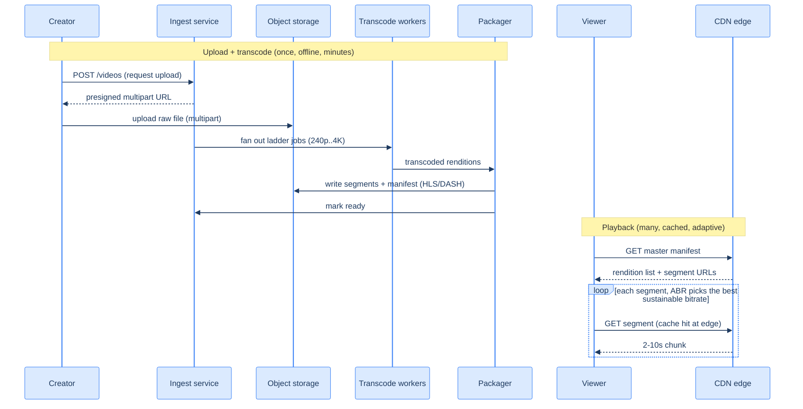

# 40. Video streaming (capstone)

## TL;DR
> Streaming video is dominated by two costs — **storage** and **bandwidth** — and the architecture splits into two decoupled halves. **(1) The pipeline (once, offline, expensive):** ingest a raw upload into [object storage](/cortex/system-design/storage-and-search/object-storage), then **transcode** it into a **bitrate ladder** (240p, 360p, 480p, 720p, 1080p, 4K — multiple bitrates/codecs), **chop each rendition into 2–10s segments**, and write an **HLS/DASH manifest** (`.m3u8` / `.mpd`) listing every segment. Transcoding is heavy batch compute (a 1080p video takes minutes; 4K, tens of minutes), parallelized across a worker farm by segmenting the source. **(2) The serve (many, cached, cheap-per-byte):** a **CDN** caches segments at the edge and delivers ~all the bytes; the player does **adaptive bitrate (ABR)** — it measures its bandwidth and picks the highest sustainable rendition *per segment*, stepping down on congestion and up when there's headroom. The bytes-to-eyeballs problem is so enormous that Netflix built its **own CDN (Open Connect)** — ~19,000 appliances inside ISP networks serving ~95% of its traffic. And no, a 4K stream isn't 25× the bandwidth of 1080p — it's ~4× the pixels and roughly **3–5×** the bandwidth, with sharply diminishing perceived gains, which is *why* the ladder and ABR exist.

## 1. Motivation

By 2022, **Netflix alone accounted for roughly 15% (14.9%) of all global downstream internet traffic** — more than YouTube or Amazon Prime Video. Sit with that number: a single application is a *seventh of the internet's downlink*. When your problem is moving that many bytes to that many screens, the economics of a normal CDN break down, so Netflix did something drastic — it **built its own CDN**, called **Open Connect**. Rather than rent edge capacity, Netflix manufactures purpose-built server appliances (**Open Connect Appliances, OCAs**) and **places them physically inside ISP networks** — by 2025, **over 19,000 appliances across 1,500+ ISP locations** in 100+ countries — so that **close to 95% of Netflix traffic** is served from a box *inside your ISP*, a few milliseconds away, never crossing the public internet backbone.

That is the entire shape of this capstone in one decision: **video streaming is fundamentally a bytes-to-eyeballs (bandwidth + storage) problem, and the system is organized around serving those bytes as cheaply and close to the viewer as possible.** Everything else — the upload, the transcode, the metadata — is supporting cast for the CDN. And the design has a beautiful symmetry: the *expensive* work (transcoding a raw upload into many renditions) happens **once, offline**, while the *cheap, repeatable* work (serving a cached segment) happens **billions of times at the edge**. The hard, costly thing is done rarely; the common thing is made trivial.

This capstone leans hard on lessons you've already built: the raw and encoded video lives in [object storage](/cortex/system-design/storage-and-search/object-storage) (Capstone 26's eleven-nines blobs); the transcode farm is a [queue-driven, autoscaled](/cortex/system-design/production-operations/capacity-planning-and-autoscaling) batch system; and the serve is the [CDN edge-caching](/cortex/system-design/capstones/url-shortener) idea from the URL shortener, scaled to petabytes. It also corrects a myth the stub repeats: 4K is *not* 25× the bandwidth of 1080p.

## 2. Requirements and scope

**Functional:**
- **Upload:** a creator uploads a (potentially huge) raw video file.
- **Transcode + package:** convert it into a **bitrate ladder** and segment it for adaptive streaming.
- **Playback:** a viewer streams it smoothly on any device/network, with **adaptive bitrate** (no buffering on a weak connection, full quality on a strong one) and seeking.

**Non-functional (these drive the design):**
- **Bandwidth is the dominant cost** — design to serve almost everything from a **CDN edge**, not the origin.
- **Storage is huge** — every video becomes *several* renditions; petabytes accumulate → cheap, durable [object storage](/cortex/system-design/storage-and-search/object-storage).
- **Smooth playback over variable networks** — the same video must play on fibre and on a spotty phone, which forces the **ladder + ABR**.
- **Upload/transcode can be slow** (minutes); **playback must be instant**. Asymmetric, like the URL shortener's write-vs-read.

**Out of scope:** live/low-latency streaming (real-time transcode — we focus on **VOD**, video-on-demand), DRM/content protection, recommendations ([Capstone 46](/cortex/system-design/capstones/recommendation-serving)), and the social layer.

## 3. Back-of-envelope estimation

Numbers ([estimation](/cortex/system-design/foundations/back-of-envelope-estimation)) — and here the bandwidth line dwarfs everything. Assume **500 hours of video uploaded per minute**, a ~6-rung bitrate ladder, and a peak of **50 million concurrent streams** at ~5 Mbps average.

| Quantity | Calculation | Result |
|---|---|---|
| Source uploaded/day | 500 hr/min × 60 × 24 | **720,000 source-hours/day** |
| Encoded storage added/day | 720K hr × ~10 GB/hr (ladder sum) | **~7 PB/day (exabytes/year)** |
| Transcode work/day | 720K source-hr × 6 renditions | **~4.3M rendition-hours/day to encode** |
| Peak egress bandwidth | 50M streams × 5 Mbps | **~250 Tbps** |
| Origin egress (with CDN) | ~5% of 250 Tbps | **~12 Tbps (CDN serves the rest)** |

The story is in the last two rows. **~250 terabits per second** of peak egress is a number no single origin can serve — which is the whole reason the **CDN is the system**: it absorbs ~95% of that, leaving the origin a comparatively tiny ~12 Tbps (and even that is mostly cache fills). The **~7 PB/day** of encoded output is why durable, cheap [object storage](/cortex/system-design/storage-and-search/object-storage) is non-negotiable. And the **~4.3M rendition-hours/day** of transcoding is a massive but *embarrassingly parallel* batch job — you chop each video into segments and encode them across a huge worker farm, so wall-clock time stays in minutes even though total CPU is enormous.

## 4. API

```
POST /videos                      {"title": "...", "size": 8_000_000_000}
  201 Created                     {"video_id": "v_42", "upload_url": "<presigned multipart>"}

PUT  <presigned multipart URL>    (client uploads the raw bytes directly to object storage)

GET  /videos/v_42/status          200 {"state": "processing" | "ready", "renditions": [...]}

GET  /videos/v_42/master.m3u8     200 (the manifest: lists every rendition + segment URLs)
GET  <CDN>/v_42/720p/seg_017.ts   200 (a single 2-10s segment, served from the edge)
```

Two API choices matter. The raw upload goes **directly to object storage via a presigned multipart URL** ([API design](/cortex/system-design/application-architecture/api-design)) — the bytes never pass through your app servers (you'd never want 8 GB flowing through an API tier), and **multipart** lets a giant file upload in parallel chunks with per-chunk retries. And playback is just **plain HTTP GETs of static segments** off the CDN — which is what makes streaming so cacheable: a segment is an immutable file, identical for every viewer, perfect for edge caching (the [URL-shortener edge-cache](/cortex/system-design/capstones/url-shortener) idea again).

## 5. Data model and the central decision

The data divides by size and access pattern:
- **Metadata** (`video_id → {owner, title, status, available renditions}`) in a relational/NoSQL DB — small, queried for listings and the player bootstrap.
- **The bytes** — raw source, every transcoded segment, and the manifests — in **object storage**, fronted by the CDN. This is the petabyte mass.

The **central design decision** is the **transcode-and-package pipeline**, and the three choices inside it:

1. **The bitrate ladder.** Encode the source into several renditions — e.g. 240p/400kbps, 360p/800kbps, 540p/1.5Mbps, 720p/2.5Mbps, 1080p/5Mbps (and 4K/15Mbps). More rungs = smoother adaptation but more storage and transcode cost.
2. **Segmenting.** Chop each rendition into **2–10 second segments**. Small segments make ABR responsive (the player can switch bitrate every few seconds) and make every segment an independently-cacheable static file.
3. **The manifest.** Write an **HLS** (`.m3u8`) or **DASH** (`.mpd`) manifest that lists all renditions and the URL of each segment. The player downloads the manifest first, then drives playback from it.

Why this shape? Because it **decouples the expensive, one-time encode from the cheap, infinite serve**, and it **pushes the adaptation decision to the client**. The server doesn't decide what quality you get — it publishes *all* qualities as static segments, and your player, which alone knows your real-time bandwidth, picks. That's **adaptive bitrate**: it's why the same `master.m3u8` plays perfectly on fibre and on a train.

## 6. Architecture

The pipeline (ingest → transcode → package → object storage) and the serve (CDN → player). Topology (D2):

```d2
direction: right
creator: Creator
ingest: Ingest / upload service
store: "Object storage (raw + segments + manifests)" { shape: cylinder }
transcode: Transcode workers (bitrate ladder) { shape: queue }
packager: Packager (segment + manifest)
meta: "Metadata DB (status, renditions)" { shape: cylinder }
cdn: CDN edge (caches segments)
viewer: Viewer (player + ABR)

creator -> ingest: "request upload"
ingest -> store: "raw upload (multipart)"
ingest -> transcode: "fan out ladder jobs"
transcode -> packager: "renditions"
packager -> store: "segments + manifest"
ingest -> meta: "video status"
viewer -> cdn: "GET manifest + segments"
cdn -> store: "origin fetch on miss"
```

The same system as a C4 container view:

<iframe
  src="/c4/view/capstones_videostreaming_architecture"
  width="100%"
  height="420"
  style="border: 1px solid var(--border, #2b2b2b); border-radius: 8px;"
  loading="lazy"
  title="Video streaming — container view (transcode pipeline + CDN serve)"
></iframe>

Notice that the **viewer never touches your application** — they talk only to the **CDN**, fetching static manifests and segments. Your origin (object storage) is just the CDN's backstop for cache misses. That's the architectural payoff of "everything is a static, immutable segment": serving video becomes serving files, and serving files is the one thing CDNs do best. The transcode workers drain a **queue** ([message queues](/cortex/system-design/distributed-patterns/message-queues-and-streams)) and [autoscale](/cortex/system-design/production-operations/capacity-planning-and-autoscaling) with the upload firehose, completely independent of the serve path.

## 7. The hot path

The expensive one-time pipeline, then the cheap repeated playback:



The loop is the magic of **adaptive bitrate**. The player fetches segments one at a time, and *between* segments it measures how fast the last one arrived. If the network is strong, it requests the next segment from a *higher* rung of the ladder; if a segment arrives slowly (congestion, a tunnel), it drops to a *lower* rung to avoid a stall. The viewer experiences this as "the picture got a bit softer for a few seconds, then sharpened again" instead of the dreaded spinning buffer — and it's all driven by the **client**, because only the client knows its true, instantaneous bandwidth.

## 8. Bottlenecks and the 100× stretch

At 100× — **petabytes uploaded daily, tens of terabits to multiple petabits per second of egress** — here's what bends:

- **Bandwidth/CDN is the whole ballgame.** You cannot serve petabits/s from central origins; you push bytes to the edge, and at the extreme you do what Netflix did — **build your own CDN inside ISPs** (Open Connect) so popular content sits a few ms from viewers and never crosses the backbone. The cache-hit ratio at the edge is the single most important number in the system; a 95% hit ratio means the origin handles 1/20th of the load.
- **Popularity is wildly skewed (cache the head).** A tiny fraction of videos get the overwhelming majority of views (a new release, a viral clip), so a modest edge cache covers most requests — the same Zipfian win as the [URL shortener](/cortex/system-design/capstones/url-shortener). Pre-position (pre-warm) anticipated hits (a big premiere) at the edge before they're requested.
- **Transcode is huge but embarrassingly parallel.** ~4.3M rendition-hours/day is a giant compute bill; you cut wall-clock time by **chopping each source into chunks and transcoding them in parallel** across an autoscaling farm (GPUs/ASICs help), and you save cost with smarter encoding (per-title/per-scene encoding — spend bits only where the picture is complex).
- **Storage growth is relentless.** Petabytes/day of renditions; tier aggressively — hot/new content on fast storage, the long tail to cheaper/cold object-storage classes, and **drop rarely-watched renditions** rather than store every rung forever.
- **The "thundering herd" premiere.** A simultaneous global release (or a live event) spikes a single title to millions of concurrent viewers at once. Pre-warm the edge, and for true live, the transcode-and-package must run in real time with low-latency segments — a different, harder mode.

The throughline: **make the bytes cacheable and immutable, then cache them as close to the eyeball as physically possible.**

## 9. Trade-offs

| Decision | Option | Why |
|---|---|---|
| Serve path | **CDN edge** (push bytes to ISPs) vs central origin | egress at this scale is impossible centrally; ~95% edge hit ratio is the system's core economic lever |
| Ladder depth | **more rungs** (smooth ABR) vs fewer (less storage/transcode) | each extra rendition costs storage + encode time; balance smoothness against the petabyte bill |
| Codec | **newer (AV1/HEVC: smaller files)** vs H.264 (universal) | AV1/HEVC cut bandwidth ~30–50% but cost more to encode and aren't supported everywhere — often ship both |
| Segment length | **short (2–4s: responsive ABR)** vs long (fewer files) | short segments switch bitrate faster and recover from stalls quicker, at more files/requests |
| Transcode timing | **offline/VOD** vs real-time/live | VOD transcodes once at leisure; live must encode in real time with low-latency segments — far harder |
| 4K everywhere? | **adapt per device/network** vs always-max | 4K is ~4× the pixels and ~3–5× the bandwidth of 1080p with **diminishing perceived gains on phones** — ABR should *not* ship 4K to a small screen on cellular |

## 10. Build It

An illustrative sketch of the pipeline core — fan a source into a bitrate ladder, segment each rendition, and emit a manifest. (Real systems shell out to `ffmpeg` and run this across a farm; the *shape* is the point.)

```python
LADDER = [   # (name, height, bitrate kbps) — the encoding ladder
    ("240p", 240, 400), ("360p", 360, 800), ("540p", 540, 1500),
    ("720p", 720, 2500), ("1080p", 1080, 5000), ("4k", 2160, 15000),
]
SEGMENT_SECONDS = 6

def process_upload(video_id, source, store, queue):
    for name, height, kbps in LADDER:
        queue.enqueue(transcode_job, video_id, source, name, height, kbps)  # fan out — parallel

def transcode_job(video_id, source, name, height, kbps, store):
    rendition = transcode(source, height, kbps)                 # ffmpeg: scale + re-encode (heavy)
    segments = chop(rendition, SEGMENT_SECONDS)                 # 2-10s independently-cacheable chunks
    for i, seg in enumerate(segments):
        store.put(f"{video_id}/{name}/seg_{i:04d}.ts", seg)     # static files -> object storage -> CDN
    return name, len(segments)

def write_manifest(video_id, results, store):                  # the master playlist the player reads
    lines = ["#EXTM3U"]
    for name, height, kbps in LADDER:
        lines.append(f"#EXT-X-STREAM-INF:BANDWIDTH={kbps*1000},RESOLUTION=x{height}")
        lines.append(f"{name}/index.m3u8")                      # one variant playlist per rung
    store.put(f"{video_id}/master.m3u8", "\n".join(lines))      # player picks a rung per segment (ABR)
```

The design is visible in the structure: `process_upload` **fans the one source into independent per-rendition jobs** (so the farm transcodes the whole ladder in parallel), each job **chops its rendition into small static segments** written to object storage (and thus instantly CDN-cacheable), and `write_manifest` publishes the **menu of bitrates** the player chooses from. Nothing here serves bytes to viewers — that's the CDN's job, reading these static files. Swap `transcode`/`chop` for `ffmpeg` invocations and this is the real pipeline.

## 11. Edge cases and failure modes

- **Bandwidth, not compute, is the constraint (the defining one).** The temptation is to optimize the app tier; the reality is that ~95% of your cost and your failure modes live in the **CDN/egress**. Obsess over edge cache-hit ratio, pre-warming, and ISP placement — that's where the system lives or dies.
- **The cold/unpopular long tail.** Most videos are watched rarely, so caching them at every edge is wasteful; serve the long tail from regional origins and reserve edge capacity for the popular head. Don't pay to pre-position content nobody will watch.
- **Transcode failures and poison inputs.** A malformed or exotic upload can crash or hang a transcode worker; isolate jobs, time them out, retry with backoff ([Lesson 17](/cortex/system-design/distributed-patterns/idempotency-retries-backoff)), and quarantine repeat offenders so one bad file can't stall the farm.
- **ABR oscillation / startup latency.** A naïve ABR algorithm can flip-flop bitrates (annoying) or start too conservatively (slow to sharpen). Players use buffer-aware ABR (consider buffer health, not just last-segment speed) and a fast initial rung to start playback quickly, then ramp.
- **The premiere thundering herd.** A global simultaneous release spikes one title to millions at once; without **pre-warming** the edge, the origin gets hammered on the cold cache. Anticipate big releases and push content to the edge ahead of time.
- **Storage cost runaway.** Every video × every rendition × forever is unaffordable; tier to cold storage, drop low-demand renditions, and use efficient codecs — otherwise the petabytes/day compound into an existential bill.

## 12. Practice

> **Exercise 1 — Why is the CDN the system?**
> A 100M-stream service runs at ~5 Mbps average per stream. (a) What's the peak egress, and why can't a central origin serve it? (b) If the edge cache-hit ratio is 95%, how much does the origin actually serve, and what one property of viewing behavior makes that 95% achievable?
>
> <details>
> <summary>Solution</summary>
>
> **(a)** Peak egress = `100M × 5 Mbps = 500 Tbps`. No central origin (or even a handful of data centers) can source half a petabit per second — the cross-backbone bandwidth alone is impossible and ruinously expensive, and the latency from a distant origin would stall players. So the bytes **must** be served from many edge locations close to viewers (a CDN; at the extreme, Netflix's Open Connect *inside* ISPs). **(b)** At a 95% hit ratio the origin serves only `5% × 500 Tbps = 25 Tbps` — a 20× reduction — and the rest comes from edge caches near users. The property that makes 95% achievable is **skewed (Zipfian) popularity**: a small set of titles (a new release, a viral clip) draws the overwhelming majority of views, so a modest edge cache of the *head* satisfies almost all requests. Streaming is viable *because* what people watch is concentrated, not uniform — the same insight that made the [URL shortener](/cortex/system-design/capstones/url-shortener) cacheable.
>
> </details>

> **Exercise 2 — Bust the 4K myth.**
> A teammate says "4K is 25× the bandwidth of 1080p, so we should never offer it." Quantify what's actually true, and explain why the bitrate ladder + ABR is the right answer rather than "never offer 4K" or "always send 4K."
>
> <details>
> <summary>Solution</summary>
>
> 4K (3840×2160) has **4× the pixels** of 1080p (1920×1080), and in practice needs roughly **3–5× the bandwidth** (Netflix recommends ~5 Mbps for 1080p and ~15 Mbps — up to 25 Mbps — for 4K), *not* 25×. And the perceived-quality gain is **sharply diminishing**: on a phone or at a normal living-room distance, most people can't distinguish 4K from 1080p, so those extra bits are largely wasted. That's exactly why the answer is **the ladder + adaptive bitrate**, not a blanket rule: you encode *all* the rungs once, and let the **player choose per segment** based on its screen and real-time bandwidth — 4K to the big TV on fibre, 720p to the phone on cellular, stepping up and down as conditions change. "Never offer 4K" denies quality to those who can use it; "always send 4K" wastes bandwidth and stalls weak connections. ABR gives each viewer the best sustainable quality for *their* situation — which is the entire point of the design.
>
> </details>

## In the Wild

- **[Netflix — Open Connect](https://openconnect.netflix.com/en/)** — the §1 motivation: Netflix's purpose-built CDN, ~19,000 appliances *inside* ISP networks serving ~95% of its traffic. The clearest real-world statement that video streaming is a bytes-to-eyeballs problem solved at the edge.
- **[Apple — HTTP Live Streaming (HLS)](https://developer.apple.com/streaming/)** and **[MPEG-DASH overview](https://www.mux.com/articles/hls-vs-dash-what-s-the-difference-between-the-video-streaming-protocols)** — the two adaptive-streaming protocols behind §5/§7: manifests, segments, and the bitrate ladder, plus when to use which.
- **[Netflix — per-title / dynamic optimizer encoding](https://netflixtechblog.com/per-title-encode-optimization-7e99442b62a2)** — how Netflix spends bits intelligently (a custom ladder per title, even per shot) to cut bandwidth without hurting quality — the §8 transcode-cost lever in production.
- **[Mux / Bitmovin — adaptive bitrate (ABR) algorithms](https://www.mux.com/articles/hls-vs-dash-what-s-the-difference-between-the-video-streaming-protocols)** — how the *client* decides which rung to fetch (throughput- vs buffer-based ABR), the §7 loop and the §11 oscillation problem explained in depth.
- **[AWS — video-on-demand / MediaConvert reference architecture](https://docs.aws.amazon.com/solutions/latest/video-on-demand-on-aws/solution-overview.html)** — a concrete, buildable version of the §6 pipeline (ingest → transcode → package → object storage → CDN), useful for seeing the real services that fill each box.

---

> **Next:** [41. Ride-sharing dispatch](/cortex/system-design/capstones/ride-sharing-dispatch) — video was about moving huge *immutable* bytes; ride-sharing is about *space and time* — matching a moving rider to the nearest of millions of moving drivers, in seconds, as everyone's location updates constantly. Next we design geospatial indexing (how do you query "drivers near me" over a live, moving fleet?), the matching/dispatch loop, and the surge-pricing feedback — a system where the data itself never stops moving.
