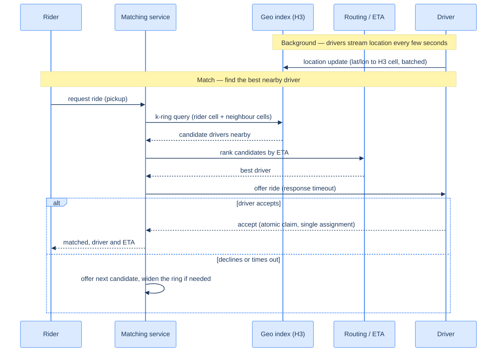

# 41. Ride-sharing dispatch (capstone)

## TL;DR
> Dispatch is a **geospatial matching** problem over data that never stops moving: millions of drivers each re-report GPS every few seconds, and when a rider requests, you must find the nearest *available* driver and offer the ride in seconds. A naïve "find drivers within R kilometres" is a `WHERE lat BETWEEN … AND lon BETWEEN …` scan that's hopeless at this rate. The fix is a **cell grid**: divide the world into cells, index each driver by the cell it's in, and answer "who's near me?" by looking up the rider's cell **plus its neighbours** — a **k-ring** query — in O(1) cell lookups. Uber built and open-sourced **H3** (2018), a *hexagonal* hierarchical grid, because hexagons have **uniform neighbour distances** (square grids have a √2 ≈ 1.41× diagonal bias). The location firehose is **batched** before it hits the index; matches are **ranked by road-network ETA**, not straight-line distance; and a driver is **claimed atomically** so they're never offered to two riders. Surge pricing is a **per-cell supply/demand feedback loop**. The system shards beautifully **by geography** — a ride in Lagos is independent of one in Lima.

## 1. Motivation

In **2018**, Uber open-sourced a curious little library called **H3** — a "hexagonal hierarchical geospatial indexing system." Why would a ride-hailing company build, and then give away, a grid of hexagons? Because the central problem of dispatch turns out to be entirely about **carving the world into cells you can index**. Uber needed to bucket geospatial events — *where are the drivers, where are the riders, where is demand outrunning supply* — to "optimize ride pricing and dispatch" across a whole city, in real time. And when they looked for the right shape of cell, they chose the **hexagon** deliberately: in a square grid, your eight neighbours aren't equidistant — the four diagonal ones are √2 ≈ **1.41× farther** than the edge ones, so "the cell next door" means two different distances depending on direction. **Hexagons have six neighbours, all the same distance away**, which makes "expand my search outward by one ring" behave like growing a circle. That clean property is exactly what you want when you're asking "give me the drivers near this rider."

That's the whole capstone in one design choice. A ride-sharing dispatch system *looks* like it should be a database query — "find drivers within 2 km" — but the data is **alive**: millions of drivers, each emitting a new GPS position every few seconds (Uber's DISCO dispatch system historically processed around **167,000 location updates per second**), and a rider who needs an answer in seconds. You cannot run a geo range-scan against a relational table at that write rate and read latency. So the heart of the system is a **geospatial index** — a cell grid held in memory, updated by the location firehose, queried with a **k-ring** to find nearby drivers in O(1).

This capstone is about **space and time**: matching a moving point to the nearest of millions of moving points, continuously. It reuses the real-time/connection ideas from the [chat system](/cortex/system-design/capstones/chat-system) (drivers streaming location are like clients holding connections), but adds the geospatial dimension — and a delightful property the others lacked: **rides are local**, so the system shards naturally by geography.

## 2. Requirements and scope

**Functional:**
- **Driver location updates:** drivers stream GPS every few seconds while available.
- **Request a ride:** a rider asks for a ride from a pickup point.
- **Match + dispatch:** find the nearest suitable *available* driver, offer them the ride, and on acceptance create the trip and return an ETA.
- **Surge pricing:** raise prices where demand outstrips nearby supply.

**Non-functional (these drive the design):**
- **Real-time, low-latency match:** the whole match should feel near-instant — on the order of a couple of seconds — so the geo query must be O(1)-ish, not a scan.
- **Enormous location write rate:** millions of updates/second → batch them, keep the index in memory.
- **Correctness under concurrency:** a driver must be matched to **exactly one** rider (no double-dispatch).
- **Geographically shardable:** a ride request only ever concerns drivers in the same city/region.

**Out of scope:** the routing/ETA engine's internals (we treat it as a service), payments ([Capstone 44](/cortex/system-design/capstones/payment-system)), fraud, and pooled/shared rides (a harder matching problem).

## 3. Back-of-envelope estimation

Numbers ([estimation](/cortex/system-design/foundations/back-of-envelope-estimation)) — and the location-update rate is the firehose that shapes everything. Assume **5 million** drivers online, each updating location every **4 seconds**, with peak **50,000** ride requests/second.

| Quantity | Calculation | Result |
|---|---|---|
| Location updates/s | 5M ÷ 4s | **~1.25 million/s** |
| Ride requests/s (peak) | given | **~50,000/s** |
| Geo-index memory | 5M drivers × ~100 bytes | **~500 MB (fits in memory, easily)** |
| Update : query ratio | 1.25M : 50K | **~25 : 1 (write-dominated)** |

Two things jump out. First, the system is **write-dominated** by location updates (~25× the request rate), so the index must absorb a relentless stream of position changes — which is why you **batch/aggregate** updates and keep the index **in memory** (it's tiny — ~500 MB — because a driver's position is just a few bytes; the data is small but *furiously hot*). Second, the geo data is small enough that the challenge isn't storage, it's **update throughput and query latency** — exactly what a cell-grid index optimizes. (Uber's real DISCO figure of ~167K updates/s shows even a fraction of this scale is a serious firehose.)

## 4. API

```
POST /drivers/{id}/location    {"lat": 51.5, "lon": -0.12, "ts": ...}   (every few seconds)
  204 No Content               (batched into the geo index)

POST /rides                    {"rider_id": "r_7", "pickup": {"lat":..,"lon":..}}
  200 OK                       {"trip_id": "t_9", "driver": {...}, "eta_secs": 240}
  202 Accepted                 (searching — offers in flight)

POST /trips/{id}/accept        (driver accepts the offer — atomic claim)
  200 OK | 409 Conflict        (409 if already claimed by another match)
```

The location endpoint is fire-and-forget and **batched** — you don't write 1.25M individual rows/second; you aggregate updates over a short window and bulk-apply them to the index ([message-queue](/cortex/system-design/distributed-patterns/message-queues-and-streams) style). The `409 Conflict` on `accept` is the **single-assignment guard**: if two riders' matches both offered the same driver and one already claimed them, the second accept loses — no double-dispatch.

## 5. Data model and the central decision

The data is small but hot:
- **Geo index:** `H3 cell → {available driver ids}`, in memory (Redis GEO, or a sharded in-memory grid), updated by the location firehose. *This is the heart of the system.*
- **Driver state:** `driver_id → {cell, status: available|on_trip|offline, last_seen}`.
- **Trip store:** trips + the atomic single-assignment of driver→rider (durable).

The **central design decision** is the **geospatial index**. The choices:

| Approach | Idea | Trade-off |
|---|---|---|
| **Range scan** (`lat/lon BETWEEN`) | query a bounding box in a table | dies at this write rate; no efficient "nearby" |
| **Geohash** | interleave lat/lon bits into a string; nearby points share a **prefix** | simple; but rectangular cells distort near poles and have edge-adjacency quirks |
| **Quadtree** | recursively split space into quadrants | adapts to density; more complex to update under churn |
| **S2** (Google) | spherical cells on a Hilbert curve | great hierarchy; square-ish cells |
| **H3** (Uber) ✅ | **hexagonal** hierarchical cells | **uniform neighbour distance** (no diagonal bias); kRing ≈ growing circle; the ride-dispatch default |

The pattern, whichever index: **map each driver to a cell on update; to find nearby drivers, compute the rider's cell and query it plus its ring of neighbours (a k-ring)** — `O(1)` cell lookups instead of an `O(drivers)` scan. H3's hexagons win because expanding the ring (`k=1`, then `k=2`, …) grows the search radius *evenly in all directions*, so "no driver in the immediate ring? widen by one" is clean — and the hierarchy lets you pick cell resolution by density (fine cells downtown, coarse in the suburbs). The index is **sharded by region**, which is free here because a ride never spans cities.

## 6. Architecture

A location-ingest path feeding the geo index, and a matching path that queries it. Topology (D2):

```d2
direction: right
driver: Driver app
rider: Rider app
ingest: Location ingest (batched)
geo: "Geo index — H3 cells (driver positions, in-memory)" { shape: cylinder }
match: Matching service
routing: Routing / ETA service
surge: Surge-pricing service
trips: "Trip store (single-assignment)" { shape: cylinder }

driver -> ingest: "location every few seconds"
ingest -> geo: "update driver cell"
rider -> match: "request ride"
match -> geo: "k-ring query (cell + neighbors)"
match -> routing: "rank candidates by ETA"
match -> trips: "create trip (atomic claim)"
match -> driver: "offer ride"
surge -> geo: "read supply/demand per cell"
```

The same system as a C4 container view:

<iframe
  src="/c4/view/capstones_ridesharingdispatch_architecture"
  width="100%"
  height="420"
  style="border: 1px solid var(--border, #2b2b2b); border-radius: 8px;"
  loading="lazy"
  title="Ride-sharing dispatch — container view (geo index + matching)"
></iframe>

The two paths run at very different rates — the **ingest path** absorbs ~1.25M updates/s (batched), the **match path** handles ~50K requests/s — and they meet only at the **geo index**, the shared hot data structure. Keeping the index in memory and sharded by region is what makes both the furious writes and the latency-sensitive reads affordable on the same data.

## 7. The hot path

Drivers streaming location in the background, and a rider's match in the foreground:



The elegant part is the **k-ring + ETA ranking + atomic claim** trio. The k-ring narrows millions of drivers to a handful of nearby candidates in O(1); the routing service re-ranks those candidates by *actual road ETA* (the nearest driver as the crow flies may be across a river with a 15-minute bridge detour); and the atomic claim on accept guarantees that even if the same popular driver was offered to two riders at once, exactly one wins. If the best driver declines or doesn't answer in the timeout window, the matcher simply offers the next-best candidate, **widening the k-ring** if the immediate neighbourhood is empty.

## 8. Bottlenecks and the 100× stretch

At 100× — **hundreds of millions of drivers, ~100M+ location updates/second** — here's what bends:

- **Geography is the gift (shard by region).** A ride request in one city never needs a driver in another, so you **partition the entire system by geographic region** ([sharding](/cortex/system-design/building-blocks/sharding-and-partitioning)) — each region runs its own geo index and matcher, independent and horizontally scalable. This is *the* reason ride-sharing scales gracefully where a global social graph (the feed) does not.
- **Hot cells in dense areas.** A stadium letting out, an airport, downtown at rush hour — one cell can hold a huge fraction of a city's drivers and absorb a request storm. Use H3's **finer resolution** in dense areas (smaller hexagons), and shard hot cells across nodes.
- **The location write firehose.** ~100M updates/s would crush per-update writes; **batch and aggregate** aggressively, keep the index in memory, and accept slightly stale positions (a driver 2 seconds out of date is fine). Most of the engineering is in making the *write* path cheap.
- **Single-assignment under contention.** When demand spikes, many riders chase the same few nearby drivers; the atomic claim ([idempotency / compare-and-set](/cortex/system-design/distributed-patterns/idempotency-retries-backoff)) must be fast and correct, or you double-dispatch. This is the consistency-critical core amid an otherwise eventually-consistent system.
- **ETA at scale.** Ranking by real road ETA means the routing engine is queried per match against a live road graph + traffic — a heavy service that's often pre-computed/cached per region and approximated for the candidate set, then refined for the winner.
- **The surge feedback loop.** Surge is computed per cell over rolling windows; it must damp oscillation (price spikes that overshoot, then collapse) and resist gaming — a control-systems problem layered on the geo index.

The throughline: dispatch scales because **rides are local** (shard by geography) and the hot data is **small but furiously updated** (in-memory cell grid + batched writes).

## 9. Trade-offs

| Decision | Option | Why |
|---|---|---|
| Geospatial index | **H3 hexagons** vs geohash / quadtree / S2 | uniform neighbour distance (no √2 diagonal bias); kRing grows like a circle; hierarchical resolution by density |
| Index storage | **in-memory, sharded by region** vs PostGIS/DB | small but furiously hot data; sub-ms k-ring queries need memory, not disk |
| Location writes | **batched/aggregated** vs per-update | 1.25M+ updates/s; batching cuts write load and a slightly stale position is acceptable |
| Ranking | **road-network ETA** vs straight-line distance | the closest driver by line may be far by road (river, one-way, highway) — ETA is what the rider feels |
| Assignment | **atomic single-claim** vs optimistic | a driver dispatched to two riders is a real-world disaster; claim atomically, `409` the loser |
| Scaling axis | **shard by geography** vs by user | rides are inherently local — geographic sharding makes the system embarrassingly parallel |

## 10. Build It

An illustrative dispatch core: index drivers by H3 cell, answer a request with a widening k-ring, rank by ETA, and claim atomically. (`h3` calls shown as pseudocode; a real system uses the H3 library + a routing service.)

```python
import collections
cell_drivers = collections.defaultdict(set)   # H3 cell -> available driver ids (in memory)

def on_location(driver_id, lat, lon, prev_cell):
    cell = h3.latlng_to_cell(lat, lon, resolution=9)  # ~hex of a couple hundred metres
    if prev_cell and prev_cell != cell:
        cell_drivers[prev_cell].discard(driver_id)    # left the old cell
    cell_drivers[cell].add(driver_id)                 # batched in practice, not per-update
    return cell

def find_candidates(lat, lon, max_k=3):
    origin = h3.latlng_to_cell(lat, lon, resolution=9)
    for k in range(1, max_k + 1):                     # widen the search ring until we find drivers
        cells = h3.grid_disk(origin, k)               # origin cell + all cells within k rings
        nearby = {d for c in cells for d in cell_drivers[c]}
        if nearby:
            return nearby
    return set()

def dispatch(rider, lat, lon, routing, trips):
    candidates = find_candidates(lat, lon)
    ranked = routing.rank_by_eta(candidates, pickup=(lat, lon))   # road ETA, not straight-line
    for driver in ranked:
        if trips.try_claim(driver, rider):            # ATOMIC: first claim wins, others get 409
            return {"driver": driver, "eta": routing.eta(driver, (lat, lon))}
        # else this driver was just claimed by someone else — try the next candidate
    return None                                       # none available — widen ring / retry / surge
```

Every line is a decision: `on_location` keeps the **cell→drivers** index current (batched in reality), `find_candidates` does the **widening k-ring** so a sparse neighbourhood just expands the search, `rank_by_eta` ranks by **road distance** not straight-line, and `try_claim` is the **atomic single-assignment** that prevents double-dispatch. Swap the in-memory dict for a sharded Redis-GEO cluster and `routing` for a real ETA service, and this is the dispatch loop.

## 11. Edge cases and failure modes

- **Double-dispatch (the defining correctness bug).** Two riders' matches offer the same driver simultaneously; without an **atomic claim**, both think they got them. Claim the driver with a compare-and-set / lock and `409` the loser — this is the one place the system must be strongly consistent.
- **Hot cells.** A stadium or airport concentrates thousands of drivers and a request storm into one cell. Use finer H3 resolution there and shard the cell; otherwise one cell becomes a bottleneck and a single point of contention.
- **Nearest-by-line ≠ nearest-by-road.** The geometrically closest driver may be across a river or facing a one-way maze. Always rank candidates by **routing-engine ETA**, not k-ring distance — the k-ring only *narrows* candidates; ETA *chooses*.
- **Stale locations.** A driver whose last update is 30 seconds old may have moved blocks; exclude drivers past a freshness threshold from matching, and treat "missing heartbeat" as offline (the [chat presence](/cortex/system-design/capstones/chat-system) problem again).
- **Decline cascades / no drivers.** The best driver declines or times out; the matcher must promptly offer the next candidate and widen the ring — and if the whole area is empty, that's a **supply** signal that should feed surge, not just an error to the rider.
- **Surge oscillation and gaming.** A naïve surge loop can spike, suppress demand, crash, and spike again; damp it over rolling windows, and guard against drivers gaming it (e.g. coordinated mass logoff to trigger surge).

## 12. Practice

> **Exercise 1 — Why a cell grid, and why hexagons?**
> A junior engineer proposes finding nearby drivers with `SELECT * FROM drivers WHERE lat BETWEEN ? AND ? AND lon BETWEEN ? AND ?`. (a) Why does this fail at 1.25M location updates/second and 50K requests/second? (b) What does a cell-grid index (H3) do instead, and why hexagons over squares?
>
> <details>
> <summary>Solution</summary>
>
> **(a)** Two failures. The **write** side: 1.25M position updates/second means constantly updating indexed lat/lon columns — a B-tree index thrashing on 1.25M writes/s (the random-write wall), and without an index the bounding-box query is an `O(drivers)` table scan per request. The **read** side: a bounding-box `BETWEEN` scan still has to examine everything in a (possibly large) rectangle and compute true distances, at 50K requests/s — far too slow. The data is small but *furiously hot*, which a disk-backed relational range scan handles terribly. **(b)** A **cell grid** assigns each driver to a cell on update (an O(1) write to an in-memory `cell → drivers` map) and answers "nearby?" by computing the rider's cell and reading it plus its neighbour cells — a **k-ring** query, O(1) cell lookups returning a handful of candidates. **Hexagons (H3)** beat squares because a hexagon's six neighbours are all **equidistant**, whereas a square's diagonal neighbours are √2 ≈ 1.41× farther — so expanding the search ring grows evenly like a circle, with no direction-dependent distance bias. The grid *narrows* candidates; a routing engine then ranks them by ETA.
>
> </details>

> **Exercise 2 — One driver, two riders.**
> Demand spikes downtown. Two riders request at the same instant; the matcher's k-ring returns the same nearby driver as the best candidate for *both*, and offers the ride to that driver from two matching threads. What goes wrong without care, and how do you guarantee correctness while keeping the rest of the system fast?
>
> <details>
> <summary>Solution</summary>
>
> Without care, **both matches believe they got the driver** (a double-dispatch): the driver is sent two trips, one rider is stranded when the driver picks up the other, and trust evaporates. The fix is an **atomic single-assignment**: claiming a driver is a compare-and-set / conditional write — "set driver D's trip to this rider **only if** D currently has no trip." Exactly one of the two concurrent claims succeeds; the other gets a `409 Conflict` and the matcher immediately offers *its* rider the next-best candidate (widening the k-ring if needed). The key insight is that **only this one step needs strong consistency** — the geo index can be eventually-consistent and slightly stale (a driver's position being 2s old is fine), but the *claim* must be atomic, because a driver in two places at once is a real-world disaster. You isolate the strongly-consistent operation (the claim) and keep everything around it fast and loosely-consistent.
>
> </details>

## In the Wild

- **[Uber — "H3: Uber's Hexagonal Hierarchical Spatial Index"](https://www.uber.com/en-US/blog/h3/)** (2018) — the §1 motivation, from the source: why hexagons (uniform neighbour distance), the hierarchy, `kRing`, and how H3 powers dispatch and surge. The [open-source library](https://github.com/uber/h3) is genuinely fun to play with.
- **[Uber — "Engineering Intelligence Through Data Visualization" / DISCO dispatch](https://www.uber.com/blog/engineering/)** — Uber's dispatch system (DISCO) and the real-time matching pipeline that processes ~167K location updates/second through the geospatial index.
- **[Redis — Geospatial commands](https://redis.io/docs/latest/develop/data-types/geospatial/)** — `GEOADD` / `GEOSEARCH`: the in-memory geo index from §5/§6 as a ready-made primitive, including radius and neighbour queries.
- **[Google S2 Geometry](http://s2geometry.io/)** — the spherical-cell, Hilbert-curve alternative to H3 (§5's table); great for understanding the hierarchy-and-locality ideas that all these indexes share.
- **[Hello Interview — Design Uber](https://www.hellointerview.com/learn/system-design/problem-breakdowns/uber)** — a thorough modern walk-through of the dispatch design (geo index, matching, single-assignment, surge) that mirrors and extends this capstone.

---

> **Next:** [42. Search autocomplete](/cortex/system-design/capstones/search-autocomplete) — ride-sharing matched points in *space*; autocomplete matches a growing *prefix* against billions of possible completions, and it has to respond *between your keystrokes* (tens of milliseconds). Next we design the **trie** (prefix tree) that makes "type-ahead" instant, how you rank the top suggestions for a prefix, and how you keep the suggestions fresh as the world's queries shift under you.
