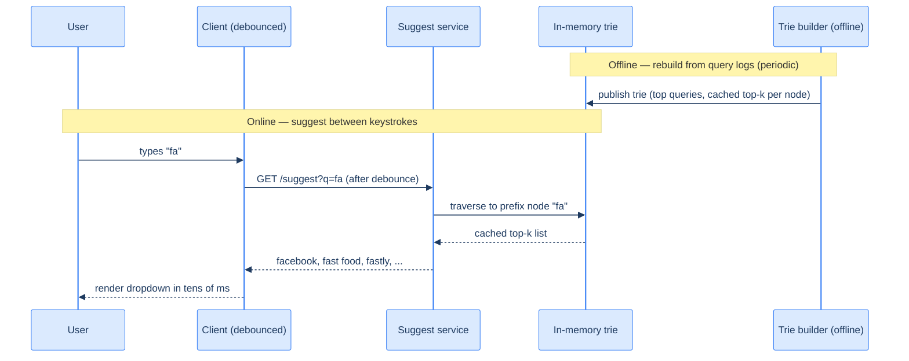

# 42. Search autocomplete (capstone)

## TL;DR
> Type-ahead suggestion is a **latency** problem disguised as a search problem: it must return the top few completions for a growing **prefix** *between your keystrokes* — tens of milliseconds — which rules out querying a database of billions of queries on every keypress. The data structure is a **trie (prefix tree)**: each node is a prefix, so finding completions is an `O(prefix length)` walk to the node. The crucial optimization is to **precompute and cache the top-k completions at every node** (a "suggest tree"), so a request is *traverse to the node, return its cached list* — no scanning the subtree at request time. The trie is built **offline** from **aggregated query-frequency logs** (a batch MapReduce: count how often each query was searched), and it's **staleness-tolerant** — a new trending query appearing an hour late is fine, so you rebuild periodically rather than live. Serve it from an **in-memory, sharded** trie, **cache hot short prefixes** at the edge (a tiny set of prefixes like "a", "fa" gets most of the traffic), and **debounce** on the client. Ranking is by popularity (and recency/personalization), and the hard parts are **trending freshness**, **hot-prefix load**, and **personalization vs. cacheability**.

## 1. Motivation

In **2004**, Google launched an experimental opt-in feature called **Google Suggest** — as you typed in the search box, it offered completions. By **2010** it had become automatic and ubiquitous (briefly branded **Google Instant**, then simply **Google Autocomplete**), refreshing its predictions **as each character was typed**, no Enter key required. The feature is so woven into how we search that we barely notice it — and that's exactly the bar. Autocomplete measurably *works*: studies find it cuts average search-task time from ~8.3 to ~4.7 seconds and **reduces keystrokes per query by ~42%**. But it only delivers that if it's *invisibly fast*. The Nielsen Norman Group's threshold for an interface feeling "instantaneous" is roughly **half a second** — and for type-ahead specifically you need far better than that, because the suggestions must keep up *with your typing*: a moderately fast typist hits a key every ~100–150 ms, so to feel like magic rather than lag, the whole round trip — keystroke to updated dropdown — has to land in **tens of milliseconds**.

That latency budget is the entire design constraint, and it immediately kills the obvious approach. You cannot, on every keystroke, run `SELECT query FROM searches WHERE query LIKE 'fa%' ORDER BY popularity LIMIT 10` against a table of billions of historical queries — a prefix `LIKE` scan at that scale, on every keypress, for millions of concurrent users, is hopeless. So autocomplete is built around a data structure designed for exactly one thing: **finding everything that starts with a given prefix, fast** — the **trie**, supercharged by **precomputing the answer at every node**.

This capstone is the counterpoint to the [full-text search lesson](/cortex/system-design/storage-and-search/search-systems): that built an *inverted index* to find documents *containing* terms; this builds a *prefix tree* to find queries *starting with* a prefix, and it trades a little freshness (the suggestions can be an hour stale) for the brutal speed the keystroke budget demands.

## 2. Requirements and scope

**Functional:**
- **Suggest:** given a prefix, return the **top-k** most-likely completions (k ≈ 5–10), ranked by popularity.
- **Fresh-ish:** suggestions reflect what people actually search, updated regularly (not necessarily instantly).
- *Optional:* personalization (your history), recency boosts for trending, typo tolerance.

**Non-functional (these drive the design):**
- **Brutal latency:** respond in **tens of milliseconds**, between keystrokes — this is the dominant constraint.
- **Read-dominated:** suggest requests vastly outnumber any writes (the trie is rebuilt offline).
- **Staleness-tolerant:** a query that started trending five minutes ago appearing in suggestions an hour later is acceptable — which is what *lets* us precompute.
- **Huge fan of prefixes, skewed:** a tiny set of short prefixes ("a", "th", "fa") receives a wildly disproportionate share of traffic.

**Out of scope:** the full search backend (this is *only* the suggestion box), spelling correction internals, and the safety/abuse filtering of suggestions (real and important, but a topic of its own).

## 3. Back-of-envelope estimation

Numbers ([estimation](/cortex/system-design/foundations/back-of-envelope-estimation)) — and the read rate is enormous because autocomplete fires *per keystroke*. Assume **5 billion searches/day**, each query ~20 characters but **debounced to ~6 suggest calls** per query, and a popular-query "head" of **~10 million** queries worth trie-ing.

| Quantity | Calculation | Result |
|---|---|---|
| Suggest requests/day | 5B searches × 6 calls | **~30 billion/day (~347K/s avg)** |
| Peak suggest requests/s | ~3× average | **~1 million/s** |
| Trie source | top ~10M queries × ~20 chars | tens of millions of nodes |
| Trie memory (with cached top-k) | nodes × (children + top-k list) | **a few GB → fits in memory** |
| Per-request budget | between keystrokes | **tens of ms** |

Two facts shape everything. First, **~1M suggest requests/second** at a **tens-of-ms** budget means the answer *must already be computed and in memory* — there's no time to scan a subtree, let alone hit a disk or a database. That's why the top-k is **precomputed and cached at each node**. Second, you **don't trie all queries** — only the popular **head** (~10M), because the long tail isn't worth suggesting and would bloat memory; that keeps the trie to a few GB that fits comfortably in RAM and shards cleanly by prefix. The data is small and the writes are offline; the entire challenge is **read latency at scale**.

## 4. API

```
GET /suggest?q=fa&limit=10
  200 OK   {"prefix": "fa", "suggestions": ["facebook", "fast food", "fastly", ...]}
```

One endpoint, and the discipline is on the **client**: it **debounces** (waits ~50–100 ms after the last keystroke before firing, so typing "facebook" doesn't fire eight requests) and it must handle **out-of-order responses** — if the request for "fa" returns *after* the request for "fac", the client must show the latest, not whichever arrived last (a sequence number or "ignore stale prefix" check). The response is tiny and **cacheable** — the suggestions for "fa" are the same for most users, so a CDN/edge cache can serve hot prefixes without touching the trie at all (the [edge-cache](/cortex/system-design/capstones/url-shortener) trick again).

## 5. Data model and the central decision

The data structure *is* the design. A **trie (prefix tree)** stores the popular queries: each edge is a character, each node represents the prefix spelled by the path from the root, and a query "ends" at the node for its last character (carrying its popularity weight). Finding all completions of "fa" means walking root → f → a (`O(prefix length)`), then the completions are everything in that node's subtree.

But walking the whole subtree at request time is too slow for a popular short prefix (the subtree under "a" is enormous). So the **central design decision** is to **precompute the top-k completions at every node** — a structure often called a **suggest tree**: each node stores a **weight-ordered list of the k highest-weighted queries in its subtree**. Now a suggest request is simply:

1. **Traverse** to the prefix node — `O(prefix length)`, a handful of pointer hops.
2. **Return its cached top-k list** — `O(1)`.

No subtree scan, no ranking at request time. That precomputation is what buys the tens-of-ms latency. It's paid for **offline**: a **batch job aggregates query frequencies** (a MapReduce: emit `query → 1`, reduce to total counts) over recent logs, takes the **top queries**, and **builds the trie**, computing each node's top-k as it goes (bottom-up: a node's top-k is the merge of its children's top-k lists plus any query ending there). The whole thing is **rebuilt periodically** (hourly/daily) and published to the in-memory suggest service — which is acceptable precisely because autocomplete is **staleness-tolerant**. The trade is explicit: *spend storage and rebuild cost to make every read trivially fast.*

## 6. Architecture

An online read path (in-memory trie + edge cache) and an offline build path (logs → aggregate → build → publish). Topology (D2):

```d2
direction: right
user: User (typing)
cache: Edge cache (hot short prefixes) { shape: cylinder }
suggest: Suggest service (in-memory trie, sharded by prefix)
aggregator: "Query-log aggregator (frequencies)" { shape: cylinder }
builder: Trie builder (offline)
logs: "Query logs" { shape: cylinder }

user -> cache: "suggest(prefix), debounced"
cache -> suggest: "on cache miss"
suggest -> user: "top-k completions"
logs -> aggregator: "raw queries"
aggregator -> builder: "top queries + counts"
builder -> suggest: "publish rebuilt trie"
```

The same system as a C4 container view:

<iframe
  src="/c4/view/capstones_searchautocomplete_architecture"
  width="100%"
  height="420"
  style="border: 1px solid var(--border, #2b2b2b); border-radius: 8px;"
  loading="lazy"
  title="Search autocomplete — container view (trie + offline build)"
></iframe>

The architecture has a clean **read/build split**, like the [video pipeline](/cortex/system-design/capstones/video-streaming): the **build path** (logs → aggregate → trie) runs offline and at leisure (minutes to hours), while the **read path** (cache → in-memory trie) is laser-focused on latency. They meet only when the builder **publishes a fresh trie** to the suggest service — an atomic swap of the in-memory structure. The edge cache out front means most of those ~1M requests/s never even reach the trie.

## 7. The hot path

The offline build (periodic) and the online suggest (per keystroke):



The magic is that the online side does almost nothing: a few pointer hops to the "fa" node and a read of a pre-baked list. All the *work* — counting billions of queries, ranking them, computing each node's top-k — happened **offline, once per rebuild**, and is amortized across the millions of times that node is queried before the next rebuild. The user's perception of "it reads my mind instantly" is really "someone did the thinking an hour ago and cached the answer at exactly the node my keystrokes lead to."

## 8. Bottlenecks and the 100× stretch

At 100× — **billions of suggest requests/second, a trending world that shifts by the minute** — here's what bends:

- **Hot short prefixes dominate (cache them).** The suggestions for "a", "th", "fa" are requested astronomically more than "xyzzy" — a wildly skewed, Zipfian distribution. So a small **edge cache** of the most popular prefixes serves the overwhelming majority of traffic without touching the trie (the [URL-shortener](/cortex/system-design/capstones/url-shortener) edge-cache insight yet again). This is the single biggest scaling lever.
- **Trie sharding is skewed.** Shard the trie by first character(s), but prefixes aren't uniform — far more queries start with "s" than "z", so naïve per-letter shards are lopsided. Shard by prefix *ranges* balanced on traffic, not by letter.
- **Trending freshness vs. batch rebuild.** A breaking-news query won't appear until the next rebuild — too slow for "what just happened." Add a **real-time layer**: a fast-updating store of recently-surging queries, **merged** with the batch trie's results at request time, so trending terms surface in minutes without rebuilding the whole trie.
- **Rebuild cost.** Rebuilding a trie of tens of millions of queries is expensive; do it incrementally where possible (update changed branches) and publish via atomic swap so reads never see a half-built trie.
- **Personalization breaks caching.** "Top completions for *you*" (your history, your location) can't be served from a shared cache — every user's results differ. Resolve by **blending**: serve the cacheable global top-k, then re-rank the top handful with a light personalization layer client-side or in a thin per-user service, so you keep most of the cache benefit.

The throughline: autocomplete scales by **precomputing globally, caching the hot head at the edge, and accepting staleness** — with a small real-time side-channel for trends.

## 9. Trade-offs

| Decision | Option | Why |
|---|---|---|
| Data structure | **trie + precomputed top-k** vs DB prefix `LIKE` | a prefix `LIKE` scan per keystroke is impossibly slow; the trie gives `O(prefix length)` and the cached top-k gives `O(1)` ranking |
| Ranking | **precompute per node (offline)** vs rank on read | precomputing buys the tens-of-ms budget; on-read ranking of a big subtree blows it |
| Freshness | **batch rebuild (stale)** vs real-time | autocomplete tolerates staleness, so batch is simpler and far cheaper; add a small real-time layer only for trending |
| Coverage | **head only (~10M queries)** vs all queries | suggesting the long tail wastes memory and rarely helps; trie the popular head, fall back gracefully for misses |
| Hot prefixes | **edge cache** vs always hit the trie | a tiny set of short prefixes is most of the traffic — cache them and the origin barely works |
| Personalization | **blend (global cache + light re-rank)** vs fully personalized | full personalization kills cacheability; blending keeps the cache while adding a personal touch |

## 10. Build It

An illustrative trie with precomputed top-k at every node — built once from `(query, weight)` pairs, then answering each prefix in `O(prefix length)`.

```python
import heapq

class Node:
    __slots__ = ("children", "topk")
    def __init__(self):
        self.children = {}      # char -> Node
        self.topk = []          # precomputed [(weight, query), ...], best-first

def build(queries, k=10):       # queries: list of (query, weight) — the popular head
    root = Node()
    for query, weight in queries:
        # 1. insert the path, and 2. push this query into the top-k of EVERY prefix node
        node = root
        _offer(node, weight, query, k)            # root represents the empty prefix
        for ch in query:
            node = node.children.setdefault(ch, Node())
            _offer(node, weight, query, k)         # this query is a completion of every prefix it has
    return root

def _offer(node, weight, query, k):
    node.topk.append((weight, query))
    node.topk.sort(reverse=True)                   # keep best-first...
    del node.topk[k:]                              # ...and capped at k (real builders use a heap)

def suggest(root, prefix):
    node = root
    for ch in prefix:                              # O(prefix length): a few pointer hops
        node = node.children.get(ch)
        if node is None:
            return []                              # no query starts with this prefix
    return [q for _, q in node.topk]               # O(1): return the pre-baked list
```

The whole design is in the two functions: `build` runs **offline** and does the expensive work — for each query it pushes that query into the cached top-k of **every prefix node along its path**, so by the end each node holds the best completions of its prefix; `suggest` runs **online** and does almost nothing — walk to the prefix node and return its cached list. (A production builder uses a bottom-up merge with heaps instead of re-sorting, shards by prefix, and publishes the finished trie via atomic swap; the *shape* — precompute everything, read trivially — is this.)

## 11. Edge cases and failure modes

- **The latency budget is the whole game.** Anything that adds milliseconds to the read path — a database hop, a subtree scan, an un-cached miss — breaks the "instant" feel. The design exists to make the read a few pointer hops plus a list read; protect that ruthlessly.
- **Hot short prefixes.** "a", "th", "fa" are requested orders of magnitude more than rare prefixes; without edge-caching them, those nodes (and their shards) become hot spots. Cache the popular head aggressively.
- **Trending lag.** Batch rebuild means a query that started surging minutes ago is invisible until the next build — bad for breaking news. Merge a small real-time trending layer with the batch results, or shorten rebuild cadence for the head.
- **Out-of-order / racing responses.** A fast typist fires "f", "fa", "fac" in quick succession; responses can arrive out of order and flash stale suggestions. The client must track the latest prefix and **discard responses for a stale prefix** (and debounce to fire fewer requests).
- **Unsafe or offensive suggestions.** Because suggestions come from real queries, they can surface offensive, defamatory, or harmful completions — a genuine, ongoing problem for real systems. A blocklist/policy filter on the build side is mandatory (scoped out here, but never out of scope in production).
- **Personalization vs. cache.** Fully personalized suggestions can't be cached and re-introduce per-request ranking cost. Blend a cached global top-k with a light personal re-rank to keep most of the cache benefit.

## 12. Practice

> **Exercise 1 — Why precompute, and why a trie?**
> A teammate proposes serving autocomplete with `SELECT query FROM searches WHERE query LIKE ? ORDER BY count DESC LIMIT 10` on every keystroke. (a) Why does this miss the latency budget? (b) What does a trie-with-precomputed-top-k do instead, and what's the cost you pay for that speed?
>
> <details>
> <summary>Solution</summary>
>
> **(a)** Two killers. A `LIKE 'fa%'` prefix scan over billions of rows, even with an index, has to find and **rank** potentially millions of matches for a short prefix — and you're doing it **on every keystroke** for millions of concurrent users, within a *tens-of-milliseconds* budget. A database round-trip plus a ranked scan simply can't hit that budget at that QPS. **(b)** A **trie** makes "find everything starting with this prefix" an `O(prefix length)` walk (a handful of pointer hops), and **precomputing the top-k at every node** makes the ranking `O(1)` — the answer is already sitting at the node your prefix leads to, in memory, pre-sorted. So a suggest is "traverse + read a cached list," no scan, no ranking at request time. **The cost** you pay for that speed: **extra storage** (every node caches a list) and **rebuild cost + staleness** — the trie is built offline from aggregated logs and rebuilt periodically, so trending queries lag. That's the trade: spend storage and accept staleness to make every read trivially fast — and it's a *good* trade precisely because autocomplete tolerates being an hour out of date.
>
> </details>

> **Exercise 2 — The hot "a" prefix.**
> Profiling shows the single prefix "a" (and other one- and two-letter prefixes) receives a wildly disproportionate share of suggest traffic, and its trie shard is melting. Without re-architecting, what's the highest-leverage fix, and what property of the traffic makes it work?
>
> <details>
> <summary>Solution</summary>
>
> **Edge-cache the popular short prefixes.** The suggestions for "a" are (for non-personalized results) **identical for almost everyone and change only when the trie is rebuilt** — so they're perfectly cacheable. Put a CDN/edge cache in front of the suggest service keyed by prefix; the handful of ultra-hot short prefixes then get served from the edge in ~1 ms and **never reach the trie shard at all**, instantly relieving the hot spot. The property that makes this work is the **Zipfian skew** of prefix popularity: a tiny number of short prefixes account for most requests (just like hot URLs, hot videos, hot links throughout this book), so a small cache of the head covers the overwhelming majority of traffic. It's the same lever every read-heavy, skewed-traffic system in these capstones leans on — and it requires no change to the trie itself, just a cache in front keyed on the prefix, with a TTL aligned to the rebuild cadence.
>
> </details>

## Your Turn

Before you move on, check your understanding with the coach — explain the idea, apply it, weigh the trade-offs, then defend your reasoning.

<div class="concept-coach"></div>

## In the Wild

- **[Google — How Search autocomplete works](https://blog.google/products/search/how-google-autocomplete-works-search/)** — the §1 motivation from the source: predictions drawn from real popular searches, refreshed as you type, and the care taken around what gets suggested. Context for the product and its safety constraints.
- **[Suggest Tree](https://suggesttree.sourceforge.net/)** and **[PruningRadixTrie](https://github.com/wolfgarbe/PruningRadixTrie)** — the §5 data structure made concrete: a trie whose nodes carry weight-ordered top-k lists, with pruning/early-termination for fast prefix search. Readable implementations to learn from.
- **[Prefixy — "A Scalable Prefix Search Service for Autocomplete"](https://medium.com/@prefixyteam/how-we-built-prefixy-a-scalable-prefix-search-service-for-powering-autocomplete-c20f98e2eff1)** — an end-to-end engineering account of building exactly this system (trie, top-k, caching, the latency budget), a great companion to this capstone.
- **[Nielsen Norman Group — Response Times: The 3 Important Limits](https://www.nngroup.com/articles/response-times-3-important-limits/)** — the human-perception thresholds behind the §1 latency argument (why "instant" requires sub-second, and why type-ahead needs far less).
- **["System Design Interview" (Alex Xu) — Design a Search Autocomplete System](https://bytebytego.com/courses/system-design-interview/design-a-search-autocomplete-system)** — the canonical written walk-through of the trie + offline aggregation + caching design that this capstone mirrors.

---

> **Next:** [43. Distributed file storage](/cortex/system-design/capstones/distributed-file-storage) — autocomplete kept a small, hot structure in memory; distributed file storage goes the other way — storing *petabytes* of files reliably across thousands of unreliable machines. Next we design the system behind GFS/HDFS and the object stores you've been leaning on all chapter: how you split a giant file into **chunks**, **replicate** each chunk across machines so a disk dying loses nothing, and let a **master** track where every piece lives — the foundation [object storage](/cortex/system-design/storage-and-search/object-storage) itself is built on.
