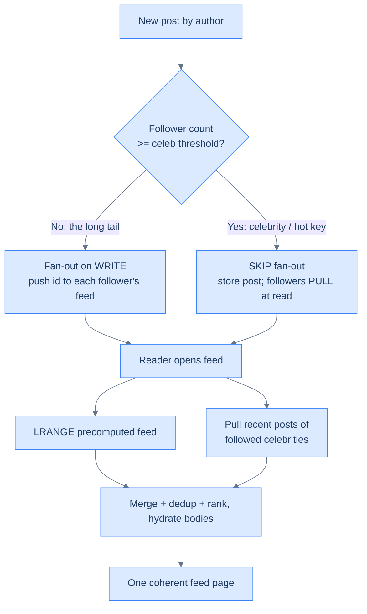
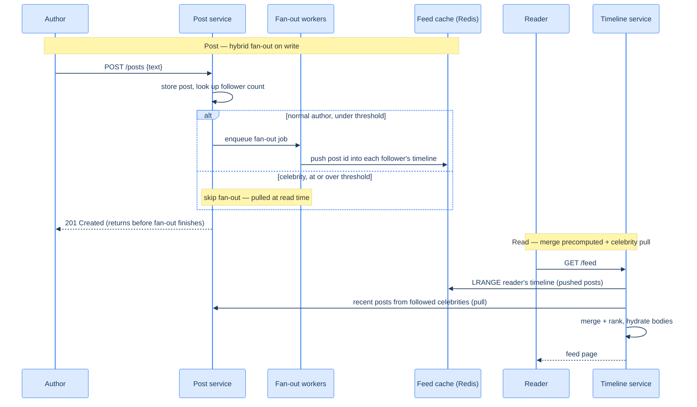

# 43. News feed / timeline (capstone)

## TL;DR
> A home timeline is the merge of recent posts from everyone you follow, and it's the capstone where **fan-out** lives or dies. **Fan-out on write (push)**: when you post, write your post's id into every follower's precomputed feed (a per-user Redis list) — reads become one cheap `LRANGE`, but a post costs **one write per follower**. **Fan-out on read (pull)**: store posts per-author and merge them at read time — writes are cheap, but every feed open does an expensive merge across everyone you follow. Push wins because feeds are read far more than they're written — *until* the **celebrity problem**: a 50-million-follower account posting once would trigger 50 million writes and saturate your fan-out workers, freezing everyone's feed. The production answer is **hybrid**: push for normal authors, **pull for celebrities**, and **merge the two at read time** behind a seam the user never sees. This is Twitter's actual design (Krikorian, 2013): Redis-materialized timelines for the masses, a separate fetch path for the famous. The other gotchas: the **cold-cache problem** (inactive users have no precomputed feed — rebuild lazily), fan-out **queue isolation**, and choosing **recency vs. ranking**.

## 1. Motivation

In **2013**, Twitter's VP of Engineering **Raffi Krikorian** gave a now-famous talk, *Timelines at Scale*, laying bare how Twitter builds your home timeline. The numbers framed the whole problem: over **400 million tweets per day**, up to **~30 billion timeline deliveries per day**, more than **150 million active users**, and over **300,000 timeline reads per second**. Faced with that, Twitter made a decisive choice — **precompute every user's timeline ahead of time** and store it in a giant **Redis** cluster, so that reading your home feed is a single, blisteringly cheap `LRANGE` over a ready-made list of tweet ids. When you tweet, a fan-out process writes that tweet's id into each of your followers' materialized timelines. Reads — the thing that happens 300,000 times a second — became trivial; the cost moved to writes, which happen far less often.

To see *why* that trade is worth it, picture the naïve alternative — assembling the feed on demand. Your home timeline is conceptually a database join: "give me recent posts by everyone I follow, newest first." DDIA works the exact same example and quantifies the pain: at ~10 million users online polling that join, and ~200 followed accounts each, you're doing on the order of **400 million post-lookups per second** — a number that is "very expensive to execute and difficult to make fast." Precompute-on-write collapses that same workload to roughly **1 million timeline writes per second** at a fan-out factor of 200 — *a 400× saving*, paid in advance, exactly where you have slack (writes) instead of where you don't (reads). The materialized timeline is, in DDIA's vocabulary, a **materialized view**: a cache of the result of that join, kept fresh by the fan-out process. That's the same move you'd make caching any expensive query — it just happens at social-graph scale. (And like Twitter's real timelines, the cached entries store *only* the post id and author id, not the post text — bodies are hydrated from the post store at read time; see §5.)

Except for one thing, and it's the thing every news-feed design trips over: **the celebrity**. If reading is cheap because you precomputed, then *posting* costs one write per follower — fine for someone with 200 followers, catastrophic for someone with 50 *million*. One tweet from a megastar would fire **50 million Redis writes**, saturate the fan-out worker queues, and delay timeline updates *for everybody*, not just that celebrity's followers. So Twitter's real design isn't pure push — it's a **hybrid**: fan-out-on-write for normal accounts, and for celebrities, *don't* fan out at all — instead, **pull their recent posts at read time and merge** them into the timeline you already precomputed, hiding the seam.

That single design — push for the many, pull for the few, merge at the edge — is the heart of this capstone, and it recurs everywhere there's a follow graph with wildly uneven degree. **Instagram** fans out a photo into followers' feeds the same way, then layers ML ranking on top; **Facebook's** News Feed pioneered the *ranked* (not chronological) version with EdgeRank; **TikTok** leans so far toward ranking that the follow graph barely drives the "For You" feed at all; **Mastodon** does the same per-user materialization but across a *federated* graph. The celebrity isn't a Twitter quirk — it's a structural fact of social graphs: follower counts follow a **power law**, so a handful of accounts (Barack Obama has >100M followers; the long tail has a few hundred) hold a wildly disproportionate share of all edges. In distributed-systems terms, a celebrity is a **hot key** — one partition key (the celebrity's id) that attracts orders of magnitude more traffic than any other, the same pathology that makes a single shard melt while the rest sit idle. The URL shortener ([Capstone 42](/cortex/system-design/capstones/url-shortener)) was read-heavy but *simple* — one immutable key→value. The news feed is read-heavy *and* personalized *and* constantly changing, and the tension between write cost and read cost is the whole game.

## 2. Requirements and scope

**Functional:**
- **Post:** a user publishes a post (`POST /posts`).
- **Follow:** a user follows another (`POST /follow`), building the social graph.
- **Home timeline:** `GET /feed` returns a merge of recent posts from everyone the user follows, newest-first (or ranked), paginated.

**Non-functional (these drive the design):**
- **Read-heavy:** feed opens vastly outnumber posts. Optimize the read.
- **Low read latency:** opening the app must feel instant (tens of ms), so the feed should be *precomputed*, not assembled from scratch each time.
- **Eventual consistency is fine:** a brand-new post showing up in followers' feeds a few seconds late is acceptable. We trade strict freshness for read speed and availability.
- **Tolerate extreme follower skew:** the design must survive both the 200-follower user and the 50-million-follower celebrity.

**Out of scope:** the *ranking* model itself (we'll note where it plugs in), direct messages, search, and the abuse/spam pipeline.

## 3. Back-of-envelope estimation

Numbers ([estimation](/cortex/system-design/foundations/back-of-envelope-estimation)) decide whether push is even affordable. Assume **200 million daily active users**, an average of **~200 followers** each, each posting **~0.5 times/day** and opening their feed **~15 times/day**.

| Quantity | Calculation | Result |
|---|---|---|
| Posts/day | 200M × 0.5 | **100M posts/day (~1,160/s)** |
| Feed reads/day | 200M × 15 | **3B reads/day (~35K/s avg, ~100K/s peak)** |
| Fan-out writes/day (pure push) | 100M posts × 200 followers | **~20 billion/day (~230K writes/s)** |
| One celebrity post | 1 × 50,000,000 followers | **50M writes from a single post** |
| Feed cache size | ~800 ids × 8 B × 200M users | **~1.3 TB (fits a Redis cluster)** |

Two lines tell the whole story. First, **reads (~35K/s) and the per-read cost** (a single `LRANGE`) confirm push is the right default — precomputing makes the common operation nearly free. Second, the **fan-out write line** is where it gets scary: 20 billion writes/day is large but *uniform and survivable*; the **celebrity line** is what breaks it — a single post generating 50M writes is a spike no queue can absorb without isolation. The estimation doesn't just size the system; it *names the enemy* (the celebrity) and tells you the fix can't be "push harder."

## 4. API

```
POST /posts            {"text": "...", "author_id": 42}
  201 Created          {"post_id": 9001, "created_at": "..."}

POST /follow           {"follower_id": 42, "followee_id": 99}
  204 No Content

GET  /feed?cursor=...   (the authenticated user's home timeline)
  200 OK               {"items": [ {post...}, ... ], "next_cursor": "..."}
```

`GET /feed` uses **cursor (keyset) pagination** ([API design](/cortex/system-design/application-architecture/api-design)) so an infinite scroll stays stable as new posts arrive at the top — offset pagination would duplicate and skip items on a feed that's changing every second.

## 5. Data model and the central decision

Three stores, each shaped to its access pattern:
- **Post store:** `post_id → {author_id, text, created_at, …}`, sharded by `post_id`. Durable source of truth; timelines hold only ids and hydrate bodies from here. Heavy media (images, video) lives in **object storage fronted by a CDN**, not in the post row — the post carries a URL, and the client pulls the bytes from the edge. This keeps the hot read path (ids → text → counts) small and pushes the multi-megabyte payloads to infrastructure built for them.
- **Social graph:** who-follows-whom (and follower *counts* — you need the count cheaply on every post to make the celebrity threshold call), in a graph or KV store, sharded by user.
- **Feed cache (the materialized timeline):** per-user, a **capped Redis list of recent post ids** — this *is* the precomputed home timeline. Capped because nobody scrolls thousands of posts deep; bounding the list to ~hundreds of entries keeps total memory in check (§3) and keeps each `LRANGE` cheap. Storing **only ids** (not full posts) is not just a memory optimization — it's also what makes deletes, edits, and like-count changes *correct*: because the body is hydrated fresh from the post store on every read (§11), the cached id list is allowed to be slightly stale or "dirty" without ever showing wrong content.

The central decision is **how the feed cache gets populated**:

| Strategy | On post (write) | On read | Cost shape |
|---|---|---|---|
| **Fan-out on write (push)** | write post id into *every follower's* feed list | one `LRANGE` | cheap reads, **write = O(followers)** — dies on celebrities |
| **Fan-out on read (pull)** | just store the post | gather + merge posts from *everyone you follow* | cheap writes, **read = O(followees)** — slow, repeated work |
| **Hybrid** ✅ | push for normal authors; **skip** for celebrities | `LRANGE` precomputed feed **+ pull recent celebrity posts**, then merge | bounded writes *and* fast reads |

The hybrid is the answer, and the knob is a **follower threshold** (Twitter's design has discussed values in the tens of thousands, e.g. ~10K–100K): below it, push; at or above it, don't fan out — the poster's followers will *pull* those posts when they read. Because a tiny number of accounts hold a huge share of all followers, **excluding just the celebrities from push slashes the total write volume** while leaving the read path fast for everyone.

There's a **second, mirror-image skew** that's easy to miss because it lives on the *other* side of the edge. The celebrity problem is about accounts with too many **followers** (one post → millions of writes). But consider an account that **follows** tens of thousands of high-volume posters — its *own* materialized timeline takes a punishing write rate, because every post from any of those followees lands in it. DDIA's fix is pragmatic and asymmetric: that user can't possibly read everything anyway, so it's fine to **drop or sample** some of those incoming timeline writes (show only a sample of recent posts). Contrast that with the celebrity case, where dropping writes is *not* OK (their followers genuinely expect to see the post) — which is exactly why the celebrity is handled by pull-and-merge instead. Same root cause (skew in the degree distribution), opposite mitigation, because the read expectations differ.

Visually, the whole population splits into three regimes by where each account sits in the degree distribution:



This is the same control flow the §7 sequence diagram and the `publish`/`home_timeline` code in §10 implement — the threshold test on write, the two-source merge on read.

## 6. Architecture

A write path (post → fan-out workers → feed cache) and a read path (timeline service → feed cache + celebrity pull → merge). Topology (D2):

```d2
direction: right
author: Author
reader: Reader
post: Post service
queue: Fan-out workers { shape: queue }
feedcache: Feed cache — Redis (per-user timelines) { shape: cylinder }
timeline: Timeline service
graph: Social graph store { shape: cylinder }
poststore: Post store { shape: cylinder }

author -> post: "POST /posts"
post -> poststore: "store post"
post -> graph: "follower count / list"
post -> queue: "fan-out job (normal authors)"
queue -> feedcache: "push post id -> each follower"
reader -> timeline: "GET /feed"
timeline -> feedcache: "LRANGE (push posts)"
timeline -> poststore: "pull recent celebrity posts + hydrate"
```

The same system as a C4 container view (responsibilities + who-talks-to-whom):

<iframe
  src="/c4/view/capstones_newsfeed_architecture"
  width="100%"
  height="420"
  style="border: 1px solid var(--border, #2b2b2b); border-radius: 8px;"
  loading="lazy"
  title="News feed — container view (hybrid fan-out)"
></iframe>

The fan-out workers drain a **queue** ([message queues](/cortex/system-design/distributed-patterns/message-queues-and-streams)) — fan-out is asynchronous, so posting returns immediately and the writes to millions of follower feeds happen in the background. This is exactly the [pub/sub fan-out](/cortex/system-design/distributed-patterns/pubsub-and-fanout) pattern applied to a social graph, and decoupling it behind a queue buys three things at once. First, **isolation**: you can put celebrity (or viral) jobs on a separate queue/worker pool (§8) so they can't starve everyone else's freshness. Second, **absorbing spikes**: when posts surge during a special event, you don't have to deliver immediately — enqueue the deliveries and accept that posts take a little longer to surface, while *reads* stay fast because they're served from the cache regardless of how backed-up fan-out is. Third, **fault tolerance**: a fan-out worker can crash mid-job, so the queue must let another worker take over **without missing any deliveries and without duplicating them** — i.e. fan-out delivery should be effectively exactly-once (or idempotent: pushing the same post id twice into a feed is a no-op you can dedup at read time). One thing the workers do *before* writing each follower's feed: apply **visibility rules** — mutes, blocks, "close friends"/audience scoping — so a muted author's post never enters your timeline even though the follow edge still exists.

## 7. The hot path

The write (post, with hybrid fan-out) and the read (merge precomputed + celebrity pull):



The read is the elegant part: most of your feed is *already sitting in your Redis list* (one `LRANGE`), and the timeline service only has to *additionally* fetch the recent posts of the handful of celebrities you follow and splice them in. The user sees one coherent, ranked feed; they never know that 99% of it was precomputed and 1% was assembled on the fly.

## 8. Bottlenecks and the 100× stretch

At 100× — **20 million DAU posting billions of times, ~2 trillion fan-out writes/day at naïve push** — here's what bends and how:

- **The celebrity problem is the headline (already solved by the hybrid).** Without it you simply cannot operate; with it, the write volume is bounded by *normal* users' follower counts, not the megastars'. This is the single most important design decision in the whole system.
- **Fan-out worker queue isolation.** A viral post (even from a sub-threshold account that suddenly gets retweeted) can flood the fan-out queue and delay *everyone's* feed updates. Isolate fan-out into **separate queues/worker pools by priority** (and cap per-job size) so one firehose can't starve the rest — the [bulkhead](/cortex/system-design/distributed-patterns/circuit-breakers-and-bulkheads) idea applied to background work.
- **The cold-cache problem (pull for inactive users).** You can't keep a materialized timeline for 2 billion *registered* users when only a fraction are active — it's wasteful and most would be stale. So you maintain feeds **only for active users** and **rebuild lazily**: when a dormant user returns, their feed is cold, so you fall back to a **pull** (merge their followees' recent posts) and repopulate the cache. First load is slower; subsequent loads are fast. This is *the same pull machinery* you already built for celebrities — inactive users are simply a second reason to fan out on read, so the two share a code path. (Note the neat duality: push is wasteful precisely for the accounts that *post* to inactive followers, and pull is the answer for both the accounts with too many followers and the readers who log in too rarely to justify a standing feed.)
- **Feed-cache sharding.** ~1.3 TB → ~130 TB of materialized timelines; shard the Redis cluster by user id ([sharding](/cortex/system-design/building-blocks/sharding-and-partitioning)). Reads stay single-shard (your timeline lives on one node). The reason to shard by *reader* id rather than author id is precisely the **hot-key** point from §1: sharding by author would pile a celebrity's entire follower-write storm onto one node; sharding by reader spreads those writes across the whole cluster (each follower's feed lives wherever *that reader* hashes to). For the unavoidable hot keys that remain, the standard relief valves apply — a dedicated shard for an individual hot key, or splitting a key with a random suffix.
- **Recency → ranking (chronological vs. ranked).** Early feeds were strictly **reverse-chronological** — simple, predictable, and what users intuitively expect. At scale, that gives way to an **ML-ranked** feed: a model scores each candidate by predicted engagement (Facebook's original EdgeRank multiplied *affinity × content-weight × time-decay*; modern rankers are learned models over hundreds of features). Crucially, **the fan-out architecture barely changes**: push + celebrity-pull still produce the *candidate set*; ranking is just a re-ordering stage bolted onto the end of the timeline service. Separating **candidate generation** (the fan-out you spent this whole chapter building) from **ranking** (the scoring model) is the clean seam that lets the two evolve independently — you can ship a new ranking model without touching fan-out at all.

The throughline: the news feed scales not by making fan-out faster, but by **not fanning out the things that are too expensive to fan out**, and assembling those few at read time instead.

## 9. Trade-offs

| Decision | Option | Why |
|---|---|---|
| Feed population | **Hybrid** vs pure push vs pure pull | push gives fast reads but dies on celebrities; pull gives cheap writes but slow reads; hybrid bounds writes *and* keeps reads fast |
| Celebrity threshold | **tens of thousands of followers** | low enough that no single post overwhelms the fan-out queue; high enough that you push for the vast majority of authors |
| Fan-out timing | **async (queue)** vs synchronous | async lets the post return instantly and lets you isolate/throttle fan-out; sync would block the poster on millions of writes |
| Cache coverage | **active users only, rebuild lazily** vs all users | materializing feeds for billions of dormant users wastes memory and produces stale work |
| Ordering | **recency** vs **ML ranking** | recency is simple and predictable; ranking lifts engagement but adds a model + a re-order stage and hides "new" posts |

## 10. Build It

An illustrative prototype of the hybrid: on post, push to followers *unless* the author is a celebrity; on read, merge the precomputed feed with a live pull of followed celebrities.

```python
CELEB_THRESHOLD = 50_000          # followers at/above this => pull, don't push

class NewsFeed:
    def __init__(self, graph, feed_cache, posts):
        self.graph, self.feed, self.posts = graph, feed_cache, posts

    def publish(self, author_id, post_id):
        self.posts.add(author_id, post_id)                  # durable store (source of truth)
        if self.graph.follower_count(author_id) < CELEB_THRESHOLD:
            for follower in self.graph.followers(author_id):  # FAN-OUT ON WRITE (normal author)
                self.feed.push(follower, post_id)             # one cheap LPUSH per follower
        # celebrity: do nothing here — their posts are PULLED at read time

    def home_timeline(self, user_id, limit=50):
        pushed = self.feed.range(user_id, limit)            # precomputed timeline: one LRANGE
        celeb_posts = [                                     # FAN-OUT ON READ for the few celebrities
            p for c in self.graph.followees(user_id)
            if self.graph.follower_count(c) >= CELEB_THRESHOLD
            for p in self.posts.recent(c, limit)
        ]
        merged = self._rank(set(pushed) | set(celeb_posts)) # merge + rank (recency or ML)
        return [self.posts.hydrate(pid) for pid in merged[:limit]]

    def _rank(self, post_ids):
        return sorted(post_ids, reverse=True)               # toy: newest-first; real: an ML scorer
```

The whole design is in `publish`'s `if` and `home_timeline`'s two sources. `publish` only fans out for sub-threshold authors, so a 50-million-follower post does **zero** fan-out writes; `home_timeline` recovers those posts by pulling the (few) followed celebrities and merging. Swap `_rank` for an ML scorer and you have the modern ranked feed; everything upstream is unchanged. (A real system also handles the cold-cache fallback in `home_timeline` — if `pushed` is empty for a returning dormant user, rebuild by pulling *all* followees, then repopulate the cache.)

## 11. Edge cases and failure modes

- **The celebrity (the defining one).** Pure push is impossible for high-follower accounts; the hybrid's threshold-based pull is non-negotiable, not an optimization. Get the threshold and the read-time merge right or the whole system melts on one viral post.
- **Cold cache / dormant users.** A user who's been away has an empty or evicted timeline; serving them requires a pull-and-rebuild, so their *first* load is slow. Maintain feeds for active users only and rebuild lazily — don't try to keep 2 billion live timelines.
- **Fan-out lag and queue saturation.** Fan-out is async, so a post isn't instantly in every follower's feed; a backlog (a celebrity-adjacent viral moment) can make feeds stale. Isolate and prioritize fan-out queues, cap job sizes, and monitor fan-out lag as a core SLO ([observability](/cortex/system-design/production-operations/observability)).
- **Deletes and edits.** A deleted or edited post still has its id sitting in millions of materialized timelines. Don't try to scrub every feed — **filter/hydrate at read time** against the post store (a deleted post hydrates to nothing and is dropped), so the materialized id list can be slightly "dirty."
- **Unfollow consistency.** After you unfollow someone, their already-pushed posts linger in your precomputed feed. Filter at read time against the *current* follow graph, or accept brief staleness — re-fanning-out on every unfollow is far too expensive.
- **Ordering surprises with ranking.** An ML-ranked feed can bury brand-new posts or show old ones, confusing users who expect chronological order; offer a "latest" toggle and be deliberate about how recency factors into the score.

## 12. Practice

> **Exercise 1 — The fan-out cost.**
> A platform has 100M posts/day. Average followers = 150, but one celebrity with **40 million** followers posts **20 times** today. (a) Roughly how many fan-out writes does pure push do for the *normal* traffic? (b) How many for that one celebrity alone, and what does it do to your fan-out queue? (c) How does the hybrid change (b)?
>
> <details>
> <summary>Solution</summary>
>
> **(a)** Normal traffic ≈ `100M posts × 150 followers = 15 billion` fan-out writes/day — large but uniform and survivable across a worker fleet. **(b)** The celebrity alone: `40M × 20 = 800 million` writes in one day, and worse, each *single* post is a **40-million-write burst** that floods the fan-out queue all at once — delaying timeline updates for *unrelated* users while the workers grind through it (the celebrity problem: a tiny number of accounts produce a wildly disproportionate, bursty share of fan-out). **(c)** With the **hybrid**, the celebrity is above threshold, so their posts do **zero** fan-out writes — their 800M-write contribution disappears entirely. Their followers instead **pull** those ~20 posts when they open their feed and merge them in. The hybrid converts an unbounded write spike into a bounded, read-time merge. That's why excluding the few celebrities from push is the single highest-leverage decision in the design.
>
> </details>

> **Exercise 2 — Push, pull, or hybrid?**
> Choose for each: (a) a small team-chat-style follow graph where everyone follows ~everyone and nobody has >1,000 followers; (b) a global microblog with power-law followers (most users tiny, a few with tens of millions); (c) a feed where posts are extremely frequent but reads are rare (a logging/audit timeline almost nobody opens).
>
> <details>
> <summary>Solution</summary>
>
> **(a) Pure push (fan-out on write).** With no celebrities (bounded follower counts) and read-heavy usage, precomputing every feed is cheap and gives instant reads; the hybrid's pull path would be unnecessary complexity. **(b) Hybrid.** Power-law followers is *exactly* the celebrity problem — push for the long tail of normal users, pull for the megastars, merge at read. This is the Twitter/Instagram case. **(c) Pure pull (fan-out on read).** When **writes ≫ reads**, pushing is wasteful — you'd fan out a flood of posts into feeds almost nobody opens. Store posts and assemble the rare reader's view on demand. The deciding question is always the **read:write ratio and the follower-degree distribution**: read-heavy + bounded degree → push; read-heavy + skewed degree → hybrid; write-heavy → pull.
>
> </details>

## Your Turn

Before you move on, check your understanding with the coach — explain the idea, apply it, weigh the trade-offs, then defend your reasoning.

<div class="concept-coach"></div>

## In the Wild

- **[Raffi Krikorian — "Timelines at Scale"](https://www.infoq.com/presentations/Twitter-Timeline-Scalability/)** (Twitter, 2013) — the §1 source: Redis-materialized timelines, fan-out-on-write at 300K+ reads/s, and the celebrity pull-and-merge. The canonical primary reference for this entire design.
- **[GetStream — "Fanout: how to scale activity feeds"](https://getstream.io/blog/fan-out-activities-followers/)** — a clear engineering treatment of push vs. pull vs. hybrid fan-out and the follower-threshold knob, from a company that does exactly this as a service.
- **[Mastodon](https://github.com/mastodon/mastodon)** — the open-source, federated take on a timeline (the stub's reference): home feeds are materialized per-user in Redis, fanned out on write across a *federated* follow graph — a great codebase to read the pattern in real, runnable code.
- **[Instagram Engineering — feed & ranking](https://instagram-engineering.com/)** — how a photo feed evolved from chronological to ML-ranked, i.e. the §8 "recency → ranking" stage in production, plus the storage/sharding choices behind it.
- **[Facebook — EdgeRank / News Feed ranking](https://en.wikipedia.org/wiki/EdgeRank)** — the original feed-ranking algorithm (affinity × weight × time-decay) and the historical pivot from "show everything chronologically" to "rank what matters," the conceptual root of every ranked feed since.

---

> **Next:** [44. Chat system](/cortex/system-design/capstones/chat-system) — the news feed was *eventually*-consistent and read-dominated; a chat system flips both. Messages must arrive **in order**, **exactly once**, and in **real time** (a long-lived connection, not a poll), with presence ("typing…", "online") and delivery receipts. Next we design WebSocket gateways, the message fan-out for group chats, and how you guarantee ordering and delivery when a phone drops off the network mid-conversation.
