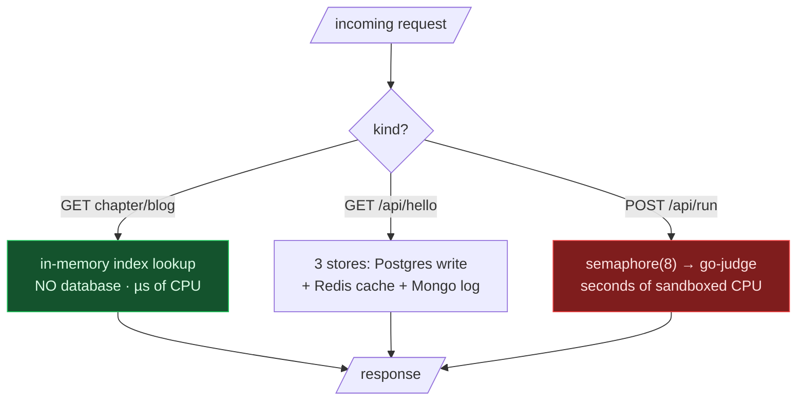

# 47. Cortex platform (capstone)

## TL;DR
> The previous ten capstones designed *famous* systems at hypothetical scale. This one designs **the system you're reading this on** — Cortex — at its *real*, honest, homelab scale, where every number is checkable against the source. Cortex is **one Scala 3 binary** serving a book, a blog, a code playground, and a demo, fronting **three single-instance stores** (Postgres, Redis, Mongo), a **go-judge** sandbox for running code, and a separate **Python tutor** for AI coaching — all on a **four-node K3s homelab**. Three constraints shape everything that follows: it runs **1 replica** (so a restart is an outage), capped at **1 GiB** of memory (so it OOM-kills if it overruns), and gates code execution behind a **global semaphore of 8** (so at most eight runs happen at once). The book/blog hot path is **served from an in-memory index with no database**, which is why a tiny box serves a lot of readers; the code playground is the expensive path, and the tutor is the one that costs *money*. Over the next five chapters we'll compute how many users it serves today, when it falls over, what it costs, how to scale it like LeetCode, and how to turn it data-intensive — using the same estimation → architecture → bottlenecks → cost playbook the rest of the book taught, turned inward.

## 1. Motivation

Every other capstone has a comfortable escape hatch: *"it's illustrative."* Nobody can audit your Twitter design against Twitter's real servers. This one has no escape hatch. Cortex is **open, small, and right here** — every constraint in this chapter is a line you can `grep` for, every latency is one you can measure, every dollar is one that shows up on a real card. That makes it the most honest system-design exercise in the book, and the most uncomfortable: when the math says *"the ninth person to hit Run waits behind a Scala compile,"* there's no hand-waving it away.

It's also the most *useful* exercise, because it's the shape most real systems actually are. You will spend far more of your career on systems serving thousands of users on a handful of boxes than on ones serving billions. The interesting questions at this scale aren't "how do we sustain 10M QPS" — they're "**what's the one thing that falls over first, how many users until it does, and what's the cheapest move that buys the most headroom?**" Cortex is a perfect specimen: deliberately simple, deliberately single-instance, and therefore brutally clear about where its edges are.

## 2. Requirements and scope

What is this system actually required to do?

**Functional:**
- **Serve the books and blog** — markdown chapters rendered in the browser, fast.
- **Run code** — `python run` / `java run` / `scala run` blocks execute in a sandbox and return output.
- **Coach** — the *Your Turn* tutor interviews a learner through a problem (a *separate* service; chapters 50 and the [onboarding Tutor section](/cortex/cortex-onboarding/cortex-tutor/what-the-tutor-is) cover it).
- **Authenticate** — sign-in via Keycloak gates the editor and rate-limits runs.

**Non-functional (these are the design — and they're modest on purpose):**
- **Cheap to run.** It's a homelab. The infra budget is "a power bill," not "a Series A."
- **Single operator.** No on-call rotation; the operator *is* the SRE.
- **Read-dominated, cache-friendly.** The book is immutable per deploy — the ideal workload.
- **Correct under failure.** Non-critical dependencies (cache, event log) must degrade, not crash.

**Out of scope (today):** horizontal scale, multi-region, high availability. Naming that boundary honestly is the point — most of this section is about *where* that boundary sits and *what it would take* to move it.

## 3. The architecture, three ways

Three views, because a system this real deserves more than one diagram. First the **runtime topology** as a LikeC4 container view — the actual pods and how they connect (pan/zoom, or **Zoom** for fullscreen):

<iframe
  src="/c4/view/capstones_cortexplatform_container"
  width="100%"
  height="460"
  style="border: 1px solid var(--border, #2b2b2b); border-radius: 8px;"
  loading="lazy"
  title="Cortex platform — container view"
></iframe>

Then the **request fan-out** as a Mermaid flow — the crucial insight is that the three request *kinds* have wildly different costs:



And the **physical substrate** as a D2 topology — four nodes, one of them the public edge:

```d2
direction: right
edge: vm-1 · edge (Contabo) {
  traefik: Traefik + TLS
}
ms1: ms-1 · K3s server {
  cortex: cortex (1 replica)
  gojudge: go-judge
  likec4: likec4
  tutor: cortex-tutor
}
wk1: wk-1 · db worker {
  pg: Postgres { shape: cylinder }
  ollama: Ollama (wk-1 coach)
}
wk2: wk-2 · gitops worker {
  redis: Redis { shape: cylinder }
  mongo: Mongo { shape: cylinder }
}
internet: Internet
internet -> edge.traefik: "443"
edge.traefik -> ms1.cortex: "overlay (WireGuard)"
ms1.cortex -> wk1.pg
ms1.cortex -> wk2.redis
ms1.cortex -> wk2.mongo
ms1.cortex -> ms1.gojudge
ms1.cortex -> ms1.likec4
ms1.tutor -> wk1.pg
ms1.tutor -> wk1.ollama
```

(Pod placement is illustrative — K3s schedules where it likes; what's fixed is the *node roles*: ms-1 control plane, wk-1 database, wk-2 general, vm-1 public edge.)

## 4. The three constraints that decide everything

Everything in chapters 48–52 is downstream of three numbers, all checkable in the repo:

| Constraint | Value | Where | Consequence |
|---|---|---|---|
| **Replicas** | **1** | `infra/.../cortex/base/deployment.yaml` | A pod restart is a *full outage*. No redundancy. |
| **Memory limit** | **1 GiB** | same | Overrun → **OOMKill (exit 137)**. The in-memory content index lives in this budget. |
| **Run concurrency** | **semaphore of 8** | `CodeRunPipeline.scala` (`MaxConcurrentRuns = 8`) | At most 8 code runs execute at once; the 9th *waits*. |

There's a fourth, softer one — a **1-vCPU limit** (1000m) — that throttles rather than kills. And two rate limits (anon **10/60s per IP**, auth **100/3600s per user**) that cap *rate* but not *concurrency*. Hold these six numbers; they're the whole capacity story.

## 5. Why the read path is nearly free

The single most important architectural fact about Cortex: **serving a chapter touches no database.** On startup the server walks `content/cortex/` once into an in-memory, mtime-keyed index (`MtimeCachedIndex`); a chapter request is then a map lookup and a write to the socket. No Postgres round-trip, no Redis, nothing to contend on. The markdown is even rendered *in the browser*, so the server ships a raw string and is done.

That's why a 1-vCPU box serves a surprising number of readers — and it sets up the latency budget for the whole platform. Here's where each operation Cortex performs sits on the latency landscape (a cache-hit read is *nanoseconds* of work; a Scala compile is *seconds* — nine orders of magnitude apart):

```d3 widget=latency-scaled-time
{
  "title": "Cortex's latency budget — where each operation sits (1 ns ≡ 1 s on the human scale)",
  "scaleSeconds": 1.0e9,
  "items": [
    { "label": "In-memory index lookup",   "ns": 200, "highlight": true },
    { "label": "Redis cache hit (greeting)", "ns": 200000 },
    { "label": "Postgres visit increment",  "ns": 2000000 },
    { "label": "Mongo event append",        "ns": 3000000 },
    { "label": "Python run (typical)",      "ns": 2000000000, "highlight": true },
    { "label": "Scala run (cold compile)",  "ns": 20000000000, "highlight": true }
  ]
}
```

Read that gap. The read path is in the *nanoseconds-to-microseconds* band; the run path is in the *seconds* band. A system whose cheap path is a billion times cheaper than its expensive path **must protect the expensive path** — which is exactly what the semaphore of 8 does, and exactly what [chapter 48](/cortex/system-design/capstones/cortex-capacity-today) computes the limits of.

## 6. Build It — fail-open in one screen

The other load-bearing design choice is **degraded mode**: Postgres is the only *critical* store; Redis and Mongo failures are logged and ignored, so `/api/hello` still answers. Here's that policy as a runnable model — watch the request succeed with the cache and log "down," and fail *only* when the canonical store is down:

```python run
def handle_hello(*, postgres_up, redis_up, mongo_up):
    # Mirrors HelloPipeline: Postgres is canonical; Redis + Mongo are best-effort.
    if not postgres_up:
        return "503 — canonical store down (the ONE thing that takes us down)"
    visits = "read from cache" if redis_up else "cache miss → Postgres (+1 read, fine)"
    log = "appended" if mongo_up else "skipped (logged-and-ignored)"
    return f"200 — visits via {visits}; event {log}"

scenarios = [
    dict(postgres_up=True,  redis_up=True,  mongo_up=True),   # all healthy
    dict(postgres_up=True,  redis_up=False, mongo_up=True),   # Redis down → degraded, still 200
    dict(postgres_up=True,  redis_up=True,  mongo_up=False),  # Mongo down → degraded, still 200
    dict(postgres_up=False, redis_up=True,  mongo_up=True),   # Postgres down → the only 503
]
for s in scenarios:
    print(handle_hello(**s))
```

The shape *is* the lesson: three dependencies, but only one of them can take you down. That asymmetry is what makes a single-replica, single-store system survivable enough to run on a home server — and it's the seed of the failure analysis in [chapter 49](/cortex/system-design/capstones/cortex-failure-thresholds).

## 7. Trade-offs

| Decision | Cortex's choice | The alternative | Why this, here |
|---|---|---|---|
| Replicas | **1** | 2+ behind a balancer | A homelab with a cache-served read path doesn't *need* HA; the cost is "restart = brief outage." |
| Content delivery | **baked into the image, in-memory** | a CMS / DB-backed content | Immutable-per-deploy content is the cheapest, fastest, most cacheable thing there is. |
| Code execution | **in-process semaphore → shared go-judge** | a job queue + worker fleet | Synchronous is simpler and fine at this scale; the queue is the [scaling move](/cortex/system-design/capstones/scaling-cortex-like-leetcode). |
| Critical stores | **Postgres only; Redis/Mongo fail-open** | treat all stores as required | Maximises availability: the non-critical deps can't take the site down. |
| Tutor | **separate Python service, BYOK-capable** | fold AI into the Scala app | Different workload (streaming, I/O-bound) and different *cost model* — see [ch 50](/cortex/system-design/capstones/cortex-storage-and-cost). |

## 8. Edge cases and failure modes (preview)

The full ranked analysis is [chapter 49](/cortex/system-design/capstones/cortex-failure-thresholds), but the headline: the **single replica** and the **1 GiB limit** are the top two risks, and they're correlated — an OOMKill *is* a restart *is* an outage. Everything else (go-judge saturation, Postgres pool exhaustion, Redis down) degrades a *feature*, not the *site*. That ordering — one or two things cause outages, the rest cause degradation — is the property you design *for* when you can only afford one replica.

## 9. Practice

> **Exercise — Which request is which?**
> A monitoring graph shows three request classes with median server-CPU costs of ~0.2 ms, ~2 ms, and ~2,000 ms. Map each to a Cortex endpoint, and say which one the semaphore of 8 exists to protect.
>
> <details>
> <summary>Solution</summary>
>
> **~0.2 ms = a chapter/blog read** (in-memory index lookup, no DB). **~2 ms = `/api/hello`** (a Postgres write + Redis + Mongo — still cheap, but it touches the network and three stores). **~2,000 ms = `/api/run`** (a sandboxed code execution — and a Scala run is 10× that again, dominated by a cold `scala-cli` compile). The **semaphore of 8 protects the run path**: it's the only request whose cost is measured in seconds and whose memory footprint (up to ~1 GiB per JVM run) can exhaust the executor node. Capping concurrency there is what stops one burst of "Run" clicks from taking down the sandbox — the subject of the next chapter.
>
> </details>

## 10. In the Wild

- **[`infra/deploy/apps/cortex/base/deployment.yaml`](https://github.com/ani2fun/infra)** — the actual Deployment: `replicas: 1`, `limits: {cpu: 1000m, memory: 1Gi}`, the probes. Every number in §4 is here.
- **[Cortex Onboarding → Request Lifecycle](/cortex/cortex-onboarding/how-it-works/request-lifecycle)** — the click-to-response trace for a run and a chapter fetch, from the engineer's-tour book.
- **[Designing Data-Intensive Applications](https://dataintensive.net/)** (Kleppmann) — the lens for chapters 50–52; "reliable, scalable, maintainable" is exactly the homelab's three-way tension.
- **[The Twelve-Factor App](https://12factor.net/)** — Cortex is close to 12-factor (stateless-ish process, config in env, stores as attached resources), which is *why* the scaling roadmap in [ch 51](/cortex/system-design/capstones/scaling-cortex-like-leetcode) is short.

---

> **Next:** [48. Cortex capacity today](/cortex/system-design/capstones/cortex-capacity-today) — we stop describing and start computing. How many readers can one 1-vCPU replica serve, how many code-runs per second can a semaphore of 8 sustain, and exactly when does the ninth person to hit Run start waiting? Little's law meets a real homelab.
