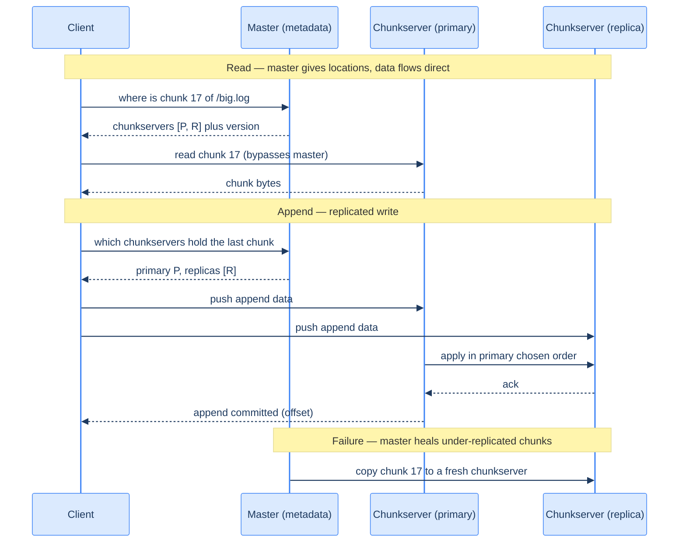
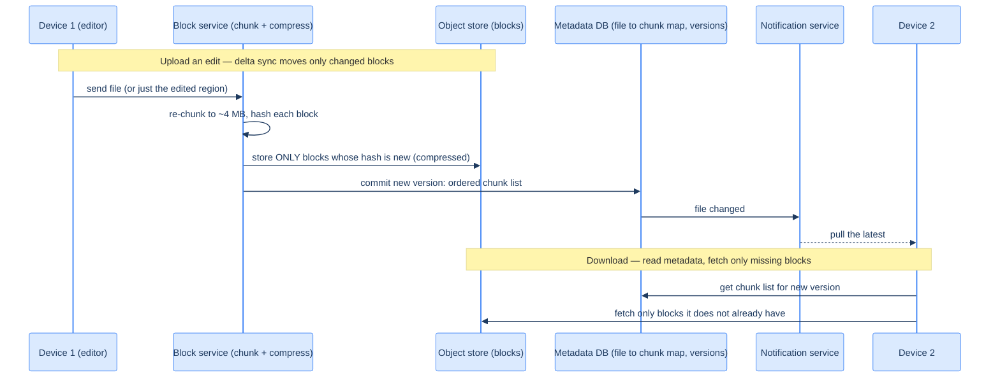

# 48. Distributed file storage (capstone)

## TL;DR
> Storing petabytes on thousands of commodity machines means **failure is constant, not exceptional** — so durability has to be built in software. The design (from Google's **GFS**, 2003, and its open clone **HDFS**): split each file into large **fixed-size chunks** (GFS **64 MB**, HDFS **128 MB**), **replicate every chunk** across machines (default **3×**, on different racks so one rack dying loses nothing), and run a **master** that holds *only metadata* — the namespace, the file→chunk map, and the chunk→location map — and makes global placement and re-replication decisions. The crucial move: the **master stays out of the data path**. A client asks the master "where is chunk N?", gets a list of chunkservers, and then **reads/writes the chunk bytes directly** from a chunkserver — so the master (one machine, metadata in RAM) is never the bandwidth bottleneck. When a disk or machine dies, the master notices missing chunks and **re-replicates** them. To cut the 3×-replication cost (200% overhead), modern systems use **erasure coding** (e.g. 6 data + 3 parity ≈ 50% overhead for the same fault tolerance — the basis of [object storage's](/cortex/system-design/storage-and-search/object-storage) eleven-nines), and content-addressed **chunk dedup** (identical chunks stored once).

## 1. Motivation

In **2003**, three Google engineers — Ghemawat, Gobioff, and Leung — published *The Google File System*, a paper that quietly rewired how the industry thinks about storage. Its premise was almost contrarian: Google would store enormous datasets not on a few expensive, reliable enterprise servers, but on **thousands of cheap commodity machines** — and it would simply *assume those machines fail all the time*. With thousands of disks spinning, a disk dies, a machine reboots, a rack loses power **every single day**; at that scale, **failure isn't an exception to handle, it's the normal operating condition**. So instead of trying to prevent failure with expensive hardware, GFS builds **tolerance of failure into the software**: split every file into **64 MB chunks**, store **3 copies** of each chunk on different machines (and racks), and have a **master** keep track of where every chunk lives so that when a machine dies, the system notices the now-under-replicated chunks and makes fresh copies — automatically, continuously, invisibly.

The single most important architectural decision in that paper is one people often miss: **the master is not in the data path**. It would be natural to route all reads and writes *through* the master — but a single master serving petabytes of file data would be an instant bottleneck. Instead, the master holds only **metadata** (which is small — a chunk's location is a few bytes), and a client uses it like a phone book: "where does chunk 17 of `/big.log` live?" → "chunkservers A, B, C" → and then the client talks to a chunkserver **directly** to move the actual bytes. The master handles tiny, infrequent metadata lookups; the chunkservers, collectively, provide enormous aggregate bandwidth for the data.

This capstone is the foundation under almost everything else in the storage chapter — **HDFS** is essentially open-source GFS (NameNode + DataNodes, 128 MB blocks), and the [object storage](/cortex/system-design/storage-and-search/object-storage) (S3, Dropbox) you've leaned on all along is this idea evolved with **erasure coding** for cheaper durability and **content-addressed dedup**. It's the system that makes "store this petabyte and never lose it" a solved problem.

The *same skeleton* powers a second, very different-looking system: the **consumer file-sync products** — Dropbox, Google Drive, OneDrive, iCloud. They have the opposite workload (millions of *small* files, edited from a phone on a metered connection, that must appear identically on five devices), but they solve it with the identical moves — **split each file into content-addressed blocks**, store the **bytes in an object store** while a separate **metadata database** tracks the file→block map and versions, and **replicate for durability** — plus three twists the datacenter version doesn't need: **delta sync** (re-upload only the blocks that changed), **compression** (shrink the bytes on the wire), and **conflict resolution** (what happens when two devices edit the same file at once). We'll build the datacenter version first (§1–§9), then layer those consumer-sync twists on top — both are "distributed file storage," and the contrast is half the lesson.

## 2. Requirements and scope

**Functional:**
- **Store/read large files** (gigabytes to terabytes), split transparently into chunks.
- **Durability:** survive disk, machine, and rack failures with **no data loss**.
- **High aggregate throughput** for large, mostly-sequential reads and appends.
- *Optional:* content-addressed **dedup** (store identical chunks once).

**Non-functional (these drive the design):**
- **Failure is normal:** at thousands of machines, something is always broken — the system must self-heal (re-replicate) continuously.
- **Bandwidth scales with machines:** the data path must **not** funnel through any single node.
- **Optimized for large files + sequential/append access**, not millions of tiny random writes (that's a different workload).
- **Metadata must be cheap to track** (it lives in the master's memory) — which is why chunks are *large*.

**Out of scope:** POSIX semantics and tiny-file workloads (this is built for big files), the consensus details of master high-availability ([covered separately](/cortex/system-design/building-blocks/consensus-paxos-and-raft)), and the full object-storage API.

## 3. Back-of-envelope estimation

Numbers ([estimation](/cortex/system-design/foundations/back-of-envelope-estimation)) — and the chunk size is a deliberate metadata-vs-overhead lever. Assume we store **1 exabyte (10¹⁸ bytes)** of data with **64 MB chunks** and **3× replication**.

| Quantity | Calculation | Result |
|---|---|---|
| Chunks | 1 EB ÷ 64 MB | **~15.6 billion chunks** |
| Chunk replicas (3×) | 15.6B × 3 | **~47 billion replicas to place + track** |
| Master metadata | 15.6B chunks × ~64 bytes | **~1 TB of metadata** |
| Raw storage needed (3×) | 1 EB × 3 | **3 EB of disk** |
| Raw storage (erasure 6+3) | 1 EB × 1.5 | **1.5 EB of disk (half the cost)** |

Two tensions jump out. First, **why chunks are large**: with 64 MB chunks, an exabyte is ~15.6 billion chunks and ~1 TB of metadata — which strains even a single beefy master's RAM. Smaller chunks (say 4 MB) would *16×* the chunk count and the metadata, blowing past one master entirely; larger chunks waste space on small files. 64 MB is the balance that keeps metadata tractable. (At true exabyte/100× scale even 1 TB of metadata pushes you to **shard the metadata** across many masters — HDFS Federation, modern object stores — the single-master limit GFS eventually hit.) Second, **3× replication costs 200% overhead** (3 EB of disk for 1 EB of data); **erasure coding (6+3)** delivers comparable fault tolerance for **~50% overhead** — at exabyte scale that's a *colossal* cost saving, which is exactly why object stores use it.

## 4. API

```
PUT  /files/{path}     (stream the file; it's split into chunks, each replicated)
  201 Created

GET  /files/{path}                     → client fetches chunk list from master, reads chunks direct
  Step 1: GET /meta/{path}             200 {"chunks": [{"id":17,"servers":["A","B","C"]}, ...]}
  Step 2: GET <chunkserver A>/chunk/17 200 (raw 64 MB chunk bytes — bulk, bypasses master)
```

The two-step read *is* the architecture: a tiny **metadata** call to the master, then **bulk data** transfers straight to/from chunkservers. The master never touches a byte of file content — it only ever answers "where?". (Object-store front-ends like S3 hide this behind a single `GET`/`PUT`, but the same split lives underneath: a metadata/index lookup, then bulk bytes from the storage tier.)

## 5. Data model and the central decision

Two layers, split by *what's small* (metadata) and *what's huge* (chunk bytes):
- **Master metadata** (small, in memory): the **namespace** (`/path → file`), the **file→chunk list**, and the **chunk→{locations, version}** map. This is the brain.
- **Chunkservers** (huge, on disk): `chunk_id → 64 MB of bytes`, each chunk present on ~3 servers.

The **central design decision** is the trio: **chunk, replicate, and keep the master out of the data path.**

1. **Chunk** every file into fixed-size (64 MB) pieces, each with a globally unique id. Large chunks keep metadata small and favour big sequential I/O.
2. **Replicate** each chunk to **3 chunkservers on different racks**, so losing a disk, a machine, *or a whole rack* loses zero data — and the master continuously re-replicates any chunk that drops below 3 copies.
3. **Master holds metadata only.** A client asks the master *once* for a chunk's locations, then moves the bytes **directly** with a chunkserver. The master's job is global decisions (where to place chunks, what to re-replicate) on a small in-memory dataset — never bandwidth.

Two evolutions reduce the cost of (2). **Erasure coding** replaces "3 whole copies" with "k data + m parity fragments" (e.g. 6+3): you can lose any `m` fragments and reconstruct, at ~50% overhead instead of 200% — the same math behind [object storage's eleven-nines durability](/cortex/system-design/storage-and-search/object-storage) (Capstone 28), so this chapter cross-references it rather than re-deriving the Reed-Solomon arithmetic. And **content-addressed dedup** (the Dropbox angle): name each chunk by the **hash of its contents** (e.g. SHA-256), so the chunk *id is* its fingerprint. Two files — or two users, or the same file before and after a one-line edit — that share an identical chunk store that chunk **once**; before uploading a chunk a client just asks "do you already have hash `abc…`?" and skips the transfer if so. The analogy is a library that shelves **one copy per distinct book** and hands every borrower a *call number* rather than a fresh print run: a hundred people "storing" the same bestseller cost one shelf slot and a hundred index cards. It's a huge win when many people upload the same popular file (a meme, a course PDF, a shared deck) — and, combined with delta sync (§7), it's why editing one paragraph of a 50 MB document re-uploads kilobytes, not megabytes.

Worth pinning down because it recurs throughout: **metadata database vs. block storage are two different stores with two different shapes.** The *block storage* (the chunkservers / an object store like S3) holds large, **immutable**, write-once blobs and is optimised for durability and bulk throughput — it answers "give me the bytes of chunk `abc`." The *metadata database* holds small, **mutable**, frequently-queried records — users, files, the ordered chunk list per file version, devices — and is optimised for fast transactional reads/writes; it answers "which chunks, in what order, make up `/report.pdf` version 7?" Keeping them separate lets each scale and be tuned independently (the same inode-style split [object storage](/cortex/system-design/storage-and-search/object-storage) makes between its data store and its index), and it's why a file is reconstructed by reading the metadata first, *then* fetching its blocks.

## 6. Architecture

A metadata path to the master and a bulk-data path direct to chunkservers. Topology (D2):

```d2
direction: right
client: Client
master: "Master (namespace, chunk to location map)" { shape: rectangle }
cs1: Chunkserver A { shape: cylinder }
cs2: Chunkserver B { shape: cylinder }
cs3: Chunkserver C { shape: cylinder }

client -> master: "where is chunk N? (metadata only)"
client -> cs1: "read/write chunk bytes (direct)"
cs1 -> cs2: "replicate chunk (3x across racks)"
cs1 -> cs3: "replicate chunk (3x across racks)"
master -> cs1: "heartbeat + re-replicate on failure"
```

The same system as a C4 container view:

<iframe
  src="/c4/view/capstones_distributedfilestorage_architecture"
  width="100%"
  height="420"
  style="border: 1px solid var(--border, #2b2b2b); border-radius: 8px;"
  loading="lazy"
  title="Distributed file storage — container view (master + chunkservers)"
></iframe>

The picture makes the key idea visual: the **thin line** from client to master (small metadata) and the **fat line** from client to chunkservers (bulk bytes). Scale the chunkservers out and aggregate bandwidth grows linearly; the master, handling only metadata, isn't on that fat line at all. The chunkserver-to-chunkserver arrows are the **replication** that makes a disk death a non-event, and the master→chunkserver heartbeat is how it learns a server is gone and triggers **re-replication** ([replication](/cortex/system-design/building-blocks/replication)).

## 7. The hot path

A read (metadata then direct data), a replicated write, and the self-healing on failure:



Two things to notice. On the **read**, the master's only contribution is the one-line "it's on P and R" — then the (potentially gigabytes of) data flow straight from chunkserver to client, never through the master. On the **append**, the client pushes data to all replicas and a designated **primary** chooses the order so all replicas apply the write identically (keeping the copies consistent), then acks. And the **failure** line is the system's heartbeat: the master constantly checks replica counts, and the instant a chunk drops below its target (a chunkserver died), it tells a surviving replica to copy the chunk somewhere new — so durability is *actively maintained*, not just hoped for.

**The consumer-sync hot path is the same shape, optimised for a slow uplink.** A datacenter client sits on a fat network and just re-writes whole chunks. A phone on cellular cannot — so Dropbox/Drive add two bandwidth optimisations on the *client* side before any bytes leave the device:

- **Delta sync.** When you edit a file, the client re-chunks it, hashes each block, and uploads **only the blocks whose hash changed** — the rest already exist in the store (it knows from the metadata). Change two paragraphs in a long doc and only those one or two blocks move; this is the rsync idea applied to content-addressed chunks. (Dropbox uses ~4 MB blocks — far smaller than GFS's 64 MB — precisely because small blocks make delta sync *finer-grained*: a smaller block means a smaller "diff unit," so an edit re-uploads less.)
- **Compression.** Each changed block is **compressed before upload** (and stays compressed at rest), shrinking both the bytes on the wire and the bytes stored. The codec is content-aware — gzip/zstd for text, but already-compressed media (JPEG, MP4) is left alone since re-compressing it wastes CPU for ~zero gain.

So the upload is: *chunk → hash → skip blocks the store already has → compress the survivors → upload → commit the new version's chunk list in the metadata DB → notify the user's other devices to pull.* A central server-side block service typically does the chunking/compression/encryption (one trusted implementation, rather than re-implementing — and securing — it on iOS, Android, and web). The complementary view (note the smaller block size and the "only changed blocks" arrow versus the datacenter diagram above):



And because two devices can edit the same file before either has synced, consumer sync needs a **conflict policy** the append-only datacenter store never faced: the usual rule is **first write to reach the server wins**, and the loser is *not* silently overwritten — the system keeps both and surfaces a "conflicted copy" (`report (Device-2's conflicted copy).pdf`) for the human to merge. (True simultaneous co-editing — two cursors in one Google Doc — is a different problem solved with operational transforms / CRDTs, out of scope here.) We return to this in §11.

## 8. Bottlenecks and the 100× stretch

At 100× — **exabytes across tens of thousands of machines, where dozens of disks fail every hour** — here's what bends:

- **The single master's metadata ceiling.** All chunk metadata lives in the master's RAM (~1 TB at an exabyte with 64 MB chunks). That's GFS's real limit, and at 100× it breaks — so you **shard the metadata** across many masters (HDFS Federation, or a distributed metadata store), partitioning the namespace. The data path was never the problem; the *metadata* is.
- **Re-replication storms.** When a machine (or rack) dies, *all* its chunks are suddenly under-replicated, and the master races to re-copy them — a burst of network traffic that can saturate links and compete with live reads. Throttle re-replication, prioritize the most-under-replicated chunks (a chunk down to 1 copy before one down to 2), and spread the copies across the fleet.
- **Replication cost → erasure coding.** 3× (200% overhead) at exabyte scale is billions of dollars of extra disk. **Erasure coding (6+3 ≈ 50% overhead)** delivers the same durability far cheaper — at the cost of more CPU and a more complex repair (reconstruct from k fragments). Use replication for hot data (fast reads), erasure coding for the colder bulk.
- **Hot files / hot chunks.** A wildly popular file's chunks get read far more than its 3 replicas can serve. **Increase the replication factor** for hot chunks specifically, and cache them — the popularity skew (Zipfian) you've seen all chapter.
- **Sync fan-out (the consumer-sync stretch).** Every online device holds a persistent connection (Dropbox uses **long polling**) so the notification service can say "your file changed — pull." That's tens of millions of mostly-idle connections; one machine can hold on the order of a million, so the fleet is large — and when a notification node dies, *all* its clients reconnect at once, a thundering-herd reconnect storm that takes a while to drain. Spread connections widely, stagger reconnects with backoff, and (as Dropbox did) split the online/offline **presence** tracking into its own service so other features can reuse it.
- **Durability math (the eleven-nines claim).** "11 nines" means designing so the *probability* of losing a chunk is astronomically low: with copies spread across independent racks/zones and **continuous re-replication faster than failures accumulate**, you'd need many independent failures to coincide within the repair window. The number isn't magic — it's replication/erasure-coding + fast repair + failure independence, exactly as in [object storage](/cortex/system-design/storage-and-search/object-storage).

The throughline: scaling file storage is about **keeping the metadata tractable** (large chunks, sharded masters) and **repairing faster than things break** (continuous re-replication), while the data path scales itself by adding chunkservers.

## 9. Trade-offs

| Decision | Option | Why |
|---|---|---|
| Chunk size | **large (64–128 MB, datacenter)** vs **small (~4 MB, consumer sync)** | large chunks keep metadata small and favour big sequential I/O; *small* chunks explode the master's metadata but give finer-grained delta sync (smaller diff unit) — the choice follows the workload |
| Durability | **3× replication** vs **erasure coding (6+3)** | replication is simple + fast to read but 200% overhead; EC is ~50% overhead (huge at scale) but costs CPU + complex repair |
| Master role | **metadata-only, off the data path** vs in-path | a single master can't serve petabytes of bandwidth; keep it to tiny metadata lookups and let chunkservers move bytes |
| Metadata scale | **single master** vs **sharded/federated** | one master is simpler and makes great global decisions, but its RAM caps total chunks; shard it past that ceiling |
| Dedup | **content-addressed (hash = id)** vs store-as-named | dedup stores identical chunks once (big win for shared/popular files) but adds hashing + a content index |
| Sync strategy | **delta sync + compression** vs re-upload whole file | sending only changed (compressed) blocks slashes bandwidth on edits — essential on metered/mobile links; costs client CPU for hashing + (de)compression |
| Concurrent edits | **first-writer-wins + conflicted copy** vs last-write-wins vs real merge | keeping both copies never silently loses a user's work; LWW is simpler but can drop data; true co-editing needs OT/CRDTs (out of scope) |
| Consistency on write | **primary-ordered replicated append** vs anything-goes | a primary picking the write order keeps all replicas byte-identical without a global lock |

## 10. Build It

An illustrative chunk-and-replicate write plus a metadata-driven read — the master tracks locations, chunkservers hold bytes, data bypasses the master.

```python
CHUNK = 64 * 1024 * 1024     # 64 MB
REPLICAS = 3

class Master:                # metadata only — never touches chunk bytes
    def __init__(self):
        self.files = {}                       # path -> [chunk_id, ...]
        self.locations = {}                   # chunk_id -> [chunkserver, ...]

    def place(self, chunk_id, servers):       # pick REPLICAS servers on distinct racks
        self.locations[chunk_id] = servers[:REPLICAS]

    def lookup(self, path):                    # the only call on the read hot path
        return [(cid, self.locations[cid]) for cid in self.files[path]]

def write_file(master, path, data, cluster):
    chunk_ids = []
    for i in range(0, len(data), CHUNK):
        chunk_id = f"{path}#{i // CHUNK}"
        servers = cluster.pick_servers(REPLICAS)          # distinct racks for failure independence
        master.place(chunk_id, servers)
        for s in servers:
            s.store(chunk_id, data[i:i + CHUNK])          # bulk bytes go straight to chunkservers
        chunk_ids.append(chunk_id)
    master.files[path] = chunk_ids                        # metadata committed last

def read_file(master, path):
    parts = []
    for chunk_id, servers in master.lookup(path):          # 1. ask master WHERE (metadata)
        parts.append(servers[0].read(chunk_id))            # 2. read bytes DIRECT from a chunkserver
    return b"".join(parts)

def re_replicate(master, cluster):                         # the self-healing loop (runs forever)
    for chunk_id, servers in master.locations.items():
        live = [s for s in servers if cluster.is_alive(s)]
        if len(live) < REPLICAS:                           # a server died -> chunk under-replicated
            target = cluster.pick_servers(REPLICAS - len(live))
            for t in target:
                t.store(chunk_id, live[0].read(chunk_id))  # copy from a survivor
            master.place(chunk_id, live + target)          # restore the target replica count
```

The design is the structure: `write_file` **chunks** the file and **fans each chunk to REPLICAS distinct servers**, while the master records only *where* (no bytes); `read_file` does the **two-step** — ask the master where, then read bytes **directly** from a chunkserver; and `re_replicate` is the **continuous self-healing** that makes failure a non-event — it constantly checks replica counts and re-copies any chunk that's fallen short. Swap `s.store` for erasure-coded fragments and you have the cheaper-durability variant. Two more swaps give you the **consumer-sync** variant: derive the chunk id from `hashlib.sha256(block).hexdigest()` instead of the positional `path#i`, and `write_file` becomes **content-addressed** — `if chunk_id in master.locations: skip` is exactly **dedup** *and* **delta sync** in one line (an unchanged block already has its hash in the store, so you never re-upload it); compress each `data[i:i+CHUNK]` before `store` and you've added the bandwidth win too.

## 11. Edge cases and failure modes

- **Failure is the normal case (the defining mindset).** With thousands of disks, something is always dead. The system must *expect* it: continuous heartbeats, continuous re-replication, and durability that's actively maintained rather than assumed. Design for the broken steady state, not the happy path.
- **The single-master metadata ceiling.** All chunk metadata in one master's RAM is simple and enables great global decisions — until the chunk count outgrows memory. Past that, shard/federate the namespace; and make the master **highly available** ([consensus](/cortex/system-design/building-blocks/consensus-paxos-and-raft)) since it's a SPOF for metadata.
- **Re-replication storms.** A dead rack makes thousands of chunks under-replicated at once; an un-throttled repair burst saturates the network and starves live traffic. Prioritize the most-endangered chunks (1 copy left first) and rate-limit repair.
- **Correlated failures defeat replication.** Three replicas on the same rack/power-domain die *together* in one outage — replication only helps if copies are **independent**. Place replicas across racks/zones, or the "3 copies" is an illusion.
- **Small-file / random-write abuse.** This system is built for large files and sequential/append access; millions of tiny files explode metadata and waste the large chunk, and random small writes fight the append-oriented design. Use a different store (or pack small files) for that workload.
- **Concurrent edits → sync conflicts (the consumer-sync case).** Two devices edit the same file before either syncs; whichever write lands first commits its version, and the second now conflicts with a base it no longer matches. **Never silently overwrite** the loser — the safe, standard move is *first-writer-wins, keep both*: accept the first, and save the second as a visible **conflicted copy** for the user to reconcile, optionally aided by **per-file version history** (immutable past versions) so nothing is truly lost. Last-write-wins is simpler but can quietly destroy a user's work; genuine simultaneous co-editing of one document is a different beast (operational transforms / CRDTs), deliberately out of scope.
- **Stale reads after a chunkserver lags.** A replica that missed recent appends can serve old data; chunk **versioning** (the master tracks the current version) lets clients/servers detect and skip a stale replica.

## 12. Practice

> **Exercise 1 — Why is the master not in the data path?**
> A teammate proposes routing all file reads and writes *through* the master "so it can enforce consistency in one place." (a) Why is that fatal at petabyte scale? (b) What does the master do instead, and what makes that role scale?
>
> <details>
> <summary>Solution</summary>
>
> **(a)** A single master in the data path would have to move **every byte** of file content — petabytes of read/write bandwidth funnelled through one machine. No single node has that bandwidth, so the master instantly becomes the throughput bottleneck and SPOF for *all* data, defeating the entire point of spreading data across thousands of chunkservers. **(b)** The master holds **only metadata** — the namespace and the chunk→location map, which is small (a chunk's location is a few bytes). On a read it answers one tiny question — "which chunkservers hold chunk N?" — and then the client transfers the **bulk bytes directly** with a chunkserver, never touching the master again. That role scales because **metadata is tiny and lookups are infrequent relative to bytes moved**: one machine can comfortably serve millions of "where?" lookups/second on an in-memory map, while the *aggregate bandwidth* for the actual data grows linearly as you add chunkservers. Separating the small "where" (master) from the huge "what" (chunkservers) is the architectural key — and the master's RAM for metadata, not bandwidth, is what eventually limits scale.
>
> </details>

> **Exercise 2 — Replication vs. erasure coding.**
> You store 1 exabyte. (a) How much raw disk does 3× replication need, and how many simultaneous failures does it survive? (b) How much does 6+3 erasure coding need, and what does it survive? (c) When would you still choose replication?
>
> <details>
> <summary>Solution</summary>
>
> **(a)** 3× replication stores three full copies → **3 EB of raw disk** (200% overhead) and survives **any 2 simultaneous** replica losses (a third copy remains). **(b)** 6+3 erasure coding splits data into 6 data + 3 parity fragments; you can reconstruct from any 6 of the 9, so it survives **any 3 simultaneous** fragment losses — and it needs only `9/6 = 1.5×` raw disk → **1.5 EB** (50% overhead). So EC gives *more* fault tolerance (3 vs 2) for *a quarter* of the overhead (50% vs 200%) — at an exabyte, that's roughly **1.5 EB saved**, an enormous cost win, which is why object stores erasure-code the bulk. **(c)** You still choose **replication for hot data**: reading a replicated chunk is a single direct read from any copy, whereas reading erasure-coded data may require fetching several fragments and (on a missing fragment) a CPU-heavy reconstruction. Replication's read simplicity/speed wins for frequently-accessed data; erasure coding's cost wins for the cold bulk. Most large systems use **both** — replicate hot, erasure-code cold.
>
> </details>

> **Exercise 3 — Delta sync and dedup on the wire.**
> A user keeps a **100 MB** file in a sync product that chunks into **4 MB** content-addressed blocks (25 blocks). (a) They edit a few sentences near the start, changing exactly **1 block**. With delta sync, how much is uploaded versus re-sending the whole file? (b) Their teammate already has the *identical* original file in a shared folder. When that teammate's client goes to upload it, how much does **content-addressed dedup** transfer? (c) Why does this product pick **4 MB** blocks while the datacenter file system in §1 picks **64 MB**?
>
> <details>
> <summary>Solution</summary>
>
> **(a)** Delta sync re-uploads only the changed block: **4 MB** instead of 100 MB — a **25×** bandwidth saving (and with compression on that block, less still). The client re-chunks, hashes all 25 blocks, finds 24 hashes the store already has, and ships only the 1 new block — plus a tiny metadata update recording the new version's ordered chunk list. **(b) ~0 bytes of block data.** Every one of the 25 blocks already exists in the store under its content hash, so the teammate's client asks "do you have hash `…`?" for each, gets 25 yeses, and uploads **no blocks at all** — it just writes metadata mapping the teammate's file name to the existing chunk ids. (This is also why a shared/popular file costs one physical copy, not one per user.) **(c)** Block size is a *workload* decision: small **4 MB** blocks make the **diff unit** small, so an edit re-uploads kilobytes-to-megabytes rather than a whole large chunk — exactly what you want for many small, frequently-edited files on slow links. The datacenter system optimises the opposite axis — huge sequential reads and *minimal metadata* — so it wants **large 64 MB** chunks even though that makes deltas coarse. Same architecture, block size tuned to the access pattern.
>
> </details>

## Your Turn

Before you move on, check your understanding with the coach — explain the idea, apply it, weigh the trade-offs, then defend your reasoning.

<div class="concept-coach"></div>

## In the Wild

- **[The Google File System (Ghemawat, Gobioff, Leung)](https://research.google/pubs/the-google-file-system/)** (SOSP 2003) — the §1 source and one of the most influential systems papers ever written: 64 MB chunks, the metadata-only master off the data path, 3× replication, and the "failure is normal" philosophy. Read it.
- **[HDFS Architecture](https://hadoop.apache.org/docs/stable/hadoop-project-dist/hadoop-hdfs/HdfsDesign.html)** — open-source GFS: NameNode + DataNodes, 128 MB blocks, rack-aware 3× replication, and the same client-reads-directly-from-DataNode data path. The version you can actually run.
- **[HDFS Erasure Coding](https://hadoop.apache.org/docs/stable/hadoop-project-dist/hadoop-hdfs/HDFSErasureCoding.html)** — the §8 cost lever in production: Reed-Solomon (e.g. 6+3) for ~50% overhead instead of replication's 200%, with the read/repair trade-offs spelled out.
- **[Amazon S3 / object storage](https://aws.amazon.com/s3/)** — the cloud evolution of this design ([Capstone 28](/cortex/system-design/storage-and-search/object-storage)): chunking + erasure coding across AZs for eleven-nines durability, behind a simple object API. Where most of us actually store our bytes today.
- **[Dropbox — "Inside the Magic Pocket"](https://dropbox.tech/infrastructure/inside-the-magic-pocket)** — Dropbox's exabyte-scale storage system, including content-addressed chunking/dedup and erasure coding — the §5 "store identical chunks once" idea at real scale.
- **[The rsync algorithm (Tridgell & Mackerras)](https://rsync.samba.org/tech_report/)** — the rolling-checksum technique behind **delta sync** (§7): transfer only the parts of a file that changed, without the receiver ever sending the whole file back. The classic "move just the diff" paper that consumer sync is built on.

---

> **Next:** [49. Payment system](/cortex/system-design/capstones/payment-system) — file storage could lose a duplicate and shrug; a payment system can lose *nothing* and double *nothing* — charge a customer twice and you've stolen from them; charge zero and you've worked for free. Next we design for **exactly-once money movement**: idempotency keys, the **double-entry ledger** that makes every cent balance, reconciliation, and how you coordinate a payment across a bank, a card network, and your own books without a distributed transaction you can't have.
