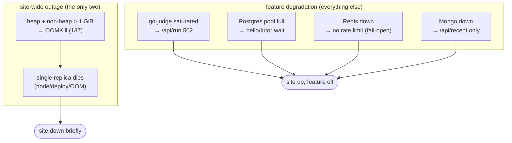

# 49. Cortex failure thresholds

## TL;DR
> When you push a single-replica homelab past its limits, things fail in a **specific, rankable order** — and the most valuable thing you can know as its operator is that order. For Cortex it's: **(1) the single replica** — any restart (bad deploy, node drain, OOM) is a *full outage* because there's no second pod; **(2) the 1 GiB OOMKill** — overrun the limit and the kernel kills the pod (exit 137), which *is* a restart, which *is* an outage; **(3) go-judge RAM** — 8 concurrent heavy runs can need up to ~8 GiB of sandboxes, and the semaphore exists precisely to bound this; **(4) the permit queue + 100 s timeout** — sustained overload makes runs wait until the client gives up; **(5) the Postgres pool of 10** — heavy hello/tutor concurrency blocks the 11th borrower; **(6) Redis down** — *fail-open*, so rate-limiting silently stops (degraded, not down); **(7) Mongo down** — only `/api/recent` breaks. The throughline: **exactly two things cause a site-wide outage (the replica and its memory limit); everything below degrades a feature.** That asymmetry is what makes one replica survivable — and it's the thing to design for when you can't afford two.

## 1. Motivation

A capacity number ("~4 runs/s") is a steady-state ceiling. It doesn't tell you what an *incident* looks like — and incidents are where operators live. The useful artifact isn't "the max throughput"; it's a **ranked list of what fails first, at what load, with what blast radius**, so that when the site is slow at 2am you check causes in their actual likelihood order instead of guessing. This chapter builds that list for Cortex, grounded entirely in the real constraints from [chapter 47](/cortex/system-design/capstones/cortex-platform-overview).

Two honesty notes up front, because this is a real system and real systems have sharp edges:

- **The Java sandbox limit is *not* what you'd guess.** You'd expect all JVM languages to get the big 1 GiB / 60 s budget. In the code as written, **only Scala and Kotlin override the defaults**; **Java inherits the *interpreted* limits (512 MiB / 15 s)**. That changes the rank-3 RAM math, so we carry it explicitly rather than paper over it. (It's arguably a bug — flag it, don't hide it.)
- **The node RAM figure is an assumption.** The real per-node memory lives in the `infra` repo, not here. We assume **~16 GiB per worker node** and express every RAM-exhaustion threshold against that — change the assumption, change the threshold.

## 2. The ranked ladder — what saturates first

```d2
# The ranked ladder, top = worst blast radius (a d2 `title:` markdown block clips
# in the renderer, so the heading above the diagram carries the caption instead).
direction: down
r1: 1 · Single replica restart — FULL OUTAGE { style.fill: "#7f1d1d"; style.font-color: "#fee2e2" }
r2: 2 · 1 GiB OOMKill (exit 137) — FULL OUTAGE { style.fill: "#991b1b"; style.font-color: "#fee2e2" }
r3: 3 · go-judge RAM (8 heavy runs) — /api/run down { style.fill: "#b45309"; style.font-color: "#fff7ed" }
r4: 4 · Permit queue + 100s timeout — /api/run errors { style.fill: "#b45309"; style.font-color: "#fff7ed" }
r5: 5 · Postgres pool (10) exhausted — hello + tutor { style.fill: "#a16207"; style.font-color: "#fefce8" }
r6: 6 · Redis down — rate limits stop (fail-open) { style.fill: "#15803d"; style.font-color: "#dcfce7" }
r7: 7 · Mongo down — /api/recent only { style.fill: "#15803d"; style.font-color: "#dcfce7" }
r1 -> r2 -> r3 -> r4 -> r5 -> r6 -> r7: worsening rank ↓
```

The full picture, with the **trigger** and the **blast radius** for each:

| # | What falls over | Trigger | Blast radius |
|---|---|---|---|
| **1** | **Single replica gone** | any OOMKill, node drain, bad deploy | **Total** — book, blog, run, tutor-validate all down until restart |
| **2** | **1 GiB OOMKill** | heap + non-heap > 1 GiB (seen near ~1018 MiB) | Total (→ #1). Burstable QoS → first evicted under node pressure |
| **3** | **go-judge node RAM** | 8 concurrent heavy runs | `/api/run` 502s; book/blog/tutor keep working |
| **4** | **Permit queue + timeout** | offered run-rate > λ_max, sustained | `/api/run` UX degrades, then errors at ~100 s waits |
| **5** | **Postgres pool (10)** | >10 concurrent DB ops (hello flood or tutor burst) | hello + tutor persist block; **book/blog unaffected** (no DB on that path) |
| **6** | **Redis down** | Redis pod down | **fail-open** — rate limits stop, cache misses → more PG load; *degraded, not down* |
| **7** | **Mongo down** | Mongo pod down | `/api/recent` 503s; everything else fine |

## 3. The top of the ladder is one incident

Ranks 1 and 2 aren't two problems — they're the same one. There is **one replica**, so an **OOMKill is an outage**. And the 1 GiB budget isn't generous: the in-memory content index is *resident* in that heap (it competes with request buffers and GC headroom), and the pod has been observed sitting near ~1018 MiB. A burst of large concurrent responses plus GC lag can cross 1 GiB → exit 137 → the ReplicaSet restarts the pod → ~tens of seconds of total unavailability.



**Mitigations that don't require a second replica:** keep the index lean, set a sane JVM heap ceiling below the container limit (so the JVM GCs before the kernel kills), and watch RSS. The *real* fix — a second replica so a restart isn't an outage — is [ch 51](/cortex/system-design/capstones/scaling-cortex-like-leetcode) stage 1, and it's not free (the per-pod semaphore has to become distributed first).

## 4. The go-judge RAM threshold (with the honest Java caveat)

Rank 3 is the executor. Eight permits, each heavy JVM run up to ~1 GiB of sandbox. Two models, because of the Java limit:

| Model | Worst-case 8-concurrent RAM | On a ~16 GiB node |
|---|---|---|
| **Spec-intended** (all JVM = 1 GiB) | 8 × 1 GiB = **8 GiB** | survivable alone; tight with co-tenants + page cache |
| **Code-as-written** (Scala/Kotlin = 1 GiB, Java + interpreted = 512 MiB) | all-Scala still **8 GiB**; a Java-heavy mix less | same ceiling for the Scala worst case |

Either way, **8 GiB of simultaneous sandboxes on a node is the thing the semaphore of 8 exists to bound.** If go-judge is OOM-killed or evicted, `/api/run` returns `BackendFailure` (502) — but the book, blog, and tutor keep serving, because the executor is a *separate* workload. That isolation is the design paying off: the expensive, dangerous path can fall over without taking the cheap path with it.

## 5. The fail-open boundary (ranks 6–7)

The bottom of the ladder is where Cortex's degraded-mode design shows its value. **Redis down doesn't down the site** — the rate limiter and greeting cache *fail open*. But "fail open" has a cost worth naming: with the limiter gone, **anonymous run-rate limiting silently disappears**, so go-judge loses its per-client guard and leans *entirely* on the semaphore. And every greeting now misses the cache and hits Postgres — adding rank-5 pressure. So a Redis outage isn't nothing; it's a quiet removal of protection that makes ranks 3 and 5 more likely.

One concrete second-order effect: a cache that's down (or a hot key that just expired) means concurrent reads all miss and stampede the origin. That's a general caching failure mode — here's the shape, with and without request coalescing:

```d3 widget=cache-stampede
{
  "title": "Cache-down second-order effect — N concurrent misses hammer the origin (Postgres)",
  "concurrency": 100,
  "concurrencyRange": [10, 500],
  "originLatencyMs": 100,
  "originLatencyRange": [10, 500],
  "originCapacity": 50
}
```

(For Cortex the "origin" is Postgres and the greeting is cheap, so this is mild — but it's the exact mechanism by which a *non-critical* store going down raises load on the *critical* one. In a system where the cache absorbs expensive reads, this is how a cache blip becomes a database outage.)

## 6. Build It — find which threshold trips first

A model of the ladder: ramp the load and print which resource crosses its limit first. It encodes the real numbers (1 GiB pod, 8 permits, 10 PG connections) and shows that, as you scale concurrent users, the failures arrive in rank order:

```python run
def first_to_break(concurrent_users, runs_fraction=0.1, hello_fraction=0.2):
    """Given N concurrent users, report the first limit crossed (rank order)."""
    concurrent_runs   = concurrent_users * runs_fraction      # share hitting /api/run
    concurrent_db_ops = concurrent_users * hello_fraction     # share touching Postgres
    pod_mem_mib       = 300 + concurrent_users * 0.4          # rough resident + per-conn overhead

    breaches = []
    if pod_mem_mib > 1024:               breaches.append((2, "1 GiB OOMKill → OUTAGE"))
    if concurrent_runs > 8:              breaches.append((3, "go-judge: >8 concurrent runs queue/strain"))
    if concurrent_db_ops > 10:           breaches.append((5, "Postgres pool (10) exhausted"))
    if not breaches:
        return f"{concurrent_users:>5} users: OK (mem~{pod_mem_mib:.0f}MiB, runs~{concurrent_runs:.0f}, db~{concurrent_db_ops:.0f})"
    rank, what = min(breaches)           # lowest rank number = worst blast radius = trips 'first'
    return f"{concurrent_users:>5} users: FIRST BREACH rank {rank} — {what}"

for n in (50, 100, 500, 1000, 2000):
    print(first_to_break(n))
print("\nThe failures arrive in rank order as load climbs — which is the order to check them in an incident.")
```

The point isn't the exact crossover (the coefficients are illustrative); it's that **the ranked ladder is also a triage order**. When the site misbehaves, you check rank 1 (is the pod alive?), then 2 (OOMKilled?), then 3 (go-judge?), and so on — causes in likelihood order, not a random walk.

## 7. Trade-offs

| Decision | Choice | Buys | Costs |
|---|---|---|---|
| Replicas | **1** | simplicity, cost | restart = outage (ranks 1–2) |
| Store criticality | **PG critical, Redis/Mongo fail-open** | a non-critical outage can't down the site | fail-open *removes protection* silently (rank 6) |
| Executor isolation | **separate go-judge workload** | `/api/run` can die without downing the book | a second thing to operate + a NetworkPolicy |
| Run admission | **semaphore matched to RAM** | bounds rank-3 RAM blow-up | the 9th run waits ([ch 48](/cortex/system-design/capstones/cortex-capacity-today)) |

## 8. Practice

> **Exercise 1 — Order the checks.**
> The site is "slow." In what order do you check the seven ranks, and why is that order not arbitrary?
>
> <details>
> <summary>Solution</summary>
>
> Check in **rank order — 1 to 7 — because that's both worst-blast-radius-first and roughly most-likely-first for a single-replica system.** (1) Is the pod alive and Ready? A crash loop or OOMKill is a total outage and the most consequential thing to rule out. (2) Was it OOMKilled (exit 137)? (3) Is it *only* `/api/run` that's slow? → go-judge saturation. (4) Are runs timing out under sustained load? → permit queue. (5) Is `/api/health` showing Postgres pressure? → pool exhaustion. (6) Redis up? If not, you've lost rate-limiting (degraded). (7) Mongo only affects `/api/recent`. Checking in this order means you find site-down causes before feature-degraded ones, and you spend your first 60 seconds on the things most likely to be the actual problem.
>
> </details>

> **Exercise 2 — The fail-open trap.**
> Redis goes down at the same moment an anonymous user starts hammering `/api/run`. Walk the chain. What's the *only* thing still protecting go-judge?
>
> <details>
> <summary>Solution</summary>
>
> Redis down → the **rate limiter fails open** (rank 6), so the anonymous user's **10/60 s cap silently stops applying**. Their run requests now flow unthrottled toward go-judge. The **only remaining guard is the semaphore of 8** (rank 3) — it still caps *concurrency*, so go-judge can't be pushed past 8 simultaneous sandboxes regardless of how fast requests arrive. So the site stays up and go-judge stays bounded, but the *queue* grows and runs start hitting the 100 s timeout (rank 4). The lesson: fail-open is the right call (a cache outage shouldn't down the site), but it means your *defense-in-depth* matters — the semaphore is doing the protecting that the (absent) rate limiter normally shares. Lose both layers and rank 3 becomes a real crash.
>
> </details>

## 9. In the Wild

- **[`Languages.scala`](https://github.com/ani2fun/cortex)** — the per-language sandbox limits. Look closely at the Java entry: it inherits the interpreted defaults, the §1 caveat. (Worth a PR.)
- **[`HelloPipeline.scala`](https://github.com/ani2fun/cortex)** — the fail-open `logWarning`-then-ignore on Redis/Mongo that puts ranks 6–7 at the bottom.
- **[Kubernetes resource limits & QoS](https://kubernetes.io/docs/concepts/configuration/manage-resources-containers/)** — Burstable QoS and OOMKill behaviour behind ranks 1–2.
- **[Cortex Onboarding → Observability & incidents](/cortex/cortex-onboarding/runbooks/production/observability-and-incidents)** — this ladder as an operational triage runbook.

---

> **Next:** [50. Cortex storage & cost](/cortex/system-design/capstones/cortex-storage-and-cost) — what grows without bound (the Mongo log), what the homelab actually costs versus the cloud, and the per-coached-session AI-token model that explains why BYOK is the difference between a $7 and a $5,000 monthly bill.
