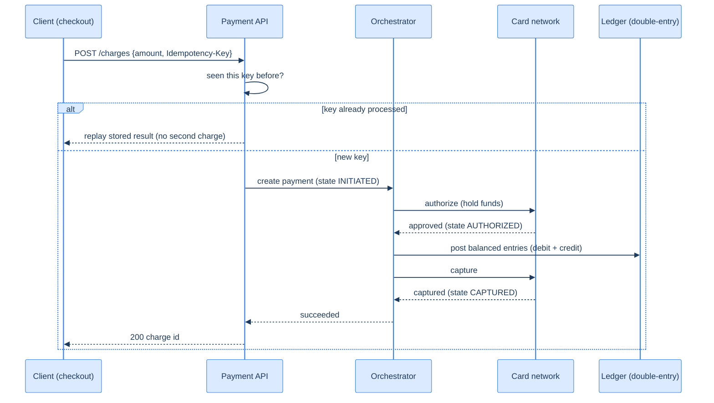
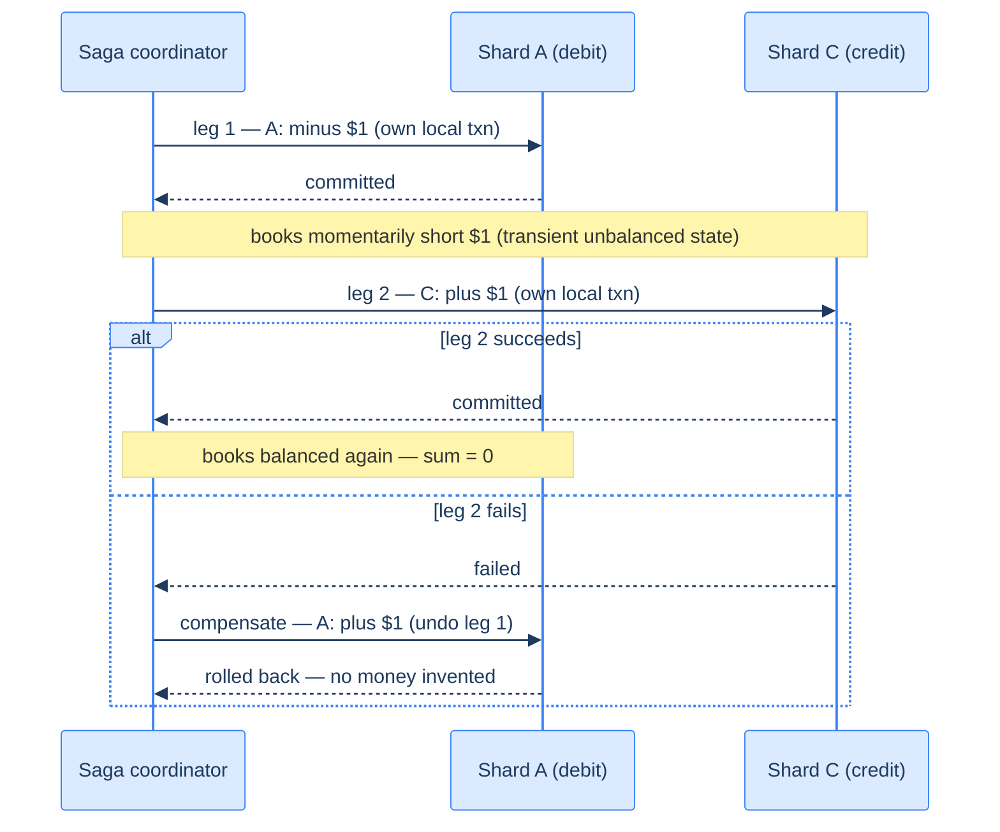

# 49. Payment system (capstone)

## TL;DR
> Money is special: the system must move it **exactly once** — never double-charge, never lose a charge, and every cent must **balance**. Three pillars make that true. **(1) Idempotency keys:** every charge carries a client-generated key; the server checks it *first* and, if seen, **replays the stored result** instead of charging again — so a retry over a flaky network is safe (the [Lesson 19](/cortex/system-design/distributed-patterns/idempotency-retries-backoff)/[33](/cortex/system-design/application-architecture/api-design) idea, now load-bearing). **(2) A double-entry ledger:** every payment posts a **debit and an equal credit**, so the sum of all entries is always **zero** — a 500-year-old accounting discipline (Pacioli, 1494) that makes bugs *detectable* rather than silent. **(3) A per-payment state machine / saga:** a payment touches your books, a card network, and banks, and you **cannot run a distributed transaction across Visa** — so you drive each payment through `INITIATED → AUTHORIZED → CAPTURED → SETTLED` with idempotent, compensatable steps ([sagas](/cortex/system-design/distributed-patterns/sagas-and-distributed-transactions)). The honest truth about distributed money: **exactly-once = at-least-once + idempotency + reconciliation** — a job that continuously compares your ledger against the network's settlement reports to catch the discrepancies that *will* occur. Payments prize **correctness over throughput**.

## 1. Motivation

In **1494**, a Franciscan friar named **Luca Pacioli** — a mathematician who tutored and collaborated with Leonardo da Vinci — published *Summa de Arithmetica*, which contained the first printed description of a bookkeeping method Venetian merchants had been using: **double-entry bookkeeping**. The idea is deceptively simple and quietly profound: record **every transaction twice** — as a **debit** in one account and an equal **credit** in another — so that the books are always *in balance*, the sum of all debits equalling the sum of all credits. Pacioli didn't invent it, but by formalizing it he gave the world a tool that, *more than five centuries later*, still underpins every financial statement, every audit, and every fintech ledger on Earth. Why has it lasted 500 years? Because it turns a silent failure into a **loud, detectable** one: if money appears or vanishes incorrectly, **the books stop balancing**, and you *know* something is wrong.

That is exactly the property a payment system needs, because a payment system has the least forgiving correctness requirement in this whole book. A [feed](/cortex/system-design/capstones/news-feed) can show a stale post; a [file store](/cortex/system-design/capstones/distributed-file-storage) can keep a redundant copy; a [chat](/cortex/system-design/capstones/chat-system) can deliver a duplicate. But **charge a customer twice and you have stolen from them; charge them zero and you have worked for free; lose track of a cent and your books are wrong.** There is no "eventually consistent" version of "did we take this person's money." So a payment system marries Pacioli's 500-year-old ledger discipline with a modern one — the **idempotency key** (popularized for APIs by Stripe), which makes a retried charge provably safe — and then confronts the hard reality: a single payment spans **your system, a card network, and banks**, none of which you can wrap in one atomic transaction.

This capstone is about **exactly-once money movement across systems you don't control.** It leans on idempotency ([Lesson 19](/cortex/system-design/distributed-patterns/idempotency-retries-backoff)), sagas ([Lesson 21](/cortex/system-design/distributed-patterns/sagas-and-distributed-transactions)), the outbox pattern ([Lesson 20](/cortex/system-design/distributed-patterns/outbox-pattern-and-cdc)), and an ACID [relational ledger](/cortex/system-design/building-blocks/relational-databases) — and it accepts a humbling truth: you cannot *prevent* every discrepancy, so you build a **reconciliation** pipeline to *catch* them.

**The cast of characters.** Before the design, meet the players, because the architecture is mostly about *who you trust and who you can't*. When you buy something on a marketplace, money doesn't teleport from your card to the seller. It moves in two hops. **Pay-in:** your card is charged and the funds land in the *marketplace's* bank account — and crucially, the marketplace doesn't *own* that money yet; it's a **custodian** holding it until the goods ship. **Pay-out:** once delivery is confirmed, the marketplace releases the balance (minus its fee) to the seller's bank account. Splitting the flow this way is what lets a platform hold escrow, net fees, and refund cleanly. Between you and the card networks sits a **PSP (Payment Service Provider)** — Stripe, PayPal, Adyen, Braintree — whose one job is to *move money from account A to account B* by talking to the **card schemes** (Visa, Mastercard, Amex), which talk to the banks. You integrate with the PSP and let *it* navigate the byzantine card-network ecosystem; it's the specialist you rent so you don't have to become Visa-certified yourself.

## 2. Requirements and scope

**Functional:**
- **Charge:** authorize and capture a payment from a customer to a merchant.
- **Refund / reverse:** return money, recorded as new (reversing) ledger entries — never by deleting history.
- **Idempotent retries:** the same charge submitted twice (network retry) results in **one** charge.
- **Balanced books + reconciliation:** the ledger always balances, and discrepancies vs. external settlement are detected.

**Non-functional (these drive the design):**
- **Exactly-once money movement:** the cardinal requirement — no double-charge, no lost charge.
- **Strong consistency + durability:** the ledger is the source of truth; a committed entry is never lost. Correctness *over* throughput.
- **Auditability:** every cent traceable; the ledger is **immutable and append-only**.
- **Tolerate slow/flaky external systems** (card networks) without losing money — via state machines, idempotency, and reconciliation.

**Deliberately scoped:** we *don't* store raw card numbers (PANs) — we keep card data **outside our PCI-DSS boundary** via tokenization and a PSP-hosted page (§6 explains how, and why it shrinks our compliance burden dramatically). **Out of scope:** fraud/risk scoring (a specialized third-party concern), FX/multi-currency mechanics, and the full card-network settlement ecosystem (real and hard, but separate).

## 3. Back-of-envelope estimation

Numbers ([estimation](/cortex/system-design/foundations/back-of-envelope-estimation)) — modest by web standards, because payments trade throughput for ironclad correctness. Assume a peak of **10,000 payments/second**.

| Quantity | Calculation | Result |
|---|---|---|
| Payments/day | 10K/s × 86,400 | **~864 million/day** |
| Ledger rows/day | 864M × ≥2 (double-entry) | **~1.7 billion+ entries/day** |
| Idempotency records/day | one per payment | **~864 million/day** |
| Auth latency (user waiting) | dominated by card-network round trip | **hundreds of ms** |
| Consistency target | every entry | **strong / no lost writes** |

The numbers themselves are *unremarkable* — 10K/s is tiny next to a [feed's](/cortex/system-design/capstones/news-feed) millions/s — and that's the point: **payments optimize for correctness, not raw scale.** But notice the quiet doubling: each payment is really **two** ledger writes, not one. A transfer of $1 from A to B *deducts* from A **and** *credits* B — so "1M payments/second" is secretly **2M ledger operations/second**, and your node count doubles with it. If a single ACID database node sustains ~1,000 write-TPS, 1M transfers needs not 1,000 nodes but ~2,000. That factor-of-two is the first thing an interviewer probes, and it falls straight out of double-entry. Every payment also writes an idempotency record and several state transitions, all of which must be **durable and strongly consistent** — so the ledger lives in an ACID [relational database](/cortex/system-design/building-blocks/relational-databases) (the kind that's been battle-tested by banks for a decade, with mature tooling and a deep DBA hiring pool), not an eventually-consistent store. The latency that matters is **authorization** (the customer is standing at checkout), and it's mostly the **card-network round trip** you can't speed up — which is why capture and settlement are pushed **asynchronous**, off the user's critical path.

## 4. API

```
POST /charges
  Headers:  Idempotency-Key: a1b2c3-one-per-intent
  Body:     {"amount": 4999, "currency": "usd", "source": "tok_visa", "merchant": "m_42"}
  200 OK    {"id": "ch_9", "status": "succeeded", "amount": 4999}
  (a retry with the SAME Idempotency-Key returns the SAME ch_9 — never a second charge)

POST /refunds   {"charge": "ch_9", "amount": 4999}   → posts reversing ledger entries
```

The `Idempotency-Key` is the whole safety contract: the client generates it **once per payment intent** and **reuses it on every retry**; the server stores `(key → result)` and returns the stored result on any repeat ([Lesson 33](/cortex/system-design/application-architecture/api-design)). Amounts are in **minor units (integer cents)**, never floats — `4999`, not `49.99` — because floating-point rounding has no place anywhere near money. And a refund is **never** a deletion or an edit; it's a new, reversing pair of ledger entries, preserving the immutable audit trail.

## 5. Data model and the central decision

The heart is the **ledger**, and it is **immutable and double-entry**:

| entry_id | account | amount | payment_id | type |
|---|---|---|---|---|
| e1 | customer:cus_7 | **−4999** | ch_9 | debit |
| e2 | merchant:m_42 | **+4999** | ch_9 | credit |

Every payment writes a **balanced set of entries that sum to zero**. You never *update* a balance field; a balance is *derived* by summing an account's entries — `balance(merchant) = SUM(amount WHERE account = merchant)`. The discipline has a one-line invariant that makes it foolproof: **the sum of all entries must equal zero, because one cent lost means someone else gained a cent.** Money is never created or destroyed inside the ledger — it only *moves* between accounts, and a debit on one side always has an equal credit on the other. That is *why* debits must equal credits: it's conservation of money, written as an accounting rule. (This is exactly DDIA's framing — accountants have recorded transactions in an append-only ledger for centuries, and the balance sheet is *derived* by adding the transactions up, never by overwriting a running total.)

Alongside the ledger sits the **idempotency table** (`key → {status, result}`) and the **payment state** (`INITIATED → AUTHORIZED → CAPTURED → SETTLED`, plus `FAILED`/`REFUNDED`). The idempotency table's secret weapon is the database's own **unique constraint**: the key *is* a primary key, so a second insert with the same key simply *fails* — the database, not your code, enforces "process this once." That's the cheapest, most reliable dedup mechanism you have.

The **central design decision** is the combination of three things, because no one of them alone is enough:

1. **Idempotency at the boundary.** Before doing anything, the API **inserts the idempotency key** (a unique constraint); if it already exists, it **replays the stored result** and stops. This makes the inherently-unsafe `POST` exactly-once *from the client's view* even across retries — enforced at the API, the payment service, *and* the card-network call.
2. **The double-entry ledger as source of truth.** Money state isn't a mutable "balance = $X" column you overwrite (lose an update and money vanishes); it's an **append-only log of balanced entries**, so the books are self-checking — `SUM(amount) over a payment = 0`, always. Bugs surface as imbalances.
3. **A saga across external systems.** A payment touches your ledger **and** the card network **and** the bank — and you **cannot** run a 2-phase-commit across Visa. So you model the payment as a **state machine** and use a [saga](/cortex/system-design/distributed-patterns/sagas-and-distributed-transactions): each step is durable and idempotent, and on partial failure you **compensate** (e.g. *void* an authorization you never captured). To avoid the dual-write hazard (write the ledger AND call the network, but crash between them), use the [outbox pattern](/cortex/system-design/distributed-patterns/outbox-pattern-and-cdc) — record intent transactionally, then act.

There's a precise way to think about "exactly-once" that dissolves the apparent paradox. An operation runs *exactly once* if it runs **at-least-once** (you retry until you get an answer) **and at-most-once** (idempotency suppresses duplicates) — and that decomposition is the whole trick. Retry buys at-least-once; the idempotency key buys at-most-once; together they give exactly-once *effect*. DDIA makes the same point: you don't need a magic exactly-once delivery primitive — you need at-least-once delivery plus an idempotent consumer that records which operations it has already applied and skips repeats.

But there's a catch the equation must confront: **at-most-once is only as good as the dedup, and the card network is a system you can't transact with.** When you call `authorize` and the connection drops, you genuinely *cannot know* whether the charge went through — and no amount of local idempotency tells you what happened on Visa's side. So steps 1–3 give you exactly-once *effect within systems you control*, and the fourth piece, **reconciliation**, is the safety net for the boundary you don't: a job that continuously compares your ledger against the network/bank **settlement reports** and flags any mismatch. The honest equation of distributed money is therefore **exactly-once = at-least-once + idempotency + reconciliation** — the first two enforce it where you can, the third *catches* the discrepancies that slip across the boundary you can't.

## 6. Architecture

An idempotent API, a saga orchestrator, the ledger, the external-network gateway, and a reconciliation job. Topology (D2):

```d2
direction: right
customer: Customer (checkout)
api: "Payment API (idempotency keys)"
orch: Orchestrator (state machine, saga)
ledger: "Ledger (double-entry, ACID)" { shape: cylinder }
gateway: Card-network gateway
network: External card network / banks { shape: cloud }
recon: Reconciliation job

customer -> api: "POST /charges + Idempotency-Key"
api -> orch: "start payment (key is new)"
orch -> gateway: "authorize, then capture"
gateway -> network: "auth / capture"
orch -> ledger: "post balanced entries"
recon -> ledger: "compare against settlement"
recon -> network: "fetch settlement reports"
```

The same system as a C4 container view:

<iframe
  src="/c4/view/capstones_paymentsystem_architecture"
  width="100%"
  height="420"
  style="border: 1px solid var(--border, #2b2b2b); border-radius: 8px;"
  loading="lazy"
  title="Payment system — container view (idempotency + ledger + saga)"
></iframe>

The two defensive layers are visible: the **idempotency check** at the API (the gate that makes retries safe) and the **reconciliation job** off to the side (the safety net that compares your truth against the network's). Between them, the **orchestrator** drives the state machine and the **ledger** records every movement as balanced entries. The card network is drawn as a **cloud** because it's the part you *don't control* and *can't transact with atomically* — the entire saga design exists to deal with that reality.

**The PCI-DSS boundary — the line raw card numbers must not cross.** There's an invisible wall in this diagram. If a raw card number (PAN) ever touches your servers, your *entire* system falls inside the scope of **PCI-DSS** (Payment Card Industry Data Security Standard), and you inherit a brutal audit burden across every machine that data could reach. The standard move is to **keep card data out of your system entirely**: the PSP serves a **hosted payment page** — an iframe or SDK widget rendered *by Stripe/Adyen*, not by you — into which the customer types their card number. That data flows *directly to the PSP* and **never reaches your backend**; in return the PSP hands you back a **token** (`tok_visa`), an opaque reference you can safely store and charge against. This is **tokenization**, and it's why your API takes a `source: "tok_visa"`, never a 16-digit PAN. The architectural payoff is enormous: by drawing the PCI boundary *around the PSP instead of around yourself*, you shrink your compliance scope from "every server" to "almost nothing" — the same instinct as the idempotency gate and reconciliation, namely *push the dangerous thing to the edge you can defend*.

## 7. The hot path

A charge, with the idempotency gate up front and the auth-then-capture saga:



The two safety mechanisms are right there. The **`seen this key before?`** branch is idempotency, and it exists for one nightmare scenario: the customer taps "Pay $49.99," the charge *succeeds*, but the success response is lost on the way back — so the app, seeing no answer, **retries**. Without the key, that retry is a *second, real charge*: you've taken $99.98 for a $49.99 order and stolen from your customer. With the key, the retry carries the *same* `Idempotency-Key`, the server recognizes it, and **replays the stored result** — the card is never touched a second time. (This is also why a duplicate concurrent request gets rejected outright rather than racing: the unique constraint admits one.)

The **state transitions** are the saga, and the split between `AUTHORIZED` and `CAPTURED` is doing real work. **Authorization** places a *hold* on the customer's card — "yes, $49.99 is available and reserved" — and it's fast and on the user's critical path. **Capture** is the step that actually *moves* the money, and it can happen seconds or days later (think: a shop that only charges you when the item ships). Each transition is durably recorded, so if the system crashes after `AUTHORIZED` but before `CAPTURED`, recovery knows exactly where it was and can either resume the capture or **compensate by *voiding* the authorization** — releasing the hold so the customer's funds are never stranded with no outcome. The ledger entry is posted as a balanced pair, so even this single charge keeps the books summing to zero.

## 8. Bottlenecks and the 100× stretch

At 100× — **~1M payments/second, a ledger growing by hundreds of billions of entries/day** — here's what bends:

- **The ledger's write throughput + atomicity.** The ledger must be ACID *and* huge. Shard it by **account**, but here's the rub: a transfer touches *two* accounts, and they may live on *different* shards — so you can no longer wrap both legs in one local transaction. And you **cannot** run a [two-phase commit](/cortex/system-design/distributed-patterns/sagas-and-distributed-transactions) across the whole ledger at this scale: 2PC holds locks across nodes for the duration of the round trip, and if the coordinator dies mid-commit those locks can be held *indefinitely*, blocking every other transaction that touches those rows (DDIA calls 2PC a *blocking* atomic-commit protocol for exactly this reason). The practical answer is an **application-level distributed transaction** — a [saga](/cortex/system-design/distributed-patterns/sagas-and-distributed-transactions) or **TCC (Try-Confirm/Cancel)** — where each leg is its *own* local transaction and a compensating action undoes the first leg if the second fails. The next two paragraphs unpack this, because it's the genuinely hard scaling problem and a favorite interview thread.
- **The dual-write hazard.** Writing the ledger *and* calling the card network are two systems; a crash between them loses or duplicates intent. Use the [outbox pattern](/cortex/system-design/distributed-patterns/outbox-pattern-and-cdc) — record the intent transactionally with the ledger write, then a worker performs the external call idempotently — so the two can't diverge.
- **External-dependency failure.** The card network is slow and sometimes down; an auth can time out leaving you in an **unknown** state (did it go through?). Never assume — record `PENDING`, retry idempotently, and let **reconciliation** resolve the truth against the settlement report. The card network's unreliability is *the* defining external constraint.
- **Reconciliation at scale.** Every night, the PSP and banks send a **settlement file** — the authoritative record of what *actually* cleared on each account that day. Reconciliation parses it and compares line-by-line against your ledger; comparing a billion-entry ledger against daily settlement files is itself a big-data job. Mismatches sort into three buckets: **(1)** classifiable *and* auto-fixable (write a repair job); **(2)** classifiable but not worth automating (drop into a queue for the finance team); **(3)** *unclassifiable* — you don't yet know why the books disagree — which gets a human investigation. Critically, you reconcile even when the PSP's API is idempotent, because **you should never assume the external system is always right** — reconciliation is the *last line of defense*, and it doubles as an internal check (e.g. catching a ledger that has drifted from the wallet's recorded balances). This is the safety net that makes "exactly-once" honest.
- **Hot accounts / hot merchants.** A huge merchant's account is written on every one of its sales — a hot ledger partition and a contention point. Shard or batch its postings, the same hot-key problem seen throughout these capstones.

**The cross-shard transfer, concretely (saga vs TCC).** Take "move $1 from A to C," with A and C on different shards. A **saga** runs the legs *in sequence*: do `A: −$1` as its own committed transaction, then `C: +$1` as a second one; if the second fails, run a **compensating** transaction `A: +$1` to roll back the first. Note the ordering rule — you must *deduct first, then credit* — because if you credited C first and the deduction from A failed, someone could withdraw C's new balance before you claw it back; debiting first means the worst case is money briefly *held*, never money briefly *invented*. **TCC (Try-Confirm/Cancel)** is the close cousin: in the *Try* phase you **reserve** resources (deduct from A into a pending hold, while C does nothing); in *Confirm* you finalize (credit C); in *Cancel* you reverse (refund A). The key difference from 2PC: TCC's two phases are **separate local transactions**, so locks are released between them — which is why it scales where 2PC stalls.

Both expose a property worth naming: a **transient unbalanced state**. The instant after `A: −$1` commits but before `C: +$1` does, the system is *momentarily missing a dollar* — the books don't sum to zero. That's not a bug; it's the unavoidable seam of any distributed transaction, and it's exactly *why* you persist a **phase-status table** (which leg has run, which compensation is owed) so a crashed coordinator can resume or compensate on restart, and *why* reconciliation exists to catch the rare case where compensation itself fails.



The diagram makes the ordering rule legible: leg 1 is the *deduct*, the shaded note is the dangerous in-between, and the `else` branch is the **compensation** that keeps a failed transfer from inventing or losing money — the saga's whole reason for existing.

**Event-sourcing the balance (the audit superpower).** There's a deeper design the wallet world reaches for when *auditability* is paramount: instead of storing balances as mutable numbers, store the **stream of events** and treat the balance as a *fold* over that stream. A `transfer` arrives as a **command** (an *intention*, which may be rejected — e.g. insufficient funds); once validated it becomes an **event** (a past-tense *fact*: "transferred $1 from A to C") appended to an immutable log, often **Kafka**. Current state — every balance — is then *derived* by replaying the events through a deterministic state machine, and you can rebuild the balance *as of any point in time* by replaying up to that point. This is **event sourcing** with **CQRS** (the write path appends events; many read-only views are built from them), and it's the same idea DDIA describes: the event log is the source of truth, materialized views are derived and disposable. The payoff is **reproducibility** — you can answer "what was this balance last Tuesday?", *prove* the current balance by recomputing it, and even **re-run new code against old events** to check a logic change — the exact questions an auditor asks. (To keep replay fast, periodically write a **snapshot** of state so you fold forward from the snapshot, not from genesis; replicate the event log with **Raft** so the one append-only source of truth survives node loss.)

The throughline: payments scale by **never relaxing ledger correctness**, pushing everything non-critical (capture, settlement, reconciliation) **async**, coordinating cross-shard money with **sagas/TCC** instead of impossible distributed locks, and treating the **unreliable external network** as a fact to reconcile around, not prevent.

## 9. Trade-offs

| Decision | Option | Why |
|---|---|---|
| Delivery semantics | **at-least-once + idempotency + reconciliation** vs "exactly-once" | true exactly-once across a card network is impossible; this combination achieves exactly-once *effect* and detects the rest |
| Money state | **immutable double-entry ledger** vs mutable balance column | a balance you overwrite can silently lose money; balanced append-only entries are self-checking and auditable |
| Cross-system coordination | **saga + compensation** vs 2-phase commit | you cannot 2PC with Visa; 2PC also holds locks indefinitely if the coordinator dies; a saga (or TCC) with idempotent, compensatable steps is the only option |
| Cross-shard transfer | **TCC (parallel legs)** vs Saga (linear legs) | TCC can run reserves concurrently (lower latency, more services); Saga is simpler and the microservice default — pick by latency need |
| Ledger representation | **event-sourced log** vs mutable balance rows | event sourcing buys reproducibility + audit (replay to any point, re-run new code on old events) at the cost of eventual-consistency on the read side |
| Consistency | **strong/ACID (correctness)** vs eventual (throughput) | money cannot be "eventually" correct; pay the consistency cost, accept lower raw throughput |
| Auth vs capture | **two-phase (auth now, capture async)** vs single | auth is on the user's critical path (fast); capture/settlement are pushed off it |
| Amounts | **integer minor units** vs floats | floating-point rounding errors are unacceptable anywhere near money |

## 10. Build It

An illustrative idempotent charge with a balanced double-entry posting — the idempotency gate, the balanced ledger, and the assertion that the books sum to zero.

```python
def charge(db, idempotency_key, customer, merchant, amount_cents):
    # 1. IDEMPOTENCY GATE: insert the key first; a duplicate means "already done".
    existing = db.get_idempotent(idempotency_key)
    if existing is not None:
        return existing                       # replay the stored result — NO second charge

    payment = db.create_payment(customer, merchant, amount_cents, state="INITIATED")
    # 2. SAGA across the (external, un-transactable) card network:
    if not card_network.authorize(payment):   # idempotent call, keyed by payment.id
        db.set_state(payment, "FAILED")
        return _store(db, idempotency_key, {"status": "failed"})
    db.set_state(payment, "AUTHORIZED")

    # 3. DOUBLE-ENTRY: post a balanced set of entries IN ONE ACID transaction.
    entries = [(f"customer:{customer}", -amount_cents),
               (f"merchant:{merchant}",  +amount_cents)]
    assert sum(amt for _, amt in entries) == 0     # the invariant: the books MUST balance
    db.post_ledger(payment.id, entries)            # append-only; never overwrite a balance

    card_network.capture(payment)                  # idempotent; if this fails, compensate (void auth)
    db.set_state(payment, "CAPTURED")
    result = {"id": payment.id, "status": "succeeded", "amount": amount_cents}
    return _store(db, idempotency_key, result)     # store result, keyed by the idempotency key

def _store(db, key, result):
    db.put_idempotent(key, result)            # so any retry of THIS intent replays this exact result
    return result
```

Every line is a money-safety decision: the **idempotency gate** (`get_idempotent` → replay) makes a retried charge a no-op; the **state transitions** form the saga that survives a crash mid-flight (and would `compensate`/void on a failed capture); the **`assert sum(...) == 0`** enforces Pacioli's 500-year-old invariant — the books *must* balance — turning any bug into a loud failure; amounts are **integer cents**; and the ledger is **appended, never overwritten**. A production system adds the outbox (so the network call and ledger write can't diverge) and reconciliation (the safety net) — but the spine is this.

## 11. Edge cases and failure modes

- **Double-charge from a retry (the cardinal sin).** A lost response makes the client retry; without the idempotency key, you charge twice and *steal* from the customer. The key + store-first/replay-later makes the charge exactly-once from the client's view — this is non-negotiable for money.
- **The unknown auth (card-network timeout).** You call `authorize`, the network times out — *did it succeed?* Never assume either way: record `PENDING`, retry idempotently, and let **reconciliation** against the settlement report establish the truth. The retry is *safe* because the dedup key travels with it end-to-end — many PSPs register a payment under a one-time **nonce** and return a **token**, and because that token maps uniquely to the payment, replaying it lets the *PSP* recognize the duplicate and return the prior result rather than charging again (exactly-once via dedup, enforced on both sides of the boundary). Guessing here means lost or doubled money.
- **The dual-write hazard.** Writing the ledger and calling the network are separate systems; a crash between them loses or duplicates. Use the [outbox pattern](/cortex/system-design/distributed-patterns/outbox-pattern-and-cdc): record intent transactionally with the ledger, then perform the external call from a worker idempotently.
- **Partial saga failure.** Auth succeeded but capture failed → the customer's funds are *held* with no charge. The saga must **compensate** — void the authorization — so money is never stranded. Every forward step needs a defined undo.
- **The imbalanced ledger.** A bug posts a debit without its credit; if you only stored mutable balances you'd never notice. Double-entry makes it **detectable** — a periodic "sum of all entries must be zero" check (and `assert` at write time) catches it before it costs millions.
- **Refunds/chargebacks as reversals, not edits.** Never delete or mutate a posted entry; a refund posts **new reversing entries**, preserving the immutable, auditable history. Editing money history is how you lose an audit — and a court case.

## 12. Practice

> **Exercise 1 — One charge, not two (and why not "exactly-once").**
> A customer taps "Pay $49.99"; the request succeeds but the response is lost, so the app retries. (a) How do you guarantee exactly one charge? (b) Why do practitioners say true "exactly-once" is impossible across a card network, and what's the real formula?
>
> <details>
> <summary>Solution</summary>
>
> **(a)** The client generates an **`Idempotency-Key` once per payment intent** and reuses it on the retry. The server, *before* doing anything, tries to **insert that key** (a unique constraint) into an idempotency table; if it's already there, it **replays the stored result** and charges nothing further. So the retry is a no-op and the card is touched exactly once — enforced at the API, the payment service, and the card-network call. **(b)** True exactly-once is impossible because the card network is an external system you can't transact atomically with: when you call `authorize` and the connection drops, you genuinely *cannot know* whether it succeeded, and either assumption can lose or double money. So the real guarantee is **at-least-once + idempotency + reconciliation**: you *retry until you get an answer* (at-least-once), make every operation **idempotent** so repeats don't duplicate (exactly-once *effect*), and run **reconciliation** against the network's settlement reports to catch any discrepancy that still slips through. That trio is the honest version of "exactly-once" for distributed money — and amounts are stored as **integer cents**, never floats, so rounding never corrupts the figure.
>
> </details>

> **Exercise 2 — Why double-entry?**
> A teammate proposes storing each account's money as a single mutable `balance` column, updated on each payment ("it's simpler and faster"). Explain, using a concrete failure, why a payment system uses an immutable double-entry ledger instead — and what 500-year-old property that buys.
>
> <details>
> <summary>Solution</summary>
>
> A mutable `balance` column is a **lost-update and silent-corruption trap**. Concrete failure: two payments hit the same account concurrently, both read balance = $100, both write their delta, and one overwrite is lost — **money silently vanishes**, and there's *no record that anything went wrong*. Or a buggy code path updates the debited account but not the credited one — money disappears, and the single-number balance gives you no way to even notice. A **double-entry ledger** fixes both: money state is an **append-only log of balanced entries** (every payment posts an equal debit and credit), so you never overwrite a number — you derive a balance by summing entries — and the **books must sum to zero**. The property this buys, straight from Pacioli (1494), is **detectability**: if a bug makes money appear or vanish, the books *stop balancing*, and a reconciliation check (or a write-time `assert sum == 0`) catches it. The ledger is also **immutable and auditable** — every cent is traceable, refunds are reversing entries (never deletions), so you can always answer "where did this money go?" A mutable balance can be wrong and *silent*; a double-entry ledger can be wrong only *loudly*. For money, loud-and-detectable beats fast-and-silent every time.
>
> </details>

> **Exercise 3 — Moving $1 across two shards (and the dollar that briefly vanishes).**
> A wallet transfer moves $1 from account A to account C, but A and C live on *different* database shards, so you can't use one local transaction. (a) Why not just use two-phase commit across the shards? (b) Sketch how a saga (or TCC) does it, and explain why you must deduct from A *before* crediting C. (c) Right after the first leg commits, your books don't sum to zero — is that a bug?
>
> <details>
> <summary>Solution</summary>
>
> **(a)** 2PC is a *blocking* protocol: it holds locks on both shards' rows for the whole prepare-then-commit round trip, and if the coordinator crashes after participants vote "yes" but before it says "commit," those rows stay locked — potentially *indefinitely* — blocking every other transaction that touches A or C. Across many shards at high TPS, that's unacceptable; you also can't assume every store speaks the same prepare protocol. **(b)** A **saga** runs each leg as its own committed local transaction: `A: −$1`, then `C: +$1`; if the second fails, it runs a **compensating** transaction `A: +$1` to undo the first. (**TCC** is the cousin: *Try* reserves the funds on A, *Confirm* credits C, *Cancel* refunds A — with each phase a separate transaction so locks release between them.) You must **deduct first** because if you credited C first and then failed to deduct from A, someone could spend C's new balance before you clawed it back — you'd have *invented* money. Deducting first means the worst case is money briefly *held*, never money briefly *created*. **(c)** Not a bug — it's a **transient unbalanced state**, the unavoidable seam between two local transactions. You make it *safe*, not *absent*: persist a **phase-status table** so a crashed coordinator knows which leg ran and which compensation it owes, and let **reconciliation** catch the rare case where even the compensation fails. The books are guaranteed to balance again *once the saga completes* — which is the honest distributed-systems version of "atomic."
>
> </details>

## Your Turn

Before you move on, check your understanding with the coach — explain the idea, apply it, weigh the trade-offs, then defend your reasoning.

<div class="concept-coach"></div>

## In the Wild

- **[Luca Pacioli & double-entry bookkeeping (Summa de Arithmetica, 1494)](https://en.wikipedia.org/wiki/Luca_Pacioli)** — the §1 origin: the 500-year-old discipline of recording every transaction as a balanced debit and credit, still the foundation of every ledger and the reason payment bugs are *detectable*.
- **[Stripe — "Designing robust and predictable APIs with idempotency"](https://stripe.com/blog/idempotency)** — the modern half: idempotency keys done right (store-first, replay-later, one key per intent), the production reference for §4–§5 and exactly-once charging.
- **[Stripe — How payments work: authorization and capture](https://docs.stripe.com/payments/place-a-hold-on-a-payment-method)** — the two-phase auth-then-capture flow from §5/§7, including holds, captures, and voids (the saga's compensation).
- **[Gergely Orosz — "Designing a Payment System"](https://newsletter.pragmaticengineer.com/p/designing-a-payment-system)** — a practitioner's end-to-end walk-through (idempotency, ledger, reconciliation, the realities of card networks) that mirrors and deepens this capstone.
- **[Square / Modern Treasury — engineering a ledger](https://developer.squareup.com/blog/books-an-immutable-double-entry-accounting-database-service/)** — building an immutable double-entry ledger as a service (the §5 data model in production), including the balance-by-summing-entries design.
- **[TigerBeetle — a database purpose-built for double-entry accounting](https://tigerbeetle.com/)** — the §5 ledger taken to its logical extreme: a specialized OLTP datastore for debits-and-credits at high throughput (the kind DDIA cites as a domain-specific alternative to a general relational ledger).
- **[Temporal — durable execution for exactly-once workflows](https://temporal.io/)** — the saga/state-machine of §7–§8 as managed infrastructure: it logs every RPC and state change so a crashed payment workflow resumes mid-flight and *replays* completed steps instead of re-running them (DDIA's "exactly-once for workflows," still requiring idempotent external APIs).

---

> **Next:** [50. Multiplayer game backend](/cortex/system-design/capstones/multiplayer-game-backend) — payments demanded perfect consistency at a leisurely pace; a multiplayer game demands the opposite — *approximate* state shared among many players at brutal speed, where 100 ms of lag ruins the experience. Next we design the authoritative game server, the tick loop, **client-side prediction** (move now, correct later) and **server reconciliation** — how everyone sees a consistent-enough world in real time despite the speed of light.
