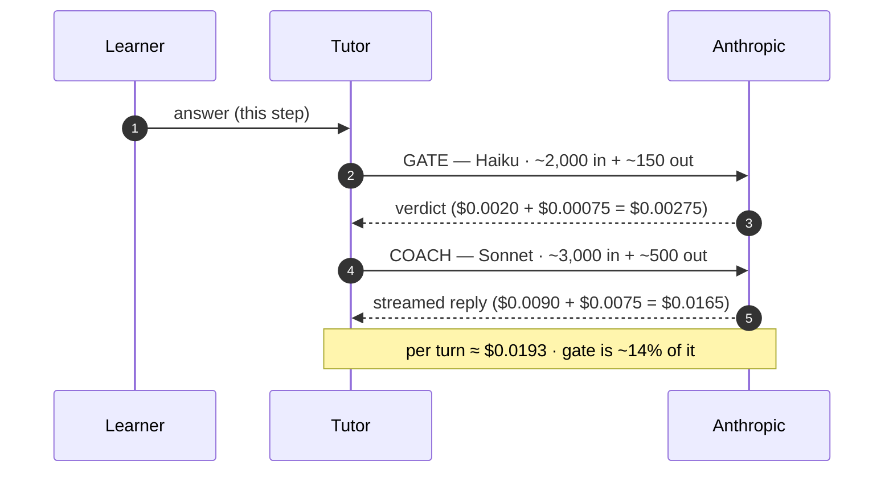

# 50. Cortex storage & cost

## TL;DR
> Cortex's **storage** is modest and mostly bounded — except one thing: the **Mongo `hello_events` log is append-only with no TTL**, so it grows forever (slowly — ~100 bytes/event, so years before it matters, but *forever*). Postgres holds the only data that grows with *use*: the tutor's sessions and messages (~6–24 KB per completed session → ~20 GB at a million sessions), and the real ceiling there isn't disk, it's the **HikariCP pool of 10 connections**. The content tree ships *inside the image* and lives in the 1 GiB heap. On **cost**, two axes: the **homelab runs the whole 4-node cluster for ~€50/month** (mostly amortized hardware + a power bill), versus **~$200–300/month** for an equivalent always-on managed-cloud stack — a 4–6× difference whose price is "you are the SRE." But the axis that actually decides scalability is **AI tokens**: a coached session is ~9 turns, each a Haiku *gate* (~$0.003) plus a Sonnet *coach* (~$0.017), so **~$0.17/session** if the operator pays — which at **1,000 learners/day is ~$5,100/month, untenable for a homelab.** **BYOK** flips it: the visitor's key funds the expensive coach, the operator pays only the ~$0.003 gate, so the same 1,000/day costs the operator **~$750** (and 10/day costs **~$7**). BYOK isn't a feature; it's the thing that makes an AI tutor survivable on a homelab. **One update since:** coach sessions are now **ephemeral** — a sliding TTL with a background purge — so the tutor's session/message tables no longer grow with cumulative *use*; the durable, use-growing stores are code submissions and the transcripts allow-listed users explicitly **Save**.

## 1. Motivation

Two questions decide whether a system can *keep* running: **what grows, and what does it cost?** They're usually treated separately, but for an AI-bearing homelab they collide — because the thing that grows fastest (coaching usage) is also the thing that costs the most (model tokens). A system-design chapter that only sized disks would miss the entire story. So we do both axes, with real prices, and find the one decision (BYOK) that turns an exponential cost curve into a flat one.

## 2. What grows — storage

```d2
direction: right
app: cortex / tutor
pg: Postgres (single) {
  shape: cylinder
  visits: visits — 1 row, constant
  tutor: tutor sessions/messages — grows with use
}
redis: Redis (single) — cache + counters (ephemeral) { shape: cylinder }
mongo: Mongo (single) — hello_events { shape: cylinder; style.stroke: "#ef4444" }
img: content tree (in the image → 1 GiB heap)
app -> pg: "JDBC (pool = 10) ← the real ceiling"
app -> redis: "fail-open"
app -> mongo: "append-only, NO TTL → unbounded ⚠"
app -> img: "resident index"
```

| Store | Growth | Real ceiling | Runway |
|---|---|---|---|
| **Mongo `hello_events`** | **append-only, no TTL → unbounded** (~100 B/event) | single-node disk | 1M events ≈ 100 MB; 100M ≈ 10 GB. Years — *but forever.* **Add a TTL.** |
| **Postgres `visits`** | one row, `UPDATE … +1` | trivial | constant (only a hot-row lock under extreme write concurrency) |
| **Postgres `tutor`** | grows with coaching: ~6–12 messages/session, ~0.5–2 KB each | **single instance; pool of 10** | ~6–24 KB/session → 10k ≈ 0.2 GB, 1M ≈ 20 GB. The **connection cap bites before disk.** |
| **Content tree** | the whole markdown corpus, in the image | image size + the **1 GiB heap** (index resident) | megabytes today; the ceiling is heap headroom (ties to [ch 49](/cortex/system-design/capstones/cortex-failure-thresholds) OOM) |

**The one thing to fix:** the unbounded Mongo log. It's harmless for years, but "append forever with no TTL" is a latent problem and — conveniently — the cleanest hook for making the system [data-intensive](/cortex/system-design/capstones/cortex-data-intensive) (turn the fire-and-forget log into a real event stream with retention). Size the tutor's growth yourself:

```d3 widget=estimation-calculator
{
  "title": "Tutor Postgres growth — sessions as 'writes' (≈12 KB each)",
  "peakFactor": 2,
  "replicationFactor": 1,
  "presets": [
    { "name": "10 learners/day",   "dau": 10,   "writesPerUser": 1, "readsPerUser": 12, "bytesPerWrite": 12000 },
    { "name": "100 learners/day",  "dau": 100,  "writesPerUser": 1, "readsPerUser": 12, "bytesPerWrite": 12000 },
    { "name": "1000 learners/day", "dau": 1000, "writesPerUser": 1, "readsPerUser": 12, "bytesPerWrite": 12000 }
  ]
}
```

## 3. What it costs — infrastructure

**Homelab (assumptions stated):** four mini-PC-class nodes drawing ~80 W aggregate → ~58 kWh/month → **~€17/month** electricity (at €0.30/kWh). Amortize 4 × €400 hardware over 4 years → **~€33/month**. Plus ~€2 domain/DNS. **All-in ≈ €50–55/month**, mostly the amortized hardware.

**Equivalent always-on cloud (ballpark):**

| Piece | Small managed equivalent | $/month |
|---|---|---|
| K8s + 1–2 small workers | managed control plane + nodes | ~$70–150 |
| Postgres | smallest HA-ish managed | ~$15–50 |
| Redis | smallest managed | ~$10–15 |
| Mongo | Atlas M10-ish | ~$55–60 |
| LB / egress / ingress | — | ~$20+ |
| **Total** | | **~$170–330** |

So the homelab runs the *same topology* for **~€50** versus a **~$200–300** cloud equivalent — a **4–6×** saving whose price is that *you* are the SRE, the pager, and the power bill. (The [Homelab from Scratch](/cortex/homelab-from-scratch) book is the long version of that trade.) Read **egress**, meanwhile, is effectively **free**: once Cloudflare proxies the static assets they're edge-served at no metered cost — the optimization with no cost-axis trade-off, measured in [ch 53](/cortex/system-design/capstones/cortex-edge-delivery).

## 4. What it costs — AI tokens (the axis that matters)

This is where scalability is actually decided. A coaching **turn** is two model calls; here's one annotated with tokens and dollars at current prices (Haiku $1/$5 per 1M in/out; Sonnet $3/$15):



**Per turn ≈ $0.019.** A completed 6-step session runs ~**9 turns** (some retries) → **≈ $0.17/session** if the operator pays. Prompt caching on the stable system+rubric+grounding prefix knocks the input cost down (cache reads ≈ 0.1× input), pulling it toward **~$0.10–0.12** — a nice, concrete payoff of the caching the [Claude Stack book](/cortex/the-claude-stack/building-with-the-claude-api/prompt-caching) teaches.

**Now the tiers, across three usage scenarios (monthly cost *to the operator*):**

| Learners/day | Sessions/mo | **Homelab tier** (operator pays ~$0.17) | **BYOK tier** (operator pays gate only ~$0.0025/turn ≈ $0.025) |
|---|---|---|---|
| **10** | ~300 | **~$51** | **~$7.5** |
| **100** | ~3,000 | **~$510** | **~$75** |
| **1,000** | ~30,000 | **~$5,100** | **~$750** |

Read the homelab column and the design justifies itself. At 10 learners/day, operator-pays is fine (~$51, on par with the infra bill). At **100/day it already dwarfs the €50 infra cost**, and at **1,000/day it's ~$5,100/month — absurd for a homelab.** The **BYOK** column is why the tutor can grow: the operator keeps only the cheap, deterministic **gate** (which is what produces the *verdict* the FSM needs), and pushes the expensive generative **coach** onto each visitor's own key. Cost then scales with *visitors' wallets*, not the operator's — the unbounded-user-safe property. (And it's *measured*, not guessed: each turn records `TurnUsage.costUsd`, so these estimates can be replaced with telemetry.)

## 5. Build It — the cost model, runnable

Punch in your own token assumptions and learner counts:

```python run
# Anthropic list prices ($ per 1M tokens), as of 2026 — refresh as needed.
HAIKU  = dict(inp=1.0,  out=5.0)    # the gate
SONNET = dict(inp=3.0,  out=15.0)   # the coach

def cost(tokens_in, tokens_out, price):
    return tokens_in/1e6*price["inp"] + tokens_out/1e6*price["out"]

gate  = cost(2000, 150, HAIKU)      # ~$0.00275
coach = cost(3000, 500, SONNET)     # ~$0.0165
turn  = gate + coach
turns_per_session = 9

session_homelab = turn  * turns_per_session     # operator pays gate + coach
session_byok    = gate  * turns_per_session      # operator pays ONLY the gate

print(f"per turn:            ${turn:.4f}  (gate ${gate:.4f} + coach ${coach:.4f})")
print(f"per session homelab: ${session_homelab:.3f}")
print(f"per session BYOK:    ${session_byok:.3f}   ({session_byok/session_homelab*100:.0f}% of homelab)\n")

print(f"{'learners/day':>12} | {'sessions/mo':>11} | {'homelab $/mo':>12} | {'BYOK $/mo':>9}")
for per_day in (10, 100, 1000):
    sessions = per_day * 30
    print(f"{per_day:>12} | {sessions:>11} | {sessions*session_homelab:>11.0f}  | {sessions*session_byok:>8.0f}")
print("\nBYOK turns an exponential operator bill into a flat one — that's the whole point of the two-tier design.")
```

## 6. Trade-offs

| Decision | Choice | Why |
|---|---|---|
| Coaching cost | **two-tier (homelab/BYOK)** | operator pays full only for the allowlist; everyone else funds their own coach — the only way it scales |
| Gate model | **Haiku, not Sonnet** | the *judgment* is cheap structured classification; pay for the strong model only on the *conversation* |
| Prompt caching | **cache the stable prefix** | ~40–50% off input across a session's turns — measurable, free latency win too |
| Mongo log | **append-only today** | simplest possible write; the cost is unbounded growth → add a TTL (or [stream it](/cortex/system-design/capstones/cortex-data-intensive)) |
| Stores | **single instances** | cheap and simple; the ceiling is the **connection pool**, not disk, for a long time |

## 7. Edge cases

- **A whale learner.** Someone does 50 sessions in a day. Homelab tier: ~$8.50 of *your* money. BYOK tier: ~$1.25 of yours (gates) + the rest on *their* key. BYOK makes a power user self-funding.
- **Cache cold-start.** The first turn of a session can't hit a warm prefix cache, so it's full price; the savings accrue over the session's later turns. Short sessions benefit less.
- **Mongo at 100M events.** ~10 GB — fine on disk, but every `/api/recent` still rides the `ts_desc` index; the cost is backup size and the *principle* (unbounded ≠ free forever).

## 8. Practice

> **Exercise 1 — Where does operator-pays break?**
> At what daily-learner count does the homelab-tier AI bill exceed the entire ~€50 infra cost? What does BYOK do to that crossover?
>
> <details>
> <summary>Solution</summary>
>
> Homelab tier is ~$0.17/session ≈ ~$5.10 per learner-month (30 sessions). €50 ≈ ~$54. So the AI bill passes the *infra* bill at about **`54 / 5.10 ≈ 11 learners/day`** — i.e. almost immediately. By 100/day it's ~$510/mo (10× the infra), and 1,000/day is ~$5,100 (~100× the infra). **BYOK** drops the operator's per-session cost to ~$0.025 (gate only), so the same crossover moves to **`54 / 0.75 ≈ 72 learners/day`**, and even 1,000/day is only ~$750 — the curve flattens because the expensive half is funded by visitors. The exercise's real lesson: for a self-hosted AI feature, **who pays for tokens is the single most important scalability decision** — more than any database or replica choice.
>
> </details>

> **Exercise 2 — Cheaper gate?**
> Could you cut cost by running the *gate* on an even cheaper/local model? What's the risk?
>
> <details>
> <summary>Solution</summary>
>
> The gate is already the cheap half (~14% of a turn), so moving it to a local model saves little of the operator's *homelab-tier* bill and *nothing* of the BYOK bill (where the operator only pays the gate — so a local gate would make BYOK nearly free to operate). The catch is **quality**: the gate produces the *verdict that drives the FSM*, so a weaker gate that's too lenient lets learners advance without understanding (defeating the whole point) or too harsh frustrates them. That's exactly why the tutor **CI-gates the gate with eval suites** — you can swap the gate model, but only if it still passes the known-good/known-bad verdict tests. Cost-optimizing the *judge* is fine; cost-optimizing it into *being wrong* is not. (This is the [diligence](/cortex/the-claude-stack/ai-fluency/diligence) discipline: verify the model's output, don't trust it.)
>
> </details>

## 9. In the Wild

- **[`TutorContract.scala` → `TurnUsage`](https://github.com/ani2fun/cortex)** — `inputTokens/outputTokens/cacheRead/cacheWrite/costUsd` recorded per turn. The §4 model is something the system *measures*.
- **[Anthropic pricing](https://www.anthropic.com/pricing)** & **[prompt caching](https://docs.anthropic.com/en/docs/build-with-claude/prompt-caching)** — the live numbers behind §4 (refresh them; they move).
- **[Cortex Tutor → Tiers & BYOK](/cortex/cortex-onboarding/cortex-tutor/tiers-and-byok)** — how the key stays in the browser, the mechanism that makes the BYOK column real.
- **[Designing Data-Intensive Applications](https://dataintensive.net/)** ch. 1 — "maintainability" includes the operational *cost* of a system, not just its correctness.

---

> **Next:** [51. Scaling Cortex like LeetCode](/cortex/system-design/capstones/scaling-cortex-like-leetcode) — today it's one replica and a semaphore of 8. What's the staged path to a system that serves a classroom, a campus, then the internet — and which single move (it's the judge queue) actually matters most?
