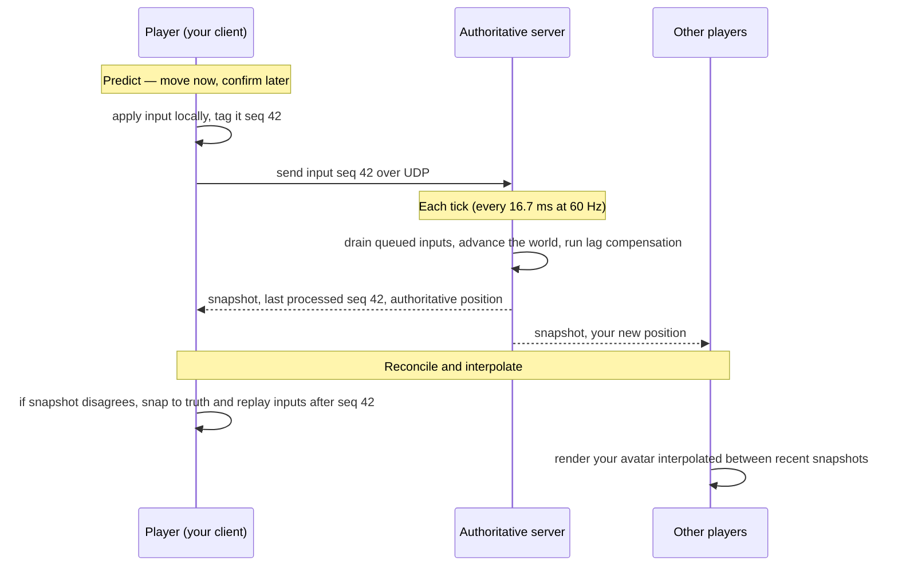
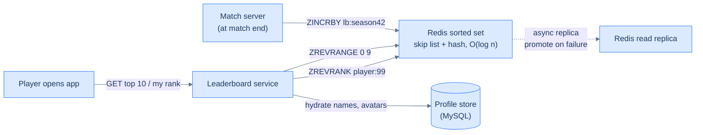

# 50. Online multiplayer game backend (capstone)

> **TL;DR.** You cannot beat the speed of light, so a real-time game can never let every player see the *same* world at the *same* instant. The trick is to pick one machine — the **authoritative server** — to be the single source of truth, run it as a fixed-rate **tick loop**, and then hide the unavoidable lag with four moves: the client **predicts** its own actions immediately, **reconciles** when the server's truth arrives, **interpolates** other players between snapshots so they glide instead of teleport, and the server applies **lag compensation** so you hit what you aimed at. Each match is independent, so the backend scales by running *one server per match* — embarrassingly parallel.

This is our most timing-obsessed capstone. The [URL shortener](/cortex/system-design/capstones/url-shortener) cared about read throughput; the [payment system](/cortex/system-design/capstones/payment-system) cared about never losing a cent. A shooter cares about **30 milliseconds**. When two players round a corner and fire, the winner is often decided by a difference smaller than the time it takes light to cross a continent. Everything below is in service of making that 30 ms feel fair.

> **Where this comes from.** Standard interview prep covers only *part* of this design: *System Design Interview, Vol 2*, Chapter 10, "Real-time Gaming Leaderboard," works the **leaderboard** sub-problem — ranking millions of players with Redis sorted sets — which we fold into §9 below. Everything else here (the authoritative server, tick rate, client-side prediction and server reconciliation, lag compensation, state synchronisation, matchmaking, anti-cheat) is general systems knowledge synthesised from the sources in *In the Wild*. The distributed-systems claims — asynchronous replication, failover, why UDP beats TCP for stale data — are cross-checked against *Designing Data-Intensive Applications* (2e).

## 1. Motivation

In June 2020, Riot Games launched *Valorant* on **128-tick** servers and published an engineering post, *Peeking into Valorant's Netcode*, walking through exactly how they hide latency. The timing was pointed: *Counter-Strike: Global Offensive* had shipped in 2012 on **64-tick** servers, and for years competitive players argued that 64 ticks was not enough — that gunfights decided by 20–50 ms were being mis-resolved by a simulation that only updated 64 times a second. Riot leaned into that complaint and doubled the rate.

But tick rate is only the surface. The deeper machinery had been settled a decade earlier. Valve's **Source Multiplayer Networking** model — born in *Half-Life* and *Counter-Strike* in the early 2000s — established the pattern nearly every fast-paced game still uses: the server simulates the world in discrete time steps (Source's default was a **15 ms** step), the client **predicts** its own movement so the controls feel instant, the client **interpolates** other entities with a small deliberate delay (Source's default view lag is **100 ms**) so they move smoothly, and the server performs **lag compensation** — rewinding time to the moment you fired — so your aim is judged against what *you* saw, not against where everyone had moved by the time your packet arrived.

The reason all of this exists is one stubborn fact: **information cannot travel faster than light**, and real networks are far slower and jitterier than that floor. DDIA opens its consistency chapter on the same wall — "information cannot travel faster than the speed of light" — and notes that any two events far enough apart simply cannot be ordered by what an observer saw. A packet from New York to London and back is well over 100 ms of round-trip time before software even touches it. So a game can either (a) wait for everyone before showing anything — correct but laggy — or (b) show you a *prediction* immediately and quietly fix it up later. Fast games choose (b), and this lesson is about doing (b) without the seams showing.

There is also a *who-decides* question lurking underneath. Early online games were often **peer-to-peer**: clients exchanged state directly, and one machine (the "host") was trusted. That is cheap — no server fleet — but it is a cheater's paradise (the host can rewrite the world) and it collapses when the host's connection is bad. Every competitive title you have heard of — *Counter-Strike*, *Valorant*, *Fortnite*, *League of Legends* — instead runs an **authoritative server** the players do not control. *Fortnite* alone has peaked north of 10 million concurrent players, each match a 100-player battle royale on its own server. The server-authoritative choice is the backbone of both anti-cheat and fairness, and the rest of this chapter assumes it.

## 2. Requirements and scope

**Functional**

- **Matchmaking:** group players by skill and region, then place them on a server near them.
- **Authoritative simulation:** one server is the source of truth for a match; it accepts inputs, advances the world, and broadcasts state.
- **Real-time sync:** every player sees a consistent-enough world updated many times per second.
- **Hit resolution:** when a player shoots, decide fairly whether it landed, accounting for latency.
- **Joins, leaves, reconnects:** players drop and return mid-match.
- **Anti-cheat foundation:** the server must not trust the client's claims about the world.
- **Progression:** persist rank, unlocks, and stats after the match.

**Non-functional**

- **Low latency:** input-to-feedback must feel instant (single-digit-to-tens of ms locally via prediction); competitive play wants round-trip times under roughly 50–80 ms to the server.
- **High update rate:** a steady tick (commonly 30, 60, or 128 Hz).
- **Smoothness under loss and jitter:** the experience must survive dropped and reordered UDP packets.
- **Fairness:** two players with different pings should get as even a contest as physics allows.
- **Scale:** millions of concurrent players across thousands of independent matches.
- **Cheat resistance:** a modified client must not be able to see through walls or teleport.

**Out of scope:** rendering and game-feel; the matchmaking *rating* algorithm's internals; voice chat (a separate real-time path, conceptually close to [the chat capstone](/cortex/system-design/capstones/chat-system)); monetisation (see [the payment system](/cortex/system-design/capstones/payment-system)).

## 3. Back-of-envelope estimation

Let's size one match server and then the fleet. (The method is from [back-of-envelope estimation](/cortex/system-design/foundations/back-of-envelope-estimation); the latency intuitions from [latency, throughput, and the USL](/cortex/system-design/foundations/latency-throughput-usl) and [the numbers every engineer should know](/cortex/system-design/foundations/numbers-every-engineer-should-know).)

| Quantity | Estimate | Reasoning |
|---|---|---|
| Tick rate | 60 Hz | One simulation step every **16.7 ms**; the per-tick deadline for *all* work |
| Players per match | 64 | A large competitive lobby; battle royales push to ~100 |
| Snapshot size per player | ~1.5 KB | Positions, orientations, and states of visible entities, delta-compressed |
| Egress per server | ~46 Mbit/s | 64 players × 60 ticks/s × 1.5 KB × 8 bits ≈ 5.76 MB/s |
| Ingress per server | ~3 Mbit/s | Inputs are tiny: 64 × 60/s × ~100 B ≈ 384 KB/s |
| Concurrent players (peak) | 1,000,000 | A popular title at prime time |
| Match-server instances | ~15,600 | 1,000,000 ÷ 64 players per match |
| Physical hosts | ~1,600 | A 64-player match needs a fraction of a core, so pack ~10 matches per host |
| Speed-of-light floor | tens of ms | Cross-continent fibre RTT alone exceeds many tick intervals |

Two numbers do the teaching. First, **egress dwarfs ingress by an order of magnitude** — the server is a broadcaster, sending each player a picture of everyone else. That asymmetry is why *delta compression* and *area-of-interest culling* (only send what you can see) matter so much at scale. Second, the **speed-of-light floor** is larger than a tick: a New-York-to-London round trip spends more time in flight than several 16.7 ms ticks. You cannot fix that with a faster server. You fix it by putting the server **near the players** (regional fleets) and by hiding the residue with prediction and interpolation.

## 4. API

A game backend has **two protocols**, and conflating them is a classic mistake.

**Matchmaking — ordinary request/response** (HTTP or gRPC, like any service in [API design](/cortex/system-design/application-architecture/api-design)):

```
POST /matchmaking/find        { mode, region, partyId }      -> 202 Accepted, ticketId
GET  /matchmaking/ticket/{id} -> { state: "searching" | "found",
                                    server: "ip:port", joinToken }
```

**In-match — a stream of small UDP messages**, not RPC. There are exactly two message shapes, sent many times a second:

```
client -> server   Input  { seq, dtMs, buttons, aimYaw, aimPitch }
server -> client   Snapshot { tick, lastProcessedInput, entities: [...] }
```

The `seq` on each input and the `lastProcessedInput` echoed in each snapshot are the linchpin of reconciliation — they let the client ask "which of my inputs has the server already accounted for?" and replay only the rest. We use **UDP**, not TCP: a game would rather send the *next* fresh snapshot than wait for a retransmission of a stale one. TCP's in-order, reliable delivery introduces head-of-line blocking — one lost packet stalls everything behind it — which is exactly wrong when old data is worthless. (Contrast [the networking primer](/cortex/system-design/building-blocks/networking-primer): TCP is the right default for almost everything *except* this.)

## 5. Data model

Three tiers of state, and the discipline is keeping them apart:

1. **Transient match state** — positions, velocities, health, ammo. Lives **in RAM** on the authoritative server, mutated 60 times a second, and **thrown away** when the match ends. It must never touch a disk in the hot path.
2. **Durable player state** — account, rank/MMR, inventory, unlocks. A normal database row, **read once at match start and written once at match end**. Never per tick.
3. **Wire records** — the `Input` and `Snapshot` messages above, plus a short server-side **history buffer** of recent world states (the last ~1 second) used for lag compensation.

### The central design decision

> **One authoritative server holds the single source of truth and advances it on a fixed-rate tick loop. Clients predict their own actions locally for responsiveness, reconcile against the server's authoritative state when it arrives, interpolate other players between snapshots for smoothness, and the server applies lag compensation so hits are judged against what the shooter actually saw.**

Said more plainly: **the client lies to itself to feel fast, the server tells the truth to stay fair, and a bundle of latency-hiding tricks reconciles the two.**

There is a fork in the road *before* this decision, and it is worth naming because the right answer depends on the game:

- **Lockstep (deterministic):** every client runs the *same* simulation and exchanges only **inputs**, not state. Because the simulation is deterministic, everyone independently computes an identical world. Bandwidth is tiny (a few key presses per player), which is why **real-time strategy** games with thousands of units — *StarCraft*, *Age of Empires* — use it. The costs: the simulation must be **perfectly deterministic** across machines (no platform-dependent floating point), one **slow player stalls everyone** (the game advances only when all inputs for a tick arrive), and a single divergence **desyncs** the match.
- **State-sync (server-authoritative):** the server simulates and **broadcasts state**; determinism is not required and one laggard cannot stall the others. Bandwidth is much higher (you send the world, not just inputs), but it is robust and naturally cheat-resistant. **First-person shooters and MOBAs** use it.

We build **state-sync**, because we want anti-cheat and resilience to one bad connection. A fighting game, by contrast, would pick **rollback netcode** — a lockstep cousin that predicts the opponent's inputs and rolls back to re-simulate when the guess was wrong.

## 6. Architecture

The matchmaker and fleet manager sit *outside* the real-time path; the authoritative server *is* the real-time path. Players talk request/response to the matchmaker to get placed, then switch to a UDP stream with their assigned server.

```d2
direction: right
players: Players (UDP clients)
mm: Matchmaking service
fleet: Fleet manager (allocates match servers)
gs_a: "Game server A — authoritative 60-tick loop"
gs_b: "Game server B — authoritative 60-tick loop"
profile: Player profile and progression store

players -> mm: find a match (skill, region)
mm -> fleet: request a server
fleet -> gs_a: allocate this match
mm -> players: connect to server A (address, token)
players -> gs_a: inputs and snapshots over UDP
gs_a -> profile: load at start, save results at end
fleet -> gs_b: allocate another match
```

The same structure as a formal C4 container view — note how the profile store hangs off the *side* of the server, touched only at the boundaries of a match, never inside the tick:

<iframe src="/c4/view/capstones_multiplayergamebackend_architecture" width="100%" height="420" style="border: 1px solid var(--border, #2b2b2b); border-radius: 8px;" loading="lazy" title="Online multiplayer game backend — C4 container view"></iframe>

The shape echoes [the ride-sharing dispatcher](/cortex/system-design/capstones/ride-sharing-dispatch): both shard a real-time workload into independent units (a geographic cell there, a match here) so that each unit fits comfortably on one machine and the units scale out sideways.

## 7. The hot path

Here is one player's input making a complete round trip — predicted locally, processed on the server's next tick, and reconciled when the snapshot returns. Watch the **sequence number** (`seq 42`) thread through: it is how the client knows which of its predictions the server has already absorbed.



The subtle, beautiful part is **lag compensation** in the server's tick. When your "fire" input arrives, your view of the world was already ~half-a-round-trip old. So the server keeps a short history of past world states — Source's history buffer holds about **1 second** of past ticks — and **rewinds** to the tick *you* were seeing when you pulled the trigger, checks the hit there, and applies the result to the present. Concretely: you fire at an enemy's head; your packet says "at *my* tick 1450, my crosshair was here." The server looks up where that enemy actually was at tick 1450 (not now), tests the hit against that rewound position, and credits it. This is why a high-ping player can still land shots — and also why a low-ping player sometimes feels they "died behind cover": they *did* reach cover on their own screen, but on the shooter's slightly-older screen they were still exposed. The system chose to **favour the shooter**, and that choice has victims either way.

This same rewind is the engine behind **peeker's advantage** — the well-known *Valorant*/*CS* effect where the player who swings around a corner sees the stationary defender a beat before the defender sees them, because the peeker's motion has to propagate to the server and back. Higher tick rates and tighter buffers shrink the gap but cannot erase it; Riot's whole *Peeking into Valorant's Netcode* post is an accounting of exactly this residue.

## 8. Bottlenecks and the 100× stretch

- **Per-server simulation cost.** The tick loop must finish *all* physics, hit-resolution, and snapshot-building inside 16.7 ms. Double the players and you roughly quadruple interaction checks. You cannot put 10,000 players in one authoritative simulation. **Fix:** keep matches small and independent; for a massive world (an MMO), **shard the world into zones** and use **area-of-interest** so each server simulates only its region.
- **Egress bandwidth.** As §3 showed, sending everyone the whole world is the dominant cost. **Fix:** **delta compression** (send only what changed since the client's last acknowledged snapshot) and **area-of-interest culling** (send only entities a player can plausibly see). Both shrink the 1.5 KB snapshot dramatically in a large map.
- **Fleet elasticity.** Player counts swing wildly between a quiet morning and a Friday-evening peak. Running peak capacity 24/7 is wasteful. **Fix:** the fleet manager **autoscales** match servers with demand — exactly [capacity planning and autoscaling](/cortex/system-design/production-operations/capacity-planning-and-autoscaling), with the twist that you must scale *up* a little ahead of demand because spinning a fresh server and warming a match takes seconds.
- **Regional latency.** A single global region guarantees that half the planet plays at 150 ms. **Fix:** **regional fleets** — match players to the nearest data centre, and accept that cross-region parties trade some fairness for togetherness.

**The 100× stretch.** Going from one popular title to a planet-scale platform is mostly *more of the same shards*: matches are embarrassingly parallel, so the match tier scales almost linearly with hosts. The genuinely hard parts are at the edges — **matchmaking** becomes a global, low-latency search over a churning pool of waiting players (skill, region, party size, and queue time all in tension), and the **MMO case** forces world-sharding with seamless hand-off as a player walks from one zone-server's territory into another's. Sharding by match or by zone is the same move we have made in every capstone: find the axis along which work is independent and cut along it (see [sharding and partitioning](/cortex/system-design/building-blocks/sharding-and-partitioning)).

**Matchmaking by skill (MMR).** "Group players by skill" hides a rating system. Each player carries a hidden **matchmaking rating** — an Elo descendant like Glicko-2 or Microsoft's TrueSkill — that the system nudges up after wins and down after losses. The matchmaker then searches the waiting pool for opponents within a rating band, *widening the band the longer you wait* so a queue never starves: a tight ±50 MMR match if one is available within seconds, a looser ±200 after a minute. This is the same fairness-versus-latency dial as everything else in this chapter, just measured in queue seconds instead of milliseconds. The rating algorithm's internals are out of scope (§2); what matters architecturally is that matchmaking is a **request/response search service**, off the real-time path, that reads MMR from the durable profile store and hands the matched group to the fleet manager.

## 9. The leaderboard: ranking millions with Redis

Progression (§2) ends a match by writing each player's result to the durable store — but "rank #4,271,008 out of 30 million, updated in real time" is a genuinely hard query, and it is the one piece of this design that standard interview prep (*SDI Vol 2*, Ch10) treats in depth. It is worth doing properly, because the naive answer is a trap.

**Why not just `ORDER BY score`?** Put `(user_id, score)` in a SQL table and a player's rank is `SELECT COUNT(*) FROM leaderboard WHERE score >= :myscore` — a full scan of every row, because rank is a *global* property: to know you are 4,271,008th, the database must account for everyone above you. Over tens of millions of constantly-changing rows that runs in *tens of seconds*, and you cannot cache it because the next score update invalidates it. SQL is the wrong tool: it is not built to re-rank a large, continuously-changing population on every read.

**The right tool is a Redis sorted set (ZSET).** A sorted set keeps members (here, player IDs) each tied to a score, and maintains them *in score order at all times* using a skip list plus a hash table — the skip list maps scores→members for ranked traversal, the hash maps members→scores for O(1) lookup. The payoff is that the operations a leaderboard actually needs are all **O(log n)**, not O(n):

| Operation | Redis command | Cost | Use |
|---|---|---|---|
| Record / bump a score | `ZADD` / `ZINCRBY` | O(log n) | end of match: `ZINCRBY lb:season42 1 player:99` |
| A player's rank | `ZREVRANK` | O(log n) | "you are #4,271,008" (rev = highest first) |
| Top 10 | `ZREVRANGE 0 9 WITHSCORES` | O(log n + k) | the front page |
| Neighbours around you | `ZREVRANGE rank-4 rank+4` | O(log n + k) | "4 above, 4 below you" |

`ZINCRBY` *creates the member if absent, else adds to its score* — exactly the "award a point, first win or not" case — and because the set re-sorts on write, the rank query is just a position lookup, never a re-sort. One match-end write and the standings are already correct. The match server never does this in the tick loop; it writes once at match end (§5's "durable player state, written once"), so a 16.7 ms budget is irrelevant here.



The ZSET stores only IDs and scores; the player's display name and avatar live in the profile store, so the leaderboard service does a ZREVRANGE to get the ranked IDs, then a batch read against MySQL (often cached for the top 10, since that page is hammered) to hydrate them — the same "index in fast store, payload in durable store" split as the [URL shortener](/cortex/system-design/capstones/url-shortener).

**It fits on one node — until it doesn't.** Thirty million entries at ~26 bytes (a 24-char ID plus a small int) is well under a gigabyte even after skip-list overhead, and a few thousand writes per second is nothing for Redis — so a *single* Redis instance, with an asynchronous **read replica promoted on failure** (the standard single-leader failover DDIA describes: pick an up-to-date follower as the new leader), carries a surprisingly large game. You shard the leaderboard only when one node can no longer hold the set or serve the QPS — hundreds of millions of players. Two ways to cut it:

- **Fixed range partitioning.** Split by score band — shard A holds scores 1–1000, shard B 1001–2000, and so on. The **top 10** is then just the top of the highest-scored shard (cheap), but a write must move a player *between* shards when their score crosses a boundary, and you need a side map of player→current-score to know which shard to hit.
- **Redis Cluster (hash-slot) partitioning.** Cluster hashes each key into one of 16,384 slots (`CRC16(key) % 16384`) spread across nodes. This balances load automatically, but now a *single* leaderboard's members are scattered across all shards, so "top 10 globally" becomes a **scatter-gather**: ask every shard for its local top 10 in parallel, then merge — and a global *exact rank* has no clean answer at all, because no one node sees the whole ordering.

**When exact rank stops mattering.** Once you have sharded, telling a player they are "#4,271,008" is both expensive and, frankly, useless to them. The honest move is to switch to **percentiles**: a periodic job samples the score distribution and caches cutoffs ("90th percentile = score ≥ 6,500"), so any player's standing is a single comparison — "top 5%" — that is cheap, shard-friendly, and more meaningful than a seven-digit rank. This is the same trade the [probabilistic data structures](/cortex/system-design/storage-and-search/probabilistic-data-structures) chapter keeps making: at scale, an approximate answer that is cheap and bounded beats an exact answer that is ruinously expensive.

## 10. Trade-offs

| Decision | Option A | Option B | When to pick which |
|---|---|---|---|
| Authority | Server-authoritative (state-sync) | Lockstep (deterministic, inputs only) | Server for FPS/MOBA (anti-cheat, resilience); lockstep for RTS (thousands of units, tiny bandwidth) |
| Transport | UDP (timely, lossy) | TCP (reliable, ordered) | UDP for the snapshot stream; TCP/HTTP for matchmaking and chat |
| Tick rate | 128 Hz (crisp, costly) | 30–64 Hz (cheap, slightly laggier) | High rate for twitch shooters; lower for slower games — it is a cost-versus-feel dial |
| Client motion | Prediction + reconciliation | Server-only (display what arrives) | Predict for responsiveness; server-only is simpler but feels sluggish at any real ping |
| Hit resolution | Favour the shooter (lag comp) | Favour the target (no rewind) | Favour the shooter for satisfying aim; it shifts unfairness onto the target ("died behind cover") |
| Snapshots | Delta + interpolation | Full state every tick | Delta+interp at scale; full snapshots only for tiny matches where simplicity wins |
| Leaderboard | Redis sorted set (ZSET) | SQL `ORDER BY score` | ZSET for real-time rank at scale (O(log n)); SQL only for tiny or batch-computed boards |
| Rank at huge scale | Exact rank (single ZSET) | Percentile band (sharded) | Exact while it fits one node; percentile once sharded, where exact rank has no cheap answer |

## 11. Build It

An **illustrative** sketch — not a game engine — of the two halves that make prediction work: a server tick loop that is authoritative, and a client that predicts then reconciles. The whole trick lives in the sequence numbers.

```python
# Illustrative only: a 1-D world to show prediction + reconciliation.
from collections import deque

# ---------- Server: the authoritative tick loop ----------
class GameServer:
    def __init__(self):
        self.positions = {}                 # player_id -> authoritative x
        self.inbox = {}                      # player_id -> queue of (seq, dx)
        self.last_seq = {}                   # player_id -> last seq applied

    def receive(self, player_id, seq, dx):   # called as UDP inputs arrive
        self.inbox.setdefault(player_id, deque()).append((seq, dx))

    def tick(self):                          # called every 16.7 ms (60 Hz)
        for pid, queue in self.inbox.items():
            while queue:
                seq, dx = queue.popleft()
                # AUTHORITATIVE: the server validates and applies the move.
                # A cheating client that sends dx=9999 is clamped here.
                dx = max(-5, min(5, dx))
                self.positions[pid] = self.positions.get(pid, 0) + dx
                self.last_seq[pid] = seq
        # Broadcast: every client learns the truth + which input we reached.
        return {pid: {"x": self.positions[pid], "ack": self.last_seq[pid]}
                for pid in self.positions}

# ---------- Client: predict now, reconcile on snapshot ----------
class GameClient:
    def __init__(self, player_id):
        self.pid = player_id
        self.x = 0                           # predicted position (what you SEE)
        self.seq = 0
        self.pending = []                    # inputs not yet acked by server

    def send_input(self, dx, server):
        self.seq += 1
        self.x += dx                         # PREDICT: move immediately, no wait
        self.pending.append((self.seq, dx))
        server.receive(self.pid, self.seq, dx)

    def on_snapshot(self, snap):
        me = snap[self.pid]
        self.x = me["x"]                     # snap to authoritative truth...
        # ...then drop inputs the server already applied, and REPLAY the rest
        # on top of truth, so our own later moves are not lost.
        self.pending = [(s, dx) for (s, dx) in self.pending if s > me["ack"]]
        for _, dx in self.pending:
            self.x += dx

# The key invariant: after reconciliation the client shows
# (authoritative state) + (its own un-acknowledged inputs replayed) —
# instant response, eventually corrected, never drifting.
```

The real thing adds physics, interpolation of *other* entities, the lag-compensation history buffer, and brutal input validation — but the heart is exactly this: predict, then reconcile by replaying un-acknowledged inputs on top of the server's truth.

## 12. Edge cases and failure modes

- **Misprediction and rubber-banding.** When the server disagrees with a prediction (you walked into a wall the client did not know about), snapping the player to truth is jarring. **Smooth the correction** over a few frames instead of teleporting — unless the error is huge, in which case snap.
- **Packet loss and jitter.** UDP packets drop and reorder. **Do not retransmit** a stale snapshot — the next one is already more current. The client's **interpolation buffer** (the deliberate ~100 ms delay) absorbs jitter by always having two snapshots to interpolate between; lose one and the buffer rides over the gap.
- **Lag-compensation unfairness.** "Favour the shooter" means the target sometimes dies *after* reaching cover on their own screen. There is no free lunch here: any hit-resolution policy is unfair to *someone*. Pick the policy that feels best to the most players and document it.
- **Cheating.** Because the server is authoritative, a hacked client cannot move faster than the server allows or shoot through walls the server enforces — the `max(-5, min(5, dx))` clamp above is the whole philosophy in miniature. The dangerous leak is **information**: if you send a player the positions of enemies they cannot see, a wallhack can reveal them. Area-of-interest culling is therefore an anti-cheat measure, not just a bandwidth one.
- **The slow player in lockstep.** If you *had* chosen lockstep, one player's lag stalls the whole match (everyone waits for their inputs), and a single non-deterministic divergence desyncs everyone. This is the concrete reason shooters avoid it.
- **Server crash mid-match.** Transient state is in RAM, so a crash loses the match. That is usually acceptable — you re-queue the players — precisely *because* you kept durable progression in a separate store written only at match end. Persisting per-tick to survive crashes would blow the 16.7 ms budget; the trade is deliberate.
- **Losing the leaderboard's Redis node.** The sorted set lives in RAM too, so a crash can drop it. Two safety nets: the match results are *also* appended to the durable profile store, so the ZSET can be **rebuilt** by replaying scores (`ZADD` per player); and the node runs with an async **read replica** that is promoted on failure. Note the same replication-lag caveat DDIA raises — a freshly promoted replica may be a beat behind, so the rank a player saw a second ago might momentarily reappear. For a leaderboard that is harmless; for a payment ledger it would not be.

## 13. Practice

<details>
<summary>Why use UDP for the snapshot stream instead of TCP, given TCP is reliable?</summary>

Because in a fast game **stale data is worthless**, and TCP's guarantees cost exactly the wrong thing. TCP delivers bytes **in order and reliably**, which means a single lost packet causes **head-of-line blocking**: every later packet waits in a buffer until the lost one is retransmitted and arrives. In a 60 Hz game that retransmission takes longer than the next *two or three* snapshots — so TCP would make you wait for old news while fresh news piles up behind it. UDP just drops the lost packet on the floor; the client uses the next snapshot, and its interpolation buffer hides the gap. Reliability is recovered selectively at the application layer for the few messages that truly need it (a match-result, say), not imposed on the whole stream.
</details>

<details>
<summary>At 128-tick with 100 players, what is the per-server egress, and what does that tell you?</summary>

Egress ≈ players × ticks/s × snapshot size = 100 × 128 × 1.5 KB ≈ **19.2 MB/s ≈ 154 Mbit/s** per server — over **3×** the 64-player, 60-tick number from §3 (the two factors, ~1.6× players and ~2.1× ticks, multiply). The lesson: bandwidth scales with the **product** of player count and tick rate, so the cost of "just double the tick rate for crispness" is real and compounds with lobby size. It is also why **delta compression** and **area-of-interest culling** stop being optional once matches get large — you cannot afford to send all 100 players the full state of the other 99 at 128 Hz.
</details>

<details>
<summary>For a real-time strategy game with 2,000 units per side, would you choose lockstep or state-sync? Why?</summary>

**Lockstep.** With 2,000+ units per side, broadcasting the full state of every unit 60 times a second (state-sync) would be enormous bandwidth — thousands of unit positions, orientations, and states per snapshot. Lockstep instead sends only each player's **commands** ("move these 40 units here"), which is a tiny, near-constant trickle regardless of unit count, and every client deterministically simulates the identical battle. You pay for it with **strict determinism** (no divergent floating point across machines) and a **shared input delay** (the game waits for all players' inputs each turn, so one slow player adds lag for everyone) — but for an RTS those costs are far cheaper than the bandwidth state-sync would demand. This is exactly why the *StarCraft* and *Age of Empires* lineages are lockstep.
</details>

<details>
<summary>Your leaderboard has 30 million players and must show any player their exact rank in real time. Why is a Redis sorted set the right store, and what breaks if you outgrow one node?</summary>

A SQL `SELECT COUNT(*) WHERE score >= :myscore` computes rank by **scanning every row** — rank is a global property, so the database must look at everyone above you — and over 30 million constantly-changing rows that takes tens of seconds and cannot be cached. A **Redis sorted set** instead keeps members in score order at all times (skip list + hash table), so `ZINCRBY` to record a score and `ZREVRANK` to read a rank are both **O(log n)**, and the top 10 is a single `ZREVRANGE 0 9`. Thirty million entries fit comfortably in one node's RAM. What breaks at *hundreds* of millions is single-node capacity: you must shard. **Fixed range** sharding (score bands) keeps "top 10" cheap but forces players to migrate shards as their score crosses a boundary; **Redis Cluster** hash-slots the keys for balanced load but turns "top 10" into a scatter-gather and leaves **exact global rank with no cheap answer** — which is when you switch from exact rank to cached **percentile bands** ("top 5%"), more meaningful to the player anyway.
</details>

## Your Turn

Before you move on, check your understanding with the coach — explain the idea, apply it, weigh the trade-offs, then defend your reasoning.

<div class="concept-coach"></div>

## In the Wild

- **Valve — Source Multiplayer Networking.** The canonical write-up of the tick-step server plus client-side prediction, entity interpolation (100 ms default), and lag compensation that underpins *Counter-Strike* and most of the genre. [developer.valvesoftware.com](https://developer.valvesoftware.com/wiki/Source_Multiplayer_Networking)
- **Gabriel Gambetta — Fast-Paced Multiplayer.** The clearest tutorial on the four-part model (client-server authority, client-side prediction and server reconciliation, entity interpolation, lag compensation), with live demos. [gabrielgambetta.com](https://www.gabrielgambetta.com/client-server-game-architecture.html)
- **Riot Games — Peeking into Valorant's Netcode (2020).** Why Riot built 128-tick servers and how they budget the tick, with a frank discussion of the latency they cannot remove. [technology.riotgames.com](https://technology.riotgames.com/news/peeking-valorants-netcode)
- **GGPO / rollback netcode.** The fighting-game approach: run local inputs immediately, **predict** the opponent's inputs, and **roll back and re-simulate** when the prediction was wrong — a lockstep cousin tuned for two-player, frame-perfect games.
- **SnapNet — Netcode Architectures: Lockstep.** A modern, careful comparison of lockstep versus state-sync and the determinism and input-delay trade-offs that decide between them. [snapnet.dev](https://www.snapnet.dev/blog/netcode-architectures-part-1-lockstep/)
- **Redis — Sorted Sets.** The data type behind the leaderboard in §9: `ZADD`/`ZINCRBY`/`ZREVRANK`/`ZREVRANGE`, all O(log n), backed by a skip list and a hash table. [redis.io](https://redis.io/docs/latest/develop/data-types/sorted-sets/)

---

**Next:** one capstone remains — [recommendation serving](/cortex/system-design/capstones/recommendation-serving), where we leave the world of exact state machines behind for the probabilistic, two-stage world of candidate generation and ranking. It is a fitting close: every system before it computed a *correct* answer; the last one computes a *good* one.
