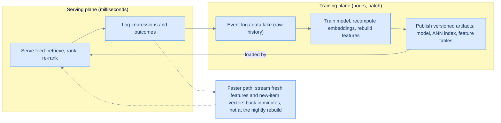
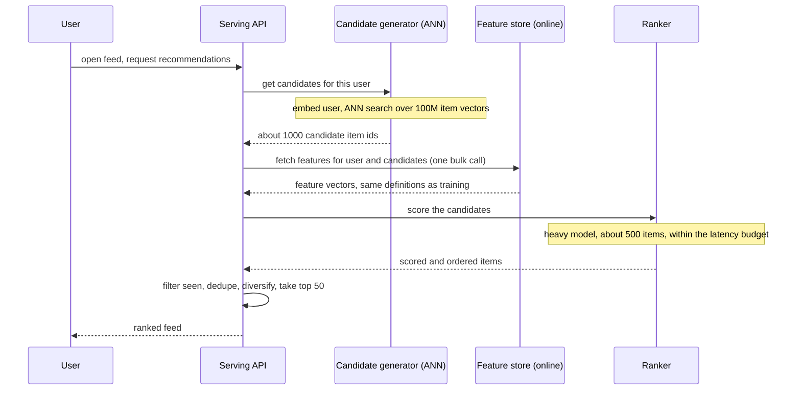

# 51. Recommendation system serving layer (capstone)

> **TL;DR.** You cannot score a 100-million-item catalogue against one user in 100 milliseconds, so you do not try. Instead you build a **two-stage funnel** — the shape behind the YouTube home page, the Netflix row, the TikTok For-You feed, and Amazon's "customers who bought X also bought Y." A cheap, recall-oriented **candidate generation** step uses **approximate-nearest-neighbour** search over learned **embeddings** to narrow millions of items down to roughly a thousand, then an expensive, precision-oriented **ranking model** scores just those survivors with rich features and produces the final order. Everything that *can* be precomputed — embeddings, the search index, the model — is computed **offline** by a pipeline and *published* into the serving tier; a **feature store** guarantees the features used to train the model are byte-for-byte the same ones used to serve it. And the loop closes: every item the system shows is **logged** as training data for the next model. This is the first capstone whose right answer is not *correct* but merely *good*, and that changes everything about how we engineer it.

We have arrived at the last system in the book, and it is deliberately the odd one out. The [payment system](/cortex/system-design/capstones/payment-system) had exactly one right answer and treated any deviation as a bug. A recommender has *no* single right answer — two reasonable engineers will rank the same feed differently and both be right. That freedom is what lets us trade exactness for speed at every turn, and it is why the central tool here is *approximate* nearest neighbour, not exact.

## 1. Motivation

> **Where the canon touches this.** The interview-prep canon covers recommendation serving only at the edges. *System Design Interview* Vol 1's news-feed chapter ranks a feed but deliberately waves off the ranking model itself — it literally tells you *not* to dive into Facebook's EdgeRank because it "does not prove your ability in designing a scalable system." Vol 2's *Ad Click Event Aggregation* chapter builds the **engagement-signal pipeline** — the log → queue → aggregation → store path that turns raw clicks into the counts a recommender feeds on — but stops at billing dashboards, not serving. The core of *this* chapter — the two-stage recommendation funnel — is general ML-systems knowledge. Where it leans on data infrastructure (the offline pipeline, the publish step, real-time vs batch features), we cross-check against *Designing Data-Intensive Applications* 2e, which treats recommendations and ranking models explicitly as **derived data** — precomputed by a batch or stream job and served from a downstream store, exactly the shape below.

In 2016, three YouTube engineers — Paul Covington, Jay Adams, and Emre Sargin — published *Deep Neural Networks for YouTube Recommendations* at the ACM RecSys conference. The paper described, for one of the largest recommenders on Earth, an architecture organised around "the classic two-stage information retrieval" split: a **deep candidate generation** model that reduces a corpus of millions of videos to a few hundred, followed by a **separate deep ranking** model that orders those few hundred. That two-stage shape was not new to information retrieval, but the paper crystallised it for the deep-learning era, and today essentially every production recommender is built on the same funnel — YouTube's next-up videos, Netflix's "Because you watched" rows, TikTok's For-You page, Spotify's Discover Weekly, Amazon's product carousels. The catalogues and signals differ; the funnel does not.

Why a funnel at all? Because the arithmetic forbids the obvious approach. Suppose you ran your best ranking model — a heavy neural network with hundreds of features — against every one of 100 million items for every request. Even at an optimistic 50 microseconds per scoring, that is 100,000,000 × 50 µs = **5,000 seconds** per request. You have about a tenth of a second. The funnel exists because you must throw away 99.99% of the catalogue *cheaply* before you can afford to think *carefully* about what remains.

The second hard-won lesson came from the operations side. Uber's *Meet Michelangelo* post in 2017 named a subtle, vicious bug class: **training-serving skew**. A model is trained on features computed one way (a batch job over the warehouse) and served on features computed another way (a hot path in production). When the two computations drift even slightly, the model silently gets worse and the cause is "extremely hard to debug." Uber's fix — a centralised **feature store** that serves one definition of each feature to both training and serving — became standard infrastructure. Half of a recommender's correctness lives in that one idea.

## 2. Requirements and scope

**Functional**

- **Recommend:** given a user (and context — time, device, the page they are on), return a short ordered list of items.
- **Recall then rank:** retrieve a candidate set cheaply, then order it precisely.
- **Freshness:** new items should become recommendable quickly; a user's recent actions should influence the next request.
- **Business rules:** filter already-seen items, deduplicate, enforce diversity, respect blocks and policy.
- **Train offline, serve online:** models and embeddings are produced by a batch pipeline and loaded by the serving layer.

**Non-functional**

- **Latency:** a tight end-to-end serving budget, commonly around 100 ms at p99 (see [latency, throughput, and the USL](/cortex/system-design/foundations/latency-throughput-usl)).
- **Scale:** a catalogue in the 10⁸ range; hundreds of thousands of requests per second at peak.
- **Quality:** good recall in stage one (do not lose great items) and good precision in stage two (order what survives well).
- **Online/offline consistency:** the same feature definitions on both sides — no skew.
- **Graceful degradation:** under load or partial failure, return a slightly worse list rather than nothing.

**Out of scope:** the *modelling* itself (how to design the neural network, how to choose the loss) — this is the **serving** lesson, about the system around the model. Also out of scope: the full **experimentation/A-B platform** as a system (its own large topic), though we cannot avoid it entirely — because, as we'll see, A/B testing is the *only* honest way to tell whether a new model is actually better, so it shapes the serving design. The business definition of "good" we leave to the business.

## 3. Back-of-envelope estimation

Let's size the funnel. (Method from [back-of-envelope estimation](/cortex/system-design/foundations/back-of-envelope-estimation); per-operation costs from [the numbers every engineer should know](/cortex/system-design/foundations/numbers-every-engineer-should-know).)

| Quantity | Estimate | Reasoning |
|---|---|---|
| Catalogue size | 100,000,000 items | Large video/commerce corpus |
| Embedding dimension | 128 floats | 128 × 4 bytes = 512 bytes per item vector |
| Item-vector memory | ~51 GB | 100M × 512 B; fits in RAM sharded across a handful of machines |
| Candidates after stage 1 | ~1,000 | ANN narrows 100M to a few hundred–10³ (often unioned from several retrievers) |
| Items scored in stage 2 | ~500 | After cheap pre-filters / a pre-ranker |
| Items returned | ~50 | The visible feed |
| Peak requests | ~100,000 req/s | Hundreds of millions of daily users, a few feeds each, peaked |
| Stage-1 ANN latency | a few ms | HNSW over 10⁸ vectors is single-digit ms |
| Stage-2 ranking | ~25 ms | 500 candidates × ~50 µs per scoring |
| Scorings per second (fleet) | ~50,000,000/s | 100,000 req/s × 500 candidates |

Two numbers carry the design. First, **51 GB of item vectors fits in memory** — so the ANN index can live in RAM, sharded, and answer in milliseconds; you never touch a disk in the candidate stage. Second, **50 million scorings per second** is the whole reason the funnel exists: that is *with* the funnel cutting 100M down to 500. Without it the figure would be 100,000 × 100,000,000 = 10¹³ scorings per second, which no fleet on Earth can serve. The funnel is not an optimisation; it is the only way the system can exist at all.

## 4. API

The serving contract is small — the complexity hides behind it:

```
POST /recommendations
  { userId, context: { surface, device, time }, count: 50 }
  -> { items: [ { itemId, score, reason }, ... ],
       requestId }                       // requestId ties back to logs for training

POST /feedback                           // impressions, clicks, watch-time
  { userId, requestId, events: [ { itemId, type, value }, ... ] }
  -> 202 Accepted
```

The `/feedback` endpoint is easy to overlook and essential: a recommender is a **closed loop**. What it shows shapes what users do, which becomes the training data for the next model. Logging impressions and outcomes against the `requestId` is how tomorrow's model learns from today's serving — and, as we will see, how a system can quietly poison its own training data if you are not careful.

## 5. Data model

Three kinds of state:

1. **Item and user embeddings** — dense vectors (128-d here) learned offline. Item vectors are loaded into the **ANN index**; user vectors are either precomputed or computed at request time from the user's recent behaviour.
2. **Features** — the many signals the ranking model consumes (item popularity, user's watch history summary, time-of-day, device, item age). These live in the **feature store**, with an **online** half (low-latency key-value reads at request time) and an **offline** half (the warehouse tables used for training).
3. **Models and indexes as versioned artifacts** — the ranking model and the ANN index are *published* by the training pipeline and *loaded* by serving, each tagged with a version so you can roll back a bad model exactly as you would [roll back a bad deploy](/cortex/system-design/production-operations/deployment-strategies).

### The central design decision

> **Split the work into two stages with opposite goals. Stage one — candidate generation — is cheap and optimised for *recall*: approximate-nearest-neighbour search over precomputed embeddings narrows millions of items to a few hundred, and it is fine to be approximate. Stage two — ranking — is expensive and optimised for *precision*: a heavy model scores only those few hundred using rich features. Precompute everything you can offline (embeddings, index, model), serve online within a tight budget, and use a feature store so the features that trained the model are identical to the features that serve it.**

The quiet star is **approximate** nearest neighbour. Exact nearest-neighbour search over 100M vectors means comparing the query against all of them — too slow. So we accept a search that is *probably* returning the true top-K, using a structure like **HNSW** (Hierarchical Navigable Small World graphs; Malkov and Yashunin, 2016), which builds a layered "small world" graph you can greedily traverse to near-neighbours in logarithmic-ish hops. The cost is **recall below 100%** — occasionally a genuinely good item is missed. In the [payment system](/cortex/system-design/capstones/payment-system) a "probably correct" ledger was unthinkable. Here it is not just acceptable, it is the entire point: because there is no single right feed, trading a sliver of recall for a 1000× speed-up is pure profit. This is the book's final and largest lesson about [consistency models](/cortex/system-design/building-blocks/consistency-models) — *match the strength of your guarantees to what the problem actually needs, and not one notch more.*

### How candidate generation actually retrieves: the two-tower model

ANN search finds the vectors nearest a query vector — but where do the vectors come from, and what is the query? The standard answer is the **two-tower** (or *dual-encoder*) model. You train two neural networks side by side: an **item tower** that maps each item (its id, metadata, text, thumbnails) to a vector, and a **user tower** that maps a user (their watch history, recent actions, context) to a vector *in the same space*. The training objective pulls a user's vector close to the items they engaged with and pushes it away from the rest, so that **dot product (or cosine) similarity in that space approximates "this user will like this item."**

That single design choice is what makes the whole funnel possible. Because the score is just a dot product between a user vector and an item vector, you can do two things offline that you could never do with a heavy ranker:

- **Precompute every item vector** the moment the model is published, and load them into the ANN index. Items don't change minute to minute, so their vectors are stable artifacts.
- **Reduce retrieval to a geometry problem** — "find the item vectors nearest this user vector" — which is *exactly* what HNSW/FAISS/ScaNN are built to answer in milliseconds. The user vector is computed once per request (from the user tower), then thrown at the index.

This is also why a recommender's candidate stage looks so much like the [search-autocomplete](/cortex/system-design/capstones/search-autocomplete) and vector-search systems: it *is* nearest-neighbour retrieval, just with learned embeddings instead of hand-built indexes. In practice teams run **several retrievers in parallel** — a two-tower model for personalised recall, a "trending now" source, a "more like what you just watched" source — and union their outputs into the ~1,000 candidates the ranker sees. Recall is cheap; casting a few different nets is cheaper than missing a great item entirely.

The libraries you will hear named: **FAISS** (Meta, the most widely deployed) and **ScaNN** (Google, the engine behind several of its own products) both ship HNSW and quantization-based indexes; managed vector databases wrap the same ideas for teams that don't want to run the index themselves.

## 6. Architecture

Two planes. The **serving plane** (top of the flow) answers requests in milliseconds; the **training plane** (bottom) runs offline and *publishes* the artifacts the serving plane loads. They meet only through versioned artifacts and the feature store — never in the request path.

```d2
direction: right
user: User
api: "Serving API / orchestrator"
cand: "Candidate generation (two-tower + ANN index)"
ranker: "Ranking model (heavy, precision)"
fstore: "Feature store (online + offline)"
training: "Offline training + embedding pipeline"

user -> api: request feed
api -> cand: retrieve candidates (recall)
cand -> api: hundreds of item ids
api -> fstore: fetch features
api -> ranker: score candidates (precision)
ranker -> api: ordered items
api -> user: ranked feed
training -> cand: publish item embeddings + ANN index
training -> ranker: publish ranking model
training -> fstore: populate offline features
```

The same structure as a formal C4 container view — note how the offline training pipeline feeds three different consumers, and the feature store straddles both planes:

<iframe src="/c4/view/capstones_recommendationserving_architecture" width="100%" height="420" style="border: 1px solid var(--border, #2b2b2b); border-radius: 8px;" loading="lazy" title="Recommendation serving — C4 container view"></iframe>

### The offline-train / online-serve split, and how artifacts get *published*

The defining tension of an ML system is that **training and serving have opposite shapes.** Training is a *batch* job: it reads months of history from the warehouse or data lake, runs for hours on a cluster, and is allowed to be slow. Serving is an *online* hot path: it must answer in milliseconds and can read only what's already precomputed. The two never share code in the request path — they meet only through published artifacts.

*Publishing* sounds trivial and is not. DDIA makes the point sharply in its "Serving Derived Data" discussion: the naïve move — have the batch job write results straight into the production database one record at a time — is a trap. A per-record network call is orders of magnitude slower than batch throughput; many parallel tasks hammering the live store can knock over the queries it's meant to serve; and a half-finished job leaves the serving tier in a torn, inconsistent state. The discipline instead is **build the whole artifact, then swap it atomically**: the pipeline writes the new ANN index (or model, or feature table) as a complete, immutable, *versioned* object to a distributed filesystem or object store, and serving loads it wholesale and flips to it only when it's fully present. That is why §5 insisted models and indexes are **versioned artifacts** — versioning is what makes "flip to the new one, roll back to the old one" a clean operation rather than a panicked hotfix (this is the same instinct as [deployment strategies](/cortex/system-design/production-operations/deployment-strategies): ship the whole thing, switch atomically, keep the previous version warm).

The tooling has names. Pushing a model trained in the analytical world out to the operational one is sometimes called **reverse ETL**; the model-publishing machinery itself goes by **TFX, Kubeflow, or MLflow**. You don't need to memorise them — only the shape: *train in batch, publish an immutable versioned artifact, load it into a serving tier that never blocks on the training cluster.*

### The closed loop

The two planes are not a straight pipeline; they are a **cycle**. The serving plane *logs every impression* — what it showed, in what order, and what the user did — and those logs become the training data the offline plane consumes to build the next model. This is the loop the `/feedback` API (§4) exists to close, and it is both the system's superpower and its sharpest hazard (§8). The full lifecycle, end to end:



Notice the dotted *faster path*. Most of the loop turns slowly — a nightly or hourly retrain is normal. But some signals are too perishable to wait for the next batch: a video that just went viral, a user's last three taps. Those flow back through a **streaming / near-line** path in minutes (new item vectors inserted into the live index; fresh features written to the online store), while the heavy full retrain runs on its slower cadence. This batch-plus-streaming split is the practical descendant of what DDIA calls **unifying batch and stream processing** — the older "lambda architecture" framing of running both has largely given way to systems that replay history and process live events through one engine, but the *idea* of a slow accurate path beside a fast fresh one is exactly what a recommender needs.

## 7. The hot path

One request through the funnel. Watch the candidate count collapse — 100M to ~1,000 to ~500 to 50 — and notice that the feature store is consulted *once*, in bulk, for the user and all candidates, rather than per-item (a classic latency trap).



The last server step — `filter seen, dedupe, diversify` — is where business sense overrides the model. A pure ranker will happily return ten near-identical items; a good feed shows variety. This re-ranking stage (some systems split it into a fourth funnel step) is also where freshness boosts, policy filters, and "because you watched X" explanations are applied.

## 8. Bottlenecks and the 100× stretch

- **The latency budget is spent, not given.** The ~100 ms p99 (§2) is a *budget* you allocate across the funnel, and every stage takes a slice: a few ms for the ANN retrieval, a few ms for the one bulk feature read, ~25 ms for the ranker over ~500 candidates, a few ms for re-ranking, plus network and serialisation overhead. The ranker is the elastic item — so the budget is what *forces* the funnel narrow: you score 500, not 5,000, precisely because 5,000 wouldn't fit. When you add a stage or a feature, you are spending budget you have to take from somewhere else.
- **Ranking is the cost centre.** As §3 showed, the fleet does ~50M scorings/s. This dominates the bill. **Fixes:** score fewer candidates (a cheaper *pre-ranker* between retrieval and the full ranker — the funnel grows a third stage), use cheaper features, batch scorings, and run inference on accelerators. Caching helps less than you'd hope because results are per-user and time-sensitive (contrast the [URL shortener](/cortex/system-design/capstones/url-shortener), which caches beautifully).
- **ANN index freshness.** Rebuilding an index over 100M vectors is a heavy batch job, but a brand-new viral item must become recommendable in minutes, not at the next nightly rebuild. **Fix:** a streaming/near-line path that inserts new item vectors into the live index incrementally, with full rebuilds on a slower cadence.
- **Feature store read latency.** The ranker needs features for ~500 candidates within the budget. **Fix:** the *online* store is a low-latency key-value system (think [caching](/cortex/system-design/building-blocks/caching) and [NoSQL families](/cortex/system-design/building-blocks/nosql-families)); fetch all candidates' features in **one bulk read**, never a loop of 500 round trips. Note that features split by *clock speed*: **batch features** (a user's 30-day average watch time, an item's lifetime popularity) are recomputed by the offline pipeline and bulk-loaded; **real-time features** (what the user tapped in the last five minutes, an item's click count this hour) are written to the online store by a streaming job within seconds. The store's job is to make both available behind one read — and to guarantee that whatever definition produced a feature *offline for training* is the identical definition producing it *online for serving*. That online/offline parity is the whole reason the store exists; see the skew failure mode in §11.
- **Cold start.** Cold start comes in two flavours, and they fail differently. A **new item** has no learned embedding, so the ANN index literally cannot retrieve it — it is invisible until trained in. A **new user** has no history, so the user tower has nothing personal to encode and the ranker has no affinity signal. **Fix:** for items, derive a provisional vector from *content* (metadata, text, thumbnail) so the item is at least retrievable on day one, and lean on the near-line path to insert it fast; for users, fall back to popularity-, context-, and content-based recommendations (trending in your country, on this device, at this hour) until enough clicks accrue to personalise. The general move is the same one a [search-autocomplete](/cortex/system-design/capstones/search-autocomplete) system makes for a brand-new prefix: serve a sensible default while the signal you actually want is still arriving.

**The 100× stretch.** Scaling the catalogue or traffic 100× mostly means **sharding the ANN index** (split 100M vectors across machines, query in parallel, merge — the same partitioning instinct as [sharding and partitioning](/cortex/system-design/building-blocks/sharding-and-partitioning)) and **deepening the funnel** (retrieval → pre-rank → rank → re-rank, each stage cheaper and wider than the next). The genuinely hard problem at scale is not throughput — it is the **feedback loop**: a recommender trained on its own outputs amplifies whatever it already shows (popular items get more exposure, get more clicks, look even better, get shown more). Left alone this collapses into a narrow, self-reinforcing rut. The fix is to deliberately spend some traffic on **exploration** — showing items the model is *unsure* about to gather honest signal — accepting slightly worse short-term feeds for a model that keeps learning. That tension between exploiting what you know and exploring what you don't is the deepest problem in the field, and no amount of hardware solves it.

### How do you know the new model is better? A/B testing

You trained a new model. Offline, on held-out logs, it scores higher on whatever metric you optimise. Ship it? **No** — and this is one of the most important disciplines in the whole field. Offline metrics are computed on data the *old* model generated, and they cannot see the thing you actually care about: how *real users* react to feeds the *new* model produces. Worse, the logs are biased — users could only click what the old model chose to show them, so a model that would surface different (possibly better) items looks artificially worse on the old logs. Offline evaluation narrows the field of candidate models; it never crowns a winner.

The winner is decided **online, by an A/B test**. You route a slice of live traffic — say 1% — to the new model (the *treatment*), keep the rest on the old one (the *control*), and compare them on the metrics the business actually values: watch time, retention, long-term engagement, not just click-through rate (optimising raw clicks gives you clickbait). Only if the treatment moves those metrics, with statistical significance and no regression on guardrails, does it graduate to 100%. This is why §2 couldn't fully wall off experimentation: the serving layer must be able to **assign a request to a model variant** and **tag every logged impression with the variant that produced it**, so the two arms can be compared honestly. A/B testing is also the natural home for the exploration traffic above — the system is *always* running experiments, because a recommender that can't measure whether it's improving will, sooner or later, quietly get worse.

## 9. Trade-offs

| Decision | Option A | Option B | When to pick which |
|---|---|---|---|
| Retrieval | Approximate NN (HNSW/FAISS) | Exact k-NN (full scan) | ANN at scale — a sliver of recall for a huge speed-up; exact only for tiny catalogues |
| Stages | Two-stage funnel (or more) | Single-stage rank-everything | Funnel always at scale; single-stage only for thousands of items |
| Embeddings | Precompute offline | Compute online per request | Precompute items always; compute the *user* vector online if recent actions must count |
| Features | Feature store (shared defs) | Compute inline in each path | Feature store to kill train-serve skew; inline only for a tiny prototype |
| Feature freshness | Batch (offline pipeline) | Real-time (streaming) | Batch for stable aggregates; streaming for last-few-minutes signals that decay fast |
| Index updates | Nightly full rebuild | Streaming/near-line inserts | Full rebuild for stability; add streaming when freshness matters (news, viral) |
| Judging a new model | Offline metrics only | Online A/B test | Offline to shortlist; A/B to decide — only live users reveal real lift |
| Under load | Degrade (fewer candidates, simpler model) | Fail the request | Degrade — a slightly worse feed beats a blank screen |

## 10. Build It

An **illustrative** two-stage funnel — not a real recommender. The candidate stage here is a brute-force cosine scan standing in for HNSW/FAISS (a real index would not compare against every item); the point is the *shape*: cheap recall, then expensive ranking, then business re-ranking.

```python
# Illustrative only: the two-stage funnel in miniature.
import math

def cosine(a, b):
    dot = sum(x * y for x, y in zip(a, b))
    na = math.sqrt(sum(x * x for x in a)) or 1.0
    nb = math.sqrt(sum(y * y for y in b)) or 1.0
    return dot / (na * nb)

# ---------- Offline artifacts (published by the training pipeline) ----------
item_embeddings = {            # item_id -> 4-d vector (128-d in real life)
    "a": [0.9, 0.1, 0.0, 0.2], "b": [0.8, 0.2, 0.1, 0.1],
    "c": [0.1, 0.9, 0.0, 0.0], "d": [0.0, 0.1, 0.9, 0.1],
    "e": [0.85, 0.15, 0.05, 0.2],
}

# ---------- Stage 1: candidate generation (RECALL, cheap, approximate) ----------
def candidate_generation(user_vec, k=3):
    # Real systems: ANN (HNSW/FAISS) over millions of vectors in a few ms.
    # Here: brute-force cosine top-k as a stand-in. APPROXIMATE is fine —
    # there is no single "correct" set of candidates.
    scored = [(iid, cosine(user_vec, v)) for iid, v in item_embeddings.items()]
    scored.sort(key=lambda t: t[1], reverse=True)
    return [iid for iid, _ in scored[:k]]

# ---------- Stage 2: ranking (PRECISION, expensive, few items) ----------
def features_for(user_id, item_id, feature_store):
    # In production these come from the FEATURE STORE — the SAME definitions
    # used to train the model, so serving cannot drift from training.
    return feature_store[(user_id, item_id)]

def rank(user_id, candidates, feature_store):
    # A heavy model in reality; an illustrative weighted sum here.
    def score(item_id):
        f = features_for(user_id, item_id, feature_store)
        return 0.6 * f["affinity"] + 0.3 * f["freshness"] - 0.5 * f["seen"]
    return sorted(candidates, key=score, reverse=True)

# ---------- Stage 3: business re-ranking ----------
def serve(user_id, user_vec, feature_store, n=2):
    candidates = candidate_generation(user_vec, k=4)          # 100M -> few
    ranked = rank(user_id, candidates, feature_store)         # few -> ordered
    seen = {iid for iid in candidates
            if feature_store[(user_id, iid)]["seen"] == 1.0}
    fresh = [iid for iid in ranked if iid not in seen]        # filter seen
    return fresh[:n]                                          # top N, deduped

# The invariant that matters: features at serving time == features at training
# time (one feature store, one definition). Everything else is tunable.
```

The real thing swaps the brute-force scan for a sharded ANN index, the weighted sum for a trained model loaded as a versioned artifact, and the dict for an online feature store — but the funnel's shape, and the discipline of one feature definition, are exactly this.

## 11. Edge cases and failure modes

- **Training-serving skew.** The same feature ("items watched this week") computed one way in the training job and another way in the serving path makes the model quietly worse, and it is brutal to diagnose. **Fix:** a feature store with a single shared definition — the Michelangelo lesson, and the reason the store straddles both planes in §6.
- **Cold start.** New users and items have no embedding. **Fix:** popularity and content-based fallbacks until signal accrues; derive a provisional item vector from metadata so it is at least retrievable.
- **The feedback loop.** A model trained on its own outputs amplifies what it already favours, narrowing the world. **Fix:** budgeted **exploration** so the model keeps seeing honest signal on items it is unsure about.
- **Stale index.** A viral item that is not yet in the ANN index simply cannot be recommended. **Fix:** near-line incremental inserts between full rebuilds.
- **Latency-budget blowout.** Under load the ranker cannot score 500 candidates in time. **Fix:** **degrade gracefully** — score fewer candidates, switch to a cheaper model, or serve a cached/popularity list — never return nothing.
- **Recall miss.** Approximate search occasionally drops a genuinely great item before ranking ever sees it. **Fix:** tune the index's search effort (recall-versus-latency knob) and widen the candidate set; accept that perfect recall is neither achievable nor necessary here.

## 12. Practice

<details>
<summary>Why two stages? Why not run the good ranking model over the whole catalogue?</summary>

Because the arithmetic is impossible. With 100M items and an optimistic 50 µs per scoring, ranking the whole catalogue is 100,000,000 × 50 µs = **5,000 seconds** per request against a budget of ~0.1 second — off by roughly **50,000×**. The funnel splits the work by *goal*: stage one is cheap and only needs **recall** (don't lose the good items), so it can be approximate and fast — ANN over embeddings narrows 100M to ~1,000 in milliseconds. Stage two needs **precision** (order well), which is expensive, but now it runs over a few hundred items instead of a hundred million. You spend your compute where it changes the answer the user sees, and nowhere else.
</details>

<details>
<summary>What exactly does a feature store buy you, and what breaks without one?</summary>

It gives every feature a **single definition** used in **both** training and serving. Without it, the batch job that trains the model computes "average watch time last 7 days" one way, and the production serving path computes it another way — a slightly different window, a timezone, a rounding rule. The model was trained on numbers it never actually sees at serving time, so it silently underperforms, and because nothing *errors*, the bug is "extremely hard to debug" (Uber's words). The feature store's online half also solves a latency problem — it serves features for hundreds of candidates in single-digit milliseconds via a bulk key-value read — but the consistency guarantee is the headline. One definition, two consumers, no skew.
</details>

<details>
<summary>Approximate nearest neighbour returns recall below 100%. Why is that acceptable here when "probably correct" was unacceptable for the payment ledger?</summary>

Because the two systems answer fundamentally different *kinds* of question. A payment has **one correct outcome** — a cent is moved or it isn't — so any approximation is a defect that loses or duplicates money. A recommendation has **no single correct outcome**: there are thousands of perfectly good feeds for any user, and missing one good item among a thousand candidates is invisible to them. So the trade is wildly asymmetric. Exact nearest-neighbour over 100M vectors costs a full scan; approximate search (HNSW) costs milliseconds at, say, 95–99% recall. Giving up that sliver of recall buys a ~1000× speed-up that makes the system *possible* — and the user cannot tell. The general principle, threaded through the whole book: **make your guarantees exactly as strong as the problem needs, and no stronger.** Payments need exactness; feeds need speed.
</details>

<details>
<summary>Your new model beats the current one on offline metrics. Why isn't that enough to ship it?</summary>

Because offline metrics are scored on logs the *old* model produced, and they measure the wrong thing twice over. First, the data is **biased by exposure**: users could only engage with items the old model chose to show, so a model that would surface different items is judged on a world it never created — and often looks artificially worse. Second, offline scores optimise a *proxy* (did the ranking match historical clicks?) rather than the **outcome the business cares about** (watch time, retention, satisfaction). A model can win on the proxy and lose on reality — the classic failure is optimising click-through and getting clickbait. So offline evaluation is a *filter*, not a verdict: it shortlists candidate models cheaply. The verdict comes from an **online A/B test** — route a small slice of live traffic to the new model, keep the rest on the old, and compare them on real, long-horizon metrics with guardrails. Only live users, reacting to feeds the new model actually generates, can tell you whether it's better. This is why serving must tag every logged impression with the model variant that produced it.
</details>

<details>
<summary>A user's last three taps should influence their very next request, but the full model retrains nightly. How?</summary>

You don't wait for the nightly retrain — that path is for slow, stable signal (lifetime popularity, long-window affinities). Perishable signal flows back through a **faster path** instead. Two mechanisms: (1) the **user vector** can be recomputed at request time by the user tower from the user's recent actions, so "what you just tapped" shapes retrieval *this* request without any retrain; and (2) **real-time features** (clicks this hour, last-seen items) are written to the online feature store by a *streaming* job within seconds, so the ranker sees them immediately. New *items* get the same treatment via near-line inserts into the live ANN index. The mental model is a slow accurate path beside a fast fresh one — the practical descendant of unifying batch and stream processing. The discipline that keeps it honest is parity: a real-time feature must be computed by the *same definition* offline (for the next training cycle) as online (for serving), or you reintroduce training-serving skew through the back door.
</details>

## Your Turn

Before you move on, check your understanding with the coach — explain the idea, apply it, weigh the trade-offs, then defend your reasoning.

<div class="concept-coach"></div>

## In the Wild

- **YouTube — *Deep Neural Networks for YouTube Recommendations* (Covington, Adams, Sargin; RecSys 2016).** The canonical statement of the two-stage candidate-generation-then-ranking funnel for deep recommenders. [dl.acm.org](https://dl.acm.org/doi/10.1145/2959100.2959190)
- **HNSW — *Hierarchical Navigable Small World graphs* (Malkov, Yashunin; 2016, IEEE TPAMI 2018).** The graph-based approximate-nearest-neighbour algorithm behind most modern vector search. [arxiv.org/abs/1603.09320](https://arxiv.org/abs/1603.09320)
- **FAISS — Facebook AI Similarity Search.** Meta's open-source library for billion-scale similarity search on CPU and GPU; ships its own HNSW implementation. [github.com/facebookresearch/faiss](https://github.com/facebookresearch/faiss)
- **ScaNN — Scalable Nearest Neighbors (Google).** Google's ANN library, built around anisotropic vector quantization; the retrieval engine behind several of its own products. [github.com/google-research/google-research/tree/master/scann](https://github.com/google-research/google-research/tree/master/scann)
- **Uber — *Meet Michelangelo* (2017).** Introduced the centralised **feature store** and named **training-serving skew** as the bug it exists to kill. [uber.com/blog/michelangelo-machine-learning-platform](https://www.uber.com/blog/michelangelo-machine-learning-platform/)
- **Feast — open-source feature store.** The community-standard feature store, codifying the online/offline split for teams without Uber's scale. [feast.dev](https://feast.dev/)
- **DDIA 2e — *Designing Data-Intensive Applications*, Kleppmann & others (Ch 1, 11–12).** Treats recommendations and ranking models as **derived data**: built by batch/stream jobs, *published* into a serving store (not written record-by-record), kept fresh via the batch-plus-stream split. The accuracy backbone for this chapter's data-pipeline claims. [dataintensive.net](https://dataintensive.net/)

---

**This is the end of the book.** We began in [the foundations](/cortex/system-design/foundations/what-system-design-means) with a single idea — that system design is the art of making defensible trade-offs under constraints — and a vocabulary of [numbers](/cortex/system-design/foundations/numbers-every-engineer-should-know), [estimation](/cortex/system-design/foundations/back-of-envelope-estimation), and [CAP](/cortex/system-design/foundations/cap-and-pacelc). We assembled the [building blocks](/cortex/system-design/building-blocks/load-balancing) — load balancers, caches, databases, replication, sharding, consensus — then the [distributed patterns](/cortex/system-design/distributed-patterns/idempotency-retries-backoff) that tie them together, the [storage and search engines](/cortex/system-design/storage-and-search/lsm-trees-vs-btrees) underneath, the [application architecture](/cortex/system-design/application-architecture/api-design) that organises the code, and the [production operations](/cortex/system-design/production-operations/incident-response-and-postmortems) that keep it alive at 3 a.m. These ten capstones put it all to work, from a [URL shortener](/cortex/system-design/capstones/url-shortener) to this recommender.

If you carry one idea out of all of it, let it be the thread that ran through every page and surfaced most sharply just now: **there is no single right architecture, only trade-offs matched to constraints.** A payment ledger demands exactness; a game demands timeliness; a recommender demands speed and is content with *good enough*. The skill you have been building is not memorising designs — it is reading a problem well enough to know which guarantees it truly needs, and having the courage to give it exactly those and no more. Go build something.
