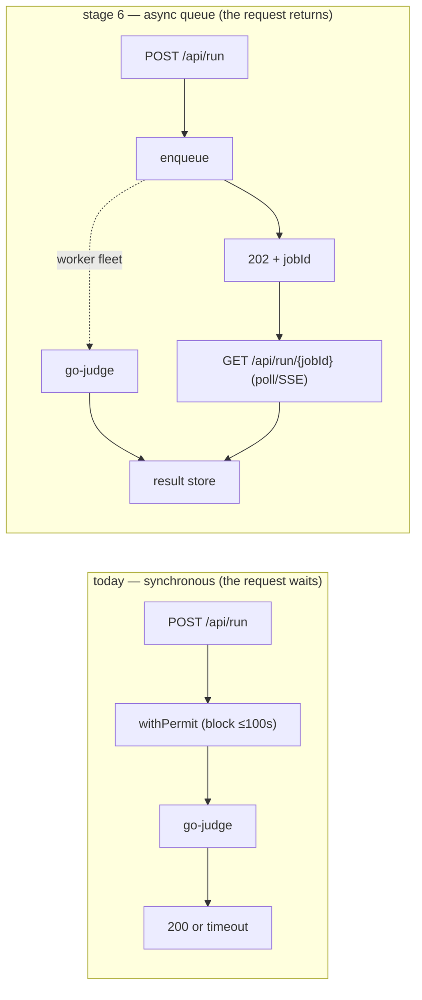

# 51. Scaling Cortex like LeetCode

## TL;DR
> Cortex is *already* most of the way to stage 1 — it's a near-stateless process with externalized state and GitOps deploys — so the roadmap is short and the order is everything. **Stage 1:** run **N replicas** behind the existing edge (move the per-pod semaphore to a **Redis-backed distributed limiter** first, or you'll double go-judge's load) — now a restart isn't an outage. **Stage 2 (the big one):** externalize and **autoscale the go-judge fleet** — the executor is the real bottleneck for a code-runner, and run throughput becomes `M workers × per-worker concurrency`. **Stage 3:** **pgbouncer** + **Postgres read replicas** + a **Redis cluster** so the data tier stops being the cap. **Stage 4:** push the immutable book to a **CDN** — the read path leaves the origin almost entirely (this is the URL-shortener's "answer it at the edge" move). **Stage 5:** multi-region read replicas. **Stage 6 (the move that *defines* a judge platform):** replace the synchronous `gate.withPermit` with an **async submit→queue→poll** judge — bursts queue instead of timing out at 100 s, exactly how LeetCode/HackerRank actually run. Each stage *unlocks* a capacity and *exposes* the next bottleneck; the throughline is that **the executor fleet (stage 2) and the async queue (stage 6) are what turn Cortex from "a site that runs code" into "a system that runs code at scale."**

## 1. Motivation

Most "how would you scale this?" answers are a shopping list — "add caching, add replicas, add a queue." The useful version is an **ordered** path where each step states *what it unlocks*, *what new bottleneck it exposes*, and *roughly what capacity you have after*. Order matters because doing them out of sequence breaks things: add replicas before you make the semaphore distributed and you double go-judge's load; add a CDN before the content is truly immutable-per-deploy and you serve stale chapters. Cortex is a good subject precisely because it's *close to* scalable — so the roadmap reveals which moves are real architecture and which are just config.

Here's the target end-state as a LikeC4 view — stateless tier behind a CDN, executor fleet behind a queue, pooled/replicated stores:

<iframe
  src="/c4/view/capstones_cortexplatform_scaled"
  width="100%"
  height="460"
  style="border: 1px solid var(--border, #2b2b2b); border-radius: 8px;"
  loading="lazy"
  title="Cortex platform — scaled target architecture"
></iframe>

## 2. The staged roadmap

| Stage | Move | Unlocks | New bottleneck exposed | Capacity after |
|---|---|---|---|---|
| **0 — today** | 1 replica, semaphore=8, single stores | works | the single replica; the 8-permit pool | [ch 48](/cortex/system-design/capstones/cortex-capacity-today): thousands of readers, ~4 runs/s |
| **1 — stateless + HPA web tier** | N replicas behind the edge; move the semaphore to a **Redis-backed distributed limiter** | reader throughput scales horizontally; **restart ≠ outage** | go-judge (web tier can now outrun one executor); PG connections = N × 10 | readers: uplink/edge-bound; runs still ~8 |
| **2 — autoscale the go-judge fleet** | a pool of executors (HPA); dispatch across them | run throughput = **M × per-worker concurrency** | executor node RAM/CPU; scheduling fairness; PG under the new load | runs scale ~linearly with executors |
| **3 — pool + replicate the data tier** | **pgbouncer**, Postgres **read replicas**, **Redis cluster** | DB stops being the cap; reads + limits scale | **writes** on the single PG primary; replica lag | web + reads to tens of thousands/s |
| **4 — CDN the static book** | push the immutable per-deploy book/blog to a **CDN/edge** | reader load leaves the origin almost entirely | origin is now ~purely dynamic (run + coach); cache invalidation on deploy | readers: effectively unbounded |
| **5 — multi-region read replicas** | replicate book + PG reads to regions; route to nearest | global low-latency reads; regional redundancy | cross-region **write** consistency (a roaming learner); lag | global reads |
| **6 — async judge queue** | replace `gate.withPermit` with **submit → 202 + job id → poll/stream** | spikes **queue** instead of timing out; priority/fairness; decouple web ↔ executor | queue depth + worker autoscaling policy; result delivery | run throughput bounded only by the fleet + queue |

## 3. Stage 2 is the real bottleneck (and stage 6 is the real architecture)

Two stages deserve emphasis because they're the ones that actually make Cortex *a judge platform* rather than a site that happens to run code.

**Stage 2 — the executor fleet.** A code-runner's defining cost is execution, and [chapter 48](/cortex/system-design/capstones/cortex-capacity-today) showed run throughput is `c ÷ service`. The only way to raise it is more `c` *backed by real capacity*. So you turn the single go-judge into an autoscaled **fleet** of M workers and dispatch across them — now capacity is `M × 8 ÷ service`. Five executor nodes ≈ 5× the runs/second. This is where sharding work across executors comes in; consistent hashing keeps a given submission sticky to a worker without a central coordinator (and reshuffles minimally when the fleet scales):

```d3 widget=consistent-hash-ring
{
  "title": "Sharding the executor fleet — drag node/vnode counts, watch which runs remap",
  "nodeCount": 5,
  "nodeRange": [1, 12],
  "virtualNodes": 8,
  "virtualNodeRange": [1, 50],
  "keyCount": 32
}
```

**Stage 6 — the async judge queue.** Today `/api/run` is *synchronous*: the request holds a connection through `gate.withPermit` and waits up to 100 s. Under a burst, the 9th-and-beyond runs *wait inside the request*, and past ~100 s they *error*. Real judges don't do this — they **accept the submission, return a job id immediately, and stream/poll the result** while a worker fleet drains a queue. A burst becomes queue depth (absorbed) instead of timeouts (errors). This is the single move that most changes the system's character:



## 4. Stage 3 — when the data tier becomes the cap

Once the web tier and executors scale, Postgres becomes the squeeze: N replicas × a 10-connection pool exhausts a single primary's connection budget. **pgbouncer** (a connection pooler) lets many app instances share a small set of real connections; **read replicas** absorb the tutor's read traffic. The catch read replicas always bring is **replication lag** — a learner who writes a turn on the primary and immediately reads from a replica might not see it yet. Feel the trade with the lag cursor:

```d3 widget=replication-lag
{
  "title": "Read replicas bring lag — a turn written on the primary, read from a replica",
  "lagMs": 80,
  "lagRange": [0, 500],
  "readDelayMs": 30,
  "readDelayRange": [0, 500],
  "writeCount": 5,
  "writeIntervalMs": 100
}
```

(For the tutor, the fix is "read-your-writes" consistency on the session you're actively coaching — route a learner's own reads to the primary, send everyone else's analytics reads to replicas. The general pattern is in the [replication](/cortex/system-design/building-blocks/replication) and [consistency-models](/cortex/system-design/building-blocks/consistency-models) lessons.)

## 5. Build It — sync vs async under a burst

The stage-6 payoff, made concrete: the same burst of submissions, served synchronously (with a timeout) vs queued. Watch how many *succeed*:

```python run
def serve_burst(submissions, permits=8, service_s=20, client_timeout_s=100, mode="sync"):
    """A burst of N submissions arriving at once; how many complete vs error?"""
    if mode == "sync":
        # each submission must START within client_timeout_s or it errors.
        # with `permits` servers and FIFO, submission i (0-based) starts at floor(i/permits)*service.
        completed = errored = 0
        for i in range(submissions):
            start_wait = (i // permits) * service_s
            if start_wait <= client_timeout_s:
                completed += 1
            else:
                errored += 1
        return completed, errored
    else:
        # async: everything is accepted (202) and queued; nothing errors, it just drains over time.
        drain_time = (submissions / permits) * service_s
        return submissions, 0, drain_time

burst = 60  # 60 people hit "Run" on a 20s Scala block at once
c, e = serve_burst(burst, mode="sync")
print(f"SYNC : {c} completed, {e} ERRORED (waited past the 100s client timeout)")
c2, e2, drain = serve_burst(burst, mode="async")
print(f"ASYNC: {c2} completed, {e2} errored — queue drains in ~{drain:.0f}s (everyone gets a result)")
print("\nSame capacity (8 permits, 20s service). Sync turns overload into ERRORS; async turns it into WAIT.")
```

The numbers make the architectural point: with 8 permits and a 20 s service, a synchronous burst of 60 **errors out everyone past the ~100 s timeout window**, while the async queue **completes all 60** — it just takes ~150 s to drain. Same hardware, same throughput ceiling; the queue changes *failure* into *latency*, which is almost always the trade you want.

## 6. Trade-offs

| Stage | Buys | Costs |
|---|---|---|
| 1 stateless + HPA | redundancy; reader scale | must make the semaphore distributed first; N× PG connections |
| 2 executor fleet | the run-throughput ceiling rises linearly | more nodes to run; dispatch/fairness logic |
| 3 pool + replicas | DB stops being the cap | replica lag → read-your-writes care |
| 4 CDN | origin sheds the read load | cache invalidation on deploy; analytics granularity |
| 6 async queue | bursts queue, never error | result-delivery plumbing (poll/SSE); a job store; UX for "pending" |

## 7. Edge cases

- **Distributed-limiter race.** Moving the semaphore to Redis trades a perfect in-process count for an approximate distributed one — pick a token-bucket/Lua approach so two replicas can't both think a permit is free.
- **CDN serving stale chapters.** The book is immutable *per deploy*, so a deploy must invalidate the CDN (or use content-hashed URLs) — otherwise readers see the old chapter until TTL.
- **Queue + stuck worker.** Async needs visibility timeouts: if a worker dies mid-run, the job must reappear for another worker, not vanish — the same at-least-once delivery the [message-queues lesson](/cortex/system-design/distributed-patterns/message-queues-and-streams) covers.

## 8. Practice

> **Exercise 1 — Order matters.**
> A teammate wants to set `replicas: 3` today to "handle more load." Walk the two things that break, and what must change first.
>
> <details>
> <summary>Solution</summary>
>
> Two breakages. **(1) The semaphore.** `MaxConcurrentRuns = 8` is *per pod*, so 3 replicas = a global cap of **24** concurrent runs, not 8 — go-judge could suddenly see 3× the load (up to ~24 GiB of sandboxes), blowing past the RAM bound the semaphore exists to enforce (a rank-3 crash from [ch 49](/cortex/system-design/capstones/cortex-failure-thresholds)). **(2) Postgres connections.** Each pod has a 10-connection Hikari pool, so 3 pods = up to 30 connections against a single primary — closer to exhausting it. **What must change first:** move the run limiter to a **Redis-backed distributed limiter** (so the global cap stays 8 across all pods), and put **pgbouncer** in front of Postgres (so N pods share a bounded connection set). Only *then* is `replicas: 3` safe. This is exactly why stage 1 lists "make the semaphore distributed" as a prerequisite, not an afterthought.
>
> </details>

> **Exercise 2 — The one move.**
> If you could make only *one* change to take Cortex from "handles a person clicking Run" to "handles a classroom submitting at once," which stage, and why that one?
>
> <details>
> <summary>Solution</summary>
>
> **Stage 6 — the async judge queue.** A classroom is a *burst*: 30 people submit within seconds. Synchronously, that burst slams into the 8 permits and the back of the line waits past the 100 s timeout and **errors** (the §5 simulation: 60 synchronous submissions mostly error). The async queue accepts all of them (202 + job id) and **drains the burst over time** — nobody errors, they just wait and poll. It's the single change that turns *overload-as-failure* into *overload-as-latency*, which is the defining property of a real judge platform. (Stage 2 — the executor fleet — raises the *throughput* so the queue drains faster, so they're best together; but if you can only do one, the queue is what stops the classroom from seeing errors.)
>
> </details>

## 9. In the Wild

- **[LeetCode / HackerRank judge architecture](https://en.wikipedia.org/wiki/Competitive_programming)** — real online judges run a worker **fleet** behind a **submission queue**; stages 2 + 6 are their core shape.
- **[`CodeRunPipeline.scala`](https://github.com/ani2fun/cortex)** — the synchronous `gate.withPermit` that stage 6 replaces. The whole roadmap starts from these ~30 lines.
- **[37. URL shortener](/cortex/system-design/capstones/url-shortener)** §8 — the "answer it at the edge" CDN move (stage 4) in its purest form. **[38. News feed](/cortex/system-design/capstones/news-feed)** — fan-out + queue patterns that stage 6 echoes.
- **[The Twelve-Factor App](https://12factor.net/)** — Cortex's near-12-factor design is *why* stage 1 is mostly free; the gaps (in-pod semaphore) are exactly what stage 1 fixes.

---

> **Next:** [52. Making Cortex data-intensive](/cortex/system-design/capstones/cortex-data-intensive) — the final move: the fire-and-forget logs and the per-turn token usage are *already* latent event streams. Turn them on and Cortex grows analytics, leaderboards, recommendations, and a labeled dataset of how people actually learn.
