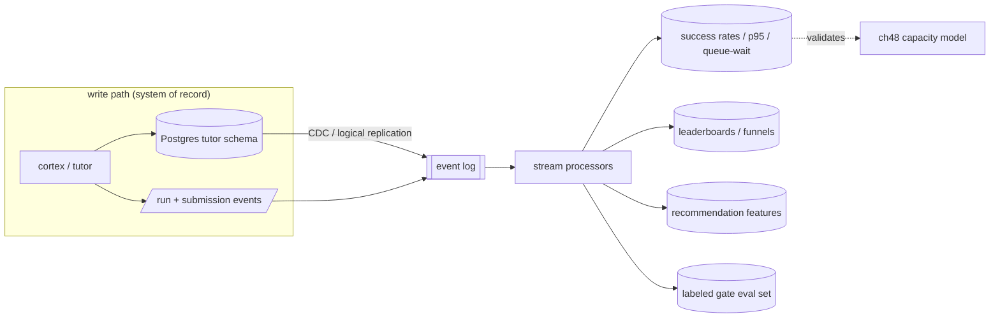

# 52. Making Cortex data-intensive

## TL;DR
> Cortex is **one schema change away from being a data-intensive application** — because the raw material already exists, fire-and-forgotten. Today the Mongo `hello_events` log is an `insertOne` nobody reads, and every coaching turn records a rich `TurnUsage` + `GateVerdict` that just sits in Postgres. **Turn those into event streams** — emit structured `run`, `submission`, and `coach_turn` events to an append-only log — and the whole DDIA toolbox opens up: **derived data** (per-language success rates, p95 run latency, queue-wait distributions that *validate [ch 48's](/cortex/system-design/capstones/cortex-capacity-today) model with real numbers*), **analytics & leaderboards** (hardest problems = lowest gate pass-rate), **recommendations** (next problem from a learner's verdict history — the [recommendation capstone](/cortex/system-design/capstones/recommendation-serving) applied to Cortex's own data), and a genuinely valuable **labeled dataset**: every turn is a `(student answer, step, verdict, coach reply)` tuple — a corpus for *evaluating and tuning the gate itself*. Feed it with **CDC** (change-data-capture) from the Postgres system-of-record instead of dual-writes, and you have a clean batch+stream pipeline. The lesson: **data-intensive isn't a rewrite; it's noticing that your logs are already a product.**

## 1. Motivation

"Data-intensive" sounds like a different *kind* of system — Kafka, Spark, a warehouse, a team. But the on-ramp is almost always the same humble realization: **the events you're already throwing away are worth keeping.** [Kleppmann's framing](https://dataintensive.net/) is that a data-intensive app is one where the *data* — its volume, complexity, and rate of change — is the primary challenge, not the compute. Cortex's compute is trivial (serve markdown, run a sandbox); its *data* — how thousands of people reason through problems, where they get stuck, which gate verdicts were right — is the latent asset. This chapter is about turning exhaust into product, and it's the natural capstone to the capstone: once you've sized, hardened, and scaled the system, the question becomes *what is it actually generating?*

## 2. The raw material is already there

Two sources, both currently under-used:

- **The fire-and-forget log.** `HelloPipeline` does `insertOne(hello_event)` and forgets it ([ch 50](/cortex/system-design/capstones/cortex-storage-and-cost): unbounded, no reader). It's the *seed pattern* — a write-only event sink — applied to the least interesting event (a visit).
- **The per-turn record.** Every coaching turn already carries a `GateVerdict` (verdict, score, `rubricHits`, `missing`, `hint`) and a `TurnUsage` (tokens, `costUsd`). That's a *labeled, structured* event — it just isn't streamed anywhere.

Generalize the first pattern to the valuable events and you have streams worth processing:

```d2
direction: right
sources: Sources (already happening) {
  run: /api/run → run events
  sub: /api/submissions → submission events
  turn: coach turn → verdict + usage
  visit: /api/hello → visit events
}
log: Event log / topic { shape: queue }
proc: Stream processors
views: Derived stores {
  metrics: success rates, p95 latency, queue-wait { shape: cylinder }
  board: leaderboards / funnels { shape: cylinder }
  recs: recommendation features { shape: cylinder }
  eval: labeled gate dataset { shape: cylinder }
}
sources.run -> log
sources.sub -> log
sources.turn -> log
sources.visit -> log
log -> proc
proc -> views.metrics
proc -> views.board
proc -> views.recs
proc -> views.eval
```

## 3. The five DDIA moves, concrete to Cortex

| DDIA theme | The Cortex move |
|---|---|
| **Event streams from the log** | Generalize `hello_events` into structured `run` (language, runtimeMs, exit, queued-ms), `submission`, and `coach_turn` (step, verdict, tokens) events on an append-only log / Kafka topic. The visit log is the seed; the run + turn streams are the value. |
| **Derived data & materialized views** | From the run stream: per-language **success rate**, **p50/p95 runtimeMs**, and the **queue-wait distribution** — which *measures* the [ch 48](/cortex/system-design/capstones/cortex-capacity-today) M/M/c model against reality. From turns: **step-completion funnels** (clarify→…→test drop-off). |
| **Analytics / leaderboards / recommendations** | "Most-run snippets," "hardest problems" (lowest gate pass-rate), per-learner progress; **next-problem recommendations** from verdict history — the [two-stage funnel](/cortex/system-design/capstones/recommendation-serving) on Cortex's own data. |
| **The tutor's turns as a training/eval asset** | Every turn is `(answer, step, GateVerdict, coach reply)` — a **labeled dataset** to *evaluate the gate* (does Haiku's verdict match human judgement?), tune the rubric, and serve as eval/fine-tune data. Genuinely valuable, already collected. |
| **CDC from Postgres** | The `tutor` schema is the system of record. **Change-data-capture** (logical replication / Debezium-style) streams session/message changes to the analytics store **without dual-writes** — no app-level "write to DB *and* to Kafka," which is the classic dual-write inconsistency the [outbox pattern](/cortex/system-design/distributed-patterns/outbox-pattern-and-cdc) exists to avoid. |



## 4. The most valuable derived dataset: the gate's own report card

Worth dwelling on, because it's the move that's *unique* to an AI-coaching system. Every turn produces a verdict from the gate **and** the learner's actual answer. Collect them and you have the one thing you need to know whether your AI judge is any good: **a labeled set to grade the grader.** You can ask, on real data, "when the gate said *pass*, would a human have agreed?" — and use the disagreements to tune the rubric or swap the gate model with evidence instead of vibes. This closes the loop the [Claude Stack book](/cortex/the-claude-stack/ai-fluency/diligence) calls *diligence*: the model's output isn't trusted, it's **measured against ground truth you accumulated by running the system.**

## 5. Build It — fold a run stream into a materialized view

The smallest possible version of the whole idea: a stream of run events, folded into a per-language success-rate + latency view. This is what a stream processor does, minus the distribution:

```python run
from collections import defaultdict

# A toy stream of run events (what /api/run would emit per execution).
events = [
    {"lang": "python", "ok": True,  "ms": 1200, "queued_ms": 0},
    {"lang": "python", "ok": True,  "ms": 900,  "queued_ms": 0},
    {"lang": "python", "ok": False, "ms": 15000,"queued_ms": 200},   # TLE
    {"lang": "scala",  "ok": True,  "ms": 19000,"queued_ms": 8000},  # cold compile + queue wait
    {"lang": "scala",  "ok": True,  "ms": 21000,"queued_ms": 22000}, # queued behind others
    {"lang": "java",   "ok": True,  "ms": 9000, "queued_ms": 0},
    {"lang": "python", "ok": True,  "ms": 1100, "queued_ms": 0},
]

view = defaultdict(lambda: {"n": 0, "ok": 0, "ms": [], "queued": []})
for e in events:                       # the "fold": replay the log into a derived view
    v = view[e["lang"]]
    v["n"] += 1; v["ok"] += e["ok"]
    v["ms"].append(e["ms"]); v["queued"].append(e["queued_ms"])

def p95(xs): return sorted(xs)[min(len(xs) - 1, int(0.95 * len(xs)))]

print(f"{'lang':7} {'runs':>4} {'success':>8} {'p95 ms':>7} {'p95 queue':>10}")
for lang, v in sorted(view.items()):
    print(f"{lang:7} {v['n']:>4} {v['ok']/v['n']*100:>6.0f}% {p95(v['ms']):>7} {p95(v['queued']):>10}")
print("\nThis derived view IS the data product: success rate per language, and a queue-wait p95")
print("that you'd compare against ch48's predicted ~0 (Python) vs growing (Scala) — model meets reality.")
```

Notice the queue-wait column: Scala runs show real queue time (they're slow, so they pile up), Python shows ~none — *exactly* what the [chapter 48](/cortex/system-design/capstones/cortex-capacity-today) M/M/c model predicts. That's the payoff of streaming: your capacity model stops being a back-of-envelope and starts being a **measured, monitored property** of the live system.

## 6. Trade-offs

| Decision | Choice | Why | Cost |
|---|---|---|---|
| Get data into the stream | **CDC from Postgres** | no dual-write inconsistency; the DB stays the source of truth | a CDC pipeline to run (Debezium/logical replication) |
| Log retention | **bounded + streamed** (vs today's unbounded Mongo) | retention policy + a real consumer | you now operate a log/topic |
| Derived stores | **materialized views, recomputable** | cheap reads; rebuildable from the log | eventual consistency with the source |
| Gate eval set | **collect every (answer, verdict)** | grade the grader on real data | storage + a labeling/review process |

## 7. Edge cases

- **Privacy.** Coaching transcripts are personal. A learning dataset needs consent, anonymization, and retention limits — "valuable dataset" doesn't override "it's someone's struggle with a problem."
- **Reprocessing.** The win of an event log is replay — but a schema change to events means versioning them so old and new replay together (the same forward-compat the [tutor contract](/cortex/cortex-onboarding/cortex-tutor/the-turn-lifecycle) already practices).
- **Derived-view staleness.** Materialized views lag the log; a leaderboard that's a few seconds behind is fine, a "did my submission count?" check is not — route the latter to the source of truth.

## 8. Practice

> **Exercise 1 — Why CDC instead of dual-write?**
> The "obvious" way to feed analytics is: in the app, after writing a turn to Postgres, also publish it to the event log. Why is CDC better?
>
> <details>
> <summary>Solution</summary>
>
> The dual-write — "write to Postgres **and** publish to the log" — has a **consistency hole**: the two writes aren't atomic, so a crash (or just a network blip) between them leaves the DB and the log disagreeing. Either the turn is persisted but never streamed (analytics silently miss it) or streamed but not persisted (analytics count a turn that "didn't happen"). There's no clean retry that fixes both. **CDC** avoids it by making the **database's own commit log the single source of truth**: you write *once* (to Postgres), and the change-data-capture stream is derived *from the committed WAL*, so it can't disagree with what's actually in the DB. One write, one truth, the stream follows. (The [outbox pattern](/cortex/system-design/distributed-patterns/outbox-pattern-and-cdc) is the same idea when you can't do log-based CDC: write the event to an outbox table *in the same transaction*, then relay it.)
>
> </details>

> **Exercise 2 — Validate the model.**
> You stream run events and build the queue-wait p95 view from §5. How does it let you *check* (or refute) chapter 48's capacity model — and what would a surprise look like?
>
> <details>
> <summary>Solution</summary>
>
> Chapter 48 predicts queue-wait from `λ` (offered run-rate), `c = 8` permits, and service time: near-zero for Python (ρ ≪ 1) and growing for Scala as load rises (ρ → 1). The streamed **queue-wait p95 per language, bucketed by concurrent load**, is the *measured* version of that prediction. **Agreement** validates the model — you can now trust it to plan capacity. A **surprise** would be diagnostic: e.g. Python queue-wait that's higher than predicted means either service time is worse than the assumed ~2 s (something's slow), or true concurrency is higher than you think (the rate limit isn't doing what you assumed), or the permits aren't all usable (a stuck run holding one). That's the deeper point of going data-intensive: the derived view turns a *design-time assumption* into a *run-time invariant you monitor* — and the moment reality diverges from the model, you find out, instead of guessing during an incident.
>
> </details>

## 9. In the Wild

- **[Designing Data-Intensive Applications](https://dataintensive.net/)** (Kleppmann) — chs. 11 (streams) & 12 (derived data) are this chapter's backbone; the whole book is the lens for capstones 47–52.
- **[`HelloPipeline.scala`](https://github.com/ani2fun/cortex)** — the fire-and-forget `insertOne` that's the seed of every stream here; **[`TutorContract.scala` → `GateVerdict`/`TurnUsage`](https://github.com/ani2fun/cortex)** — the already-structured, already-labeled turn record.
- **[Debezium](https://debezium.io/)** — log-based CDC from Postgres, the §3 "no dual-write" mechanism.
- **[18. Outbox pattern & CDC](/cortex/system-design/distributed-patterns/outbox-pattern-and-cdc)** and **[Message queues & streams](/cortex/system-design/distributed-patterns/message-queues-and-streams)** — the building-block lessons this capstone composes.

---

> **You've finished the Cortex platform capstone.** Six chapters on the one system you can fully audit: its [shape and constraints](/cortex/system-design/capstones/cortex-platform-overview), its [capacity](/cortex/system-design/capstones/cortex-capacity-today), its [failure modes](/cortex/system-design/capstones/cortex-failure-thresholds), its [storage and cost](/cortex/system-design/capstones/cortex-storage-and-cost), its [scaling path](/cortex/system-design/capstones/scaling-cortex-like-leetcode), and its [data-intensive future](/cortex/system-design/capstones/cortex-data-intensive). The same playbook — estimate, architect, find the bottleneck, cost it, scale it, stream it — works on any system. Now point it at yours.
