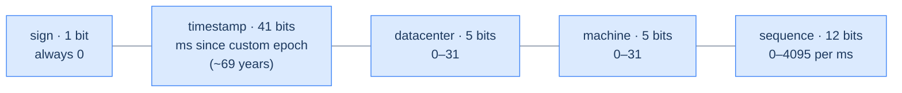
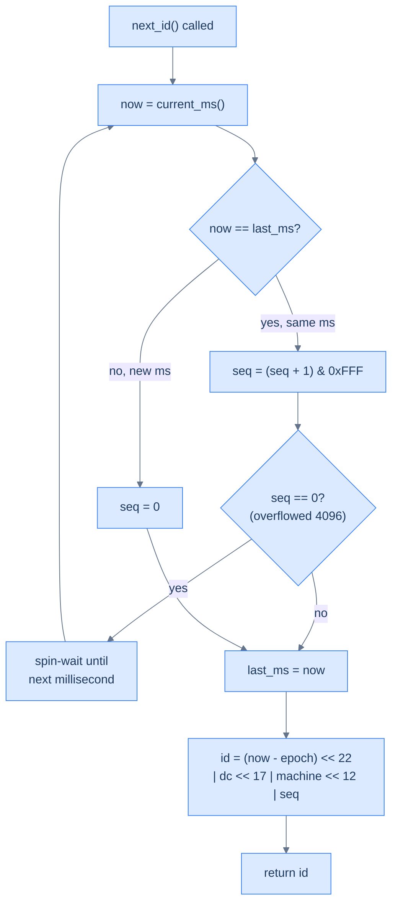

# 52. Distributed unique ID generator

## TL;DR
> Every record needs a unique primary key, and on a single database `AUTO_INCREMENT` hands you one that's also **compact (64-bit)** and **time-sortable** for free. Shard that database and the free lunch evaporates: a lone counter is a write bottleneck and a single point of failure, and naively running one per shard mints **duplicate** IDs. The four escapes, in increasing robustness: **multi-master auto-increment** (each node steps by *k*; works, but loses clean time-ordering and rebalances badly), **UUIDv4** (128-bit, generated locally with zero coordination, but too big and not sortable), a **ticket server** (one central counter — simple, numeric, but still a SPOF), and **Twitter Snowflake** — the production answer. Snowflake stitches a 64-bit ID out of `1 sign bit ‖ 41-bit timestamp (ms) ‖ 5-bit datacenter ‖ 5-bit machine ‖ 12-bit per-ms sequence`, so every node mints **unique, roughly time-sortable** IDs with **no cross-node coordination**. The bit budget is the whole design: 41 bits ≈ **69 years** of milliseconds, 5+5 bits = **1,024 machines**, 12 bits = **4,096 IDs per machine per millisecond** (≈ 4M IDs/sec/node — vastly over the ~10K/s ask). The deep risk is that the timestamp comes from a **wall clock that can jump backwards** (NTP correction, leap second): mint two IDs in the wrong order and you've broken sortability; mint them in the *same* backwards millisecond and you can **collide**. The fixes — refuse to go backwards, monotonic clocks, borrow from the sequence — come straight from [clocks and time](/cortex/system-design/building-blocks/clocks-and-time). DDIA frames the same family (UUIDv7, Snowflake, ULID) bluntly: wall-clock IDs are unique but only *approximately* ordered, and **not linearizable** — a caveat we'll take seriously in §11.

## 1. Motivation

On one machine, getting a unique ID is a solved problem you've used a thousand times without thinking: declare the column `BIGINT AUTO_INCREMENT`, and the database hands every new row a fresh integer. It's perfect, and it's perfect in three ways at once. It's **unique** (the database serializes the increments). It's **compact** — a 64-bit integer, eight bytes, indexes beautifully. And, almost as a bonus, it's **time-ordered**: row 1,000,051 was inserted after row 1,000,050, so sorting by primary key sorts by creation time, and "give me the 20 most recent" is just `ORDER BY id DESC LIMIT 20` — no separate `created_at` index required. That last property is quietly load-bearing in more systems than people realize.

Now shard the database (the exact move from [Lesson 12 — Sharding](/cortex/system-design/building-blocks/sharding-and-partitioning)), and watch all three guarantees fall over at once. You can't keep a *single* `AUTO_INCREMENT` counter, because every insert across every shard would have to round-trip to that one counter — a write bottleneck and a single point of failure precisely when you sharded *to escape* a single machine's limits. But you also can't just let *each shard* run its own independent `AUTO_INCREMENT`, because then shard A and shard B both happily mint `1, 2, 3, …` and you get **duplicate primary keys** — the one thing a primary key may never be. DDIA puts the dilemma crisply: a single-node generator "is not fault-tolerant because that node is a single point of failure," it's "slow if you want to create a record in another region" (a cross-planet round trip just to get an ID), and it "could become a bottleneck if you have high write throughput." The very thing that was free on one box is suddenly one of the harder problems in the system.

This is the canonical distributed-systems capstone because the *answer* is a microcosm of the whole field. You want what the counter gave you — unique, compact, time-sortable — but produced **without coordination**, because coordination is exactly what doesn't scale across machines and regions. The elegant resolution, Twitter's **Snowflake**, is a lesson in *divide and conquer applied to a single integer*: carve the 64 bits into a timestamp, a machine identity, and a per-machine sequence, and suddenly every node can mint globally-unique, roughly-ordered IDs entirely on its own. And lurking underneath is the deepest gotcha in distributed systems — **time is unreliable** ([Lesson 15 — Clocks and time](/cortex/system-design/building-blocks/clocks-and-time)). The generator's ordering rests on a wall clock, and wall clocks lie: they drift, they get corrected, they jump *backwards*. A design that ignores that ships duplicate IDs in production. Let's build it — and then break it on the clock.

This capstone is a close cousin of [Capstone 42 — the URL shortener](/cortex/system-design/capstones/url-shortener): there, "generate a unique short code with no central counter" was a *sub-problem* we waved at with "use a Snowflake or a key-generation service." This is that sub-problem promoted to the main event, examined end to end.

## Try it with the coach

Before you read the design, work through it yourself. The coach runs the same six-step interview — restate the problem, estimate, choose an approach, plan it, sketch the implementation, then stress-test it — and pushes back at each gate. There's no code editor here; you reason in prose, the way you would at a whiteboard. (Sign in to start; your conversation is kept in your browser as you go.)

<div class="concept-coach"></div>

## 2. Requirements and scope

The requirements are short, and almost every one of them eliminates a candidate solution — which is what makes this design feel like a process of elimination converging on Snowflake.

**Functional:**
- **Generate IDs:** hand out a unique identifier on demand (`next_id() → 1530XXXXXXXXXXXXXXX`).
- *Optional:* expose it as a service (`GET /id`) *or* embed it as a library inside each app server — a real architecture choice we'll weigh in §6.

**Non-functional (these *are* the design):**
- **Unique.** The hard, non-negotiable invariant. Two calls — ever, on any node, in any region — must never return the same value.
- **Sortable by time.** IDs created later should compare *greater* than IDs created earlier. "IDs created in the evening are larger than those created in the morning," as the source puts it — and crucially, *roughly* ordered is the bar, not strict total order (we'll see in §11 why the strict version is far more expensive than it sounds).
- **64-bit.** Must fit in a `BIGINT` — eight bytes. This single constraint kills the 128-bit UUID outright (§4).
- **Numeric.** Integers, not strings — they index tightly and compare fast.
- **High throughput.** The classic ask is "≥ 10,000 IDs/second." We'll size for far more, and the bit budget will show the headroom is enormous.
- **Highly available + low latency.** ID generation sits on the *write path of every record creation in the system* — if it's down, nothing can be created; if it's slow, every insert is slow.

**Out of scope:** *strict* global total ordering (we accept approximate, time-based ordering — §11), the deep theory of clock synchronization itself (we *use* the results from [Lesson 15](/cortex/system-design/building-blocks/clocks-and-time) rather than re-deriving NTP), and unguessability/security of IDs (a Snowflake ID *leaks* its creation time and machine — a real property we'll name as a trade-off, not solve here). Naming what you're *not* building is part of the design.

## 3. Back-of-envelope estimation

Numbers first ([estimation](/cortex/system-design/foundations/back-of-envelope-estimation)) — except here the numbers aren't about servers or storage, they're about **bits**. The entire design is a budget problem: you have 64 bits, and you must decide how many to spend on *when*, how many on *who*, and how many on *how-many-this-instant*. Spend them, and the spending dictates the system's limits for the next several decades.

Start from the ask — **10,000 IDs/second** — and ask the dual question: what does the bit layout *buy* you? The canonical Snowflake split is **1 + 41 + 5 + 5 + 12 = 64**. Walk each field:

| Field | Bits | What the bits buy | The math |
|---|---|---|---|
| Sign | **1** | always `0` — keeps the ID a *positive* signed 64-bit integer | reserved; a signed `BIGINT` must not go negative |
| Timestamp (ms) | **41** | how many years before the clock field overflows | `2⁴¹ − 1 = 2,199,023,255,551 ms ≈ 69.7 years` |
| Datacenter ID | **5** | how many datacenters | `2⁵ = 32` |
| Machine ID | **5** | machines per datacenter | `2⁵ = 32` → **1,024 nodes** total (5+5 = 10 bits) |
| Sequence | **12** | IDs one machine can mint in a single millisecond | `2¹² = 4,096` |

Three of those rows settle real decisions, so let's make them honest.

**Throughput.** 12 sequence bits = **4,096 IDs per machine per millisecond** = `4,096 × 1,000 = 4,096,000` ≈ **4 million IDs/sec, per node**. With 1,024 nodes that's a theoretical ceiling north of **4 *billion* IDs/sec** across the fleet. Against a 10,000/s requirement, the headroom is roughly **six orders of magnitude** — a single node alone clears the ask 400×. The sequence field essentially never saturates in practice; it exists to absorb the *bursts* where several IDs land in the same millisecond, not to be a steady-state limit.

**Lifespan.** 41 timestamp bits hold ~`2.2 × 10¹²` milliseconds, which is **≈ 69.7 years**. But 41 bits counting from the Unix epoch (1970) would already have burned ~56 of those years by today — you'd have barely a decade left. The standard fix is a **custom epoch**: Twitter's Snowflake counts milliseconds not from 1970 but from `1288834974657` ms — **2010-11-04 01:42:54 UTC**. Choosing an epoch near your launch date resets the 69-year clock to start *now*, buying the full lifespan forward. (When the 69 years do run out, you migrate to a new epoch or widen the field — a problem for your successors' successors.)

**Fleet size.** 10 bits of identity = **1,024** distinct (datacenter, machine) pairs. If you'll never have 32 datacenters, the split is a *knob*: steal bits from datacenter and give them to machine (e.g. 3 + 7 → 8 datacenters × 128 machines), or — the source's "section length tuning" point — for a low-concurrency, long-lived system, shrink the sequence and grow the timestamp. The 64-bit total is fixed; *how you carve it* is yours.

The takeaway that makes Snowflake click: **10,000 IDs/sec is a trivial load for the *throughput* of this scheme.** The bits aren't there to hit a rate — they're there to encode *enough identity and enough time* that no two nodes ever collide without talking to each other. The estimation isn't sizing a fleet; it's proving the layout has room to breathe for 70 years.

## 4. The approaches compared

There are four standard ways to mint distributed IDs, and the instructive thing is *how each one fails a requirement from §2* — uniqueness, 64 bits, sortability, or no-coordination. Snowflake is the one that fails none of them.

**1. Multi-master auto-increment.** Keep using each database's `AUTO_INCREMENT`, but make the nodes *interleave*: with *k* servers, server *i* starts at *i* and steps by *k*. With `k = 2`, server 0 mints `2, 4, 6, …` and server 1 mints `1, 3, 5, …` — never colliding. It works and it's simple, *but*: IDs no longer "go up with time" across the fleet (server 0 might be racing ahead while server 1 lags, so a globally-later ID can be numerically smaller); it's painful across multiple datacenters; and the step *k* is baked into the scheme, so **adding or removing a server** forces you to re-pick the stride and risk overlaps. Fails the *sortability* and *elastic-scaling* bars.

**2. UUID (v4).** A **128-bit** value, in practice mostly random (version 4). Its superpower is *zero coordination*: any node generates one locally with no shared state — "no synchronization issues," infinitely scalable with your web tier. But it fails two hard requirements at once: it's **128 bits, not 64** (double the storage in every index and foreign key), and because it's essentially random, **its order tells you nothing** — `uuidA < uuidB` says nothing about which was created first, so you lose time-sortability entirely (and random keys also scatter writes across a B-tree, hurting insert locality). Great when you only need uniqueness; disqualified here by *64-bit* and *sortable*. (DDIA notes the newer **UUIDv7** fixes the ordering by putting a millisecond timestamp in the high bits — which makes it, in spirit, a 128-bit Snowflake. Still too wide for our 64-bit cap, but the same idea.)

**3. Ticket server.** One centralized box owning a single `AUTO_INCREMENT` — Flickr's "ticket server" design. Every node asks it for the next number. IDs are **numeric, compact, and (because there's one counter) cleanly ordered**, and it's genuinely easy to build. The fatal flaw is in the topology: it's a **single point of failure** — if the ticket server dies, *nothing in the system can be created*. Run two for redundancy and you're back to the multi-master interleaving problem (one even, one odd) plus the synchronization headache. Fails *availability / no-SPOF* — and at high throughput, *no-coordination* (every create is a network round trip to one box).

**4. Twitter Snowflake.** Don't generate the ID atomically — **divide and conquer it.** Carve the 64 bits into `timestamp ‖ datacenter ‖ machine ‖ sequence` (§3). The `(datacenter, machine)` bits guarantee **two different nodes can never collide** (their identity bits differ); the per-machine `sequence` guarantees **one node can't collide with itself** within a millisecond; and the high `timestamp` bits make IDs **roughly time-sortable**. No node ever talks to any other node to mint an ID. It satisfies *every* requirement — unique, 64-bit, numeric, sortable, coordination-free, fast — which is why it's the production answer and the rest of this chapter.

| Approach | Unique? | 64-bit? | Time-sortable? | Coordination-free? | Killed by |
|---|---|---|---|---|---|
| Multi-master auto-inc | yes | yes | **no** (cross-node) | mostly | rebalancing on add/remove; weak ordering |
| UUID v4 | yes | **no (128)** | **no** (random) | **yes** | 64-bit cap + sortability |
| Ticket server | yes | yes | yes | **no** (central) | single point of failure |
| **Snowflake** | **yes** | **yes** | **roughly** | **yes** | — (the answer) |

DDIA catalogues this same menu under "ID Generators and Logical Clocks," and groups Snowflake with UUIDv7, ULID, MongoDB ObjectIDs, and Hazelcast's Flake under one banner — *"wall-clock timestamp made unique"*: put a timestamp in the most significant bits, then "fill the remaining bits with extra information that ensures the ID is unique even if the timestamp is not — for example, a shard number and a per-shard incrementing sequence number." That sentence *is* Snowflake's layout, described from first principles. Hold onto DDIA's verdict on the whole family, though — *unique, but only approximately ordered* — because §11 is where it bites.

## 5. API and contract

The contract is almost comically small — one operation — which is exactly why the *guarantees* it makes are the entire spec.

```
next_id() -> int64          # a unique, positive, roughly-time-sortable 64-bit integer

# If exposed as a network service instead of a library:
GET /id                     200 {"id": 1530412345678901234}
GET /id?batch=100           200 {"ids": [...]}   # amortize the round trip
```

The guarantees the caller may rely on:
- **Uniqueness (strong):** no two successful calls *anywhere in the fleet* ever return the same value. Non-negotiable.
- **Monotonic-per-node (strong):** within a single generator instance, successive calls strictly increase. (This is the property the clock can threaten — §11.)
- **Roughly time-ordered (weak / best-effort):** across nodes, an ID minted later *usually* compares greater — but **not guaranteed** to the millisecond, because clocks across machines aren't perfectly synced. Callers must **not** treat ID order as a precise global event order (DDIA: such IDs are "unlikely to be linearizable").
- **Compactness (strong):** always a positive signed 64-bit integer (sign bit `0`).

That "roughly, not exactly" line in the contract is the single most important sentence for anyone *consuming* these IDs. Sort a feed by Snowflake ID and it'll look right to a human. Use Snowflake-ID order to decide which of two near-simultaneous security-sensitive events "happened first" and you have a bug — §11 has the canonical example.

## 6. Architecture

The headline architectural decision is one the simpler capstones don't face: **is the ID generator a *service* you call, or a *library* you embed?** Both are real; they trade a network hop against operational independence.

```d2
direction: right

app: App servers (need IDs) { shape: rectangle }

embedded: {
  label: "Option A — embedded library"
  lib: "Snowflake lib\n(in-process)" { shape: hexagon }
  clock: "Local monotonic clock" { shape: rectangle }
  lib -> clock: read ms
}

service: {
  label: "Option B — ID service"
  lb: Load balancer { shape: rectangle }
  g1: "ID node\n(dc=1, m=1)" { shape: hexagon }
  g2: "ID node\n(dc=1, m=2)" { shape: hexagon }
  g3: "ID node\n(dc=2, m=1)" { shape: hexagon }
  lb -> g1
  lb -> g2
  lb -> g3
}

coord: "Coordinator (ZooKeeper / etcd)\nleases unique machine IDs at startup" { shape: cylinder }

app -> embedded.lib: "next_id()  (in-process call, ~0 latency)"
app -> service.lb: "GET /id  (network hop)"
embedded.lib -> coord: "lease (dc, machine) id on boot"
service.g1 -> coord: "lease (dc, machine) id on boot"
```

**Option A — embedded library.** Each app server links the Snowflake code and calls `next_id()` in-process — **no network hop**, the lowest possible latency, and no extra tier to run. The catch: *every app instance now needs its own unique machine ID*, so the number of machine-ID bits must cover your entire app fleet (1,024 may be tight if you autoscale to thousands of pods).

**Option B — standalone ID service.** A small pool of dedicated ID nodes behind a [load balancer](/cortex/system-design/building-blocks/load-balancing); app servers call `GET /id`. You pay a network round trip (amortized by batch-fetching, e.g. `?batch=100`), but only a handful of nodes need machine IDs, the service scales and is operated independently, and clients in any language just make an HTTP call.

The piece that's load-bearing in **both** options — and the one beginners skip — is **machine-ID assignment**. The whole no-collision guarantee rests on every live generator holding a *distinct* `(datacenter, machine)` pair. Hard-code them in config and someone *will* eventually clone a VM image or fat-finger a deploy and run two nodes with the same ID — instant, silent duplicate IDs. The robust pattern is to **lease** the identity at startup from a coordination service (**ZooKeeper** / **etcd**): on boot a node claims a free machine ID, holds it (often via an ephemeral node / lease), and releases it on shutdown — so no two live nodes ever share one. The source flags exactly this: datacenter and machine IDs "are chosen at the startup time, generally fixed once the system is up running. Any changes … require careful review since an accidental change … can lead to ID conflicts." That sentence is the system's main operational hazard, stated plainly.

## 7. The Snowflake bit layout, decoded

The design *is* the bit layout, so let's make it concrete — first the anatomy, then a worked decode of a real 64-bit value back into its meaning.



Read left (most significant) to right (least significant): the **timestamp sits highest**, which is the trick that makes the IDs sortable — because the most-significant bits dominate integer comparison, a newer millisecond produces a strictly larger number regardless of which node or sequence value follows. The **identity bits** (datacenter + machine) sit in the middle so that two nodes minting in the *same* millisecond still differ. The **sequence** sits lowest, breaking ties when one node mints several IDs in one millisecond.

**A worked decode.** Suppose `next_id()` returns the integer **`1530412345049153537`** and our service uses the Twitter epoch (`1288834974657` ms). Peel it apart by reversing the construction (`id = (ts << 22) | (dc << 17) | (machine << 12) | seq`):

| Step | Operation | Value |
|---|---|---|
| Raw ID | — | `1530412345049153537` |
| Sequence | `id & 0xFFF` (low 12 bits) | `1` |
| Machine | `(id >> 12) & 0x1F` | `1` |
| Datacenter | `(id >> 17) & 0x1F` | `2` |
| Timestamp offset | `id >> 22` | `364857601543` ms since epoch |
| Real timestamp | `364857601543 + 1288834974657` | `1653692576200` ms ≈ **2022-05-27 22:22:56 UTC** |

So this one ID tells you: it was the **2nd** ID (`seq=1`, zero-based) minted during that millisecond, on **machine 1 of datacenter 2**, at a specific instant in May 2022. That decodability is a feature for debugging ("when and where was this record created?") and, simultaneously, the privacy trade-off from §2 — the ID *publishes* its birth time and origin. The construction, the other direction:



Two branches matter. If we're **still in the same millisecond**, bump the sequence; if the sequence *overflows* 4,096 (more than 4,096 IDs in one ms on one node — astronomically rare at any sane load), we simply **spin-wait for the next millisecond** and reset. If we've moved to a **new millisecond**, reset the sequence to 0. The conspicuous gap in this flow — *what if `now` is **less than** `last_ms`, i.e. the clock went backwards?* — is the subject of §11, and it's the part that separates a toy from a generator you'd trust in production.

## 8. Build it

An illustrative prototype (not a hardened library): the construction, the per-millisecond sequence, the overflow spin, and — explicitly — the clock-backwards guard from §11. The shape *is* the lesson.

```python
import time, threading

EPOCH_MS      = 1288834974657   # custom epoch: 2010-11-04 01:42:54 UTC
DC_BITS       = 5
MACHINE_BITS  = 5
SEQ_BITS      = 12
MAX_SEQ       = (1 << SEQ_BITS) - 1        # 4095
# left-shifts: sequence occupies the low bits, then machine, dc, timestamp
MACHINE_SHIFT = SEQ_BITS                    # 12
DC_SHIFT      = SEQ_BITS + MACHINE_BITS     # 17
TS_SHIFT      = SEQ_BITS + MACHINE_BITS + DC_BITS   # 22

class Snowflake:
    def __init__(self, datacenter_id: int, machine_id: int):
        assert 0 <= datacenter_id < (1 << DC_BITS)
        assert 0 <= machine_id < (1 << MACHINE_BITS)
        self.dc, self.machine = datacenter_id, machine_id
        self.last_ms = -1
        self.seq = 0
        self.lock = threading.Lock()        # one generator, many caller threads

    def _now(self) -> int:
        return int(time.time() * 1000)

    def next_id(self) -> int:
        with self.lock:
            now = self._now()
            if now < self.last_ms:
                # CLOCK WENT BACKWARDS (NTP correction / leap second).
                # Refuse to mint — returning here risks a DUPLICATE id. (§11)
                raise RuntimeError(f"clock moved backwards by {self.last_ms - now} ms")
            if now == self.last_ms:
                self.seq = (self.seq + 1) & MAX_SEQ
                if self.seq == 0:                 # 4096 ids this ms -> overflow
                    now = self._wait_next_ms(self.last_ms)   # spin to next ms
            else:
                self.seq = 0                      # fresh millisecond
            self.last_ms = now
            return ((now - EPOCH_MS) << TS_SHIFT) \
                 | (self.dc      << DC_SHIFT)      \
                 | (self.machine << MACHINE_SHIFT) \
                 | self.seq

    def _wait_next_ms(self, last: int) -> int:
        t = self._now()
        while t <= last:                          # busy-wait ~<1 ms
            t = self._now()
        return t
```

Three lines carry the whole design. `now == self.last_ms` → **bump the sequence** (and spin past a millisecond only on the ~1-in-4096-per-ms overflow). `now < self.last_ms` → **the clock went backwards, so refuse** rather than risk a collision — the single most important branch and the one the §7 flowchart deliberately left blank. And the final `return` is the bit-packing from §7, the same `<< 22 | << 17 | << 12 |` layout you'd decode in reverse. Everything else — the lock, the asserts — is hygiene around those three ideas.

## 9. The clock-skew problem (and three fixes)

Snowflake's elegance rests on a quiet assumption: that **`current_ms()` only ever moves forward**. It doesn't. This is the heart of [Lesson 15 — Clocks and time](/cortex/system-design/building-blocks/clocks-and-time), and it's where Snowflake's *one real weakness* lives.

**Why a wall clock runs backwards.** The timestamp comes from the machine's **time-of-day (wall) clock**, which is periodically corrected by **NTP** to track real-world time. When NTP discovers the local clock has drifted *ahead* of true time, it can **step it backwards** — `current_ms()` returns a value *smaller* than a moment ago. **Leap seconds** are the infamous trigger: on 30 June 2012 a leap second was inserted, and the resulting backward adjustment crashed a swath of the internet (Java/Cassandra services that assumed time only increases — a real outage DDIA cites by name). DDIA's distinction is the crux: a **time-of-day clock** can jump (it's slaved to NTP); a **monotonic clock** is guaranteed never to go backwards but tells you only elapsed time, not what time it is. Snowflake needs the *value* of wall-clock time (to be sortable and decodable), so it's stuck reading the very clock that can betray it.

**What goes wrong, in two severities:**
- **Ordering violation (mild).** Clock steps back a few ms; the next IDs carry a *smaller* timestamp than ones just minted. Uniqueness holds (sequence/identity still differ), but a *later* ID now sorts *before* an *earlier* one — sortability, the §2 guarantee, is silently broken for that window.
- **Collision (severe).** Clock steps back into a millisecond this node *already minted IDs in*. If the generator naively resets `seq = 0` for that "new" (actually repeated) millisecond, it re-emits `(timestamp, dc, machine, 0), (…, 1), …` — **byte-identical duplicates** of IDs it already handed out. This is the nightmare: a primary-key collision that surfaces as a constraint violation or, worse, a silent overwrite.

Three fixes, in increasing robustness:

1. **Refuse to go backwards (the §8 guard).** Track `last_ms`; if `now < last_ms`, **reject** the request (error or briefly block) rather than mint. Correct and simple — it converts a silent data-corruption bug into a loud, visible, *recoverable* error. The cost: a window of unavailability while the clock is behind. For small NTP steps (a few ms) you can instead **wait it out** — block until `now ≥ last_ms` — trading a tiny latency blip for staying up.
2. **Borrow from the sequence / "wait it out" cheaply.** For a *small* backward step, keep serving from the *last* timestamp you used (don't go back), advancing the sequence — effectively letting logical time stand still until the wall clock catches up. Works as long as the step is short and you don't exhaust the 4,096 sequence slots; gracefully degrades a correctness bug into bounded extra latency.
3. **Lean on a monotonic / hybrid clock.** Make NTP **slew** (gradually speed/slow the clock) rather than **step** it, so it never jumps backward — many production setups configure exactly this. The deeper, more principled fix is a **hybrid logical clock (HLC)** (DDIA): it tracks physical time *but* increments a logical counter so it "moves forward monotonically even if the underlying physical clock jumps backward." CockroachDB uses HLCs for precisely this. An HLC gives you Snowflake-like decodable, sortable IDs *without* the backwards-clock collision risk — at the cost of a more sophisticated clock.

**The honest framing (DDIA).** Even with these fixes, wall-clock-derived IDs are **unique** but only **approximately ordered**, and **"unlikely to be linearizable."** If an *earlier* write gets a timestamp from a slightly-fast clock and a *later* write from a slightly-slow one, the IDs order them backwards — and *no fix above changes that*, because it's a property of using physical clocks across machines at all. Snowflake gives you uniqueness for free and sortability *as a strong best-effort*; it does **not** give you a global linearizable order. The only thing that does is a coordination-based scheme (a ticket server, a consensus log, or a Lamport/HLC clock with the linearizability caveats spelled out in §11) — which is exactly the coordination we sharded to avoid. That tension — *coordination-free* vs *strictly ordered* — is the whole subject, and Snowflake's answer is "give up strict ordering to keep coordination-free."

## 10. Trade-offs

| Decision | Option | Why |
|---|---|---|
| Generation scheme | **Snowflake** vs UUID vs ticket server vs multi-master | Snowflake alone is unique + 64-bit + sortable + coordination-free; UUID fails 64-bit & sortability; ticket server is a SPOF; multi-master loses ordering & rebalances badly |
| ID width | **64-bit Snowflake** vs 128-bit UUIDv7 | 64 bits halves storage in every index/FK and fits `BIGINT`; UUIDv7 buys a bigger keyspace + no machine-ID coordination, at double the width — pick it only if you genuinely can't assign machine IDs |
| Topology | **Embedded library** vs ID service | library = zero network latency but every app instance needs a machine ID; service = one network hop but few nodes to assign & operate independently |
| Machine-ID assignment | **Lease via ZooKeeper/etcd** vs static config | static config invites cloned/duplicated IDs (→ collisions) on deploy mistakes; a startup lease guarantees live nodes hold distinct IDs |
| Clock-backwards policy | **Refuse / wait** vs HLC vs ignore | refusing converts a silent duplicate-ID bug into a loud recoverable error; an HLC removes the risk structurally; ignoring it ships duplicates to prod |
| Ordering guarantee | **Roughly time-sortable** vs strictly linearizable | strict order needs coordination (the thing we sharded to escape); accept approximate order and gain a coordination-free, infinitely-scalable generator |
| Bit split | **41 / 5 / 5 / 12** vs tuned | shrink sequence + grow timestamp for low-concurrency long-lived systems; trade datacenter bits for machine bits if you have few DCs but many nodes |

## 11. Edge cases and failure modes

- **The clock runs backwards (§9).** The defining failure. NTP correction or a leap second steps the wall clock back; naive code re-mints IDs in an already-used millisecond → **duplicate primary keys**. Guard with `now < last_ms` → refuse-or-wait; for the principled fix, slew NTP and/or use a hybrid logical clock. Never assume time only increases — that assumption *is* the bug.
- **Two nodes accidentally share a machine ID.** A cloned VM image, a copy-pasted config, or an autoscaler reusing an ID → two live generators with identical `(dc, machine)` bits, minting **colliding** IDs the instant they're busy in the same millisecond. This is why machine IDs must be **leased**, not hard-coded (§6) — and why a startup self-check ("is anyone else holding my ID?") is cheap insurance.
- **Sequence overflow within a millisecond.** More than 4,096 IDs on one node in one ms exhausts the 12-bit sequence. Correct behavior is to **spin-wait for the next millisecond** (§8) — never wrap silently, which would duplicate. At any realistic load this branch effectively never fires (it implies > 4M IDs/s on a single node), but the *next* engineer who shrinks the sequence bits to widen the timestamp had better keep this guard.
- **Clock far ahead, then "corrected."** If a node's clock leaps *forward* (also possible), it burns future timestamp space and, when corrected back, triggers the backwards case above — same guard applies. A node whose clock is wildly wrong should **refuse to serve** until NTP re-disciplines it; a bad clock is a bad ID source.
- **IDs leak information.** A Snowflake ID *publishes* its creation time and origin machine (§7 decode). Sequential-ish IDs also let an outsider estimate your creation rate ("ID 5,000 vs ID 9,000 an hour later → ~4,000 records/hour") or enumerate resources. If IDs must be unguessable or privacy-preserving, Snowflake is the **wrong** tool — encrypt/scramble the bits at the edge, or use random IDs and give up sortability.
- **Cross-node ordering is approximate, not exact (the linearizability trap).** Because clocks across machines differ by milliseconds, two near-simultaneous IDs from *different* nodes may sort opposite to their true real-time order. DDIA's canonical example: a user sets their account **private** (write lands on node A), then uploads a photo (write lands on node B) — if B's clock lagged A's, the photo gets the *smaller* ID and a reader's snapshot can show it as still-public. **Never** use Snowflake-ID order to adjudicate causally-linked, security-sensitive "which happened first" decisions; that needs a linearizable scheme, not wall-clock IDs.
- **Custom-epoch migration / the 69-year horizon.** The 41-bit timestamp overflows ~69 years after the chosen epoch. Long before then you must widen the field or re-epoch — and *changing the epoch changes every future ID's numeric range*, so old and new IDs must remain comparable (or you accept a discontinuity). Pick the epoch once, document it loudly; it's effectively permanent.
- **The generator is on every write path.** If ID generation stalls, *no record anywhere can be created*. It must be highly available (§2) — which, happily, is *easy* for the embedded-library design (no shared component to fail) and the reason many shops embed rather than centralize.

## 12. Practice

> **Exercise 1 — Budget the bits.**
> You're designing a Snowflake-style 64-bit generator. You need it to last **at least 100 years** from a custom epoch, support **up to 200 machines** total (single datacenter, so fold the datacenter bits into machine bits), and you only ever create a few hundred records per second. How many bits do you give each of timestamp / machine / sequence, and does it fit in 64?
>
> <details>
> <summary>Solution</summary>
>
> **Timestamp:** 41 bits ≈ 69 years — *not enough* for 100. Bump to **42 bits** → `2⁴² ≈ 4.4 × 10¹²` ms ≈ **139 years**. ✅ **Machine:** 200 machines needs `ceil(log₂ 200) = 8` bits (`2⁸ = 256 ≥ 200`). ✅ **Sequence:** a few hundred IDs/sec is well under 1 per ms, but keep a safety margin for bursts — even **12 bits** (4,096/ms) is fine, or trim to **10** (1,024/ms) since concurrency is low. **Total with 1 sign + 42 + 8 + 12 = 63 bits** — fits in 64 with a bit to spare (use it on the timestamp or sequence). The lesson: the 64-bit total is a fixed budget; you *move* bits between when/who/how-many to match the workload — here, steal from sequence (you don't need 4,096/ms) and datacenter (only one) to fund a longer timestamp and a bigger fleet.
>
> </details>

> **Exercise 2 — The clock just jumped backwards.**
> Your generator last minted an ID at `last_ms = 1,000,050`. The next call reads `current_ms() = 1,000,047` — the clock stepped back 3 ms (NTP correction). Walk through (a) what a *naive* generator (one that just resets `seq = 0` for the "new" millisecond) might emit and why it's catastrophic, and (b) two safe responses.
>
> <details>
> <summary>Solution</summary>
>
> **(a)** The naive generator sees `1,000,047 ≠ last_ms`, treats it as a fresh millisecond, and resets `seq = 0`. But it *already* minted IDs at timestamps `1,000,047`–`1,000,050` moments ago — so it now re-emits `(1,000,047, dc, machine, 0), (…, 1), …`, **byte-for-byte duplicates** of IDs already in the wild. That's a primary-key collision: at best an insert error, at worst a silent overwrite of someone else's record. Catastrophic because the *one* invariant a unique-ID generator exists to uphold — uniqueness — is violated. **(b) Two safe responses:** (1) **Refuse** — detect `now < last_ms` and raise/return an error, converting silent corruption into a loud, recoverable failure (brief unavailability while the clock is behind). (2) **Wait it out / borrow from the sequence** — for a small step, keep serving from `last_ms` (don't move backward), advancing the sequence, until the wall clock catches up; trades ~3 ms of extra latency for staying available *and* correct, as long as you don't exhaust the 4,096 sequence slots. The principled long-term fix is to slew NTP (never step) and/or use a hybrid logical clock so the clock simply can't go backward.
>
> </details>

> **Exercise 3 — Why not just UUIDs?**
> A teammate says: "This is overcomplicated. UUIDv4 is unique, generated locally with zero coordination, and every language has a library. Just use that and move on." Give the two hard requirements UUIDv4 fails, and name the one scenario where your teammate is actually right.
>
> <details>
> <summary>Solution</summary>
>
> UUIDv4 fails two **hard** requirements from §2. **(1) 64-bit:** a UUID is **128 bits** — double the width in *every* primary key, every foreign key, every index that references it; at scale that's a large, permanent storage and memory tax (and random 128-bit keys also hurt B-tree insert locality). **(2) Sortable by time:** UUIDv4 is essentially **random**, so its order tells you *nothing* about creation time — you lose the cheap `ORDER BY id` time-sort and must carry a separate `created_at` column + index. Snowflake gives you both for free (64-bit, time-ordered). **Where the teammate is right:** if you *don't* need 64 bits or time-ordering — e.g. you just need a globally-unique opaque token, you have no machine-ID assignment mechanism, and storage width is a non-issue — UUIDv4's zero-coordination simplicity genuinely wins; there's nothing to operate, no clock to fear, no machine IDs to lease. (And if you want UUID's no-coordination *plus* time-ordering, **UUIDv7** puts a timestamp in the high bits — a 128-bit Snowflake in spirit.) Match the tool to the requirements: Snowflake earns its complexity only because we *need* compact, sortable IDs.
>
> </details>

## In the Wild

- **["System Design Interview" — Alex Xu, vol. 1, ch. 7 ("Design a Unique ID Generator in Distributed Systems")](https://www.amazon.com/System-Design-Interview-insiders-Second/dp/B08CMF2CQF)** — the primary walk-through this capstone follows: the four approaches, the 1+41+5+5+12 Snowflake layout, the 69-year/4096-per-ms math, and the clock-synchronization wrap-up.
- **[Twitter / X Engineering — "Announcing Snowflake" (2010)](https://blog.x.com/engineering/en_us/a/2010/announcing-snowflake)** — the origin: why Twitter needed coordination-free, roughly-sortable 64-bit IDs (moving off MySQL auto-increment), and the bit layout every later scheme borrows. The default epoch `1288834974657` comes from here.
- **[Designing Data-Intensive Applications, 2nd ed. (Kleppmann & Riccomini) — "ID Generators and Logical Clocks"](https://dataintensive.net/)** — the distributed cross-check: sharded vs preallocated-block vs UUID vs "wall-clock-timestamp-made-unique" (Snowflake/UUIDv7/ULID), and the crucial caveat that these are *approximately* ordered and **not linearizable** — plus Lamport and hybrid logical clocks as the principled alternatives.
- **[Instagram Engineering — "Sharding & IDs at Instagram"](https://instagram-engineering.com/sharding-ids-at-instagram-1cf5a71e5a5c)** — a real production variant: 41-bit timestamp + 13-bit *shard* id + 10-bit per-shard sequence, generated **inside Postgres** with a stored procedure — a different bit split for a different topology, proving the layout is a knob.
- **[Sonyflake](https://github.com/sony/sonyflake)** — a deliberately re-tuned Snowflake: a *10-bit* time unit (10 ms, stretching the lifespan to ~174 years), 8-bit sequence, and 16-bit machine id — the canonical example of "section length tuning" trading per-ms throughput for longevity and a bigger fleet.
- **[ULID spec](https://github.com/ulid/spec)** — "Universally Unique Lexicographically Sortable Identifier": 48-bit timestamp + 80-bit randomness, the 128-bit, coordination-free cousin (no machine IDs to lease) that's sortable like Snowflake but wider like a UUID — the trade-off from §10 made concrete.

---

> **Next:** [53. Web crawler](/cortex/system-design/capstones/web-crawler) — the ID generator was a study in producing something *unique without coordination*; the web crawler is the opposite kind of hard — coordinating *enormous parallelism* without doing the same work twice. We'll design the system behind a search engine's ingestion: a politeness-aware **URL frontier** that schedules billions of fetches without hammering any one host, content-hash **dedup** so the same page (and the same *content* under different URLs) isn't crawled twice, and the **BFS-over-the-web** traversal that has to run across thousands of machines for weeks without losing its place — where [message queues](/cortex/system-design/distributed-patterns/message-queues-and-streams), dedup, and distributed coordination collide at planetary scale.
