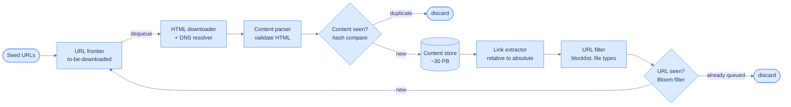

# 53. Web crawler

## TL;DR
> A web crawler (a "bot" or "spider") starts from a handful of **seed URLs**, downloads each page, extracts its links, and follows them — a **breadth-first traversal of the web modeled as a directed graph** (pages are nodes, hyperlinks are edges; BFS, not DFS, because DFS dives arbitrarily deep down one path). The single most important component is the **URL frontier**: the queue of URLs-still-to-download, but a queue that has to do three jobs at once — **politeness** (never hammer one host: a back-queue *per host* with one worker and a delay between hits), **priority** (crawl the Apple home page before a random forum post about Apple — front queues weighted by PageRank/traffic/freshness), and **freshness** (recrawl changed pages, important ones more often). Two cheap-but-essential dedup gates keep it from drowning: **content-seen** compares page *hashes* (≈29% of the web is duplicate content) so the same body isn't stored twice, and **URL-seen** uses a **[Bloom filter](/cortex/system-design/storage-and-search/probabilistic-data-structures)** to answer "have I queued this link before?" in ~10 bits/URL without keeping every URL in RAM — its one-sided error (false positives possible, false negatives *impossible*) is exactly the safe direction. The web is hostile, so robustness *is* the design: obey **`robots.txt`** (cached per host), cap URL length to escape **spider traps** (`/foo/bar/foo/bar/…` to infinity), short-timeout dead hosts, and validate malformed HTML. At scale it's **1 billion pages/month ≈ 400 pages/s** (800 peak) and **~30 PB over five years**; you go distributed by partitioning the URL space across stateless crawler servers (consistent hashing), with a **cached DNS resolver** as the surprise bottleneck. This is the capstone where *throughput, politeness, and not-getting-trapped* collide.

## 1. Motivation

Type a query into Google and you get an answer in 200 milliseconds — but Google didn't read the web when you hit enter. It read the web *months and years ago*, continuously, and what you actually queried was an **index** built by a fleet of bots crawling page after page, link after link, around the clock. That bot — **Googlebot** — is a web crawler, and a crawler is the unglamorous machine that makes the entire searchable web *exist as data you can query*. No crawl, no index; no index, no search.

And search is only the most famous customer. The **Internet Archive's** Wayback Machine has crawled and preserved *hundreds of billions* of page snapshots so that a 2009 blog post, a defunct news site, a deleted government page can still be read a decade later — web archiving as a hedge against link-rot, the same forever-promise the [URL shortener](/cortex/system-design/capstones/url-shortener) makes, but for the *whole web at once*. National libraries run crawlers to archive their domains; financial firms crawl annual reports and shareholder filings to mine signals; brand-protection services crawl to hunt pirated content and trademark abuse. And in the last few years a new and enormous consumer arrived: **the training-data scrape** — the corpora behind large language models are, at bottom, the output of web crawlers run at planetary scale (Common Crawl alone publishes *petabytes* of crawled pages every month).

That range is exactly why the web crawler is a capstone-worthy design. On the surface the algorithm fits on a napkin — "download a page, extract its links, repeat" — and you could write a toy in an afternoon. Underneath, it forces nearly every theme this book has built toward, but bent in a direction the other capstones never test: this is a system whose hardest problems come from the **adversarial, infinite, badly-behaved environment it runs against**. It must be *polite* (or it becomes a DDoS attack and gets your IPs banned), it must be *robust* (the web is full of traps, dead hosts, and malformed HTML designed by no one to be parsed), it must *not crawl the same thing twice* (≈29% of pages are duplicates), and it must do all of this at **hundreds of pages per second across thousands of machines**. It exercises [queues](/cortex/system-design/distributed-patterns/message-queues-and-streams), [probabilistic data structures](/cortex/system-design/storage-and-search/probabilistic-data-structures), [sharding](/cortex/system-design/building-blocks/sharding-and-partitioning), and graph traversal all at once — and unlike the URL shortener, the central data structure (the frontier) is genuinely *novel*, not a key-value store wearing a costume. Let's build it.

This capstone follows the same arc as the rest of Part 7: pin the **requirements**, do the **back-of-envelope estimation**, sketch the **architecture**, then go deep on the **one component that is the design** (here, the URL frontier), the **dedup** gates, the **edge cases** that separate a toy from a system, the **trade-offs**, and an illustrative **prototype**.

## Try it with the coach

Before you read the design, work through it yourself. The coach runs the same six-step interview — restate the problem, estimate, choose an approach, plan it, sketch the implementation, then stress-test it — and pushes back at each gate. There's no code editor here; you reason in prose, the way you would at a whiteboard. (Sign in to start; your conversation is kept in your browser as you go.)

<div class="concept-coach"></div>

## 2. Requirements and scope

As always, pin *what* before *how* — and for a crawler the "what" is dominated less by features than by **four qualities** that every design decision below serves.

**Functional:**
- **Crawl:** given a set of **seed URLs**, download the pages they address, extract the links, and keep going — a breadth-first sweep outward across the web graph.
- **Store:** persist the crawled HTML (here, for **5 years**) so an index, an archive, or a training pipeline can consume it.
- **Recrawl:** revisit pages so the data set stays fresh as the web changes (new pages, edits, deletions).
- *Out of scope for the core design (but noted):* the indexing/ranking pipeline itself, JavaScript rendering, and the anti-spam classifier — we'll mark where each hooks in.

**The four qualities that drive everything (non-functional):**
- **Scalability.** The web is *billions* of pages. The crawl must parallelize across many machines and threads — a single-threaded crawler would never finish.
- **Politeness.** A crawler must **not flood any one host**. Fire thousands of requests/second at one site and you're indistinguishable from a denial-of-service attack — you'll be rate-limited, IP-banned, or sued. This single constraint reshapes the frontier (§5).
- **Robustness.** The web is *hostile by default*: malformed HTML, unresponsive servers, redirect loops, malicious links, and deliberate **traps**. The crawler must survive all of it without crashing or getting stuck.
- **Extensibility.** Today HTML; tomorrow images, PDFs, video. New content types should plug in as modules, not force a rewrite.

**Assumptions we'll pin (clarify these with an interviewer — they change the numbers):** search-engine indexing is the use case; **HTML only**; we *do* recrawl changed pages; we store pages for 5 years; duplicate content is ignored.

## 3. Back-of-envelope estimation

Numbers first ([estimation](/cortex/system-design/foundations/back-of-envelope-estimation)) — they decide how many machines, how big the storage tier, and how large the URL-seen filter has to be. Assume **1 billion pages crawled per month** and an **average page size of 500 KB**.

| Quantity | Calculation | Result |
|---|---|---|
| Download rate (avg) | 1B ÷ 30 days ÷ 86,400 s | **~400 pages/s** |
| Download rate (peak ~2×) | — | **~800 pages/s** |
| Storage per month | 1B × 500 KB | **~500 TB/month** |
| Storage over 5 years | 500 TB × 12 × 5 | **~30 PB** |
| URL-seen filter (5 yr of URLs) | ~60B URLs × ~10 bits (1% FP) | **~75 GB** |

Three of those numbers settle real decisions. **~400 pages/s** sounds modest until you remember the *politeness* ceiling: you cannot get there by pounding a few big sites — you must crawl *thousands of hosts concurrently, gently*, which is precisely the problem the frontier solves (§5). **~30 PB** is unambiguously "big data" — it lives on disk across a sharded, replicated [object/blob store](/cortex/system-design/capstones/distributed-file-storage), not in any database you'd reach for casually. And the **URL-seen filter** is the quiet one: over five years you'll encounter on the order of *tens of billions* of distinct URLs, and you must remember every one to avoid re-crawling — but storing 60 billion full URLs (each ~100+ bytes) would cost *terabytes of RAM*. A **[Bloom filter](/cortex/system-design/storage-and-search/probabilistic-data-structures)** at DDIA's rule-of-thumb **~10 bits per key for a 1% false-positive rate** shrinks that to ~75 GB — a number that *fits*, and the reason §6 reaches for a probabilistic structure instead of a hash set.

## 4. The crawl loop, and why BFS

Strip away the machinery and the algorithm is three steps on a loop:

1. Take a URL off the **frontier** (the to-be-downloaded queue).
2. **Download** the page, **parse** it, **store** it (if it's new), and **extract** its links.
3. **Filter** those links, drop the ones you've **seen**, and put the rest back on the frontier. Repeat.

The mental model that makes this precise: **the web is a directed graph** — every page is a node, every hyperlink is a directed edge — and crawling is just *traversing that graph* outward from the seeds. Which immediately raises the classic question: **DFS or BFS?**

**Use BFS** (a FIFO queue), not DFS. DFS follows one link, then a link on *that* page, then a link on *that* one — diving arbitrarily deep down a single path before ever coming back. On the web that depth can be effectively unbounded (think pagination: page 1 → page 2 → … → page 50,000), so DFS gets *lost* down a single site and starves the breadth of the crawl. BFS fans out level by level, which both bounds how deep any one path goes and naturally spreads attention across many sites — the behavior you want.



But that plain FIFO queue, taken literally, breaks *both* politeness and priority — and fixing those two breakages is the entire deep dive. **Politeness:** most links on a page point *back to the same host* (every Wikipedia article is wall-to-wall internal links), so a naive FIFO fills up with thousands of URLs from one domain and the downloader, working in parallel, *floods that one server*. **Priority:** a plain FIFO treats a viral, authoritative home page and a junk forum comment as equals, crawling them in arrival order — but they are emphatically *not* of equal value. The structure that fixes both is the URL frontier.

## 5. The URL frontier (the heart of the design)

The frontier is "the queue of URLs to crawl," but calling it a queue undersells it the way calling a heart "a pump" undersells it. It is the component where **politeness, priority, and freshness** are all enforced, and getting it right is most of getting the crawler right. (At scale it's backed by a real durable [queue/log](/cortex/system-design/distributed-patterns/message-queues-and-streams) — hundreds of millions of URLs, far too many for memory.) The canonical design is **two banks of queues**: *front queues* for priority, *back queues* for politeness.

```d2
direction: down
prioritizer: Prioritizer (PageRank / traffic / freshness) { shape: hexagon }

front: Front queues — priority {
  f1: f1 (high)
  f2: f2 (...)
  fn: fn (low)
}
fsel: Front-queue selector (biased random) { shape: diamond }

back: Back queues — one per host (politeness) {
  b1: "b1 → host A" { shape: queue }
  b2: "b2 → host B" { shape: queue }
  bn: "bn → host Z" { shape: queue }
}
maptable: Host -> back-queue table { shape: cylinder }
bsel: Back-queue selector (+ per-host delay) { shape: diamond }

w: Worker threads {
  w1: worker 1
  w2: worker 2
  wn: worker N
}

prioritizer -> front.f1
prioritizer -> front.f2
prioritizer -> front.fn
front.f1 -> fsel
front.f2 -> fsel
front.fn -> fsel
fsel -> maptable: "route by host"
maptable -> back.b1
maptable -> back.b2
maptable -> back.bn
back.b1 -> bsel
back.b2 -> bsel
back.bn -> bsel
bsel -> w.w1: "host A only"
bsel -> w.w2: "host B only"
bsel -> w.wn: "host Z only"
```

**Politeness — the back queues.** The rule is simple to state and subtle to enforce: *download at most one page at a time from any given host, with a delay between hits.* The mechanism: maintain **one FIFO back-queue per host**, a **mapping table** from hostname → its queue, and a pool of **worker threads where each worker is bound to exactly one back-queue** (one host). A worker pulls a URL, downloads it, then **sleeps a politeness delay** (say 1–2 seconds, or a multiple of the host's observed response time) before pulling the next. Because each host is served by a single serialized worker, you can be crawling *ten thousand hosts in parallel* and still never send host A two overlapping requests. That's the trick that reconciles "be fast" with "be gentle": parallelism *across* hosts, strict seriality *within* a host. (Many crawlers also honor a `Crawl-delay` directive from the host's `robots.txt`, §7.)

**Priority — the front queues.** Not all pages deserve equal urgency. A random post in a discussion forum about Apple products carries far less weight than the Apple home page, even though both shout "Apple." So a **prioritizer** scores each URL — by **PageRank**, by site traffic, by how often the page changes — and drops it into one of several **front queues**, each tagged with a priority level. A **front-queue selector** then picks the next URL with a *bias toward high-priority queues* (sample randomly but weight the important queues higher, so the good stuff is crawled first *without* starving the long tail entirely). The output of the front bank feeds the back bank: **priority decides *what's next*, politeness decides *how it's paced* per host.**

**Freshness — recrawl.** The web isn't static; pages are added, edited, deleted. A crawl that never revisits goes stale. But blindly recrawling *everything* on a fixed cycle is hugely wasteful — most pages rarely change. The strategy is **adaptive**: recrawl based on a page's *observed* update history (a news front page every few minutes, a 2011 PDF maybe never), and prioritize recrawling *important* pages more often. Freshness folds straight back into the prioritizer — "this page is due for a refresh" is just another input that raises a URL's priority and re-enqueues it.

**Where it lives.** A real frontier holds *hundreds of millions* of URLs — too many for RAM, too slow if every enqueue/dequeue hits disk. The pragmatic answer is **hybrid storage**: the bulk of the queue lives **on disk** (so size is no object), with **in-memory buffers** for the hot enqueue/dequeue ends that are flushed to disk periodically. You get memory speed on the active edge and disk capacity for the depth.

## 6. Dedup: content-seen and URL-seen

A crawler that doesn't dedup drowns. Two *different* gates, guarding two *different* kinds of duplication — and conflating them is a classic mistake.

**Content-seen — "have I stored this page *body* before?"** Studies put roughly **29% of the web at duplicate content**: mirror sites, syndicated articles, the same product description under a dozen URLs, `http`/`https` doubles, with/without trailing slash. Store all of that and you waste ~30% of your 30 PB and pollute the index. The fix is a **content fingerprint**: hash the (normalized) page body — MD5, or a [Rabin fingerprint](/cortex/system-design/storage-and-search/search-systems) — and keep the hashes in a set. Before storing a freshly downloaded page, hash it; if the hash is already present, the body is a duplicate (different URL, same content) → **discard it, and don't bother extracting its links again**. Comparing 64- or 128-bit hashes is millions of times cheaper than comparing HTML byte-by-byte across billions of pages. (A refinement, **SimHash / near-duplicate detection**, catches pages that are *almost* identical — same article with a different ad rail — but exact-hash is the baseline.)

**URL-seen — "have I already queued this *link*?"** Pages link to each other in dense cycles — A links to B links back to A — so without a memory of visited URLs the crawler would loop forever and re-enqueue the same links endlessly, multiplying load and looping infinitely. So every extracted link is checked against the set of URLs *already crawled or already in the frontier*; only genuinely new ones are enqueued. The catch is the §3 number: *tens of billions* of distinct URLs over the crawl's life. A plain hash set of full URL strings would cost **terabytes of RAM** — unaffordable.

This is the textbook case for a **[Bloom filter](/cortex/system-design/storage-and-search/probabilistic-data-structures)**. A Bloom filter is a probabilistic membership test: at **~10 bits per URL** it answers "have I seen this?" with a **1% false-positive rate** — shrinking ~60 billion URLs from terabytes to **~75 GB**. The crucial property is the *direction* of its one-sided error, and it points exactly the safe way: per DDIA's framing of Bloom filters, **"if at least one of the bits is 0, the key definitely does not appear"** — so a *negative is exact* (no false negatives) and only a *positive can be wrong*. Translated to crawling: a Bloom-filter "no" means **definitely new — safe to crawl**; a "yes" means **probably already seen — skip it**. The only cost of the 1% false positives is occasionally skipping a genuinely-new URL you mistook for seen — a tiny, *bounded* loss of coverage, never the catastrophe of an infinite re-crawl loop or storing a page twice. You trade a sliver of completeness for a ~50× memory saving, and the error never falls on the dangerous side. (Crawlers that need *exact* URL-seen back the Bloom filter with an on-disk hash table consulted only on a "yes," paying a disk read to confirm — the same "filter in RAM, truth on disk" pattern LSM engines use.)

## 7. Edge cases and failure modes

The web is adversarial, and for a crawler **robustness *is* the feature** — the difference between a script that works on `example.com` and a system that survives the open web is almost entirely this list.

- **`robots.txt` — ask permission first.** The Robots Exclusion Protocol lets a site tell crawlers which paths are off-limits (`Disallow: /private/*`) and how slowly to crawl (`Crawl-delay`). A well-behaved crawler **fetches `/robots.txt` before crawling a host and obeys it** — ignoring it is rude, often a terms-of-service violation, and a fast track to a permanent IP ban. Since you'll check it on *every* URL for a host, **cache the parsed `robots.txt` per host** (refreshed periodically) rather than re-downloading it each time.
- **Spider traps (infinite spaces).** A *spider trap* is a page — sometimes accidental, sometimes deliberate — that generates an endless chain of links and lures a crawler into an infinite loop. The canonical shape is an infinitely deep directory: `spidertrap.com/foo/bar/foo/bar/foo/bar/…`, or a calendar with a "next month" link going to the year 9999, or faceted-search URLs that combine filters into a combinatorial explosion. There's **no perfect automatic detector**, but cheap defenses go far: **cap URL length** and **cap crawl depth** per host, watch for hosts emitting an *absurd* number of pages (a strong trap signal), and let an operator blocklist confirmed traps or add custom URL filters. The point isn't to never get trapped — it's to **bound the damage** so one trap can't consume the whole crawl.
- **Duplicate content (the other 29%).** Covered in §6, but worth restating as a failure mode: without **content-seen** hashing, mirror sites and syndicated pages silently bloat storage by ~30% and flood the link graph with re-discovered duplicates. The hash check is what keeps the crawl from doing a third of its work for nothing.
- **Dead and slow hosts — short timeouts.** Some servers respond in 50 ms; some take 30 seconds; some never respond. Without a ceiling, a handful of comatose hosts tie up worker threads indefinitely and throttle the whole crawl. Enforce an **aggressive per-request timeout**: if a host doesn't answer in, say, a couple of seconds, **abandon that URL and move on** (optionally requeue it later with backoff). Better to skip one slow page than stall a worker.
- **Malformed HTML and noise.** A lot of the web is broken — unclosed tags, invalid encodings, binary masquerading as HTML. The **content parser is a separate component** (not inlined in the downloader) precisely so it can validate defensively and fail one bad page without crashing the crawler, and so parsing CPU doesn't block network I/O. Pages that are pure noise — ad farms, link spam, near-empty stubs — are candidates for an **anti-spam filter** to drop before they waste storage.
- **JavaScript-rendered links.** Many modern sites build their links *client-side* with JavaScript/AJAX, so a crawler that only fetches raw HTML sees an empty shell and misses the real links. The fix is **server-side / dynamic rendering** — run the page through a headless browser to execute its scripts *before* parsing — at a real CPU cost, so it's applied selectively, not to every page.
- **The DNS resolver is a sneaky bottleneck.** Every download needs a hostname → IP lookup, and DNS responses run **10–200 ms** and are often *synchronous* — fast enough to throttle a crawler doing 400+ pages/s, because threads block waiting on the resolver. The fix is a **local DNS cache** (hostname → IP, refreshed by a periodic job) so the vast majority of lookups never leave your network. It's the classic "the slow part isn't the part you expected" lesson — the crawler's throughput ceiling is often DNS, not bandwidth.

## 8. Going distributed (the 100× view)

At 400 pages/s, one beefy machine struggles; at web scale you need **hundreds or thousands**. The capstone question: how do you spread the crawler out — and what bends?

- **Partition the URL space across stateless crawler servers.** Split the web among many crawler nodes, each owning a **subset of URLs**, each running many threads. Assign URLs (typically by **hostname**) to nodes with **consistent hashing** so adding or removing a server only remaps a slice of the space, not all of it ([sharding](/cortex/system-design/building-blocks/sharding-and-partitioning)). Keep the crawler servers **stateless** — all durable state (frontier, seen-sets, content) lives in shared stores — so any node can die and be replaced, and you scale by adding boxes.
- **Politeness becomes a *coordination* problem.** Per-host serialization (§5) is trivial on one machine and *hard* across a fleet: if two different nodes both hold URLs for `host A`, they can flood it *together* even though each is individually polite. The fix falls straight out of partitioning by host — **route every URL for a given host to the same node** (consistent-hash on hostname), so that one node owns A's back-queue and remains the single serialized gatekeeper for A. Host-affinity sharding *is* distributed politeness.
- **A hot host is a hot key — and sharding alone won't fix it.** Here the crawler hits the same wall DDIA names for any partitioned store: consistent hashing spreads *data* evenly but not *load*, and a single enormous host (think a site with hundreds of millions of pages) is a **hot key** that piles onto one node. DDIA's standard escape — append a random suffix to split the key across shards — *doesn't apply cleanly here*, because splitting one host across nodes would **re-break politeness** (now several nodes crawl A in parallel). So the crawler accepts the asymmetry: a giant host is *inherently* rate-limited by politeness, so you let it drain slowly on its one owning node rather than trying to parallelize it. The constraint that makes the crawler safe (one host, one gatekeeper) is the very thing that caps its peak throughput on any single host.
- **Save state so a crash is resumable.** A crawl runs for *weeks*. Checkpoint the **frontier and seen-sets** to durable storage so a node (or the whole fleet) can crash and **restart from the last checkpoint** instead of re-crawling from the seeds. Combined with statelessness, this is what makes a multi-week, thousand-machine crawl operationally survivable.
- **Storage replicates and shards.** ~30 PB → far more at sustained scale; the content store is a **sharded, replicated** [blob/object store](/cortex/system-design/capstones/distributed-file-storage), with hot/popular pages cached in memory and the cold archive on disk.
- **Locality.** Put crawler servers, caches, and queues *geographically near* the hosts they crawl (and near each other) — shorter round-trips mean higher throughput. The same locality principle applies to every tier.

The throughline: a crawler scales by **partitioning the URL space by host** — which simultaneously gives you parallelism, distributed politeness, and clean rebalancing — while accepting that a single hot host is throughput-capped *by design*, because politeness is a constraint you never relax.

## 9. Trade-offs

| Decision | Option | Why |
|---|---|---|
| Traversal | **BFS (FIFO frontier)** vs DFS | DFS dives unbounded-deep down one path and starves breadth; BFS fans out level-by-level and spreads load across hosts |
| Politeness | **Back-queue per host + delay** vs global rate limit | per-host serialization lets you crawl thousands of hosts in parallel while never overlapping requests to any one — a global limit can't target the offending host |
| URL-seen | **Bloom filter** vs exact hash set | ~10 bits/URL (~75 GB) vs terabytes of RAM; the one-sided error is safe — a "no" is exact, only a "yes" can be wrong, so you never loop, you only rarely skip |
| Content dedup | **Hash/fingerprint compare** vs byte-by-byte | hashing 64–128 bits is millions of times cheaper than comparing HTML across billions of pages; catches the ~29% duplicate web |
| Distribution | **Partition by host (consistent hashing)** vs partition by URL | host-affinity makes politeness enforceable across the fleet (one host → one gatekeeper) and rebalances cleanly; per-URL splitting re-breaks politeness |
| DNS | **Local DNS cache** vs resolve every time | synchronous 10–200 ms lookups throttle a 400 pages/s crawler; caching removes the hidden bottleneck |

## 10. Build It

An illustrative prototype (not a production crawler): the crawl loop with a per-host politeness frontier, a content-seen hash set, and a Bloom-filter-style URL-seen gate. It makes the core decisions concrete — BFS ordering, per-host serialization, and the two dedup checks.

```python
import time, hashlib
from collections import defaultdict, deque
from urllib.parse import urlparse

class Frontier:
    """BFS order, but one back-queue per host with a politeness delay."""
    def __init__(self, delay=1.0):
        self.queues = defaultdict(deque)          # host -> FIFO of URLs (back queues)
        self.next_ok = defaultdict(float)         # host -> earliest next-fetch time
        self.delay = delay

    def add(self, url):
        self.queues[urlparse(url).netloc].append(url)   # route URL to its host's queue

    def next(self):
        now = time.time()
        for host, q in self.queues.items():
            if q and now >= self.next_ok[host]:    # this host is due and not in cooldown
                self.next_ok[host] = now + self.delay   # serialize: one fetch per host per delay
                return q.popleft()
        return None                                # nothing crawlable right now

class Crawler:
    def __init__(self, frontier, seen_urls, download, parse_links):
        self.frontier = frontier
        self.seen_urls = seen_urls                 # Bloom-filter-like: "definitely new" vs "maybe seen"
        self.seen_content = set()                  # content-seen: hashes of stored page bodies
        self.download, self.parse_links = download, parse_links

    def crawl_one(self):
        url = self.frontier.next()
        if url is None:
            return
        body = self.download(url)                   # HTTP GET (real code: timeout + robots.txt check)
        digest = hashlib.md5(body).hexdigest()
        if digest in self.seen_content:            # CONTENT-SEEN: same body under a different URL
            return                                 # duplicate page -> discard, don't re-extract links
        self.seen_content.add(digest)
        store(url, body)                           # persist to the ~30 PB content store
        for link in self.parse_links(body, base=url):       # relative -> absolute
            if link not in self.seen_urls:         # URL-SEEN: "no" is exact -> definitely new
                self.seen_urls.add(link)           # mark before enqueue so cycles don't re-add it
                self.frontier.add(link)            # genuinely-new link -> back onto the frontier
```

The shape *is* the lesson: `Frontier.next()` enforces **politeness** by never returning a URL for a host that's still in its cooldown (one fetch per host per delay) while pulling from *other* hosts in the meantime — parallelism across hosts, seriality within one. `crawl_one` runs the **two dedup gates** in the right order: content-seen *before* storing (so duplicate bodies cost nothing and don't get re-parsed), URL-seen *before* enqueuing (so cycles can't loop). Swap the `set`s for a real durable queue and a real Bloom filter (§6), add `robots.txt` and timeouts (§7), shard by host across stateless workers (§8), and you have the skeleton of a system that crawls the open web without melting it.

## 11. Practice

> **Exercise 1 — Size the seen-set.**
> You expect to encounter **40 billion** distinct URLs over the crawl's life and want a **1% false-positive rate** on the URL-seen check. Estimate the memory for (a) a hash set storing full URLs (avg 100 bytes each) versus (b) a Bloom filter, and explain why the Bloom filter's error is *safe* for this use.
>
> <details>
> <summary>Solution</summary>
>
> **(a) Hash set:** 40B × 100 bytes = **4 TB** just for the URL strings (more with pointer/bucket overhead) — far too much RAM. **(b) Bloom filter:** the rule of thumb is **~10 bits per key for a 1% false-positive rate**, so 40B × 10 bits = 400 Gbit ÷ 8 = **~50 GB** — a ~80× saving that actually *fits*. The error is safe because a Bloom filter has **no false negatives**: a "not present" answer is *exact*, so it never tells you a genuinely-new URL is already seen-and-skippable… wait — it's the other direction that matters here. A "present" answer *can* be a false positive, meaning you occasionally treat a brand-new URL as already-seen and **skip it** — a tiny (~1%), bounded loss of crawl *coverage*. What you never get is the dangerous error: a "not present" is guaranteed correct, so you'll **never re-enqueue a URL you've already crawled**, which is what would cause infinite loops and wasted load. You trade a sliver of completeness for a huge memory win, and the error falls on the harmless side.
>
> </details>

> **Exercise 2 — Why per-host queues, not one global queue?**
> A teammate proposes a single global FIFO frontier with a global rate limit of 400 requests/second across all worker threads. Why does this break politeness, and how do per-host back-queues fix it?
>
> <details>
> <summary>Solution</summary>
>
> A **global** FIFO fills up with whatever links the crawler just extracted — and since most links on a page point back to the *same host*, a global queue can easily hold thousands of consecutive URLs for **one domain**. A global 400 req/s limit says nothing about *which* host those requests hit, so the crawler can legitimately fire all 400 req/s at a **single** site — a denial-of-service attack that gets you rate-limited or IP-banned, even though you're "within budget" overall. **Per-host back-queues** fix this by binding each host to **one serialized worker** that sleeps a politeness delay between fetches: host A is touched at most once per delay *no matter how many of A's URLs are queued*, while other workers crawl other hosts concurrently. The result is the property you actually want — **parallelism across hosts, seriality within a host** — which a single global queue with a global limit structurally cannot express.
>
> </details>

> **Exercise 3 — A trap and a hot host.**
> Mid-crawl, one host starts returning millions of pages at URLs like `site.com/cal/2031/01/02/next/next/next/…`, and your crawl slows to a standstill. What's happening, what two cheap defenses bound the damage, and why doesn't DDIA's "split the hot key with a random suffix" trick apply?
>
> <details>
> <summary>Solution</summary>
>
> That's a **spider trap** — an infinite (or near-infinite) generated space (here a calendar whose "next" link never ends), and because every URL belongs to **one host**, it's *also* a **hot key** piling all its load onto the single node that owns that host. **Two cheap defenses:** (1) **cap URL length and/or crawl depth** so the trap's endlessly-lengthening paths get filtered out automatically, and (2) **watch for hosts emitting an absurd number of pages** and blocklist or apply a custom filter to the offending site. **Why DDIA's random-suffix split doesn't apply:** that trick relieves a hot key by spreading it across many shards — but for a crawler, spreading one *host* across multiple nodes would put several workers on that host *in parallel*, which **re-breaks politeness** (the very thing host-affinity sharding exists to guarantee). So the crawler accepts that a hot host is throughput-capped by design — it drains slowly on its one owning node — and relies on trap detection, not parallelization, to keep it from starving the rest of the crawl.
>
> </details>

## In the Wild

- **[Mercator: A Scalable, Extensible Web Crawler](https://www.cs.cornell.edu/courses/cs685/2002fa/mercator.pdf)** (Heydon & Najork, 1999) — the foundational paper this design descends from; it introduced the URL-frontier-centric architecture, the per-host politeness queues, and the "seen" tests that every modern crawler still uses.
- **[The PageRank Citation Ranking](http://ilpubs.stanford.edu:8090/422/1/1999-66.pdf)** (Page, Brin, Motwani & Winograd, 1998) — the original Google paper behind the §5 *priority* signal: crawl authoritative, high-PageRank pages first, not in arrival order.
- **[Bloom, "Space/time trade-offs in hash coding with allowable errors"](https://dl.acm.org/doi/10.1145/362686.362692)** (CACM, 1970) — the Bloom filter itself, the structure that makes the §6 URL-seen check fit in ~75 GB instead of terabytes; its one-sided error is exactly the safe direction for crawling.
- **[Common Crawl](https://commoncrawl.org/)** — an open, monthly, *petabyte-scale* crawl of the web, free to download; the de-facto public example of this whole design running at planetary scale and a primary feedstock for training-data corpora.
- **[Google — Robots Exclusion Protocol (robots.txt)](https://developers.google.com/search/docs/crawling-indexing/robots/intro)** — the authoritative reference for the §7 politeness contract every well-behaved crawler must obey before fetching a host.
- **["System Design Interview" (Alex Xu, vol. 1, ch. 9)](https://www.amazon.com/System-Design-Interview-insiders-Second/dp/B08CMF2CQF) / [Designing Data-Intensive Applications, 2e](https://dataintensive.net/)** — the canonical written walk-through of the crawler (frontier, dedup, traps) and the distributed-systems grounding for the §6 Bloom-filter semantics and §8 hot-key/sharding analysis.

---

> **Next:** [54. Notification system](/cortex/system-design/capstones/notification-system) — the crawler *pulled* data from the world on its own schedule; a notification system is the mirror image — it *pushes* millions of messages a day out to users across three wildly different channels (mobile push, SMS, email), each with its own third-party gateway, failure mode, and delivery guarantee. The central problems flip from politeness-and-traps to **fan-out, retries, rate-limiting per provider, and "did it actually get delivered?"** — where [idempotency](/cortex/system-design/distributed-patterns/idempotency-retries-backoff), [queues](/cortex/system-design/distributed-patterns/message-queues-and-streams), and user opt-out preferences collide.
