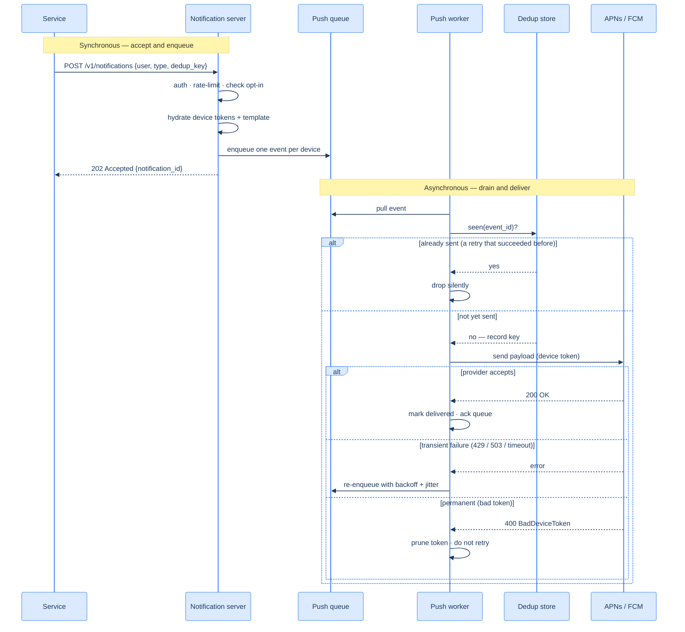

# 54. Notification system

## TL;DR
> A notification system takes **one trigger** ("your package ships tomorrow") and **fans it out** across three very different channels — **push** (iOS via **APNs**, Android via **FCM**), **SMS** (via a provider like **Twilio**), and **email** (via **SendGrid/SES**) — to whichever devices and addresses a user has registered. It is a [pub/sub fan-out](/cortex/system-design/distributed-patterns/pubsub-and-fanout) problem with a cruel twist the URL shortener never faced: **the destination is someone else's server.** You don't deliver the push; APNs does. You don't deliver the SMS; Twilio does. So the whole architecture is built around **decoupling from flaky third parties** with a **message queue per channel** (an outage at Twilio must not back up your email), **workers** that translate your internal event into each provider's payload, and a **retry-with-backoff** loop for the providers that are down right now. The single hardest decision is **delivery semantics**: true exactly-once is impossible across a boundary you don't control (the provider can succeed and *then* your acknowledgment is lost — DDIA's point), so you do **at-least-once delivery plus a dedup key** to get *effectively*-once and spare users the 3 a.m. duplicate-push storm. Around that core sit the things that make it humane and safe: a **template store** (don't hand-build a million emails), a **preference/opt-out store** checked *before* every send, and **rate limiting** so you don't become the app people mute. The throughline: you are an **orchestrator of unreliable downstreams**, and every design choice — queues, dedup, retries, preferences — exists to make an unreliable delivery *feel* reliable to the person holding the phone. This is also the capstone arc itself: requirements → estimation → API → architecture (D2 topology + a Mermaid send/retry/dedup sequence) → deep dives → edge cases → trade-offs → prototype.

## 1. Motivation

Picture the on-call engineer's worst Tuesday. A marketing job that *should* have sent one push — "Flash sale, 20% off, ends tonight" — sends it **nine times** to four million phones over the course of an hour. The job had timed out partway through, a retry kicked in, the retry *also* timed out (the system was slow precisely *because* it was re-sending), and the loop fed itself. By the time someone kills it, the app store reviews are already arriving — "uninstalling, this app spams me" — and a measurable slice of users have flipped the OS-level toggle that says *never let this app notify me again*. That toggle is the nightmare, because **it's nearly irreversible**: you cannot send a push asking someone to please re-enable push. The duplicate-send didn't just annoy people; it **permanently destroyed a channel** to them.

That is the whole tension of a notification system in one story. On the surface it's trivial — "send a message to a user." Underneath, it is the most **unforgiving fan-out in this book**, for one reason: *the delivery happens on a server you don't own.* When the URL shortener (Lesson 42) returned a `302`, it could see the result. When this system hands a payload to APNs, it gets back an acknowledgment that the *request was accepted* — not that the phone buzzed. The side effect you caused is invisible to you. And the moment you build a retry loop to cope with the providers that genuinely *do* fail, you've created the exact machine that produced the nine-push storm: a system that, under stress, sends *more*. Reliability and duplication are two faces of the same coin, and threading that needle is the design.

So the notification system forces a specific cluster of this book's ideas. It's a fan-out, so you reach for [pub/sub and message queues](/cortex/system-design/distributed-patterns/pubsub-and-fanout). The downstreams are flaky and you must retry without doubling sends, so you reach for [idempotency, retries, and backoff](/cortex/system-design/distributed-patterns/idempotency-retries-backoff). Users will mute you if you over-send, so you reach for [rate limiting](/cortex/system-design/distributed-patterns/rate-limiting). And you can never have true exactly-once across a boundary you don't control, so you reach for the *effectively*-once trick — at-least-once plus a dedup key — that DDIA spells out. Small enough to hold in your head, rich enough to exercise the whole toolkit. Let's build it.

## Try it with the coach

Before you read the design, work through it yourself. The coach runs the same six-step interview — restate the problem, estimate, choose an approach, plan it, sketch the implementation, then stress-test it — and pushes back at each gate. There's no code editor here; you reason in prose, the way you would at a whiteboard. (Sign in to start; your conversation is kept in your browser as you go.)

<div class="concept-coach"></div>

## 2. Requirements and scope

Pin down *what we're building* before *how*, because the "how" is dictated by a couple of numbers and one brutal constraint: **we don't own the last mile.**

**Functional:**
- **Send across three channels:** **push** (iOS → APNs, Android → FCM), **SMS** (Twilio/Nexmo), and **email** (SendGrid/SES). A single logical notification may fan out to *several* of these and to *several devices* (a user with a phone and a tablet gets the push on both).
- **Triggered two ways:** by a **client/service event** (a billing service: "payment failed") or by a **server-side schedule** (a daily-digest cron). Either way, some upstream calls our API.
- **Gather contact info:** when a user installs the app or signs up, we collect and store **device tokens** (for push), **phone numbers** (SMS), and **email addresses** — keyed so one user can own many devices.
- *Optional:* templates, per-user preferences/opt-out, click/open tracking.

**Non-functional (these drive the design):**
- **Soft real-time, not hard real-time.** A user should get the notification *as soon as possible*, but under heavy load a slight delay is acceptable. This is the crucial relaxation: it's what lets us put a **queue** in the middle and absorb spikes instead of dropping them. (A *hard* real-time guarantee would forbid the buffering that makes the whole design work.)
- **Never lose a notification.** Notifications may be **delayed or reordered, but not lost** — a missed "your flight gate changed" is a real-world failure. This pushes us to **persist before we send** and to **retry**.
- **Don't over-send.** Duplicate or excessive notifications are not a cosmetic bug; they make users **mute the channel forever** (§1). De-duplication and rate limiting are *correctness* requirements here, not nice-to-haves.
- **Respect opt-out.** A user who opted out of a channel must **never** receive on it — checked on the hot path of every send.
- **Decouple from flaky providers.** A Twilio outage must not stall push or email. Each channel is independently buffered and independently retried.

**Out of scope:** the upstream business logic that *decides* to notify (we expose an API and assume callers are authorized), the analytics pipeline itself (we'll note where it hooks in), and building our own APNs/FCM/SMTP — we integrate with commercial providers, which is what real systems do. Naming the boundary is part of the design.

## 3. Back-of-envelope estimation

Numbers first ([estimation](/cortex/system-design/foundations/back-of-envelope-estimation)) — they decide the queue throughput, the worker count, and how scary a fan-out spike is. Xu's walk-through assumes a tidy daily mix; we'll start there and then look at the number that actually hurts.

Assume a mature consumer app: **10 million push/day, 1 million SMS/day, 5 million email/day** — **~16 million notifications/day** in the steady state.

| Quantity | Calculation | Result |
|---|---|---|
| Avg send rate (all channels) | 16M ÷ 86,400 s | **~185 sends/s** |
| Push send rate (avg) | 10M ÷ 86,400 s | **~116 push/s** |
| Peak send rate (~5× — campaigns cluster) | 185 × 5 | **~925 sends/s** |
| Provider round-trip | typical APNs/FCM/SMTP call | **~10–100 ms** |
| In-flight workers needed at peak | 925/s × 0.1 s latency (Little's Law) | **~90+ concurrent sends** |

Two things in that table settle real decisions. First, **the average is a lie and the design must serve the peak.** 185 sends/s sounds trivial — but notifications don't arrive uniformly; they arrive in **fan-out storms**. A single trigger — "the live event just started" — can mean *one* API call that explodes into **millions** of individual sends in seconds. The steady-state rate tells you almost nothing about the burst, which is exactly why the queue exists: it **decouples the spiky arrival of triggers from the steady drain of workers** calling providers. Second, **the bottleneck is provider latency, not CPU.** Each send is mostly *waiting* on someone else's server (~10–100 ms), so by [Little's Law](/cortex/system-design/foundations/back-of-envelope-estimation) you need roughly `rate × latency` sends in flight — dozens-to-hundreds of concurrent I/O-bound workers per channel. That's a scale-out-the-workers problem, and it's why the worker tier autoscales off **queue depth** (§4), the one metric that directly says "providers can't keep up."

A useful sanity check on the "fan-out is the real load" point: a user with **3 devices** who is subscribed to push *and* email turns **one** logical notification into **4 provider calls**. Multiply that fan-out factor across an active base and the *send* rate easily runs several times the *notification* rate — the system's true unit of work is the **per-channel, per-device send**, not the trigger.

## 4. API and contact-info model

One internal endpoint, designed with the discipline from [Lesson 33](/cortex/system-design/application-architecture/api-design). Crucially, this API is **internal-only or for verified clients** — an open "send a notification" endpoint is a spammer's dream, so it's authenticated (an app-key/secret pair) and [rate-limited](/cortex/system-design/distributed-patterns/rate-limiting).

```
POST /v1/notifications        (internal / authenticated services only)
{
  "user_id": "u_8231",
  "type": "shipping_update",          // selects template + which channels apply
  "channels": ["push", "email"],      // optional override; else use user prefs
  "data": { "order_id": "A-913", "eta": "tomorrow" },
  "dedup_key": "ship-A-913"           // caller-supplied idempotency key (see §6)
}
  202 Accepted   {"notification_id": "n_5f3a", "status": "queued"}
  429 Too Many Requests              (caller exceeded its send quota)
```

Two things make this API correct rather than naive. It returns **`202 Accepted`, not `200 OK`** — the work is *accepted for asynchronous delivery*, not *done*; promising "sent" synchronously would be a lie, because the actual send happens later, in a worker, against a provider that might be down. And it carries a **`dedup_key`** — a caller-supplied idempotency key ([Lesson 19](/cortex/system-design/distributed-patterns/idempotency-retries-backoff)) so that a service which retries its *own* call after a timeout doesn't mint a second notification (the §6 mechanism leans on this).

**The contact-info model** is what fan-out reads from. When a user installs the app or signs up, the API collects their contact points and stores them so one user maps to many delivery targets:

| Table | Key fields | Purpose |
|---|---|---|
| `user` | `user_id`, `email`, `phone` | the addressable person; email + phone live here |
| `device` | `device_id`, `user_id`, `token`, `platform` (ios/android), `last_seen` | one row **per device** — a user with a phone + tablet has two; push fans out to all |
| `preference` | `user_id`, `channel`, `opt_in` (bool) | the opt-out gate, checked before every send (§6) |
| `template` | `template_id`, `channel`, `body`, `cta` | preformatted content with placeholders (§6) |

The `device` table is the heart of push fan-out: because **one user can have many devices**, a single push notification expands into one provider call *per registered token* — and stale tokens in this table are a whole edge case of their own (§8, token expiry).

## 5. High-level design

The system is a **pipeline of five stages**, read left to right: *upstream services* trigger notifications → *notification servers* validate, hydrate, and enqueue → a *per-channel message queue* buffers and decouples → *channel workers* translate and call out → *third-party providers* do the last-mile delivery. Topology (D2):

```d2
direction: right
services: "Services 1..N (billing, shipping, cron)"
lb: Load balancer
ns: "Notification servers (stateless)" { shape: rectangle }
store: "User / device / prefs / templates" { shape: cylinder }
dedup: "Dedup + notification log" { shape: cylinder }
qpush: "Push queue (iOS / Android)"
qsms: SMS queue
qemail: Email queue
wpush: Push workers
wsms: SMS workers
wemail: Email workers
apns: "APNs / FCM (push)"
twilio: "Twilio (SMS)"
sendgrid: "SendGrid / SES (email)"
devices: User devices

services -> lb: "POST /v1/notifications"
lb -> ns
ns -> store: "hydrate: tokens, prefs, template"
ns -> dedup: "check + record dedup_key"
ns -> qpush: "enqueue per channel"
ns -> qsms: "enqueue per channel"
ns -> qemail: "enqueue per channel"
qpush -> wpush
qsms -> wsms
qemail -> wemail
wpush -> apns: "build payload + send"
wsms -> twilio
wemail -> sendgrid
apns -> devices: "last-mile delivery"
twilio -> devices: "last-mile delivery"
sendgrid -> devices: "last-mile delivery"
```

Walk it stage by stage, because each stage exists to solve one specific problem the previous design couldn't:

- **Notification servers** are **stateless** and do the synchronous work: authenticate the caller, validate (is this a well-formed phone number / token?), **hydrate** the notification by fetching the user's devices, preferences, and the right template from the store, check the **dedup** record, and then *enqueue* — and return `202` immediately. They never call a provider directly; that would couple your API latency to Twilio's bad day.
- **A queue per channel** is the single most important structural decision. Why *per channel* and not one shared queue? Because **failure isolation**: if Twilio is down and SMS sends start backing up and retrying, a shared queue would let that backlog **starve** push and email behind it. Separate queues mean a provider outage degrades *only its own channel* — push keeps flowing while SMS waits ([pub/sub fan-out](/cortex/system-design/distributed-patterns/pubsub-and-fanout)). The queue also serves as the **shock absorber** for fan-out storms (§3): triggers arrive spiky, workers drain steady.
- **Channel workers** are the I/O-bound translators. A push worker takes the internal event and builds the *exact* JSON payload APNs or FCM expects (device token, payload, priority); an email worker renders the template to HTML and hands it to SendGrid. They are where **retry and backoff** live (§6), and they **autoscale off queue depth** — the deepest queue is the channel whose provider is slowest right now.
- **Third-party providers** own the last mile, which is the defining constraint of this whole system. You must design for **extensibility** (plug a new provider in without rewriting workers — FCM is unavailable in China, so you'll need a regional alternative there) and for the fact that **their acknowledgment is not delivery** (§6).

There's a parallel earlier design worth contrasting against, because it's the one candidates reach for first and it's *wrong* in an instructive way: a **single notification server** that does validation, rendering, *and* the provider calls inline. It fails three ways at once — it's a **single point of failure**, you **can't scale the pieces independently** (rendering HTML and waiting on SMTP have nothing in common, yet they're welded together), and a slow provider becomes a **head-of-line block** on everything. Moving the store and cache out, adding stateless server replicas, and inserting per-channel queues is precisely the fix — and it's the same "decouple with a queue" move that recurs across this book.

## 6. Deep dives

Four decisions separate a toy from a system: how you make delivery *feel* exactly-once, how you keep from over-sending, how content and consent are managed, and how you retry without melting down.

### 6.1 Reliability: at-least-once + a dedup key = *effectively*-once

This is the crux, so let's be precise about what is and isn't achievable. **You cannot guarantee true exactly-once delivery to a third-party provider.** DDIA makes the reason concrete: exactly-once across systems requires that *every* side effect participate in one atomic commit — but the act of sending an email or a push is a side effect on a server (SendGrid, APNs) that **does not** participate in your transaction. The classic failure: your worker calls Twilio, Twilio *successfully sends the SMS*, and then the acknowledgment back to your worker is **lost** (network blip, worker crash). Your worker, seeing no ack, does the only safe thing it can — it **retries** — and now the user gets two texts. The send succeeded; only your *knowledge* of it failed. No amount of cleverness on your side closes that gap, because the gap is on the *other* side of a boundary you don't own.

So you stop chasing the impossible and engineer the achievable: **at-least-once delivery** (always retry on uncertainty, so nothing is ever lost) **plus a dedup key** (so the near-inevitable duplicates are *suppressed*). This is DDIA's "effectively-once" pattern, and it's exactly the same idea as the idempotency-key trick from [Lesson 19](/cortex/system-design/distributed-patterns/idempotency-retries-backoff):

1. Every notification event carries a **unique key** — the caller's `dedup_key` for application-level intent, plus an internal `event_id` for each per-channel-per-device send.
2. Before sending, a worker checks a **dedup store** (a fast KV store / Redis with a uniqueness constraint): *have I already sent this key?* If yes, **drop it silently** — this is the retry that succeeded last time. If no, record the key and proceed.
3. Recording the key **first** is what makes the send idempotent: a retry after a lost ack finds the key already present and stops. (DDIA's subtlety: a uniqueness constraint on that key table is what makes two *concurrent* retries safe — only one insert wins.)

The throughline: **persist before you send, retry on doubt, dedup on the key.** Loss is prevented by retrying; duplication is prevented by the key. Neither alone is enough — at-least-once *without* a dedup key is the nine-push storm of §1; a dedup key *without* at-least-once would silently drop the very notifications you promised never to lose.

### 6.2 Rate limiting: protecting the user from you

Reliability prevents *losing* notifications; rate limiting prevents *sending too many*. These pull in opposite directions, and that tension is the point. There are two distinct limiters:

- **Per-caller (anti-spam):** the API enforces a quota on each upstream service ([rate limiting](/cortex/system-design/distributed-patterns/rate-limiting)) so a buggy or malicious caller can't fire a million sends — the `429` in §4. This is about protecting *the system*.
- **Per-user (anti-annoyance / frequency capping):** before a notification is queued, check "how many has this user already received this hour/day?" against a cap, and **suppress or batch** beyond it. This is about protecting *the relationship* — because the cost of over-notifying isn't server load, it's the user reaching for the mute toggle (§1). A token bucket per `(user_id, channel)` is the natural fit.

The subtle interaction with §6.1: rate limiting must run **before** dedup and enqueue, on the synchronous server path, so a suppressed notification never enters a queue it would later be retried out of.

### 6.3 Templates and the preference store

Two stores that keep the system humane and maintainable:

- **Template store.** A mature app sends millions of near-identical notifications ("Your order *[ITEM]* ships *[DATE]*"). Building each from scratch is wasteful and error-prone, so a **template** is a preformatted shell with placeholders — body, CTA, tracking links — that the worker fills with per-notification `data`. Benefits: consistent formatting, fewer bugs, and a single place to change copy. Templates are **cached** (they're read on every send and change rarely).
- **Preference / opt-out store.** Users drown in notifications, so give them **fine-grained control** — per-channel, per-type opt-in flags (`user_id, channel, opt_in`). The non-negotiable rule: **check preferences before every send.** A user who opted out of marketing push must have that notification dropped *before* it's queued. Get this wrong and you've not just annoyed someone — you may have violated a regulation (CAN-SPAM / GDPR consent), which is why opt-out is a correctness gate, not a feature.

### 6.4 Retry with backoff, and the dead-letter floor

When a provider call fails, the worker **re-enqueues** the event for another attempt — but *how* it retries decides whether you recover gracefully or amplify the outage. Naive immediate retries during a provider brownout create a **thundering herd** that keeps the provider down (and, combined with at-least-once, is the storm engine of §1). So:

- **Exponential backoff with jitter** ([Lesson 19](/cortex/system-design/distributed-patterns/idempotency-retries-backoff)): wait 1s, 2s, 4s, 8s… with randomization, so retries spread out instead of synchronizing into a wave.
- **A retry ceiling → dead-letter queue.** After N attempts, stop hammering and move the event to a **dead-letter queue** for inspection and **alert a developer**. A notification stuck retrying forever is worse than one that fails loudly. (Note: an SMS that's been retried past its usefulness — a "your code is 1234" that arrives an hour late — should be *dropped*, not delivered; time-sensitive notifications carry a TTL.)
- **Respect the provider's signal.** APNs/FCM/Twilio return distinct errors: a `429`/`503` means "back off and retry," but a `400 BadDeviceToken` means "this token is dead — *don't* retry, prune it" (§8). Retrying a permanent failure is pure waste.

The send + retry + dedup flow as a Mermaid sequence:



Note the two halves: the synchronous top (accept, gate, hydrate, enqueue, `202`) is fast and never touches a provider; the asynchronous bottom (dedup, send, branch on the provider's answer) is where reliability is actually won or lost.

## 7. Tracking and monitoring

You can't improve — or even trust — what you can't see, and "did it work?" is genuinely hard here because *delivery happens off your servers*. Two observability layers:

- **System health (queue depth is the vital sign).** The single most important operational metric is **per-channel queue depth**. A growing queue means workers can't drain as fast as triggers arrive — either a traffic spike or a slow/failing provider — and it's the **leading indicator** of delivery delay and the **autoscaling signal** for workers. Also track per-provider error rate and retry rate (a spike in retries = a provider in trouble) and dead-letter volume (sends giving up entirely).
- **Engagement tracking.** Open rate, click rate, delivery confirmations (where providers report them) flow to an **analytics service** via event tracking — both to understand users and to *close the loop* on delivery: a push that's "sent" but never opened across a user's devices for weeks hints the token is dead.

## 8. Edge cases and failure modes

- **Duplicate sends (the headline failure).** A worker sends, the ack is lost, it retries → the user gets two (§1, §6.1). The fix is the **dedup key + at-least-once**, but the subtlety is the dedup store must be *durable and fast*: if it's wiped, every in-flight retry re-sends. Give dedup records a TTL longer than your max retry window, and back the check with a uniqueness constraint so concurrent retries can't both pass.
- **Provider outage.** Twilio goes dark for 20 minutes. Because each channel has **its own queue**, SMS events buffer and retry with backoff while push and email flow normally — the **failure is isolated** (§5). When Twilio recovers, workers drain the backlog. The only thing you lose is *timeliness* on the affected channel, which the soft-real-time SLA permits. (For a *prolonged* outage, a **fallback provider** — Nexmo for Twilio — is the next move; this is why worker translation must be provider-pluggable.)
- **Token expiry / dead devices.** Push tokens rot constantly — users uninstall, reset, or get reassigned tokens by the OS. Sending to a dead token returns a **permanent error** (`BadDeviceToken`), and the right response is to **prune that `device` row**, *not* retry. Skip this and you waste an ever-growing fraction of sends on phones that no longer exist, and your "delivery rate" silently rots. APNs/FCM also offer feedback channels listing tokens to drop — consume them.
- **Opt-out race.** A user toggles "no more marketing email" at the same instant a campaign is fanning out, and a notification that read the *old* preference is already sitting in the queue. Checking opt-in **only** at enqueue time lets that one slip through. The robust fix is to **re-check the preference in the worker, just before the send** — a second, cheap read that closes the window. (Where the stakes are legal, that final check is mandatory, not optional.)
- **Thundering-herd retries.** A brownout makes thousands of sends fail *at once*; if they all retry on the same fixed schedule, they hit the recovering provider as a synchronized wave and knock it back down. **Backoff with jitter** (§6.4) is the cure — it smears the retries across time.
- **Poison messages.** A malformed event that throws every time it's processed will retry forever and clog its queue. The **retry ceiling → dead-letter queue** (§6.4) is what stops one bad event from becoming a backlog.
- **Multi-device fan-out surprises.** "Send one push" can mean five sends (five devices), and a user reads the notification on their phone — but it still buzzes the tablet. Mature systems add **delivery-receipt-aware suppression** (once read on one device, withdraw on the others), which needs the per-device tracking from §4.

## 9. Trade-offs

| Decision | Option | Why |
|---|---|---|
| Delivery semantics | **At-least-once + dedup key** vs exactly-once vs at-most-once | true exactly-once is impossible across a provider boundary (DDIA) — at-least-once never loses, the dedup key suppresses the duplicates → *effectively*-once; at-most-once would drop notifications you promised never to lose |
| Queue topology | **One queue per channel** vs one shared queue | per-channel isolates failure — a Twilio outage can't head-of-line-block push/email; a shared queue lets one slow provider starve all channels |
| Send timing | **`202` async via queue** vs synchronous send in the API | async decouples your API latency from flaky providers and absorbs fan-out storms; a synchronous send couples every caller to the slowest provider's bad day |
| Real-time target | **Soft real-time** vs hard real-time | soft real-time is what *permits* the buffering queue and retries; a hard guarantee would forbid the delay that makes the system survivable |
| Retry strategy | **Exponential backoff + jitter + dead-letter** vs immediate fixed retries | naive retries amplify a provider outage into a thundering herd (and the §1 storm); backoff+jitter recovers gracefully, dead-letter stops poison messages |
| Provider coupling | **Pluggable workers + fallback provider** vs hard-wired single provider | providers fail and some are region-blocked (FCM in China) — pluggability buys failover and market reach |

## 10. Build It

An illustrative prototype (not a production service): the **worker's** core — the dedup-then-send-then-branch loop that turns at-least-once into effectively-once. It makes the central decision concrete: check the key *before* the side effect, retry transient failures with backoff, prune on permanent ones.

```python
import random

class PushWorker:
    def __init__(self, queue, dedup, provider, device_store, max_attempts=5):
        self.queue, self.dedup = queue, dedup            # message queue, dedup KV store
        self.provider = provider                          # APNs / FCM client
        self.devices = device_store
        self.max_attempts = max_attempts

    def process(self, event):                             # event: {event_id, token, payload, attempt}
        # 1. Dedup FIRST — a retry that already succeeded must stop here.
        if not self.dedup.record_if_absent(event["event_id"]):  # uniqueness-constrained insert
            return "duplicate-dropped"                    # the lost-ack retry; silently drop

        # 2. Side effect: the send we can't take back.
        result = self.provider.send(event["token"], event["payload"])

        if result.ok:
            return "delivered"                            # ack the queue upstream

        if result.permanent:                              # e.g. BadDeviceToken — never retry
            self.devices.prune(event["token"])            # the token is dead; stop wasting sends
            return "pruned"

        # 3. Transient failure: retry with exponential backoff + jitter, up to a ceiling.
        attempt = event.get("attempt", 1)
        if attempt >= self.max_attempts:
            self.queue.dead_letter(event)                 # give up loudly; alert a human
            return "dead-lettered"
        delay = (2 ** attempt) + random.uniform(0, 1)     # 2s,4s,8s… + jitter (no herd)
        # NOTE: on a transient *send* failure we re-enqueue, but the dedup key is already
        # recorded — so this path risks dropping a genuinely-unsent message. Production
        # systems record the key only after a *confirmed* send, or use a two-phase
        # (reserve → commit) dedup record. Shown simply here to keep the shape readable.
        self.queue.requeue(event, attempt=attempt + 1, after=delay)
        return "retry-scheduled"
```

The shape *is* the lesson: dedup gates the side effect (so retries don't double-send), a successful send acks the queue, a *permanent* failure prunes the dead token instead of retrying it, and a *transient* failure re-enqueues with backoff+jitter until a ceiling drops it into the dead-letter queue. (The inline note flags the real subtlety the §6.1 discussion warns about — *when* exactly to record the key relative to the confirmed send is the genuinely hard part, and the naive "record-first" ordering trades a duplicate risk for a drop risk.) Wrap this worker behind a per-channel queue, put preference + rate-limit checks on the enqueue side, and you have the skeleton of a system that survives §1's storm.

## 11. Practice

> **Exercise 1 — Why can't you guarantee exactly-once?**
> A teammate insists they can deliver each push *exactly* once "if we just use a database transaction around the send." Explain why that's impossible here, and what you build instead.
>
> <details>
> <summary>Solution</summary>
>
> True exactly-once would require the **provider's send** to participate in the same atomic commit as your bookkeeping — but APNs/Twilio/SendGrid are **outside your transaction**; you can't roll back an SMS that already left their servers. The killer case: the provider **succeeds**, then the **ack to you is lost**, so you can't tell "sent" from "failed." Retrying risks a duplicate; not retrying risks a loss. Since you must never lose a notification, you choose **at-least-once** (always retry on doubt) and add a **dedup key** checked in a fast, uniqueness-constrained store so the resulting duplicates are suppressed — DDIA's *effectively-once*. You don't prevent the duplicate from being *attempted*; you prevent it from being *delivered twice*.
>
> </details>

> **Exercise 2 — Why a queue per channel?**
> You could push all notifications through one big queue with a `channel` field. Why does production split into separate iOS/Android/SMS/email queues, and what specifically breaks with one shared queue?
>
> <details>
> <summary>Solution</summary>
>
> **Failure isolation.** If Twilio has an outage, SMS sends start failing and **retrying**, and in a *shared* queue that backlog of retrying SMS events sits **in front of** healthy push and email events — **head-of-line blocking** — so one provider's bad day delays *all* channels. **Per-channel queues** confine the backlog to the broken channel: push and email drain normally while SMS waits and recovers. Bonus: each channel can be **scaled and tuned independently** (email workers render HTML; push workers manage token batches — different work, different worker pools), and you can apply provider-specific rate limits per queue.
>
> </details>

> **Exercise 3 — Kill the duplicate-push storm.**
> A campaign job times out mid-fan-out, retries, times out again, and users get the same push 9 times — and start disabling notifications. Two of your mechanisms should have prevented this. Which, and how do they combine?
>
> <details>
> <summary>Solution</summary>
>
> **(1) The dedup key** and **(2) backoff + a retry ceiling.** The dedup key means each unique send is recorded before delivery, so a retried fan-out finds the keys already present and **drops the repeats** — the user gets *one* push even though the job ran three times. Backoff-with-jitter plus a **retry ceiling** stops the self-amplifying loop: retries spread out instead of stacking into a wave, and after N attempts events go to a **dead-letter queue** and **alert a human** rather than re-sending forever. The first prevents the *duplicates*; the second prevents the *storm that generated them*. (And per-user **rate limiting/frequency capping** is the backstop — even a bug shouldn't be able to send one user 9 pushes in an hour.)
>
> </details>

## In the Wild

- **["System Design Interview" (Alex Xu, vol. 1, ch. 10) — Design a Notification System](https://www.amazon.com/System-Design-Interview-insiders-Second/dp/B08CMF2CQF)** — the canonical written walk-through this capstone builds on: the three channels, contact-info gathering, queues-per-channel decoupling, reliability/dedup, templates, settings, rate limiting, and the monitoring metrics.
- **[Apple — Sending notification requests to APNs](https://developer.apple.com/documentation/usernotifications/sending-notification-requests-to-apns)** — the iOS last mile: device tokens, payloads, the provider→APNs→device flow, and the error codes (`BadDeviceToken`) that drive the §8 token-pruning rule.
- **[Firebase Cloud Messaging — About FCM messages](https://firebase.google.com/docs/cloud-messaging/concept-options)** — the Android counterpart: message types, priorities, and topic fan-out — the model behind the push worker's payload translation.
- **[Twilio — Messaging best practices](https://www.twilio.com/docs/messaging/guides/best-practices)** and **[SendGrid — Email API](https://docs.sendgrid.com/for-developers/sending-email/api-getting-started)** — the SMS and email providers in §5, including delivery webhooks (the §7 tracking loop) and the rate/error semantics workers must respect.
- **[Designing Data-Intensive Applications (Kleppmann, 2e), Ch. 8 — "Exactly-Once Message Processing Revisited"](https://dataintensive.net/)** — the rigorous basis for §6.1: why exactly-once across systems is impossible without a shared atomic commit, and how recording a message ID makes processing idempotent for *effectively*-once.
- **[Slack Engineering — Flannel / scaling real-time messaging and notifications](https://slack.engineering/)** — a notifications-at-scale war-story blog: fan-out, presence, and the operational reality of delivering to millions of devices through third parties.

---

> **Next:** [55. Hotel reservation system](/cortex/system-design/capstones/hotel-reservation-system) — the notification system was a fan-out where *losing* work was the sin and *duplicating* it was the danger. A reservation system flips both: the cardinal sin is **double-booking the same room**, so the whole design bends toward *consistency under contention* — inventory counts, overbooking policy, and the race when two travelers grab the last room at the same millisecond. It's where idempotent writes, distributed locking, and the [CAP](/cortex/system-design/foundations/cap-and-pacelc) trade-off you've been deferring finally come due.
