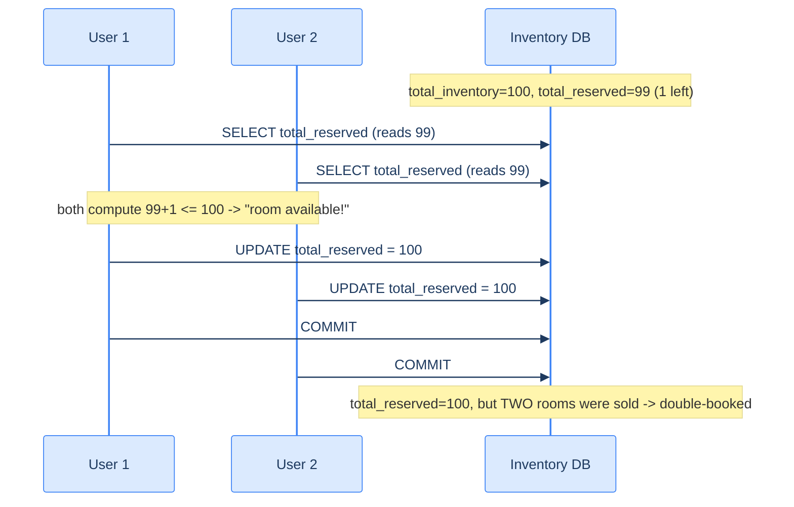
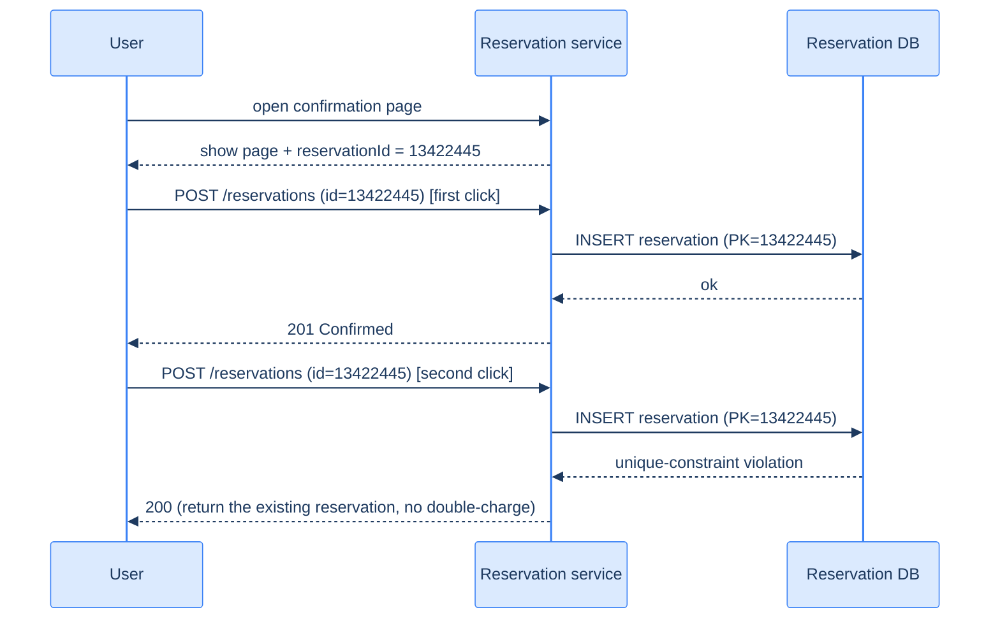

# 55. Hotel reservation system

## TL;DR
> A hotel reservation system maps *(hotel, room type, date) → how many rooms are left* and lets a traveler atomically claim one — and its entire design bends toward a single hazard: **double-booking**, selling the same room twice. Counter-intuitively it is **write-light**: a Marriott-scale chain (5,000 hotels, ~1M rooms) generates only **~240,000 reservations/day ≈ 3 writes/second**, while *availability reads* outnumber bookings ~100:1 (most visitors browse, few book). So a **relational database is the right default** — not because of scale but because [ACID](/cortex/system-design/building-blocks/relational-databases) is exactly the tool for "never sell a room twice," and the data (hotel/room/room_type/reservation) is cleanly relational. The hot modeling decision is that you reserve a **room *type*, not a specific room** — so inventory lives in a `room_type_inventory` table keyed by `(hotel_id, room_type_id, date)` with a `total_reserved`/`total_inventory` counter. Two concurrency problems must be killed: a user **double-clicking** (fixed by an **idempotency key** = the `reservation_id`, enforced by a unique constraint — see [19](/cortex/system-design/distributed-patterns/idempotency-retries-backoff)), and two users racing for the **last room** (fixed by a **DB `CHECK` constraint**, **optimistic locking** with a `version` column, or **pessimistic `SELECT … FOR UPDATE`** — optimistic or the constraint wins here, because reservation QPS is low so conflicts are rare). **Overbooking** (selling, say, 110% of capacity in anticipation of cancellations) is not a bug to prevent but a **business policy** you bake into the same check. At 1000× (a Booking.com/Expedia-scale OTA) you **shard by `hotel_id`** and put an **inventory cache** in front — but the database stays the source of truth and re-validates every booking. The arc: requirements → estimation → API → data model → architecture (D2 services + Mermaid race) → deep dives (the race, three locks, idempotency, overbooking) → edge cases → trade-offs → practice.

## 1. Motivation

Picture the worst Tuesday of a hotel manager's career. A regional sales conference books out the San Francisco Marriott Marquis months ahead. The night before, two travelers — one on the website, one in the app — both see "1 room left" at the exact same instant and both tap **Book**. Both get a confirmation email. Both fly in. Both show up at the front desk at 11 p.m. with a printed reservation for the *same* king room, and there is exactly one room. Somebody is getting "walked" — sent to a competitor hotel across town on the chain's dime, plus an apology, plus a furious review. That is **double-booking**, and it is not a rare gremlin: it is the *default* outcome of two writes racing toward one resource unless the system is explicitly built to prevent it.

That is what makes the reservation system the perfect counterpart to everything before it. The [URL shortener (42)](/cortex/system-design/capstones/url-shortener) was read-heavy but *blissfully simple* — one immutable key-value mapping, where a stale read is harmless. The [notification system (54)](/cortex/system-design/capstones/notification-system) was a fan-out where *losing* work was the sin and *duplicating* it was a nuisance. A reservation system flips both: it is **write-light** (only a few bookings per second even at chain scale), yet its writes are the most dangerous in this whole book, because **the cardinal sin is letting two of them succeed against the same room**. The design doesn't bend toward throughput; it bends toward *correctness under contention*. This is where the ACID guarantees of a [relational database](/cortex/system-design/building-blocks/relational-databases), the [consistency models](/cortex/system-design/building-blocks/consistency-models) you've been circling, the [idempotency](/cortex/system-design/distributed-patterns/idempotency-retries-backoff) you met in the abstract, and the [CAP](/cortex/system-design/foundations/cap-and-pacelc) trade-off you've been deferring all finally come due at once — on a problem small enough to hold in your head.

The lessons here generalize directly: flight seats, movie tickets, concert tickets, Airbnb listings, restaurant tables — every "reserve a scarce, dated thing" system is this design with the nouns swapped. Let's build it.

## Try it with the coach

Before you read the design, work through it yourself. The coach runs the same six-step interview — restate the problem, estimate, choose an approach, plan it, sketch the implementation, then stress-test it — and pushes back at each gate. There's no code editor here; you reason in prose, the way you would at a whiteboard. (Sign in to start; your conversation is kept in your browser as you go.)

<div class="concept-coach"></div>

## 2. Requirements and scope

The boundary matters more than usual here, because a "hotel website" is enormous and the *interesting* part is small. Following Xu's framing, we design the booking engine for a **hotel chain** (think Marriott International), not a metasearch travel site.

**Functional:**
- **Show hotel and room-detail pages** — mostly static content (name, address, photos, room types).
- **Reserve a room** — the heart of the system: a traveler picks a hotel, a room *type*, and a date range, and books it.
- **Cancel a reservation.**
- **Admin panel** for hotel staff — add/remove/update hotels and rooms, view and manage reservations, issue refunds.
- **Overbooking** — deliberately sell *more* rooms than exist (e.g. up to 110% of capacity) in anticipation of cancellations and no-shows.
- *Pricing note:* room prices change **per day** (a room costs more when the hotel expects to be full), so rates are dated, not fixed.

**Non-functional (these drive the design):**
- **High concurrency / no double-booking.** During a big event, many travelers hammer the *same* popular room type at once. The system must never confirm two reservations against inventory that doesn't exist. This is the dominant constraint.
- **Moderate latency is acceptable.** Unlike a redirect or a game tick, a booking can take a *couple of seconds* — the user expects a deliberate "confirming your reservation…" moment. We can spend latency to buy correctness.
- **High availability + durability.** A confirmed booking that's later "lost" is catastrophic; reservation data must survive.

**Out of scope:** room *search* (filtering by city/amenities/price across millions of listings — important, but a search problem, not a reservation problem; see [47. Search autocomplete](/cortex/system-design/capstones/search-autocomplete) for that flavor), the payment processor internals (we hand off to a payment service — that's [49. Payment system](/cortex/system-design/capstones/payment-system)), and dynamic-pricing models. Naming the boundary is part of the design: the reservation engine is the contended core; everything else is comparatively easy.

## 3. Back-of-envelope estimation

The numbers here deliver a genuine surprise, and the surprise *is* the lesson. Run them ([estimation](/cortex/system-design/foundations/back-of-envelope-estimation)). Assume **5,000 hotels** and **1 million rooms** total. Assume **70% occupancy** and an **average stay of 3 days**.

| Quantity | Calculation | Result |
|---|---|---|
| Occupied rooms (at any time) | 1,000,000 × 70% | **700,000** |
| New reservations/day | 700,000 ÷ 3-day stay | **~233,000 → ~240,000** |
| Reservation rate (write TPS) | 240,000 ÷ 86,400 s | **~3 writes/second** |
| Booking-page views (QPS) | ~10% of bookers reach it → 10× | **~30 QPS** |
| Detail-page views (QPS) | ~10% reach booking → 10× again | **~300 QPS** |

Read that write rate again: **~3 reservations per second.** A laptop could handle the *throughput*. This is the single most important realization in the whole design — **a hotel reservation system is not a scale problem; it's a correctness problem.** Almost everyone who walks in expecting to "shard for billions of writes" has misjudged it.

Where do the higher numbers come from? The **funnel**. Picture a typical visit as three steps: (1) view a hotel/room **detail page** (a query), (2) view the **booking page** to confirm dates and enter payment (a query), (3) click **Book** (the one transaction). Assume ~90% of users drop off at each step. Work *backward* from the 3 bookings/second: if only ~10% who reach the booking page actually book, the booking page sees ~30 QPS; if only ~10% who see a detail page proceed to booking, the detail page sees ~300 QPS. So reads outnumber writes by roughly **100:1** — but those reads are mostly *static content* (photos, descriptions) that a CDN and cache handle trivially, plus *availability checks*, which are the reads that actually touch inventory.

**Storage** is just as undramatic. The inventory table holds one row per `(hotel, room type, date)`. With 5,000 hotels, assume ~20 room types each, pre-populated for **2 years** of future dates: `5,000 × 20 × 2 × 365 ≈ 73 million rows`. Seventy-three million rows is *small* — a single well-provisioned relational server holds it comfortably (you replicate for availability, not capacity). The estimation has settled the two biggest decisions before we've drawn a box: **use a relational database** (the scale doesn't force NoSQL, and ACID is precisely what "no double-booking" wants), and **spend the design budget on concurrency, not throughput.**

## 4. API

REST endpoints, designed with the discipline from [Lesson 33](/cortex/system-design/application-architecture/api-design). Three resource families: hotels, rooms, reservations.

```
# Hotel & room content (admin-only writes)
GET    /v1/hotels/{id}                    hotel detail (public, heavily cached)
GET    /v1/hotels/{id}/rooms/{roomId}     room detail (public, cached)
POST   /v1/hotels                         add a hotel        (staff only)
PUT    /v1/hotels/{id}                    update a hotel     (staff only)
POST   /v1/hotels/{id}/rooms              add a room         (staff only)

# Reservations (the contended core)
GET    /v1/reservations                   logged-in user's reservation history
GET    /v1/reservations/{id}              one reservation's detail
POST   /v1/reservations                   make a reservation  ← the dangerous one
DELETE /v1/reservations/{id}              cancel a reservation
```

The one request that earns all the scrutiny is `POST /v1/reservations`. Its body carries the booking intent **plus an idempotency key**:

```
POST /v1/reservations
{
  "reservationId": "13422445",       // the idempotency key (see §7.2)
  "hotelId":       "245",
  "roomTypeId":    "12354673389",    // a room TYPE, not a specific room (§5)
  "startDate":     "2026-07-07",
  "endDate":       "2026-07-10",
  "roomCount":     1
}
```

Two design choices are encoded here. First, the client books a **`roomTypeId`, not a `roomId`** — a traveler reserves "a king room," and the specific room number is assigned at check-in, not at booking time (§5 explains why this reshapes the whole data model). Second, the `reservationId` is generated up front by the server (via a [unique-ID generator (52)](/cortex/system-design/capstones/unique-id-generator)) and reused as the **idempotency key**: if the same `POST` arrives twice (a double-click, a client retry after a timeout), the second one must *not* create a second booking. The redirect-storm discipline of the shortener becomes, here, a *don't-double-charge* discipline — and it's enforced for free by making `reservationId` the table's primary key, so a duplicate insert hits a **unique-constraint violation** instead of minting a second reservation (§7.2). This is the [Lesson 19](/cortex/system-design/distributed-patterns/idempotency-retries-backoff) idempotency pattern made concrete.

## 5. Data model

Before choosing a database, look at the access patterns — they decide everything. A reservation system needs to: **(1)** show a hotel's static detail, **(2)** find *available room types for a date range*, **(3)** record a reservation, **(4)** look up a reservation (or a user's history). Three of those four are simple lookups; the interesting one is #2, and it is a *range* query over inventory with a strict invariant.

**Why relational, not NoSQL.** This trips people up because the reflex from the shortener and news-feed capstones is "scale → NoSQL." Here the logic inverts:
- The scale is *small* (§3) — relational handles it with room to spare.
- The data is **cleanly relational**: hotel → rooms → room types, and reservations referencing them, with stable relationships. This is the textbook shape a [relational schema](/cortex/system-design/building-blocks/relational-databases) models effortlessly.
- And crucially, **ACID is the feature, not the overhead.** Preventing double-booking, double-charging, and negative inventory is *exactly* what atomicity + isolation give you. (DDIA makes the same point: ACID's isolation exists precisely so concurrently-executing transactions don't step on each other; reach for it when correctness under concurrency is the requirement — which is the whole game here.) NoSQL stores optimize for write throughput we don't need, at the cost of the transactional guarantees we very much do.

**The schema, naïve version.** The obvious model gives each `room` an `is_available` flag and points each `reservation` at a specific `room_id`:

```
hotel(hotel_id PK, name, address, location)
room(room_id PK, room_type_id, floor, number, hotel_id, is_available)
room_type_rate(hotel_id, date, rate)          -- price varies per day
reservation(reservation_id PK, hotel_id, room_id, start_date, end_date, status, guest_id)
guest(guest_id PK, first_name, last_name, email)
```

This works for **Airbnb** — there, you really do book a *specific* listing. But it's **wrong for hotels**, and spotting why is the key modeling insight: **a hotel guest reserves a room *type*, not a specific room.** You book "a king room with no view"; the front desk assigns room 412 when you check in. Tracking availability per `room_id` would force you to pick and lock an individual physical room at booking time — needless contention, and not how hotels actually operate.

**The improved schema** replaces per-room availability with a per-`(hotel, type, date)` **inventory counter**:

```
room(room_id PK, room_type_id, floor, number, hotel_id, name, is_available)
room_type_rate(hotel_id, room_type_id, date PK, rate)
room_type_inventory(
    hotel_id, room_type_id, date,            -- composite PK
    total_inventory,                         -- rooms physically available that day
    total_reserved                           -- rooms already booked that day
)                                            -- PK = (hotel_id, room_type_id, date)
reservation(reservation_id PK, hotel_id, room_type_id, start_date, end_date, status, guest_id)
guest(guest_id PK, first_name, last_name, email)
```

`room_type_inventory` is the contended heart of the system, so understand each column. **`total_inventory`** is the number of rooms of that type sellable on that date (total rooms minus any pulled for maintenance). **`total_reserved`** is how many are already booked. One row per *date* (not per date-range) is what makes range queries and partial-overlap bookings tractable — a 3-night stay touches 3 rows, and a daily scheduled job pre-populates inventory rows ~2 years into the future so there's always a row to update. This is the ~73M-row table from §3.

A reservation request then becomes a precise check, run for **every date in the range**:

```sql
-- Can we book `roomCount` rooms for every night of the stay?
SELECT date, total_inventory, total_reserved
FROM   room_type_inventory
WHERE  hotel_id = :hotelId AND room_type_id = :roomTypeId
  AND  date BETWEEN :startDate AND :endDate;

-- for each returned row, require:
--   total_reserved + roomCount  <=  total_inventory
```

If every night passes, reserve by incrementing the counter:

```sql
UPDATE room_type_inventory
SET    total_reserved = total_reserved + :roomCount
WHERE  hotel_id = :hotelId AND room_type_id = :roomTypeId
  AND  date BETWEEN :startDate AND :endDate;
```

And the `reservation.status` field is a small **state machine** — `pending → paid → (refunded | canceled | rejected)` — that the payment flow drives: `pending` when created, `paid` once payment succeeds, `rejected` if it fails, `canceled`/`refunded` on cancellation. Keep that picture; it's why a "reservation" can exist transiently without a completed payment, and why cancellation has to *give the room back* (decrement `total_reserved`).

## 6. Architecture

The system is a small set of **microservices** behind an API gateway — the now-standard shape, and a deliberate choice to keep static content, rates, the contended reservation logic, and payments independently scalable and ownable. The D2 topology:

```d2
direction: right
user: User (web / app)
admin: Admin (hotel staff)
cdn: CDN (static assets) { shape: cylinder }
gw: Public API gateway\n(authn · rate-limit · routing)
igw: Internal API\n(VPN-protected)

hotelsvc: Hotel service\n(static hotel/room info)
ratesvc: Rate service\n(per-day prices)
ressvc: "Reservation service\n(inventory + bookings)" { shape: rectangle }
paysvc: Payment service
mgmtsvc: Hotel-management service\n(admin ops)

hotelcache: Hotel cache { shape: cylinder }
hoteldb: Hotel DB { shape: cylinder }
ratedb: Rate DB { shape: cylinder }
resdb: "Reservation DB\n(reservation + inventory)" { shape: cylinder }
paydb: Payment DB { shape: cylinder }

user -> cdn: "static assets"
user -> gw: "browse · POST /v1/reservations"
admin -> igw: "manage hotels / rooms"

gw -> hotelsvc
gw -> ratesvc
gw -> ressvc
igw -> mgmtsvc

hotelsvc -> hotelcache
hotelsvc -> hoteldb
ratesvc -> ratedb
ressvc -> ratesvc: "price the stay"
ressvc -> resdb: "check + reserve (1 txn)"
ressvc -> paysvc: "charge"
paysvc -> paydb
mgmtsvc -> ressvc
mgmtsvc -> hotelsvc
```

Walk it top to bottom. The **CDN** serves static assets (images, JS, the hotel pages that barely change) — most of the ~300 QPS detail-page traffic never reaches an application server. The **public API gateway** does authentication, rate limiting, and routes each request to the right service. The **Hotel service** serves static hotel/room data and is trivially cacheable. The **Rate service** answers "what does this room type cost on these dates?" The **Reservation service** is the one that matters: it tracks inventory and creates bookings, querying the Rate service to total the charge and the Payment service to collect it. The **Hotel-management service** is the admin-only path (behind a VPN/internal gateway) for staff operations.

One pragmatic decision shapes the rest of the chapter: **the reservation and inventory tables live in the *same* relational database, owned by the Reservation service.** A microservice purist would give inventory its own database — but then a single booking ("decrement inventory" *and* "insert reservation") spans two databases and can't be one ACID transaction, dragging in [2PC](/cortex/system-design/distributed-patterns/sagas-and-distributed-transactions) or a saga with compensating rollbacks (the same family of trouble the [payment system (49)](/cortex/system-design/capstones/payment-system) wrestles with). By keeping both tables in one database, the whole reserve-and-record operation is a *single local transaction*, and the database's ACID guarantees solve the concurrency problem for us. The added complexity of cross-service consistency wasn't worth it here — a real architectural judgment call, and the right one at this scale.

## 7. Deep dive — the concurrency problem

This is the chapter. There are **two** distinct double-booking hazards, and they need *different* fixes.

### 7.1 The race: two travelers, one room

Suppose `total_inventory = 100`, `total_reserved = 99` — one room left — and two users book at the same instant, on a database whose isolation level is *not* serializable (the common default, e.g. Read Committed). Here is the interleaving that loses a room:



The bug is the classic **read-modify-write race** (a *lost update*). Both transactions read `99`, both independently decide there's room, both write `100`. Isolation makes it *worse*, not better, in the naïve form: because transaction 1's uncommitted change isn't visible to transaction 2, transaction 2 keeps seeing the stale `99` and happily proceeds. The end state `total_reserved = 100` even *looks* correct — but two confirmations went out against one room. (DDIA catalogs this exact failure as a **lost update**, the canonical concurrency anomaly, and the fixes below are precisely its remedies: atomic write operations, explicit locking, and compare-and-set / version checks.) Three fixes, in roughly increasing pessimism.

**Fix A — Database `CHECK` constraint (let the database say no).** Add an invariant the database itself enforces on every write:

```sql
ALTER TABLE room_type_inventory
  ADD CONSTRAINT check_inventory
  CHECK (total_reserved <= total_inventory);   -- or <= 1.1 * total_inventory for overbooking
```

Now the `UPDATE` is *atomic* and self-checking: when the second transaction tries to push `total_reserved` to `101`, the database rejects the write and rolls the transaction back. The application catches the failure and tells that user "sorry, just sold out." No application-level read-then-write gap exists, because the constraint is checked *as part of the write*. It's the simplest correct fix — but constraints are awkward to version-control alongside app code, and not every datastore supports them, which matters if you ever migrate.

**Fix B — Optimistic locking (assume conflicts are rare; detect them).** Add a **`version`** column. Read the row *and* its version; when you write, increment the version and require that the version hasn't changed since you read it:

```sql
-- read: total_reserved = 99, version = 7
UPDATE room_type_inventory
SET    total_reserved = 100, version = 8
WHERE  hotel_id = :h AND room_type_id = :rt AND date = :d
  AND  version = 7;            -- the optimistic guard
-- if rows-affected = 0, someone else won; abort and retry from the read
```

The two racers both read `version = 7`. Both attempt the write requiring `version = 7`; the database serializes them, so **exactly one** update matches and succeeds (bumping version to 8), and the loser's `WHERE version = 7` now matches **zero rows**. The loser sees "0 rows updated," knows it raced, and retries from a fresh read (where it'll now see no room). This is **compare-and-set** in SQL — no locks held, nothing blocks. (Version numbers beat timestamps for the guard, because clocks drift and two writes can collide on the same millisecond.) Its weakness: under *heavy* contention, most writers lose the race and have to retry, and retry, and retry — a thundering herd of futile attempts and a miserable UX. But — and this is the punchline — **reservation QPS is low (~3/s)**, so genuine conflicts are rare, which makes optimistic locking the *natural* fit for this workload.

**Fix C — Pessimistic locking (assume conflicts; prevent them).** Lock the row the moment you read it, with `SELECT … FOR UPDATE`:

```sql
BEGIN;
SELECT total_reserved, total_inventory
FROM   room_type_inventory
WHERE  hotel_id = :h AND room_type_id = :rt AND date BETWEEN :s AND :e
FOR UPDATE;                    -- locks these rows; other txns block here
-- ... check, then UPDATE ...
COMMIT;                        -- releases the lock
```

Now transaction 2's `SELECT … FOR UPDATE` *blocks* until transaction 1 commits and releases the lock; by the time it proceeds, it reads `total_reserved = 100` and correctly refuses. It's correct and easy to reason about — but it **serializes** all bookings for that room type, holds locks for the duration of the transaction, and risks **deadlocks** when a booking touches multiple rows (multiple nights) that get locked in different orders. (DDIA's warning applies: explicit locking is correct but throughput-limiting and deadlock-prone; prefer it only when contention is genuinely high.) For a low-QPS reservation system, that's overkill — we *don't* recommend it here.

**The verdict.** All three are correct. For *this* workload — **low write QPS, so conflicts are rare** — **optimistic locking or the `CHECK` constraint** are the right tools: they don't pay the cost of holding locks for a conflict that almost never happens. Pessimistic locking is the answer only when contention is heavy (a flash-sale ticketing system where ten thousand people stampede one row). Match the lock to the contention, not to your anxiety. (And note: a `serializable` isolation level — DDIA's gold standard — would *also* prevent the lost update by making the database detect the conflict for you, at the cost of more aborts under load; the explicit techniques above let you control that trade-off per-query instead.)

### 7.2 Idempotency: the double-click

The *second* hazard is different and simpler: **one user clicks "Book" twice** (impatience, a slow spinner, a retried request after a network blip). Nothing raced for the *last* room — there's plenty of inventory — but you'd create *two* identical reservations and **charge the customer twice**. The locking fixes above don't help: both clicks pass the inventory check.

The fix is an **idempotency key** (the [Lesson 19](/cortex/system-design/distributed-patterns/idempotency-retries-backoff) pattern). The server generates a unique `reservationId` *up front* — when the user first reaches the confirmation page, before they click Book — and that id rides along on the booking request. Because `reservationId` is the **primary key** of the `reservation` table, the database makes the duplicate impossible by construction:



The first insert succeeds. The second insert, carrying the *same* `reservationId`, hits a **unique-constraint violation** — the database refuses to create a duplicate row. The service catches that specific error and, instead of failing, returns the **already-created** reservation (a `200` replaying the original result). The user sees one confirmation, gets charged once, and never knows there was a second click. A client-side guard (graying out the button after the first tap) is a fine *first* line of defense, but it's not trustworthy — a user can disable JavaScript, the page can be replayed, the network can retry under the hood — so the **server-side idempotency key is the real guarantee.** Note the idempotency key didn't *have* to be the `reservationId`; we reuse it because it already exists and is already the primary key, which is the cleanest possible enforcement. (This is the same store-the-key-and-replay discipline the [payment system (49)](/cortex/system-design/capstones/payment-system) uses to charge exactly once.)

### 7.3 Overbooking: a feature, not a bug

Here is the counter-intuitive twist that surprises most engineers: hotels **deliberately** sell *more* rooms than they have. If a hotel sells exactly 100 rooms and 5 guests cancel or no-show, it flies 5 empty rooms — pure lost revenue on a perishable good (a room-night unsold tonight is gone forever, like an empty airline seat). So hotels **overbook**: sell, say, **110%** of capacity, betting that cancellations and no-shows bring actual occupancy back under 100%. On the rare night everyone shows up, the hotel "walks" the overflow to a nearby hotel — an expensive but bounded cost, deliberately traded against the everyday revenue of selling those extra rooms.

The beautiful part: **overbooking needs no new machinery.** It's a *policy knob* in the exact same inventory check. Instead of `total_reserved + roomCount <= total_inventory`, you write:

```sql
-- allow up to 110% of physical capacity
total_reserved + :roomCount  <=  1.1 * total_inventory
```

or bake the same `1.1 *` factor into the `CHECK` constraint from Fix A. The overbooking percentage becomes a tunable business parameter (per hotel, per season, per room type), and all the concurrency protection from §7.1 still applies — you're just enforcing a *different ceiling*. The lesson generalizes past hotels: **not every "constraint violation" is an error to prevent; some are business decisions to encode.** Knowing which is which — that selling the last room twice is a catastrophe but selling 110% on purpose is a strategy — is the difference between modeling a system and modeling a *business*.

## 8. Scaling to OTA scale (the 1000× question)

At chain scale (~3 writes/s) none of this needs scaling. But the classic follow-up is: *"what if this isn't one chain — what if it's Booking.com or Expedia, aggregating thousands of chains, at 1000× the load?"* Now ~3 writes/s becomes thousands, availability reads explode, and the single database is the bottleneck (the stateless services scale by just adding boxes; the *data* is the hard part). Two moves, in order:

- **Shard the database by `hotel_id`.** Every hot query — make a reservation, look up inventory, find a user's bookings — filters by hotel first, so `hotel_id` is the natural [shard key](/cortex/system-design/building-blocks/sharding-and-partitioning): route by `hash(hotel_id) % N`. Spread across, say, 16 shards, 30,000 QPS becomes ~1,875 QPS per shard — back inside a single MySQL server's comfort zone. And because all the contention for a given room is *within one hotel*, it lands on *one shard*, so the §7 ACID transactions still work unchanged — **no cross-shard transactions**, the property that makes this sharding clean. (Archive old reservations to cold storage too; history is rarely read, so current+future data is all the hot path needs.)
- **Put an inventory cache in front (Redis).** Availability *reads* vastly outnumber bookings, so cache the "rooms left for `hotel_roomType_date`" counter in Redis — keyed exactly like the inventory row, with a **TTL** (only current/future dates matter, so an LRU+TTL policy keeps memory tight). Most availability checks are answered from memory; most *ineligible* requests (sold-out dates) get rejected at the cache without ever touching the database. **But the database stays the source of truth, and every actual booking re-validates against it** — the cache can lag, so it might briefly show a room that's gone (the user gets "just sold out" on commit) or hide one that opened up (they see it on refresh). That eventual inconsistency is *harmless precisely because the database has the final say* — a clean illustration of choosing where on the [consistency](/cortex/system-design/building-blocks/consistency-models) spectrum each layer sits. (Keeping cache and DB in sync — via app-side write-through or [change-data-capture](/cortex/system-design/building-blocks/consistency-models) like Debezium — is the new cost the cache introduces.)

The throughline mirrors §7's verdict: the reservation system scales not by getting cleverer about throughput but by **partitioning contention so each shard's local ACID transaction still does the heavy lifting**, with a cache absorbing the lopsided read load.

## 9. Edge cases and failure modes

- **Concurrent last-room booking (§7.1).** The headline race. Pick a lock to match your contention: optimistic/`CHECK` for low QPS (the hotel case), pessimistic for a flash-sale stampede. Never rely on the bare read-then-write — it *will* double-book under load.
- **Double-click / retry storm (§7.2).** A user (or a retrying client) submits the same booking twice. The idempotency key (`reservationId` as PK + unique constraint) makes the duplicate a no-op that replays the original result — no second room, no second charge. Client-side button-disabling helps but is not trustworthy on its own.
- **Cancellation must give the room back.** Cancelling decrements `total_reserved` (and drives the status state machine to `canceled`/`refunded`). Forget this and inventory silently leaks — the hotel shows "sold out" while rooms sit empty. The decrement is itself a concurrent write, so it goes through the same atomic `UPDATE`.
- **Partial-range availability.** A 3-night stay needs *all three* nights available; night 2 being full must fail the *whole* booking. That's why inventory is one row per date and the check spans the range in a single transaction — you can't half-book a stay.
- **Overbooking overshoot (§7.3).** Overbooking is deliberate, but on the unlucky night when everyone shows up, the hotel must "walk" the overflow. The *system's* job is to enforce the policy ceiling (e.g. 110%) atomically; the *operational* job (rebooking walked guests) lives outside it. Set the percentage too high and walks spike; too low and you fly empty rooms.
- **Payment failure after inventory hold.** Inventory is decremented but the charge fails. The reservation goes to `rejected` and the room is released (`total_reserved -= 1`). Because reservation and inventory share one database (§6), this rollback is a single local transaction — no distributed saga needed. (If you *had* split them, this is exactly the inconsistency window that forces 2PC or compensating transactions — the [payment system (49)](/cortex/system-design/capstones/payment-system) shows that harder path.)
- **Cache/DB inventory skew (§8).** The Redis counter can disagree with the database. Harmless *as long as the database re-validates every booking*: a falsely-available room yields a graceful "just sold out" at commit; a falsely-unavailable room reappears on refresh once the cache syncs. Never let the cache be the authority for the commit.

## 10. Trade-offs

| Decision | Option | Why |
|---|---|---|
| Datastore | **Relational (ACID)** vs NoSQL | the data is cleanly relational and *small*; ACID is the exact tool for "never double-book" — scale doesn't force NoSQL here |
| Concurrency control | **Optimistic / `CHECK`** vs pessimistic | reservation QPS is low, so conflicts are rare → no need to hold locks; pessimistic (`SELECT … FOR UPDATE`) only earns its cost under heavy contention |
| Lost-update guard | **`version` column (CAS)** vs timestamp | version numbers are exact; clocks drift and can collide on the same millisecond |
| Double-charge prevention | **Idempotency key (PK + unique constraint)** vs client-side only | the server-side unique constraint is the real guarantee; graying out the button is bypassable |
| Inventory granularity | **`room_type_inventory` counter per date** vs per-`room_id` flag | hotels book a *type*, not a room; a counter avoids locking individual physical rooms and supports overbooking trivially |
| Service/data split | **Reservation + inventory in one DB** vs DB-per-service | one local ACID transaction kills the concurrency problem; splitting drags in 2PC/saga for no benefit at this scale |
| Overbooking | **Policy knob in the inventory check** vs forbid it | overbooking is a revenue strategy, not a bug — encode it as a tunable ceiling, not an error to prevent |
| 1000× scale | **Shard by `hotel_id` + inventory cache** vs scale-up | contention is per-hotel → sharding keeps transactions local; a cache absorbs the lopsided availability reads |

## 11. Practice

> **Exercise 1 — Walk the race.**
> `total_inventory = 50`, `total_reserved = 49`. Two users book one room each at the same instant under Read Committed isolation, using a plain `SELECT` then `UPDATE`. Trace the interleaving that double-books, then show how adding `WHERE version = :v` to the `UPDATE` prevents it.
>
> <details>
> <summary>Solution</summary>
>
> **The double-book:** T1 reads `total_reserved = 49`; T2 reads `49` (T1 hasn't committed, so its change is invisible). Both compute `49 + 1 = 50 <= 50` → "room available." T1 `UPDATE`s to `50` and commits; T2, still holding its stale read, `UPDATE`s to `50` and commits. Final state `total_reserved = 50` *looks* right, but **two reservations were confirmed against one room** — a lost update.
> **The fix (optimistic):** both read `version = v`. Each issues `UPDATE … SET total_reserved = 50, version = v+1 WHERE … AND version = v`. The database serializes the two writes: the first matches (`version = v`), succeeds, and bumps version to `v+1`. The second's `WHERE version = v` now matches **0 rows** — it learns it raced, aborts, and retries from a fresh read, where it sees `total_reserved = 50` and correctly refuses. One room, one booking. (A `CHECK (total_reserved <= total_inventory)` constraint or `SELECT … FOR UPDATE` would each fix it too, by a different mechanism — atomic rejection, or blocking the second read.)
>
> </details>

> **Exercise 2 — Why is optimistic the *default* here but wrong for concert tickets?**
> A teammate insists on pessimistic `SELECT … FOR UPDATE` for the hotel system "to be safe." Why is that the wrong default for hotels, and what changes for a system selling 10,000 concert tickets the second they drop?
>
> <details>
> <summary>Solution</summary>
>
> For **hotels**, reservation QPS is low (~3/s even at chain scale), so two bookings genuinely racing for the *same* room type on the *same* date is rare. Pessimistic locking would hold a row lock for the duration of *every* transaction and serialize all bookings for that room type, paying a steep cost to defend against a conflict that almost never happens — and inviting deadlocks across multi-night row locks. Optimistic locking (or a `CHECK` constraint) pays *nothing* when there's no conflict and only costs a cheap retry on the rare collision — the right match for low contention.
> For a **concert on-sale**, the picture inverts: ten thousand people stampede the *same* inventory in the same few seconds, so conflicts are the *norm*. Optimistic locking would melt down — almost every writer loses the CAS race and retries, a thundering herd of futile attempts. There, **pessimistic locking** (or a queue that serializes entrants, or a reservation-token system that hands out short-lived holds) is the correct tool. **Match the lock to the contention, not to your anxiety.**
>
> </details>

> **Exercise 3 — Idempotency vs the race: two different bugs.**
> A reviewer says "we already have a unique constraint on `reservation_id`, so we're protected from double-booking — we don't need locking on the inventory." Why are they conflating two different problems, and what does each mechanism actually protect?
>
> <details>
> <summary>Solution</summary>
>
> They're protecting against **different hazards**. The **unique constraint on `reservation_id`** stops a *single user's duplicate request* (a double-click or a retried `POST` with the same idempotency key) from creating **two reservation rows / two charges** — but both of those requests carried the *same* `reservation_id`, and there was plenty of inventory; nothing raced for a scarce room. The **inventory locking** (`CHECK` / optimistic / pessimistic) stops *two different users*, with *two different* `reservation_id`s, from each successfully claiming **the last physical room**. The unique constraint is useless against that — both inserts have distinct primary keys, so both succeed, and you've sold one room twice. You need *both*: the idempotency key for the same-request-twice case, and inventory concurrency control for the different-requests-one-room case.
>
> </details>

## In the Wild

- **["System Design Interview — An Insider's Guide, Vol. 2" (Alex Xu & Sahn Lam, ch. 7)](https://www.amazon.com/System-Design-Interview-Insiders-Guide/dp/1736049119)** — the canonical written walk-through this capstone builds on: the funnel estimation, the room-*type* inventory schema, the three concurrency fixes, the idempotency-key reservation, and overbooking as a business choice.
- **[Designing Data-Intensive Applications (Kleppmann, 2e), Ch. 7 — "Weak Isolation Levels" / lost update & write skew](https://dataintensive.net/)** — the rigorous basis for §7: why read-modify-write races *are* lost updates, and the remedy menu (atomic operations, explicit `FOR UPDATE` locks, compare-and-set, serializable isolation) the three fixes draw from.
- **[Martin Kleppmann — "How to do distributed locking"](https://martin.kleppmann.com/2016/02/08/how-to-do-distributed-locking.html)** — the cautionary deep-dive on why locks across machines are treacherous, and why this design keeps contention *inside one database/shard* (one local ACID transaction) instead of reaching for a distributed lock.
- **[Stripe — "Designing robust and predictable APIs with idempotency"](https://stripe.com/blog/idempotency)** — the production reference for §7.2: idempotency keys done right (store-first, replay-later, one key per intent), the same discipline that turns a double-clicked booking into a single charge.
- **[Vladimir Mihailenco — "Optimistic locking" (and the broader pattern)](https://en.wikipedia.org/wiki/Optimistic_concurrency_control)** — the version-number compare-and-set mechanism of §7.1 Fix B, including why versions beat timestamps and when the optimistic approach degrades under contention.
- **[Booking.com Engineering / Expedia Group Tech blogs](https://blog.booking.com/)** — OTA-scale war stories behind §8: aggregating thousands of properties, the read-heavy availability path, caching inventory, and the operational reality of bookings across many supplier systems.

---

> **Next:** [56. Distributed email service](/cortex/system-design/capstones/distributed-email-service) — the reservation system was write-light but consistency-critical: a handful of bookings per second that must *never* double. Email flips the scale entirely — billions of messages a day, a system that's part storage engine, part search index, part real-time delivery network. We design the mailbox: how to store and *search* enormous per-user mail volumes, fan out delivery reliably, fight spam, and reconcile the [CAP](/cortex/system-design/foundations/cap-and-pacelc) tension between "never lose a message" and "show my inbox instantly."
