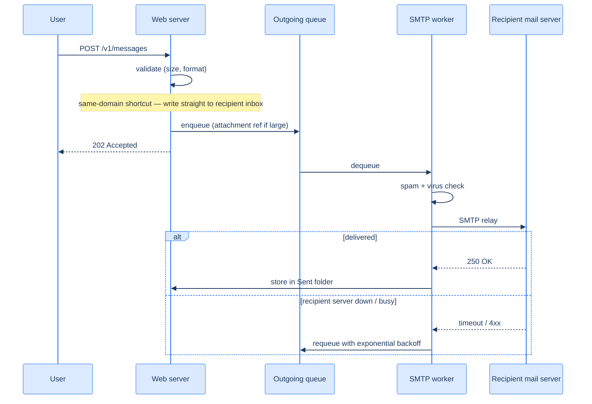
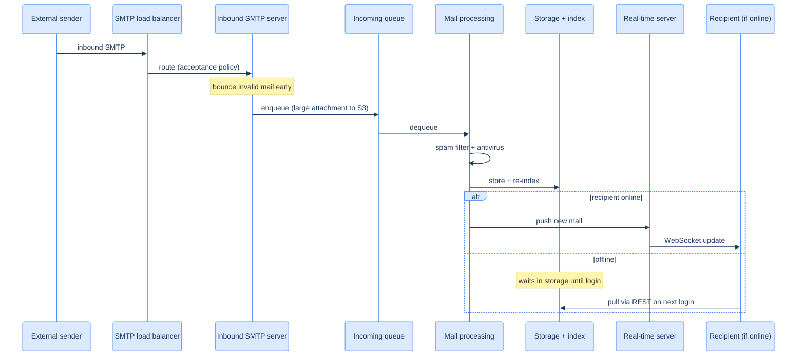

# 56. Distributed email service

## TL;DR
> Email is the oldest application on the internet and it *looks* trivial — store a message, show it in a list — which is exactly the trap. At a **billion mailboxes** it becomes one of the most **storage-heavy** systems you will ever design: ~**730 PB/year** of metadata and ~**1,460 PB/year** of attachments, before replication. The architecture splits along that seam — a **metadata store** (headers, bodies, folders; small, frequently read, strongly consistent) versus a **blob/attachment store** (object storage like S3; large, write-once, read-rarely), because the two have opposite access profiles and stuffing 25 MB attachments into your metadata rows would wreck it. The **send path is asynchronous**: the web tier validates, drops the message on an **outgoing queue**, and **SMTP outbound workers** relay it to the recipient's mail server with **exponential-backoff retries** (the recipient's server may be down — that's normal, not an error). The **receive path is a pipeline**: inbound SMTP → an **incoming queue** → **spam/antivirus** workers → storage → a real-time push if the user is online. **Search is the surprise:** unlike web search, an email index is **write-heavy** — every send, receive, and delete triggers a re-index, while a *query* only happens when a user clicks the search box — so you build a **per-user inverted index** (partitioned by `user_id`, because a mailbox only ever searches itself) on a write-optimized **LSM** structure, and at Gmail scale you embed it in the datastore rather than bolting on a generic search cluster. **Consistency is per-mailbox:** a user must see their *own* mailbox coherently (mark-as-read sticks; a sent mail appears in Sent), so each mailbox has a **single primary** — a [CP](/cortex/system-design/foundations/cap-and-pacelc) choice that briefly pauses a mailbox during failover rather than ever showing it stale or forked. The throughline: email is **per-user-partitioned, storage-bound, and write-heavy on the index** — the opposite shape of the read-heavy URL shortener that opened these capstones.

## 1. Motivation

In 2020, Gmail crossed **1.8 billion** active users and Outlook **400 million** — a single mail provider now holds more live mailboxes than there were people on the internet a couple of decades ago. And every one of those mailboxes is a *forever archive*: people don't delete email, they search it. Your boarding pass from a trip three years ago, the receipt you need for a warranty claim, the thread where someone promised you something in writing — it's all still there, retrievable in milliseconds. An email service isn't a messaging app you can let drop a message now and then; it's the **system of record for a billion people's lives**, and "we lost your email" is the one sentence it can never say.

That is what makes email *harder than it looks*. On the surface it's a list of messages — the same CRUD app a bootcamp builds in week two. Underneath, the numbers detonate. Run the back-of-envelope (§3) and a year of mail is measured in **petabytes** — three orders of magnitude past the URL shortener's ~91 TB. The protocols are older than most engineers (SMTP, IMAP, POP) and were never designed for billions of users or for features like full-text search, labels, and threading. Spam is over half of all mail sent, so a chunk of your compute exists purely to *not deliver* messages. And the part everyone forgets — **search** — is write-heavy in a way that breaks the mental model you built from web search: Google indexes the web once and serves billions of queries against it, but an email index is rewritten on every single message that arrives, sends, or gets deleted, against a *query* rate that's comparatively tiny.

This is the capstone where the toolkit comes due in a new combination. It's storage-bound, so you reach for the [metadata-vs-blob split](/cortex/system-design/storage-and-search/object-storage) and a [NoSQL family](/cortex/system-design/building-blocks/nosql-families) chosen for the access pattern. It's asynchronous, so the send path runs through a [message queue](/cortex/system-design/distributed-patterns/message-queues-and-streams) with retries. It's searchable, so you build a [per-user inverted index](/cortex/system-design/storage-and-search/search-systems). And it must keep each mailbox coherent for its owner, so you finally make a hard [consistency](/cortex/system-design/foundations/cap-and-pacelc) call — single-primary-per-mailbox, CP over AP. The URL shortener (Lesson 42) was read-heavy and *simple*; email is the opposite shape, and that contrast is the lesson. Let's build it.

## Try it with the coach

Before you read the design, work through it yourself. The coach runs the same six-step interview — restate the problem, estimate, choose an approach, plan it, sketch the implementation, then stress-test it — and pushes back at each gate. There's no code editor here; you reason in prose, the way you would at a whiteboard. (Sign in to start; your conversation is kept in your browser as you go.)

<div class="concept-coach"></div>

## 2. Requirements and scope

Pin down *what we're building* before *how* — and for email the "how" is dictated almost entirely by scale and by one non-obvious fact about search.

**Functional:**
- **Send:** compose an email (to/cc/bcc, subject, body, attachments) and deliver it, whether the recipient is on our service or someone else's.
- **Receive:** accept inbound mail from any mail server on the internet, run it through spam/antivirus, and file it into the recipient's inbox.
- **Fetch & organize:** list folders, list emails in a folder (newest first), open a message, and filter by **read/unread**.
- **Search:** find emails by **subject, sender, or body** keyword (and, ideally, filter by attributes — from, date, has-attachment, unread).
- *Optional:* conversation threading, labels, and rich filtering rules.

**Non-functional (these drive the design):**
- **Reliability — no data loss, ever.** A lost email is the cardinal sin (§1). Everything is replicated; durability is non-negotiable.
- **Storage-heavy.** This is *the* defining property. We are storing petabytes per year and growing; the design bends toward storage efficiency and toward separating data with different access profiles.
- **Per-user consistency.** A user must see their *own* mailbox coherently — mark-as-read must stick, a sent message must show up in Sent. Cross-user sharing is **not** a requirement (your inbox is yours alone), which simplifies partitioning enormously.
- **Scalability + availability.** A billion mailboxes, replicated across data centers, with no degradation as users and mail grow. Because users' access patterns are independent, most of the system scales horizontally.

**Out of scope:** authentication/login (assume it's handled), the full anti-spam *modeling* pipeline (we note where it hooks in), and calendar/contacts. We'll assume clients talk to us over **HTTP/REST** (as a modern webmail client does), while we still speak **SMTP** to the rest of the world's mail servers — naming that boundary is part of the design.

## 3. Back-of-the-envelope estimation

Numbers first ([estimation](/cortex/system-design/foundations/back-of-envelope-estimation)) — and for email they don't just *inform* the design, they *are* the design, because the whole architecture is a response to the storage figure. Assume **1 billion users**.

| Quantity | Calculation | Result |
|---|---|---|
| Send QPS | 1B users × 10 sent/day ÷ 86,400 s | **~100,000 sends/s** |
| Receive volume | 1B users × 40 received/day | **40 billion emails/day** |
| Metadata/year | 1B × 40/day × 365 × 50 KB | **~730 PB/year** |
| Attachments/year | 1B × 40/day × 365 × 20% × 500 KB | **~1,460 PB/year** |

Walk those assumptions: a person sends about **10** emails a day and receives about **40** (inbound dwarfs outbound — most of your mail is from other people and machines). Average **metadata** per email — everything *except* the attachment file: headers, subject, body — is **~50 KB** (bodies balloon once HTML is involved). About **20%** of emails carry an attachment, averaging **~500 KB**.

Two of those numbers settle the entire shape of the system. First, the storage totals are in **petabytes per year** — ~730 PB of metadata and ~1,460 PB of attachments, *before* you replicate for durability. There is no single machine, and no single conventional database, that holds this; email is a **distributed-storage problem first and everything else second**. Second — and this is the lever the design actually pulls — the attachment bytes are **2× the metadata bytes**, but they have the *opposite* access pattern: a 500 KB PDF is written once and almost never re-read, while the 50 KB of headers around it is read constantly (every inbox load touches it). Mixing those two in one store would be a category error. That single observation — *the big bytes and the hot bytes want different homes* — is what splits the storage layer in §5.

## 4. API and protocols

Email is unusual because it speaks **two languages**: a modern API to *its own clients*, and ancient standard protocols to *the rest of the internet*. You must design both halves.

**The protocols (the world-facing half).** These are legacy but unavoidable — every other mail server on earth speaks them:

- **SMTP** (Simple Mail Transfer Protocol, [RFC 5321](https://datatracker.ietf.org/doc/html/rfc5321)) is the protocol for **sending** — both from a client to its mail server *and*, crucially, **server-to-server** between providers. When our user mails someone at another provider, our outbound workers open an SMTP connection to *their* server. SMTP is a **push** protocol.
- **IMAP** ([RFC 3501](https://datatracker.ietf.org/doc/html/rfc3501)) is the dominant protocol for **receiving** into a client. It leaves mail *on the server* and downloads a message only when you open it, so you can read the same mailbox from your phone and laptop and they stay in sync — which is why it won over POP.
- **POP** ([RFC 1939](https://datatracker.ietf.org/doc/html/rfc1939)) is the older receive protocol: it **downloads and then deletes** from the server, tying your mail to one device. Mostly historical now, but you support it for legacy clients.
- **DNS MX records** are how SMTP finds *where to deliver*. Before our outbound worker can send to `bob@gmail.com`, it does a DNS lookup for the **MX (mail exchanger) record** of `gmail.com`, which returns a *prioritized* list of receiving servers (lower priority number = tried first; the next is tried only if the first connection fails). MX-record fallback is the internet's built-in retry-on-a-different-host.

**The API (the client-facing half).** A modern webmail client doesn't speak raw IMAP — it speaks **REST over HTTPS** to our web tier, which is far more flexible and lets us add features the old protocols never anticipated. A handful of endpoints, designed with the discipline from [Lesson 33](/cortex/system-design/application-architecture/api-design):

```
POST /v1/messages            send a message to the To/Cc/Bcc recipients
  202 Accepted               { "message_id": "..." }   (queued for async delivery)

GET  /v1/folders             list this account's folders
  200 OK                     [ { "id", "name", "user_id" } ]   (All, Inbox, Sent, Drafts, Junk, Trash, ...)

GET  /v1/folders/{id}/messages?cursor=...   list messages in a folder, newest first (paginated)
  200 OK                     [ { "message_id", "from", "subject", "preview", "is_read" } ]

GET  /v1/messages/{id}       full message: from, to, subject, body, attachment refs
  200 OK                     { "from", "to", "subject", "body", "attachments": [ {filename, size, url} ] }

GET  /v1/search?q=...&from=...&unread=true   search this user's mailbox
  200 OK                     [ matching message summaries ]
```

Note that `POST /v1/messages` returns **`202 Accepted`, not `201 Created`** — sending is *asynchronous* (§6). We've accepted responsibility for delivery and queued the message; the actual relay to the recipient happens later, possibly after retries. And it must be **idempotent** ([Lesson 19](/cortex/system-design/distributed-patterns/idempotency-retries-backoff)): a client that retries after a network blip must not send the email *twice* — accept a client-supplied message ID so a duplicate `POST` is recognized and dropped.

## 5. Data model: metadata store vs. blob store

The §3 estimation already told us the punchline: **the big bytes and the hot bytes want different homes.** So the storage layer splits in two.

**The attachment / blob store — object storage.** Attachments (up to ~25 MB each, ~1,460 PB/year in aggregate) go into an **object store like S3** ([Lesson 28](/cortex/system-design/storage-and-search/object-storage)), and the email record keeps only a *reference* (a URL/key) to the blob. Why not just stash them in the same database as the metadata? Because a column-family store like Cassandra is the wrong tool for big blobs twice over: its practical per-cell limit is well under a megabyte (the theoretical 2 GB is a fiction in production), and — more subtly — multi-megabyte values **blow out the row cache**, so caching a few attachments evicts the headers of thousands of emails you actually need hot. Object storage, by contrast, is *built* for write-once large files, scales effectively without limit, and is cheap per byte. The blob store also unlocks a free win on group mail: the **same attachment sent to 50 recipients can be stored once** and referenced 50 times — check existence by content hash before the expensive save (a §11 optimization).

**The metadata store — a NoSQL store, partitioned by user.** Everything else — headers, subject, body, folder membership, read/unread — is small, frequently read, and demands strong consistency. The first design decision is the **partition key: `user_id`.** Because mail operations are **isolated to one user** (your inbox is read, searched, and modified only by *you* — there's no cross-user sharing requirement), partitioning by `user_id` puts an entire mailbox on one shard, which makes every operation a clean single-partition query with no scatter-gather. That single fact — *email is embarrassingly per-user-partitionable* — is what makes a billion-mailbox system tractable.

What kind of NoSQL? At Gmail/Outlook scale the honest answer is **a custom-built store** tuned to minimize disk **IOPS** (the binding constraint), and indeed Gmail famously runs on **Bigtable**. In an interview you don't design a new database; you state the properties it must have: a single column up to a few MB, **strong consistency**, designed to minimize disk I/O, highly available and fault-tolerant, and easy to back up incrementally.

The data model is shaped by the *queries*, not by normalization — the NoSQL discipline from [Lesson 10](/cortex/system-design/building-blocks/nosql-families). The mailbox needs to: (1) list a user's folders, (2) list emails in a folder newest-first, (3) get one email's full detail with its attachments, and (4) fetch all read *or* unread emails. Sketching the tables:

| Table | Partition key | Clustering key | Holds |
|---|---|---|---|
| `folders_by_user` | `user_id` | `folder_id` | folder names (Inbox, Sent, …) |
| `emails_by_folder` | `(user_id, folder_id)` | `email_id` (time-ordered) | per-message summary: from, subject, preview, is_read |
| `emails_by_user` | `user_id` | `email_id` | full message: to, body, attachment list |
| `attachments` | `email_id` | `filename` | filename → blob URL in object store |

The non-obvious one is **query (4), read/unread filtering.** In a relational store you'd just add `WHERE is_read = true`. But a NoSQL store only filters on partition/clustering keys, and `is_read` is neither — so that query is *rejected*. You can't fetch the whole folder and filter in the app either; at a half-million-email mailbox that's hopeless. The idiomatic fix is **denormalization**: split into a `read_emails` table and an `unread_emails` table, and *move* a row between them when the user marks a message read. It complicates the write path (mark-as-read is now a delete-here-insert-there) but it turns "show me my unread mail" back into a fast single-partition scan. This is the NoSQL bargain in miniature — **you pay in write complexity to buy read speed**, and at this scale that's the right trade.

## 6. Architecture

The system has a public **web tier** (REST for clients) and **real-time tier** (WebSocket push for live updates), a set of **SMTP servers** (inbound) and **SMTP workers** (outbound) connected through **message queues**, and the split **storage layer** (metadata store, attachment/object store, search store, plus a Redis cache for recently-loaded mail). Topology (D2):

```d2
direction: right
client: Webmail / client
lb: Load balancer
web: Web servers (REST) { shape: rectangle }
rt: Real-time servers (WebSocket) { shape: rectangle }

outq: Outgoing queue { shape: queue }
smtpout: SMTP outbound workers { shape: hexagon }
internet: Other mail servers (SMTP) { shape: cloud }

smtpin: Inbound SMTP servers { shape: hexagon }
inq: Incoming queue { shape: queue }
proc: Mail processing (spam / antivirus) { shape: hexagon }

meta: Metadata store (by user_id) { shape: cylinder }
blob: Attachment store (S3) { shape: cylinder }
search: Search store (per-user index) { shape: cylinder }
cache: Cache — Redis (recent mail) { shape: cylinder }

client -> lb: "REST / WebSocket"
lb -> web
lb -> rt
web -> outq: "send: enqueue"
outq -> smtpout
smtpout -> internet: "SMTP relay (+ retries)"
smtpout -> meta: "store in Sent"

internet -> smtpin: "inbound SMTP"
smtpin -> inq
inq -> proc
proc -> meta: "store + index"
proc -> blob: "large attachments"
proc -> search: "re-index"
proc -> rt: "push if online"

web -> meta
web -> cache
web -> blob
web -> search: "query"
```

And the same system as a C4 container view (who-talks-to-whom, with responsibilities):

<iframe
  src="/c4/view/capstones_email_architecture"
  width="100%"
  height="460"
  style="border: 1px solid var(--border, #2b2b2b); border-radius: 8px;"
  loading="lazy"
  title="Distributed email service — container view"
></iframe>

The queues are the load-bearing idea. Both the send and receive paths route through a **message queue** ([Lesson 17](/cortex/system-design/distributed-patterns/message-queues-and-streams)) that decouples the fast, user-facing tier from the slow, unreliable work of talking to other mail servers and scanning for spam. Because the SMTP workers and processing workers consume from a queue, you **scale them independently** of the web tier, and the queue **absorbs surges** — a flood of inbound mail backs up harmlessly in the queue instead of knocking over the storage layer.

## 7. The hot paths: send and receive

Email has two distinct flows, and neither resembles a synchronous request/response. Both are pipelines fed by queues.

**The send path (outbound).** A `POST /v1/messages` does *not* deliver the mail inline — it validates and enqueues, then workers do the slow relay. The sequence:



Three things make this path correct. First, the **same-domain shortcut**: if sender and recipient are both *our* users, there's no internet hop at all — once the mail is checked, we write it straight into the sender's Sent folder *and* the recipient's Inbox, and skip SMTP entirely. Second, the **outgoing queue decouples** delivery from the request: the user gets their `202` instantly while the actual relay happens in the background. Third — and this is what separates email from almost every other system — **delivery failure is normal, not exceptional.** The recipient's mail server being temporarily down or rate-limiting you is an *expected* state; you don't error, you **retry with exponential backoff** ([Lesson 19](/cortex/system-design/distributed-patterns/idempotency-retries-backoff)), walking the recipient's MX-record list (§4), for *hours* if needed. (Validation failures, by contrast, go to a separate **error queue**.) Operationally you watch the outgoing-queue depth like a hawk: a growing backlog means either a big recipient is down or you're short on workers.

**The receive path (inbound).** Inbound mail arrives from anywhere on the internet and runs a gauntlet before it touches a mailbox:



The shape mirrors the send path — an **acceptance policy** at the SMTP edge bounces obviously-invalid mail *before* it costs you anything, then an **incoming queue** buffers and decouples the spam/antivirus workers (the expensive part) from the SMTP servers. After a message passes the filters it's written to the metadata store, attachments to the blob store, and the search index is updated. Finally, **delivery to the user is two-mode**: if they're online, push the new mail down a **WebSocket** in real time; if they're offline, it simply rests in storage and the client pulls it via REST on next login.

## 8. Deep dive: search, the write-heavy surprise

Search is where email quietly diverges from everything you learned designing web search — and it's the most interesting part of this system.

**Why email search is *write-heavy*.** Picture Google: it crawls and indexes the web once, then serves billions of *queries* against that index. Reads dominate by a landslide. Email is the **mirror image**. Every time a user *sends*, *receives*, or *deletes* a message, that message must be **re-indexed** — and at our scale that's ~40 billion receives a day, each one a write to the index. But a *query* only fires when a user actually clicks the search box, which is comparatively rare. So the index sees **far more writes than reads** — the exact opposite of the assumption a generic search engine is built on. And the requirements differ too: where web search sorts by *relevance* and tolerates indexing lag ("your page may not show up immediately"), email search sorts by *attributes* (time, sender, unread, has-attachment) and must be **near-real-time and exact** — a mail you received ten seconds ago had better be findable, and a search for "invoice" must not miss the one invoice you have.

**The structure: a per-user inverted index.** The core data structure is the same **inverted index** from [Lesson 27](/cortex/system-design/storage-and-search/search-systems) — a map from each term to the list of messages containing it — so "find emails containing `refund`" is a dictionary lookup, not a scan of half a million messages. The scaling trick is the same one that saved the metadata store: **partition the index by `user_id`.** Because a query is *always* scoped to the searcher's own mailbox, every user's index lives on one node, and search is a clean single-partition lookup — no fan-out across the whole corpus the way web search needs.

**Why generic search engines struggle here — and the LSM answer.** The obvious move is to bolt on **Elasticsearch** (async re-index via a Kafka pipeline so sends/receives/deletes don't block on indexing). For a small or mid-size service that's the right call: it's easy to integrate and supports full-text search well. But at Gmail scale it strains, for two reasons. First, you now run **two systems** — your datastore *and* the search cluster — and keeping them in sync is a permanent consistency headache (a message in the store but not yet the index is a search miss; the failure modes multiply). Second, you're storing **two copies** of the data. The deeper problem is that this is a **disk-I/O-bound, write-heavy** workload, and a general-purpose engine isn't tuned for *that specific* shape. So large providers build a **custom search engine embedded in the datastore**, and the key technique is to structure the index on disk as an **LSM-tree** (the engine behind Bigtable, Cassandra, RocksDB; see [Lesson 24](/cortex/system-design/storage-and-search/lsm-trees-vs-btrees)). LSM is *built* for write-heavy: it buffers writes in an in-memory level and flushes them as **sequential** disk writes (sequential I/O is vastly cheaper than random), batching the index churn instead of doing a random disk seek per indexed message. As a bonus, LSM lets you **separate data that changes from data that doesn't** — the email body never changes, but folder/label assignment does, so you keep them in different sections and a folder change rewrites only the folder section, leaving the immutable body alone. Embedding search in the store this way also collapses the two-copies problem back to **one copy of the data**. The trade is real — a custom engine is a major engineering investment versus Elasticsearch's near-zero integration cost — which is exactly why the answer is *scale-dependent*: Elasticsearch until the write volume and the cost of a second system make a native index worth building.

## 9. Deep dive: mailbox consistency

Here is where email forces the [CAP](/cortex/system-design/foundations/cap-and-pacelc) decision you've been deferring across these capstones — and the answer is the opposite of the URL shortener's.

**The requirement is narrow but strict: a user sees their *own* mailbox consistently.** If you mark a message read, it stays read on your next refresh and on your other devices. If you send a mail, it appears in Sent immediately. If you delete one, it's gone. You are the only reader and writer of your mailbox (§5), so there's *no cross-user consistency problem at all* — but for that single user, **stale or contradictory state is unacceptable**. Showing someone their inbox with a message that's read-on-one-device-unread-on-another, or a sent mail that hasn't appeared, feels broken in a way that "this link is readable 200 ms late" (the shortener's tolerable staleness) never does.

**The mechanism: a single primary per mailbox.** Because correctness here outranks raw availability, each mailbox is assigned **one primary replica** that serializes all its reads and writes. Every mark-as-read, every store, every delete for that mailbox goes through its primary, so there's a single authoritative ordering and no chance of two replicas diverging — this is single-leader replication (the basis is in DDIA 2e's replication chapter) applied at mailbox granularity. The cost is paid at **failover**: if a mailbox's primary fails, that mailbox is briefly **unavailable** — its sync/update operations *pause* until a new primary is elected — rather than being served stale or, worse, forked into two conflicting versions. That is a deliberate, clean **CP choice**: we trade a few seconds of one mailbox's availability for the guarantee that it's never wrong.

It's worth holding this next to Lesson 42. The **URL shortener leaned AP** — a brand-new code readable a few hundred milliseconds late is fine, and availability of redirects mattered more than instant consistency. **Email leans CP** — a mailbox that's briefly unavailable during failover is acceptable, but a mailbox that shows you the wrong state is not. *Same CAP theorem, opposite call*, because the cost of staleness is wildly different in the two domains. And the cost of going CP is *contained* precisely because mailboxes are independent: a failover affects only the handful of mailboxes on the failed primary, not the whole service — per-user partitioning makes a strong-consistency choice affordable.

## 10. Bottlenecks and the 100× stretch

At the baseline (~100K sends/s, 40B receives/day, petabytes/year) the design already needs real distributed infrastructure. The capstone question: **what bends at 100× — toward tens of billions of mailboxes' worth of load, exabytes of storage?**

- **Storage *is* the system — replicate, don't centralize.** ~730 PB metadata and ~1,460 PB attachments per year become exabyte-scale, ×3 for replication. There's no clever cache trick that makes this go away (unlike the shortener, the working set isn't a tiny hot tail — everyone reads *their own* recent mail). The lever is that the data is **perfectly per-user-partitioned**, so you scale by *adding shards*, near-linearly, with the metadata store and the object store growing on independent axes. The 100× answer for storage is "more shards and more object-store capacity," and it works *because* there's no cross-user coupling to fight.
- **Go multi-region, route to the nearest data center.** At global scale you **replicate across data centers** and route each user to the one physically closest in the network. This buys latency *and* availability: during a network partition, a user can still reach their mail from another data center (§9's per-mailbox primary still serializes writes; cross-region replication carries them). Per-user independence again makes this clean — there's no global state to keep coherent, just a billion small independent mailboxes.
- **The index write rate dominates — keep it sequential.** At 100× the *re-indexing* load (every send/receive/delete) is the punishing write stream, not the queries. This is exactly why §8 reaches for **LSM-structured, per-user indexes**: random-write-per-message would melt the disks; sequential, batched LSM writes are what survive. At extreme scale the native-in-datastore index (one copy, one system, tuned for this write shape) wins decisively over a bolted-on cluster.
- **Deliverability becomes an operational discipline, not a feature.** Sending at 100× from a fleet of IPs means **reputation management** is now load-bearing: dedicated IPs *warmed up slowly* (weeks, per ISP guidance), different IP pools for different mail categories, instant banning of spammers before they poison an IP's reputation, **SPF/DKIM/DMARC** authentication on everything, and **feedback loops** with ISPs that sort failures into **hard bounces** (bad address — stop sending), **soft bounces** (temporary — retry), and **complaints** (user hit "report spam"), each on its own queue. None of this is in the diagram, but at scale it's the difference between mail that lands and mail that rots in spam folders.
- **The queues and worker fleets scale out — that's the easy part.** The outgoing/incoming queues and their worker pools are stateless consumers; you add workers to drain deeper queues. The whole point of putting queues on both paths (§7) was to make *this* dimension trivial to scale.

The throughline inverts the shortener's: there the 100× answer was "cache harder, the reads are skewed and cacheable." Here it's **"shard wider and replicate, the data is per-user and storage-bound"** — different shape, different scaling story, same disciplined reasoning.

## 11. Edge cases and failure modes

- **Recipient server is down — that's not an error.** The most counterintuitive thing about email: a failed delivery attempt is *expected*. Don't drop the mail or surface an error; **requeue with exponential backoff** and keep walking the MX-record list for hours. Only after the retry window genuinely expires do you generate a bounce back to the sender.
- **Hard vs. soft bounces vs. complaints.** A **hard bounce** (invalid address) means stop trying *and* prune that address; a **soft bounce** (recipient busy/over quota) means retry later; a **complaint** ("report spam") is a reputation event you must act on fast. Route them to **separate queues** so each is handled by the right policy — conflating them either spams dead addresses or gives up too early on good ones.
- **Large attachments don't belong in the queue.** A 25 MB attachment can't ride inside a queue message (it would bloat the queue and slow every consumer). Write the blob to the **object store first** and put only its **reference** in the queued message — on both the send and receive paths.
- **Deduplicate identical attachments.** A mail with a 20 MB deck sent to 50 colleagues would naively store that deck **50 times**. Before the expensive save, **check whether the blob already exists** (by content hash) and, if so, store one copy and reference it 50 times — a large storage win on group mail, given attachments are 2× your metadata bytes (§3).
- **Spam is the default, not the exception.** Over half of all mail sent is spam. A meaningful fraction of your inbound compute exists to *reject* mail. The spam/antivirus stage sits in the receive pipeline (§7) *before* storage so junk never costs you durable writes; new-server **reputation** (§10) is the flip side — your own mail looks like spam until you've earned trust.
- **Mark-as-read under the denormalized model.** Because read/unread are split into two tables (§5), marking a message read is a **delete-from-`unread` + insert-into-`read`** — two writes that must both land. If they can't be atomic, order them so a crash leaves the message *visible in both* (a harmless duplicate the UI can dedupe) rather than *in neither* (a vanished email — the §1 sin).
- **Compliance and PII.** Mail crosses borders, so **GDPR** and friends dictate *where* a user's data may physically live and how deletion must propagate — which interacts directly with the multi-region replication of §10. "Store everything everywhere" is not legal; data residency is a real constraint on the topology.

## 12. Trade-offs

| Decision | Option | Why |
|---|---|---|
| Attachment storage | **Object store (S3) + reference** vs in the metadata DB | blobs are big, write-once, read-rarely; a column store caps under ~1 MB in practice and blobs wreck the row cache — opposite profile from metadata |
| Send semantics | **Async (queue + `202`)** vs synchronous send | delivery is slow and *expected to fail-and-retry*; the queue decouples the user's instant `202` from hours of backoff relay |
| Metadata partitioning | **By `user_id`** vs global sharding | mailboxes are isolated to one user → single-partition reads/writes, no cross-shard joins; makes a billion mailboxes tractable |
| Read/unread query | **Denormalize into two tables** vs filter in app | NoSQL can't filter on a non-key column at scale; pay in write complexity to buy a fast single-partition unread scan |
| Search backend | **Native LSM index in datastore** (huge scale) vs **Elasticsearch** (smaller) | email search is *write-heavy* + disk-I/O-bound; a native LSM index is one copy/one system tuned for the write shape, but Elasticsearch wins on integration cost until scale forces the custom build |
| Mailbox consistency | **Single primary per mailbox (CP)** vs AP | a user must never see their own mailbox stale or forked; brief unavailability at failover is the acceptable price — the *opposite* call from the URL shortener |

## 13. Build It

An illustrative prototype (not a production service): the **send path** as the system actually runs it — validate, take the same-domain shortcut or enqueue, and have a worker relay with backoff retries. It makes the core decisions concrete: async acceptance, the queue boundary, and retry-as-normal.

```python
import time

class MailService:
    def __init__(self, queue, meta, blob, smtp, our_domain):
        self.queue, self.meta, self.blob = queue, meta, blob   # outgoing queue, metadata store, object store
        self.smtp, self.our_domain = smtp, our_domain          # SMTP relay client

    def send(self, msg: dict) -> str:
        validate(msg)                                          # size/format; failures -> error queue, not here
        if all(addr_domain(r) == self.our_domain for r in msg["to"]):
            # same-domain shortcut: no internet hop, write both sides directly
            self.meta.append(msg["from"], "Sent", msg)
            for r in msg["to"]:
                self.meta.append(r, "Inbox", msg)
            return "delivered-internal"
        if msg.get("attachment"):                              # big blob never rides in the queue
            msg["attachment_ref"] = self.blob.put(msg.pop("attachment"))
        self.queue.enqueue(msg)                                # accept now, relay later
        return "queued"                                        # caller returns 202 Accepted

    def outbound_worker(self, msg: dict, attempt: int = 0):
        spam_and_virus_check(msg)
        try:
            self.smtp.relay(msg)                               # SMTP to recipient's MX host
            self.meta.append(msg["from"], "Sent", msg)         # only record Sent on success
        except RecipientUnavailable:                           # NOT an error — expected
            if attempt < MAX_RETRIES:
                delay = 2 ** attempt                           # exponential backoff
                self.queue.enqueue_later(msg, delay, attempt + 1)
            else:
                self.bounce(msg)                               # retry window exhausted -> bounce to sender
```

The shape *is* the lesson: `send` never blocks on delivery — it either takes the internal shortcut or enqueues and returns immediately, peeling any large attachment off into the blob store first; `outbound_worker` treats a downed recipient as a **retry, not a failure**, backing off exponentially and only bouncing once the window is truly exhausted. Wrap `send` in a handler returning `202 Accepted`, point the metadata writes at a per-user-partitioned store, push large blobs to S3, and you have the skeleton of the send half of a system that survives §10's 100×.

## 14. Practice

> **Exercise 1 — Why split metadata from attachments?**
> A teammate proposes storing everything — headers, body, *and* attachment bytes — in one Cassandra table, "to keep it simple." Using the §3 numbers, give two concrete reasons that breaks at scale, and say where the attachments should live instead.
>
> <details>
> <summary>Solution</summary>
>
> Attachments are **~1,460 PB/year — 2× the metadata** — and have the *opposite* access pattern: written once, read almost never, while headers are read on every inbox load. Two concrete failures: (1) a column store's **practical per-cell limit is well under 1 MB** (the "2 GB" is theoretical), so 25 MB attachments don't fit; (2) multi-MB values **blow out the row cache**, so caching a few attachments evicts the headers of thousands of emails you need hot. Put attachments in an **object store (S3)** and keep only a **reference** in the metadata row — object storage is built for write-once large files and is cheap per byte. Bonus: it lets you **dedupe** an identical attachment sent to many recipients (store once, reference N times).
>
> </details>

> **Exercise 2 — Why is email search write-heavy?**
> You've designed web search before, where reads vastly outnumber writes. Explain why an email search index has the *opposite* ratio, and name the on-disk structure that makes that survivable plus why it fits.
>
> <details>
> <summary>Solution</summary>
>
> Web search indexes the corpus once and serves billions of **queries** against it — reads dominate. Email **re-indexes on every send, receive, and delete** (at our scale, ~40B receives/day, each a write), while a *query* only fires when a user clicks search — comparatively rare. So **writes vastly outnumber reads**, and the workload is disk-I/O-bound. The fix is to structure the index as an **LSM-tree**: it buffers writes in memory and flushes them as **sequential** disk writes (cheap), batching the index churn instead of a random seek per message. It also lets you separate immutable data (email body) from changing data (folder/labels) so a folder change rewrites only that section. That's why huge providers build a **native LSM index in the datastore** rather than bolting on a generic engine tuned for read-heavy loads.
>
> </details>

> **Exercise 3 — One CAP theorem, two opposite calls.**
> The URL shortener (Lesson 42) chose **AP** for its mappings; this email service chooses **CP** (single primary per mailbox) for mailboxes. Both are "correct." What property of each domain forces the opposite choice, and what does email pay for going CP — and why is that price contained?
>
> <details>
> <summary>Solution</summary>
>
> It comes down to the **cost of staleness**. For the shortener, a brand-new code readable a few hundred ms late is *fine*, and what matters is that redirects stay **available** under any failure — so **AP**. For email, a mailbox that shows you *the wrong state* — a sent mail missing, a read message flipping back to unread across devices — feels **broken**, so correctness outranks raw availability — **CP**. Email pays for CP at **failover**: a mailbox whose primary dies is **briefly unavailable** (sync pauses) until a new primary is elected, rather than ever being served stale or forked. The price is **contained** because mailboxes are **per-user-partitioned and independent** — a failover touches only the few mailboxes on the failed primary, never the whole service. Per-user partitioning is what makes a strong-consistency choice affordable at a billion mailboxes.
>
> </details>

## In the Wild

- **["System Design Interview – An Insider's Guide, Vol. 2" (Alex Xu & Sahn Lam), Ch. 8 — Distributed Email Service](https://www.amazon.com/System-Design-Interview-Insiders-Guide/dp/1736049119)** — the written walk-through this capstone builds on: the protocols, the send/receive flows with queues, the metadata-vs-attachment split, the write-heavy search deep dive, the single-primary consistency call, and the petabyte-scale estimation.
- **[Google — "How we migrated Gmail to Bigtable" / Bigtable: A Distributed Storage System for Structured Data](https://research.google/pubs/pub27898/)** — the real datastore behind Gmail's metadata: a wide-column store tuned to minimize disk IOPS, the production embodiment of §5's "custom NoSQL store partitioned by user," and the LSM lineage §8's index leans on.
- **[The Architecture of Open Source Applications — "The Search Engine in Apache Lucene"](https://aosabook.org/en/lucene.html)** — an engineering deep dive on inverted indexes and segment-based, write-batched indexing — the mechanics behind §8's per-user index and why write-heavy indexing wants sequential, merge-structured writes rather than random updates.
- **[RFC 5321 — Simple Mail Transfer Protocol](https://datatracker.ietf.org/doc/html/rfc5321)** and **[RFC 3501 — Internet Message Access Protocol (IMAP)](https://datatracker.ietf.org/doc/html/rfc3501)** — the authoritative specs for the §4 protocols: SMTP's server-to-server push (and why delivery retries are part of the protocol) and IMAP's leave-on-server model that lets one mailbox sync across devices.
- **[Designing Data-Intensive Applications (Kleppmann, 2e), Ch. 5–9 — Replication, Partitioning, Consistency](https://dataintensive.net/)** — the rigorous basis for §9's single-leader-per-mailbox choice and §10's partition-by-user scaling: how single-leader replication serializes writes, why partitioning by a natural key (here `user_id`) avoids scatter-gather, and what a CP system actually trades at failover.

---

> **Next:** [57. Stock exchange](/cortex/system-design/capstones/stock-exchange) — email was storage-bound and *forgiving on time*: a mail delivered seconds late, or retried for hours, is perfectly acceptable. A stock exchange is the opposite extreme — it's **latency-bound and unforgiving**, where the matching engine must process orders in a strict, deterministic sequence with **microsecond** fairness, and "eventually" is a synonym for "wrong." It's where the single-writer ordering you just met for one mailbox gets pushed to its breaking point — one matching engine, sequenced, deterministic, and replicated without ever losing an order or breaking price-time priority.
