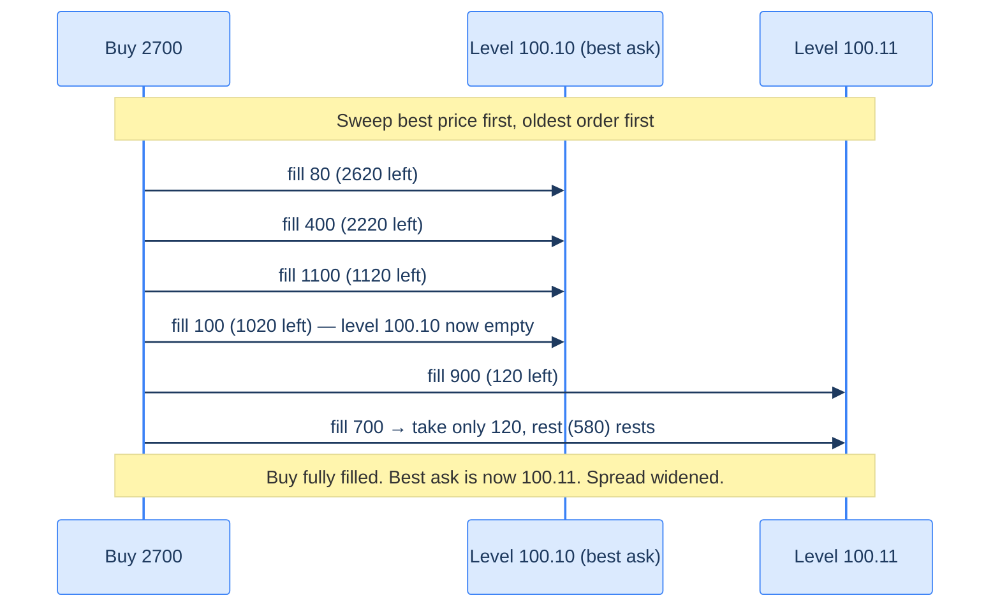

# 57. Stock exchange

## TL;DR
> A stock exchange **matches buyers and sellers** and does it under three constraints that normally pull against each other: **ultra-low latency** (the round trip from order-in to fill-out is measured in *microseconds* at the top of the market), **fairness** (whoever was first must be served first — latency advantages are worth real money, so the system must be provably even-handed), and **absolute correctness** (a dropped or reordered event can mis-execute trades and corrupt the market). The heart of the system is the **matching engine**, which holds an **order book** per symbol and matches incoming orders by **price-time priority** — best price first, and *within* a price, oldest order first. The book is built so place / cancel / match are all **O(1)** (a hash map of price levels, each a doubly-linked FIFO queue, plus an order-ID index). The non-obvious centerpiece is the **sequencer**: a **single writer** that stamps every order and every fill with a strictly increasing sequence number *before* the engine sees it. That one decision buys three things at once — **fairness** (the sequence *is* the arrival order), an **exactly-once** guarantee (gaps in the numbers are detectable), and **deterministic replay** (feed the same numbered events to a fresh engine and you get the *identical* fills). Determinism is what makes the engine recoverable: the exchange is **event-sourced** — the numbered log of events is the source of truth, and current state is a *fold* over that log, so a crashed engine rebuilds by replaying. And the surprising production shape is the *opposite* of "scale out": the fastest exchanges run the matching engine **single-threaded, in memory, on one core, on one machine**, sharing data between components through a memory-mapped event store with **no network and no disk on the hot path** — because the network hop you avoid is the microsecond you win. This is also the capstone arc itself: requirements → estimation → API + data model → architecture (a D2 pipeline + a Mermaid matching/recovery sequence) → deep dives → edge cases → trade-offs → prototype.

## 1. Motivation

On **August 1, 2012**, the trading firm **Knight Capital** deployed new software to its order-routing servers — and a dormant flag flipped on a piece of dead code on one of eight servers. For **45 minutes** after the market opened, that server fired millions of unintended orders into the market, buying high and selling low, over and over, faster than any human could react. By the time it was halted, Knight had taken on billions in unwanted positions and lost about **$440 million** — more than the firm was worth. It was nearly insolvent by lunchtime and was acquired within months. No data center burned down; no network partitioned. A *correctness* bug, executed at machine speed against a market that does exactly what you tell it to, was enough.

That is the tension that makes the exchange the most demanding capstone in this book. A URL shortener that drops a write loses a link; an exchange that mis-orders two events can mis-execute a trade, and the mistake is *final* and *priced in dollars*. So an exchange has to be three things that usually fight each other: **fast** (the latency arms race between NASDAQ, NYSE, and the firms colocated in their data centers is measured in microseconds — being a microsecond faster than a rival is, as one designer put it, like having an oracle that sees a little into the future), **fair** (if speed is money, the order in which the system processes arrivals must be beyond dispute), and **correct** (every order, fill, and cancel accounted for, exactly once, recoverable after any crash). Hold those three in your head at once and most of the design follows.

It's also a wonderful capstone because the answer *inverts* the instinct this book has been building. Every prior capstone scaled by *adding boxes* — shard the store, fan out the cache, push to the edge. The exchange scales the matching engine by doing the **opposite**: one thread, one core, one machine, everything in memory, because the moment you cross a network or touch a disk on the hot path you've spent the microseconds you were trying to save. Coordination is the enemy here, not the tool. We'll pin the **requirements**, do the **back-of-envelope estimation**, sketch the **API** and **data model** (the order book is a data-structure puzzle worth savoring), draw the **architecture** (a D2 pipeline and a Mermaid matching/recovery sequence), then go deep on the four ideas that carry the design — **price-time matching**, the **single-writer sequencer**, **event sourcing for recovery**, and the **latency techniques** — before closing with the races that break it and the trade-offs that define it. Let's build it.

## Try it with the coach

Before you read the design, work through it yourself. The coach runs the same six-step interview — restate the problem, estimate, choose an approach, plan it, sketch the implementation, then stress-test it — and pushes back at each gate. There's no code editor here; you reason in prose, the way you would at a whiteboard. (Sign in to start; your conversation is kept in your browser as you go.)

<div class="concept-coach"></div>

## 2. Requirements and scope

Pin down *what we're building* before *how* — and here the "how" is dictated almost entirely by the three constraints from §1.

**Functional:**
- **Place an order:** a client submits a **limit order** (a buy or sell at a fixed price) — `POST /v1/order` — and receives matched **executions** (also called **fills**) in real time.
- **Cancel an order:** withdraw a resting order that hasn't been fully filled yet.
- **View market data:** the real-time **order book** (the live list of resting buy and sell orders by price) and **historical prices** (candlestick charts).
- *In scope but secondary:* **risk checks** (the exchange is a regulated venue — e.g. cap a user at 1M shares of one symbol per day) and a **wallet** check (withhold the funds an order needs so a user can't overspend).

**Non-functional (these *are* the design):**
- **Latency, and especially *tail* latency.** The round trip — market order in, filled execution out — must be low *and stable*. The metric that matters is the **99th-percentile** (and stricter, the 99.99th) latency: a design that's fast on average but occasionally stalls is unacceptable, because that stall lands on a real trade. Top exchanges drive this into the **tens of microseconds**.
- **Fairness.** Equal participants must be treated equally: orders processed in true arrival order, and market data delivered to all subscribers *simultaneously* (§9). Fairness isn't a nicety here — it's a regulatory and reputational requirement.
- **High throughput.** Support **billions of orders per day** across the symbol set, with brutal **bursts** at the open and the close.
- **Correctness + availability.** Aim for **99.99%** availability (≈ **8.6 seconds** of downtime *per day* — even seconds of outage during market hours is a headline), with **near-zero data loss** (RPO ≈ 0) and **second-level recovery** (RTO). Every order and fill accounted for **exactly once**.

**Out of scope:** options, futures, and other instruments (stocks only); after-hours trading; the full settlement/clearing pipeline (we note where the **reporter** hooks in); and conditional/market-order variants beyond the limit order (we focus on the limit order, the foundational case). Naming the boundary is part of the design — a real exchange is a multi-year build.

## 3. Back-of-envelope estimation

Numbers first ([estimation](/cortex/system-design/foundations/back-of-envelope-estimation)) — they set the throughput target, the latency budget, and the in-memory footprint. We'll size against a single-to-medium venue with the proportions of a real one: **~100 symbols** and **1 billion orders/day** (NYSE itself trades on the order of *billions of matches* a day, so this is a deliberately honest figure, not a toy). The market is open **6.5 hours** (9:30am–4:00pm ET).

| Quantity | Calculation | Result |
|---|---|---|
| Average order rate | 1B ÷ (6.5 × 3,600 s) | **~43,000 orders/s** |
| Peak order rate (~5× at open/close) | 5 × 43,000 | **~215,000 orders/s** |
| Latency budget (target, top of market) | round trip, order→fill | **tens of µs** |
| Order-book memory | ~100 symbols × resting orders | **fits in RAM, easily** |
| Per-event size on the bus | order/fill record | **~hundreds of bytes** |

Two of those numbers settle real decisions. **The latency budget rewrites the architecture.** Walk the naive path — gateway → order manager → sequencer → matching engine, each on its own box over the network — and the costs stack up fast: a single round-trip network hop is **~500 microseconds**, so a few hops put you into *single-digit milliseconds*, and persisting events to disk in the sequencer adds *tens of milliseconds* on top. That total — *tens of milliseconds* — was respectable a decade ago and is hopeless today. To reach *tens of microseconds* you must **remove the network and the disk from the hot path entirely** (§8). **The order book fits in memory.** ~100 symbols, each with a manageable depth of resting orders, is *kilobytes-to-megabytes* of state — there is no reason to involve a database on the matching path at all. That single fact (in-memory, small) is what unlocks the single-thread, single-machine design that the latency budget *demands*. The two numbers agree: go in-memory, stay on one box.

## 4. API and data model

The API design and data model come *after* the high-level shape here, because — as Xu's walk-through notes — they lean on concepts (the order book, executions) that the architecture introduces. We'll preview the contracts now and the structures with them.

**API.** Clients reach the exchange through a **broker** (Schwab, Robinhood, Fidelity), and the broker talks to the exchange's **client gateway**. Retail brokers use a RESTful interface; latency-sensitive institutions use a binary protocol over a dedicated connection (a REST round trip is far too slow for a market maker), but the *functionality* is the same. Designed with the discipline from [Lesson 33](/cortex/system-design/application-architecture/api-design):

```
POST /v1/order              {symbol, side: buy|sell, price, quantity, orderType: limit}
  200 OK                    {id, status: new|filled|canceled, filledQuantity, remainingQuantity, ...}

DELETE /v1/order/{id}       cancel a resting order
  200 OK                    {id, status: canceled}
  409 Conflict             (already matched — too late to cancel)

GET /v1/execution?symbol=&orderId=&startTime=&endTime=    query fills
GET /v1/marketdata/orderBook/L2?symbol=&depth=           live order book, N levels deep
GET /v1/marketdata/candles?symbol=&resolution=&...       historical candlestick data
```

Order placement is naturally **idempotent-friendly** ([Lesson 19](/cortex/system-design/distributed-patterns/idempotency-retries-backoff)): a client supplies a `clientOrderId`, so a retry after a timeout doesn't mint a duplicate order — the gateway dedupes on it. The cancel races the fill (§9), which is why it can return `409`.

**Data model — three core entities.** An **order** is the *inbound instruction*; an **execution (fill)** is the *outbound matched result*; a **product** describes a tradable symbol (tick size, lot size, currency) and barely changes, so it's static and cacheable. A single match produces **two fills** — one for the buy side, one for the sell side.

```
Order                          Execution (fill)
  orderId      UUID              execId       UUID
  productId    int               orderId      UUID    (which order it fills)
  side         buy|sell          side         buy|sell
  price        long              price        long
  quantity     long              quantity     long    (the filled amount)
  orderStatus  new|filled|...    orderStatus  new|filled|...
  userId       long              userId       long
  clientOrderId string           transactionTime long
```

A crucial point that shapes everything downstream: **on the critical trading path, orders and fills are *not* written to a database.** They live in memory and are persisted only to the in-memory **event store** for fast recovery (§6, §8); a separate, off-the-hot-path **reporter** is what writes the durable records used for reconciliation, tax, and compliance. The hot path touches no disk.

The **order book** itself is the most interesting structure, and we give it its own deep dive (§6.1).

## 5. High-level design

The system traces the **life of an order** through a pipeline. Three flows share that pipeline, with very different latency demands: the **trading flow** (the critical, microsecond path), the **market-data flow** (build and publish the order book + candlesticks), and the **reporting flow** (durable records, latency-insensitive). The pipeline (D2):

```d2
direction: right
broker: Broker / client
gw: Client gateway\n(auth · validate · rate-limit · FIX) { shape: hexagon }
om: Order manager\n(state · risk · wallet)
seq: Sequencer\n(single writer — stamps seq IDs) { shape: hexagon }
me: Matching engine\n(order book · price-time match)
mdp: Market data publisher\n(order book + candlesticks)
ds: Data service { shape: cylinder }
rep: Reporter (off hot path)
db: Reporting DB { shape: cylinder }

broker -> gw: "place / cancel order"
gw -> om: "validated order"
om -> seq: "order (for risk-checked send)"
seq -> me: "sequenced order"
me -> seq: "fills (buy + sell)"
seq -> om: "sequenced fills"
om -> broker: "executions"
me -> mdp: "execution stream"
mdp -> ds: "market data (L1/L2/L3, candles)"
ds -> broker: "real-time market data"
me -> rep: "orders + fills"
rep -> db: "consolidated records"
```

Walk an order through it. **(1)** A client places an order via a broker. **(2)** It enters at the **client gateway** — the gatekeeper that does authentication, input validation, rate limiting, and protocol normalization (often FIX, the *Financial Information eXchange* protocol, the lingua franca of trading since 1991). The gateway is on the critical path, so it stays *lightweight* — it does the bare minimum and forwards fast; anything heavy is pushed downstream. **(3)** The **order manager** runs the **risk checks** (is the user under their daily limit?) and the **wallet** check (are there sufficient funds to withhold?), then manages the order's *state* — and the tangle of state transitions is the order manager's main source of complexity, which is exactly why it's **event-sourced** (§6.3). **(4)** The order goes to the **sequencer**, which stamps it with a monotonically increasing **sequence ID** (the keystone — §6.2). **(5)** The **matching engine** matches it against the **order book**, emitting **two fills** per match, which flow *back* through the sequencer (stamped on the way out too) to the order manager and on to the client.

Off the hot path, the **market-data publisher** consumes the execution stream to rebuild the order book and candlesticks and publishes them through the **data service** to subscribers; and the **reporter** stitches together attributes from inbound orders and outbound fills to write durable records. **Only the trading flow is latency-critical.** The other two are deliberately decoupled — they can lag without slowing a single trade — which is the same lesson as [message queues and streams](/cortex/system-design/distributed-patterns/message-queues-and-streams): separate the fast path from the slow consumers so a slow consumer can never back-pressure the trade.

## 6. Deep dives

### 6.1 The order book and price-time matching

The **order book** is a list of resting buy orders (the *bid* side) and sell orders (the *ask* side), organized by **price level**. The matching engine holds one book per symbol, and it must support, *fast*: place an order, cancel an order, match an order, query the best bid/ask, and walk the price levels. "Fast" here means **O(1)** for the hot operations — at hundreds of thousands of orders a second, an O(n) cancel would be fatal.

The structure that delivers it (the canonical "fast limit order book"):

- A **hash map from price → PriceLevel**, so finding a price is O(1).
- Each **PriceLevel** holds a **doubly-linked list** of orders in arrival order (a FIFO queue) plus a running total volume.
- A separate **hash map from orderId → order node**, so a cancel can find its order in O(1).
- Cached pointers to the **best bid** and **best ask**.

Why those choices? **Place** = append to the tail of a price level's list → O(1). **Match** = pop from the head of the opposite side's best level → O(1). **Cancel** = look the order up in the orderId map, then unlink it — and because the list is *doubly*-linked, the node already knows its predecessor, so the unlink is O(1) (a singly-linked list would force an O(n) scan to find the previous node). FIFO within a price level is what implements **time priority**.

The matching rule is **price-time priority**: serve the **best price** first, and *within* a price, the **oldest order** first. A worked example makes it concrete. Suppose the **ask** (sell) side of AAPL looks like this:

| Price level | Resting sell quantity (oldest → newest) | Cumulative |
|---|---|---|
| **100.10** (best ask) | 80, 400, 1100, 100 | 1,680 |
| 100.11 | 900, 700, 400 | 2,000 |
| 100.12 | 600, 900 | — |

A large **buy order for 2,700 shares** arrives. Price-time priority sweeps from the best ask upward, oldest-first:



The buy order consumes all of level 100.10 (80 + 400 + 1100 + 100 = 1,680), then 900 + 120 from level 100.11 — 2,700 total. The 700-share order at 100.11 is **partially filled** (120 taken, 580 still resting), and the **best ask moves up to 100.11**: the spread widened and the price ticked up. Note what just happened — *one* incoming order produced *several* fills, each a buy/sell pair, and left a partially-filled resting order behind. Partial fills aren't an edge case; they're the normal texture of a market (§9). The same order-book structure is reused, off the hot path, by the market-data publisher to reconstruct the **L1/L2/L3** views (L1 = best bid/ask; L2 = several price levels; L3 = full depth with per-order detail) that brokers resell to clients.

### 6.2 The single-writer sequencer (the keystone)

Here is the idea that makes the whole thing work, and it's worth slowing down for. The **sequencer** is a **single writer** that stamps every inbound order — and every outbound fill — with a **strictly increasing sequence number** *before* the matching engine processes it. One component, one thread, assigning a total order to every event in the system. That one decision buys three things at once:

1. **Fairness.** The sequence number *is* the order of arrival. There is no ambiguity about who was first, no clock-skew argument between machines — the sequencer saw event #4,001,002 before #4,001,003, full stop. Fairness becomes a property of the architecture, not a promise.
2. **Exactly-once + gap detection.** Because the numbers are *consecutive*, a missing number is *detectable*. A downstream that sees …1001, 1002, 1004 knows instantly that 1003 was lost and can request it. Nothing silently vanishes.
3. **Deterministic replay.** This is the deep one. If you feed the *same* numbered sequence of events to a *fresh* matching engine, you get the *identical* sequence of fills — because matching is a pure function of (current book, next event), and the book is itself just the fold of all prior events. **Determinism turns recovery into replay** (§6.3).

Why must it be a **single** writer? Because the goal is a *total order*, and the moment two writers can both assign positions, they must coordinate — and coordination means locks, and locks mean contention and unpredictable tail latency, the one thing an exchange cannot tolerate. DDIA (2e) names this exactly: constructing a **totally ordered event log requires all events to pass through a single leader** that decides the order; this is **total order broadcast**, and it's provably **equivalent to consensus and to a shared log**. A single-writer sequencer is the cheapest, fastest way to get that total order on one machine — no consensus round-trips, just one thread incrementing a counter and stamping events as fast as it can pull them off the components' local ring buffers. (For *availability across* machines you do reach for consensus — Raft-replicating the event store — but that lives off the microsecond hot path; see §9.) The sequencer is *also* effectively a message bus: think of it as two Kafka-like streams welded to the engine — one of inbound orders, one of outbound fills — except built for sub-microsecond, predictable latency that Kafka can't promise.

### 6.3 Event sourcing for recovery

A conventional service stores *current state* in a database: this order is `filled`, that balance is `$900`. The trouble is that current state has *amnesia* — it can't tell you how it got there, and it can't be reconstructed if the process dies with state only in RAM. **Event sourcing** flips it: instead of storing state, you store the **immutable, ordered log of state-changing events** (`NewOrderEvent #100`, `OrderFilledEvent #101`, …), and treat current state as a **fold** (a replay) over that log. The log is the **source of truth**; every in-memory structure — order books, order states, balances — is a *derived view* you can throw away and rebuild. This is precisely DDIA's framing: *"a log of immutable events as the source of truth, deriving materialized views"* — and it's the same machinery the [payment ledger](/cortex/system-design/capstones/payment-system) reaches for and that the [outbox pattern and CDC](/cortex/system-design/distributed-patterns/outbox-pattern-and-cdc) lesson generalizes (record the fact, derive everything else).

Why it's a near-perfect fit for an exchange:

- **Recovery is replay.** A matching engine that crashes has lost only its *derived* RAM state, not the truth. On restart it reads the event store from the last checkpoint and **replays** the numbered events through the same deterministic logic — and because the events are sequenced (§6.2), it lands on the *exact* state it had before the crash. No partial-write reconciliation, no "is the DB consistent?" — just fold the log forward.
- **Hot–warm replicas come for free.** Run a **hot** primary engine and a **warm** secondary that consumes the *identical* sequenced event stream and computes the *identical* state — but stays silent, emitting nothing. When the primary dies, the warm replica is already in lockstep and can take over **immediately**; determinism guarantees it holds the same book down to the order. Across machines, you replicate the event log with a consensus protocol — **Raft** — so the one source of truth survives node loss with near-zero RPO (DDIA again: state-machine replication = the same deterministic events applied in the same order on every node).
- **Auditability.** Regulators ask "what was the book at 10:31:07?" Event sourcing answers by replaying up to that point. You can even **re-run new engine code against the old event log** to check a logic change — the exact question a post-incident review asks. (To keep replay fast, periodically **snapshot** the derived state and fold forward from the snapshot, not from the market open.)

The reason determinism is non-negotiable here connects back to DDIA's warning: replay only reproduces state if the logic is **deterministic** — no wall-clock `NOW()`, no random tie-breaks, no nondeterministic library calls. That's why the sequencer injects *logical* time (the sequence number) and the engine never consults the real clock to make a matching decision: order is what matters, not the timestamp.

### 6.4 Latency techniques — the surprising single-server design

The estimation said the naive multi-box, networked, disk-persisting path costs *tens of milliseconds*, and the target is *tens of microseconds* — a thousand-fold gap. You don't close that by tuning; you close it by **deleting the slow things from the hot path**. There are only two levers ([latency, throughput, and the USL](/cortex/system-design/foundations/latency-throughput-usl)): do **fewer** tasks on the critical path, and make each task **faster**. An exchange pulls both, hard:

- **Put everything on one server.** The single biggest move, and the one that inverts every other capstone. The critical path is gateway → order manager → sequencer → matching engine; if those run on separate boxes you pay ~500µs *per network hop*. Collapse them onto **one machine** and the hops vanish. The fastest real exchanges run essentially the whole engine on **one gigantic server, sometimes one process**.
- **Share state through memory, not the network or disk.** With the components co-resident, they communicate over a **memory-mapped (`mmap`) event store** backed by `/dev/shm` (a RAM-backed filesystem). Sending a message on this bus is **sub-microsecond** and touches *no disk and no network*. The event store from §6.3 *is* this mmap region — persistence and the message bus are the same in-memory structure.
- **Single-threaded matching, pinned to a core.** The matching engine runs as a **single-threaded application loop** — a tight `while` loop polling for the next event — **pinned to one CPU core**. This sounds like throwing away parallelism, but it's the *point*: one thread means **no locks, no lock contention, and no context switches**, which is what crushes the *tail* latency. (The 99.99th percentile is where locks and scheduler jitter show up; remove them and the tail flattens.) The trade-off is real — you must keep every task on that loop short, or one slow task stalls everything behind it — but predictability is worth it.
- **Keep the hot path lean — even drop logging.** Anything not strictly required to match is pushed off the critical path, *including logging*. Logging happens, but asynchronously, off-loop.
- **Kernel bypass for the wire.** The remaining latency is getting bytes from the NIC into the engine. Standard kernel networking adds syscalls and copies; exchanges use **kernel-bypass** networking (e.g. user-space NIC drivers / DPDK-style stacks) so packets land in user memory without the kernel in the path, and a compact **binary encoding** (FIX-over-SBE) so messages are small and parse-free.

The throughline is the inversion: **coordination is the enemy.** Where the URL shortener *added* boxes and caches to scale, the exchange *removes* them — one writer, one thread, one core, one machine, memory only — because every boundary you cross is latency you can't get back. ("The Tail at Scale" makes the general case: at high request rates, *tail* latency dominates user experience, so you engineer the system to have no slow path at all.)

## 7. Putting it together — the order's life as code

An illustrative prototype (not a production engine): the order book with O(1) place/cancel/match, plus the deterministic `handle` loop that the sequencer feeds. It makes the core decisions concrete — price-time matching, partial fills, and why a cancel can lose to a fill.

```python
from collections import OrderedDict, deque

class Order:
    def __init__(self, oid, side, price, qty):
        self.oid, self.side, self.price = oid, side, qty and price
        self.remaining = qty                      # shrinks as it fills

class Book:                                       # one side (bids or asks) of one symbol
    def __init__(self, ascending):
        self.levels = OrderedDict()               # price -> deque[Order], kept price-ordered
        self.ascending = ascending                # asks: best = lowest; bids: best = highest

    def best_price(self):
        if not self.levels: return None
        prices = sorted(self.levels)              # (a real engine caches this pointer)
        return prices[0] if self.ascending else prices[-1]

class MatchingEngine:
    def __init__(self):
        self.asks = Book(ascending=True)          # sell side: serve lowest price first
        self.bids = Book(ascending=False)         # buy side: serve highest price first
        self.index = {}                           # orderId -> Order, for O(1) cancel
        self.next_seq = 1

    def handle(self, event):                      # the sequencer feeds events in order
        if event.seq != self.next_seq:            # gap -> determinism is broken; refuse
            return ("OUT_OF_ORDER", self.next_seq)
        self.next_seq += 1
        return self.match(event.order) if event.type == "NEW" else self.cancel(event.order_id)

    def match(self, order):
        fills, book = [], (self.asks if order.side == "BUY" else self.bids)
        while order.remaining > 0:
            px = book.best_price()
            # limit order: stop if the best price is no longer acceptable
            if px is None or (order.side == "BUY" and px > order.price) \
                          or (order.side == "SELL" and px < order.price):
                break
            queue = book.levels[px]
            resting = queue[0]                    # oldest at this price = time priority
            traded = min(order.remaining, resting.remaining)
            order.remaining   -= traded
            resting.remaining -= traded
            fills.append((order.oid, resting.oid, px, traded))   # buy+sell pair
            if resting.remaining == 0:            # fully consumed -> remove (O(1) popleft)
                queue.popleft(); self.index.pop(resting.oid, None)
                if not queue: del book.levels[px]
        if order.remaining > 0:                   # leftover rests as a new resting order
            own = self.bids if order.side == "BUY" else self.asks
            own.levels.setdefault(order.price, deque()).append(order)
            self.index[order.oid] = order
        return fills                              # may be empty, one, or many

    def cancel(self, oid):
        order = self.index.pop(oid, None)
        if order is None:                         # already fully matched -> too late
            return ("CANNOT_CANCEL_ALREADY_MATCHED", oid)
        own = self.bids if order.side == "BUY" else self.asks
        own.levels[order.price].remove(order)     # O(1) with a doubly-linked node in real code
        if not own.levels[order.price]: del own.levels[order.price]
        return ("CANCELED", oid)
```

The shape *is* the lesson. `handle` refuses any event whose sequence number isn't the one it expects — a gap means determinism is broken, so the engine stops rather than guess. `match` sweeps the opposite book best-price-first and, within a level, oldest-first (`queue[0]`), producing a *list* of fills (zero, one, or many) and leaving any remainder **resting** — partial fills fall out naturally. `cancel` either finds the order in the O(1) index and unlinks it, or discovers it's already gone and returns the "too late" error — the cancel-vs-fill race (§9), made explicit. Feed the same numbered events to a fresh instance and you get identical fills: that's the replay property §6.3 lives on.

## 8. Edge cases and failure modes

- **Partial fills are the norm.** A large order rarely matches one resting order cleanly; it sweeps several, fully consuming some and **partially filling** the last (the 700→580 leftover in §6.1). Both sides must track `remaining` and the order's status walks `new → partially-filled → filled`. Every partial match still emits a buy/sell **fill pair**; downstream consumers must handle a single order producing a *stream* of fills over time.
- **A cancel racing a fill.** A user hits cancel at the same instant their resting order gets matched. There's no paradox *because the sequencer serializes them*: whichever event got the lower sequence number wins, deterministically. If the fill was sequenced first, the order is already gone and the cancel returns **`409 / CANNOT_CANCEL_ALREADY_MATCHED`**; if the cancel was first, the order is pulled and the would-be match simply finds nothing there. The single total order is what dissolves the race — there is no "simultaneous," only "earlier sequence number."
- **Market-data fan-out fairness.** If the publisher pushes the order book to subscribers in connection order, the first to connect always sees prices first — a latency edge worth money, so clients would *fight* to connect first at the open. The fix is to broadcast to all subscribers **at once**: **multicast** (reliable UDP / NACK-based retransmission) delivers one stream to a whole group simultaneously, and/or **randomize** subscriber order. Fairness on the *data* side is as load-bearing as fairness on the *matching* side.
- **Fault recovery via replay.** The matching engine crashes mid-session. Because state is event-sourced (§6.3), recovery is *not* a database reconciliation — the warm replica (already consuming the same sequenced stream) takes over **immediately**, or a cold instance reads the **snapshot + the event tail** from the mmap/Raft-replicated store and **folds forward** to the exact pre-crash book. RPO ≈ 0, RTO in seconds. The determinism guarantee is what makes "just replay it" actually land on the right state.
- **The catastrophic double failure, and the human in the loop.** Hot *and* warm both die — low probability, ruinous impact. Mitigate by **Raft-replicating** the event store across machines and data centers (≥ 3 nodes, majority quorum), so a city-level outage can't take the truth with it. And beware the *correlated* failure: a **bug** that kills the primary will kill an identically-coded warm replica right after failover (the §1 Knight lesson — the failover doesn't help if every node runs the same broken code). So new systems start with **manual** failover and earn automation only after operational confidence; **chaos engineering** surfaces the edge cases before the market does.
- **Tail-latency landmines.** A design that's fast on average but stalls at p99.99 fails a real trade on every stall. The classic culprit in a managed runtime is **garbage collection** (a JVM stop-the-world pause blows the budget); hence pre-allocated **ring buffers** (no per-event allocation), object reuse, and measuring with a high-dynamic-range histogram to *see* the tail, not just the mean.
- **Risk and wallet checks must be on the path but cheap.** It's a regulated venue: the order manager must verify the daily-volume cap and **withhold funds** for a resting order *before* it reaches the book (so a user can't overspend by stacking orders). These are correctness-critical but must stay microsecond-cheap, which is why they're simple lookups, not joins.

## 9. Trade-offs

| Decision | Option | Why |
|---|---|---|
| Deployment shape | **single server / single process** vs scale-out cluster | the network hop you avoid is the microsecond you win; in-memory state is tiny, so co-locate everything and delete the hops |
| Matching concurrency | **single-threaded, core-pinned** vs multi-threaded | one thread = no locks, no context switches → a *flat tail*; throughput is recovered by going in-memory and lean, not by adding threads |
| Ordering | **single-writer sequencer** vs distributed timestamps | a total order needs one leader (DDIA: total-order broadcast); it delivers fairness + gap-detection + deterministic replay in one stroke |
| State model | **event sourcing (log = truth)** vs mutable DB rows | replay makes recovery exact and auditable, and hot-warm replicas come for free; cost is more moving parts and snapshotting to keep replay fast |
| Hot-path persistence | **mmap event store (RAM)** vs disk / Kafka | sub-microsecond and disk-free on the critical path; Kafka would be the right tool *if* its latency were low and predictable enough — it isn't |
| Market-data delivery | **multicast / randomized order** vs connection-ordered push | everyone must get prices simultaneously, or first-to-connect gets a paid-for edge — a fairness (and regulatory) failure |
| Availability across boxes | **Raft-replicated log + manual→auto failover** vs naive hot-warm | survives node/DC loss with RPO≈0; manual failover first guards against a bug knocking out every replica at once (the §1 lesson) |

## 10. Practice

> **Exercise 1 — Why a *single* writer?**
> A teammate proposes two sequencers running in parallel "to double throughput and add redundancy." Why does that break the design, and what does the single sequencer actually buy you that two can't?
>
> <details>
> <summary>Solution</summary>
>
> Two writers cannot produce a single **total order** without coordinating, and coordination means **locks/consensus on the hot path** — exactly the contention and unpredictable tail latency an exchange must avoid (they'd "fight for the right to write"). The whole value of the sequencer is that it imposes *one* unambiguous order, which delivers three things at once: **fairness** (the sequence number *is* arrival order — no clock-skew dispute), **exactly-once + gap detection** (consecutive numbers make a missing event obvious), and **deterministic replay** (the same numbered events fed to a fresh engine reproduce the identical fills, which is what makes recovery just "fold the log forward"). DDIA frames it precisely: a totally ordered log requires all events to pass through a single leader — this is *total order broadcast*, equivalent to consensus. Redundancy doesn't come from a *second concurrent* sequencer; it comes from a **backup** sequencer (and a Raft-replicated event store) that takes over only on failure — off the hot path.
>
> </details>

> **Exercise 2 — Walk the book.**
> The **ask** side of a symbol is: **100.10** → [50, 300] (oldest→newest), **100.11** → [200], **100.12** → [400]. A **market-style buy for 600 shares** arrives. Which resting orders fill, in what order, what's left resting, and what's the new best ask?
>
> <details>
> <summary>Solution</summary>
>
> Price-time priority sweeps the best (lowest) ask first, oldest order first. **100.10:** fill 50 (550 left), then 300 (250 left) — level 100.10 now empty. **100.11:** the 200 order fills (50 left). **100.12:** take **50** of the 400 order — buy is now complete (600 filled). Result: the orders for 50, 300, and 200 are **fully filled and gone**; the 400-order at 100.12 is **partially filled** (50 taken, **350 still resting**); the **new best ask is 100.12**. The single 600 buy produced **four fills** (50, 300, 200, 50), and the spread/price moved up two levels — the everyday texture of partial fills and price discovery.
>
> </details>

> **Exercise 3 — Recover from a crash.**
> The matching engine process dies at 11:00:00 with its order books only in RAM. Walk through how it comes back to the *exact* pre-crash state — and name the one property of the engine without which this wouldn't work.
>
> <details>
> <summary>Solution</summary>
>
> The lost RAM state was only a **derived view**; the **source of truth** is the sequenced, immutable **event log** in the mmap event store (replicated via Raft). Recovery: either the **warm replica** — which was consuming the *same* sequenced stream and computing the *same* state in lockstep — takes over **immediately**; or a cold instance loads the latest **snapshot** and **replays the event tail** from the snapshot's sequence number forward, folding the events through the same matching logic until it reaches the pre-crash book. Because every event carries a consecutive sequence number, the engine knows it has them all (gaps are detectable) and lands on the *identical* state. The indispensable property is **determinism**: the engine must be a pure function of (book, next event) — no wall-clock reads, no random tie-breaks — or replaying the same events would *not* reproduce the same fills. RPO ≈ 0, RTO in seconds.
>
> </details>

## In the Wild

- **["System Design Interview" Vol. 2 (Alex Xu & Sahn Lam), Ch. 13 — Stock Exchange](https://www.amazon.com/System-Design-Interview-Insiders-Volume/dp/1736049119)** — the canonical written walk-through this capstone builds on: the order manager → sequencer → matching engine → market-data pipeline, the O(1) order book, the single-writer sequencer, event sourcing for recovery, the single-server/mmap latency design, and the fairness/multicast/colocation discussion.
- **[LMAX — The Disruptor (Martin Thompson et al.)](https://lmax-exchange.github.io/disruptor/)** — the open-source ring-buffer at the heart of the LMAX exchange, the reference implementation of the §6.4 ideas: a single-threaded, lock-free, pre-allocated, mechanically-sympathetic event-processing loop doing millions of ops/sec with predictable latency. The paper is a masterclass in *why* coordination kills the tail.
- **[Designing Data-Intensive Applications (Kleppmann, 2e) — total order broadcast, state-machine replication, and event sourcing](https://dataintensive.net/)** — the rigorous basis for §6.2–§6.3: a totally ordered log requires a single leader (total order broadcast ⟺ consensus ⟺ a shared log), deterministic state-machine replication keeps replicas identical, and an immutable event log as the source of truth makes derived views disposable and replayable.
- **[NASDAQ / exchange matching-engine architecture — "How Exchanges Work" (engineering talks & writeups)](https://www.nasdaq.com/solutions/nasdaq-matching-engine)** — the production reality behind the §1 latency arms race and the §8 colocation/fairness rules: in-memory matching, deterministic sequencing, and microsecond budgets at real venues.
- **["The Tail at Scale" (Dean & Barroso, CACM 2013)](https://research.google/pubs/the-tail-at-scale/)** — the foundational argument for why §8 obsesses over the *tail*: at scale, p99/p99.99 latency — not the mean — governs the experience, so you engineer away every slow path (GC pauses, lock contention, context switches) rather than averaging them out.

---

> **Next:** [Capstones overview](/cortex/system-design/capstones) — the stock exchange is where this set's lessons converge and *invert*: every other capstone scaled by adding boxes, caches, and replicas; this one scaled by *removing* them — one writer, one thread, one core, one machine, memory only — because at microsecond budgets coordination is the cost, not the cure. Determinism, total ordering, and event sourcing aren't exotic here; they're the load-bearing walls. Revisit the other designs with that lens and you'll see the same trade-off everywhere, just dialed to a different point.
