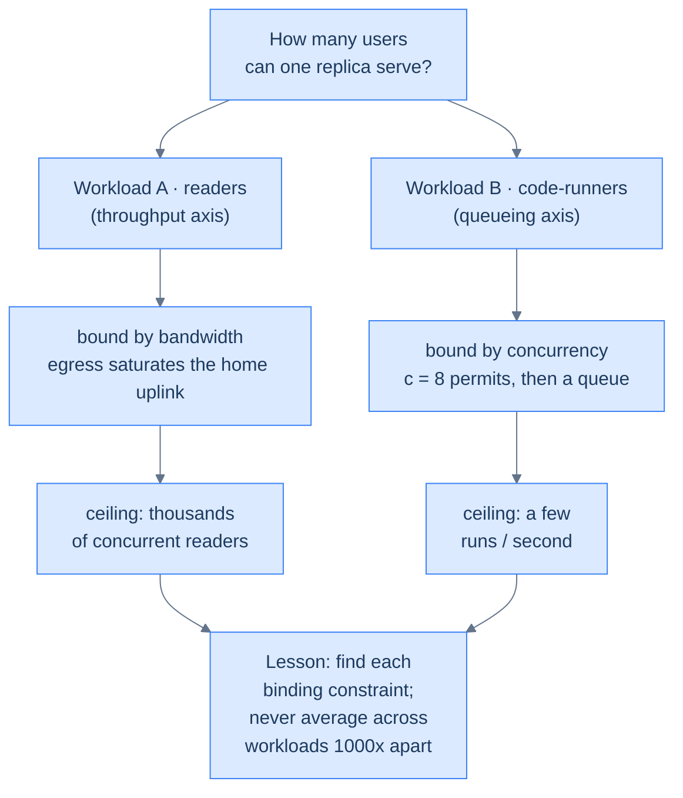

# 59. Cortex capacity today

## TL;DR
> Cortex has **two workloads with capacities three orders of magnitude apart**, so you must size them separately. **Readers** are nearly free: a chapter is an in-memory lookup (~0.5 ms CPU), so one 1-vCPU replica can push **hundreds to low-thousands of requests/second** before CPU — but the real ceiling is the **home upload link**, not the pod (≈500 reads/s of 25 KB pages ≈ 100 Mbit/s, saturating a typical residential uplink). Since humans read for ~30 s between clicks, that's on the order of **thousands of concurrent readers**. **Code-runners** are the opposite: `/api/run` is an **M/M/c queue with c = 8 servers** (the semaphore), and capacity is `8 ÷ mean service time`. With a ~2 s typical Python run that's **~4 runs/second** sustained; with a ~20 s cold Scala compile it's **~0.4 runs/second** — and the **9th simultaneous "Run" click waits** behind a permit. Two independent ceilings stack on top: the **rate limit** caps *rate* (anon 10/60 s, auth 100/hour), the **semaphore** caps *concurrency* (8). The lesson is the one every capacity exercise teaches: **find the binding constraint, and don't average across workloads that differ by 1000×.**

## 1. Motivation

"How many users can it handle?" is the question every capacity chapter answers, and the wrong way to answer it is a single number. *DDIA* frames "how many users" as a **scalability** question — a system's ability to cope with increased load — and is blunt that it has no single answer: you first have to say *which load parameter* is growing and *which performance number* you refuse to let degrade. Cortex makes the trap vivid: a number that's true for readers (*thousands*) is off by a factor of a thousand for code-runners (*a handful per second*). "It does X requests/second" averaged across both is meaningless for the same reason a mean response time is — it describes a request *no one actually issues*, because the two request *classes* don't cost remotely the same thing. So we do what [back-of-envelope estimation](/cortex/system-design/foundations/back-of-envelope-estimation) always demands: **separate the workloads, find each one's binding resource, and state the assumptions out loud** — with the [latency numbers](/cortex/system-design/foundations/numbers-every-engineer-should-know) close at hand, because a chapter read and a Scala compile sit on opposite ends of that landscape.

Two vocabulary distinctions from the [latency / throughput lesson](/cortex/system-design/foundations/latency-throughput-usl) carry the whole chapter, so pin them now. **Throughput** is *how many per second* the system completes; **latency** (more precisely, *response time*) is *how long one request takes* — and it decomposes into service time (actually working), queueing delay (waiting for a free server), and network latency (in flight). The two axes are coupled by queueing: as throughput climbs toward capacity, the queue — and therefore response time — grows, gently at first and then off a cliff. Readers are a *throughput* story bounded by bandwidth; code-runners are a *queueing* story bounded by concurrency. Different axis, different binding resource, different ceiling.



<p align="center"><strong>One question, two workloads on two axes — each with its own binding resource and its own ceiling.</strong></p>

The components we're sizing — the read path, the three-store hello path, and the semaphore-gated run path — are this LikeC4 component view of the server:

<iframe
  src="/c4/view/capstones_cortexplatform_components"
  width="100%"
  height="440"
  style="border: 1px solid var(--border, #2b2b2b); border-radius: 8px;"
  loading="lazy"
  title="Cortex server — request pipelines"
></iframe>

## 2. Workload A — readers (the cheap path)

This is the textbook back-of-envelope drill: **state an estimate, pick the candidate bottlenecks, and find the one that binds first.** The numbers below are deliberately round and order-of-magnitude — that is the point of a BOTE, not a defect. We are deciding a *class* of answer ("the pod is fine; the link is the limit"), not auditing a meter.

**What a read costs.** A chapter GET is: route match → map lookup in the in-memory index → write ~25 KB to the socket. No DB, no Redis. Call it **~0.5 ms of CPU** (generous; it's mostly serialization). Walk the four candidate bottlenecks:

| Candidate | Math | Ceiling |
|---|---|---|
| **CPU** | 1 vCPU ÷ 0.5 ms/req | **~2,000 req/s** (pessimistic 2 ms → ~500) |
| **Network egress** | 500 req/s × 25 KB | **~100 Mbit/s — saturates a home uplink** ← binds first |
| **Heap / GC** | transient 25 KB buffers vs ~768 MiB usable | not the bind (hundreds of concurrent buffers fit easily) |
| **In-memory index** | O(1) map lookup, rebuilt only on mtime change (never in prod) | not a throughput bind (a fixed memory cost) |

**The binding constraint is the home upload link, not the pod.** The CPU could do ~500–2,000 req/s; the residential uplink taps out around 500 reads/s of full 25 KB pages (less if pages are smaller and the link is fatter, but the *shape* holds: egress binds before CPU). This is the [numbers lesson's](/cortex/system-design/foundations/numbers-every-engineer-should-know) home-internet reflex made literal: a payload is *latency*-bound while it's small and *bandwidth*-bound once it's large, and 25 KB × 500/s is firmly in bandwidth territory — exactly the regime where the last-mile pipe, not the CPU, is the wall. When egress is the wall, the lever is never "faster code" (the CPU has headroom to spare); it's "move the bytes closer to the reader" — i.e. a CDN, which is why this same egress line is what ch 51/53 act on.

**Translate to humans — and don't confuse a *rate* with a *count*.** A reader clicks roughly once per **30 s** of reading, so a connected reader is almost always *thinking*, not fetching — the request stream is bursty and mostly idle. Converting the request *rate* the box can serve into the *number of humans* it supports is a Little's-Law move (`concurrency = rate × time-in-system`, the [USL lesson's](/cortex/system-design/foundations/latency-throughput-usl) `L = λ × W`): at a conservative 300 req/s budget and a 30 s think-time, `L ≈ 300 × 30 ≈ 9,000` concurrent readers the *CPU* could serve — with the uplink and the single replica (a restart drops them all) being the real limits. The distinction matters because "9,000 readers" and "300 requests/second" are the *same fact* viewed on two axes; quoting either alone hides half the picture, exactly as the [concurrent-connections exercise](/cortex/system-design/foundations/back-of-envelope-estimation) in lesson 03 warns. Play with it — punch Cortex's numbers into the estimator (`writesPerUser = 0`; readers don't write the book):

```d3 widget=estimation-calculator
{
  "title": "Cortex readers — back-of-envelope (the egress line is the headline)",
  "peakFactor": 3,
  "replicationFactor": 1,
  "presets": [
    { "name": "Cortex today (~30 readers/day)",     "dau": 30,     "writesPerUser": 0, "readsPerUser": 40, "bytesPerWrite": 25000 },
    { "name": "Cortex modest (1k readers/day)",      "dau": 1000,   "writesPerUser": 0, "readsPerUser": 40, "bytesPerWrite": 25000 },
    { "name": "Cortex 'front page' day (100k)",      "dau": 100000, "writesPerUser": 0, "readsPerUser": 40, "bytesPerWrite": 25000 }
  ]
}
```

(`replicationFactor = 1` — single Postgres, and the markdown isn't replicated, it ships in the image. `bytesPerWrite` doubles as "bytes per read" for the egress estimate. Watch "Egress at peak" — that's the number that decides when you need a CDN, which is exactly [ch 62's](/cortex/system-design/capstones/scaling-cortex-like-leetcode) stage 4 — now **shipped and measured** in [ch 64](/cortex/system-design/capstones/cortex-edge-delivery), which recomputes this very egress ceiling after compression + the edge.)

## 3. Workload B — code-runners (the expensive path)

This is the heart of the chapter. `/api/run` is an **M/M/c-flavoured queue** with **c = 8 servers** — the eight semaphore permits. Each "service" is one sandboxed execution in go-judge; the **9th concurrent run blocks** on `gate.withPermit` until a permit frees. The HTTP client gives each run 100 s before it gives up, but go-judge's own wall-clock limit (30 s interpreted, 120 s Scala) fires first by design. The naming is worth saying out loud: *M/M/c* is Kendall's shorthand for **M**arkovian (memoryless/Poisson) arrivals, **M**arkovian (exponential) service, and **c** parallel servers behind one shared queue — the exact shape the [USL lesson](/cortex/system-design/foundations/latency-throughput-usl) formalises. Real runs aren't perfectly Poisson, but the *structure* — c servers, then a queue — is dead-on, and that structure is what dictates the ceiling.

That ceiling is **Little's Law read at saturation.** `L = λ × W` says in-flight work equals arrival rate × time-in-system; the permits *cap* in-flight service at `L = c = 8`, so the most work the pool can complete per second is `λ_max = L ÷ W = c ÷ E[service]`. It is the same identity that sized the readers, pointed the other way: there we knew the rate and solved for concurrency; here we know the concurrency (8 permits) and solve for the rate. One equation, both workloads.

**Service times (state the assumption — and keep mean and tail in separate boxes):** the [latency lesson](/cortex/system-design/foundations/latency-throughput-usl) is emphatic, after DDIA, that the **mean** is the right number for *capacity math* (it is the `W` in `λ_max = c ÷ W`) but a misleading one for *felt experience*, where you quote **percentiles**. Both columns below earn their keep: the **mean service** drives sustained throughput; the **wall-clock cap** is the worst-case tail a runaway loop can inflict on a permit. Quoting only the mean hides the permit a 30 s timeout can pin; quoting only the cap makes a fast pool look hopeless.

| Language class | Typical mean service | Wall-clock cap |
|---|---|---|
| Interpreted (Python/JS/TS/SQL) | **~2 s** (most snippets < 1 s) | 30 s |
| JVM — Java/Kotlin | ~8–15 s (compile + run) | 30 s / 90 s |
| JVM — **Scala** (cold `scala-cli`) | **~20 s** (compile + JVM spin-up dominate) | 120 s |

**Peak sustained throughput is the Little's-law corollary just derived:** `λ_max = c ÷ E[service]`. Push offered load past it and throughput does *not* keep climbing — it plateaus at `λ_max` and the excess turns into queue (§5's simulator shows this flattening directly).

| Mix | λ_max (sustained) | Worst-case (every run hits the cap) |
|---|---|---|
| Interpreted, 2 s mean | **8 ÷ 2 = 4 runs/s** (~240/min) | 8 ÷ 30 = 0.27/s (~16/min) |
| Scala, 20 s mean | **8 ÷ 20 = 0.4 runs/s** (~24/min) | 8 ÷ 120 = 0.067/s (**~4/min**) |

So the visceral number: **on one replica, eight people clicking "Run" on a Scala snippet hold the entire pool for ~20 seconds, and the ninth waits.** That ninth run is **head-of-line blocking** in its purest form — the [latency lesson's](/cortex/system-design/foundations/latency-throughput-usl) term for a fast request stuck behind a slow one, inheriting a wait its own service time never earned. A one-line Python `print` that arrives when all eight permits are held by Scala compiles waits ~20 s for a job that would run in milliseconds. (DDIA's reason for measuring response time *client-side* lands here: go-judge's own timer sees only the fast execution; the permit wait is invisible to the executor and visible only to the user.) For Python the pool clears in ~2 s, but the *structure* is identical — eight servers, then a queue.

**Feel the cliff.** This is M/M/1 (one permit), but it's exactly what each of the eight permits does as offered load approaches its share of capacity. The shape to watch for is the M/M/1 response-time law `W = (1/µ) × 1/(1 − ρ)`: the wait inflates as `1/(1 − ρ)`, so it's ~2× the service time at ρ = 0.5, ~10× at ρ = 0.9, and **→ ∞ as ρ → 1**. That curve is *why* production systems target **~60–70% utilisation, not 100%** — the last few percent of "efficiency" buy a latency cliff and zero headroom for a burst. Drag ρ toward 1 and watch the wait explode — authored with the Scala service time, where the cliff is dramatic:

```d3 widget=queueing-simulator
{
  "title": "/api/run permit queue — service ≈ a 20 s Scala compile; drag ρ to feel the 9th-run wait",
  "serviceTimeMs": 20000,
  "initialRho": 0.7
}
```

And the interpreted regime, where the same cliff exists but clears in seconds:

```d3 widget=queueing-simulator
{
  "title": "Same queue, ~2 s Python service — gentler, but the cliff is still there",
  "serviceTimeMs": 2000,
  "initialRho": 0.7
}
```

## 4. Two ceilings, not one: rate vs concurrency

A subtlety that trips people up: Cortex has **two independent back-pressure layers**, and they limit different things.

- The **rate limiter** caps *rate*: anonymous **10 runs / 60 s per IP**, authenticated **100 runs / 3600 s per user** (Redis fixed-window). It stops one client from *flooding* over time.
- The **semaphore** caps *concurrency*: **8 runs at once, globally**. It stops the *instantaneous* load on go-judge from exceeding what the executor node's RAM can hold (8 × up to ~1 GiB).

They compose: a single authenticated user may fire 100 runs/hour, but only **8 execute simultaneously** — the rest serialize through the permits. The semaphore is the *global* protection; the rate limit is the *per-client* one. You need both, because they defend against different attacks (a slow flood vs a concurrent burst).

The cleanest way to keep them straight is **units**: the rate limit is measured in *runs per unit time* (a flow), the semaphore in *runs in flight* (a level). They're the two factors of Little's Law pinned independently — `λ` capped per-client, `L` capped globally — which is also why neither subsumes the other. A nightclub makes the analogy concrete: the **fire-code occupancy** (a fixed *number* inside at once) is the semaphore, sized to the room; the **door policy** ("one group every few minutes per guest list") is the rate limit, sized to fairness. Raising the door cadence never lets more bodies past the occupancy sign; raising occupancy never stops one VIP from cutting in repeatedly. Different limits, different jobs — exactly the [capacity-planning lesson's](/cortex/system-design/production-operations/capacity-planning-and-autoscaling) warning that you must pick the *right control signal* for the resource you're actually protecting (here: go-judge RAM is a concurrency level, so it gets a concurrency limit — not a rate one).

## 5. Build It — an M/M/c simulator you can re-point

The whole capacity argument in one runnable model. It simulates `c` permits and an offered run-rate, and prints throughput and the mean wait — change `c` to see what [ch 62's](/cortex/system-design/capstones/scaling-cortex-like-leetcode) "autoscale the executor fleet" actually buys:

```python run
import random

def simulate(c, arrival_rate_per_s, mean_service_s, horizon_s=600, seed=1):
    """A tiny discrete-event M/M/c: c permits, Poisson arrivals, exponential service."""
    rng = random.Random(seed)
    free = c
    waiting = 0                      # runs that have arrived but hold no permit yet
    busy_until = []                  # completion times of in-service runs
    t, served = 0.0, 0
    next_arrival = rng.expovariate(arrival_rate_per_s)
    while t < horizon_s:
        # advance to the next event: an arrival or the earliest completion
        next_done = min(busy_until) if busy_until else float("inf")
        if next_arrival <= next_done:
            t = next_arrival
            waiting += 1
            next_arrival = t + rng.expovariate(arrival_rate_per_s)
        else:
            t = next_done
            busy_until.remove(next_done); free += 1
        while free > 0 and waiting > 0:           # dispatch waiting runs onto free permits
            waiting -= 1; free -= 1; served += 1
            busy_until.append(t + rng.expovariate(1 / mean_service_s))
    return served / horizon_s, served

for label, rate, svc in [("Python 3 runs/s", 3.0, 2.0), ("Python 6 runs/s (overload)", 6.0, 2.0),
                         ("Scala 0.3 runs/s", 0.3, 20.0), ("Scala 0.6 runs/s (overload)", 0.6, 20.0)]:
    thru, n = simulate(8, rate, svc)
    print(f"{label:28} → throughput ~{thru:.2f} runs/s over the window ({n} served)")
print("\nLesson: throughput saturates at c / service = 8/2 = 4 (Python) or 8/20 = 0.4 (Scala).")
print("Push arrivals past that and runs queue — raising c (the executor fleet) is the fix.")
```

The takeaway the simulator makes concrete: throughput **plateaus at `c ÷ service`** no matter how hard you push arrivals — past that, the excess just queues. So the only way to raise the ceiling is to raise `c` (more permits *and* more executor capacity behind them) or lower service time (warm the Scala compiler) — both of which are scaling moves, not config tweaks. Note *which* `c` to raise: this is the [capacity-planning lesson's](/cortex/system-design/production-operations/capacity-planning-and-autoscaling) "scale the bottleneck, not the wrong tier." More *web* replicas do nothing for run throughput — they'd just point more load at the same executor pool, the way autoscaling app pods into a maxed database makes things worse. The binding `c` is the executor's, and it must grow *before* you raise `MaxConcurrentRuns` (§8, Exercise 2).

One structural choice the model bakes in is worth naming: those 8 permits are a **single shared pool**, not eight private queues — and that is the strictly better design. The [USL lesson's](/cortex/system-design/foundations/latency-throughput-usl) pooling-beats-partitioning result shows a shared queue absorbs bursts that independent queues cannot (some permit is usually free even when arrivals clump), so one gate of 8 beats, say, eight per-language gates of 1 at both the mean wait and the tail. `gate.withPermit` over a single semaphore is exactly that shared pool.

## 6. Trade-offs

| Decision | Choice | Why | Cost |
|---|---|---|---|
| Run admission | **semaphore (concurrency)** + **rate limit (rate)** | Defends go-judge RAM *and* prevents floods | The 9th concurrent run waits — felt most on Scala |
| Service-time variance | **per-language wall caps** | A runaway loop can't hold a permit forever | A legit slow Scala compile eats a permit for ~20 s |
| Reader capacity | **in-memory index, no DB** | Makes reads ~free → thousands of concurrent readers | Index lives in the 1 GiB heap (ties to [ch 60](/cortex/system-design/capstones/cortex-failure-thresholds)) |

## 7. Edge cases

- **A class hits "Run" together.** 30 students, one Scala block, one click: 8 run, 22 queue behind ~20 s services — the last sees a ~55 s wait, near the 100 s client timeout. This is the **non-Poisson** caveat the [USL lesson](/cortex/system-design/foundations/latency-throughput-usl) flags: a synchronised classroom click is a *correlated* burst, not the smooth memoryless arrivals M/M/c assumes, so the instantaneous queue is far deeper than the steady-state average — the long-run rate can be trivial (one lesson an hour) and the room still stalls for a minute. Headroom matters *more* under bursts, not less, and the fix is more permits + executors ([ch 62](/cortex/system-design/capstones/scaling-cortex-like-leetcode)), not a bigger single box.
- **One user, many runs.** Rate-limited to 100/hour (auth), and only 8 concurrent — so a single user can't starve the pool indefinitely, just briefly.
- **Anonymous burst.** Capped at 10/60 s per IP — but if Redis is down the limiter *fails open* (ch 49), and then only the semaphore stands between an anonymous flood and go-judge. This is the case to keep the semaphore honest for: with the rate limit gone, the concurrency cap is the *sole* backstop, and the alternative to "runs queue, then succeed" is "go-judge OOMs, runs fail, clients retry, retries add load" — the **metastable / retry-storm** failure the [latency lesson](/cortex/system-design/foundations/latency-throughput-usl) warns can keep a system wedged even after the flood passes. A bounded queue degrades gracefully; an unbounded crash does not.

## 8. Practice

> **Exercise 1 — Size the run pool.**
> You want to sustain **30 Python runs/minute** with the current 2 s mean service. Does the semaphore of 8 suffice? What about 30 Scala runs/minute?
>
> <details>
> <summary>Solution</summary>
>
> 30 runs/min = 0.5 runs/s. Capacity is `8 ÷ 2 = 4 runs/s` for Python — so **yes, easily** (0.5 ≪ 4; utilisation ρ ≈ 0.125). For **Scala** (20 s service), capacity is `8 ÷ 20 = 0.4 runs/s = 24/min` — so **30 Scala runs/min exceeds capacity** (ρ = 0.5/0.4 = 1.25 > 1), the queue grows without bound and runs start timing out. To hit 30 Scala/min you'd need `c ≥ rate × service = 0.5 × 20 = 10` permits *and* the executor RAM/CPU to back them. This is why the same pool feels fine for Python and falls over for Scala — the binding number is service time, and Scala's is 10× Python's.
>
> </details>

> **Exercise 2 — Why not just raise the semaphore to 64?**
> A teammate says "concurrency problems? bump `MaxConcurrentRuns` to 64." What breaks?
>
> <details>
> <summary>Solution</summary>
>
> The semaphore caps concurrency precisely to bound **go-judge's memory**: each heavy JVM run can use ~1 GiB of sandbox, so 8 concurrent ≈ up to 8 GiB. Raise it to 64 and a burst of JVM runs would try to use ~64 GiB — far past any homelab node, so go-judge gets **OOM-killed** (or the kernel starts killing sandboxes), turning a *queue* (runs wait, then succeed) into a *crash* (runs fail, executor restarts). The semaphore isn't a throttle you tune for throughput; it's a **safety limit matched to executor RAM**. Raising real concurrency means raising executor *capacity* first (more nodes), then the limit — [ch 62's](/cortex/system-design/capstones/scaling-cortex-like-leetcode) stage 2.
>
> </details>

## Your Turn

Before you move on, check your understanding with the coach — explain the idea, apply it, weigh the trade-offs, then defend your reasoning.

<div class="concept-coach"></div>

## 9. In the Wild

- **[`CodeRunPipeline.scala`](https://github.com/ani2fun/cortex)** — `MaxConcurrentRuns = 8`, the `gate.withPermit` that *is* the queue, and the 100 s client timeout. The whole §3 model is ~30 lines of real code.
- **[Little's Law](https://en.wikipedia.org/wiki/Little%27s_law)** — `L = λW`; the `λ_max = c ÷ service` ceiling is its steady-state corollary. The [USL / queueing lesson](/cortex/system-design/foundations/latency-throughput-usl) derives the cliff the widgets show.
- **[Judge0](https://judge0.com/) / [go-judge](https://github.com/criyle/go-judge)** — the sandbox lineage; real judges run a *fleet* of these behind a queue, which is precisely the scaling story.

---

> **Next:** [60. Cortex failure thresholds](/cortex/system-design/capstones/cortex-failure-thresholds) — capacity tells you the steady-state ceiling; this tells you what actually *breaks* when you cross it, in priority order. Spoiler: the single replica and the 1 GiB limit are #1 and #2, and they're the same incident.
