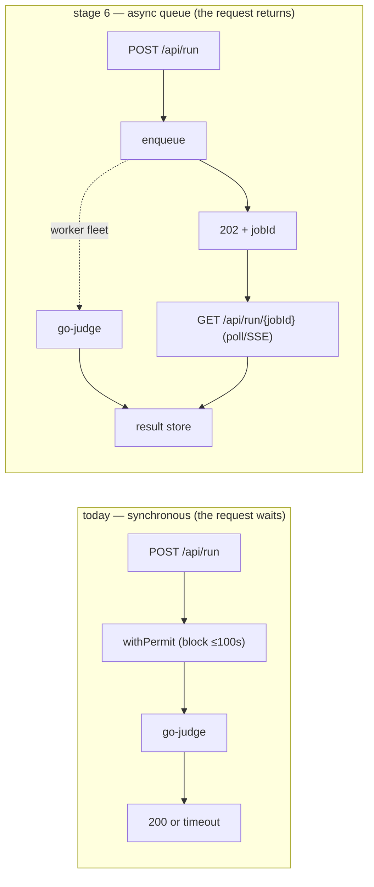

# 62. Scaling Cortex like LeetCode

## TL;DR
> Cortex is *already* most of the way to stage 1 — it's a near-stateless process with externalized state and GitOps deploys — so the roadmap is short and the order is everything. **Stage 1:** run **N replicas** behind the existing edge (move the per-pod semaphore to a **Redis-backed distributed limiter** first, or you'll double go-judge's load) — now a restart isn't an outage. **Stage 2 (the big one):** externalize and **autoscale the go-judge fleet** — the executor is the real bottleneck for a code-runner, and run throughput becomes `M workers × per-worker concurrency`. **Stage 3:** **pgbouncer** + **Postgres read replicas** + a **Redis cluster** so the data tier stops being the cap. **Stage 4:** push the immutable book to a **CDN** — the read path leaves the origin almost entirely (this is the URL-shortener's "answer it at the edge" move). **Stage 5:** multi-region read replicas. **Stage 6 (the move that *defines* a judge platform):** replace the synchronous `gate.withPermit` with an **async submit→queue→poll** judge — bursts queue instead of timing out at 100 s, exactly how LeetCode/HackerRank actually run. Each stage *unlocks* a capacity and *exposes* the next bottleneck; the throughline is that **the executor fleet (stage 2) and the async queue (stage 6) are what turn Cortex from "a site that runs code" into "a system that runs code at scale."**

## 1. Motivation

Most "how would you scale this?" answers are a shopping list — "add caching, add replicas, add a queue." The useful version is an **ordered** path where each step states *what it unlocks*, *what new bottleneck it exposes*, and *roughly what capacity you have after*. Order matters because doing them out of sequence breaks things: add replicas before you make the semaphore distributed and you double go-judge's load; add a CDN before the content is truly immutable-per-deploy and you serve stale chapters. Cortex is a good subject precisely because it's *close to* scalable — so the roadmap reveals which moves are real architecture and which are just config.

There are only two ways to make any tier carry more load. You can **scale up** (a bigger box — more cores, more RAM) or **scale out** (more boxes behind a balancer). Scale-up is the path of least effort, but its cost grows *faster* than linearly and bottlenecks mean a 2× machine rarely does 2× the work — DDIA's blunt summary. Scale-out is the *shared-nothing* move: each node has its own CPU, RAM, and disk, and the only coordination is over the network — it can scale near-linearly *if* you've done the work that makes a node independent (statelessness for compute, sharding for state). That "if" is the whole game, and it's why this chapter is staged rather than a single leap: you can't make the web tier stateless and the executor a fleet and the store sharded all at once. The realistic frame is DDIA's — **an architecture that fits one level of load rarely survives 10× it, so you re-plan roughly once per order of magnitude**, and never more than one order ahead. This chapter is exactly one such 100× thought experiment, not a forever-blueprint.

The discipline underneath the ordering is identifying **what binds first**. At any moment one resource is the ceiling; relieve it and the ceiling *moves* to whatever was second — the bottleneck doesn't disappear, it relocates. (We make capacity ceilings and the latency cliff that precedes them quantitative in [05 latency/throughput/USL](/cortex/system-design/foundations/latency-throughput-usl), and turn ceilings into fleet sizes in [39 capacity & autoscaling](/cortex/system-design/production-operations/capacity-planning-and-autoscaling).) Two structural facts shape every stage below. First, Cortex's reads (chapters, blog) and its writes/runs are *wildly* asymmetric — like most online services it is read-heavy — and **reads and writes scale by different mechanisms**: you scale reads with **caching** and **replication** (cheap copies of immutable or slowly-changing state), and you scale writes with **sharding** (splitting one hot resource into many independent ones). Second, the executor is *compute*, not data — so its scaling story is a stateless fleet, while Postgres's is a stateful one, and the two obey different rules.

Here's the target end-state as a LikeC4 view — stateless tier behind a CDN, executor fleet behind a queue, pooled/replicated stores:

<iframe
  src="/c4/view/capstones_cortexplatform_scaled"
  width="100%"
  height="460"
  style="border: 1px solid var(--border, #2b2b2b); border-radius: 8px;"
  loading="lazy"
  title="Cortex platform — scaled target architecture"
></iframe>

## 2. The staged roadmap

| Stage | Move | Unlocks | New bottleneck exposed | Capacity after |
|---|---|---|---|---|
| **0 — today** | 1 replica, semaphore=8, single stores | works | the single replica; the 8-permit pool | [ch 59](/cortex/system-design/capstones/cortex-capacity-today): thousands of readers, ~4 runs/s |
| **1 — stateless + HPA web tier** | N replicas behind the edge; move the semaphore to a **Redis-backed distributed limiter** | reader throughput scales horizontally; **restart ≠ outage** | go-judge (web tier can now outrun one executor); PG connections = N × 10 | readers: uplink/edge-bound; runs still ~8 |
| **2 — autoscale the go-judge fleet** | a pool of executors (HPA); dispatch across them | run throughput = **M × per-worker concurrency** | executor node RAM/CPU; scheduling fairness; PG under the new load | runs scale ~linearly with executors |
| **3 — pool + replicate the data tier** | **pgbouncer**, Postgres **read replicas**, **Redis cluster** | DB stops being the cap; reads + limits scale | **writes** on the single PG primary; replica lag | web + reads to tens of thousands/s |
| **4 — CDN the static book** | push the immutable per-deploy book/blog to a **CDN/edge** | reader load leaves the origin almost entirely | origin is now ~purely dynamic (run + coach); cache invalidation on deploy | readers: effectively unbounded |
| **5 — multi-region read replicas** | replicate book + PG reads to regions; route to nearest | global low-latency reads; regional redundancy | cross-region **write** consistency (a roaming learner); lag | global reads |
| **6 — async judge queue** | replace `gate.withPermit` with **submit → 202 + job id → poll/stream** | spikes **queue** instead of timing out; priority/fairness; decouple web ↔ executor | queue depth + worker autoscaling policy; result delivery | run throughput bounded only by the fleet + queue |

Read the table top-to-bottom and a shape appears: it walks **outward through the tiers**, relieving whatever binds next. Stages 1–2 scale the **stateless compute** — put a [load balancer](/cortex/system-design/building-blocks/load-balancing) in front of N identical web pods and an autoscaled executor fleet behind it; because these nodes hold no durable state, horizontal scale is "just" run more of them (the part that *isn't* free — the in-pod semaphore — is precisely what stage 1 externalizes). Stages 3–5 scale the **stateful data tier**, which is the harder half: state can't simply be cloned and forgotten, so you split read-scaling (pooling, [replication](/cortex/system-design/building-blocks/replication), the [CDN](/cortex/system-design/building-blocks/caching)) from write-scaling (eventually, [sharding](/cortex/system-design/building-blocks/sharding-and-partitioning) the primary). Stage 6 then changes the *coupling* between the two halves — turning a synchronous call into a queue so a burst on the stateless edge no longer has to be absorbed *synchronously* by the executor. Each row's "new bottleneck" is the previous row's relief landing on the next tier out: that's the bottleneck-relocation principle made operational.

The same idea as a chain — each stage relieves one ceiling and the bind *moves* to the next tier out, which is why the order is fixed rather than a menu:

```mermaid
---
config:
  theme: base
  themeVariables:
    primaryColor: "#dbeafe"
    primaryBorderColor: "#3b82f6"
    primaryTextColor: "#1e3a5f"
    lineColor: "#64748b"
    secondaryColor: "#ede9fe"
    tertiaryColor: "#fef9c3"
---
flowchart LR
  S0["Stage 0<br/>binds: 1 web pod"] -->|"stage 1: N pods + distributed limiter"| S1["binds: the executor<br/>(web now outruns one go-judge)"]
  S1 -->|"stage 2: autoscale the fleet"| S2["binds: Postgres<br/>(connections, then reads)"]
  S2 -->|"stage 3: pgbouncer + read replicas"| S3["binds: origin read load<br/>+ writes on the primary"]
  S3 -->|"stage 4: CDN the immutable book"| S4["binds: synchronous run path<br/>(bursts time out)"]
  S4 -->|"stage 6: async judge queue"| S5["binds: fleet size + queue policy"]
```



<p align="center"><strong>The bottleneck never disappears — it relocates. Each stage relieves one tier and hands the ceiling to the next.</strong></p>

## 3. Stage 2 is the real bottleneck (and stage 6 is the real architecture)

Two stages deserve emphasis because they're the ones that actually make Cortex *a judge platform* rather than a site that happens to run code.

**Stage 2 — the executor fleet.** A code-runner's defining cost is execution, and [chapter 59](/cortex/system-design/capstones/cortex-capacity-today) showed run throughput is `c ÷ service`. The only way to raise it is more `c` *backed by real capacity*. So you turn the single go-judge into an autoscaled **fleet** of M workers and dispatch across them — now capacity is `M × 8 ÷ service`. Five executor nodes ≈ 5× the runs/second. The reason this *can* scale near-linearly is that runs are **embarrassingly parallel and share nothing**: each submission is an isolated sandbox that touches no other run's state, so there is no [coherency cost](/cortex/system-design/foundations/latency-throughput-usl) (the USL's `β` term — the quadratic cross-talk of nodes reconciling shared state) to drag the curve back down. The only residual contention (the `α` term) is whatever is *centralized* in the dispatch path — the distributed limiter, the job store — so keeping that path thin is what preserves the linear slope. This is exactly the workload that scales best, and exactly why "more executors" is real architecture, not wishful thinking. The dispatch itself is a [load-balancing](/cortex/system-design/building-blocks/load-balancing) problem, and **[sharding](/cortex/system-design/building-blocks/sharding-and-partitioning) the work across workers** is how you avoid a central coordinator that would itself become the contention point; consistent hashing keeps a given submission sticky to a worker (cache warmth, in-flight affinity) and reshuffles only ~`1/M` of the load when the fleet scales — versus naïve modulo, which reshuffles almost everything:

```d3 widget=consistent-hash-ring
{
  "title": "Sharding the executor fleet — drag node/vnode counts, watch which runs remap",
  "nodeCount": 5,
  "nodeRange": [1, 12],
  "virtualNodes": 8,
  "virtualNodeRange": [1, 50],
  "keyCount": 32
}
```

**Stage 6 — the async judge queue.** Today `/api/run` is *synchronous*: the request holds a connection through `gate.withPermit` and waits up to 100 s. Under a burst, the 9th-and-beyond runs *wait inside the request*, and past ~100 s they *error*. The deeper problem is that a synchronous call **couples** the stateless edge to the stateful-throughput executor: the client's connection *is* the buffer, so overload has nowhere to go but the wait, and then the timeout. Real judges don't do this — they **accept the submission, return a job id immediately, and stream/poll the result** while a worker fleet drains a queue. The queue is the [decoupling](/cortex/system-design/foundations/latency-throughput-usl) move from the queueing-theory lesson: pushing synchronously-blocked work behind a buffer lets the user's response time (`W`) drop *even though the work still takes the same time*, and lets the executor fleet run at its own pace. A burst becomes queue depth (absorbed) instead of timeouts (errors) — the same shock-absorber DDIA describes for fan-out spikes, where deliveries are enqueued and allowed to take a little longer rather than dropped. This is the single move that most changes the system's character:



## 4. Stage 3 — when the data tier becomes the cap

Once the web tier and executors scale, the bottleneck **relocates inward** to Postgres, and it does so in two distinct ways — because read-scaling and write-scaling are different problems with different tools.

The *first* squeeze is **connections**: N replicas × a 10-connection pool exhausts a single primary's connection budget long before its CPU is busy. **pgbouncer** (a connection pooler) is the fix — many app instances multiplex onto a small set of real backend connections, the same "pool the work, don't fragment it into N small queues" lesson the queueing chapter proves with its [pooling-vs-partitioning experiment](/cortex/system-design/foundations/latency-throughput-usl).

The *second* squeeze is **read throughput**, and here the leverage is **[replication](/cortex/system-design/building-blocks/replication)**. Like most online services Cortex is read-heavy (the tutor reads far more session/analytics rows than it writes), and DDIA's classic move for a read-heavy workload is **leader-based read-scaling**: keep one primary for writes, add followers, and spread read-only queries across them — you raise read capacity simply by adding followers. This works only with *asynchronous* replication, which is what introduces the one catch a read replica *always* brings: **replication lag**. A follower trails the primary, so a learner who writes a turn on the primary and immediately reads from a replica might not see it yet — the canonical **read-your-writes** hazard (a temporary, eventually-consistent inconsistency, not data loss). Feel the trade with the lag cursor:

```d3 widget=replication-lag
{
  "title": "Read replicas bring lag — a turn written on the primary, read from a replica",
  "lagMs": 80,
  "lagRange": [0, 500],
  "readDelayMs": 30,
  "readDelayRange": [0, 500],
  "writeCount": 5,
  "writeIntervalMs": 100
}
```

(For the tutor, the fix is "read-your-writes" consistency on the session you're actively coaching — route a learner's own reads to the primary, send everyone else's analytics reads to replicas. This is DDIA's exact rule of thumb: read a user's *own* recently-written data from the leader, everything else from a follower. The general pattern is in the [replication](/cortex/system-design/building-blocks/replication) and [consistency-models](/cortex/system-design/building-blocks/consistency-models) lessons.)

Replicas scale *reads*; they do nothing for *writes*, because every write still lands on the one primary. That's why the stage-3 row names **writes on the single primary** as the next bottleneck. When (if ever) write volume outgrows one box, the tool changes from replication to **[sharding](/cortex/system-design/building-blocks/sharding-and-partitioning)** — split the keyspace across N independent primaries so 10 nodes carry ~10× the write throughput, the move Notion made on a 20 TB Postgres table. The two are orthogonal and production systems do both, but the order is deliberate: replication is cheap and reversible, while the partition key is an *irreversible* design decision you defer until the writes actually demand it. For Cortex, that day is far off — runs are compute, not durable writes, and the session/turn write rate is small — so sharding stays a labelled box on the diagram, not a stage you rush.

## 5. Build It — sync vs async under a burst

The stage-6 payoff, made concrete: the same burst of submissions, served synchronously (with a timeout) vs queued. Watch how many *succeed*:

```python run
def serve_burst(submissions, permits=8, service_s=20, client_timeout_s=100, mode="sync"):
    """A burst of N submissions arriving at once; how many complete vs error?"""
    if mode == "sync":
        # each submission must START within client_timeout_s or it errors.
        # with `permits` servers and FIFO, submission i (0-based) starts at floor(i/permits)*service.
        completed = errored = 0
        for i in range(submissions):
            start_wait = (i // permits) * service_s
            if start_wait <= client_timeout_s:
                completed += 1
            else:
                errored += 1
        return completed, errored
    else:
        # async: everything is accepted (202) and queued; nothing errors, it just drains over time.
        drain_time = (submissions / permits) * service_s
        return submissions, 0, drain_time

burst = 60  # 60 people hit "Run" on a 20s Scala block at once
c, e = serve_burst(burst, mode="sync")
print(f"SYNC : {c} completed, {e} ERRORED (waited past the 100s client timeout)")
c2, e2, drain = serve_burst(burst, mode="async")
print(f"ASYNC: {c2} completed, {e2} errored — queue drains in ~{drain:.0f}s (everyone gets a result)")
print("\nSame capacity (8 permits, 20s service). Sync turns overload into ERRORS; async turns it into WAIT.")
```

The numbers make the architectural point: with 8 permits and a 20 s service, a synchronous burst of 60 **errors out everyone past the ~100 s timeout window**, while the async queue **completes all 60** — it just takes ~150 s to drain. Same hardware, same throughput ceiling (`8 ÷ 20 s` either way); the queue doesn't add capacity, it adds a **buffer** that absorbs the burst instead of forcing each waiter to hold an open connection past its timeout. That is the difference between *overload-as-failure* and *overload-as-latency*, and it is almost always the trade you want — a slow result beats an error. (The deeper warning from the queueing lesson still applies: a buffer turns a spike into a wait only while the *average* arrival rate stays under the drain rate; sustained overload past `M × 8 ÷ service` just grows the queue without bound, which is why stage 6 pairs with stage 2's fleet and with autoscaling on **queue depth per worker**, not raw request count.)

## 6. Trade-offs

| Stage | Buys | Costs |
|---|---|---|
| 1 stateless + HPA | redundancy; reader scale | must make the semaphore distributed first; N× PG connections |
| 2 executor fleet | the run-throughput ceiling rises linearly | more nodes to run; dispatch/fairness logic |
| 3 pool + replicas | DB stops being the cap | replica lag → read-your-writes care |
| 4 CDN | origin sheds the read load | cache invalidation on deploy; analytics granularity |
| 6 async queue | bursts queue, never error | result-delivery plumbing (poll/SSE); a job store; UX for "pending" |

## 7. Edge cases

- **Distributed-limiter race.** Moving the semaphore to Redis trades a perfect in-process count for an approximate distributed one — pick a token-bucket/Lua approach so two replicas can't both think a permit is free.
- **CDN serving stale chapters.** The book is immutable *per deploy*, so a deploy must invalidate the CDN (or use content-hashed URLs) — otherwise readers see the old chapter until TTL. This is just the *invalidation* half of the [caching lesson's](/cortex/system-design/building-blocks/caching) two hard problems, applied at the edge tier: content-hashed URLs sidestep it entirely because a new deploy is a *new* key, never a stale one.
- **Autoscaling the executor into a downstream that can't scale.** When you autoscale the go-judge fleet (stage 2), scale it on a signal that *falls as you add workers* — queue depth per worker — not raw submission count or CPU, and watch that more executors don't simply hammer Postgres or the job store harder. Scaling compute into a fixed downstream is the classic way autoscaling *amplifies* an outage rather than absorbing it; see [39 capacity & autoscaling](/cortex/system-design/production-operations/capacity-planning-and-autoscaling).
- **Queue + stuck worker.** Async needs visibility timeouts: if a worker dies mid-run, the job must reappear for another worker, not vanish — the same at-least-once delivery the [message-queues lesson](/cortex/system-design/distributed-patterns/message-queues-and-streams) covers.

## 8. Practice

> **Exercise 1 — Order matters.**
> A teammate wants to set `replicas: 3` today to "handle more load." Walk the two things that break, and what must change first.
>
> <details>
> <summary>Solution</summary>
>
> Two breakages. **(1) The semaphore.** `MaxConcurrentRuns = 8` is *per pod*, so 3 replicas = a global cap of **24** concurrent runs, not 8 — go-judge could suddenly see 3× the load (up to ~24 GiB of sandboxes), blowing past the RAM bound the semaphore exists to enforce (a rank-3 crash from [ch 60](/cortex/system-design/capstones/cortex-failure-thresholds)). **(2) Postgres connections.** Each pod has a 10-connection Hikari pool, so 3 pods = up to 30 connections against a single primary — closer to exhausting it. **What must change first:** move the run limiter to a **Redis-backed distributed limiter** (so the global cap stays 8 across all pods), and put **pgbouncer** in front of Postgres (so N pods share a bounded connection set). Only *then* is `replicas: 3` safe. This is exactly why stage 1 lists "make the semaphore distributed" as a prerequisite, not an afterthought.
>
> </details>

> **Exercise 2 — The one move.**
> If you could make only *one* change to take Cortex from "handles a person clicking Run" to "handles a classroom submitting at once," which stage, and why that one?
>
> <details>
> <summary>Solution</summary>
>
> **Stage 6 — the async judge queue.** A classroom is a *burst*: 30 people submit within seconds. Synchronously, that burst slams into the 8 permits and the back of the line waits past the 100 s timeout and **errors** (the §5 simulation: 60 synchronous submissions mostly error). The async queue accepts all of them (202 + job id) and **drains the burst over time** — nobody errors, they just wait and poll. It's the single change that turns *overload-as-failure* into *overload-as-latency*, which is the defining property of a real judge platform. (Stage 2 — the executor fleet — raises the *throughput* so the queue drains faster, so they're best together; but if you can only do one, the queue is what stops the classroom from seeing errors.)
>
> </details>

## Your Turn

Before you move on, check your understanding with the coach — explain the idea, apply it, weigh the trade-offs, then defend your reasoning.

<div class="concept-coach"></div>

## 9. In the Wild

- **[LeetCode / HackerRank judge architecture](https://en.wikipedia.org/wiki/Competitive_programming)** — real online judges run a worker **fleet** behind a **submission queue**; stages 2 + 6 are their core shape.
- **[`CodeRunPipeline.scala`](https://github.com/ani2fun/cortex)** — the synchronous `gate.withPermit` that stage 6 replaces. The whole roadmap starts from these ~30 lines.
- **[42. URL shortener](/cortex/system-design/capstones/url-shortener)** §8 — the "answer it at the edge" CDN move (stage 4) in its purest form. **[43. News feed](/cortex/system-design/capstones/news-feed)** — fan-out + queue patterns that stage 6 echoes.
- **[The Twelve-Factor App](https://12factor.net/)** — Cortex's near-12-factor design is *why* stage 1 is mostly free; the gaps (in-pod semaphore) are exactly what stage 1 fixes.

---

> **Next:** [63. Making Cortex data-intensive](/cortex/system-design/capstones/cortex-data-intensive) — the final move: the fire-and-forget logs and the per-turn token usage are *already* latent event streams. Turn them on and Cortex grows analytics, leaderboards, recommendations, and a labeled dataset of how people actually learn.
