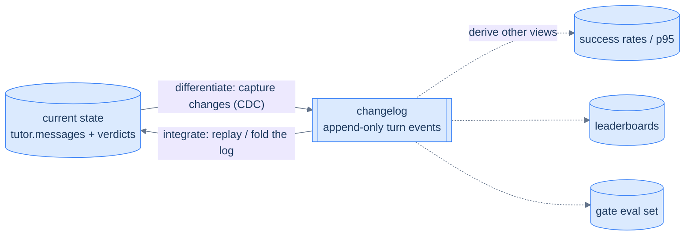
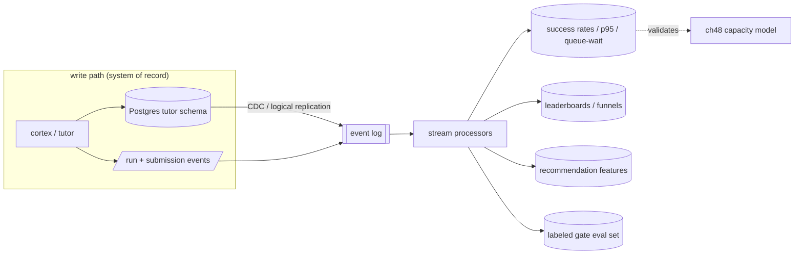

# 63. Making Cortex data-intensive

## TL;DR
> Cortex is **one schema change away from being a data-intensive application** — because the raw material already exists, fire-and-forgotten. Today the Mongo `hello_events` log is an `insertOne` nobody reads, and every coaching turn records a rich `TurnUsage` + `GateVerdict` that just sits in Postgres. **Turn those into event streams** — emit structured `run`, `submission`, and `coach_turn` events to an append-only log — and the whole DDIA toolbox opens up: **derived data** (per-language success rates, p95 run latency, queue-wait distributions that *validate [ch 59's](/cortex/system-design/capstones/cortex-capacity-today) model with real numbers*), **analytics & leaderboards** (hardest problems = lowest gate pass-rate), **recommendations** (next problem from a learner's verdict history — the [recommendation capstone](/cortex/system-design/capstones/recommendation-serving) applied to Cortex's own data), and a genuinely valuable **labeled dataset**: every turn is a `(student answer, step, verdict, coach reply)` tuple — a corpus for *evaluating and tuning the gate itself*. Feed it with **CDC** (change-data-capture) from the Postgres system-of-record instead of dual-writes, and you have a clean batch+stream pipeline. The lesson: **data-intensive isn't a rewrite; it's noticing that your logs are already a product.**

## 1. Motivation

"Data-intensive" sounds like a different *kind* of system — Kafka, Spark, a warehouse, a team. But the on-ramp is almost always the same humble realization: **the events you're already throwing away are worth keeping.** [Kleppmann's framing](https://dataintensive.net/) is that a data-intensive app is one where the *data* — its volume, complexity, and rate of change — is the primary challenge, not the compute. Cortex's compute is trivial (serve markdown, run a sandbox); its *data* — how thousands of people reason through problems, where they get stuck, which gate verdicts were right — is the latent asset. This chapter is about turning exhaust into product, and it's the natural capstone to the capstone: once you've sized, hardened, and scaled the system, the question becomes *what is it actually generating?*

The single most clarifying idea DDIA gives you here is the split between a **system of record** and **derived data**. A system of record (a *source of truth*) holds the authoritative copy of a fact, written exactly once; if anything else disagrees with it, the system of record is right *by definition*. Derived data is anything you computed *from* that source — an index, a cache, a materialized view, a leaderboard, a trained model. Derived data is redundant on purpose: lose it and you rebuild it from the source. **The entire chapter is one move applied over and over: name Cortex's systems of record, then derive valuable views from them — and keep those views in sync through a log.** In Cortex the `tutor` Postgres schema (sessions, messages, verdicts) is a system of record; a per-language success-rate table, a leaderboard, a recommendation feature store, and a gate-evaluation set are all *derived* — and that distinction is what tells you it's safe to drop and recompute any of them.

## 2. The raw material is already there

Two sources, both currently under-used:

- **The fire-and-forget log.** `HelloPipeline` does `insertOne(hello_event)` and forgets it ([ch 61](/cortex/system-design/capstones/cortex-storage-and-cost): unbounded, no reader). It's the *seed pattern* — a write-only event sink — applied to the least interesting event (a visit).
- **The per-turn record.** Every coaching turn already carries a `GateVerdict` (verdict, score, `rubricHits`, `missing`, `hint`) and a `TurnUsage` (tokens, `costUsd`). That's a *labeled, structured* event — it just isn't streamed anywhere.

DDIA's deepest reframing is that these two views — *the current state in a table* and *the stream of events that produced it* — are **two sides of the same coin**. The `tutor.messages` table is the state; the sequence of "a turn happened" events is the changelog that, replayed in order, *reconstructs* that state. (Kleppmann's mnemonic: state is the event stream **integrated** over time; the change stream is the state **differentiated** by time. Accountants have done this for centuries — the ledger is the append-only log of events, and the balance sheet is a *derived* view you get by adding the ledger up.) You don't have to choose between them: store the log durably and the state becomes *reproducible*. That single insight is what makes everything below — rebuildable views, CDC, the gate eval set, reprocessing — possible rather than aspirational.



Generalize the first pattern to the valuable events and you have streams worth processing:

```d2
direction: right
sources: Sources (already happening) {
  run: /api/run → run events
  sub: /api/submissions → submission events
  turn: coach turn → verdict + usage
  visit: /api/hello → visit events
}
log: Event log / topic { shape: queue }
proc: Stream processors
views: Derived stores {
  metrics: success rates, p95 latency, queue-wait { shape: cylinder }
  board: leaderboards / funnels { shape: cylinder }
  recs: recommendation features { shape: cylinder }
  eval: labeled gate dataset { shape: cylinder }
}
sources.run -> log
sources.sub -> log
sources.turn -> log
sources.visit -> log
log -> proc
proc -> views.metrics
proc -> views.board
proc -> views.recs
proc -> views.eval
```

## 3. The five DDIA moves, concrete to Cortex

| DDIA theme | The Cortex move |
|---|---|
| **Event streams from the log** | Generalize `hello_events` into structured `run` (language, runtimeMs, exit, queued-ms), `submission`, and `coach_turn` (step, verdict, tokens) events on an append-only log / Kafka topic. The visit log is the seed; the run + turn streams are the value. |
| **Derived data & materialized views** | From the run stream: per-language **success rate**, **p50/p95 runtimeMs**, and the **queue-wait distribution** — which *measures* the [ch 59](/cortex/system-design/capstones/cortex-capacity-today) M/M/c model against reality. From turns: **step-completion funnels** (clarify→…→test drop-off). |
| **Analytics / leaderboards / recommendations** | "Most-run snippets," "hardest problems" (lowest gate pass-rate), per-learner progress; **next-problem recommendations** from verdict history — the [two-stage funnel](/cortex/system-design/capstones/recommendation-serving) on Cortex's own data. |
| **The tutor's turns as a training/eval asset** | Every turn is `(answer, step, GateVerdict, coach reply)` — a **labeled dataset** to *evaluate the gate* (does Haiku's verdict match human judgement?), tune the rubric, and serve as eval/fine-tune data. Genuinely valuable, already collected. |
| **CDC from Postgres** | The `tutor` schema is the system of record. **Change-data-capture** (logical replication / Debezium-style) streams session/message changes to the analytics store **without dual-writes** — no app-level "write to DB *and* to Kafka," which is the classic dual-write inconsistency the [outbox pattern](/cortex/system-design/distributed-patterns/outbox-pattern-and-cdc) exists to avoid. |



### 3a. Why this is just an *unbundled database*

Here's the unifying idea that makes the diagram above more than a pile of arrows. Inside a single database, when you `CREATE INDEX`, the engine scans a snapshot, builds the index, then keeps it current on every write — the index is a *derived view the database maintains for you via its internal log*. Materialized views, secondary indexes, full-text indexes, replicas: all the same trick, all kept in sync from one ordered stream of changes. DDIA's punchline is that **the dataflow across a whole organization starts to look like one giant database** — and batch/stream processors are just "elaborate implementations of triggers and materialized-view maintenance," with each derived store playing the role of a different *index type*.

That's exactly what Cortex's picture is: the event log is the internal changelog, and the success-rate table, the leaderboard, the recommendation feature store, and the gate eval set are its *indexes* — each a specialized view that the system of record can't serve efficiently on its own. The difference from a packaged database is that these "indexes" live in different stores, run on different machines, and (eventually) are owned by different people. DDIA calls this the **unbundled database**: instead of one product bolting all those features together, you wire small tools together with a log — the Unix "do one thing well, compose with pipes" philosophy applied to data systems. The payoff is **loose coupling**: a slow or failed consumer (say the recs job) just falls behind in the log and catches up later; it can't corrupt the source or stall the leaderboard. (Unbundling is not free — every extra store is a learning curve and an operational quirk. The honest rule: if one database already does everything you need, *use it*; unbundle only when no single product serves all your access patterns. Cortex is nowhere near that line yet — which is the point of treating this as a design lens, not a migration ticket.)

### 3b. Lambda vs. kappa: don't build the views twice

There's a classic trap when you want both *historical* answers (recompute the whole success-rate table from all events ever) and *live* ones (update it as runs happen). The **lambda architecture** answered this with two parallel pipelines — a batch layer reprocessing the full history and a separate speed layer handling recent events — then merged their outputs at read time. It works, but you pay for it twice: the same derivation logic, written and debugged in *two* systems, that must agree or quietly drift. DDIA notes lambda has largely fallen out of use for this reason.

The **kappa architecture** is the cleaner answer Cortex should reach for: **one** engine, **one** copy of the derivation logic, run over a replayable log. "Live" is just consuming from the tail; "historical" is the *same* code consuming from offset 0. The fold in §5 is written exactly this way on purpose — there's nothing in it that knows whether the events are arriving now or being replayed from last month. That property (replay history through the same code that handles the stream) is what turns "rebuild the leaderboard" or "add a brand-new derived view" from a migration project into a button you press.

## 4. The most valuable derived dataset: the gate's own report card

Worth dwelling on, because it's the move that's *unique* to an AI-coaching system. Every turn produces a verdict from the gate **and** the learner's actual answer. Collect them and you have the one thing you need to know whether your AI judge is any good: **a labeled set to grade the grader.** You can ask, on real data, "when the gate said *pass*, would a human have agreed?" — and use the disagreements to tune the rubric or swap the gate model with evidence instead of vibes. This closes the loop the [Claude Stack book](/cortex/the-claude-stack/ai-fluency/diligence) calls *diligence*: the model's output isn't trusted, it's **measured against ground truth you accumulated by running the system.**

## 5. Build It — fold a run stream into a materialized view

The smallest possible version of the whole idea: a stream of run events, folded into a per-language success-rate + latency view. This is what a stream processor does, minus the distribution. Two DDIA properties are doing the quiet work that makes this a *real* pipeline and not just a loop:

- **Deterministic.** The view is a pure function of the events — same events, same order, same view, every time. That's what lets you throw the view away and rebuild it (kappa-style) and trust you got the same answer. (The catch DDIA flags: the moment your derivation touches anything non-deterministic — wall-clock `now()`, a random tie-break, a call to a model — replays diverge. Keep the fold pure; pin such inputs *into* the event.)
- **Idempotent.** Replaying the same event must not double-count. A counter `+= 1` is *not* idempotent on its own; you make it so by tracking the log **offset** you last folded, so re-consuming event #42 is a no-op. That's the whole mechanism behind "exactly-once" in stream processors — deterministic replay + idempotent writes, no distributed transaction required.

```python run
from collections import defaultdict

# A toy stream of run events (what /api/run would emit per execution).
events = [
    {"lang": "python", "ok": True,  "ms": 1200, "queued_ms": 0},
    {"lang": "python", "ok": True,  "ms": 900,  "queued_ms": 0},
    {"lang": "python", "ok": False, "ms": 15000,"queued_ms": 200},   # TLE
    {"lang": "scala",  "ok": True,  "ms": 19000,"queued_ms": 8000},  # cold compile + queue wait
    {"lang": "scala",  "ok": True,  "ms": 21000,"queued_ms": 22000}, # queued behind others
    {"lang": "java",   "ok": True,  "ms": 9000, "queued_ms": 0},
    {"lang": "python", "ok": True,  "ms": 1100, "queued_ms": 0},
]

view = defaultdict(lambda: {"n": 0, "ok": 0, "ms": [], "queued": []})
for e in events:                       # the "fold": replay the log into a derived view
    v = view[e["lang"]]
    v["n"] += 1; v["ok"] += e["ok"]
    v["ms"].append(e["ms"]); v["queued"].append(e["queued_ms"])

def p95(xs): return sorted(xs)[min(len(xs) - 1, int(0.95 * len(xs)))]

print(f"{'lang':7} {'runs':>4} {'success':>8} {'p95 ms':>7} {'p95 queue':>10}")
for lang, v in sorted(view.items()):
    print(f"{lang:7} {v['n']:>4} {v['ok']/v['n']*100:>6.0f}% {p95(v['ms']):>7} {p95(v['queued']):>10}")
print("\nThis derived view IS the data product: success rate per language, and a queue-wait p95")
print("that you'd compare against ch48's predicted ~0 (Python) vs growing (Scala) — model meets reality.")
```

Notice the queue-wait column: Scala runs show real queue time (they're slow, so they pile up), Python shows ~none — *exactly* what the [chapter 59](/cortex/system-design/capstones/cortex-capacity-today) M/M/c model predicts. That's the payoff of streaming: your capacity model stops being a back-of-envelope and starts being a **measured, monitored property** of the live system.

## 6. Trade-offs

| Decision | Choice | Why | Cost |
|---|---|---|---|
| Get data into the stream | **CDC from Postgres** | no dual-write inconsistency; the DB stays the source of truth | a CDC pipeline to run (Debezium/logical replication) |
| Log retention | **bounded + streamed** (vs today's unbounded Mongo) | retention policy + a real consumer | you now operate a log/topic |
| Derived stores | **materialized views, recomputable** | cheap reads; rebuildable from the log | eventual consistency with the source |
| Gate eval set | **collect every (answer, verdict)** | grade the grader on real data | storage + a labeling/review process |

## 7. Edge cases

- **Privacy.** Coaching transcripts are personal. A learning dataset needs consent, anonymization, and retention limits — "valuable dataset" doesn't override "it's someone's struggle with a problem."
- **Reprocessing — the *feature*, not just the chore.** Replay isn't only for recovery; it's how the system *evolves*. Without it, schema change is limited to "add an optional field." *With* it you can restructure a view into a completely new shape — say, recompute "hardest problem" with a smarter rubric — by replaying history through the new logic. DDIA's analogy is converting railway track to a new gauge without closing the line: lay a third rail so old and new trains run **side by side**, shift traffic over gradually, then pull the old rail. The data version: stand up the new derived view next to the old one (both fed from the same log), move a few users onto it, verify, ramp, then retire the old view. Every step is reversible — which is what lets you change Cortex's analytics confidently instead of fearing a one-shot migration. (The discipline this *requires*: version the events and keep the fold deterministic, the same forward-compat the [tutor contract](/cortex/cortex-onboarding/cortex-tutor/the-turn-lifecycle) already practices.)
- **Derived-view staleness (a.k.a. read-your-own-writes).** Materialized views are updated *asynchronously*, so they lag the log — a leaderboard that's a few seconds behind is fine, but a learner who just submitted and asks "did it count?" must not be told "no" by a stale view. DDIA names this exactly: derived data doesn't guarantee you can read your own write. The fix isn't to make the whole pipeline synchronous (that throws away the loose coupling); it's to **route the read that needs freshness to the system of record** and let everything else enjoy the cheap, eventually-consistent view.

## 8. Practice

> **Exercise 1 — Why CDC instead of dual-write?**
> The "obvious" way to feed analytics is: in the app, after writing a turn to Postgres, also publish it to the event log. Why is CDC better?
>
> <details>
> <summary>Solution</summary>
>
> The dual-write — "write to Postgres **and** publish to the log" — has a **consistency hole**: the two writes aren't atomic, so a crash (or just a network blip) between them leaves the DB and the log disagreeing. Either the turn is persisted but never streamed (analytics silently miss it) or streamed but not persisted (analytics count a turn that "didn't happen"). There's no clean retry that fixes both. **CDC** avoids it by making the **database's own commit log the single source of truth**: you write *once* (to Postgres), and the change-data-capture stream is derived *from the committed WAL*, so it can't disagree with what's actually in the DB. One write, one truth, the stream follows. (The [outbox pattern](/cortex/system-design/distributed-patterns/outbox-pattern-and-cdc) is the same idea when you can't do log-based CDC: write the event to an outbox table *in the same transaction*, then relay it.)
>
> </details>

> **Exercise 2 — Validate the model.**
> You stream run events and build the queue-wait p95 view from §5. How does it let you *check* (or refute) chapter 48's capacity model — and what would a surprise look like?
>
> <details>
> <summary>Solution</summary>
>
> Chapter 59 predicts queue-wait from `λ` (offered run-rate), `c = 8` permits, and service time: near-zero for Python (ρ ≪ 1) and growing for Scala as load rises (ρ → 1). The streamed **queue-wait p95 per language, bucketed by concurrent load**, is the *measured* version of that prediction. **Agreement** validates the model — you can now trust it to plan capacity. A **surprise** would be diagnostic: e.g. Python queue-wait that's higher than predicted means either service time is worse than the assumed ~2 s (something's slow), or true concurrency is higher than you think (the rate limit isn't doing what you assumed), or the permits aren't all usable (a stuck run holding one). That's the deeper point of going data-intensive: the derived view turns a *design-time assumption* into a *run-time invariant you monitor* — and the moment reality diverges from the model, you find out, instead of guessing during an incident.
>
> </details>

> **Exercise 3 — Recompute "hardest problem" without a migration.**
> You've shipped the leaderboard. Now you want to redefine "hardest problem" — not by gate pass-rate, but by *median turns-to-pass*. The naive move is an `ALTER`/backfill script against the live leaderboard table. What does the log let you do instead, and which two properties of the fold make it safe?
>
> <details>
> <summary>Solution</summary>
>
> Because the event log holds the full history, you don't mutate the existing view at all — you **reprocess** (kappa-style): write the new derivation, run it from offset 0 to build a *second* leaderboard table alongside the live one, then cut traffic over once you've eyeballed it (the railway dual-gauge move from §7). If the new definition is wrong, you delete the new table and nothing was lost — the old view never stopped working. Two properties make this trustworthy. **Determinism**: the view is a pure function of the events, so a replay over the same log produces exactly the result it would have produced live — no "now()" or random tie-break sneaking divergence in. **Idempotence**: tracking the consumed offset means a retried or re-run replay won't double-count, so you can re-run it as many times as you like. Together they're why "redefine an analytic" is a button press here, not a risky one-shot backfill — and why CDC + a replayable log beats dual-writes for *evolution*, not just for consistency.
>
> </details>

## Your Turn

Before you move on, check your understanding with the coach — explain the idea, apply it, weigh the trade-offs, then defend your reasoning.

<div class="concept-coach"></div>

## 9. In the Wild

- **[Designing Data-Intensive Applications](https://dataintensive.net/)** (Kleppmann) — Ch 11 *Batch Processing* (deterministic, replayable derivation), Ch 12 *Stream Processing* (CDC, state⇄stream duality, idempotence) and Ch 13's *Unbundling Databases* / *Designing Applications Around Dataflow* (the "meta-database of everything," lambda vs. kappa) are this chapter's backbone; the whole book is the lens for capstones 47–52.
- **[`HelloPipeline.scala`](https://github.com/ani2fun/cortex)** — the fire-and-forget `insertOne` that's the seed of every stream here; **[`TutorContract.scala` → `GateVerdict`/`TurnUsage`](https://github.com/ani2fun/cortex)** — the already-structured, already-labeled turn record.
- **[Debezium](https://debezium.io/)** — log-based CDC from Postgres, the §3 "no dual-write" mechanism.
- **[20. Outbox pattern & CDC](/cortex/system-design/distributed-patterns/outbox-pattern-and-cdc)** and **[Message queues & streams](/cortex/system-design/distributed-patterns/message-queues-and-streams)** — the building-block lessons this capstone composes.

---

> **You've finished the Cortex platform capstone.** Six chapters on the one system you can fully audit: its [shape and constraints](/cortex/system-design/capstones/cortex-platform-overview), its [capacity](/cortex/system-design/capstones/cortex-capacity-today), its [failure modes](/cortex/system-design/capstones/cortex-failure-thresholds), its [storage and cost](/cortex/system-design/capstones/cortex-storage-and-cost), its [scaling path](/cortex/system-design/capstones/scaling-cortex-like-leetcode), and its [data-intensive future](/cortex/system-design/capstones/cortex-data-intensive). The same playbook — estimate, architect, find the bottleneck, cost it, scale it, stream it — works on any system. Now point it at yours.
