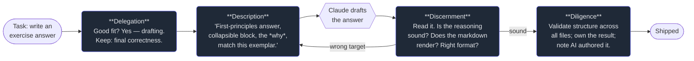

# 1. What AI fluency is

## TL;DR

> **AI fluency** is the ability to collaborate with AI systems *effectively* (you get good
> results), *efficiently* (without wasted effort), *ethically* (honestly and fairly), and *safely*
> (without causing harm). It is a **skill**, not a fact — you practise it, you get better at it, and
> no amount of tooling substitutes for it. Anthropic frames the skill as four practices, the
> **4 D's**: **Delegation** (what to hand over), **Description** (how to ask), **Discernment** (how
> to judge the answer), and **Diligence** (how to stay responsible). Every other Part of this book —
> Claude Code, the API, MCP, Skills, Subagents — is *machinery*. This Part is the *judgment* that
> aims the machinery. Learn it first.

## 1. Motivation

In 2023 a New York lawyer filed a legal brief citing half a dozen court decisions that supported his
client perfectly. There was just one problem: the cases did not exist. He had asked a chatbot to
find supporting precedent, and the model — doing exactly what such models do when pushed past what
they know — *invented* plausible-sounding cases, complete with fake quotes and fake citation
numbers. The lawyer, impressed and rushed, pasted them in without checking a single one. When
opposing counsel couldn't find the cases, the court couldn't either. The lawyer was sanctioned, his
firm publicly embarrassed, and the story became the textbook example of AI gone wrong.

Here's the thing worth sitting with: **the tool was not the failure.** A model that can draft a
brief in seconds is extraordinary. The failure was entirely in the *collaboration*. He delegated a
task that needed verification to a system that can't verify itself. He described it vaguely. He
never discerned — never read the output critically or checked one citation. And he exercised no
diligence — he took no responsibility for what he signed his name to. Four missing practices, one
career-denting outcome.

Now flip it. The same model, in the hands of someone fluent, drafts the brief, *and* the human
treats every citation as a claim to verify, checks each against a real database, and owns the final
filing. Same capability, opposite result. **The difference between those two people is the entire
subject of this Part.** It isn't intelligence and it isn't prompting tricks — it's a learnable
practice for working with a powerful, fallible, non-human collaborator.

## 2. Intuition (Analogy)

Picture a **brilliant amnesiac intern**.

They have read an astonishing amount — more than you ever will — and they're fast, tireless, and
eager to help. But they have three quirks. First, they wake up each morning with **no memory** of
yesterday; every conversation starts cold unless you brief them. Second, they have **no stake** in
the outcome — they won't lie awake worrying whether they got it right; that worry is *your* job.
Third, they are **disturbingly literal and confident**: ask vaguely and they'll do *something*
plausible and present it as if it were exactly right, even when it's wrong.

Managing such an intern *is* AI fluency:

- You decide **which tasks** to give them and which to keep (Delegation).
- You **brief them** well enough that a literal, contextless reading still hits the target
  (Description).
- You **check their work** instead of rubber-stamping it (Discernment).
- You **sign off** and take responsibility for what goes out the door (Diligence).

The intern's brilliance is real and worth using. So is their fallibility. Fluency is holding both
truths at once — neither dismissing the tool ("AI is useless") nor surrendering to it ("the AI said
so"). The lawyer surrendered. Don't be the lawyer.

| | Treats AI as a search engine | Treats AI as an oracle | **Fluent collaborator** |
|---|---|---|---|
| Mental model | "It looks things up" | "It knows the answer" | "Capable, fallible partner" |
| On a vague prompt | Frustrated it 'misunderstood' | Accepts whatever comes back | Re-describes precisely |
| On the output | Copies the top result | Trusts it unread | Reads, runs, verifies |
| Who's responsible | "The tool was wrong" | "The AI decided" | **Me. Always me.** |

## 3. Formal Definition

**AI fluency** (Dakan & Feller, with Anthropic) is *the ability to work with AI systems
effectively, efficiently, ethically, and safely.* Unpack the four adjectives — they're the bar:

- **Effective** — you accomplish what you actually intended (not merely "got an answer").
- **Efficient** — you get there without disproportionate effort, tokens, or rework.
- **Ethical** — honest about AI's involvement, fair, respecting privacy and others' rights.
- **Safe** — you avoid foreseeable harm to yourself, your users, and your systems.

Fluency is enacted through four practices — the **4 D's**:

| The D | The question it answers | What "doing it well" looks like |
|---|---|---|
| **Delegation** | *What should the AI do, what should I do, and how do we split it?* | Matching tasks to the tool's strengths; keeping judgment-heavy or high-stakes parts |
| **Description** | *How do I communicate the task so the AI can actually do it?* | Role, context, explicit format, constraints, examples — a brief a literal reader can't miss |
| **Discernment** | *Is the output — and the process that made it — actually good?* | Reading critically, running the code, comparing to the spec, noticing what's plausible-but-wrong |
| **Diligence** | *Am I taking responsibility for this?* | Verifying, attributing AI's role honestly, considering harm before shipping |

Two things make this a *framework* rather than a list. First, the D's form a **loop**, not a
sequence you finish: you describe, discern the result, re-delegate the parts that came back wrong,
describe again. Second, **they're interdependent** — strong description with zero discernment still
ships the lawyer's fake cases; flawless discernment of a badly-delegated task just tells you,
correctly, that you asked for the wrong thing. Fluency is all four, *every time*, in proportion to
the stakes.

> A blunt test of your own fluency: after an AI helps you, can you answer "*why is this right?*"
> without saying "*because the AI said so*"? If not, you delegated your judgment, not just your typing.

## 4. Worked Example — the four D's as a loop

Watch the loop turn on a single real task: *"write the answer key for an exercise in this book."*
(We did exactly this, hundreds of times, last week.)



Notice the **back-edge** from Discernment to Description: when a draft came back answering the wrong
question, we didn't fix it by hand and we didn't accept it — we *re-described* and let the model try
again. That edge is where most of fluency lives. Beginners treat the first output as final (accept
or reject); fluent collaborators treat it as a turn in a conversation. The loop is cheap because the
intern is fast — so spend its speed on iterations, and spend *your* scarce attention on the two
human-only nodes: deciding what to delegate, and discerning what came back.

## 5. Build It

You can't run "judgment," but you can run a **model** of the loop that makes one thing undeniable:
fluency is all four D's, and dropping any one has a concrete cost. Run this, then break it.

```python run
def collaborate(task, *, describe, discern, diligence):
    """One AI collaboration. Delegation already happened (we chose to use Claude).
       Toggle the other three D's and watch the consequence."""
    steps = ["Delegation: chose Claude for the draft, kept the judgment."]
    quality = 0.9 if describe else 0.3
    steps.append("Description: role + context + format + constraints -> on-target."
                 if describe else
                 "Description: just 'fix it' -> valid but off-target output.")
    caught = discern
    steps.append("Discernment: read it, ran it, checked it against the spec."
                 if discern else
                 "Discernment: pasted it unread.")
    steps.append("Diligence: verified + owned the result."
                 if diligence else
                 "Diligence: shipped without verifying or owning it.")
    ships_defect = (quality < 0.8 and not caught) or (not diligence and not caught)
    verdict = "SHIPPED A DEFECT" if ships_defect else "shipped something trustworthy"
    return "\n".join("  - " + s for s in steps) + f"\n  => {verdict}"

print("FLUENT - all four D's:")
print(collaborate("summarise the outage", describe=True, discern=True, diligence=True))
print("\nUNFLUENT - skipped Description and Discernment:")
print(collaborate("summarise the outage", describe=False, discern=False, diligence=True))
```

**Now break it.** Turn `diligence=False` in the fluent call: a task you described and discerned well
still survives, because you *did* catch problems — diligence is your safety net, not your only line
of defence. Then turn `discern=False` on a well-described task: the defect slips through even though
the description was good. That's the lesson the lawyer learned the hard way — **no single D saves
you; the missing one is the one that bites.**

## 6. Trade-offs & Complexity

| Practising fluency | Winging it |
|---|---|
| Slower on turn one (you brief, you check) | Instant — paste the prompt, paste the output |
| Reliable, defensible, improvable | Lucky when it works, silent when it doesn't |
| You learn the problem more deeply | You learn nothing; the AI "did it" |
| Scales: you can delegate to *many* agents safely | Breaks the moment stakes or volume rise |
| Requires honesty about what you don't know | Comfortable until it isn't |

The cost of fluency is up-front effort and a bruised ego — you have to admit when a result is wrong,
including when *your description* was the wrong one. The cost of skipping it is paid later, larger,
and in public (ask the lawyer). For a throwaway haiku, wing it. For anything you'll *sign*, ship, or
build on, the loop is cheap insurance.

## 7. Edge Cases & Failure Modes

- **Over-trust (the oracle trap).** Accepting fluent-sounding output as true. Antidote: discernment
  — treat every factual claim as a claim to verify, especially when it's *exactly* what you hoped for.
- **Over-control (the puppet trap).** Specifying every keystroke so tightly you'd have been faster
  doing it yourself. Antidote: delegate the *intent* and a clear spec, not the mechanics.
- **Vague description.** "Make it better" / "fix it." A literal reader can't act on it; you get
  plausible noise. Antidote: role, context, format, constraints, an example.
- **No verification.** Shipping unread output. Antidote: diligence — if you can't explain why it's
  right, you're not done.
- **Dishonesty about AI's role.** Passing AI work off as wholly your own where that matters
  (a graded essay, a medical note). Antidote: ethics — disclose where disclosure is owed.
- **Skill atrophy.** Delegating the very thinking you need to *keep* sharp. Antidote: delegate to
  extend yourself, not to avoid learning the thing you'll be judged on.

## 8. Practice

> **Exercise 1 — Name the missing D.** A student asks Claude to "write my history essay," pastes the
> result into the submission box, and turns it in. List which of the four D's were skipped and the
> single most serious consequence of each omission.

<details>
<summary><strong>Answer</strong></summary>

Using the §3 framework: a good collaboration needs all four D's; here, three are missing and only a
degenerate "delegation" remains.

- **Delegation — misused.** "Write my essay" delegates the *entire* task, including the part whose
  whole point is the student's own thinking and learning. Fluent delegation keeps judgment-heavy or
  *assessed* work; here the assessed work itself was handed over. Consequence: even a perfect essay
  defeats the purpose of the assignment (and is likely academic misconduct).
- **Description — skipped.** No context (the prompt, the course, the argument the student believes),
  so the output is generic. Consequence: a bland, possibly off-prompt essay that doesn't match what
  was asked.
- **Discernment — skipped.** Pasted unread. Consequence: undetected errors, invented "facts," or a
  tone that doesn't sound like the student — exactly the lawyer's failure mode.
- **Diligence — skipped.** No verification, and — most serious — **no honesty about AI's role** in
  graded work. Consequence: an integrity violation, the one with lasting cost.

The single most serious omission is the **ethical** failure inside Diligence: submitting undisclosed
AI work as one's own in a context (assessment) where authorship is the entire point.

</details>

> **Exercise 2 — Effective vs efficient.** Give one example of a collaboration that is *effective*
> but *not efficient*, and one that is *efficient* but *not effective*. Why does fluency demand both?

<details>
<summary><strong>Answer</strong></summary>

The four adjectives (§3) are independent axes, so you can hit one and miss another.

- **Effective but inefficient:** you get a correct, well-structured answer — but only after twenty
  vague prompts, three regenerations, and a lot of manual cleanup. The *result* is good; the *path*
  wasted effort and tokens. Better description up front (Exercise material for the next chapter)
  would have reached the same place in two turns.
- **Efficient but ineffective:** one slick prompt returns a beautifully formatted answer in
  seconds — to the *wrong* question, because you never checked. Fast, cheap, and useless.

Fluency demands both because either alone fails in practice: an inefficient process doesn't scale
(you can't run it across many tasks or many agents), and an ineffective one is just confident waste.
The goal is the *right* result *without* disproportionate effort — and that comes from the loop, not
from luck.

</details>

> **Exercise 3 — Calibrate the loop.** You ask Claude for (a) a limerick for a birthday card, and
> (b) the dosage section of a patient-information leaflet. Describe how much Description, Discernment,
> and Diligence each deserves, and state the principle that decides.

<details>
<summary><strong>Answer</strong></summary>

The deciding principle is **proportion to stakes**: the cost of being wrong sets how much of each D
you spend (the same instinct as "require evidence proportional to what's at stake").

- **(a) Birthday limerick — light touch.** Description: a sentence (name, vibe, an inside joke).
  Discernment: read it once, make sure it scans and isn't accidentally rude. Diligence: essentially
  none — a bad limerick costs a chuckle. Winging it is *fine* here, and insisting on a verification
  protocol would be over-control.
- **(b) Dosage section — maximum rigour.** Description: exact drug, population, units, the
  authoritative source to follow, the format. Discernment: check *every number* against a primary
  reference; a plausible-but-wrong dose is the catastrophe case. Diligence: a qualified human must
  verify and own it; AI drafts, it does not decide; disclosure and review are mandatory.

Same tool, same four D's — wildly different *amounts*, because the blast radius of an error differs
by orders of magnitude. Fluency isn't a fixed ritual; it's a dial you turn up as the stakes rise.

</details>

```quiz
{
  "prompt": "Which statement best captures what AI fluency is?",
  "input": "Choose one:",
  "options": [
    "A practised skill for collaborating with AI effectively, efficiently, ethically, and safely — judgment that no tooling replaces",
    "Knowing the most prompt-engineering tricks and keywords",
    "Trusting the model's output because it was trained on more than any human could read",
    "Avoiding AI for anything important so it can never be wrong"
  ],
  "answer": "A practised skill for collaborating with AI effectively, efficiently, ethically, and safely — judgment that no tooling replaces"
}
```

## Your Turn

Before you move on, check your understanding with the coach — explain the idea, apply it, weigh the trade-offs, then defend your reasoning.

<div class="concept-coach"></div>

## In the Wild

- **[Anthropic — AI Fluency: Frameworks & Foundations](https://anthropic.skilljar.com/)** — the
  source course for the 4 D's, by Rick Dakan and Joseph Feller. Free; the origin of this Part.
- **[Mata v. Avianca (2023) — the fake-citations sanction](https://www.courtlistener.com/docket/63107798/mata-v-avianca-inc/)**
  — the primary court record behind the Motivation story; the canonical lesson in skipped discernment.
- **[Anthropic — Claude's Constitution & usage policies](https://www.anthropic.com/legal/aup)** —
  what "ethical and safe" looks like from the model-maker's side; useful context for the *ethics* axis.

---

**Next:** the first D, and the one people get most wrong in opposite directions — handing over too
much *and* too little. What should you actually delegate to an AI, and what must stay yours? →
[2. Delegation](/cortex/the-claude-stack/ai-fluency/delegation)
