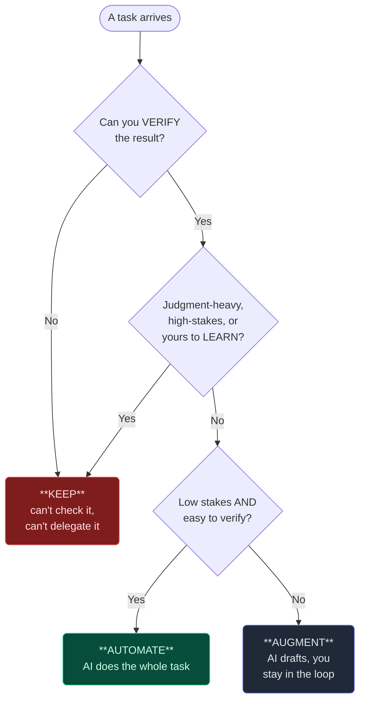

# 2. Delegation

## TL;DR

> **Delegation** is the practice of deciding *what the AI does, what you do, and how the work
> splits.* The core move is judging **task–AI fit**: hand over what plays to the tool's strengths,
> keep what needs human judgment. Doing it well rests on three **awarenesses** — **problem**
> (understand the task yourself first), **process** (know which steps *could* be handed off), and
> **product** (know what a good result looks like, because *you can't delegate what you can't
> recognise*). Delegation isn't binary; it's a spectrum — **automation** (AI does it all),
> **augmentation** (AI assists, you stay in the loop), **agency** (AI acts on its own within
> bounds) — and you match the mode to **stakes + verifiability**. The unbreakable rule: **if you
> can't verify it, you can't safely delegate it.** Master this and you've learned the seed of
> *agentic architecture* — the biggest exam domain — because every multi-agent design is, underneath,
> a pile of delegation decisions.

## 1. Motivation

Last week we had to add a collapsible "Answer" block to **63 chapters** of another book on this site.
Sixty-three files, each needing a freshly-written, correct, first-principles answer. One person doing
that by hand is a long, dull afternoon. So we delegated — but the interesting part is *what* we
delegated and what we refused to.

We spun up **9 parallel subagents**, each handed a slice of the chapters, each told to *draft* the
answer blocks. That's the part an AI is genuinely great at: lots of similar, well-specified writing,
fast. What we did **not** hand over was the part that actually matters — whether each answer is
*correct*, and whether the structure renders. A wrong answer in a learning book is worse than no
answer; it teaches the mistake. So drafting went to the agents; **final correctness and verification
stayed with us.** We read the outputs, ran the structural checks, and owned what shipped.

Here's the thing worth sitting with: that single afternoon held *dozens* of delegation decisions, and
almost none were "AI or not?" They were "**which slice**, in **what mode**, checked by **whom**?" Get
the split right and nine agents save you a day; get it wrong — delegate the *verification* too, trust
nine unread drafts — and you've mass-produced sixty-three confident errors. **The split is the
skill.** It's the first D for a reason: the other three (Description, Discernment, Diligence) all
operate *on whatever you chose to delegate.* Choose badly and no clever prompting downstream saves you.

## 2. Intuition (Analogy)

Picture a **head chef running a kitchen brigade** on a busy Friday night.

The chef does *not* cook every dish. They couldn't — fifty tables, six courses, one pair of hands.
Instead they do three things only they can do. They **design the menu** (deciding *what* the kitchen
will even attempt — the problem). They **assign stations**: this cook works the grill, that one
plates desserts, the new hire does prep where a mistake is cheap (deciding *which steps* go to whom —
the process). And critically, every single plate passes the **pass** — the chef inspects it under the
heat lamps before it leaves for the table, and sends back anything that isn't right (knowing *what
"good" looks like* and checking for it — the product).

Notice what the chef refuses to delegate: **the menu, the assignments, and the final taste.** They
hand over the *cooking*, never the *judgment of whether it's good enough to serve.* A chef who plated
straight from a line cook's pan without tasting — who delegated the pass itself — would be one bad
night from disaster, exactly like the lawyer in Chapter 1 who served the model's "dish" (fake cases)
without tasting it. The brigade multiplies the chef's reach; the *pass* keeps the chef responsible.
(Same picture in Chapter 1's terms: the AI is the **brilliant amnesiac intern**, and Delegation is
you deciding which dishes that tireless intern cooks tonight — and tasting every one.)

| | The line cook (delegate) | The pass / the menu (keep) |
|---|---|---|
| What it is | Execution: chop, cook, draft, refactor | Judgment: what to make, is it good, who's responsible |
| Why this side | Fast, repeatable, easy to check | Needs taste, context, accountability |
| Cost of getting it wrong | A re-fired plate — cheap, caught at the pass | A bad meal served — expensive, public |
| AI analogue | The 9 drafting subagents; the go-judge sandbox | The human who reads, verifies, and signs off |

## 3. Formal Definition

**Delegation** (the first of Anthropic's 4 D's) is *the practice of deciding which parts of a task to
give to an AI system, which to keep for yourself, and how to divide and sequence the work between
you.* The decision criterion is **task–AI fit**: how well the task matches what the tool does
reliably, weighed against how much human judgment it demands.

Doing it well draws on three **awarenesses** — and the order matters, because each guards a different
failure:

| Awareness | The question | What it prevents |
|---|---|---|
| **Problem awareness** | Do *I* understand the task well enough to hand it off cleanly? | Delegating a problem you haven't grasped — you'll get a confident answer to the *wrong* question |
| **Process awareness** | Which *steps* could be delegated, and which must stay mine? | Handing over the whole task when only part of it should go |
| **Product awareness** | Do I know what a *good result* looks like? | Delegating something you can't recognise as right or wrong — the fatal one |

Product awareness is the load-bearing one: **you cannot delegate what you cannot recognise.** If you
can't tell a good output from a bad one, handing the task over doesn't save you work — it just hides
the risk until it ships.

Delegation is not all-or-nothing. It runs along a **spectrum of modes**, and fluency is choosing the
right point on it:

- **Automation** — the AI does the *whole* task end-to-end; you set it up and accept the result.
  (Renaming a variable across a repo.)
- **Augmentation** — the AI *assists* while you stay in the loop, steering and editing turn by turn.
  (Drafting a function with you reviewing each step.)
- **Agency** — the AI acts *autonomously within bounds you set*, making sub-decisions on its own.
  (An agent that explores a codebase and reports back — it chooses what to read.)

You pick the mode by two dials: **stakes** (how bad is a wrong result?) and **verifiability** (how
easily can you check it?). High verifiability + low stakes → automate. Low verifiability or high
stakes → pull it back toward augmentation, or keep it entirely.

> The blunt test for *any* delegation: **"If this comes back wrong, will I catch it — and can I
> afford the miss?"** If the answer to either half is no, you haven't delegated a task; you've
> gambled on one.

## 4. Worked Example

Watch the decision run on three real tasks from building this very site. We're not asking "use AI or
not?" — we're routing each task to **KEEP**, **AUGMENT**, or **AUTOMATE** through the same two gates,
in order: *can I verify it?* then *is it judgment-heavy / high-stakes / mine to learn?*



Trace the three:

- **"Explore how the code runner works."** Verifiable? Yes — we can read the same files. Judgment /
  ours to learn? No, it's lookup. But it's *breadth* work, not a one-line answer — so it goes to an
  **Explore subagent** (the **agency** end: the agent decides which files to open) and reports back.
  We keep the *decision* it informs.
- **"Decide the system architecture."** Verifiable? Not cleanly — there's no test that says an
  architecture is "correct." High-stakes and *exactly* the thing we need to understand ourselves.
  Hard **KEEP**. An AI can argue options *with* us, but it must not *decide*.
- **"Draft a unit test."** Verifiable? Mostly. Stakes? Low-ish — but a green test can quietly assert
  the *wrong* thing, so a human must eyeball it. **AUGMENT**: AI drafts, we review.

The lesson of the diagram is the **first gate**. Verifiability is checked *before* anything else,
because it's a veto: however trivial a task looks, if you can't check the result you can't safely hand
it off. That's why our go-judge sandbox is allowed to **execute** every code sample but never to
**decide** whether the prose is right — execution is verifiable and bounded; judgment isn't.

## 5. Build It

You can't run "judgment," but you *can* run the routing rule from §4 and watch it sort real tasks
into KEEP / AUGMENT / AUTOMATE. Each task is scored 1–5 on **stakes**, **verifiability**, and
**must-learn**. Run it, then change the numbers and watch a task migrate across the spectrum.

```python run
def fit(task, *, stakes, verifiability, must_learn):
    """Score one task for task-AI fit and recommend a delegation MODE.
       Each input is 1..5.
         stakes        = how bad a wrong answer is (5 = catastrophic)
         verifiability = how easily YOU can check the result (5 = trivially)
         must_learn    = how much YOU personally need to learn this (5 = it's the point)
       Returns (mode, one-line reason)."""
    # You can only safely delegate what you can verify. Low verifiability
    # is a hard veto no matter how trivial the task looks.
    if verifiability <= 2:
        return ("KEEP", "you cannot check it, so you cannot safely hand it off")
    # Things you need to LEARN, or high-stakes judgement calls, stay with you.
    if must_learn >= 4 or stakes >= 4:
        return ("KEEP", "judgement-heavy or it's yours to learn -- own it")
    # Low stakes + easy to verify = let the AI do the whole thing.
    if stakes <= 2 and verifiability >= 4:
        return ("AUTOMATE", "low stakes and easy to verify -- let AI do it all")
    # Everything in between: AI drafts, you stay in the loop.
    return ("AUGMENT", "useful draft, but a human stays in the loop")


tasks = [
    ("rename a variable across the repo", dict(stakes=1, verifiability=5, must_learn=1)),
    ("decide the system architecture",    dict(stakes=5, verifiability=2, must_learn=5)),
    ("draft a unit test for a function",  dict(stakes=2, verifiability=3, must_learn=2)),
]

print(f"{'TASK':<36}{'MODE':<10}WHY")
print("-" * 78)
for name, scores in tasks:
    mode, why = fit(name, **scores)
    print(f"{name:<36}{mode:<10}{why}")
```

Output:

```
TASK                                MODE      WHY
------------------------------------------------------------------------------
rename a variable across the repo   AUTOMATE  low stakes and easy to verify -- let AI do it all
decide the system architecture      KEEP      you cannot check it, so you cannot safely hand it off
draft a unit test for a function    AUGMENT   useful draft, but a human stays in the loop
```

**Now break it.** Bump the rename's `stakes` to 5 (say it's a public API everyone imports): it slides
from AUTOMATE to KEEP — same task, the rising stakes pulled it back up the spectrum. Then take the
architecture decision and pretend `verifiability=5`: it *still* won't automate, because `must_learn`
and `stakes` veto it on the second gate. That's the point — **no single number decides; the lowest
gate it fails is the one that pins it.** A pile of these decisions, made well, *is* an agentic system.

## 6. Trade-offs & Complexity

| Delegating deliberately (split + verify) | Delegating carelessly (dump the whole task) |
|---|---|
| Slower to set up: you scope, split, and check | Instant — hand over everything, accept what returns |
| Scales to *many* parallel agents safely | Breaks the moment one unread output is wrong |
| You keep problem/product awareness sharp | Awareness erodes; you can't tell good from bad anymore |
| Errors caught at the pass — cheap, private | Errors served to the table — expensive, public |
| Effort scales *with stakes* (a dial, not a ritual) | Same blind trust for a haiku and a dosage table |

The cost of delegating well is up-front thinking: you have to actually *understand* the task (problem
awareness) and know what good looks like (product awareness) **before** you hand it off — which feels
slower than just typing "do this" into the box. The cost of skipping that is paid later and bigger:
you mass-produce confident errors and can't even spot them, because you delegated the very judgment
that would have caught them. For a throwaway, dump and go. For anything you'll *ship*, split it,
choose the mode by stakes, and keep the pass.

## 7. Edge Cases & Failure Modes

- **Delegating what you can't verify.** The cardinal sin. If there's no way for you to check the
  result, handing it off doesn't reduce risk — it hides it. *Antidote:* §3's blunt test — make
  verifiability the first gate, and pull unverifiable work back to KEEP.
- **Delegating what you need to learn (skill atrophy).** Handing over the exact reasoning you're
  meant to be building — the student who delegates the essay, the dev who never learns the codebase.
  *Antidote:* `must_learn` is a KEEP signal; delegate to *extend* yourself, not to dodge the learning.
- **Over-delegation (the dump).** Giving the *whole* task when only a slice should go — "build the
  app," "decide the architecture." *Antidote:* process awareness — split into steps and delegate the
  *execution* steps, keep the *judgment* steps.
- **Under-delegation (the puppet trap).** Micromanaging every keystroke so tightly you'd have been
  faster alone, or refusing to delegate anything out of distrust. *Antidote:* delegate *intent* plus
  a clear spec; let the fast intern be fast on the verifiable parts.
- **Wrong mode for the stakes.** Granting full **agency** to an unbounded, high-stakes action (an
  agent that can delete files or send emails with no check). *Antidote:* match mode to stakes —
  agency only *within bounds you can verify and reverse.*
- **Mistaking execution for decision.** Letting a tool that should only *act* start to *decide* —
  e.g. treating the sandbox's "it ran" as "it's correct." *Antidote:* keep execution and judgment in
  different hands; the go-judge runs code, *you* judge the answer.

## 8. Practice

> **Exercise 1 — Route three tasks.** For each, name the mode (KEEP / AUGMENT / AUTOMATE) and the
> *one* awareness or dial that decides it: (a) auto-formatting code with a linter on save, (b) writing
> the final paragraph of *your own* college admissions essay, (c) summarising a 40-page spec into
> bullet points you'll then act on.

<details>
<summary><strong>Answer</strong></summary>

Apply the §3 dials (stakes, verifiability) and the three awarenesses; route through the §4 gates.

- **(a) Linter on save → AUTOMATE.** Stakes near-zero, verifiability near-total (the diff is right
  there, tests still run). It passes both gates instantly. This is pure execution — exactly the line
  cook's job. *Deciding dial:* high **verifiability** + low **stakes**.
- **(b) Your admissions essay's final paragraph → KEEP.** It's *yours to learn* and to say honestly;
  an admissions essay's whole point is *your* voice and thought. `must_learn` is maxed, and there's an
  ethics edge (undisclosed AI authorship where authorship is the point). *Deciding dial:* **problem
  ownership / must-learn** — you can't delegate the very thing being assessed.
- **(c) Summarise a spec you'll act on → AUGMENT.** Genuinely useful to delegate the *drafting* of the
  summary, but you must read it against the source, because a plausible-but-wrong summary will steer
  every action you take next. *Deciding dial:* **product awareness** — you have to recognise whether
  the summary is faithful, so you stay in the loop.

The *why* underneath all three: delegation routes on **task–AI fit**, and the lowest gate a task
fails is the one that pins its mode (§4). Execution with cheap, checkable errors automates; judgment,
learning, and honesty stay with you.

</details>

> **Exercise 2 — The pass.** Re-read the Motivation: we delegated *drafting* 63 answer blocks to 9
> subagents but kept *correctness* ourselves. Using the head-chef analogy, explain precisely which
> step we refused to delegate and why delegating *that* step would have been the dangerous move.

<details>
<summary><strong>Answer</strong></summary>

The refused step is **the pass** — the final inspection where the chef tastes each plate before it
leaves the kitchen. In our terms, that's **verification of correctness**: reading each drafted answer
and judging whether it's actually right and renders properly, before it ships into the book.

Why delegating *that* step is the dangerous one, from first principles (§3): correctness here has
**low verifiability *by the AI itself*** (a model can't reliably certify its own factual answer — see
Chapter 1's lawyer) and **high stakes** (a wrong answer in a learning book teaches the error to every
reader). Both dials scream KEEP. The *drafting* step, by contrast, is high-volume, well-specified, and
cheap to re-fire if wrong — perfect line-cook work, safely handed to nine agents in parallel.

So the split honours **product awareness**: we kept the one step where *recognising good from bad* is
the entire job. Delegating drafting multiplied our reach; keeping the pass kept us responsible. Hand
over the pass and nine agents don't save a day — they mass-produce 63 confident errors no one tasted.

</details>

> **Exercise 3 — Agency within bounds.** You want an AI agent to *automatically fix failing tests* in
> your project overnight, unattended. Name two bounds you'd set so that granting **agency** here is
> defensible rather than reckless, and tie each bound to a §3/§7 idea.

<details>
<summary><strong>Answer</strong></summary>

Agency (§3) is fine *only within bounds you can verify and reverse* (§7, "wrong mode for the
stakes"). Two concrete bounds:

- **It may only act where results are verifiable — and it must prove it.** Constrain the agent to
  changes that make the test suite go green *and* keep the rest of the suite passing, on an isolated
  branch. This makes **verifiability** the gate (§3's blunt test): every action it takes is one you
  can check by re-running the suite. Without this, "fix the tests" could mean *deleting* the failing
  test — green suite, broken guarantee.
- **It must be reversible and bounded in blast radius.** No force-pushing to main, no production
  config, no actions outside the repo (no emails, no deletions). This caps the **stakes** so even a
  wrong autonomous decision is cheap to undo — the difference between agency you can sleep through and
  agency that's a gamble (§7, "agency only within bounds you can verify and reverse").

The *why*: agency trades moment-to-moment oversight for speed, so it's safe only when both dials are
pre-paid — **bounded stakes** (reversible, small blast radius) and **built-in verifiability** (its
success criterion is something *you* can independently re-check). That's how a real agentic
architecture stays trustworthy: not by trusting the agent, but by fencing it into a space where being
wrong is cheap and catchable.

</details>

```quiz
{
  "prompt": "What is the single hard rule that should veto a delegation no matter how trivial the task looks?",
  "input": "Choose one:",
  "options": [
    "If you cannot verify the result, you cannot safely delegate it",
    "If the task is boring, always delegate it to save time",
    "Always grant the AI full autonomy so it works fastest",
    "Never delegate anything you could technically do yourself"
  ],
  "answer": "If you cannot verify the result, you cannot safely delegate it"
}
```

## Your Turn

Before you move on, check your understanding with the coach — explain the idea, apply it, weigh the trade-offs, then defend your reasoning.

<div class="concept-coach"></div>

## In the Wild

- **[Anthropic — AI Fluency: Delegation](https://anthropic.skilljar.com/)** — the source lesson for
  this D (Dakan & Feller), where problem / process / product awareness and task–AI fit are introduced.
- **[Anthropic — Building effective agents](https://www.anthropic.com/research/building-effective-agents)**
  — how delegation scales into real architectures: workflows vs. agents, and matching autonomy to the
  task. The engineering face of this chapter, straight into the exam's biggest domain.
- **[Anthropic — Claude Code subagents](https://docs.anthropic.com/en/docs/claude-code/sub-agents)** —
  the concrete mechanism behind our 9-agent fan-out and our Explore agents: delegating bounded work to
  context-isolated helpers while you keep the decisions.

---

**Next:** you've decided *what* to delegate — now the make-or-break question is *how you ask for it*.
A perfectly-chosen task still fails if the brief is vague. How do you describe a task so a fast,
literal, contextless reader nails it on the first try? →
[3. Description](/cortex/the-claude-stack/ai-fluency/description)
