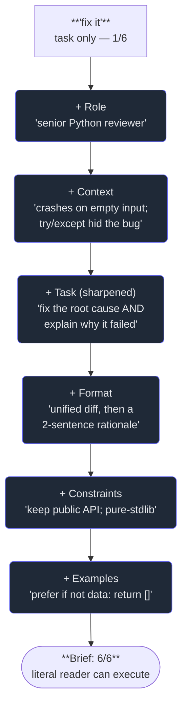

# 3. Description

## TL;DR

> **Description** is the practice of communicating a task precisely enough that an AI can actually
> do it — prompting treated as **engineering, not magic words**. The model acts on what you *say*,
> read literally and stripped of all the context in your head; ambiguity in means plausible-but-wrong
> out. A strong description has a recognisable anatomy — **role**, **context**, **task**, **format**,
> **constraints**, and **examples** — and two laws govern it: **specificity beats politeness**, and
> **structure beats length**. When the output is off, the fluent move is to fix the *description*,
> not to hit regenerate and hope. This is the foundation of the certification's largest non-orchestration
> domain — *Prompt Engineering & Structured Output* — and in Part 3 these same descriptions harden into
> API system prompts and tool schemas.

## 1. Motivation

This very chapter began life as a **description** — a single, carefully structured prompt handed to
an AI subagent. Strip away the prose and here is its skeleton, the actual fields it contained:

- a **role** ("You are an expert CS educator and technical writer contributing ONE chapter…");
- **context** (the book, the platform, the worktree to work in, the sibling chapters around it);
- a **task** (write *one* file at *one* exact path);
- a **format** (the rigid section order: TL;DR → Motivation → … → quiz → In the Wild → Next);
- hard **constraints** ("the python block must verify Accepted"; "~150–230 lines"; "write ONLY this one file");
- and **examples** — one gold-standard exemplar chapter to match, voice for voice.

That is not a coincidence; it is the whole point. The author got *one shot* to brief a fast, literal,
contextless worker — no standing over its shoulder to clarify — so the quality of the chapter you are
reading is downstream of how well the job was described. Vague in, generic out. Specific in, this.

Contrast the failure mode: the same task described as *"write a chapter about descriptions."* A
capable model would produce *something* — fluent, plausibly structured, almost certainly wrong: wrong
length, wrong section order, no runnable code, a voice clashing with every other chapter. **The
capability was never the bottleneck; the description was.** That gap — between what you meant and what
you said — is this chapter, and it's the one beginners under-invest in most.

## 2. Intuition (Analogy)

Description is **writing a recipe for someone who has never set foot in your kitchen — and who will
follow every word literally.**

You know "season to taste" and "cook until done." Your reader does not — never tasted your cooking,
doesn't know your stove runs hot, can't see the pan. Write *"add salt"* and they might add a teaspoon
or a cup; both are "salt." Write *"cook until done"* and they guess, confidently, and serve it raw.
But *"add ¼ tsp fine salt; sauté over medium heat for 4 minutes until the onions are translucent, not
browned"* — and a stranger reproduces your dish.

Same situation with an AI. Recall the **brilliant amnesiac intern** from chapter 1: reads everything,
remembers nothing of *your* situation, disturbingly literal. It doesn't infer the cup-vs-teaspoon you
obviously meant; it picks a plausible reading and commits. A good description is the recipe for a
literal stranger — every quantity stated, every step ordered, nothing left to "you know what I mean,"
because **it does not.**

| | Vague prompt ("fix it") | Long, rambling prompt | **Structured description** |
|---|---|---|---|
| What the model receives | A wish | A wall of text to dig through | A brief it can execute |
| How it fills the gaps | Guesses your context | Buries the ask in noise | Nothing to guess — it's stated |
| "Add salt" problem | Picks a random amount | States the amount twice, contradicts itself | One amount, once, unambiguous |
| Typical result | Plausible & off-target | On-topic but misses the real ask | On-target on turn one |
| When it's wrong, you… | Regenerate and pray | Add *more* words | Edit the *one* field that was unclear |

## 3. Formal Definition

**Description** is the practice of *encoding a task into a prompt so that a literal, context-free
reader can execute it as intended.* A model is a function from your text to an output: it conditions
**only** on the tokens you provide (plus its training), never on the intent in your head. Therefore
the quality ceiling of any single response is set by the description — no amount of model capability
recovers information you never put in.

A strong description is built from six recurring components — the **anatomy**:

| Component | The question it answers | Example phrasing |
|---|---|---|
| **Role / persona** | *Who is answering?* | "You are a senior Python reviewer." |
| **Context** | *What's the situation, the inputs, what's been tried?* | "Parser crashes on empty input; we already tried try/except." |
| **Task** | *What, precisely, is the ask?* | "Fix the root cause and explain why it failed." |
| **Format** | *What exact shape should the output take?* | "Return a unified diff, then a 2-sentence rationale." |
| **Constraints** | *What must — and must not — happen?* | "Don't change the public API; pure-stdlib only." |
| **Examples** | *What does 'good' look like?* | "Prefer `if not data: return []` over swallowing exceptions." |

Two principles turn these from a checklist into a discipline:

- **Specificity beats politeness.** "Please could you maybe help" adds zero information; "return 3
  bullets, ≤12 words each" adds a lot. The model isn't flattered and doesn't resent commands — it
  conditions on *content*. Spend words on precision, not courtesy.
- **Structure beats length.** A short prompt with labelled sections (role, context, task, format)
  out-performs a longer unstructured one — length without structure just buries the ask. This is
  *why* every chapter in this book follows a rigid template.

> **Show, don't just tell.** One concrete example often beats a paragraph of instructions: it pins
> down the hundred unstated micro-decisions (tone, verbosity, edge cases) prose misses. When output
> is subtly off, the cheapest fix is frequently *add one good example*, not *write more rules*.

And the move that defines fluency here: **when the output is wrong, fix the description, don't just
regenerate.** Regenerating re-rolls the same dice; editing the prompt changes them. This is the
**Discernment → Description back-edge** from chapter 1's loop — you judged the output, found it
off-target, and the repair is upstream in the brief, not in the result.

## 4. Worked Example — turning "fix it" into a brief

A teammate pastes a stack trace and types **"fix it."** Watch the description grow component by
component until a literal reader can execute it without guessing.



Each added component **removes a guess**. No role → a random expertise level. No format → a chatty
paragraph you reshape by hand. No constraint → it "fixes" the bug by rewriting your public API, a fix
on paper and a disaster in practice. No example → it swallows the exception again, the exact
anti-pattern you were escaping. The vague prompt isn't *less detailed*; it's **a request for the
model to invent all six answers for you** — and confidently present whichever it guessed.

This is the same shape as the prompt that generated this chapter (§1). Briefing a subagent and
briefing a chat are the *same skill*.

## 5. Build It

You cannot measure "intent," but you can measure **how much of the anatomy a prompt actually
contains**. Below is a tiny **prompt linter**: it scans a prompt for signals of each of the six
components, scores completeness out of six, and grades it. Run it on the same intent expressed two
ways — `"fix it"` versus a fully-specified brief — and watch the completeness jump.

```python run
# A tiny "prompt linter": does a prompt contain the components a literal
# reader needs? Six components from the anatomy of a good description (sec 3).
# We detect each by simple keyword signals, score completeness, and grade.
import re

COMPONENTS = ["role", "context", "task", "format", "constraints", "examples"]

SIGNALS = {
    "role":        [r"\byou are\b", r"\bact as\b", r"\bas an?\b.+\b(engineer|editor|expert|reviewer)\b"],
    "context":     [r"\bcontext\b", r"\bbackground\b", r"\bwe (have|are|tried)\b", r"\bthe (file|repo|codebase|situation)\b"],
    "task":        [r"\b(write|fix|refactor|summari[sz]e|generate|classify|review|explain)\b"],
    "format":      [r"\b(json|markdown|table|bullet|format|return (a|the)|output (a|the))\b", r"\b\d+\s+(words|lines|sentences)\b"],
    "constraints": [r"\bmust\b", r"\bmust not\b", r"\bdo not\b", r"\bonly\b", r"\bnever\b", r"\bno more than\b"],
    "examples":    [r"\bfor example\b", r"\be\.g\.\b", r"\bexemplar\b", r"\blike this\b", r"`[^`]+`"],
}

def lint(prompt: str):
    text = prompt.lower()
    present = {c: any(re.search(p, text) for p in SIGNALS[c]) for c in COMPONENTS}
    score = sum(present.values())
    if score <= 2:   grade = "VAGUE"
    elif score <= 4: grade = "OK"
    else:            grade = "STRONG"
    return present, score, grade

def report(label, prompt):
    present, score, grade = lint(prompt)
    print(f"{label}: {score}/6 components -> {grade}")
    for c in COMPONENTS:
        print(f"   [{'x' if present[c] else ' '}] {c}")
    return score

# Same intent, two descriptions. The model reads each LITERALLY.
vague = "fix it"

structured = (
    "You are a senior Python reviewer. Context: we have a parser in app.py that "
    "crashes on empty input; we already tried a try/except and it hid the bug. "
    "Task: fix the root cause and explain why it failed. Format: return a unified "
    "diff, then a 2-sentence rationale. Constraints: do not change the public API; "
    "must keep it pure-stdlib. For example, prefer an explicit guard like "
    "`if not data: return []` over swallowing exceptions."
)

print("== PROMPT LINT ==")
s_vague = report("Prompt A ('fix it')", vague)
print()
s_struct = report("Prompt B (fully specified)", structured)
print()
print(f"Completeness jump: {s_vague}/6 -> {s_struct}/6 (+{s_struct - s_vague})")
print("A literal reader can act on B. On A it must guess -- plausible, probably wrong.")
```

The linter prints **Prompt A: 1/6 → VAGUE** (only a task verb) and **Prompt B: 6/6 → STRONG** — a
**+5** jump from the *same* intent. The linter is dumb (it matches keywords, not meaning, so it can
be fooled), but that's the point: even a crude completeness check separates a wish from a brief.
**Now break it.** Delete the "For example…" clause from `structured` and re-run: examples drops to
5/6. Add any backtick-wrapped snippet back and it returns — there's more than one way to *show*. The
score is a proxy; the habit it builds is the prize.

## 6. Trade-offs & Complexity

| Writing a full description | Firing off "fix it" |
|---|---|
| Slower on turn one — you state role, format, constraints | Instant — one line and go |
| On-target output, often first try | Plausible output, usually off-target |
| When wrong, you edit one field (cheap, targeted) | When wrong, you regenerate (random, repeat) |
| Reusable — a good spec becomes a template / system prompt | Disposable — re-typed and re-guessed every time |
| Scales to many agents (each gets an unambiguous brief) | Falls apart the moment stakes or volume rise |
| Risk: over-specifying mechanics you should have delegated | Risk: under-specifying everything that matters |

The cost of description is **up-front words and thought** — you have to actually know what you want,
in what shape, with what limits, and writing that down sometimes reveals you *didn't*. Skipping it is
paid on every turn: rework, regeneration roulette, confident-but-wrong output to catch and repair.
There's a ceiling too — past a point, more specification becomes the **puppet trap** from chapter 1,
micromanaging keystrokes you'd have been faster typing yourself. Aim for "a literal reader can execute
this," then stop. For a throwaway question, "fix it" is fine; for anything you'll reuse, ship, or hand
to many agents, the brief is the cheap part.

## 7. Edge Cases & Failure Modes

- **Ambiguity / the curse of knowledge.** "Make it consistent" — with *what?* Obvious to you,
  invisible to a contextless reader. Antidote: name the referent ("match `01-what-ai-fluency-is.md`").
- **Politeness mistaken for instruction.** "Could you please try to maybe improve this?" carries no
  actionable content. Antidote: specificity beats politeness — state the change you want.
- **Length without structure.** Three paragraphs where the real ask hides in sentence eleven.
  Antidote: structure beats length — label role, context, task, format.
- **Contradictory constraints.** "Be exhaustive but keep it to one line" — the model resolves the
  conflict arbitrarily. Antidote: re-read your constraints for collisions before sending.
- **Telling instead of showing.** Pages of rules for a tone one example would nail. Antidote: add a
  concrete example; it pins down the micro-decisions prose can't.
- **Regenerating instead of re-describing.** Hitting retry, changing nothing. Antidote: the
  Discernment→Description back-edge — fix the brief, not the dice.
- **Format drift in a long chat.** The model gradually stops obeying "always reply in JSON." Antidote:
  restate the format constraint near the request, not just once at the top.

## 8. Practice

> **Exercise 1 — Diagnose the missing components.** A user prompts *"Summarise this article for me,
> thanks!"* (article pasted below). Using the §3 anatomy, name which of the six components are present
> vs missing, and predict the single most likely way the output disappoints.

<details>
<summary><strong>Answer</strong></summary>

Walking the anatomy (§3): **role** missing (defaults to a generic voice); **context** partial (the
article is there, but not *why* or for *whom*); **task** present ("summarise"); **format** missing
(paragraph? bullets? one line?); **constraints** missing (no focus, no word cap); **examples**
missing. So ~1.5/6 — a task plus a sliver of context. The "thanks!" is politeness, which (§3:
*specificity beats politeness*) adds nothing. **Most likely disappointment: wrong length or focus** —
a generic five-bullet summary when you wanted two sentences for a specific reader. The fix is
description, not regeneration: add format ("≤3 sentences") and a constraint ("for a busy exec;
emphasise the conclusion").

</details>

> **Exercise 2 — Show, don't tell.** You're getting commit messages in your team's style that are
> *close* but not quite right, despite a paragraph of rules. From first principles, why is **adding
> one example** likely to beat **adding three more rules** — and what does that say about examples?

<details>
<summary><strong>Answer</strong></summary>

A style is dozens of tiny, mostly-unstated decisions: tense ("add" vs "added"), capitalisation,
whether to cite an issue number, how terse the subject is, whether a body exists. Prose rules (§3)
can only enumerate the decisions you consciously *think to* write down — and "close but not quite" is
exactly the symptom of the ones you forgot. A single real example encodes **all of them at once**,
including the choices you couldn't have articulated, because the model pattern-matches the whole
gestalt instead of assembling it rule by rule. That is *show, don't just tell* (§3): examples aren't a
garnish on a description — they're often its highest-information component, which is why "add one good
example" beats "write more rules" so reliably.

</details>

> **Exercise 3 — Standing vs one-shot descriptions.** This repo has a root `CLAUDE.md` the AI reads
> *every* session, and each chapter was generated by a *single* task prompt. Both are "descriptions."
> Contrast their jobs, and explain why "always run scalafmt before committing" belongs in `CLAUDE.md`
> rather than in every prompt.

<details>
<summary><strong>Answer</strong></summary>

Both encode intent for a literal reader (§3), but at different timescales. A **one-shot task prompt**
describes a *single* job — this chapter, at this path, in this format — and is consumed once.
`CLAUDE.md` is a **standing description**: project-wide context, conventions, and constraints the
agent re-reads every session, so they needn't be restated. It's the "context" and "constraints"
components (§3) lifted out of the individual prompt and made persistent.

Putting "always run scalafmt before committing" there is better description for three reasons.
**(1) Specificity without repetition** — stated once, precisely, it applies to every future task;
relying on memory to repeat it per-prompt guarantees you eventually forget, and a forgotten
constraint is an absent one (§7: format drift). **(2) Structure beats length** — per-task prompts
stay focused on the *task* while standing facts live in standing memory. **(3) It scales to many
agents** — every subagent inherits the same brief for free. A standing description is just the
unchanging components of a good prompt, factored out and reused forever — a direct preview of
**system prompts** in Part 3.

</details>

```quiz
{
  "prompt": "Your prompt returns a fluent but off-target answer. What does the Description practice say to do?",
  "input": "Choose one:",
  "options": [
    "Edit the description — add the missing role/context/format/constraints/example — because the model conditions only on what you say, so the fix is upstream in the brief",
    "Hit regenerate until a better answer happens to come out",
    "Add 'please' and a friendlier tone so the model tries harder",
    "Conclude the model isn't capable enough and give up on the task"
  ],
  "answer": "Edit the description — add the missing role/context/format/constraints/example — because the model conditions only on what you say, so the fix is upstream in the brief"
}
```

## In the Wild

- **[Anthropic — Prompt engineering overview](https://docs.anthropic.com/en/docs/build-with-claude/prompt-engineering/overview)**
  — the canonical techniques (be clear and direct, give Claude a role, use examples, structure with
  XML tags); the practitioner's version of this chapter's anatomy.
- **[Anthropic — Use examples (multishot prompting)](https://docs.anthropic.com/en/docs/build-with-claude/prompt-engineering/multishot-prompting)**
  — the official case for "show, don't just tell," with measured before/after quality jumps.
- **[Anthropic — Claude Code best practices](https://www.anthropic.com/engineering/claude-code-best-practices)**
  — how a `CLAUDE.md` standing description and tight task prompts shape an agent's behaviour, the
  grounding behind Exercise 3.

---

**Next:** you've described the task well — but the output still has to be *judged*. How do you tell a
correct answer from a plausible-but-wrong one, the process from the product, before you trust it? →
[4. Discernment](/cortex/the-claude-stack/ai-fluency/discernment)
